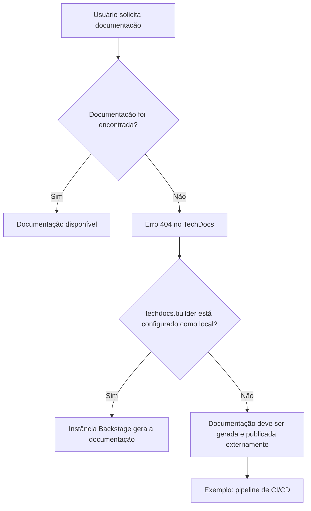

# Diagnóstico de Página Não Encontrada do TechDocs no Backstage

## 1. Metadados do Documento
- **Arquivo de Origem:** Não identificado
- **Tipo de Documento:** Procedimento
- **Domínio / Sistema:** Backstage TechDocs / Zeus
- **Público-Alvo:** Desenvolvedores, Arquitetos, Operação
- **Data/Versão Identificada:** Não identificada

---

## 2. Resumo Executivo & Contexto de Negócio

O conteúdo apresenta uma página de erro `ERROR 404` do TechDocs em uma aplicação Backstage. A página informa que a documentação solicitada não foi encontrada.

A causa indicada é que `techdocs.builder` não está configurado como `local`. Nessa condição, a instância Backstage não gera documentos quando eles não são localizados.

O texto orienta que a documentação do projeto deve ser gerada e publicada por um processo externo, citando um pipeline de CI/CD como exemplo. Alternativamente, a configuração `techdocs.builder` pode ser alterada para `local` para permitir a geração de documentação pela própria instância Backstage.

O conteúdo também oferece as ações de voltar, contatar o suporte caso seja considerado um erro, e acessar elementos de navegação como `Home`, `Solutions`, `APIs`, `Documentation`, `Zeus`, `EN` e `CF`.

---

## 3. Arquitetura, Componentes & Tecnologias Envolvidas

Componentes e conceitos explicitamente mencionados:

- **Backstage app:** aplicação que exibe a página de erro.
- **TechDocs:** recurso de documentação associado à aplicação Backstage.
- **`techdocs.builder`:** configuração que define o comportamento de geração da documentação.
- **Builder `local`:** opção que permite gerar a documentação a partir da instância Backstage.
- **Processo externo:** mecanismo alternativo para gerar e publicar a documentação.
- **Pipeline de CI/CD:** exemplo de processo externo para geração e publicação da documentação.
- **Projeto:** entidade cuja documentação deve ser gerada e publicada.
- **Support:** canal sugerido para reporte de possível defeito.



**Nota de Análise:** O conteúdo não identifica a configuração completa da aplicação, o repositório do projeto, a origem da documentação, comandos de publicação, pipeline específico ou os formatos documentais suportados.

---

## 4. Regras de Negócio, Especificações Funcionais & Processos

1. Quando uma página TechDocs não é encontrada, a aplicação Backstage apresenta o erro `ERROR 404: j: Page not found.`.
2. Se `techdocs.builder` não estiver configurado como `local`, a aplicação Backstage não gerará documentação ausente.
3. Quando o builder não é `local`, a documentação do projeto deve ser:
   1. Gerada por processo externo.
   2. Publicada por processo externo.
4. O texto cita um pipeline de CI/CD como exemplo de processo externo para geração e publicação da documentação.
5. Como alternativa ao processo externo, a configuração `techdocs.builder` pode ser alterada para `local`.
6. Quando `techdocs.builder` é configurado como `local`, a instância Backstage pode gerar a documentação.
7. Caso o erro seja considerado um defeito, o usuário é orientado a contatar o suporte.
8. A página disponibiliza uma ação de retorno, expressa como `Go back`.

---

## 5. Tabelas de Parâmetros, Ambientes e Estruturas de Dados

| Item / Parâmetro | Descrição / Função | Tipo / Valores / Formato | Ambiente / Observações |
| :--- | :--- | :--- | :--- |
| `ERROR 404` | Indica que a página solicitada não foi encontrada. | Código/mensagem de erro | Exibido na página TechDocs. |
| `techdocs.builder` | Configuração relacionada à geração de documentação. | Configuração; valor citado: `local` | Quando não é `local`, o Backstage não gera documentos ausentes. |
| `local` | Valor de configuração que permite a geração de documentação pela instância Backstage. | Valor de `techdocs.builder` | Alternativa ao processo externo de geração/publicação. |
| Processo externo | Responsável por gerar e publicar documentos quando o builder não é `local`. | Processo operacional | Um pipeline de CI/CD é citado como exemplo. |
| CI/CD pipeline | Exemplo de processo externo para geração e publicação da documentação. | Pipeline | Não há plataforma, ferramenta, etapas ou configuração detalhadas. |
| `Home` | Item de navegação exibido. | Rótulo de interface | Página de erro. |
| `Solutions` | Item de navegação exibido. | Rótulo de interface | Página de erro. |
| `APIs` | Item de navegação exibido. | Rótulo de interface | Página de erro. |
| `Documentation` | Item de navegação exibido. | Rótulo de interface | Página de erro. |
| `Zeus` | Elemento exibido na navegação. | Nome/rótulo | O conteúdo não explica o significado de Zeus. |
| `EN` | Elemento exibido na interface. | Rótulo | O conteúdo não detalha sua função. |
| `CF` | Elemento exibido na interface. | Rótulo | O conteúdo não detalha sua função. |

---

## 6. Bateria de Perguntas & Respostas para RAG (FAQ Sintético)

### P1: O que significa o erro `ERROR 404` exibido pelo TechDocs?
**R:** O erro informa que a página solicitada não foi encontrada: `ERROR 404: j: Page not found.`. O conteúdo associa essa condição à ausência de documentação disponível para a aplicação Backstage.

### P2: Por que a instância Backstage não gera a documentação ausente?
**R:** O texto afirma que `techdocs.builder` não está configurado como `local`. Nessa configuração, a aplicação Backstage não gera documentos caso eles não sejam encontrados.

### P3: O que deve acontecer quando `techdocs.builder` não é `local`?
**R:** A documentação do projeto deve ser gerada e publicada por algum processo externo. O texto apresenta um pipeline de CI/CD como exemplo desse processo externo.

### P4: Qual alternativa permite que a própria instância Backstage gere a documentação?
**R:** A alternativa indicada é alterar `techdocs.builder` para `local`. Segundo o texto, essa configuração permite gerar os documentos a partir da instância Backstage.

### P5: O documento informa qual pipeline de CI/CD deve publicar a documentação?
**R:** Não. O conteúdo apenas cita um pipeline de CI/CD como exemplo de processo externo. Não são informadas ferramenta, configuração, repositório, etapas ou comandos do pipeline.

### P6: O que fazer se a página ausente for considerada um defeito?
**R:** A página orienta o usuário a contatar o suporte caso considere que o problema é um bug.

### P7: Quais ações de navegação são apresentadas na página de erro?
**R:** O conteúdo mostra a ação `Go back` e itens de navegação identificados como `Home`, `Solutions`, `APIs`, `Documentation`, `Zeus`, `EN` e `CF`.

### P8: O conteúdo confirma que a documentação nunca será gerada pelo Backstage?
**R:** Não. O conteúdo afirma que a geração não ocorrerá quando `techdocs.builder` não estiver configurado como `local`. Ele também apresenta `local` como alternativa para gerar documentação pela instância Backstage.

### P9: O documento detalha onde a documentação publicada externamente deve ser armazenada?
**R:** Não. Não há informação sobre local de armazenamento, repositório, bucket, URL, integração de publicação ou mecanismo de descoberta pelo TechDocs.

### P10: O documento detalha como configurar `techdocs.builder`?
**R:** Não. O texto apenas menciona que a configuração não está como `local` e sugere alterá-la para `local`. Não são fornecidos arquivos de configuração, sintaxe, comandos ou exemplos completos.

---

## 7. Glossário de Termos, Siglas & Conceitos-Chave

- **404:** Código de erro exibido para indicar que uma página não foi encontrada.
- **Backstage:** Aplicação mencionada como responsável por exibir a página TechDocs.
- **TechDocs:** Recurso de documentação associado à aplicação Backstage.
- **`techdocs.builder`:** Configuração mencionada para controlar a geração de documentação.
- **`local`:** Valor citado para `techdocs.builder`, permitindo gerar documentação pela instância Backstage.
- **CI/CD:** Termo citado como exemplo de pipeline externo para gerar e publicar documentação. O significado da sigla não é expandido no conteúdo original.
- **Zeus:** Rótulo exibido na navegação; sem definição adicional no conteúdo.
- **CF:** Rótulo exibido na interface; sem definição adicional no conteúdo.

---

## 8. Notas Críticas, Riscos & Limitações

- A documentação solicitada não foi encontrada, resultando em erro 404.
- A instância Backstage não gerará documentação ausente enquanto `techdocs.builder` não estiver definido como `local`.
- A alternativa de processo externo introduz dependência operacional de geração e publicação da documentação.
- O texto cita CI/CD somente como exemplo; não fornece detalhes sobre pipeline, responsabilidade, automação, falhas, monitoramento ou recuperação.
- Não há identificação de projeto, URL solicitada, ambiente, proprietário técnico ou canal específico de suporte.
- **Nota de Análise:** O conteúdo é uma página de erro resumida e não detalha a configuração completa do TechDocs, contratos, rotas, permissões ou procedimento operacional de correção.

---

## 9. Conteúdo Bruto Estruturado (Referência Fiel)

```text
--- [PÁGINA 1 DE 1] ---

ERROR 404: j: Page not found.
Note that techdocs.builder is not set to 'local' in
your config, which means this Backstage app will
not generate docs if they are not found. Make sure
the project's docs are generated and published by
some external process (e.g. CI/CD pipeline). Or
change techdocs.builder to 'local' to generate docs
from this Backstage instance.
Looks like someone
dropped the mic!
Go back... or please  if you
think this is a bug.
contact support
 /
 CF
Home Solutions APIs Documentation Zeus
EN
```
