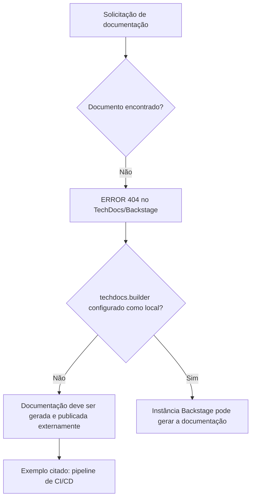

# Erro 404 do TechDocs/Backstage — Documentação Não Encontrada

## 1. Metadados do Documento
- **Arquivo de Origem:** Não identificado
- **Tipo de Documento:** Procedimento / Página de erro técnica
- **Domínio / Sistema:** Backstage TechDocs; navegação “CF Home Solutions APIs Documentation Zeus”
- **Público-Alvo:** Desenvolvedores, Arquitetos, Operação
- **Data/Versão Identificada:** Não identificada

---

## 2. Resumo Executivo & Contexto de Negócio

O conteúdo representa uma página de erro `ERROR 404` do TechDocs em uma aplicação Backstage. A página informa que a documentação solicitada não foi encontrada.

A mensagem indica que `techdocs.builder` não está configurado como `local`. Nessa condição, a instância Backstage não gera documentos quando eles não são localizados.

O texto orienta que a documentação do projeto deve ser gerada e publicada por um processo externo, citando como exemplo um pipeline de CI/CD. Como alternativa, a configuração `techdocs.builder` pode ser alterada para `local`, permitindo que a instância Backstage gere a documentação.

Não há especificação de projeto, URL solicitada, repositório, pipeline, tecnologia de geração de documentação ou responsável operacional. O conteúdo limita-se ao diagnóstico de indisponibilidade e às alternativas gerais de correção.

---

## 3. Arquitetura, Componentes & Tecnologias Envolvidas

Componentes e termos identificados:

| Componente / Termo | Descrição sustentada pelo conteúdo |
| :--- | :--- |
| Backstage | Aplicação que apresenta a página de erro e a documentação TechDocs. |
| TechDocs | Mecanismo de documentação referido pela configuração `techdocs.builder`. |
| `techdocs.builder` | Configuração cujo valor atual não é `local`, segundo a mensagem de erro. |
| `local` | Valor de configuração que permitiria gerar documentos a partir da instância Backstage. |
| Processo externo | Mecanismo esperado para gerar e publicar documentação quando o builder não é local. |
| CI/CD pipeline | Exemplo de processo externo que pode gerar e publicar a documentação. |
| CF Home Solutions APIs Documentation Zeus | Elementos exibidos na navegação da página. |
| `ERROR 404` | Condição apresentada: página ou documentação não encontrada. |



> **Nota de Análise:** O conteúdo não detalha a arquitetura interna do Backstage, a origem da solicitação, o repositório da documentação, contratos de integração ou a implementação do pipeline de CI/CD.

---

## 4. Regras de Negócio, Especificações Funcionais & Processos

1. A página apresenta `ERROR 404`, indicando que a página/documentação requisitada não foi encontrada.
2. A configuração `techdocs.builder` não está definida como `local`.
3. Quando `techdocs.builder` não está configurado como `local`, a aplicação Backstage não gera documentos que não são encontrados.
4. Para disponibilizar a documentação nessa configuração, o projeto deve ter documentação gerada e publicada por algum processo externo.
5. Um pipeline de CI/CD é citado como exemplo de processo externo de geração e publicação.
6. Como alternativa, `techdocs.builder` pode ser alterado para `local`, permitindo a geração de documentação a partir da instância Backstage.
7. A página oferece a ação “Go back” e orienta o contato com o suporte caso o comportamento seja considerado um bug.

---

## 5. Tabelas de Parâmetros, Ambientes e Estruturas de Dados

| Item / Parâmetro | Descrição / Função | Tipo / Valores / Formato | Ambiente / Observações |
| :--- | :--- | :--- | :--- |
| `ERROR 404` | Indica que a página/documentação não foi encontrada. | Código de erro exibido em texto. | Página TechDocs/Backstage. |
| `techdocs.builder` | Controla o modo de geração da documentação TechDocs. | Configuração; o valor `local` é citado. | O conteúdo afirma que não está definido como `local`. |
| `local` | Alternativa de valor para `techdocs.builder`. | Valor de configuração. | Permite gerar documentação a partir da instância Backstage, segundo o texto. |
| Processo externo | Deve gerar e publicar a documentação quando ela não for localizada pela instância. | Processo operacional/técnico. | Um pipeline de CI/CD é citado como exemplo. |
| CI/CD pipeline | Exemplo de processo externo para geração e publicação de documentação. | Pipeline de integração e entrega contínuas. | Não há detalhes de ferramenta, estágio ou configuração. |
| `CF` | Item exibido na navegação. | Rótulo textual. | Sem detalhamento adicional. |
| Home | Item exibido na navegação. | Rótulo textual. | Sem detalhamento adicional. |
| Solutions | Item exibido na navegação. | Rótulo textual. | Sem detalhamento adicional. |
| APIs | Item exibido na navegação. | Rótulo textual. | Sem detalhamento adicional. |
| Documentation | Item exibido na navegação. | Rótulo textual. | Sem detalhamento adicional. |
| Zeus | Item exibido na navegação. | Rótulo textual. | Sem detalhamento adicional. |
| `EN` | Indicador de idioma exibido. | Código textual. | Provavelmente inglês; o documento não explica explicitamente o significado. |

---

## 6. Bateria de Perguntas & Respostas para RAG (FAQ Sintético)

### P1: O que significa o `ERROR 404` exibido na página TechDocs?
**R:** O `ERROR 404` indica que a página ou documentação solicitada não foi encontrada pela aplicação TechDocs/Backstage.

### P2: Por que a instância Backstage não gera a documentação ausente?
**R:** A mensagem informa que `techdocs.builder` não está configurado como `local`. Nessa configuração, a instância Backstage não gera documentos quando eles não são encontrados.

### P3: Qual configuração é mencionada como alternativa para gerar documentos diretamente no Backstage?
**R:** O texto indica que `techdocs.builder` pode ser alterado para `local`, permitindo que a documentação seja gerada a partir da instância Backstage.

### P4: Como a documentação deve ser disponibilizada quando `techdocs.builder` não é `local`?
**R:** O projeto deve ter a documentação gerada e publicada por um processo externo.

### P5: Qual exemplo de processo externo é citado para publicação da documentação?
**R:** A página cita um pipeline de CI/CD como exemplo de processo externo responsável por gerar e publicar a documentação.

### P6: A página informa qual pipeline de CI/CD deve ser utilizado?
**R:** Não. O conteúdo apenas cita “CI/CD pipeline” como exemplo, sem identificar ferramenta, repositório, etapas ou configuração.

### P7: O documento detalha a URL ou o recurso específico que causou o erro 404?
**R:** Não. A página apresenta o erro, mas não informa a URL requisitada nem o nome do documento ausente.

### P8: O que fazer se a indisponibilidade da página for considerada um bug?
**R:** A página orienta o usuário a entrar em contato com o suporte caso considere que o comportamento seja um bug.

### P9: Quais áreas ou rótulos aparecem na navegação da página?
**R:** A navegação exibe os termos `CF`, `Home`, `Solutions`, `APIs`, `Documentation` e `Zeus`, além do indicador `EN`.

---

## 7. Glossário de Termos, Siglas & Conceitos-Chave

- **404:** Código de erro exibido para indicar que a página/documentação não foi encontrada.
- **Backstage:** Aplicação mencionada como a instância que não gerará documentos ausentes quando a configuração não estiver em modo local.
- **TechDocs:** Componente/mecanismo de documentação referido pela configuração `techdocs.builder`.
- **`techdocs.builder`:** Configuração do TechDocs mencionada na mensagem de erro.
- **`local`:** Valor de configuração citado como alternativa para que a instância Backstage gere documentos.
- **CI/CD:** Termo citado como exemplo de pipeline externo para gerar e publicar documentação. O texto não expande a sigla.
- **CF:** Rótulo apresentado na navegação, sem definição no conteúdo.
- **Zeus:** Rótulo apresentado na navegação, sem definição no conteúdo.

---

## 8. Notas Críticas, Riscos & Limitações

- O conteúdo não identifica o arquivo de origem, autor, versão, data, URL ou recurso de documentação ausente.
- Não há instruções operacionais detalhadas para alterar `techdocs.builder`.
- Não são informados repositórios, comandos, permissões, ferramentas de CI/CD ou processos de publicação.
- A configuração não local cria dependência de um processo externo para que a documentação seja gerada e publicada.
- **Nota de Análise:** O documento não especifica se o processo externo de CI/CD existe, está ativo ou falhou; ele apenas o apresenta como exemplo.
- **Nota de Análise:** Os rótulos `CF`, `Home`, `Solutions`, `APIs`, `Documentation` e `Zeus` não recebem definição funcional adicional.

---

## 9. Conteúdo Bruto Estruturado (Referência Fiel)

```text
--- [PÁGINA 1 DE 1] ---

ERROR 404: j: Page not found.
Note that techdocs.builder is not set to 'local' in
your config, which means this Backstage app will
not generate docs if they are not found. Make sure
the project's docs are generated and published by
some external process (e.g. CI/CD pipeline). Or
change techdocs.builder to 'local' to generate docs
from this Backstage instance.
Looks like someone
dropped the mic!
Go back... or please  if you
think this is a bug.
contact support
 / 
 CF
Home Solutions APIs Documentation Zeus
EN
```
