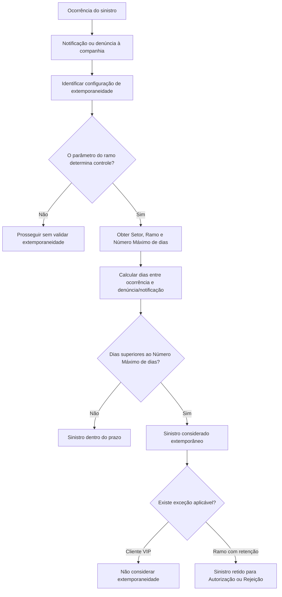

# Definição de Extemporaneidade para Sinistros por Setor e Ramo

## 1. Metadados do Documento
- **Arquivo de Origem:** Não identificado no conteúdo fornecido
- **Tipo de Documento:** Especificação Técnica
- **Domínio / Sistema:** Gestão de sinistros — definição e validação de extemporaneidade
- **Público-Alvo:** Negócio, analistas funcionais, desenvolvedores e operação
- **Data/Versão Identificada:** Não identificada

---

## 2. Resumo Executivo & Contexto de Negócio

O documento define o conceito de **extemporaneidade** no contexto de sinistros. A finalidade é estabelecer, para todos os ramos, o tempo máximo permitido entre a data de ocorrência de um sinistro e a data em que o sinistro é notificado ou denunciado à companhia.

A validação de extemporaneidade é configurável por ramo por meio de um parâmetro de sinistros. Esse parâmetro determina se a verificação deve ser aplicada durante a abertura e a modificação de sinistros. Portanto, o controle não é obrigatório de forma universal.

A configuração utiliza propriedades de **Setor**, **Ramo** e **Número Máximo de dias**. Setor e Ramo aceitam valores genéricos, permitindo que uma definição seja aplicada a todos os setores ou a todos os ramos de um setor, conforme a chave configurada.

Um sinistro é considerado extemporâneo, ou seja, fora de prazo, quando a diferença entre a data de ocorrência e a data de denúncia ou notificação for superior ao número máximo de dias definido. Mesmo quando o controle está habilitado, o documento informa que podem existir exceções, como clientes VIP ou determinados ramos que devem seguir retenção para autorização ou rejeição.

---

## 3. Arquitetura, Componentes & Tecnologias Envolvidas

O conteúdo não descreve uma arquitetura de software detalhada, tecnologias, endpoints, contratos de integração, bancos de dados ou ambientes técnicos. O documento apresenta uma lógica funcional de parametrização e validação de sinistros por companhia, setor e ramo.

Componentes e conceitos identificados:

| Componente / Conceito | Papel identificado |
| :--- | :--- |
| Companhia | Destinatária da notificação ou denúncia do sinistro. |
| Sinistro | Entidade cuja extemporaneidade pode ser validada. |
| Parâmetro de sinistros por ramo | Define se a extemporaneidade é validada na abertura e modificação de sinistros. |
| Setor | Chave usada para definir o prazo máximo; admite chave genérica para todos os setores. |
| Ramo | Chave usada para definir o prazo máximo; admite chave genérica para todos os ramos de um setor. |
| Número Máximo de dias | Limite de dias entre ocorrência e denúncia/notificação. |
| Abertura de sinistro | Momento em que a validação de extemporaneidade pode ocorrer. |
| Modificação de sinistro | Momento em que a validação de extemporaneidade pode ocorrer. |
| Autorização / Rejeição | Possíveis tratamentos para sinistro retido em determinados ramos. |



> **Nota de Análise:** O documento não detalha como a diferença de dias é calculada, quais operações são bloqueadas, quais mensagens são apresentadas ao usuário, nem quais critérios determinam as exceções.

---

## 4. Regras de Negócio, Especificações Funcionais & Processos

### 4.1. Objetivo da definição de extemporaneidade

A definição de extemporaneidade estabelece o tempo máximo que pode transcorrer entre:

1. A **data de ocorrência do sinistro**; e
2. A **data de notificação ou denúncia do sinistro à companhia**.

A regra é aplicável a todos os ramos por meio de configuração específica.

### 4.2. Ativação do controle

Existe um parâmetro de sinistros no nível de ramo que indica se a extemporaneidade deve ser validada. A validação pode ser aplicada em dois eventos:

1. **Abertura de sinistros**.
2. **Modificação de sinistros**.

O controle de extemporaneidade não é obrigatório. A lógica de configuração no nível de ramo permite determinar se a validação será ou não realizada.

### 4.3. Configuração por setor

A propriedade **Setor** identifica a chave do setor para o qual será definido o número máximo de dias entre a ocorrência e a denúncia do sinistro.

A propriedade Setor pode receber uma chave genérica. A chave genérica representa uma configuração aplicável a todos os setores.

### 4.4. Configuração por ramo

A propriedade **Ramo** identifica a chave do ramo para o qual será definido o número máximo de dias entre a ocorrência e a denúncia do sinistro.

A propriedade Ramo pode receber uma chave genérica. Nesse caso, a configuração é aplicável a todos os ramos do setor correspondente.

### 4.5. Critério de classificação como extemporâneo

A propriedade **Número Máximo de dias** define o limite de dias permitido entre a data de ocorrência e a data de denúncia ou notificação à companhia.

A regra de classificação é:

- Se a quantidade de dias entre a ocorrência e a denúncia/notificação for **superior** ao Número Máximo de dias configurado, o sinistro será considerado **extemporâneo**, isto é, fora de prazo.
- O documento não define o comportamento quando a quantidade de dias for igual ao Número Máximo de dias. Pela redação apresentada, somente valores superiores caracterizam extemporaneidade.

### 4.6. Exceções e tratamentos específicos

Mesmo que a companhia contemple a aplicação do controle de extemporaneidade, podem ser realizadas exceções.

Exceções explicitamente citadas:

1. Para um **cliente VIP**, a extemporaneidade pode não ser considerada.
2. Para determinado **Ramo**, a extemporaneidade pode não ser considerada, mas o sinistro pode permanecer retido para ser **Autorizado** ou **Rejeitado**.

> **Nota de Análise:** O documento não informa como clientes VIP são identificados, quais ramos possuem retenção, quem executa a autorização ou rejeição, nem quais são os estados posteriores do sinistro.

---

## 5. Tabelas de Parâmetros, Ambientes e Estruturas de Dados

| Item / Parâmetro | Descrição / Função | Tipo / Valores / Formato | Ambiente / Observações |
| :--- | :--- | :--- | :--- |
| Parâmetro de sinistros por ramo | Indica se a validação de extemporaneidade é aplicada. | Controla validação: sim ou não. | Aplicável na abertura e modificação de sinistros. |
| Setor | Chave do setor para o qual é definido o prazo máximo. | Chave de setor ou chave genérica. | A chave genérica é aplicável a todos os setores. |
| Ramo | Chave do ramo para o qual é definido o prazo máximo. | Chave de ramo ou chave genérica. | A chave genérica é aplicável a todos os ramos do setor. |
| Número Máximo de dias | Define o limite máximo entre a ocorrência e a denúncia/notificação do sinistro. | Número de dias. | Sinistro é extemporâneo quando a diferença for superior ao valor configurado. |
| Data de ocorrência | Data em que ocorreu o sinistro. | Data. | Usada no cálculo de extemporaneidade. |
| Data de denúncia | Data em que o sinistro foi denunciado. | Data. | Pode ser usada para comparar com a data de ocorrência. |
| Data de notificação | Data em que o sinistro foi notificado à companhia. | Data. | O documento trata denúncia e notificação como referências para o prazo. |
| Cliente VIP | Cliente para o qual a extemporaneidade pode não ser considerada. | Critério de exceção. | O critério de identificação de cliente VIP não foi detalhado. |
| Retenção para autorização ou rejeição | Tratamento possível para determinado ramo sem consideração de extemporaneidade. | Estado ou tratamento operacional. | O fluxo de autorização/rejeição não foi detalhado. |

> **Nota de Análise:** O conteúdo não apresenta servidores, URLs, ambientes, variáveis de log, tipos técnicos de dados, nomes de tabelas, APIs ou contratos JSON.

---

## 6. Bateria de Perguntas & Respostas para RAG (FAQ Sintético)

### P1: O que é extemporaneidade no processo de sinistros?
**R:** Extemporaneidade é a condição em que o tempo transcorrido entre a data de ocorrência de um sinistro e a data de denúncia ou notificação à companhia é superior ao Número Máximo de dias configurado. Nessa condição, o sinistro é considerado fora de prazo.

### P2: A validação de extemporaneidade é obrigatória para todos os sinistros?
**R:** Não. O documento informa que existe uma lógica no nível de Ramo que permite determinar se a extemporaneidade será controlada ou não. O parâmetro de sinistros por ramo indica se a validação é aplicada.

### P3: Em quais operações a extemporaneidade pode ser validada?
**R:** A extemporaneidade pode ser validada na abertura de sinistros e na modificação de sinistros, conforme o parâmetro de sinistros configurado no nível de Ramo.

### P4: Quando um sinistro é considerado extemporâneo?
**R:** Um sinistro é considerado extemporâneo quando o número de dias entre a data de ocorrência e a data de denúncia ou notificação à companhia é superior ao Número Máximo de dias definido para a configuração aplicável.

### P5: Para que serve a propriedade Setor na definição de extemporaneidade?
**R:** A propriedade Setor indica a chave do setor para o qual será definido o número máximo de dias permitido entre a ocorrência e a denúncia do sinistro. Também pode ser utilizada uma chave genérica para aplicar uma definição a todos os setores.

### P6: Para que serve a propriedade Ramo na definição de extemporaneidade?
**R:** A propriedade Ramo indica a chave do ramo para o qual será definido o prazo máximo entre a data de ocorrência e a data de denúncia do sinistro. A chave genérica pode ser usada para que a configuração seja aplicada a todos os ramos de um setor.

### P7: O que representa o Número Máximo de dias?
**R:** O Número Máximo de dias representa o limite máximo de dias que pode transcorrer entre a data de ocorrência de um sinistro e sua denúncia ou notificação à companhia. Se o período for superior a esse limite, o sinistro é considerado extemporâneo.

### P8: Um cliente VIP pode ser tratado como exceção à extemporaneidade?
**R:** Sim. O documento apresenta como exemplo que, para um cliente VIP, a extemporaneidade pode não ser levada em consideração, mesmo quando a companhia prevê a aplicação do controle.

### P9: Um ramo pode não considerar a extemporaneidade e ainda reter o sinistro?
**R:** Sim. O documento informa que é possível definir que, para determinado Ramo, a extemporaneidade não seja considerada, mas o sinistro permaneça retido para ser Autorizado ou Rejeitado.

### P10: O documento especifica como identificar clientes VIP?
**R:** Não. O conteúdo apenas apresenta clientes VIP como exemplo de exceção, sem detalhar atributos, regras, cadastros ou critérios usados para identificar esse tipo de cliente.

### P11: O documento define o fluxo de autorização ou rejeição de sinistros retidos?
**R:** Não. O conteúdo informa que um sinistro pode ficar retido para ser Autorizado ou Rejeitado, mas não descreve responsáveis, etapas, estados, critérios ou ações posteriores desse fluxo.

### P12: O que acontece quando o período entre ocorrência e denúncia é igual ao Número Máximo de dias?
**R:** O documento define como extemporâneo somente o sinistro cujo número de dias seja superior ao atributo Número Máximo de dias. Não há detalhamento adicional sobre o caso de igualdade, mas a redação não classifica expressamente esse caso como extemporâneo.

---

## 7. Glossário de Termos, Siglas & Conceitos-Chave

- **Autorizado:** Resultado possível mencionado para um sinistro retido em determinado Ramo.
- **Companhia:** Entidade à qual o sinistro é notificado ou denunciado.
- **Denúncia de sinistro:** Comunicação do sinistro à companhia.
- **Extemporaneidade:** Condição em que um sinistro é considerado fora de prazo por superar o Número Máximo de dias entre ocorrência e denúncia/notificação.
- **Número Máximo de dias:** Limite de tempo configurado entre a ocorrência do sinistro e sua denúncia ou notificação.
- **Notificação de sinistro:** Comunicação do sinistro à companhia.
- **Ramo:** Chave de classificação usada para configurar a validação e o prazo de extemporaneidade.
- **Rejeitado:** Resultado possível mencionado para um sinistro retido em determinado Ramo.
- **Setor:** Chave de classificação usada para definir o prazo máximo aplicável.
- **Sinistro:** Evento cuja ocorrência e denúncia/notificação são usadas na avaliação de extemporaneidade.

---

## 8. Notas Críticas, Riscos & Limitações

- O documento não identifica o arquivo de origem, a versão, a data, o sistema proprietário ou a equipe responsável pela manutenção da parametrização.
- Não foram detalhados métodos de cálculo de dias, incluindo calendário, feriados, fuso horário, datas nulas, datas futuras ou tratamento de diferenças negativas.
- Não há definição de precedência entre configuração genérica de Setor, configuração genérica de Ramo e configurações específicas.
- O mecanismo técnico de configuração do parâmetro de sinistros por ramo não foi apresentado.
- Não foram informadas mensagens operacionais, códigos de erro, logs, trilhas de auditoria, APIs, telas ou contratos de integração.
- As exceções para clientes VIP e para ramos com retenção são citadas apenas como exemplos; critérios de elegibilidade e governança não foram detalhados.
- O fluxo de retenção, autorização e rejeição não contém responsáveis, estados, níveis de aprovação ou consequências operacionais.
- Não foram descritos impactos da classificação de um sinistro como extemporâneo além da indicação de que ele está fora de prazo.

---

## 9. Conteúdo Bruto Estruturado (Referência Fiel)

```text
--- [PÁGINA 1 DE 3] ---

DEFINICIÓN de Extemporaneidad
Objetivo
La finalidad es definir para todos los ramos, el tiempo máximo que puede transcurrir entre la fecha de
ocurrencia del siniestro y la fecha de notificación o denuncia de este, a la compañía.
Hay un parámetro de siniestros a nivel de ramo, que indica si se valida la extemporaneidad o no en la
apertura y modificación de siniestros.
Imagen del Mantenimiento Definición de Extemporaneidad:
 / 
 CF
Home Solutions APIs Documentation Zeus
EN


--- [PÁGINA 2 DE 3] ---

Propiedades por Ramo
En este apartado se detallarán todas las propiedades específicas del ramo.
Sector
Esta propiedad indica la clave del Sector para el que se va a definir el número máximo de días que
puede transcurrir entre la fecha de ocurrencia y la fecha de denuncia del siniestro. Puede utilizarse el
genérico, que indica para todos los sectores.
Ramo
Esta propiedad indica la clave del Ramo para el que se va a definir el número máximo de días que
puede transcurrir entre la fecha de ocurrencia y la fecha de denuncia del siniestro.
Esta propiedad permite introducir la clave genérica, que en este caso significaría para todos los
ramos del sector.
Número Máximo de días
Esta propiedad indica el número máximo de días que puede transcurrir entre la fecha de ocurrencia
y la fecha de denuncia o notificación a la compañía. Si el número de días entre ambas fechas es


--- [PÁGINA 3 DE 3] ---

superior al indicado en este atributo, el siniestro se considerará extemporáneo, es decir fuera de
plazo.
Preguntas frecuentes
¿Es obligatorio controlar la extemporaneidad?
No es obligatorio.Hay una lógica a nivel de Ramo dónde se puede determinar si se controla o
no. Es decir se puede o no controlar la extemporaneidad, con el parámetro a nivel de compañía y
aunque se contemple que sí se aplique, se pueden realizar excepciones.
Ejemplos:
- Se puede evaluar que para un cliente VIP, no se tenga en cuenta la extemporaneidad.
- Se puede indicar que para determinado Ramo no se tenga en cuenta la extemporaneidad, pero
se quede retenido el siniestro para ser Autorizado o Rechazado.
```
