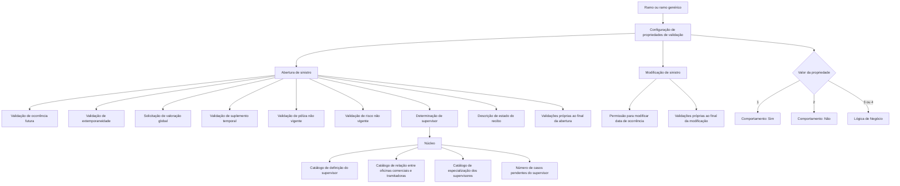

# Definição de Validações de Sinistros — Propriedades Configuráveis por Ramo

## 1. Metadados do Documento
- **Arquivo de Origem:** Não identificado no conteúdo fornecido
- **Tipo de Documento:** Especificação Técnica / Manual Funcional
- **Domínio / Sistema:** Operações de tramitação e abertura de sinistros por ramo de seguro
- **Público-Alvo:** Analistas funcionais, desenvolvedores, arquitetos, operação de sinistros e equipes de parametrização
- **Data/Versão Identificada:** Não identificada

---

## 2. Resumo Executivo & Contexto de Negócio

O documento descreve propriedades de configuração usadas para variar, por ramo de seguro, o comportamento funcional das operações de tramitação, abertura e modificação de sinistros. As propriedades permitem que diferentes ramos possuam validações adicionais, permissões específicas ou regras condicionais de negócio.

A configuração pode ser definida para uma chave de ramo específica ou para um ramo genérico, aplicável a todos os ramos. O objetivo é permitir a adaptação do processo de sinistros a particularidades de produtos, coberturas, riscos segurados e regras locais de cada instalação ou país.

Diversas propriedades adotam um modelo comum de decisão: `1` para “Sim”, `2` para “Não” e `3` ou `4` para “Lógica de Negócio”. Quando a configuração contém os valores `3` ou `4`, uma lógica de negócio deve avaliar outros fatores para determinar o comportamento efetivo durante a operação.

O documento também trata de exceções relacionadas a suplementos temporais, apólices ou riscos não vigentes em ramos não relacionados a transporte, com atenção especial a Ramos de Vida. Além disso, especifica extensibilidade por país para validações próprias no final da abertura ou da modificação de sinistros.

---

## 3. Arquitetura, Componentes & Tecnologias Envolvidas

Os elementos funcionais identificados no documento são:

- **Propriedades de Validações de Sinistros:** conjunto de atributos parametrizáveis por ramo.
- **Ramo:** chave que determina o escopo da configuração funcional.
- **Ramo genérico:** definição aplicável a todos os ramos que compartilham as mesmas validações.
- **Abertura de sinistro:** operação que cria ou registra um sinistro.
- **Modificação de sinistro:** operação que altera informações de um sinistro já existente.
- **Lógica de Negócio:** lógica utilizada quando uma propriedade recebe o valor `3` ou `4`.
- **Póliza:** contrato de seguro avaliado nas validações de vigência.
- **Risco:** item ou unidade segurada dentro de uma póliza; pode ser relevante quando uma póliza possui múltiplos riscos.
- **Suplemento temporal:** suplemento associado a um período determinado, que pode ou não ser considerado para abertura de sinistro.
- **Supervisor:** responsável ao qual um sinistro é atribuído na abertura.
- **Catálogos de núcleo:** catálogos utilizados pela lógica de núcleo para determinar o supervisor.
- **Recibo:** elemento cuja ausência pode requerer atribuição de descrição de estado, por exemplo `SR - Sin Recibo`.
- **Validações próprias do país:** lógicas adicionais específicas de uma instalação ou país.



> **Nota de Análise:** O documento não identifica tecnologias de implementação, bancos de dados, APIs, métodos HTTP, contratos JSON, servidores, URLs, ambientes ou caminhos de log.

---

## 4. Regras de Negócio, Especificações Funcionais & Processos

### 4.1 Escopo por ramo

A propriedade **Ramo** contém a chave do ramo para o qual são definidas validações extras ou comportamentos da tramitação de sinistros.

- Quando vários ramos utilizam as mesmas validações, a definição pode ser criada para o **ramo genérico**, aplicável a todos os ramos.
- O documento não descreve a estrutura técnica da chave de ramo nem a precedência entre uma definição específica e uma definição genérica.

### 4.2 Modelo comum de valores para propriedades condicionais

As propriedades de decisão apresentadas no documento utilizam os seguintes valores:

| Valor | Significado |
| :--- | :--- |
| `1` | Sim |
| `2` | Não |
| `3` | Lógica de Negócio |
| `4` | Lógica de Negócio |

Quando o valor da propriedade principal for `3` ou `4`, deve existir uma propriedade ou lógica complementar que avalie outros fatores. Quando o valor for `1` ou `2`, o comportamento é diretamente “Sim” ou “Não”.

### 4.3 Abertura de sinistros a futuro

A propriedade **Se podem abrir sinistros a Futuro** determina se a abertura de sinistro pode registrar uma data de ocorrência posterior ao dia atual.

- “Sinistro a futuro” é um sinistro cuja data de ocorrência é superior à data do dia.
- Valores permitidos: `1`, `2`, `3` e `4`.
- Quando o valor for `3` ou `4`, a propriedade **Lógica que determina se se podem abrir sinistros a Futuro** deve definir a lógica de negócio aplicável.
- O documento não detalha quais fatores devem ser avaliados por essa lógica.

### 4.4 Validação de extemporaneidade

A propriedade **Valida Extemporaneidade** determina se, na abertura do sinistro, deve ser considerada a extemporaneidade.

A extemporaneidade é definida como a consideração do número máximo de dias transcorridos entre:

1. A data de ocorrência do sinistro.
2. A data de denúncia do sinistro à companhia.

Regras:

- Valores permitidos: `1`, `2`, `3` e `4`.
- Quando o valor for `3` ou `4`, a propriedade **Lógica que determina se se valida a Extemporaneidade** deve avaliar outros fatores.
- O documento não informa o número máximo de dias nem os fatores usados pela lógica de negócio.

### 4.5 Solicitação de valoração global do sinistro

A propriedade **Permite Valorar Siniestro** determina se, ao abrir um sinistro, será solicitada uma valoração global.

- Quando a valoração é permitida, a abertura de sinistro solicita a valoração global.
- Quando a valoração não é permitida, a abertura de sinistro não solicita a valoração.
- Valores permitidos: `1`, `2`, `3` e `4`.
- Quando o valor for `3` ou `4`, a propriedade **Lógica que determina se se permite Valorar Siniestro** determina se a valoração global deve ser solicitada.

### 4.6 Alteração da data de ocorrência do sinistro

A propriedade **Permite Modificar Fecha del Siniestro** determina se a data de ocorrência pode ser alterada durante a modificação do sinistro.

- Valores permitidos: `1`, `2`, `3` e `4`.
- Quando o valor for `3` ou `4`, a propriedade **Lógica que determina se se permite Modificar Fecha del Siniestro** deve determinar a permissão com base em outros fatores.
- Se a alteração da data de ocorrência for permitida e a data for modificada, a operação de modificação de sinistro deve verificar se as condições da apólice foram alteradas em relação à data introduzida anteriormente.

### 4.7 Sinistralidade de suplementos temporais

A propriedade **¿Permite Siniestrar Suplementos Temporales?** determina se um suplemento temporal pode ser considerado para sinistro.

- A orientação descrita indica que, normalmente, a propriedade deveria ser afirmativa.
- A justificativa é que muitos suplementos temporais reforçam a cobertura durante um período definido, por exemplo férias, períodos especiais ou circunstâncias especiais.
- Algumas instalações possuem ramos específicos nos quais suplementos temporais são criados exclusivamente para cálculos internos ou regularizações; nesses casos, não se deseja considerar o suplemento no momento da abertura do sinistro.
- Valores permitidos: `1`, `2`, `3` e `4`.
- Quando o valor for `3` ou `4`, a propriedade **Lógica que determina se se permite siniestrar Suplementos Temporales** deve avaliar outros fatores.

### 4.8 Sinistralidade de apólice não vigente — não transportes

A propriedade **¿Permite Siniestrar Póliza No Vigente NO TRANSPORTE?** determina se a abertura de sinistro permite sinistrar uma apólice que não estava vigente na data do sinistro.

- A propriedade somente deveria ser afirmativa em **Ramos de Vida**.
- O motivo indicado é a possibilidade de a apólice ser anulada pela morte do segurado, sendo ainda necessário abrir o sinistro e pagar os beneficiários.
- A data do sinistro corresponde à data de morte do segurado.
- Valores permitidos: `1`, `2`, `3` e `4`.
- Quando o valor for `3` ou `4`, a propriedade **Lógica que determina se se Permite Siniestrar Póliza No Vigente NO TRANSPORTES** deve avaliar outros fatores.
- Esta situação aplica-se a apólices que possuem somente um risco.
- Quando a apólice possui vários riscos, o elemento anulado seria o risco; nesse cenário, deve ser programada a validação da propriedade **Permite Siniestrar Riesgo No Vigente NO TRANSPORTES**.

### 4.9 Sinistralidade de risco não vigente — não transportes

A propriedade **Permite Siniestrar Riesgo No Vigente NO TRANSPORTES** determina se a abertura de sinistro permite sinistrar um risco não vigente na data do sinistro.

- O texto apresenta a descrição inicial como permissão para sinistrar uma apólice não vigente, porém a seção é nomeada para risco não vigente e esclarece que se aplica a apólices com vários riscos.
- A propriedade somente deveria ser afirmativa em **Ramos de Vida**.
- O motivo descrito é a possibilidade de o risco ser anulado pela morte do segurado, sendo necessário abrir o sinistro e pagar os beneficiários.
- A data do sinistro corresponde à data de morte do segurado.
- Valores permitidos: `1`, `2`, `3` e `4`.
- Quando o valor for `3` ou `4`, a propriedade **Lógica que determina se se Permite Siniestrar Riesgo No Vigente NO TRANSPORTES** deve avaliar outros fatores.
- Esta situação aplica-se a apólices com vários riscos.
- Caso a apólice tenha somente um risco, o elemento anulado seria a apólice.

> **Nota de Análise:** O conteúdo possui uma inconsistência textual na descrição inicial da propriedade de risco não vigente, pois menciona “póliza” onde o restante da seção trata do “risco”. A interpretação acima preserva a distinção explicitada entre apólices com um risco e apólices com múltiplos riscos.

### 4.10 Lógica para obtenção de supervisor

A propriedade **Lógica para obtener supervisor** contém a lógica de negócio que determina a qual supervisor um sinistro deve ser atribuído no momento de sua abertura.

No estado inicial, é atribuída a **lógica de núcleo**. A lógica de núcleo utiliza os seguintes catálogos:

1. Catálogo de definição do supervisor.
2. Catálogo de relação entre as oficinas comerciais e as oficinas tramitadoras.
3. Catálogo de especialização dos supervisores.
4. Número de casos pendentes atribuídos ao supervisor.

O documento não detalha a regra de priorização entre esses catálogos nem o algoritmo de distribuição de carga.

### 4.11 Lógica para descrição do estado do recibo

A propriedade **Lógica para obtener descripción del Estado del Recibo** contém uma lógica que atribui uma descrição quando é permitido que a apólice seja emitida sem recibo.

- O documento informa que, em alguns países, a apólice é emitida sem recibo.
- Nesse cenário, a lógica retorna a descrição `SR - Sin Recibo`.

### 4.12 Validações próprias de país

O documento define duas propriedades de extensão:

- **Lógica para validaciones Propias al Final Apertura Siniestros:** permite que a instalação adicione validações próprias do país ao final da abertura de sinistros.
- **Lógica para validaciones Propias al Final de Modificación de Siniestros:** permite que a instalação adicione validações próprias do país ao final da modificação de sinistros.

O documento não detalha quais validações locais existem, a ordem de execução interna, critérios de aprovação/rejeição ou comportamento em caso de falha.

---

## 5. Tabelas de Parâmetros, Ambientes e Estruturas de Dados

| Item / Parâmetro | Descrição / Função | Tipo / Valores / Formato | Ambiente / Observações |
| :--- | :--- | :--- | :--- |
| Ramo | Chave do ramo para o qual são definidas validações extras ou comportamento de tramitação. | Chave de ramo; formato não detalhado. | Pode ser configurado para ramo específico ou ramo genérico. |
| Ramo genérico | Definição compartilhada quando diversos ramos possuem as mesmas validações. | Não detalhado. | Aplicável a todos os ramos, conforme o documento. |
| Se podem abrir sinistros a Futuro | Determina se é permitido registrar um sinistro com data de ocorrência futura. | `1: Si`; `2: No`; `3,4: Lógica de Negocio`. | Aplicado na abertura de sinistros. |
| Lógica que determina se se podem abrir sinistros a Futuro | Define o comportamento quando a propriedade de sinistro a futuro possui valor `3` ou `4`. | Lógica de negócio; implementação não detalhada. | Deve depender da avaliação de outros fatores. |
| Valida Extemporaneidade | Determina se a abertura considera o prazo entre ocorrência e denúncia à companhia. | `1: Si`; `2: No`; `3,4: Lógica de Negocio`. | Número máximo de dias não informado. |
| Lógica que determina se se valida a Extemporaneidade | Define a validação de extemporaneidade quando a propriedade principal possui `3` ou `4`. | Lógica de negócio; implementação não detalhada. | Deve depender de outros fatores. |
| Permite Valorar Siniestro | Determina se a abertura solicita uma valoração global do sinistro. | `1: Si`; `2: No`; `3,4: Lógica de Negocio`. | Se não permitido, a abertura não solicita valoração. |
| Lógica que determina se se permite Valorar Siniestro | Determina se uma valoração global deve ser solicitada quando a propriedade principal possui `3` ou `4`. | Lógica de negócio; implementação não detalhada. | Aplicada na abertura de sinistro. |
| Permite Modificar Fecha del Siniestro | Determina se a data de ocorrência pode ser alterada na modificação do sinistro. | `1: Si`; `2: No`; `3,4: Lógica de Negocio`. | Alteração exige verificação das condições da apólice frente à data anterior. |
| Lógica que determina se se permite Modificar Fecha del Siniestro | Determina a permissão de alteração da data quando a propriedade principal possui `3` ou `4`. | Lógica de negócio; implementação não detalhada. | Deve depender de outros fatores. |
| ¿Permite Siniestrar Suplementos Temporales? | Determina se um suplemento temporal pode ser sinistrado. | `1: Si`; `2: No`; `3,4: Lógica de Negocio`. | Normalmente afirmativo; exceções incluem cálculos internos ou regularizações. |
| Lógica que determina se se permite siniestrar Suplementos Temporales | Determina a permissão de sinistrar suplemento temporal quando a propriedade principal possui `3` ou `4`. | Lógica de negócio; implementação não detalhada. | Deve depender de outros fatores. |
| ¿Permite Siniestrar Póliza No Vigente NO TRANSPORTE? | Determina se uma apólice não vigente na data do sinistro pode ser sinistrada. | `1: Si`; `2: No`; `3,4: Lógica de Negocio`. | Deveria ser afirmativo somente em Ramos de Vida; aplicável a apólices com um risco. |
| Lógica que determina se se Permite Siniestrar Póliza No Vigente NO TRANSPORTES | Determina a permissão para apólice não vigente quando a propriedade principal possui `3` ou `4`. | Lógica de negócio; implementação não detalhada. | Deve depender de outros fatores. |
| Permite Siniestrar Riesgo No Vigente NO TRANSPORTES | Determina se um risco não vigente pode ser sinistrado. | `1: Si`; `2: No`; `3,4: Lógica de Negocio`. | Direcionada a apólices com vários riscos; deveria ser afirmativa somente em Ramos de Vida. |
| Lógica que determina se se Permite Siniestrar Riesgo No Vigente NO TRANSPORTES | Determina a permissão para risco não vigente quando a propriedade principal possui `3` ou `4`. | Lógica de negócio; implementação não detalhada. | Deve depender de outros fatores. |
| Lógica para obtener supervisor | Determina o supervisor ao qual o sinistro é atribuído na abertura. | Lógica de negócio. | Inicialmente utiliza a lógica de núcleo. |
| Catálogo de definição do supervisor | Catálogo de apoio para determinação do supervisor. | Catálogo; estrutura não detalhada. | Utilizado pela lógica de núcleo. |
| Catálogo de relação entre oficinas comerciais e tramitadoras | Catálogo de relação entre oficinas comerciais e oficinas tramitadoras. | Catálogo; estrutura não detalhada. | Utilizado pela lógica de núcleo. |
| Catálogo de especialização dos supervisores | Catálogo de especializações de supervisores. | Catálogo; estrutura não detalhada. | Utilizado pela lógica de núcleo. |
| Número de casos pendentes do supervisor | Quantidade de casos pendentes atribuídos a um supervisor. | Número; formato não detalhado. | Utilizado pela lógica de núcleo. |
| Lógica para obtener descripción del Estado del Recibo | Atribui descrição quando a apólice pode ser emitida sem recibo. | Lógica de negócio. | Em alguns países pode retornar `SR - Sin Recibo`. |
| Lógica para validaciones Propias al Final Apertura Siniestros | Permite adicionar validações específicas do país ao final da abertura. | Lógica de negócio. | Instalação / país. |
| Lógica para validaciones Propias al Final de Modificación de Siniestros | Permite adicionar validações específicas do país ao final da modificação. | Lógica de negócio. | Instalação / país. |

---

## 6. Bateria de Perguntas & Respostas para RAG (FAQ Sintético)

### P1: Como as validações de sinistros podem ser aplicadas a mais de um ramo de seguro?
**R:** As validações podem ser configuradas para a chave de um ramo específico. Quando vários ramos possuem as mesmas validações, a definição pode ser criada para o ramo genérico, que representa todos os ramos.

### P2: Quais valores podem ser usados nas propriedades de validação de sinistros?
**R:** As propriedades apresentadas utilizam `1` para “Sim”, `2` para “Não” e `3` ou `4` para “Lógica de Negócio”. Os valores `3` e `4` exigem uma lógica complementar que avalie outros fatores para determinar o resultado aplicável.

### P3: O que caracteriza um sinistro a futuro?
**R:** Um sinistro a futuro é aquele registrado com data de ocorrência superior à data atual. A propriedade “Se podem abrir sinistros a Futuro” determina se esse tipo de abertura é permitido.

### P4: Quando a lógica de negócio para abertura de sinistros a futuro deve ser usada?
**R:** A lógica de negócio para abertura de sinistros a futuro deve ser definida quando a propriedade “Se podem abrir sinistros a Futuro” possui o valor `3` ou `4`. O documento informa que a decisão deve depender da avaliação de outros fatores, sem detalhá-los.

### P5: O que a validação de extemporaneidade verifica na abertura de sinistros?
**R:** A validação de extemporaneidade verifica se deve ser considerado o número máximo de dias transcorridos entre a data de ocorrência do sinistro e a data em que o sinistro foi denunciado à companhia. O documento não informa qual é esse número máximo de dias.

### P6: O que ocorre quando não é permitida a valoração do sinistro?
**R:** Quando a propriedade “Permite Valorar Siniestro” não permite a valoração, a abertura de sinistro não solicita uma valoração global do sinistro.

### P7: Qual validação deve ser executada após modificar a data de ocorrência de um sinistro?
**R:** Se a modificação da data de ocorrência for permitida e executada, a operação de modificação do sinistro deve verificar se as condições da apólice foram alteradas em relação à data introduzida anteriormente.

### P8: Por que suplementos temporais normalmente devem poder ser sinistrados?
**R:** O documento indica que muitos suplementos temporais são realizados para reforçar a cobertura durante um período determinado, como férias ou períodos especiais com circunstâncias especiais, para que exista cobertura em caso de sinistro.

### P9: Em quais situações um suplemento temporal pode não ser considerado na abertura do sinistro?
**R:** Em algumas instalações e para alguns ramos específicos, suplementos temporais podem ser definidos para cálculos internos ou regularizações. Nesses casos, pode não ser desejado considerá-los no momento da abertura do sinistro.

### P10: Quando uma apólice não vigente pode ser sinistrada em ramos não relacionados a transporte?
**R:** A propriedade “¿Permite Siniestrar Póliza No Vigente NO TRANSPORTE?” somente deveria ser afirmativa em Ramos de Vida. O exemplo apresentado considera uma apólice anulada pela morte do segurado, na qual ainda é necessário abrir o sinistro e pagar os beneficiários; a data do sinistro corresponde à data de morte do segurado.

### P11: Qual é a diferença entre sinistrar uma apólice não vigente e um risco não vigente?
**R:** A validação de apólice não vigente aplica-se ao caso de uma apólice com um único risco. A validação de risco não vigente aplica-se a apólices com vários riscos, pois, nesse cenário, o elemento anulado seria o risco e não necessariamente toda a apólice.

### P12: Como o supervisor é definido na abertura de um sinistro?
**R:** A propriedade “Lógica para obtener supervisor” determina o supervisor durante a abertura do sinistro. Inicialmente é atribuída a lógica de núcleo, que se apoia no catálogo de definição do supervisor, no catálogo de relação entre oficinas comerciais e tramitadoras, no catálogo de especialização dos supervisores e no número de casos pendentes do supervisor.

### P13: Qual descrição pode ser atribuída quando uma apólice é emitida sem recibo?
**R:** Quando é permitido que uma apólice seja emitida sem recibo, a lógica para obtenção da descrição do estado do recibo pode retornar `SR - Sin Recibo`. O documento indica que essa situação ocorre em alguns países.

### P14: Onde podem ser incluídas validações específicas de um país?
**R:** A instalação pode adicionar validações próprias do país por meio da lógica executada ao final da abertura de sinistros e da lógica executada ao final da modificação de sinistros.

---

## 7. Glossário de Termos, Siglas & Conceitos-Chave

- **Abertura de Sinistro:** operação de registrar ou criar um sinistro.
- **Extemporaneidade:** consideração do período máximo entre a data de ocorrência do sinistro e a data de denúncia à companhia.
- **Lógica de Negócio:** lógica usada para determinar um comportamento quando uma propriedade possui valor `3` ou `4`.
- **Lógica de Núcleo:** lógica inicialmente atribuída para determinar o supervisor de um sinistro.
- **Modificação de Sinistro:** operação de alterar informações de um sinistro existente.
- **Oficina Comercial:** escritório comercial mencionado no catálogo de relação com oficinas tramitadoras.
- **Oficina Tramitadora:** escritório relacionado à tramitação de sinistros, mencionado no catálogo de relação com oficinas comerciais.
- **Póliza / Apólice:** contrato de seguro analisado nas validações de vigência.
- **Ramo:** categoria ou linha de seguro usada para definir comportamento e validações específicas.
- **Ramo Genérico:** definição de validações aplicável a todos os ramos.
- **Ramos de Vida:** ramos em que as permissões para sinistrar apólices ou riscos não vigentes deveriam ser afirmativas nos casos descritos.
- **Recibo:** elemento associado à apólice; sua ausência pode resultar na descrição `SR - Sin Recibo`.
- **Risco:** elemento segurado dentro de uma apólice; relevante quando a apólice possui vários riscos.
- **Sinistrar:** abrir ou tratar um sinistro associado a uma cobertura, apólice, risco ou suplemento.
- **Suplemento Temporal:** suplemento válido durante um período determinado, potencialmente utilizado para reforço temporário de cobertura.
- **`SR - Sin Recibo`:** descrição retornada pela lógica de estado do recibo em países nos quais a apólice pode ser emitida sem recibo.

---

## 8. Notas Críticas, Riscos & Limitações

- O documento não identifica o sistema, a versão, a data, o autor, o ambiente ou o arquivo de origem.
- Não são fornecidos contratos de integração, APIs, serviços, bancos de dados, esquemas de dados, URLs, endereços de servidores, portas, credenciais, rotas de logs ou tecnologias de implementação.
- As propriedades com valores `3` e `4` exigem lógica de negócio, mas o documento não define os critérios, fatores de decisão, entradas, saídas ou regras de precedência dessas lógicas.
- O documento não detalha a prioridade entre configurações de ramo específico e configurações de ramo genérico.
- Não é informado o número máximo de dias utilizado pela validação de extemporaneidade.
- A lógica de atribuição de supervisor lista quatro catálogos de suporte, mas não descreve o algoritmo de seleção, priorização ou balanceamento.
- A propriedade de risco não vigente contém uma descrição inicial que menciona apólice não vigente, embora o restante da seção diferencie explicitamente o tratamento de risco não vigente para apólices com múltiplos riscos.
- As validações próprias por país são previstas como pontos de extensão, mas o documento não descreve regras locais concretas, ordem de execução ou estratégia de tratamento de falhas.
- Os exemplos indicados no texto aparecem apenas como “Ejemplo”, sem conteúdo adicional.

---

## 9. Conteúdo Bruto Estruturado (Referência Fiel)

```text
--- [PÁGINA 1 DE 6] ---

DEFINICIÓN de VALIDACIONES SINIESTROS
Objetivo
La finalidad de este documento es conocer que Funcionales de las operaciones de tramitación de
siniestros se pueden variar o condicionar. Estas propiedades permiten definiciones diferentes por
ramo y validaciones extras que se pueden realizar por ramo.
Imagen del Mantenimiento Validaciones de Siniestros:
Propiedades Validaciones de Siniestros
Ramo
Esta propiedad o atributo, contendrá la clave del ramo para el que estamos definiendo validaciones
extras o el comportamiento de la tramitación de siniestros. Si varios ramos tienen las mismas
validaciones, se puede crear la definición para el ramo genérico (todos los ramos).
 / 
 CF
Home Solutions APIs Documentation Zeus
EN


--- [PÁGINA 2 DE 6] ---

Se pueden abrir siniestros a Futuro
Esta propiedad indicará, a la apertura de siniestros, si se va a permitir registrar un siniestro a futuro,
es decir, si se puede registrar un siniestro con una fecha de ocurrencia superior a la del día.
Los valores permitidos serán:
1: Si
2: No
3,4: Lógica de Negocio
Lógica que determina si se pueden abrir siniestros a Futuro
Esta propiedad tendrá valor si la propiedad anterior contiene 3 ó 4. Si no es siempre Si o No, se
tendrá que definir una lógica de Negocio, que dependa de la evaluación de otros factores.
Valida Extemporaneidad
Esta propiedad indicará al sistema, si se tiene en cuenta la extemporaneidad en el momento de abrir
el siniestro, es decir, si se tendrá en cuenta el número máximo de días, que puede transcurrir entre la
fecha de ocurrencia del siniestro y la fecha de denuncia a la compañía.
Los valores permitidos serán:
1: Si
2: No
3,4: Lógica de Negocio
Lógica que determina si se valida la Extemporaneidad
Esta propiedad tendrá valor si la propiedad anterior contiene un 3 ó 4. Si no es siempre "Si" o "No",se
tendrá que definir una lógica de Negocio, que dependa de la evaluación de otros factores.
Permite Valorar Siniestro
Esta propiedad indica si cuando se abra el siniestro, se va a pedir una valoración global del mismo.
Si no se permite, la apertura de siniestros no pedirá la valoración del siniestro.
Ejemplo:
Ejemplo:
Ejemplo:


--- [PÁGINA 3 DE 6] ---

Los valores permitidos serán:
1: Si
2: No
3,4: Lógica de Negocio
Lógica que determina si se permite Valorar Siniestro
Esta propiedad tendrá valor si la propiedad anterior contiene 3 ó 4. Si no es siempre "Si" o "No",
contendrá una lógica que indica si cuando se abra el siniestro, se va a pedir una valoración global del
mismo. Si no se permite, la apertura de siniestros no pedirá la valoración del siniestro.
Permite Modificar Fecha del Siniestro
Esta propiedad indicará al sistema, si se puede modificar la fecha de ocurrencia desde la
modificación del siniestro.
Los valores permitidos serán:
1: Si
2: No
3,4: Lógica de Negocio
Lógica que determina si se permite Modificar Fecha del Siniestro
Esta propiedad tendrá valor si la propiedad anterior contiene 3 ó 4. Si no es siempre "Si" o "No", se
tendrá que definir una lógica de Negocio, que dependa de la evaluación de otros factores.
Si se permite modificar la fecha, una vez modificada la fecha de ocurrencia del siniestro, la operación
de Modificación de Siniestro, comprobará que no haya cambiado las condiciones de la póliza con
respecto a la fecha que se introdujo anteriormente.
¿Permite Siniestrar Suplementos Temporales?
Esta propiedad indica al sistema si se permite siniestrar un suplemento temporal. Normalmente
esta propiedad debería de ser afirmativa, ya que muchos suplementos temporales se hacen
precisamente para reforzar la cobertura durante un tiempo determinado, por si hay un siniestro.
Ejemplo:
Ejemplo:
Ejemplo:


--- [PÁGINA 4 DE 6] ---

Esto sólo es utilizado en algunas instalaciones, que para algunos ramos específicos, se han
definido suplementos Temporales que son para cálculos internos o regularizaciones que no se
quiere tener en cuenta a la hora de abrir un siniestro. Pero lo normal es que los asegurados
realicen suplementos temporales si se van de vacaciones o para periodos especiales con
circunstancias especiales, para que les cubra en caso de siniestro.
Los valores permitidos serán:
1: Si
2: No
3,4: Lógica de Negocio
Lógica que determina si se permite siniestrar Suplementos Temporales
Esta propiedad tendrá valor si la propiedad anterior contiene 3 ó 4. Si no es siempre "Si" o "No",se
tendrá que definir una lógica de Negocio que dependa de la evaluación de otros factores.
¿Permite Siniestrar Póliza No Vigente NO TRANSPORTE?
Esta propiedad le indica a la apertura de siniestros, si se permite siniestrar una póliza que, a la
fecha del siniestro, no está vigente.
Esta propiedad sólo debería ser afirmativo en Ramos de Vida, ya que se puede anular la póliza
por la muerte del asegurado, pero hay que abrir el siniestro y pagar a los beneficiarios.
La fecha del siniestro se corresponde con la fecha de la muerte del asegurado.
Los valores permitidos serán:
1: Si
2: No
3,4: Lógica de Negocio
Lógica que determina si se Permite Siniestrar Póliza No Vigente NO
TRANSPORTES
Nota
Ejemplo:
Nota


--- [PÁGINA 5 DE 6] ---

Esta propiedad tendrá valor si la propiedad anterior contiene 3 ó 4. Si no es siempre "Si" o "No",se
tendrá que definir una lógica de Negocio que dependa de la evaluación de otros factores.
!!! "Nota" Este caso, se da en las pólizas que sólo tienen un riesgo. Si tuviera varios riesgos, lo
que estaría anulado sería el riesgo, por lo que habría que programar la validación de la propiedad
"permite siniestrar riesgo no vigente no transportes"
Permite Siniestrar Riesgo No Vigente NO TRANSPORTES
Esta propiedad le indica a la apertura de siniestros, si se permite siniestrar una póliza que, a la
fecha del siniestro, no está vigente.
Este parámetro sólo debería ser afirmativo en Ramos de Vida, ya que se puede anular el riesgo
por la muerte del asegurado, pero hay que abrir el siniestro y pagar a los beneficiarios.
La fecha del siniestro se corresponde con la fecha de la __muerte del asegurado.__de otros
factores.
Los valores permitidos serán:
1: Si
2: No
3,4: Lógica de Negocio
Lógica que determina si se Permite Siniestrar Riesgo No Vigente NO
TRANSPORTES
Esta propiedad tendrá valor si la propiedad anterior contiene 3 ó 4. Si no es siempre "Si" o "No",se
tendrá que definir una lógica de Negocio que dependa de la evaluación de otros factores.
Este caso, se da en las pólizas que tienen varios riesgos. Si tuviera un riesgo, lo que se
anularía sería la póliza.
Lógica para obtener supervisor
Esta propiedad contendrá la lógica de Negocio que determinará cuando se abra un siniestro, a que
supervisor se le debe asignar. Al iniciar siempre tenemos asignado la lógica de núcleo.
La lógica de núcleo se apoya en varios catálogos:
1. Catálogo de definición del supervisor.
Nota
Nota


--- [PÁGINA 6 DE 6] ---

2. Catálogo de Relación entre las oficinas comerciales y tramitadoras.
3. Catálogo de Especialización de los supervisores.
4. Número de casos pendientes que tiene asignado el supervisor.
Lógica para obtener descripción del Estado del Recibo
Esta propiedad contendrá una lógica que en el caso de permitir que la póliza salga sin Recibo, la
lógica le asigne una descripción.
Hay países que la póliza sale sin recibo y esta lógica devuelve SR- Sin Recibo.
Lógica para validaciones Propias al Final Apertura Siniestros
Esta propiedad contiene una lógica que permite a la instalación, añadir validaciones propias del País.
Lógica para validaciones Propias al Final de Modificación de Siniestros
Esta propiedad contiene una lógica que permite a la instalación, añadir validaciones propias del País.
```
