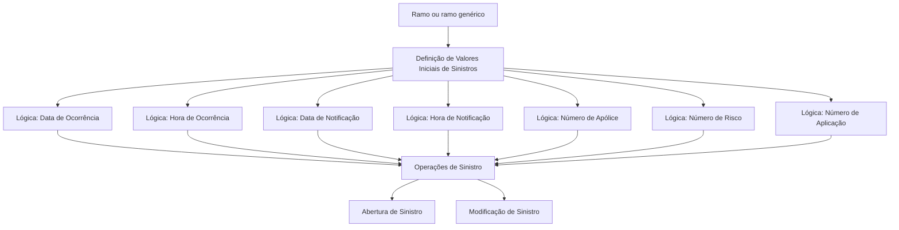

# Definição de Valores Iniciais para Sinistros

## 1. Metadados do Documento
- **Arquivo de Origem:** Não informado
- **Tipo de Documento:** Especificação Técnica
- **Domínio / Sistema:** Sinistros
- **Público-Alvo:** Desenvolvedores, Analistas Funcionais e Operação
- **Data/Versão Identificada:** Não identificada

---

## 2. Resumo Executivo & Contexto de Negócio

O documento define valores iniciais para atributos utilizados nas operações de sinistros, incluindo abertura e modificação de sinistros. O objetivo é permitir que determinados campos sejam carregados automaticamente antes de uma eventual alteração pelo usuário ou processo posterior.

A configuração dos valores iniciais é organizada por **ramo**. Quando diversos ramos compartilham os mesmos valores iniciais, a definição pode ser criada para um ramo genérico, aplicável a todos os ramos.

Os valores iniciais são determinados por lógicas de negócio associadas a cada atributo. O documento informa que algumas colunas são instaladas com uma lógica de núcleo, que pode ser modificada conforme as necessidades da instalação.

Os atributos cobertos incluem data e hora de ocorrência, data e hora de notificação, número de apólice, número de risco e número de aplicação. O preenchimento padrão não é obrigatório, mas pode reduzir o tempo operacional em atributos que sejam simples de programar.

Não há detalhamento de arquitetura de software, interfaces, métodos HTTP, contratos de integração, banco de dados ou mecanismos técnicos de execução dessas lógicas de negócio.

---

## 3. Arquitetura, Componentes & Tecnologias Envolvidas

O documento descreve uma configuração funcional de valores iniciais no domínio de sinistros. Os componentes conceituais identificados são:

- **Manutenção de Valores Iniciais de Sinistros:** configuração dos valores padrão.
- **Ramo:** chave que define o escopo de aplicação dos valores iniciais.
- **Lógicas de negócio:** mecanismos que retornam o valor inicial de atributos de sinistro.
- **Operações de sinistro:** operações em nível de sinistros, abertura e modificação.
- **Lógica de núcleo:** lógica instalada inicialmente em determinadas colunas e passível de alteração.



> **Nota de Análise:** O documento não apresenta tecnologias, servidores, ambientes, URLs, APIs, contratos JSON ou detalhes de implementação das lógicas de negócio.

---

## 4. Regras de Negócio, Especificações Funcionais & Processos

### 4.1 Escopo dos valores iniciais

A finalidade da definição de valores iniciais é carregar valores em operações no nível de sinistros, incluindo:

1. Operações de sinistros.
2. Abertura de sinistros.
3. Modificação de sinistros.
4. Outras operações não detalhadas, indicadas pelo documento como “etc.”.

### 4.2 Regra de escopo por ramo

- O atributo **Ramo** contém a chave do ramo para o qual os valores iniciais são definidos.
- Quando vários ramos utilizam os mesmos valores iniciais, pode ser criada uma definição para o ramo genérico.
- O ramo genérico representa todos os ramos.

### 4.3 Regras para data e hora de ocorrência

- A lógica de negócio de **Data de Ocorrência** retorna o valor inicial da data de ocorrência do sinistro antes de qualquer modificação.
- Na maioria das instalações, a lógica retorna a data do dia.
- A coluna é instalada com uma lógica de núcleo, que pode ser modificada.

- A lógica de negócio de **Hora de Ocorrência** retorna o valor inicial da hora de ocorrência do sinistro antes de qualquer modificação.
- Na maioria das instalações, a lógica não retorna nenhum valor para a hora de ocorrência.
- A coluna é instalada com uma lógica de núcleo, que pode ser modificada.

### 4.4 Regras para data e hora de notificação

- A lógica de negócio de **Data de Notificação** retorna o valor inicial da data em que o sinistro é notificado à companhia, antes de qualquer modificação.
- Normalmente, as instalações retornam a data do dia.
- A coluna é instalada com uma lógica de núcleo, que pode ser modificada.

- A lógica de negócio de **Hora de Notificação** retorna o valor inicial da hora de notificação do sinistro à companhia, antes de qualquer modificação.
- Normalmente, as instalações retornam a hora do dia, correspondente ao momento em que o sinistro está sendo aberto.
- A coluna é instalada com uma lógica de núcleo, que pode ser modificada.

### 4.5 Regras para apólice, risco e aplicação

- A lógica de negócio de **Número de Apólice** retorna o valor inicial do número da apólice.
- A lógica de negócio de **Número de Risco** retorna o valor inicial do número de risco da apólice afetada pelo sinistro.
- Caso a apólice não seja multirriscos, o sistema é responsável por obter o risco.
- A lógica de negócio de **Número de Aplicação** retorna o valor inicial do número de aplicação quando a apólice não for fixa.

### 4.6 Obrigatoriedade

- Não é obrigatório manter valores padrão.
- Valores padrão podem economizar tempo em determinados atributos.
- O documento indica que os valores padrão são fáceis de programar em alguns atributos, sem especificar quais atributos ou como a programação é realizada.

---

## 5. Tabelas de Parâmetros, Ambientes e Estruturas de Dados

| Item / Parâmetro | Descrição / Função | Tipo / Valores / Formato | Ambiente / Observações |
| :--- | :--- | :--- | :--- |
| Ramo | Contém a chave do ramo para o qual os valores iniciais são definidos. | Chave de ramo; formato não informado. | Pode ser utilizado um ramo genérico para todos os ramos. |
| Ramo genérico | Permite reutilizar a mesma definição de valores iniciais para vários ramos. | Aplicável a todos os ramos. | Utilizado quando diversos ramos possuem os mesmos valores iniciais. |
| Lógica de Data de Ocorrência | Retorna o valor inicial da data de ocorrência do sinistro. | Lógica de negócio; valor usual: data do dia. | O valor é retornado antes de modificação; existe lógica de núcleo modificável. |
| Lógica de Hora de Ocorrência | Retorna o valor inicial da hora de ocorrência do sinistro. | Lógica de negócio; na maioria das instalações não retorna valor. | O valor é retornado antes de modificação; existe lógica de núcleo modificável. |
| Lógica de Data de Notificação | Retorna o valor inicial da data de notificação do sinistro à companhia. | Lógica de negócio; valor usual: data do dia. | O valor é retornado antes de modificação; existe lógica de núcleo modificável. |
| Lógica de Hora de Notificação | Retorna o valor inicial da hora de notificação do sinistro à companhia. | Lógica de negócio; valor usual: hora do dia. | Normalmente representa o momento de abertura do sinistro; existe lógica de núcleo modificável. |
| Lógica de Número de Apólice | Retorna o valor inicial do número da apólice. | Lógica de negócio; formato não informado. | Não há comportamento padrão adicional descrito. |
| Lógica de Número de Risco | Retorna o valor inicial do número de risco da apólice afetada. | Lógica de negócio; formato não informado. | Se a apólice não for multirriscos, o sistema obtém o risco. |
| Lógica de Número de Aplicação | Retorna o valor inicial do número de aplicação. | Lógica de negócio; formato não informado. | Aplicável quando a apólice não é fixa. |
| Lógica de núcleo | Lógica instalada inicialmente em determinadas colunas. | Não informado. | Pode ser modificada. |
| Valores por defeito | Valores carregados inicialmente em atributos de sinistro. | Não obrigatório. | Podem economizar tempo e ser simples de programar em alguns atributos. |

> **Nota de Análise:** O documento não informa ambientes, servidores, caminhos de log, variáveis de configuração, URLs ou estruturas de dados técnicas.

---

## 6. Bateria de Perguntas & Respostas para RAG (FAQ Sintético)

### P1: Qual é o objetivo da definição de valores iniciais de sinistros?
**R:** O objetivo é definir valores iniciais para determinados atributos e carregá-los nas operações de sinistros, incluindo operações no nível de sinistros, abertura de sinistros e modificação de sinistros.

### P2: Os valores iniciais de sinistros são definidos por ramo?
**R:** Sim. O atributo Ramo contém a chave do ramo para o qual são definidos os valores iniciais. Quando vários ramos têm os mesmos valores, pode ser criada uma definição para um ramo genérico aplicável a todos os ramos.

### P3: Qual é o valor inicial mais comum para a data de ocorrência de um sinistro?
**R:** Na maioria das instalações, a lógica de negócio para a data de ocorrência retorna a data do dia. Esse valor é retornado antes de a data de ocorrência ser modificada.

### P4: A hora de ocorrência recebe obrigatoriamente um valor inicial?
**R:** Não. O documento informa que, na maioria das instalações, a lógica de negócio da hora de ocorrência não retorna nenhum valor.

### P5: Como é determinado o valor inicial da data de notificação?
**R:** Uma lógica de negócio retorna o valor inicial da data de notificação do sinistro à companhia antes de modificação. Normalmente, as instalações retornam a data do dia.

### P6: O que representa a hora inicial de notificação de um sinistro?
**R:** A lógica de negócio retorna o valor inicial da hora de notificação do sinistro à companhia. Normalmente, o valor é a hora do dia correspondente ao momento em que o sinistro está sendo aberto.

### P7: As lógicas iniciais instaladas podem ser alteradas?
**R:** Sim. As colunas referentes a data e hora de ocorrência e de notificação são instaladas com uma lógica de núcleo que pode ser modificada.

### P8: Como o sistema trata o número de risco quando a apólice não é multirriscos?
**R:** A lógica de negócio retorna o valor inicial do número de risco da apólice afetada pelo sinistro. Se a apólice não for multirriscos, o sistema é responsável por obter o risco.

### P9: Quando a lógica de número de aplicação é utilizada?
**R:** A lógica de negócio para número de aplicação retorna o valor inicial desse número quando a apólice não é fixa.

### P10: É obrigatório configurar valores padrão para os atributos de sinistros?
**R:** Não. O documento afirma que valores padrão não são obrigatórios, embora possam economizar tempo e serem fáceis de programar em alguns atributos.

---

## 7. Glossário de Termos, Siglas & Conceitos-Chave

- **Sinistro:** Entidade ou ocorrência tratada pelas operações descritas no documento, incluindo abertura e modificação.
- **Ramo:** Chave utilizada para definir o escopo dos valores iniciais de sinistros.
- **Ramo genérico:** Definição aplicável a todos os ramos quando diversos ramos compartilham os mesmos valores iniciais.
- **Apólice:** Apólice afetada pelo sinistro, utilizada como referência para os valores iniciais de número de apólice e número de risco.
- **Apólice multirriscos:** Tipo de apólice mencionado no contexto da obtenção do número de risco.
- **Apólice fixa:** Tipo de apólice mencionado como condição para aplicação da lógica do número de aplicação.
- **Lógica de negócio:** Lógica responsável por retornar o valor inicial de um atributo do sinistro.
- **Lógica de núcleo:** Lógica instalada inicialmente em determinadas colunas e que pode ser modificada.
- **Valores por defeito:** Valores carregados inicialmente em atributos de sinistro; não são obrigatórios.
- **CF:** Termo exibido no conteúdo bruto sem definição adicional no documento.

---

## 8. Notas Críticas, Riscos & Limitações

- O documento não detalha como as lógicas de negócio são implementadas, programadas, executadas ou versionadas.
- Não são apresentados métodos, APIs, contratos de integração, estruturas JSON, banco de dados, telas completas ou mecanismos de persistência.
- Não são fornecidos formatos para datas, horas, números de apólice, números de risco ou números de aplicação.
- O comportamento descrito como “na maioria das instalações” ou “normalmente” não constitui uma regra universal obrigatória.
- O documento menciona uma lógica de núcleo modificável, mas não descreve o processo de alteração, controle de acesso, validação ou impacto operacional.
- Os exemplos associados à lógica de número de aplicação aparecem apenas como a palavra “Ejemplo”, sem conteúdo adicional.
- O termo “CF” aparece no conteúdo bruto sem contexto ou definição suficiente para interpretação confiável.

---

## 9. Conteúdo Bruto Estruturado (Referência Fiel)

```text
--- [PÁGINA 1 DE 3] ---

DEFINICIÓN de VALORES INICIALES
SINIESTROS
Objetivo
La finalidad es definir los valores iniciales de ciertos atributos, para cargarlos en las operaciones a
Nivel de Siniestros, Apertura de Siniestros, Modificación, etc.
Propiedades de Valores Iniciales de Siniestros
Imagen del Mantenimiento Valores Iniciales SIniestros:
Ramo
Esta propiedad o atributo, contendrá la clave del ramo para el que estamos definiendo valores
iniciales. Si varios ramos tienen los mismos valores iniciales, se puede crear la definición para el
ramo genérico (todos los ramos).
Lógica que determina el valor inicial de la Fecha Ocurrencia
 /
 CF
Home Solutions APIs Documentation Zeus
EN


--- [PÁGINA 2 DE 3] ---

Esta propiedad contendrá una lógica de Negocio, que devolverá el valor inicial de la fecha de
ocurrencia del siniestro, antes de que esta sea modificada.
En la mayoría de las instalaciones, devuelven la fecha del día.
Esta columna se instala cargada con una lógica de núcleo, que puede ser cambiada.
Lógica que determina el valor inicial de la Hora Ocurrencia
Esta propiedad contendrá una lógica de Negocio, que devolverá el valor inicial de la hora de
ocurrencia del siniestro, antes de que esta sea modificada. En la mayoría de las instalaciones, no
devuelven nada.
Esta columna se instala cargada con una lógica de núcleo, que puede ser cambiada.
Lógica que determina el valor inicial de la Fecha Notificación
Esta propiedad contendrá una lógica de Negocio, que devolverá el valor inicial de la fecha de
notificación del siniestro a la compañía, antes de que esta sea modificada.
Normalmente en las instalaciones, devuelven la fecha del día.
Esta columna se instala cargada con una lógica de núcleo, que puede ser cambiada.
Lógica que determina el valor inicial de la Hora Notificación
Esta propiedad contendrá una lógica de Negocio, que devolverá el valor inicial de la hora de
notificación del siniestro a la compañía, antes de que esta sea modificada.
Normalmente en las instalaciones devuelven la hora del día, el momento en el que se está abriendo
el siniestro.
Esta columna se instala cargada con una lógica de núcleo, que puede ser cambiada.
Lógica que determina el valor inicial del Número de Póliza
Esta propiedad contendrá una lógica de Negocio, que devolverá el valor inicial del número de Póliza.
Lógica que determina el valor inicial del Número de Riesgo
Esta propiedad contendrá una lógica de Negocio, que devolverá el valor inicial del número de riesgo
de la póliza a la que afecta el siniestro. Si la póliza no es multiriesgo el sistema se encarga de
recoger el riesgo.
Lógica que determina el valor inicial de la Aplicación
Ejemplo:
Ejemplo:


--- [PÁGINA 3 DE 3] ---

Esta propiedad contendrá una lógica de Negocio, que devolverá el valor inicial del número de
aplicación, en el caso en que la póliza no sea Fija.
.
Preguntas frecuentes
¿Es obligatorio tener valores por defecto? No, pero en algunos atributos ahorra tiempo y son
fáciles de programar.
```
