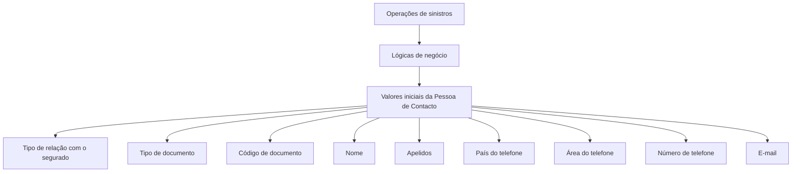

# Definição de Valores Iniciais — Pessoa de Contacto do Sinistro

## 1. Metadados do Documento
- **Arquivo de Origem:** Não identificado
- **Tipo de Documento:** Especificação Técnica
- **Domínio / Sistema:** Operações de sinistros — Pessoa de Contacto
- **Público-Alvo:** Desenvolvedores, analistas funcionais e operação
- **Data/Versão Identificada:** Não identificada

---

## 2. Resumo Executivo & Contexto de Negócio

O documento define propriedades de valores iniciais para a **Pessoa de Contacto** associada a um sinistro. A finalidade declarada é devolver valores iniciais da pessoa de contacto por meio de lógicas de negócio.

As lógicas de negócio são acionadas a partir das operações de sinistros. Cada propriedade pode conter uma lógica de negócio específica para obter um atributo inicial da pessoa de contacto, como relação com o segurado, documento, nome, apelidos, telefone e e-mail.

A utilização de valores por defeito não é obrigatória. Contudo, o documento informa que, para determinadas propriedades, valores iniciais podem economizar tempo e são fáceis de programar.

O material não descreve contratos de API, métodos HTTP, estruturas JSON, persistência, regras de precedência entre lógicas de negócio, nem critérios de tratamento de erros.

---

## 3. Arquitetura, Componentes & Tecnologias Envolvidas

Os componentes e conceitos explicitamente citados são:

| Componente / Conceito | Papel descrito |
| :--- | :--- |
| Operações de sinistros | Origem a partir da qual as lógicas de negócio são acionadas. |
| Lógicas de negócio | Mecanismos que devolvem ou obtêm valores iniciais para propriedades da Pessoa de Contacto. |
| Pessoa de Contacto | Entidade cujos atributos iniciais podem ser preenchidos por lógicas de negócio. |
| Segurado | Entidade usada como referência para determinar o tipo de relação inicial da Pessoa de Contacto. |
| Home Solutions APIs Documentation Zeus | Texto presente na extração; o documento não detalha a função técnica dessa referência. |
| CF | Texto presente na extração; o documento não fornece significado ou contexto adicional. |



**Nota de Análise:** O documento indica que as lógicas de negócio são lançadas desde as operações de sinistros, mas não detalha a tecnologia de execução, integrações, endpoints, contratos de entrada ou contratos de resposta.

---

## 4. Regras de Negócio, Especificações Funcionais & Processos

1. A finalidade das propriedades de valores iniciais é devolver valores iniciais da Pessoa de Contacto mediante lógicas de negócio.
2. As lógicas de negócio são acionadas a partir das operações de sinistros.
3. A propriedade **lógica de negócio valor inicial tipo de relação** contém uma lógica de negócio que devolve o tipo de relação inicial entre a Pessoa de Contacto e o segurado.
4. A propriedade **lógica de negócio valor inicial tipo documento** devolve um valor inicial para o tipo de documento da Pessoa de Contacto.
5. A propriedade **lógica de negócio valor inicial código de documento** pode obter o código de documento da Pessoa de Contacto.
6. A propriedade **lógica de negócio valor inicial nome** pode obter o nome do contacto.
7. A propriedade **lógica de negócio valor inicial apelidos** pode obter o apelido da Pessoa de Contacto.
8. A propriedade **lógica de negócio valor inicial país do telefone** pode obter o código de país do número de telefone do contacto.
9. A propriedade **lógica de negócio valor inicial área do telefone** devolve a área do número de telefone.
10. A propriedade **lógica de negócio valor inicial número de telefone** devolve o número de telefone do contacto.
11. A propriedade **lógica de negócio valor inicial email** pode obter o e-mail do contacto.
12. Não é obrigatório configurar valores por defeito.
13. O documento afirma que valores por defeito podem poupar tempo em algumas propriedades e são fáceis de programar.

---

## 5. Tabelas de Parâmetros, Ambientes e Estruturas de Dados

| Item / Parâmetro | Descrição / Função | Tipo / Valores / Formato | Ambiente / Observações |
| :--- | :--- | :--- | :--- |
| lógica de negócio valor inicial tipo de relação | Devolve o tipo de relação inicial da Pessoa de Contacto com o segurado. | Tipo de relação | O documento não especifica valores permitidos. |
| lógica de negócio valor inicial tipo documento | Devolve um valor inicial para o tipo de documento da Pessoa de Contacto. | Tipo de documento | O documento não especifica tipos de documento. |
| lógica de negócio valor inicial código de documento | Pode obter o código de documento da Pessoa de Contacto. | Código de documento | Formato não detalhado. |
| lógica de negócio valor inicial nome | Pode obter o nome do contacto. | Nome | Formato não detalhado. |
| lógica de negócio valor inicial apelidos | Pode obter o apelido da Pessoa de Contacto. | Apelido | O documento utiliza “apellidos”; não detalha se suporta múltiplos apelidos. |
| lógica de negócio valor inicial país do telefone | Pode obter o código de país do telefone do contacto. | Código de país | Formato não detalhado. |
| lógica de negócio valor inicial área do telefone | Devolve a área do número de telefone. | Área de telefone | Formato não detalhado. |
| lógica de negócio valor inicial número de telefone | Devolve o número de telefone do contacto. | Número de telefone | Formato não detalhado. |
| lógica de negócio valor inicial email | Pode obter o e-mail do contacto. | E-mail | Não há regra de validação informada. |
| Valores por defeito | Preenchimento inicial de propriedades da Pessoa de Contacto. | Opcional | Pode economizar tempo e é indicado como fácil de programar para algumas propriedades. |

---

## 6. Bateria de Perguntas & Respostas para RAG (FAQ Sintético)

### P1: Qual é o objetivo da definição de valores iniciais para a Pessoa de Contacto?
**R:** O objetivo é devolver valores iniciais da Pessoa de Contacto mediante lógicas de negócio acionadas a partir das operações de sinistros.

### P2: De onde são acionadas as lógicas de negócio dos valores iniciais?
**R:** As lógicas de negócio são acionadas desde as operações de sinistros.

### P3: É obrigatório configurar valores por defeito para a Pessoa de Contacto?
**R:** Não. O documento afirma que não é obrigatório ter valores por defeito, embora indique que eles podem economizar tempo em algumas propriedades e sejam fáceis de programar.

### P4: Qual propriedade define o tipo de relação inicial entre a Pessoa de Contacto e o segurado?
**R:** A propriedade **lógica de negócio valor inicial tipo de relação** contém uma lógica de negócio que devolve o tipo de relação inicial da Pessoa de Contacto com o segurado.

### P5: Como é obtido o tipo de documento inicial da Pessoa de Contacto?
**R:** A propriedade **lógica de negócio valor inicial tipo documento** contém uma lógica de negócio que devolve um valor inicial para o tipo de documento da Pessoa de Contacto.

### P6: Qual propriedade pode recuperar o código de documento da Pessoa de Contacto?
**R:** A propriedade **lógica de negócio valor inicial código de documento** contém uma lógica de negócio que pode obter o código de documento da Pessoa de Contacto.

### P7: Quais atributos de identificação pessoal podem receber valores iniciais?
**R:** O documento cita nome, apelidos, tipo de documento, código de documento e tipo de relação com o segurado como atributos que podem receber ou obter valores iniciais por lógicas de negócio.

### P8: Quais informações telefônicas podem ser preenchidas por lógicas de negócio?
**R:** O documento cita três informações telefônicas: código de país do número de telefone, área do número de telefone e número de telefone da Pessoa de Contacto.

### P9: A especificação informa o formato do e-mail ou do número de telefone?
**R:** Não. O documento informa que existem lógicas de negócio para obter o e-mail e o número de telefone, mas não apresenta formatos, expressões de validação, tamanho ou valores permitidos.

### P10: O documento define APIs, métodos HTTP ou contratos JSON para as lógicas de negócio?
**R:** Não. O documento descreve propriedades e finalidades das lógicas de negócio, mas não detalha endpoints, métodos HTTP, payloads JSON, tecnologias ou contratos de integração.

---

## 7. Glossário de Termos, Siglas & Conceitos-Chave

- **Pessoa de Contacto:** Entidade cujos dados iniciais podem ser devolvidos ou obtidos por lógicas de negócio nas operações de sinistros.
- **Segurado:** Entidade usada como referência para a propriedade que determina o tipo de relação inicial da Pessoa de Contacto.
- **Lógica de Negócio:** Mecanismo mencionado para devolver ou obter valores iniciais de propriedades da Pessoa de Contacto.
- **Valores Iniciais / Valores por Defeito:** Valores atribuídos inicialmente a propriedades da Pessoa de Contacto; a sua configuração é opcional.
- **Operações de Sinistros:** Operações a partir das quais as lógicas de negócio são acionadas.
- **CF:** Sigla ou texto citado no documento sem expansão ou definição.
- **Home Solutions APIs Documentation Zeus:** Referência textual presente no documento sem explicação funcional ou arquitetural adicional.

---

## 8. Notas Críticas, Riscos & Limitações

- O documento não identifica arquivo de origem, autor, data, versão ou ambiente.
- O documento não especifica as tecnologias usadas para implementar ou executar as lógicas de negócio.
- Não há detalhamento de métodos HTTP, APIs, URLs, autenticação, contratos JSON, mensagens, códigos de erro ou persistência.
- Não há catálogo de valores válidos para tipo de relação, tipo de documento, código de país, área telefônica ou demais propriedades.
- Não são descritas regras de precedência, fallback, obrigatoriedade por propriedade ou comportamento quando uma lógica de negócio não retorna valor.
- A referência a **Home Solutions APIs Documentation Zeus** não é explicada.
- A sigla **CF** aparece no conteúdo, mas não é definida.

---

## 9. Conteúdo Bruto Estruturado (Referência Fiel)

```text
--- [PÁGINA 1 DE 2] ---

DEFINICIÓN de VALORES INICIALES
PERSONA DE CONTACTO DEL SINIESTRO
Objetivo
La finalidad es poder devolver valores iniciales de la persona de contacto mediante lógicas de
negocio. Estas lógicas de negocio se lanza desde las operaciones de siniestros
Propiedades de Valores Iniciales de Persona de Contacto
Imagen del Mantenimiento Valores Iniciales de Persona de Contacto:
lógica de negocio valor inicial tipo de relación
Esta propiedad contiene una Lógica de Negocio que devuelve el tipo relación inicial de la persona de
contacto con el asegurado.
lógica de negocio valor inicial tipo documento
Lógica de Negocio que devuelve un valor inicial, del tipo de documento de la persona de contacto .
 / 
 CF
Home Solutions APIs Documentation Zeus
EN


--- [PÁGINA 2 DE 2] ---

lógica de negocio valor inicial código de documento
Esta propiedad contiene una lógica de negocio que puede obtener el código de documento de la
persona de contacto.
lógica de negocio valor inicial nombre
Esta propiedad contiene una lógica de negocio se puede obtener el nombre del contacto.
lógica de negocio valor inicial apellidos
Esta propiedad contiene una lógica de negocio para obtener el apellido de la persona de contacto
Lógica de negocio valor inicial país del teléfono
Esta propiedad contiene una lógica de negocio para poder obtener el código de país del número de
teléfono del contacto.
Lógica de negocio valor inicial área del teléfono
Esta propiedad contiene una lógica de negocio que devuelve el área del número de teléfono.
Lógica de negocio valor inicial número de teléfono
Esta propiedad contiene una lógica de negocio que devuelve el número de teléfono del contacto.
Lógica de negocio valor inicial email
Esta propiedad contiene una lógica de negocio para obtener el email del contacto
Preguntas frecuentes
¿Es obligatorio tener valores por defecto? No, pero en algunas propiedades ahorra tiempo y son
fáciles de programar.
```
