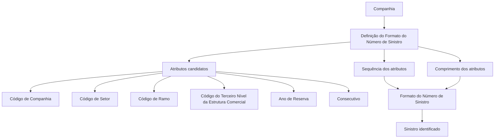

# Definição do Formato e Comprimento do Número de Sinistro

## 1. Metadados do Documento
- **Arquivo de Origem:** `Não identificado`
- **Tipo de Documento:** Especificação Técnica
- **Domínio / Sistema:** Gestão de Sinistros
- **Público-Alvo:** Negócio, Analistas Funcionais, Desenvolvedores e Operação
- **Data/Versão Identificada:** Não identificada

---

## 2. Resumo Executivo & Contexto de Negócio

O documento define o formato e o comprimento do Número de Sinistro, identificador utilizado para reconhecer sinistros. O Número de Sinistro é único por companhia, portanto a regra de composição do identificador é compartilhada por todos os sinistros da mesma companhia.

A definição do formato do Número de Sinistro torna-se imutável após a abertura de um sinistro. Essa restrição impede alterações posteriores na estrutura de identificação quando já existem registros de sinistro associados à companhia.

A numeração pode ser composta por atributos candidatos predefinidos: Código de Companhia, Código de Setor, Código de Ramo, Código do Terceiro Nível da Estrutura Comercial, Ano de Reserva e Consecutivo. O documento estabelece que a configuração determina quais atributos participam da numeração, sua ordem e seus comprimentos.

O comprimento total do Número de Sinistro não pode exceder 15 posições. Entre os atributos candidatos, apenas o Ano de Reserva e o Sequencial/Consecutivo possuem regras explícitas de ajuste de comprimento: o Ano de Reserva pode possuir 2 ou 4 posições, enquanto o Consecutivo pode completar o comprimento desejado, respeitando o limite máximo total.

---

## 3. Arquitetura, Componentes & Tecnologias Envolvidas

O documento não descreve arquitetura de software, serviços, APIs, protocolos, bancos de dados, ambientes técnicos ou tecnologias de implementação. O conteúdo apresenta uma configuração funcional de manutenção da definição do formato do Número de Sinistro.

Os componentes funcionais identificados são:

- **Companhia:** escopo no qual o formato e o Número de Sinistro são únicos.
- **Definição do Formato do Número de Sinistro:** configuração que determina atributos, ordem e comprimento da numeração.
- **Atributos candidatos:** informações elegíveis para compor o Número de Sinistro.
- **Sinistro:** entidade identificada pelo Número de Sinistro gerado.
- **Consecutivo / Sequencial:** atributo utilizado para completar o comprimento configurado do Número de Sinistro.



**Nota de Análise:** o documento menciona referências visuais e links ou rótulos como “Home”, “Solutions”, “APIs”, “Documentation” e “Zeus”, porém não fornece detalhes suficientes para qualificá-los como sistemas, módulos técnicos ou integrações.

---

## 4. Regras de Negócio, Especificações Funcionais & Processos

1. O Número de Sinistro tem como finalidade identificar sinistros.
2. O Número de Sinistro é único por companhia.
3. O formato do Número de Sinistro é único por companhia.
4. Não é permitido possuir um formato de Número de Sinistro diferente por Ramo dentro da mesma companhia.
5. A definição do formato não pode ser alterada depois que um sinistro tiver sido aberto.
6. O Número de Sinistro pode ter, no máximo, 15 posições.
7. A composição do Número de Sinistro pode utilizar somente os seguintes atributos candidatos:
   - Código de Companhia;
   - Código de Setor;
   - Código de Ramo;
   - Código do Terceiro Nível da Estrutura Comercial;
   - Ano de Reserva;
   - Consecutivo.
8. A propriedade de sequência determina se um atributo candidato participa da numeração e, quando participa, em qual ordem o atributo será posicionado dentro do Número de Sinistro.
9. A propriedade de comprimento determina o tamanho do atributo candidato que fará parte da numeração do sinistro.
10. A soma dos comprimentos de todos os atributos selecionados não pode superar 15 posições.
11. Somente o comprimento do **Ano de Reserva** pode ser alterado entre 2 e 4 posições.
12. O atributo **Sequencial/Consecutivo** pode ser configurado para completar o comprimento desejado do Número de Sinistro, desde que o total não exceda 15 posições.
13. Não há suporte documentado para atributos adicionais além dos atributos candidatos listados. A inclusão de outro atributo exige solicitação.
14. O documento afirma que a variabilidade do comprimento do Número de Sinistro é obtida pelo comprimento atribuído ao campo Consecutivo.

---

## 5. Tabelas de Parâmetros, Ambientes e Estruturas de Dados

| Item / Parâmetro | Descrição / Função | Tipo / Valores / Formato | Ambiente / Observações |
| :--- | :--- | :--- | :--- |
| Número de Sinistro | Número utilizado para identificar sinistros. | Máximo de 15 posições. | Único por companhia. |
| Formato do Número de Sinistro | Definição da composição do Número de Sinistro. | Seleção, sequência e comprimento de atributos candidatos. | Não pode ser alterado após a abertura de um sinistro. |
| Código de Companhia | Atributo candidato à composição do Número de Sinistro. | Comprimento não detalhado. | Pode participar conforme a configuração do formato. |
| Código de Setor | Atributo candidato à composição do Número de Sinistro. | Comprimento não detalhado. | Pode participar conforme a configuração do formato. |
| Código de Ramo | Atributo candidato à composição do Número de Sinistro. | Comprimento não detalhado. | O formato não pode variar por Ramo dentro da companhia. |
| Código do Terceiro Nível da Estrutura Comercial | Atributo candidato à composição do Número de Sinistro. | Comprimento não detalhado. | Pode participar conforme a configuração do formato. |
| Ano de Reserva | Atributo candidato à composição do Número de Sinistro. | 2 ou 4 posições. | Um dos únicos atributos com regra explícita de alteração de comprimento. |
| Consecutivo | Atributo candidato à composição do Número de Sinistro. | Pode completar o comprimento desejado, limitado pelo máximo total de 15 posições. | O documento também o denomina “Sequencial”. |
| Sequência da informação | Propriedade que define se um atributo integra a numeração e a posição que ocupará. | Ordem configurável. | Aplicável aos atributos candidatos. |
| Comprimento | Propriedade que indica o tamanho de cada atributo selecionado. | Soma máxima de 15 posições. | Alteração explicitamente permitida para Ano de Reserva e Sequencial/Consecutivo. |
| Companhia | Escopo de unicidade da numeração e do formato. | Não detalhado. | O Número de Sinistro e seu formato são únicos por companhia. |

---

## 6. Bateria de Perguntas & Respostas para RAG (FAQ Sintético)

### P1: Qual é o objetivo da definição do formato do Número de Sinistro?
**R:** O objetivo é definir o formato e o comprimento do número que identificará os sinistros. O Número de Sinistro é único por companhia.

### P2: O formato do Número de Sinistro pode ser alterado depois que um sinistro for aberto?
**R:** Não. A definição do formato do Número de Sinistro não pode ser modificada depois que um sinistro tiver sido aberto.

### P3: Qual é o comprimento máximo permitido para o Número de Sinistro?
**R:** O Número de Sinistro pode ter no máximo 15 posições. A soma dos comprimentos de todos os atributos selecionados para sua composição não pode ultrapassar esse limite.

### P4: O Número de Sinistro pode ter um formato diferente para cada Ramo?
**R:** Não. O formato do Número de Sinistro é único por companhia, assim como o próprio Número de Sinistro gerado. Portanto, o formato não pode variar por Ramo dentro da mesma companhia.

### P5: Quais atributos podem compor o Número de Sinistro?
**R:** Os únicos atributos candidatos documentados são: Código de Companhia, Código de Setor, Código de Ramo, Código do Terceiro Nível da Estrutura Comercial, Ano de Reserva e Consecutivo.

### P6: É possível incluir um atributo adicional na composição do Número de Sinistro?
**R:** O documento informa que somente os atributos descritos podem fazer parte da numeração atualmente. Caso seja necessário incluir outro atributo, deve ser realizada uma solicitação.

### P7: Como é definida a ordem dos atributos no Número de Sinistro?
**R:** A propriedade de sequência da informação define se cada atributo candidato fará parte da numeração e, caso participe, em qual posição ou ordem será inserido no Número de Sinistro.

### P8: Quais atributos podem ter seu comprimento modificado?
**R:** O documento informa que somente o Ano de Reserva e o Sequencial podem ter o comprimento modificado. O Ano de Reserva pode possuir 2 ou 4 posições, e o Sequencial pode completar o comprimento desejado, respeitando o máximo total de 15 posições.

### P9: Como a variação do comprimento do Número de Sinistro é obtida?
**R:** A variação do comprimento pode ser obtida por meio do comprimento atribuído ao campo Consecutivo. O comprimento total continua limitado a 15 posições.

### P10: O que acontece se a soma dos comprimentos dos atributos exceder 15 posições?
**R:** A configuração não atende à regra documentada, pois a soma dos comprimentos de todos os candidatos selecionados não pode superar 15 posições.

---

## 7. Glossário de Termos, Siglas & Conceitos-Chave

- **Ano de Reserva:** atributo candidato à composição do Número de Sinistro; pode ter 2 ou 4 posições.
- **Código de Companhia:** atributo candidato à composição do Número de Sinistro.
- **Código de Ramo:** atributo candidato à composição do Número de Sinistro.
- **Código de Setor:** atributo candidato à composição do Número de Sinistro.
- **Código do Terceiro Nível da Estrutura Comercial:** atributo candidato à composição do Número de Sinistro.
- **Consecutivo:** atributo candidato utilizado para compor ou completar o comprimento do Número de Sinistro; também referido como Sequencial.
- **Número de Sinistro:** número que identifica sinistros; é único por companhia.
- **Ramo:** elemento citado como não elegível para definir formatos distintos de Número de Sinistro dentro de uma mesma companhia.
- **Sequência da informação:** propriedade que determina a participação e a ordem dos atributos candidatos no Número de Sinistro.
- **Sequencial:** termo utilizado no documento para o atributo cujo comprimento pode ser ajustado para completar o tamanho desejado; relacionado ao Consecutivo.

---

## 8. Notas Críticas, Riscos & Limitações

- A alteração da definição do formato após a abertura de um sinistro é proibida. Qualquer erro de configuração antes da geração de sinistros pode gerar impacto permanente na companhia.
- O comprimento total máximo de 15 posições é uma restrição obrigatória para a composição do Número de Sinistro.
- O documento limita os atributos elegíveis aos seis atributos explicitamente listados.
- A inclusão de novos atributos não é descrita como uma capacidade de configuração padrão; exige solicitação.
- O documento não detalha a sintaxe exata do Número de Sinistro gerado, nem fornece um exemplo completo, embora apresente o rótulo “Exemplo:”.
- O documento não detalha validações de tela, persistência, contratos de API, métodos HTTP, integrações, mecanismos de geração do Consecutivo ou comportamento em caso de duplicidade.
- **Nota de Análise:** o documento lista o atributo Consecutivo e também usa o termo Sequencial, mas não explicita formalmente se ambos são o mesmo campo em todos os contextos. A interpretação de que são relacionados decorre das regras de comprimento apresentadas.

---

## 9. Conteúdo Bruto Estruturado (Referência Fiel)

```text
--- [PÁGINA 1 DE 3] ---

DEFINICIÓN de Formato del Número de
Siniestro
Objetivo
La finalidad es definir el formato y la longitud que va a tener el Número que va a identificar los
Siniestros.
El Número de siniestro es único por compañía.
La definición no se puede cambiar una vez que se ha abierto un siniestro.
La longitud del número de siniestro puede llegar a tener como máximo, 15 posiciones.
Imagen del Mantenimiento Definición Formato Número de Siniestro:
 /
 CF
Home Solutions APIs Documentation Zeus
EN


--- [PÁGINA 2 DE 3] ---

Propiedades Generales
Información que puede formar parte del Número de Siniestro
Esta propiedad contiene el Nombre de los atributos que pueden formar parte de la numeración de
siniestros. Los candidatos son:
Código de Compañía
Código de Sector
Código de Ramo
Código del Tercer Nivel de la Estructura Comercial
Año Reserva
Consecutivo
Secuencia de la información dentro del Número de Siniestro
Esta propiedad lo que contiene es, si se quiere que cualquiera de los candidatos forme parte de la
numeración, en que orden se va a situar dentro del número de Siniestro.
Longitud


--- [PÁGINA 3 DE 3] ---

Esta propiedad indica la longitud del atributo candidato a formar parte de la numeración del siniestro.
La longitud total, la suma de todas las longitudes de los candidatos, no puede superar las 15
posiciones. Sólo se podrá modificar la Longitud de: - Año de Reserva (de 2 o de 4 posiciones) -
Secuencial (hasta completar la longitud que se quiera)
Preguntas frecuentes
1. ¿La formación del número de siniestro puede cambiar por Ramo? No, el formato de número de
siniestro es único por compañía, así como el propio número de siniestro que se genera.
2. ¿Además de los atributos especificados en este documento el número de siniestro podría estar
formado por otros atributos? Hoy en día, sólo pueden formar parte de la documentación los
atributos descritos en este documento, si se quisiera incluir otro, habría que solicitarlo.
3. ¿La longitud del número de siniestro es variable? Si, puede llegar como máximo a 15 posiciones,
esto se logra con la longitud que se de al campo Consecutivo.
Ejemplo:
```
