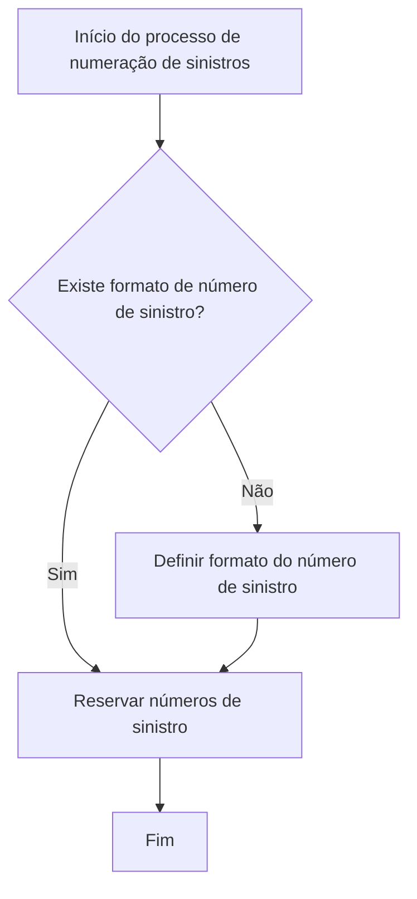

# Definição e Reserva de Numeração de Sinistros

## 1. Metadados do Documento
- **Arquivo de Origem:** Não identificado no conteúdo fornecido
- **Tipo de Documento:** Procedimento
- **Domínio / Sistema:** Numeração de Sinistros; referências a Home Solutions, APIs Documentation e Zeus
- **Público-Alvo:** Operação, analistas funcionais e usuários responsáveis pela definição ou reserva de números de sinistro
- **Data/Versão Identificada:** Não identificada

---

## 2. Resumo Executivo & Contexto de Negócio

O documento descreve um procedimento para definir o formato do número de sinistro e reservar números de sinistro. O objetivo declarado é explicar os passos necessários para executar essas duas atividades.

O processo começa com uma decisão: verificar se existe um formato de número de sinistro. Caso não exista, o processo orienta definir o formato do número de sinistro. Caso exista, ou após a definição do formato, o fluxo segue para a reserva de números de sinistro.

A reserva de números de sinistro é a etapa final indicada pelo documento. Após a reserva, o processo é encerrado.

O conteúdo fornecido é conciso e não apresenta critérios técnicos para a composição do formato, regras de unicidade, intervalos de reserva, responsáveis, sistemas de execução ou contratos de APIs. As referências finais a “Home Solutions”, “APIs Documentation” e “Zeus” não possuem detalhamento adicional no texto.

---

## 3. Arquitetura, Componentes & Tecnologias Envolvidas

Os elementos citados são:

- **Numeração de Sinistros:** domínio funcional tratado pelo procedimento.
- **Formato do Número de Sinistro:** estrutura que deve existir ou ser definida antes da reserva de números.
- **Reserva de Números de Sinistro:** atividade posterior à verificação ou definição do formato.
- **Home Solutions:** referência textual presente no documento, sem papel detalhado.
- **APIs Documentation:** referência textual presente no documento, sem especificação de endpoints, métodos HTTP ou contratos.
- **Zeus:** referência textual presente no documento, sem detalhamento de integração ou responsabilidade.
- **EN:** texto presente no rodapé do conteúdo fornecido, sem contexto adicional.
- **CF:** texto presente no rodapé do conteúdo fornecido, sem contexto adicional.



> **Nota de Análise:** O documento não descreve uma arquitetura de software, componentes técnicos, bancos de dados, serviços, interfaces, URLs, ambientes ou integrações entre Home Solutions, APIs Documentation e Zeus.

---

## 4. Regras de Negócio, Especificações Funcionais & Processos

### Processo de definição e reserva de numeração de sinistros

1. Iniciar o processo de numeração de sinistros.
2. Verificar se existe um **formato de número de sinistro**.
3. Quando não existir formato de número de sinistro:
   1. Definir o formato do número de sinistro.
   2. Prosseguir para a reserva de números de sinistro.
4. Quando já existir formato de número de sinistro:
   1. Prosseguir diretamente para a reserva de números de sinistro.
5. Reservar números de sinistro.
6. Encerrar o processo.

### Regras explicitamente identificadas

- A existência de um formato de número de sinistro é uma condição de decisão do processo.
- A definição do formato do número de sinistro somente é indicada quando não existe formato previamente definido.
- A reserva de números de sinistro ocorre após a verificação da existência do formato.
- Quando o formato não existe, a reserva de números de sinistro ocorre após a definição do formato.
- A reserva de números de sinistro é a última atividade antes do fim do fluxo.

> **Nota de Análise:** O documento não especifica quais campos compõem o formato do número de sinistro, como o formato deve ser validado, quem pode alterá-lo, como os números são reservados, qual a quantidade reservada, nem como evitar duplicidade ou conflitos de numeração.

---

## 5. Tabelas de Parâmetros, Ambientes e Estruturas de Dados

| Item / Parâmetro | Descrição / Função | Tipo / Valores / Formato | Ambiente / Observações |
| :--- | :--- | :--- | :--- |
| Formato do Número de Sinistro | Elemento cuja existência deve ser verificada antes da reserva de números de sinistro. | Não especificado. | Deve ser definido quando não existir. |
| Definir Formato Número Sinistro | Etapa identificada como “(1)” no documento. | Atividade de processo. | Executada na resposta “NO” para a pergunta sobre a existência de formato. |
| Reservar Números de Sinistro | Etapa identificada como “(2)” no documento. | Atividade de processo. | Executada após a definição do formato ou diretamente quando o formato já existe. |
| Home Solutions | Referência textual no rodapé do conteúdo. | Não especificado. | O papel no procedimento não é detalhado. |
| APIs Documentation | Referência textual no rodapé do conteúdo. | Não especificado. | Não há URLs, métodos HTTP, contratos ou instruções de acesso. |
| Zeus | Referência textual no rodapé do conteúdo. | Não especificado. | O papel no procedimento não é detalhado. |
| EN | Referência textual no conteúdo fornecido. | Não especificado. | Sem contexto adicional. |
| CF | Referência textual no conteúdo fornecido. | Não especificado. | Sem contexto adicional. |

---

## 6. Bateria de Perguntas & Respostas para RAG (FAQ Sintético)

### P1: Qual é o objetivo do procedimento de numeração de sinistros?
**R:** O objetivo é explicar os passos a seguir para definir o formato do número de sinistros e reservar números de sinistro.

### P2: Qual é a primeira decisão do processo de numeração de sinistros?
**R:** A primeira decisão é verificar se existe um formato de número de sinistro.

### P3: O que deve ocorrer quando não existe formato de número de sinistro?
**R:** Quando não existe formato de número de sinistro, o processo determina que o formato do número de sinistro deve ser definido antes da reserva de números de sinistro.

### P4: O que deve ocorrer quando já existe formato de número de sinistro?
**R:** Quando já existe formato de número de sinistro, o fluxo segue diretamente para a reserva de números de sinistro.

### P5: A reserva de números de sinistro pode ocorrer antes da definição do formato?
**R:** Não de acordo com o fluxo apresentado. Se o formato de número de sinistro não existir, o documento indica primeiro definir o formato e, depois, reservar números de sinistro.

### P6: Qual atividade encerra o processo descrito?
**R:** A atividade de reservar números de sinistro precede imediatamente o fim do processo.

### P7: O documento informa como estruturar tecnicamente o formato do número de sinistro?
**R:** Não. O documento informa que o formato deve ser definido quando inexistente, mas não detalha estrutura, campos, máscara, regras de validação ou critérios de geração.

### P8: O documento define APIs para reserva de números de sinistro?
**R:** Não. Embora o texto mencione “APIs Documentation”, não apresenta endpoints, métodos HTTP, parâmetros, contratos JSON, autenticação ou códigos de resposta.

### P9: Qual é a relação documentada entre Home Solutions, APIs Documentation e Zeus?
**R:** O conteúdo apenas apresenta “Home Solutions”, “APIs Documentation” e “Zeus” como referências textuais. Não há explicação sobre integração, responsabilidade, arquitetura ou fluxo entre esses elementos.

### P10: Existem ambientes, servidores ou URLs identificados para o processo de numeração de sinistros?
**R:** Não. O conteúdo fornecido não contém URLs, nomes de servidores, portas, ambientes ou instruções de acesso.

---

## 7. Glossário de Termos, Siglas & Conceitos-Chave

- **Sinistro:** termo central do documento; o conteúdo trata da numeração e reserva de números de sinistro, sem fornecer definição adicional.
- **Formato Número de Sinistro:** formato cuja existência deve ser verificada e que deve ser definido quando inexistente.
- **Reserva de Números de Sinistro:** etapa do processo que ocorre após a verificação ou definição do formato de número de sinistro.
- **Home Solutions:** referência textual sem significado ou função definidos no documento.
- **APIs Documentation:** referência textual que sugere documentação de APIs, mas sem detalhamento técnico no conteúdo.
- **Zeus:** referência textual sem significado ou função definidos no documento.
- **EN:** sigla ou texto presente no conteúdo, sem expansão identificada.
- **CF:** sigla ou texto presente no conteúdo, sem expansão identificada.

---

## 8. Notas Críticas, Riscos & Limitações

- O documento não identifica o arquivo de origem, autor, data, versão ou responsáveis pelo procedimento.
- O procedimento não define a estrutura do formato de número de sinistro.
- Não há critérios de validação, regras de geração, requisitos de unicidade, mecanismos de concorrência ou tratamento de duplicidades.
- Não há detalhamento sobre a reserva de números de sinistro, incluindo quantidade, intervalo, expiração, rastreabilidade ou reversão.
- Não são especificados sistemas, telas, APIs, endpoints, contratos, autenticação, permissões ou integrações técnicas.
- As referências a **Home Solutions**, **APIs Documentation**, **Zeus**, **EN** e **CF** não possuem explicação contextual.
- Não são apresentados ambientes, servidores, URLs, logs, métricas, alertas ou procedimentos operacionais.
- **Nota de Análise:** O documento apresenta exclusivamente um fluxo resumido; não há detalhamento adicional que permita inferir implementação técnica ou regras operacionais não explicitadas.

---

## 9. Conteúdo Bruto Estruturado (Referência Fiel)

```text
--- [PÁGINA 1 DE 1] ---

DEFINICIÓN Numeración de Siniestros
Objetivo
Explicar los pasos a seguir para definir el formato del número de siniestros y Reservar números.
Proceso para la definición del Numeración de Siniestros
NO
SI
¿Existe FORMATO
Número de
Siniestro? DEFINIR
Formato Número
Siniestro (1)
RESERVAR
Números de Siniestro (2) FIN
1. DEFINIR Formato Número Siniestro
2. RESERVAR Números
 / 
 CF
Home Solutions APIs Documentation Zeus
EN
```
