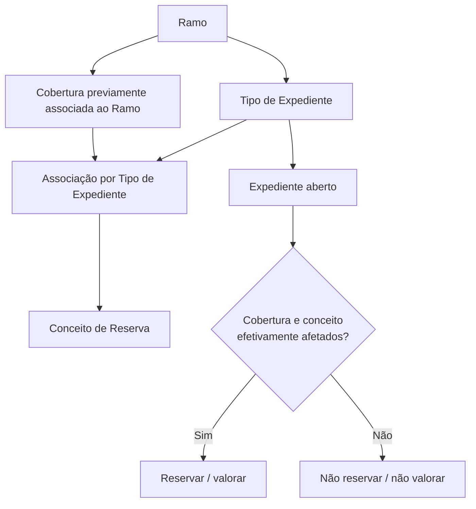

# Definição de Coberturas e Conceitos de Reserva por Tipo de Expediente

## 1. Metadados do Documento
- **Arquivo de Origem:** `Não identificado — conteúdo bruto fornecido no prompt`
- **Tipo de Documento:** `Manual Funcional`
- **Domínio / Sistema:** `Gestão de expedientes, coberturas e reservas em sinistros`
- **Público-Alvo:** `Analistas funcionais, negócio, operação e desenvolvedores`
- **Data/Versão Identificada:** `Não identificada`

---

## 2. Resumo Executivo & Contexto de Negócio

O documento descreve a configuração de coberturas e conceitos de reserva associados a um **Tipo de Expediente** dentro de um **Ramo**. A finalidade declarada é definir, para cada tipo de expediente — também referido como tipo de dano — quais coberturas do ramo e quais conceitos de reserva podem ser afetados em caso de sinistro.

A sequência funcional parte de uma condição prévia: os Tipos de Expediente devem ter sido associados ao Ramo e ter suas características definidas. Depois dessa associação inicial, cada Tipo de Expediente pode receber uma ou várias Coberturas e os respectivos Conceitos de Reserva aplicáveis.

O documento estabelece que a existência de uma cobertura ou conceito configurado não implica reserva ou valoração automática quando um expediente é aberto. A reserva deve ser realizada somente para as combinações de cobertura e conceito de reserva efetivamente afetadas pelo expediente concreto.

Como exemplo operacional, quando não existem profissionais externos em um expediente, não é necessário valorar os conceitos de reserva de Honorários (`H`) nem de Gastos (`G`). O documento também confirma que um único Tipo de Expediente pode ser associado a múltiplas coberturas do mesmo Ramo, como em um caso de Responsabilidade Civil associado simultaneamente a Responsabilidade Civil e Responsabilidade Civil Complementaria.

---

## 3. Arquitetura, Componentes & Tecnologias Envolvidas

Os componentes funcionais identificados são:

| Componente | Papel identificado no documento |
| :--- | :--- |
| Ramo | Define a chave do ramo ao qual são associados Tipos de Expediente, Coberturas e Conceitos de Reserva. |
| Tipo de Expediente | Define a chave do tipo de expediente ao qual são associadas uma ou várias Coberturas e Conceitos de Reserva. Também é referido como tipo de dano. |
| Cobertura | Define a chave da cobertura que pode ser afetada pelo Tipo de Expediente. Uma cobertura precisa estar previamente associada ao Ramo. |
| Conceito de Reserva | Define a chave usada para identificar os diferentes conceitos pelos quais pode haver reserva no Tipo de Expediente e Cobertura configurados. |
| Expediente | Caso aberto no qual somente as coberturas e conceitos de reserva efetivamente afetados devem ser reservados ou valorados. |
| Sinistro | Evento no qual as coberturas do ramo e os conceitos de reserva podem ser afetados. |



**Nota de Análise:** O documento não detalha tecnologias, APIs, bancos de dados, interfaces, métodos HTTP, contratos JSON, ambientes de execução ou mecanismos técnicos de persistência.

---

## 4. Regras de Negócio, Especificações Funcionais & Processos

### Pré-requisitos de associação

1. O Tipo de Expediente deve estar previamente associado ao Ramo.
2. A Cobertura deve estar previamente associada ao Ramo.
3. Após a associação do Tipo de Expediente ao Ramo e a definição de suas características, podem ser associadas Coberturas e Conceitos de Reserva ao Tipo de Expediente.

### Regras de associação

1. A propriedade **Ramo** identifica a chave do ramo ao qual serão associados os Tipos de Expediente, as Coberturas e os Conceitos de Reserva.
2. A propriedade **Tipo de Expediente** identifica a chave do tipo de expediente que receberá uma ou várias Coberturas e Conceitos de Reserva.
3. Um Tipo de Expediente pode afetar uma ou várias Coberturas do Ramo.
4. O sistema permite associar uma ou `n` coberturas por Tipo de Expediente.
5. A propriedade **Cobertura** contém a chave da cobertura que pode ser afetada pelo Tipo de Expediente configurado.
6. A propriedade **Conceito de Reserva** contém a chave que identifica os diferentes conceitos pelos quais é possível reservar na combinação de Tipo de Expediente e Cobertura.

### Regras de reserva e valoração

1. Ao abrir um expediente, não é obrigatório provisionar ou valorar todas as coberturas e todos os conceitos de reserva previamente definidos para o Tipo de Expediente.
2. O expediente deve reservar somente as coberturas e os conceitos de reserva que estejam efetivamente afetados naquele expediente.
3. Quando não existirem profissionais externos no expediente, os conceitos de reserva de Honorários (`H`) e Gastos (`G`) não precisam ser valorados.

### Exemplo de múltiplas coberturas

Um expediente de Responsabilidade Civil pode ser associado a mais de uma cobertura quando o produto possuir, por exemplo:

- Responsabilidade Civil;
- Responsabilidade Civil Complementaria.

Nesse cenário, o Tipo de Expediente é associado às duas coberturas.

---

## 5. Tabelas de Parâmetros, Ambientes e Estruturas de Dados

| Item / Parâmetro | Descrição / Função | Tipo / Valores / Formato | Ambiente / Observações |
| :--- | :--- | :--- | :--- |
| Ramo | Chave do ramo ao qual são associados Tipos de Expediente, Coberturas e Conceitos de Reserva. | Chave; formato não detalhado. | O documento não informa ambiente. |
| Tipo de Expediente | Chave do tipo de expediente ao qual são associadas uma ou várias Coberturas e Conceitos de Reserva. | Chave; formato não detalhado. | Deve estar previamente associado ao Ramo. Também referido como tipo de dano. |
| Cobertura | Chave da cobertura que pode ser afetada pelo Tipo de Expediente definido. | Chave; uma ou várias coberturas. | Deve estar previamente associada ao Ramo. |
| Conceito de Reserva | Chave identificadora dos conceitos pelos quais pode haver reserva para o Tipo de Expediente e Cobertura. | Chave; formato não detalhado. | Aplicável conforme afetação concreta no expediente. |
| Honorários | Conceito de reserva citado como não aplicável quando não há profissionais externos. | `H` | Não requer valoração no cenário descrito. |
| Gastos | Conceito de reserva citado como não aplicável quando não há profissionais externos. | `G` | Não requer valoração no cenário descrito. |
| Responsabilidade Civil | Cobertura usada no exemplo de associação múltipla. | Nome de cobertura. | Pode ser associada ao mesmo Tipo de Expediente que Responsabilidade Civil Complementaria. |
| Responsabilidade Civil Complementaria | Cobertura usada no exemplo de associação múltipla. | Nome de cobertura. | Pode ser associada ao mesmo Tipo de Expediente que Responsabilidade Civil. |

---

## 6. Bateria de Perguntas & Respostas para RAG (FAQ Sintético)

### P1: Qual é a finalidade de associar Coberturas e Conceitos de Reserva a um Tipo de Expediente?
**R:** A finalidade é definir, para cada Tipo de Expediente ou tipo de dano, quais coberturas do Ramo e quais Conceitos de Reserva podem ser afetados em caso de sinistro.

### P2: Um Tipo de Expediente precisa estar associado ao Ramo antes de receber Coberturas e Conceitos de Reserva?
**R:** Sim. O documento estabelece que os Tipos de Expediente devem estar previamente associados ao Ramo antes da associação de Coberturas e Conceitos de Reserva.

### P3: Uma Cobertura precisa estar previamente associada ao Ramo?
**R:** Sim. A cobertura que será vinculada ao Tipo de Expediente deve estar previamente associada ao Ramo.

### P4: É possível associar mais de uma Cobertura a um Tipo de Expediente?
**R:** Sim. O sistema permite associar uma ou `n` coberturas por Tipo de Expediente, desde que as coberturas estejam associadas previamente ao Ramo.

### P5: Todas as Coberturas e Conceitos de Reserva configurados devem ser provisionados ao abrir um expediente?
**R:** Não. Ao abrir um expediente, devem ser reservados somente as coberturas e os conceitos de reserva efetivamente afetados naquele caso.

### P6: Quando os Conceitos de Reserva de Honorários e Gastos não precisam ser valorados?
**R:** Quando o expediente não possuir profissionais externos, não é necessário valorar os Conceitos de Reserva de Honorários (`H`) nem de Gastos (`G`).

### P7: Qual é o papel da propriedade Ramo na configuração?
**R:** A propriedade Ramo indica a chave do ramo ao qual serão associados os Tipos de Expediente, as Coberturas e os Conceitos de Reserva.

### P8: Qual é o papel da propriedade Tipo de Expediente?
**R:** A propriedade Tipo de Expediente identifica a chave do tipo de expediente ao qual serão associadas uma ou várias Coberturas e Conceitos de Reserva.

### P9: Como o documento define a propriedade Cobertura?
**R:** A propriedade Cobertura contém a chave da cobertura que pode ser afetada pelo Tipo de Expediente que está sendo definido.

### P10: Para que serve a propriedade Conceito de Reserva?
**R:** A propriedade Conceito de Reserva contém a chave pela qual são identificados os diferentes conceitos para os quais pode haver reserva na combinação de Tipo de Expediente e Cobertura definida.

### P11: Como um expediente de Responsabilidade Civil pode ser configurado quando o produto tem duas coberturas relacionadas?
**R:** Se o produto possuir as coberturas Responsabilidade Civil e Responsabilidade Civil Complementaria, o Tipo de Expediente pode ser associado às duas coberturas.

### P12: O documento detalha os contratos técnicos, métodos HTTP ou formatos JSON das configurações?
**R:** Não. O documento descreve regras funcionais de associação entre Ramo, Tipo de Expediente, Cobertura e Conceito de Reserva, mas não detalha APIs, métodos HTTP, contratos JSON ou persistência técnica.

---

## 7. Glossário de Termos, Siglas & Conceitos-Chave

- **Ramo:** Chave do ramo ao qual se associam Tipos de Expediente, Coberturas e Conceitos de Reserva.
- **Tipo de Expediente:** Chave do tipo de expediente ao qual podem ser associadas uma ou várias Coberturas e Conceitos de Reserva.
- **Tipo de Daño:** Termo usado no documento como referência ao Tipo de Expediente.
- **Cobertura:** Chave da cobertura do Ramo que pode ser afetada pelo Tipo de Expediente.
- **Conceito de Reserva:** Chave que identifica um conceito pelo qual pode ser realizada reserva na combinação de Tipo de Expediente e Cobertura.
- **Expediente:** Caso aberto no qual são analisadas as coberturas e os conceitos de reserva efetivamente afetados.
- **Sinistro:** Evento no qual podem ser afetadas coberturas do Ramo e Conceitos de Reserva.
- **Honorarios (`H`):** Conceito de reserva citado no documento; não precisa ser valorado quando não existem profissionais externos.
- **Gastos (`G`):** Conceito de reserva citado no documento; não precisa ser valorado quando não existem profissionais externos.
- **Responsabilidad Civil:** Cobertura usada no exemplo de associação de múltiplas coberturas.
- **Responsabilidad Civil Complementaria:** Cobertura usada no exemplo de associação de múltiplas coberturas.

---

## 8. Notas Críticas, Riscos & Limitações

- O documento não informa o nome do sistema, a versão, a data, o proprietário funcional ou o ambiente de execução.
- O documento não apresenta detalhes de integração, APIs, modelos de dados físicos, validações de interface, permissões ou auditoria.
- Não há detalhamento sobre como o sistema determina tecnicamente que uma cobertura ou conceito de reserva está “afetado” em um expediente.
- O documento não informa se existem limites para a quantidade de coberturas associadas a um Tipo de Expediente, além de indicar que é permitido associar uma ou `n` coberturas.
- Os termos `CF`, `Home Solutions APIs Documentation Zeus` e `EN` aparecem no conteúdo bruto sem contexto funcional suficiente para interpretação confiável.
- **Nota de Análise:** O documento descreve regras funcionais de configuração e reserva, mas não detalha os métodos técnicos, contratos ou telas utilizados para mantê-las.

---

## 9. Conteúdo Bruto Estruturado (Referência Fiel)

```text
--- [PÁGINA 1 DE 3] ---

Definición Coberturas y Concepto de Reserva
por Tipo de Expediente
Objetivo
Una vez que se han asociado los Tipos de Expediente al Ramo y se le ha definido sus
características, lo siguiente es asociarle al Tipo de Daño las Coberturas y Conceptos de Reserva.
La finalidad es definir para cada tipo de Expediente (tipo de daño), las coberturas del ramo y los
conceptos de reserva a los que puede afectar en caso de siniestro.
Imagen del Mantenimiento Tipos de Expedientes por Ramo:
Ejemplo:
 / 
 CF
Home Solutions APIs Documentation Zeus
EN


--- [PÁGINA 2 DE 3] ---

Ramo
Esta propiedad indica la clave del Ramo al que se le va asociar a los Tipos de Expedientes, las
Coberturas y Conceptos de Reserva.
Tipo de Expediente
Esta propiedad será la clave del Tipo de Expediente al que se le va asociar una o varias Coberturas y
Conceptos de Reserva.
Los tipo de Expedientes tienen que estar asociados al Ramo previamente.
Cobertura
Esta propiedad contendrá la clave de la Cobertura al que puede afectar el Tipo de Expediente que
estamos definiendo.
Un tipo de Expediente podrá afectar a una o varias coberturas del Ramo.
Esta cobertura tiene que estar asociada previamente al Ramo.
Concepto de reserva
Esta propiedad será la clave por la que se va a identificar los distintos conceptos por los que se
puede a reservar en el Tipo Expediente Cobertura que estamos definiendo.


--- [PÁGINA 3 DE 3] ---

Preguntas frecuentes
¿Hay que provisionar, dar valoración, a todas las coberturas y conceptos de reservas definidas al
tipo de Expediente?
No, cuando se abra el expediente se reservará únicamente a las coberturas concepto de reserva
que se vean afectadas en ese expediente.
Por ejemplo si no hay profesionales externos, no habría que valorar los conceptos de reserva de
tipo Honorarios (H), ni Gastos (G)
¿Se puede asociar más de una cobertura a un Tipo de Expediente?
Si, el sistema permite asociar una o n coberturas por tipo de Expediente.
Por Ejemplo un expediente de Responsabilidad Civil, si el producto tuviera Responsabilidad Civil
y Responsabilidad Civil Complementaria, el tipo de expediente se asociaría a las dos coberturas.
```
