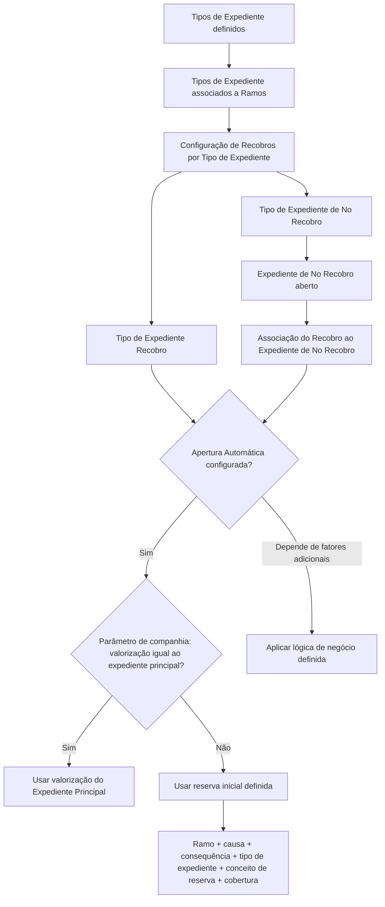

# Definição de Recobros por Tipo de Expediente

## 1. Metadados do Documento
- **Arquivo de Origem:** Não identificado no conteúdo fornecido
- **Tipo de Documento:** Especificação Funcional / Manual de Configuração
- **Domínio / Sistema:** Manutenção de Recobros por Tipos de Expediente
- **Público-Alvo:** Analistas funcionais, equipes de negócio, desenvolvedores e operadores de manutenção
- **Data/Versão Identificada:** Não identificada

---

## 2. Resumo Executivo & Contexto de Negócio

O documento define a configuração de **Recobros por Tipo de Expediente**, estabelecendo quais tipos de expediente de recobro podem ser associados a determinados tipos de expediente que não são recobros. A finalidade declarada é permitir a definição de todos os recobros possíveis associados aos diferentes tipos de expediente de **No Recobro**.

A abertura de um expediente de recobro possui uma pré-condição explícita: deve existir um expediente de **No Recobro** aberto para que o expediente de recobro possa ser associado. Antes dessa operação, os tipos de expediente precisam estar previamente definidos e associados aos respetivos ramos.

A configuração é feita por ramo e combina, no mínimo, um tipo de expediente de No Recobro e um tipo de expediente de Recobro. O documento também define a propriedade de **Apertura Automática**, que determina se o expediente de recobro será aberto automaticamente quando associado ao tipo de expediente configurado.

Quando a abertura automática ocorre, a valorização do expediente de recobro pode assumir o valor do expediente principal, caso um parâmetro ao nível de companhia assim determine. Caso contrário, a abertura é realizada com base na reserva inicial definida para uma combinação de ramo, causa, consequência, tipo de expediente, conceito de reserva e cobertura.

---

## 3. Arquitetura, Componentes & Tecnologias Envolvidas

O conteúdo não detalha tecnologias, APIs, métodos HTTP, contratos JSON, bases de dados, servidores, URLs operacionais ou versões de software. O documento descreve exclusivamente regras funcionais para a manutenção e abertura de expedientes de recobro.

### Componentes funcionais identificados

| Componente / Conceito | Papel no processo |
| :--- | :--- |
| Manutenção de Recobros por Tipos de Expediente | Configuração dos recobros possíveis para tipos de expediente de No Recobro. |
| Ramo | Chave que identifica o ramo para o qual são definidos os tipos de recobro permitidos. |
| Tipo de Expediente | Tipo de dano de No Recobro ao qual podem ser associados tipos de expediente de recobro. |
| Tipo de Expediente Recobro | Tipo de dano configurado como Recobro e associável a um tipo de expediente de No Recobro. |
| Expediente Principal | Expediente cuja valorização pode ser utilizada para o expediente de recobro, conforme parâmetro de companhia. |
| Parâmetro de Companhia | Parâmetro que determina se a valorização do expediente de recobro corresponde à valorização do expediente principal. |
| Reserva Inicial | Valor inicial utilizado na abertura automática quando a valorização do expediente principal não deve ser aplicada. |
| Lógica de Negócio de Apertura Automática | Regra adicional para determinar se um recobro será aberto automaticamente em cenários dependentes de outros fatores. |



> **Nota de Análise:** O documento menciona uma imagem de manutenção e exemplos, mas não fornece o conteúdo visual nem os valores dos exemplos no texto extraído.

---

## 4. Regras de Negócio, Especificações Funcionais & Processos

### 4.1 Finalidade da manutenção

1. A manutenção de recobros por tipos de expediente deve definir todos os recobros possíveis associáveis aos diferentes tipos de expediente de No Recobro.
2. Os tipos de expediente devem estar definidos antes da configuração de recobros.
3. Os tipos de expediente devem estar associados aos ramos antes da configuração de recobros.

### 4.2 Pré-condições para abertura de expediente de recobro

1. Deve existir um expediente de **No Recobro** aberto.
2. O expediente de No Recobro aberto é necessário para permitir a associação do expediente de recobro.
3. O tipo de expediente associado como origem deve estar definido como **NO Recobro**.
4. O tipo de expediente associado como recobro deve estar definido como **RECOBRO**.

### 4.3 Configuração por ramo

1. A propriedade **Ramo** identifica a chave do ramo para o qual serão definidos os tipos de recobro possíveis.
2. Para cada ramo, podem ser definidos os tipos de expediente de recobro aplicáveis aos diferentes tipos de expediente.
3. O documento não especifica limites quantitativos de associações por ramo, tipo de expediente ou tipo de recobro.

### 4.4 Tipo de Expediente de No Recobro

1. A propriedade **Tipo de Expediente** é a chave pela qual se identifica o tipo de dano.
2. Ao tipo de dano identificado por essa chave são associados os diversos tipos de expediente de recobro permitidos.
3. O tipo de expediente configurado nessa propriedade deve ter sido definido como **NO Recobro**.

### 4.5 Tipo de Expediente Recobro

1. A propriedade **Tipo de Expediente Recobro** corresponde à chave de um tipo de dano.
2. O tipo de dano selecionado deve ser um recobro.
3. O tipo de expediente selecionado deve ter sido definido como **RECOBRO**.

### 4.6 Abertura automática de recobro

1. A propriedade **Apertura Automática** indica se o tipo de expediente de recobro será aberto automaticamente quando for associado ao tipo de expediente em configuração.
2. Quando a abertura automática é aplicável, deve ser verificado o parâmetro de companhia referente à valorização do expediente de recobro.
3. Se o parâmetro de companhia indicar que a valorização do expediente de recobro é a valorização do expediente principal, deve ser utilizado o valor do expediente principal.
4. Se o parâmetro de companhia não indicar o uso da valorização do expediente principal, o expediente de recobro deve ser aberto com a reserva inicial definida.
5. A reserva inicial deve estar definida considerando: ramo, causa, consequência, tipo de expediente, conceito de reserva e cobertura.

### 4.7 Lógica de negócio para abertura automática

1. A propriedade **Lógica que determina Apertura Automática** deve conter uma lógica de negócio.
2. Essa lógica é necessária quando o recobro não deve ser sempre aberto automaticamente.
3. A abertura automática pode depender de fatores adicionais além do tipo de expediente que está sendo definido.
4. A lógica de negócio deve determinar se o recobro será ou não aberto automaticamente.
5. O documento não especifica quais fatores adicionais podem ser avaliados nem descreve a sintaxe, motor ou mecanismo de execução da lógica de negócio.

### 4.8 Cardinalidade de associações

1. Um recobro pode estar associado a **N expedientes de NO Recobro**.
2. O exemplo informado descreve que um **Recobro ao Asegurado** pode estar associado a **Daños Propios** para recuperar uma franquia.
3. O mesmo **Recobro ao Asegurado** também pode estar associado a um expediente do tipo **Robo**.

---

## 5. Tabelas de Parâmetros, Ambientes e Estruturas de Dados

| Item / Parâmetro | Descrição / Função | Tipo / Valores / Formato | Ambiente / Observações |
| :--- | :--- | :--- | :--- |
| Ramo | Indica a chave do ramo para o qual são definidos os possíveis tipos de recobro associados a tipos de expediente. | Chave de ramo; formato não detalhado. | O tipo de expediente deve estar associado ao ramo antes da configuração. |
| Tipo de Expediente | Identifica o tipo de dano de origem ao qual podem ser associados expedientes de recobro. | Chave de tipo de dano; deve ser **NO Recobro**. | Representa o expediente não recuperável que poderá receber associação de recobro. |
| Tipo de Expediente Recobro | Identifica o tipo de dano que representa o recobro associado. | Chave de tipo de dano; deve ser **RECOBRO**. | Pode ser associado a múltiplos expedientes de No Recobro. |
| Apertura Automática | Indica se o expediente de recobro será aberto automaticamente ao ser associado ao tipo de expediente. | Indicador booleano implícito; valores formais não detalhados. | Quando aplicável, define a origem da valorização ou da reserva inicial. |
| Parâmetro de companhia para valorização | Define se a valorização do expediente de recobro deve ser igual à valorização do expediente principal. | Parâmetro de companhia; valores formais não detalhados. | Se aplicável, a valorização do expediente principal é utilizada. |
| Valorização do Expediente Principal | Valor do expediente principal utilizado na abertura automática quando indicado pelo parâmetro de companhia. | Valor monetário; formato não detalhado. | Aplicável somente quando o parâmetro de companhia assim determinar. |
| Reserva Inicial | Valor utilizado para abrir o expediente de recobro quando a valorização do expediente principal não é aplicável. | Valor de reserva; formato não detalhado. | Deve estar definida por ramo, causa, consequência, tipo de expediente, conceito de reserva e cobertura. |
| Causa | Elemento de composição da definição de reserva inicial. | Não detalhado. | Utilizado juntamente com ramo, consequência, tipo de expediente, conceito de reserva e cobertura. |
| Consequência | Elemento de composição da definição de reserva inicial. | Não detalhado. | Utilizado juntamente com ramo, causa, tipo de expediente, conceito de reserva e cobertura. |
| Conceito de Reserva | Elemento de composição da definição de reserva inicial. | Não detalhado. | Utilizado juntamente com ramo, causa, consequência, tipo de expediente e cobertura. |
| Cobertura | Elemento de composição da definição de reserva inicial. | Não detalhado. | Utilizada juntamente com ramo, causa, consequência, tipo de expediente e conceito de reserva. |
| Lógica que determina Apertura Automática | Lógica de negócio que decide a abertura automática quando ela depende de fatores adicionais. | Lógica de negócio; formato, linguagem e regras não detalhados. | Aplicável quando o recobro não é sempre aberto automaticamente. |
| Recobro ao Asegurado | Exemplo de recobro que pode ser associado a diferentes expedientes de No Recobro. | Tipo de expediente de recobro. | Pode ser associado a Daños Propios para recuperar franquia ou a expediente do tipo Robo. |

---

## 6. Bateria de Perguntas & Respostas para RAG (FAQ Sintético)

### P1: Qual é a finalidade da manutenção de Recobros por Tipos de Expediente?
**R:** A manutenção de Recobros por Tipos de Expediente define todos os recobros que podem ser associados aos diferentes tipos de expediente de No Recobro. A configuração relaciona um ramo, um tipo de expediente definido como NO Recobro e um tipo de expediente definido como RECOBRO.

### P2: É possível abrir um expediente de recobro sem existir um expediente de No Recobro?
**R:** Não. Para abrir um expediente de recobro, deve haver um expediente de No Recobro aberto, pois esse expediente é necessário para realizar a associação do recobro.

### P3: Quais pré-requisitos devem ser atendidos antes de configurar um recobro por tipo de expediente?
**R:** Os tipos de expediente devem estar previamente definidos e associados aos ramos. Além disso, o tipo de expediente de origem deve estar definido como NO Recobro e o tipo de expediente de recobro deve estar definido como RECOBRO.

### P4: O que representa a propriedade Ramo na manutenção de recobros?
**R:** A propriedade Ramo indica a chave do ramo para o qual serão definidos todos os tipos de recobro possíveis para os diferentes tipos de expediente.

### P5: Qual tipo de expediente pode ser informado na propriedade Tipo de Expediente?
**R:** A propriedade Tipo de Expediente identifica a chave do tipo de dano ao qual serão associados tipos de expediente de recobro. Esse tipo de expediente deve ter sido definido como NO Recobro.

### P6: Qual é a condição obrigatória para um Tipo de Expediente Recobro?
**R:** O Tipo de Expediente Recobro deve ser a chave de um tipo de dano definido como RECOBRO. O documento especifica que não basta ser um tipo de dano: ele precisa estar classificado como recobro.

### P7: O que acontece quando a Apertura Automática está habilitada?
**R:** Quando a Apertura Automática está habilitada, o tipo de expediente de recobro é aberto automaticamente ao ser associado ao tipo de expediente configurado. A valorização poderá vir do expediente principal ou da reserva inicial, conforme o parâmetro configurado ao nível de companhia.

### P8: Quando a valorização do expediente de recobro usa o valor do expediente principal?
**R:** A valorização do expediente de recobro usa o valor do expediente principal quando o parâmetro ao nível de companhia indica que a valorização do expediente de recobro é a mesma do expediente principal.

### P9: Como é determinada a reserva inicial do expediente de recobro?
**R:** Quando não se utiliza a valorização do expediente principal, o expediente de recobro é aberto pela reserva inicial definida para a combinação de ramo, causa, consequência, tipo de expediente, conceito de reserva e cobertura.

### P10: Para que serve a lógica que determina Apertura Automática?
**R:** Essa lógica de negócio é usada quando um recobro não deve ser sempre aberto automaticamente ou quando sua abertura depende de fatores adicionais além do tipo de expediente em configuração. A lógica deve determinar se o recobro será aberto automaticamente ou não.

### P11: Um mesmo recobro pode ser associado a vários expedientes de No Recobro?
**R:** Sim. O documento afirma que um recobro pode estar associado a N expedientes de NO Recobro. Como exemplo, o Recobro ao Asegurado pode estar associado a Daños Propios para recuperar franquia ou a um expediente do tipo Robo.

### P12: O documento especifica métodos HTTP, contratos JSON ou serviços técnicos para a manutenção de recobros?
**R:** Não. O documento fornecido descreve regras funcionais e propriedades de configuração. Não há detalhamento de métodos HTTP, contratos JSON, APIs, tecnologias de implementação, URLs ou rotas de log.

---

## 7. Glossário de Termos, Siglas & Conceitos-Chave

- **Recobro:** Tipo de expediente definido como RECOBRO e associável a tipos de expediente de No Recobro.
- **No Recobro:** Classificação de tipo de expediente que pode receber associação de expedientes de recobro.
- **Expediente:** Entidade funcional mencionada como expediente de No Recobro, expediente de recobro ou expediente principal.
- **Expediente Principal:** Expediente cuja valorização pode ser usada para valorar o expediente de recobro, conforme parâmetro de companhia.
- **Ramo:** Chave que identifica o contexto no qual são definidos os tipos de recobro possíveis.
- **Tipo de Expediente:** Chave que identifica o tipo de dano de No Recobro ao qual recobros podem ser associados.
- **Tipo de Expediente Recobro:** Chave que identifica um tipo de dano definido como RECOBRO.
- **Apertura Automática:** Propriedade que indica se o expediente de recobro será aberto automaticamente.
- **Lógica que determina Apertura Automática:** Lógica de negócio que determina a abertura automática em situações dependentes de fatores adicionais.
- **Reserva Inicial:** Valor inicial usado na abertura do expediente de recobro quando não é aplicável a valorização do expediente principal.
- **Franquia:** Elemento mencionado no exemplo de associação entre Recobro ao Asegurado e Daños Propios.
- **Daños Propios:** Tipo de expediente de No Recobro citado como exemplo de associação para recuperação de franquia.
- **Robo:** Tipo de expediente citado como exemplo de expediente de No Recobro associável a um Recobro ao Asegurado.

---

## 8. Notas Críticas, Riscos & Limitações

- O documento não identifica arquivo de origem, data, versão, autoria ou ambiente de aplicação.
- O conteúdo não detalha tecnologia, arquitetura de software, banco de dados, APIs, integrações, endpoints, métodos HTTP, autenticação ou contratos de dados.
- A propriedade **Lógica que determina Apertura Automática** é funcionalmente descrita, mas não possui fatores de decisão, regras concretas, sintaxe, mecanismo de parametrização ou estratégia de execução.
- O parâmetro de companhia para determinar a valorização do expediente de recobro é citado, mas não possui nome técnico, valores permitidos, local de manutenção ou comportamento padrão documentado.
- A composição da reserva inicial é indicada por ramo, causa, consequência, tipo de expediente, conceito de reserva e cobertura; entretanto, não são informadas prioridades, regras de fallback ou o comportamento diante da ausência de uma reserva definida.
- O documento cita imagens e exemplos, mas o conteúdo visual ou os valores exemplificados não estão presentes no texto bruto fornecido.
- Não são informadas regras de validação para associações duplicadas, desativação de tipos de expediente, alteração de configurações existentes ou tratamento de falhas na abertura automática.

---

## 9. Conteúdo Bruto Estruturado (Referência Fiel)

```text
--- [PÁGINA 1 DE 3] ---

DEFINICIÓN de Recobros por Tipo de
Expediente

Objetivo

La finalidad es definir todos los posibles Recobros que se le puede asociar a los distintos Tipos de
Expedientes (No Recobros). Para poder abrir un Expediente de Recobro tiene que haber un
expediente de No Recobro abierto, para poder asociarlo. Antes han de estar definidos los Tipos de
Expedientes y estos deben estar asociados a los Ramos.

Imagen del Mantenimiento de Recobros por Tipos de Expediente:

/
CF
Home Solutions APIs Documentation Zeus
EN


--- [PÁGINA 2 DE 3] ---

Propiedades por Ramo

En este apartado se detallarán todas los propiedades específicas para cada ramo.

Ramo

Esta propiedad indica la clave del Ramo para el que se va a definir todos los posibles Tipos de
Recobros que pueden tener los diferentes Tipos de Expedientes.

Tipo de Expediente

Esta propiedad será la clave por la que se identifica al tipo daño, al cual se le van a asociar los
distintos tipos de Expediente de Recobro que se le van a poder asociar. Este Tipo de Expediente
tienen que haber sido definido como NO Recobro.

Tipo de Expediente Recobro

Esta propiedad será la clave de un tipo daño, que sea un Recobro, es decir que el Tipo de
Expediente tiene que haber sido definido como de RECOBRO.

Ejemplo:


--- [PÁGINA 3 DE 3] ---

Apertura Automática

Esta propiedad indica si el Tipo de Expediente de Recobro, cuando se asocie al Tipo de
Expediente que se está definiendo, se abrirá automáticamente. Cuando se apertura
automáticamente, si el parámetro a nivel de compañía indica que la valoración del Expediente de
Recobro es la del Expediente Principal, se tomará ese importe, si no es así, se abrirá por la reserva
inicial definida para el Ramo, causa, consecuencia, Tipo de Expediente, concepto de reserva,
cobertura.

Lógica que determina Apertura Automática

Esta propiedad contendrá una lógica de Negocio, cuando no siempre se abre el Recobro o no se
abre automáticamente, sino que va a depender de otros factores que no son el tipo de expediente
que se está definiendo. Se tendrá que definir la lógica de Negocio que determine si se abre o no
automáticamente el Recobro.

Preguntas frecuentes

1. ¿Un recobro puede estar asociado a N expedientes de NO Recobro?

Si, por ejemplo el Recobro al Asegurado puede estar unido a Daños Propios para recuperar
franquicia, o a un expediente de Tipo Robo, etc.

Ejemplo:
```
