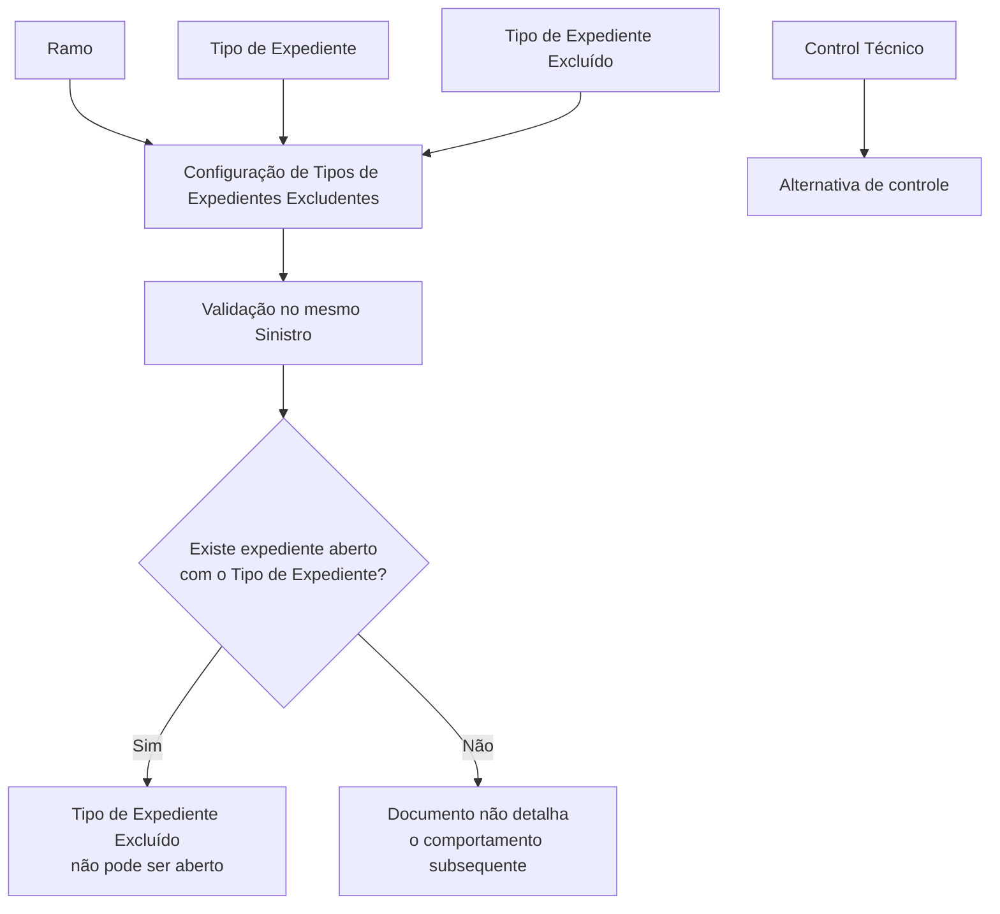

# Definição de Tipos de Expedientes Excludentes

## 1. Metadados do Documento
- **Arquivo de Origem:** Não identificado no conteúdo fornecido
- **Tipo de Documento:** Especificação Funcional
- **Domínio / Sistema:** Gestão de sinistros — Tipos de Expedientes, Ramos e tipos de danos
- **Público-Alvo:** Analistas funcionais, equipes de negócio, desenvolvedores e operação
- **Data/Versão Identificada:** Não identificada

---

## 2. Resumo Executivo & Contexto de Negócio

O documento define a funcionalidade de **Tipos de Expedientes Excludentes** no contexto de gestão de sinistros. O objetivo é estabelecer quais tipos de expediente — também tratados como tipos de dano — não podem coexistir dentro de um mesmo sinistro.

A configuração é realizada por **Ramo**. Antes de definir exclusões entre tipos de expedientes, o documento determina que os Tipos de Expedientes devem estar previamente definidos e associados aos respectivos Ramos.

A regra de exclusão relaciona um Tipo de Expediente principal a outro Tipo de Expediente Excluído. Quando já existe um expediente aberto para o tipo principal, o tipo excluído não pode ser aberto no mesmo sinistro, conforme a condição descrita no documento.

O documento também informa que a definição de Tipos de Expedientes Excludentes não é obrigatória: o controle pode ser realizado por **Control Técnico**. Não há detalhamento adicional sobre os mecanismos, critérios ou configuração de Control Técnico.

---

## 3. Arquitetura, Componentes & Tecnologias Envolvidas

Os componentes funcionais explicitamente citados são:

- **Sinistro:** entidade na qual a coexistência de tipos de expedientes é controlada.
- **Ramo:** chave que identifica o ramo para o qual serão definidos os Tipos de Expedientes Excludentes.
- **Tipo de Expediente:** chave que identifica o tipo de dano já aberto ou em definição.
- **Tipo de Expediente Excluído:** chave do tipo de dano que será excluído conforme a existência prévia do Tipo de Expediente associado.
- **Mantenimiento de Tipos de Expedientes Excluyentes:** tela ou funcionalidade de manutenção mencionada pelo documento.
- **Control Técnico:** alternativa citada para controlar a restrição sem definir Tipos de Expedientes Excludentes.

> **Nota de Análise:** O conteúdo fornecido não identifica tecnologias, APIs, bancos de dados, microsserviços, métodos HTTP, contratos JSON, URLs de ambientes ou mecanismos de persistência.



---

## 4. Regras de Negócio, Especificações Funcionais & Processos

### Objetivo funcional

1. Definir quais Tipos de Expedientes, ou tipos de danos, não podem coexistir em um mesmo sinistro.
2. Garantir que os Tipos de Expedientes estejam previamente definidos.
3. Garantir que os Tipos de Expedientes estejam associados aos Ramos antes da definição das exclusões.

### Regra de exclusão por Ramo

1. A configuração é definida para uma chave de **Ramo**.
2. Para cada Ramo, é definido um **Tipo de Expediente**.
3. Para o Tipo de Expediente definido, são informados outros **Tipos de Expedientes Excluídos**.
4. Caso já exista um expediente aberto com o Tipo de Expediente principal, o Tipo de Expediente Excluído não pode ser aberto dentro do mesmo sinistro.
5. O documento também afirma que o Tipo de Expediente Excluído “não poderá liquidarse” se um expediente do Tipo de Expediente anterior tiver sido aberto previamente e não estiver “terminado sin pagos”.

### Condições explicitamente descritas

- Um mesmo sinistro não pode possuir determinados pares de tipos de expediente configurados como excludentes.
- A exclusão está associada ao Ramo.
- A existência prévia de um expediente aberto do Tipo de Expediente principal ativa a restrição para o Tipo de Expediente Excluído.
- A documentação menciona uma condição envolvendo expediente não terminado sem pagamentos, mas não detalha os estados formais, a definição de “terminado” nem o comportamento de liquidação.
- A ausência de configuração de Tipos de Expedientes Excludentes pode ser substituída por controle via Control Técnico.

> **Nota de Análise:** O documento não apresenta o exemplo referido na seção “Ejemplo”, não define os valores possíveis para Ramo, nem especifica se a exclusão é simétrica. Portanto, não é possível concluir que, se o Tipo A exclui o Tipo B, o Tipo B automaticamente exclua o Tipo A.

---

## 5. Tabelas de Parâmetros, Ambientes e Estruturas de Dados

| Item / Parâmetro | Descrição / Função | Tipo / Valores / Formato | Ambiente / Observações |
| :--- | :--- | :--- | :--- |
| Ramo | Indica a chave do Ramo para o qual serão definidos Tipos de Expedientes Excludentes. | Chave de Ramo; valores não especificados. | Aplicável à configuração de exclusões. |
| Tipo de Expediente | Identifica o tipo de dano para o qual serão indicados outros Tipos de Expedientes que não poderão ser abertos no mesmo sinistro. | Chave de tipo de dano; valores não especificados. | Deve estar previamente definido e associado a um Ramo. |
| Tipo de Expediente Excluído | Identifica o tipo de dano excluído quando já existe expediente do Tipo de Expediente associado. | Chave de tipo de dano; valores não especificados. | Não pode ser aberto no mesmo sinistro nas condições descritas. |
| Sinistro | Contexto no qual a coexistência de Tipos de Expedientes é controlada. | Entidade de negócio; estrutura não especificada. | A regra verifica expedientes no mesmo sinistro. |
| Mantenimiento de Tipos de Expedientes Excluyentes | Funcionalidade ou tela de manutenção mencionada para gestão da configuração. | Não especificado. | O conteúdo extraído não contém a imagem da manutenção. |
| Control Técnico | Mecanismo alternativo citado para controlar exclusões sem configurar Tipos de Expedientes Excludentes. | Não especificado. | Sem detalhamento de regras, tela, processo ou integração. |
| Home Solutions APIs Documentation Zeus | Texto presente no conteúdo bruto extraído. | Não especificado. | Não há contexto suficiente para classificá-lo como sistema, ambiente, URL ou tecnologia. |

---

## 6. Bateria de Perguntas & Respostas para RAG (FAQ Sintético)

### P1: Qual é o objetivo da definição de Tipos de Expedientes Excludentes?
**R:** O objetivo é definir quais Tipos de Expedientes, também chamados de tipos de danos, não podem coexistir em um mesmo sinistro.

### P2: O que deve existir antes de configurar Tipos de Expedientes Excludentes?
**R:** Os Tipos de Expedientes devem estar previamente definidos e associados aos Ramos antes da configuração de exclusões.

### P3: Qual é a função da propriedade Ramo?
**R:** A propriedade Ramo informa a chave do Ramo para o qual serão definidos os Tipos de Expedientes que são excludentes e não podem estar presentes em um mesmo sinistro.

### P4: O que representa a propriedade Tipo de Expediente?
**R:** Tipo de Expediente é a chave que identifica o tipo de dano para o qual serão indicados outros Tipos de Expedientes que não poderão ser abertos no mesmo sinistro quando já existir um expediente aberto daquele tipo.

### P5: O que representa a propriedade Tipo de Expediente Excluído?
**R:** Tipo de Expediente Excluído é a chave do tipo de dano que será excluído quando um expediente do Tipo de Expediente anterior já tiver sido aberto, conforme as condições indicadas na documentação.

### P6: Um Tipo de Expediente Excluído pode ser aberto se já houver um expediente aberto do Tipo de Expediente principal?
**R:** Não. O documento informa que, se já existir um expediente aberto com o Tipo de Expediente principal, os Tipos de Expedientes Excluídos não poderão ser abertos dentro do mesmo sinistro.

### P7: A configuração de Tipos de Expedientes Excludentes é obrigatória?
**R:** Não. A seção de perguntas frequentes informa que é possível não definir Tipos de Expedientes Excludentes e realizar o controle por Control Técnico.

### P8: O documento especifica como funciona o Control Técnico?
**R:** Não. O documento apenas confirma que o controle pode ser realizado por Control Técnico, sem detalhar regras, configuração, interface, critérios ou comportamento operacional.

### P9: A exclusão entre Tipos de Expedientes é definida globalmente ou por Ramo?
**R:** A exclusão é definida por Ramo. A propriedade Ramo identifica a chave para a qual serão configurados os Tipos de Expedientes Excludentes.

### P10: O documento define os estados possíveis de um expediente?
**R:** Não. O documento menciona que o Tipo de Expediente Excluído não poderá ser liquidado se houver expediente prévio que não esteja “terminado sin pagos”, mas não define os estados formais do expediente.

### P11: O documento demonstra um exemplo de configuração de exclusão?
**R:** Não no conteúdo fornecido. A seção “Ejemplo” é mencionada, mas nenhum exemplo de valores, pares de tipos de expediente ou imagem correspondente foi apresentado no texto extraído.

### P12: A exclusão entre Tipo de Expediente e Tipo de Expediente Excluído é bidirecional?
**R:** O documento não especifica que a exclusão seja bidirecional. Ele descreve uma relação entre um Tipo de Expediente principal e um Tipo de Expediente Excluído, sem afirmar reciprocidade automática.

---

## 7. Glossário de Termos, Siglas & Conceitos-Chave

- **Ramo:** Chave do ramo para o qual são definidos os Tipos de Expedientes Excludentes.
- **Sinistro:** Entidade de negócio na qual determinados Tipos de Expedientes não podem coexistir.
- **Tipo de Expediente:** Chave que identifica o tipo de dano para o qual são configuradas exclusões.
- **Tipo de Expediente Excluído:** Chave do tipo de dano que não pode ser aberto ou que possui restrição de liquidação nas condições descritas.
- **Tipo de Dano:** Termo utilizado no documento como referência ao Tipo de Expediente.
- **Control Técnico:** Alternativa citada para controlar as exclusões sem configurar Tipos de Expedientes Excludentes.
- **Liquidarse:** Termo em espanhol usado no documento para indicar liquidação; o processo de liquidação não é detalhado.
- **Mantenimiento:** Termo em espanhol referente à manutenção ou gestão da configuração de Tipos de Expedientes Excludentes.

---

## 8. Notas Críticas, Riscos & Limitações

- O conteúdo não identifica nome de arquivo, versão, data, autor ou responsável pelo documento.
- A imagem mencionada como “Imagen del Mantenimiento de Tipos de Expedientes Excluyentes” não está disponível no texto fornecido.
- A seção “Ejemplo” não contém exemplo efetivo de configuração ou comportamento.
- Não há lista de Ramos, Tipos de Expedientes ou Tipos de Expedientes Excluídos.
- Não há definição de contratos técnicos, APIs, integrações, banco de dados, serviços, tecnologias ou ambientes.
- Não há detalhamento sobre mensagens de erro, interface de usuário, permissões, auditoria ou persistência da configuração.
- Não é possível inferir que a exclusão seja bidirecional.
- O significado operacional exato de “no podrá liquidarse” e “no está terminado sin pagos” não foi detalhado.
- Control Técnico é mencionado como alternativa, mas sua implementação e suas regras permanecem não especificadas.

---

## 9. Conteúdo Bruto Estruturado (Referência Fiel)

```text
--- [PÁGINA 1 DE 3] ---

DEFINICIÓN Tipo de Expedientes Excluyente
Objetivo
La finalidad es definir que Tipos de Expedientes, tipos de daños, no pueden convivir en un mismo
siniestro. Previamente se han de definir los Tipos de Expedientes y asociarlos a los Ramos.
Imagen del Mantenimiento de Tipos de Expedientes Excluyentes:
 /
 CF
Home Solutions APIs Documentation Zeus
EN


--- [PÁGINA 2 DE 3] ---

Propiedades por Ramo
En este apartado se detallarán todos las propiedades específicas para la clave del ramo que estamos
definiendo.
Ramo
Esta propiedad indica la clave del Ramo para el que se va a definir los Tipos de Expedientes que
son Excluyentes, que no puede tener un mismo Siniestro.
Tipo Expediente
Esta propiedad será la clave por la que se identifica al tipo daño, al cual se le va a indicar que otros
Tipos de Expedientes no se podrán abrir dentro de un mismo siniestro, si ya hay un expediente con
este el Tipo abierto.
Tipo Expediente Excluido
Esta propiedad será la clave del tipo daño, que será excluido, no podrá liquidarse, si ya se ha
abierto previamente un expediente con el Tipo anterior y no está terminado sin pagos.
Ejemplo:


--- [PÁGINA 3 DE 3] ---

Vínculos
Definición Tipo Expediente
Preguntas frecuentes
¿Puede no definirse Tipos de Expedientes Excluyentes y controlarlo por Control Técnico?
Si, es posible.
```
