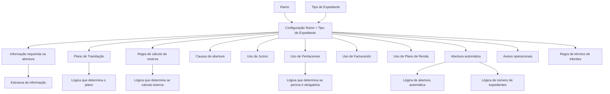

# Definição de Tipos de Expediente por Ramo — Propriedades, Processos e Regras Operacionais

## 1. Metadados do Documento
- **Arquivo de Origem:** Não identificado no conteúdo extraído
- **Tipo de Documento:** Especificação Funcional
- **Domínio / Sistema:** Gestão de expedientes/sinistros por ramo
- **Público-Alvo:** Analistas funcionais, configuradores, tramitadores, operação e equipes de negócio
- **Data/Versão Identificada:** Não identificada

---

## 2. Resumo Executivo & Contexto de Negócio

O documento define o comportamento de cada tipo de expediente nos diferentes ramos em que determinado dano pode ocorrer. A configuração por ramo permite estabelecer quais informações devem ser coletadas, se o expediente pode receber perícia, ser associado a um juízo, utilizar faturamento, ser administrado por um plano de renda ou ser aberto automaticamente.

A unidade de configuração é a associação entre **Ramo** e **Tipo de Expediente**. Embora o mesmo tipo de expediente possa existir em vários ramos, as suas características operacionais, valores, coberturas e limites são definidos no contexto de cada ramo. Como exemplo, o tipo `ROB - Robo` pode existir em todos os ramos para permitir a exploração corporativa da quantidade de roubos.

As propriedades configuradas determinam o ciclo operacional do expediente desde a abertura até o encerramento. Esse ciclo inclui captura de informações, seleção de plano de tramitação, cálculo de reservas, causas de abertura, regras de valoração, integração com os módulos de juízos, perícias, faturamento e plano de renda.

O documento também descreve regras de automação. Um expediente pode ser aberto automaticamente quando a causa-consequência selecionada permitir essa abertura, usando a reserva inicial definida para a combinação de ramo, causa, consequência, tipo de expediente, conceito de reserva e cobertura. Lógicas de negócio podem substituir comportamentos fixos quando as decisões dependerem de fatores adicionais.

---

## 3. Arquitetura, Componentes & Tecnologias Envolvidas

O conteúdo não especifica arquitetura de software, tecnologias, APIs, protocolos, servidores, bancos de dados ou ambientes. A arquitetura descrita é funcional e configuracional, baseada na associação entre ramo e tipo de expediente.

### Componentes funcionais identificados

| Componente | Função no processo |
| :--- | :--- |
| Ramo | Define o contexto de negócio no qual as características do tipo de expediente são configuradas. |
| Tipo de Expediente | Define a categoria de expediente cujo comportamento é parametrizado por ramo. |
| Estrutura de informação | Conjunto de propriedades e atributos requisitados na abertura de um expediente. |
| Lógica de Negócio | Regra configurável utilizada quando uma decisão depende de fatores além do tipo de expediente. |
| Plano de Tramitação | Plano responsável pelas gestões necessárias desde a abertura até o encerramento do expediente. |
| Cálculo de Reservas | Processo de fim de mês que pode considerar ou desconsiderar os importes de um expediente. |
| Módulo de Juízos | Módulo que permite associar expedientes marcados como aptos a um juízo. |
| Módulo de Peritaciones | Módulo que permite solicitar e controlar perícias para tipos de expediente habilitados. |
| Módulo de Facturación | Módulo utilizado para tramitar importes econômicos de determinados expedientes, especialmente de Saúde. |
| Plano de Renda | Mecanismo de gestão aplicável especialmente a tipos de expediente de Acidentes Pessoais ou Acidentes Laborais. |
| Avisos | Notificações apresentadas ao tramitador em abertura, reassociação ou modificação de expediente. |



> **Nota de Análise:** O documento cita “Home Solutions APIs Documentation Zeus” na extração bruta, mas não fornece detalhamento de APIs, métodos HTTP, contratos JSON, autenticação ou integração técnica associada.

---

## 4. Regras de Negócio, Especificações Funcionais & Processos

### 4.1 Configuração-base por ramo

1. A propriedade **Ramo** identifica a chave do ramo para o qual serão definidas as características do tipo de expediente.
2. A propriedade **Tipo de Expediente** identifica a chave do tipo de expediente cujas características serão configuradas.
3. Um mesmo tipo de expediente pode existir em vários ramos.
4. As características de comportamento, valores, coberturas e limites do tipo de expediente são definidas por ramo.
5. O tipo de expediente pode ser único por sinistro, impedindo a abertura de mais de uma ocorrência desse tipo para o mesmo sinistro.

### 4.2 Moeda e valoração

1. A propriedade **Moneda** determina a moeda usada para valorar o tipo de expediente.
2. A seleção da moeda possui apoio do catálogo de moedas.
3. O valor `99` determina que, ao abrir o expediente, o sistema deve utilizar a moeda da apólice.
4. A moeda do expediente é independente da moeda utilizada posteriormente nos pagamentos do expediente.
5. A propriedade **Moneda Única** define se a moeda previamente configurada é a única permitida:
   - Se for única, o tramitador não pode alterar a moeda ao abrir o expediente.
   - Se não for única, o tramitador pode alterar a moeda ao abrir o expediente.

### 4.3 Informações solicitadas na abertura

1. A propriedade **Información para el Tipo de Expediente** define os dados requisitados na abertura de um expediente.
2. Para cada propriedade da estrutura de informação devem ser definidos:
   - comprimento;
   - tipo de dado, como numérico, alfanumérico ou data;
   - obrigatoriedade, incluindo condições sob as quais o dado se torna obrigatório;
   - validação, como a existência de código em catálogo;
   - valor inicial.
3. O conjunto de propriedades e atributos deve receber uma chave e um nome, sendo cadastrado como uma estrutura.
4. A chave da estrutura deve ser associada à agrupação de informação do expediente.
5. Posteriormente, a chave da estrutura deve ser associada ao tipo de expediente.
6. Quando não for necessário solicitar informações, deve ser utilizado o valor genérico da estrutura.
7. A propriedade **Lógica que determina la información del Tipo de Expediente** deve ser utilizada quando a informação não for fixa por tipo de expediente e depender de outros fatores.

### 4.4 Plano de tramitação e reservas

1. O **Plan de Tramitación** realiza todas as gestões necessárias desde a abertura até o fechamento do expediente.
2. Pode haver tipos de expediente que não necessitem de plano de tramitação.
3. Quando o plano não for sempre o mesmo e depender de outros fatores, deve ser utilizada uma lógica de negócio.
4. A propriedade **Lógica que determina el Plan de Tramitación** deve determinar o código do plano usado para tramitar o tipo de dano.
5. A propriedade **Calcula Reserva** determina se os importes do expediente são considerados no cálculo de reservas de fim de mês.
6. Se a entrada no cálculo de reservas depender de fatores além do tipo de expediente, deve ser definida uma lógica de negócio.
7. A propriedade **Lógica que determina si Calcula Reserva** deve decidir se os expedientes do tipo de dano são considerados no cálculo de reservas de fim de mês.

### 4.5 Causas de abertura e reserva inicial manual

1. A propriedade **Causas de Apertura** determina se as causas de abertura devem ser solicitadas na abertura do expediente.
2. Se a solicitação for habilitada, as causas de abertura devem ser definidas para o tipo de expediente do ramo correspondente.
3. A propriedade **Valoración Ajustada** define se o tramitador pode informar manualmente uma reserva inicial ao abrir o expediente.
4. Quando a valoração ajustada não permitir reserva manual, o expediente é aberto com a reserva média previamente definida e essa reserva não pode ser modificada pelo tramitador.

### 4.6 Juízos

1. A propriedade **Juicio** determina se um expediente pode ser associado a um juízo.
2. Ao registrar um juízo e associar expedientes, somente são exibidos os expedientes cujo tipo possua a marca de juízo.
3. A propriedade **Varios Juicios** determina se um expediente pode ser associado a vários juízos.

### 4.7 Peritaciones

1. A propriedade **Peritación** determina se pode ser realizada uma perícia no expediente.
2. Somente pode ser solicitada perícia para expedientes cujo tipo tenha a marca de perícia.
3. A propriedade **Peritación Obligatoria** somente é solicitada se a propriedade **Peritación** for afirmativa.
4. Quando a perícia for obrigatória, não é permitido realizar liquidações até que a perícia seja executada.
5. A propriedade **Lógica que determina si Peritación Obligatoria** deve ser definida quando a obrigatoriedade depender de outros fatores além do tipo de dano.

### 4.8 Facturação e plano de renda

1. A propriedade **Facturación** determina se os importes econômicos do expediente são tramitados pelo módulo de faturamento.
2. O uso de faturamento é citado como usual principalmente para tipos de expediente de Saúde.
3. A propriedade **Plan de Renta** determina se o expediente será gerido por um plano de renda.
4. O uso de plano de renda é citado como usual principalmente para tipos de expediente de Acidentes Pessoais ou Acidentes Laborais.

### 4.9 Abertura automática e avisos

1. A propriedade **Apertura Automática** determina se o tipo de expediente pode ser aberto automaticamente, desde que seja escolhida uma causa-consequência que permita a abertura.
2. Na abertura automática, a reserva inicial é definida para a combinação de:
   - ramo;
   - causa;
   - consequência;
   - tipo de expediente;
   - conceito de reserva;
   - cobertura.
3. A propriedade **Lógica que determina Apertura Automática** deve ser utilizada quando a abertura automática depender de fatores além do tipo de expediente.
4. A propriedade **Lógica que determina Número de Expedientes a abrir automáticamente** é solicitada somente se a abertura automática estiver ativa ou se existir lógica que determine se o expediente deve ser aberto automaticamente.
5. A lógica de número de expedientes deve devolver a quantidade de expedientes do tipo a abrir automaticamente.
6. Se o tipo de expediente for único por sinistro, como nos exemplos de Robo Total e Pérdida Total, somente um expediente pode ser aberto.
7. A propriedade **Lógica que determina Aviso Apertura de Expediente** devolve o aviso mostrado ao tramitador quando recebe um novo expediente aberto manual ou automaticamente.
8. A propriedade **Tipo de Aviso de Reasignación de Expediente** contém o subtipo de aviso apresentado quando um expediente, antes tratado por outro tramitador, é reassociado manual ou automaticamente.
9. A propriedade **Aviso en la Modificación de Expediente** define se é gerado aviso na modificação do expediente.
10. Caso o valor da propriedade de aviso de modificação seja `2`, a propriedade **Lógica que determina Aviso Modificación de Expediente** é obrigatória e deve devolver o aviso mostrado ao tramitador quando o expediente for modificado manual ou automaticamente.

### 4.10 Término de trâmites

1. A propriedade **Tipo de Termina Tramites** determina a ação aplicável a itens pendentes do plano de tramitação quando um expediente é encerrado manual ou automaticamente.
2. A ação se aplica, entre outros elementos, aos trâmites pendentes e avisos pendentes.

---

## 5. Tabelas de Parâmetros, Ambientes e Estruturas de Dados

| Item / Parâmetro | Descrição / Função | Tipo / Valores / Formato | Ambiente / Observações |
| :--- | :--- | :--- | :--- |
| Ramo | Identifica a chave do ramo da configuração. | Chave de ramo | Configuração por ramo. |
| Tipo de Expediente | Identifica o tipo cujas características são configuradas. | Chave de tipo de expediente | Associado a um ramo. |
| Único por Siniestro | Define se o tipo só pode ser aberto uma vez por sinistro. | Indicador Sim/Não | Limita a uma abertura automática ou manual quando aplicável. |
| Moneda | Define a moeda de valoração do expediente. | Código de moeda; `99` | `99` utiliza a moeda da apólice. |
| Moneda Única | Define se a moeda configurada pode ser alterada pelo tramitador. | Indicador Sim/Não | Se “Sim”, o tramitador não pode alterar a moeda. |
| Información para el Tipo de Expediente | Define os dados requisitados na abertura. | Estrutura de informação | Pode usar a estrutura genérica quando não houver dados a solicitar. |
| Propriedade da estrutura | Define cada dado requerido. | Comprimento, tipo, obrigatoriedade, validação, valor inicial | Tipos citados: numérico, alfanumérico e data. |
| Lógica que determina la información | Determina os dados solicitados quando não são fixos. | Lógica de Negócio | Aplicável quando dependente de outros fatores. |
| Plan de Tramitación | Executa gestões entre abertura e encerramento. | Código de plano | Pode não ser necessário ou ser determinado por lógica. |
| Lógica que determina el Plan de Tramitación | Determina o código do plano de tramitação. | Lógica de Negócio | Aplicável quando o plano não é fixo. |
| Calcula Reserva | Define se importes entram no cálculo de reservas de fim de mês. | Indicador | Pode ser complementado por lógica. |
| Lógica que determina si Calcula Reserva | Determina a inclusão no cálculo de reservas. | Lógica de Negócio | Usada quando há fatores adicionais. |
| Causas de Apertura | Define se causas de abertura devem ser solicitadas. | Indicador Sim/Não | Exige definição das causas quando habilitada. |
| Valoración Ajustada | Define se o tramitador pode informar reserva inicial manual. | Indicador | Caso contrário, utiliza reserva média previamente definida. |
| Juicio | Define se o expediente pode ser associado a juízo. | Indicador | Apenas tipos com marca de juízo são exibidos para associação. |
| Varios Juicios | Define se o expediente pode ser associado a mais de um juízo. | Indicador Sim/Não | Uso no módulo de juízos. |
| Peritación | Define se o expediente pode receber perícia. | Indicador | Só pode haver solicitação para tipos com marca de perícia. |
| Peritación Obligatoria | Define se a perícia é obrigatória. | Indicador Sim/Não | Solicitada somente quando Peritación for afirmativa. |
| Lógica que determina si Peritación Obligatoria | Determina a obrigatoriedade de perícia. | Lógica de Negócio | Aplicável quando outros fatores influenciam a regra. |
| Facturación | Define se importes econômicos são tramitados pelo módulo de faturamento. | Indicador | Citado como usual para expedientes de Saúde. |
| Plan de Renta | Define se o expediente é gerido por plano de renda. | Indicador | Citado como usual para Acidentes Pessoais ou Laborais. |
| Apertura Automática | Define se o tipo pode ser aberto automaticamente. | Indicador Sim/Não | Requer causa-consequência que permita abertura. |
| Reserva na abertura automática | Reserva inicial utilizada ao abrir automaticamente. | Combinação de parâmetros | Ramo, causa, consequência, tipo, conceito de reserva e cobertura. |
| Lógica que determina Apertura Automática | Determina se deve ocorrer abertura automática. | Lógica de Negócio | Aplicável quando a decisão depende de outros fatores. |
| Lógica que determina Número de Expedientes | Retorna o número de expedientes a abrir automaticamente. | Lógica de Negócio | Solicitada quando abertura automática ou sua lógica estiver ativa. |
| Lógica que determina Aviso Apertura | Retorna aviso de expediente novo. | Lógica de Negócio | Aplicável a abertura manual ou automática. |
| Tipo de Aviso de Reasignación | Define subtipo de aviso de reassociação. | Subtipo de aviso | Quando expediente passa de um tramitador para outro. |
| Aviso en la Modificación de Expediente | Define se gera aviso durante modificação. | `1` ou `2` | `1`: não gera; `2`: gera aviso. |
| Lógica que determina Aviso Modificación | Retorna aviso mostrado em modificação de expediente. | Lógica de Negócio | Obrigatória se o tipo de aviso de modificação for `2`. |
| Tipo de Termina Tramites | Define o tratamento de pendências no encerramento. | `N`, `D`, `A`, `T` | Aplicável a encerramento manual ou automático. |

### Valores de `Tipo de Termina Tramites`

| Valor | Significado |
| :--- | :--- |
| `N` | Não finaliza nada. |
| `D` | Finaliza trâmites definidos pendentes. |
| `A` | Finaliza avisos pendentes. |
| `T` | Finaliza tudo. |

---

## 6. Bateria de Perguntas & Respostas para RAG (FAQ Sintético)

### P1: Um mesmo tipo de expediente pode ser configurado para mais de um ramo?
**R:** Sim. Um mesmo tipo de expediente pode existir em vários ramos, pois as características de comportamento, valores, coberturas e limites são definidas por ramo. O documento usa o exemplo do tipo `ROB - Robo`, que pode ser utilizado em todos os ramos para permitir a exploração corporativa da quantidade de roubos.

### P2: O que acontece quando a moeda do expediente é configurada com o valor 99?
**R:** O valor `99` instrui o sistema a utilizar, no momento da abertura do expediente, a mesma moeda da apólice. A moeda do expediente permanece independente da moeda usada posteriormente para realizar pagamentos desse expediente.

### P3: Qual é a diferença entre Moneda e Moneda Única?
**R:** A propriedade **Moneda** define a moeda de valoração do expediente. A propriedade **Moneda Única** define se essa moeda é obrigatória: quando a moeda é única, o tramitador não pode alterá-la na abertura; quando não é única, o tramitador pode selecionar outro valor de moeda.

### P4: Quais atributos devem ser definidos para os dados solicitados na abertura de um expediente?
**R:** Para cada propriedade da estrutura de informação devem ser definidos o comprimento, o tipo de dado, a obrigatoriedade ou as condições de obrigatoriedade, a validação — como a existência de código em catálogo — e o valor inicial. O conjunto dessas propriedades recebe chave e nome como uma estrutura associada ao tipo de expediente.

### P5: Quando deve ser usada uma lógica para determinar o plano de tramitação?
**R:** A lógica deve ser usada quando o plano de tramitação não for fixo para o tipo de expediente e depender de outros fatores. Essa lógica deve determinar o código do plano que será utilizado para tramitar o tipo de dano.

### P6: Quando um expediente participa do cálculo de reservas de fim de mês?
**R:** A participação é definida pela propriedade **Calcula Reserva**. Se a inclusão no cálculo depender exclusivamente do tipo de expediente, a propriedade pode estabelecer o comportamento diretamente. Se depender de outros fatores, deve ser definida a lógica de negócio **Lógica que determina si Calcula Reserva**.

### P7: Qual é o efeito de configurar uma perícia como obrigatória?
**R:** Quando um tipo de expediente possui perícia obrigatória, não é permitido realizar liquidações até que a perícia seja realizada. A propriedade de obrigatoriedade só é solicitada quando a propriedade **Peritación** estiver configurada afirmativamente.

### P8: Como funciona a abertura automática de expedientes?
**R:** A abertura automática é permitida quando o tipo de expediente estiver habilitado para isso e a causa-consequência escolhida permitir a abertura. O expediente é aberto com a reserva inicial definida para a combinação de ramo, causa, consequência, tipo de expediente, conceito de reserva e cobertura.

### P9: Como é calculada a quantidade de expedientes abertos automaticamente?
**R:** A quantidade é devolvida pela **Lógica que determina Número de Expedientes a abrir automáticamente**. Essa lógica só é solicitada quando a abertura automática está ativa ou quando existe lógica para decidir se haverá abertura automática. Se o tipo for único por sinistro, somente um expediente pode ser aberto.

### P10: Quais são os valores possíveis para aviso na modificação de expediente?
**R:** O valor `1` significa que não é gerado aviso na modificação do expediente. O valor `2` significa que é gerado aviso. Quando o valor é `2`, torna-se obrigatória uma lógica de negócio que devolva o aviso apresentado ao tramitador na modificação manual ou automática.

### P11: O que controla a associação de expedientes a juízos?
**R:** A propriedade **Juicio** determina se o tipo de expediente pode ser associado a um juízo. Ao registrar um juízo, somente são exibidos para associação os expedientes cujo tipo possua a marca de juízo. A propriedade **Varios Juicios** determina se o mesmo expediente pode ser associado a vários juízos.

### P12: O que ocorre com pendências quando um expediente é encerrado?
**R:** A propriedade **Tipo de Termina Tramites** define o tratamento de trâmites e avisos pendentes quando o expediente é encerrado manual ou automaticamente. Os valores disponíveis são `N` para não finalizar nada, `D` para finalizar trâmites definidos pendentes, `A` para finalizar avisos pendentes e `T` para finalizar tudo.

---

## 7. Glossário de Termos, Siglas & Conceitos-Chave

- **Apertura Automática:** Abertura automática de expediente quando o tipo e a causa-consequência permitem esse processamento.
- **Causa-consequência:** Combinação selecionada que pode permitir a abertura automática do expediente.
- **Cobertura:** Elemento que compõe a combinação usada para definir a reserva inicial na abertura automática.
- **Expediente:** Entidade de gestão de um tipo de dano ou sinistro, tratada desde a abertura até o encerramento.
- **Facturación:** Módulo usado para tramitar importes econômicos de expedientes, citado especialmente para Saúde.
- **Lógica de Negócio:** Regra que determina um comportamento quando este não é fixo e depende de fatores adicionais.
- **Peritación:** Perícia que pode ser solicitada para expedientes cujo tipo possua a marca correspondente.
- **Plan de Renta:** Plano de renda usado na gestão de determinados expedientes, citado especialmente para Acidentes Pessoais ou Laborais.
- **Plan de Tramitación:** Plano que executa as gestões necessárias desde a abertura até o encerramento do expediente.
- **Ramo:** Contexto de negócio no qual são configuradas as características do tipo de expediente.
- **Reserva:** Importe considerado ou não no cálculo de reservas de fim de mês e usado na abertura automática conforme configuração.
- **Siniestro:** Sinistro ao qual um expediente pode estar associado.
- **Tramitador:** Usuário responsável por tratar o expediente.
- **Juicio:** Processo ao qual um expediente pode ser associado quando o tipo possui a marca de juízo.

---

## 8. Notas Críticas, Riscos & Limitações

- O documento não identifica nome de arquivo, data, versão, autor, sistema proprietário, ambiente, servidor, URL, tecnologia ou contrato de integração.
- O documento descreve propriedades e regras funcionais, mas não detalha telas, persistência de dados, APIs, métodos HTTP, eventos, serviços, permissões ou mecanismos de auditoria.
- Diversas propriedades dependem de **Lógica de Negócio**, porém o conteúdo não descreve como essas lógicas são implementadas, versionadas, testadas ou priorizadas.
- A consistência entre regras de abertura automática, quantidade de expedientes e a restrição de expediente único por sinistro é crítica: tipos únicos por sinistro não podem gerar mais de um expediente.
- A obrigatoriedade de perícia bloqueia liquidações até a execução da perícia, constituindo uma dependência operacional explícita.
- A lógica de aviso de modificação é obrigatória quando o parâmetro de aviso de modificação possui valor `2`.
- O documento menciona exemplos, mas os detalhes desses exemplos não estão presentes na extração.

---

## 9. Conteúdo Bruto Estruturado (Referência Fiel)

```text
--- [PÁGINA 1 DE 8] ---

DEFINICIÓN Tipo de Expediente Por Ramo
Objetivo
La finalidad es definir comportamiento de cada tipo de expedientes en los diferentes ramos donde
se pueda dar este tipo de daño, es decir, la información que se va a solicitar para ese tipo de
expediente, si se puede peritar, si se puede asociar a un juicio, si es un recobro, etc.
Propiedades Por Ramo
Propiedades por Ramo Uso de Módulos
Plan de Tramitación
Propiedades Por Ramo para Uso de Juicios
Propiedades Por Ramo para Uso de peritaciones
Propiedades por Ramo Facturación
Propiedades por Ramo Plan de Renta
Propiedades Por Ramo para Procesos Automáticos
Propiedades por Ramo
Como se ha indicado anteriormente, los tipos de expedientes pueden tener diferente comportamiento
por ramo.
En este apartado se detallará todos las propiedades necesarias para definir el comportamiento del
tipo de expediente dentro de un Ramo.
Se definirá que captura de datos va a tener asociado el tipo de expediente, que plan de tramitación
 / 
 CF
Home Solutions APIs Documentation Zeus
EN


--- [PÁGINA 2 DE 8] ---

(Procesos necesarios para tramitar correctamente el expediente), si se apertura automáticamente,
etc.
Imagen del Mantenimiento Tipos de Expedientes por Ramo:
Ramo
Esta propiedad indica la clave del Ramo para el que se va a definir las características del tipo de
expediente.
Tipo de Expediente
Esta propiedad indica la clave del Tipo de Expediente para el que se va a definir las características.


--- [PÁGINA 3 DE 8] ---

Único por Siniestro
Esta propiedad indica si ese tipo de expediente sólo puede abrirse una vez por siniestro.
Moneda
Esta propiedad indica la moneda con la que se va a valorar ese tipo de expediente.
Para dar valor a esta propiedad se contará con la ayuda del catálogo de monedas.
Si se necesita que la moneda del expediente sea siempre la misma que la moneda de la póliza, se
tendrá que introducir 99. Este valor indica al sistema que cuando se abra el expediente, tome la
moneda de la póliza.
La moneda del expediente, es independiente de la moneda con la que posteriormente se realicen los
pagos de dicho expediente.
Moneda Única
Esta propiedad indica si la moneda que se ha definido en la propiedad anterior, es la única moneda
permitida para el Tipo de Expediente.
Si se indica que, SI es única, el tramitador no podrá cambiar el valor de la moneda cuando
abra un expediente.
Si se indica que No es única, el tramitador podrá cambiar el valor de la moneda cuando se
abra un expediente.
Información para el Tipo de Expediente
Esta propiedad indica los datos que se van a pedir cuando se abra un expediente del Tipo que se
está definiendo.
Para cada tipo de expediente habrá que determinar toda la información que se va a requerir, para
cada propiedad habrá que indicar:
Longitud: número de posiciones.
Tipo: Numérico, alfanumérico, fecha…
Obligatoriedad: si es o no obligatorio, o las condiciones para que este dato sea obligatorio.
Validación: si está codificado en un catálogo, ver si existe el código en dicho catálogo…
Valor Inicial: Si se quiere que el sistema cuando pida la información ya tenga un valor inicial,
Etc.
A toda esa información (conjunto de propiedades, atributos) se le dará una clave y un nombre es
decir se le dará de alta como estructura y se le asociará a la agrupación de información de
Ejemplo:


--- [PÁGINA 4 DE 8] ---

expediente, posteriormente dicha clave de estructura, se asociará al Tipo de Expediente.
Si no se quiere pedir información, se utilizará el valor genérico de la estructura.
Lógica que determina la información del Tipo de Expediente
Esta propiedad contendrá una lógica de Negocio, cuando la información que recoge los datos no es
fija por tipo de expediente, sino que depende de otros factores.
Se tendrá que definir la lógica de Negocio que determine la información que se va a solicitar, para
tramitar ese tipo de daño.
Plan de Tramitación
Esta propiedad indicará el plan de tramitación que se encargará de realizar todas las gestiones
necesarias desde la apertura del expediente, hasta su cierre. Se facilitará la ayuda de los planes de
tramitación definidos.
Puede haber tipos de Expedientes que por su naturaleza no necesiten un plan de tramitación o que
el plan no sea siempre el mismo y dependa de otros factores. En este último caso se ha de utilizar
una lógica.
Lógica que determina el Plan de Tramitación
Esta propiedad contendrá una lógica de Negocio, cuando el plan de tramitación no es fijo por tipo de
expediente, sino que depende de otros factores. Se tendrá que definir la lógica de Negocio que
determine el código del plan que se va a utilizar, para tramitar este tipo de daño.
Calcula Reserva
Esta propiedad indicará si un expediente con el Tipo de Daño que se está definiendo, se tiene en
cuenta o no sus importes, en el cálculo de reservas de fin de mes. Cuando haya otros factores
además del Tipo de Expediente que determine si entra o no entra, se tendrá que definir una lógica de
Negocio.
Lógica que determina si Calcula Reserva
Esta propiedad contendrá una lógica de Negocio, que determinará si los expedientes con este tipo
de daño se tienen en cuenta o no, para el cálculo de reservas de fin de mes. Se tendrá que
Ejemplo:
Ejemplo:
Ejemplo:


--- [PÁGINA 5 DE 8] ---

definir esta lógica cuando no dependa únicamente del tipo de daño, sino de otros factores.
Causas de Apertura
Esta propiedad indicará si se quiere pedir las causas de apertura cuando estamos aperturando un
expediente del tipo que estamos definiendo. Si se indica que sí, habrá que definir las causas de
Apertura de Expedientes para el Tipo de Expediente del Ramo que se está definiendo.
Valoración Ajustada
Esta propiedad indicará si al abrir un expediente de este tipo manualmente, se le va a permitir al
tramitador indicar una reserva inicial manualmente, o si por el contrario siempre se va a abrir por la
reserva promedio definida previamente, sin poder ser modificada el tramitador.
Propiedades por Ramo Uso de Módulos
Propiedades por Ramo Juicios
Juicio
Esta propiedad indicará si un expediente con el Tipo de Daño que se está definiendo, puede ser
asociado a un juicio. Cuando se registre un juicio, y se le vaya a asociar expedientes, sólo se
mostrarán los expedientes cuyo Tipo, tenga la Marca de Juicio.
Varios Juicios
Esta propiedad indicará si un expediente con el Tipo de Daño que se está definiendo, puede ser
asociado a varios juicios.
Propiedades por Ramo Peritaciones
Peritación
Esta propiedad indicará si un expediente con el Tipo de Daño que se está definiendo, se le puede
realizar una peritación. Sólo se podrá solicitar una peritación, a los expedientes cuyo Tipo tenga la
Marca de Peritación.
Ejemplo:
Ejemplo:
Ejemplo:


--- [PÁGINA 6 DE 8] ---

Peritación Obligatoria
Esta propiedad indicará si un expediente con el Tipo de Daño que se está definiendo, es obligatorio
que se le realice una peritación. Esta información se solicitará, si la propiedad anterior es afirmativo
. Si se indica que es obligatorio tener una peritación, no se dejará realizar liquidaciones, hasta que no
se realice dicha peritación.
Lógica que determina si Peritación Obligatoria
Esta propiedad contendrá una lógica de Negocio, que determinará si los expedientes con este tipo
de daño, es obligatorio o no, realizar la peritación. Se tendrá que definir esta lógica cuando no
dependa únicamente del tipo de daño, sino de otros factores.
Propiedades por Ramo Facturación
Facturación
Esta propiedad indicará si un expediente con el Tipo de Daño que se está definiendo, se va a tramitar
sus importes económicos a través del módulo de Facturación. Esto se suele utilizar sobre todo
para los tipos de Expedientes de Salud.
Propiedades por Ramo Plan de Renta
Plan de Renta?
Esta propiedad indicará si un expediente con el Tipo de Daño que se está definiendo, se va a
gestionar por un Plan de Renta. Esto se suele utilizar sobre todo para los tipos de Accidentes
Personales o Accidentes Laborales.
Propiedades por Ramo para Procesos Automáticos
Apertura Automática
Esta propiedad indica si el tipo de expediente que se está definiendo, se va a permitir aperturar
automáticamente, siempre que se elija la causa consecuencia que permita abrirlo.
Cuando se apertura automáticamente, se abre por la reserva inicial definida para el Ramo, causa,
consecuencia, Tipo de Expediente, concepto de reserva, cobertura.
Lógica que determina Apertura Automática
Esta propiedad contendrá una lógica de Negocio, cuando no siempre se abre o no se abre
automáticamente, sino que va a depender de otros factores que no son el tipo de expediente que se
Ejemplo:


--- [PÁGINA 7 DE 8] ---

está definiendo. Se tendrá que definir la lógica de Negocio que determine si se abre o no
automáticamente.
Lógica que determina Número de Expedientes a abrir automáticamente
Esta propiedad sólo se pedirá si está activada la apertura automática del tipo de expediente que se
está definiendo o si se ha definido una lógica para determinar si se abre o no automáticamente. Esta
propiedad contendrá una lógica de Negocio, que devolverá el número de expedientes que se va a
abrir automáticamente de ese tipo.
Si el tipo de Expediente es único por siniestro (Robo Total, Pérdida Total), sólo se podrá abrir uno.
Lógica que determina Aviso Apertura de Expediente
Esta propiedad contendrá una lógica de Negocio, que devolverá el Aviso que se quiere mostrar al
tramitador, cuando se le asigne un expediente nuevo abierto manual o automáticamente.
Tipo de Aviso de Reasignación de Expediente
Esta propiedad contendrá el subtipo de Aviso que se quiere mostrar al tramitador, cuando se le Re-
asigne un expediente manual o automáticamente, que estaba tramitando otro tramitador.
Aviso en la Modificación de Expediente
Esta propiedad contendrá si se genera o no se genera aviso en la modificación de Expediente. Los
valores posibles son:
1 No genera aviso en la modificación de Expediente
2 Si genera aviso en la modificación de Expediente
Lógica que determina Aviso Modificación de Expediente
En el caso en el que la propiedad anterior sea un 2 (genera aviso en la modificación del expediente),
esta propiedad contendrá una lógica de Negocio, que devolverá el Aviso que se quiere mostrar al
Ejemplo:
Ejemplo:
Ejemplo:
Ejemplo:


--- [PÁGINA 8 DE 8] ---

tramitador, cuando se modifique un expediente manual o automáticamente. Esta propiedad será
obligatorio, siempre y cuando el tipo de aviso de modificación de expediente sea ‘2’.
Tipo de Termina Tramites
Esta propiedad contendrá que acción se debe realizar con todo lo que hay pendiente en el Plan de
tramitación de un expediente, cuando este se termina. Es decir, cuando se termina un expediente
manual o automáticamente, qué hacer con los trámites pendientes, con los avisos pendientes, etc.
Los valores posibles son:
N No se finaliza Nada
D Finaliza trámites Definidos Pendientes
A Finaliza Avisos Pendientes
T Finaliza Todo
Preguntas frecuentes
1. ¿Puede haber un mismo tipo de expediente en varios Ramos? Si, ya que las características de
comportamiento, de valores, de coberturas, de límites, etc., se definen por ramo. Se podría
definir un tipo de expediente ROB- Robo, para todos los ramos, de tal manera que se pudiera
explotar cuantos Robos hay en la compañía.
Ejemplo:
```
