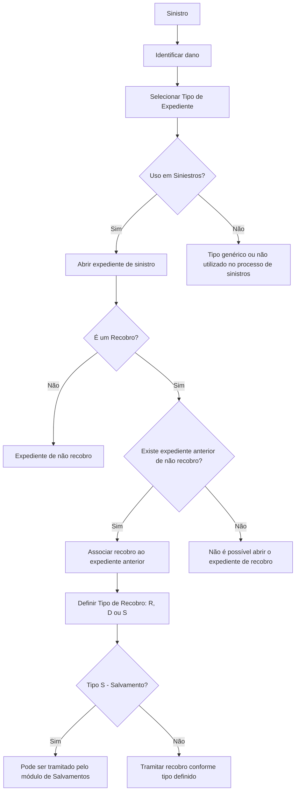

# Definição de Tipos de Expediente e Recobros no Processo de Sinistros

## 1. Metadados do Documento
- **Arquivo de Origem:** Não identificado — conteúdo bruto fornecido pelo usuário
- **Tipo de Documento:** Especificação Funcional
- **Domínio / Sistema:** Gestão de Sinistros — Tipos de Expediente e Recobros
- **Público-Alvo:** Analistas funcionais, desenvolvedores, arquitetos, operação e áreas de sinistros
- **Data/Versão Identificada:** Não identificada

---

## 2. Resumo Executivo & Contexto de Negócio

O documento define as propriedades funcionais utilizadas para cadastrar e administrar os **Tipos de Expediente** associados a sinistros. Um Tipo de Expediente representa uma tipologia de dano que pode resultar de um sinistro, abrangendo tanto danos sofridos pelo segurado quanto danos que o segurado tenha causado a terceiros.

A definição dos Tipos de Expediente estabelece como cada tipo de dano deve se comportar nos diferentes ramos em que pode ocorrer. O texto informa que esse comportamento pode envolver a informação solicitada para o expediente, a possibilidade de perícia, a associação a um processo judicial e a caracterização como recobro. Entretanto, o conteúdo fornecido não detalha os campos, contratos, telas ou regras específicas por ramo.

As propriedades gerais são comuns a todos os ramos, ou seja, são atributos que não variam conforme o ramo. Entre elas estão a chave e o nome do Tipo de Expediente, a indicação de uso na tramitação de sinistros, o sinal financeiro esperado do expediente, o agrupamento por natureza e o status de habilitação para abertura de novos expedientes.

O documento também define os **Recobros**, que são Tipos de Expediente usados para recuperar parte do valor de um sinistro. O recobro pode ocorrer contra uma companhia, um terceiro sem seguro ou um segurado com franquia contratada, quando a companhia antecipou um valor. A abertura de um expediente de recobro depende obrigatoriamente de um expediente anterior classificado como não recobro.

---

## 3. Arquitetura, Componentes & Tecnologias Envolvidas

O conteúdo não apresenta uma arquitetura técnica de software, integrações, microsserviços, tecnologias, APIs, URLs, ambientes ou contratos de dados. O texto menciona visualmente os termos “Home Solutions APIs Documentation Zeus”, mas não descreve a função, a arquitetura ou a relação desses elementos com a manutenção de Tipos de Expediente.

O fluxo funcional identificável relaciona o cadastro de Tipos de Expediente, a abertura de expedientes de sinistro e, quando aplicável, a abertura de expedientes de recobro vinculados a um expediente anterior de não recobro.



> **Nota de Análise:** O documento descreve o fluxo funcional de associação entre expediente de recobro e expediente de não recobro, mas não detalha interfaces, validações de sistema, serviços, métodos HTTP, contratos JSON ou persistência de dados.

---

## 4. Regras de Negócio, Especificações Funcionais & Processos

### 4.1 Finalidade do Tipo de Expediente

1. O Tipo de Expediente identifica as diferentes tipologias de danos provocados por um sinistro.
2. As tipologias podem abranger:
   - Danos ocasionados ao segurado.
   - Danos que o segurado possa ter causado a terceiros.
3. Uma mesma chave de Tipo de Expediente pode ser utilizada em um ou mais ramos.
4. Para cada Tipo de Expediente, o comportamento pode variar conforme o ramo, incluindo:
   - Informação solicitada para o tipo de expediente.
   - Possibilidade de perícia.
   - Possibilidade de associação a um processo judicial.
   - Identificação como recobro.
5. O documento fornecido não detalha os comportamentos específicos por ramo.

### 4.2 Propriedades Gerais dos Tipos de Expediente

#### Tipo de Expediente
- É a chave usada para identificar os diferentes danos provocados pelo sinistro.
- Uma única chave pode ser utilizada em um ou vários ramos.

#### Nome do Tipo de Expediente
- É a descrição da chave definida para o Tipo de Expediente.
- Pode conter números e/ou letras.

#### Uso em Siniestros
- Indica se o Tipo de Expediente, entendido como tipo de dano, será utilizado na tramitação de sinistros.
- Normalmente, o Tipo de Expediente definido será usado na tramitação.
- A propriedade existe para tratar casos extraordinários.
- Um Tipo de Expediente pode ser utilizado de forma genérica e não ser utilizado em nenhum processo de sinistros.

#### Es Positivo
- Indica se o Tipo de Expediente é positivo ou negativo.
- Define se o valor final do expediente deve ser positivo ou negativo.
- O sistema controla se o sinal do valor do expediente corresponde ao que foi definido para o Tipo de Expediente.

#### Agrupación Tipos de Expedientes
- Permite agrupar Tipos de Expediente conforme sua natureza.
- O agrupamento independe do nome utilizado para o tipo de dano.
- Exemplos de agrupamentos mencionados:
  - Danos materiais.
  - Danos pessoais.
  - Roubos.

#### Inhabilitado
- Indica se o Tipo de Expediente está habilitado para abertura de novos expedientes.
- Quando o Tipo de Expediente está inabilitado, não é possível abrir novos expedientes com aquele tipo de dano.

### 4.3 Regras de Negócio para Recobros

1. Um Recobro é um Tipo de Expediente utilizado para recuperar parte do valor de um sinistro.
2. A propriedade **Es un Recobro** indica se o Tipo de Expediente é ou não um recobro.
3. As propriedades dos Tipos de Expediente de Recobro por Companhia não variam por ramo.
4. Um recobro pode ser efetuado:
   - Contra uma companhia, quando o terceiro é culpado e possui seguro.
   - Contra um terceiro, quando o terceiro é culpado e não possui seguro.
   - Contra um segurado, quando existe franquia contratada e a companhia antecipou o valor.
5. A definição de Recobros é recomendada, pois pode existir a necessidade de:
   - Recobrar de um contrário.
   - Recobrar de uma companhia contrária.
   - Vender um salvamento, caracterizado como recobro material.
6. Todo expediente de recobro deve estar associado a um expediente de não recobro aberto anteriormente.
7. Na abertura de um expediente de recobro, o sistema pergunta a qual expediente anterior o recobro será associado.
8. Caso não exista um expediente de não recobro, não é permitido abrir o expediente de recobro.

### 4.4 Tipos de Recobro

A propriedade **Tipo de Recobro** somente deve ser informada quando o Tipo de Expediente estiver definido como recobro.

| Código | Tipo de Recobro | Definição |
| :--- | :--- | :--- |
| R | Recuperações Económicas | Recobro destinado à recuperação econômica. |
| D | Deducible (Franquicia) | Recobro destinado à recuperação da franquia de um segurado. |
| S | Salvamentos (Recuperaciones Materiales) | Recobro relacionado a salvamentos ou recuperações materiais. |

Regra adicional para salvamentos:

- Quando o recobro for do tipo **S — Salvamentos**, o expediente pode ser tramitado pelo módulo de Salvamentos.

---

## 5. Tabelas de Parâmetros, Ambientes e Estruturas de Dados

| Item / Parâmetro | Descrição / Função | Tipo / Valores / Formato | Ambiente / Observações |
| :--- | :--- | :--- | :--- |
| Tipo de Expediente | Chave de identificação dos diferentes danos provocados por um sinistro. | Chave; formato não detalhado. | Uma chave pode ser usada em um ou mais ramos. |
| Nome do Tipo de Expediente | Descrição da chave definida para o Tipo de Expediente. | Pode conter números e/ou letras. | Não há limite de tamanho ou padrão adicional informado. |
| Uso em Siniestros | Indica se o Tipo de Expediente será utilizado na tramitação de sinistros. | Sim/Não implícito; valores literais não detalhados. | Normalmente é utilizado; a propriedade atende casos extraordinários. |
| Es Positivo | Define se o valor final do expediente deve ser positivo ou negativo. | Positivo ou negativo. | O sistema controla a correspondência entre o sinal do valor e a definição cadastrada. |
| Agrupación Tipos de Expedientes | Agrupa Tipos de Expediente segundo sua natureza. | Exemplos: danos materiais, danos pessoais e roubos. | O agrupamento independe do nome atribuído ao tipo de dano. |
| Inhabilitado | Define se o Tipo de Expediente pode ser usado para abrir novos expedientes. | Habilitado ou inabilitado. | Quando inabilitado, não permite novas aberturas para o tipo de dano. |
| Es un Recobro | Identifica se o Tipo de Expediente corresponde a um recobro. | Sim/Não implícito; valores literais não detalhados. | Propriedade de Tipos de Expediente de Recobro por Companhia; não varia por ramo. |
| Tipo de Recobro | Classifica a natureza do recobro. | R, D ou S. | Só deve ser informado se o Tipo de Expediente for um recobro. |
| R | Recuperações Económicas. | Código de Tipo de Recobro. | Recuperação econômica. |
| D | Deducible (Franquicia). | Código de Tipo de Recobro. | Recuperação da franquia de um segurado. |
| S | Salvamentos (Recuperaciones Materiales). | Código de Tipo de Recobro. | Pode ser tramitado pelo módulo de Salvamentos. |
| Associação de Recobro | Vínculo de um expediente de recobro com expediente anterior. | Associação obrigatória a expediente de não recobro. | Sem expediente de não recobro anterior, a abertura de recobro não é permitida. |
| Ramos | Contexto de utilização de um Tipo de Expediente. | Um ou mais ramos. | As propriedades gerais não variam por ramo; o comportamento do expediente por ramo é mencionado, mas não detalhado. |
| Ambientes, URLs e servidores | Informações de infraestrutura. | Não identificado. | O documento não fornece ambientes, endereços, portas, servidores ou credenciais. |

---

## 6. Bateria de Perguntas & Respostas para RAG (FAQ Sintético)

### P1: Qual é a finalidade de um Tipo de Expediente no processo de sinistros?
**R:** Um Tipo de Expediente é a chave utilizada para identificar as diferentes tipologias de danos provocados por um sinistro. Essas tipologias abrangem danos sofridos pelo segurado e danos que o segurado possa ter causado a terceiros.

### P2: Uma mesma chave de Tipo de Expediente pode ser utilizada em vários ramos?
**R:** Sim. O documento estabelece que uma chave de Tipo de Expediente pode ser usada para um ou vários ramos.

### P3: O que representa o Nome do Tipo de Expediente?
**R:** O Nome do Tipo de Expediente é a descrição da chave definida para o Tipo de Expediente. Esse nome pode conter números e/ou letras.

### P4: Para que serve a propriedade Uso em Siniestros?
**R:** A propriedade Uso em Siniestros indica se o Tipo de Expediente será utilizado na tramitação de sinistros. Normalmente o tipo definido é utilizado na tramitação, mas a propriedade permite contemplar casos extraordinários, como tipos genéricos que não serão usados em nenhum processo de sinistros.

### P5: Como a propriedade Es Positivo influencia o valor de um expediente?
**R:** A propriedade Es Positivo define se o importe final do expediente deve ser positivo ou negativo. Com essa definição, o sistema controla se o sinal do valor informado para o expediente corresponde ao sinal estabelecido para o Tipo de Expediente.

### P6: Qual é o objetivo da Agrupación Tipos de Expedientes?
**R:** A Agrupación Tipos de Expedientes permite organizar Tipos de Expediente conforme sua natureza, independentemente do nome dado ao tipo de dano. O documento cita como exemplos os grupos de danos materiais, danos pessoais e roubos.

### P7: O que acontece quando um Tipo de Expediente está Inhabilitado?
**R:** Quando um Tipo de Expediente está Inhabilitado, ele deixa de estar disponível para a abertura de novos expedientes com aquele tipo de dano.

### P8: O que é um Recobro no contexto de sinistros?
**R:** Um Recobro é um Tipo de Expediente usado para recuperar parte do importe de um sinistro. O recobro pode ser direcionado a uma companhia quando o terceiro culpado possui seguro, a um terceiro culpado sem seguro ou a um segurado com franquia contratada quando a companhia adiantou o dinheiro.

### P9: A definição de Tipos de Expediente de Recobro varia de acordo com o ramo?
**R:** Não. O documento informa que as propriedades dos Tipos de Expediente de Recobro por Companhia não variam por ramo.

### P10: Quando a propriedade Tipo de Recobro deve ser preenchida?
**R:** A propriedade Tipo de Recobro só deve ser preenchida quando o Tipo de Expediente estiver definido como um recobro.

### P11: Quais são os códigos possíveis para Tipo de Recobro?
**R:** Existem três códigos: **R**, para Recuperações Económicas; **D**, para recuperação do Deducible ou Franquicia do segurado; e **S**, para Salvamentos ou Recuperaciones Materiales.

### P12: Como é tratado um recobro do tipo S?
**R:** Um recobro do tipo S corresponde a Salvamentos, ou Recuperaciones Materiales. O documento determina que esse tipo de recobro pode ser tramitado pelo módulo de Salvamentos.

### P13: É obrigatório associar um expediente de recobro a outro expediente?
**R:** Sim. Sempre que um expediente de recobro for aberto, o sistema solicitará a associação com um expediente de não recobro aberto anteriormente.

### P14: É possível abrir um expediente de recobro sem existir um expediente de não recobro?
**R:** Não. Se não houver um expediente de não recobro, não será possível abrir o expediente de recobro.

### P15: O documento detalha quais informações são solicitadas por Tipo de Expediente em cada ramo?
**R:** Não. O documento afirma que o comportamento do Tipo de Expediente por ramo pode incluir informações solicitadas, possibilidade de perícia, associação a julgamento e recobro, mas não especifica os dados, regras ou configurações de cada ramo.

---

## 7. Glossário de Termos, Siglas & Conceitos-Chave

- **Agrupación Tipos de Expedientes:** Propriedade que agrupa Tipos de Expediente por natureza, como danos materiais, danos pessoais ou roubos.
- **D — Deducible / Franquicia:** Código de Tipo de Recobro utilizado para recuperar a franquia de um segurado.
- **Es Positivo:** Propriedade que determina se o valor final do expediente deve ter sinal positivo ou negativo.
- **Es un Recobro:** Propriedade que identifica se um Tipo de Expediente é utilizado para recobro.
- **Expediente:** Registro ou caso associado a um tipo de dano decorrente de um sinistro.
- **Expediente de não recobro:** Expediente aberto anteriormente que deve servir de referência para a associação de um expediente de recobro.
- **Inhabilitado:** Estado de um Tipo de Expediente que impede a abertura de novos expedientes com aquele tipo de dano.
- **R — Recuperaciones Económicas:** Código de Tipo de Recobro para recuperação econômica.
- **Recobro:** Tipo de Expediente usado para recuperar parte do valor de um sinistro.
- **S — Salvamentos / Recuperaciones Materiales:** Código de Tipo de Recobro relacionado a recuperações materiais; pode ser processado pelo módulo de Salvamentos.
- **Siniestro:** Evento de sinistro que pode gerar danos ao segurado ou a terceiros.
- **Tipo de Expediente:** Chave que identifica uma tipologia de dano provocada por um sinistro.
- **Tipo de Recobro:** Classificação do recobro como R, D ou S.
- **Uso en Siniestros:** Propriedade que informa se um Tipo de Expediente será utilizado na tramitação de sinistros.

---

## 8. Notas Críticas, Riscos & Limitações

- O documento não identifica o arquivo de origem, autor, data, versão ou sistema corporativo responsável pela funcionalidade.
- Não há detalhamento de telas, APIs, microsserviços, modelos de dados, tabelas de banco, eventos, integrações ou mecanismos de persistência.
- Não foram fornecidos valores técnicos para os campos, tais como tipo de dado, obrigatoriedade, tamanho, domínio de valores, mensagens de erro ou comportamento de interface.
- O documento declara que o comportamento do Tipo de Expediente pode variar por ramo, mas não detalha essas variações.
- A regra de associação obrigatória entre recobro e expediente de não recobro é uma dependência funcional crítica: sem expediente anterior de não recobro, o recobro não pode ser aberto.
- O documento informa que recobros do tipo Salvamento podem ser tramitados no módulo de Salvamentos, mas não especifica se essa tramitação é obrigatória, opcional, automática ou manual.
- Os exemplos mencionados no conteúdo original não possuem dados legíveis ou detalhados na extração fornecida.
- **Nota de Análise:** O texto menciona “Home Solutions APIs Documentation Zeus”, mas não sustenta conclusões sobre produtos, sistemas, APIs ou responsabilidades técnicas associadas a esses termos.

---

## 9. Conteúdo Bruto Estruturado (Referência Fiel)

```text
--- [PÁGINA 1 DE 4] ---

DEFINICIÓN Tipo de Expediente
Objetivo
La finalidad es definir todas las tipologías de daños posibles, que se pueden producir a raíz de un
siniestro. Se definirán los posibles daños ocasionados a nuestro asegurado, así como los daños que
él haya podido causar a terceros.
También se va a definir el comportamiento de cada tipo de expedientes en los diferentes ramos
donde se pueda dar este tipo de daño, es decir, la información que se va a solicitar para ese tipo de
expediente, si se puede peritar, si se puede asociar a un juicio, si es un recobro, etc.
Propiedades Generales
Propiedades Generales Tipos de Expedientes Recobros
Propiedades Generales
En este apartado se detallarán todos los atributos, propiedades comunes a todos los ramos, es decir
los que no cambian por ramo.
Imagen del Mantenimiento Tipos de Expedientes:
 / 
 CF
Home Solutions APIs Documentation Zeus
EN


--- [PÁGINA 2 DE 4] ---

Tipo de Expediente
Esta propiedad será la clave por la que se va a identificar los distintos daños provocados por el
siniestro. Una clave podrá ser utilizada para uno o varios ramos.
Nombre del Tipo de Expediente
Esta propiedad será la descripción de la clave definida para el tipo de expediente. Puede contener
números y/o letras.
Uso en Siniestros
Esta propiedad indicará si el tipo de expediente (tipo de daño) que se está definiendo, se va a utilizar
en la tramitación de siniestros.
Normalmente el tipo de expediente que se está definiendo será usado en la tramitación, esto se
utiliza para casos extraordinarios.
Ejemplo:
Ejemplo:


--- [PÁGINA 3 DE 4] ---

Este tipo de expediente se utiliza como genérico, no se va a utilizar en ningún proceso de
siniestros.
Es Positivo
Esta propiedad indica si el tipo de expediente es positivo o es negativo, es decir si el importe final
del expediente va a ser positivo o negativo. Con esta definición el sistema controlará que el signo del
importe del expediente se corresponda con lo definido.
Agrupación Tipos de Expedientes
Esta propiedad permite agrupar a los tipos de expediente por su naturaleza. Es decir, se pueden
agrupar todos los tipos de expedientes que tramiten daños materiales, o todos los tipos de
expedientes que tramiten daños personales, o todos los tipos de expedientes que tramiten Robos,
etc, independientemente de como se haya nombrado al tipo de daño.
Inhabilitado
Esta propiedad indica si el Tipo de Expediente que está definido, está habilitado para poder abrir
nuevos expedientes o si, por el contrario, ya no está habilitado para poder abrir nuevos expedientes
con ese tipo de daño.
Propiedades Generales Tipos de Expedientes Recobros
Son propiedades de los Tipos de Expedientes de Recobro por Compañía, que no varían por Ramo.
Es un Recobro
Esta propiedad indica si el tipo de expediente es o no un recobro.
Los Recobros son tipos de expediente que se utilizan para recuperar parte del importe de un
siniestro. Se puede recobrar a una compañía (cuando el tercero es culpable y tiene un seguro), se
puede recobrar a un tercero (cuando este es culpable y no tiene seguro), se puede recobrar a un
asegurado (cuando este tiene una franquicia contratada y la compañía ha adelantado el dinero) etc.
Ejemplo:
Info
Ejemplo:
Ejemplo:


--- [PÁGINA 4 DE 4] ---

Tipo de Recobro
Esta propiedad sólo se informará en el caso de que el tipo de expediente sea un recobro. Lo que se
va a definir es qué tipo de recobro es.
Los Recobros pueden ser de tres tipos:
R- Cuando son Recuperaciones Económicas
D- Cuando se va a recuperar el Deducible (Franquicia) de un asegurado
S- Cuando son Salvamentos (Recuperaciones Materiales)
Si el recobro es de tipo Salvamento, este podrá tramitarse por el módulo de Salvamentos.
Preguntas frecuentes
1. ¿Es obligatorio definir Recobros? Es recomendable, ya que siempre puede existir la posibilidad
de recobrar de un contrario, de una compañía contraria, de vender un salvamento (Recobro
material), etc.
2. ¿ El Recobro siempre va asociado a un expediente de NO Recobro? Si, siempre que se apertura
un expediente de Recobro el sistema va a preguntar a que expediente de los que se ha apertura
anteriormente, se le va a asociar el recobro. Si no hay un expediente de NO Recobro, no se
podrá abrir.
```
