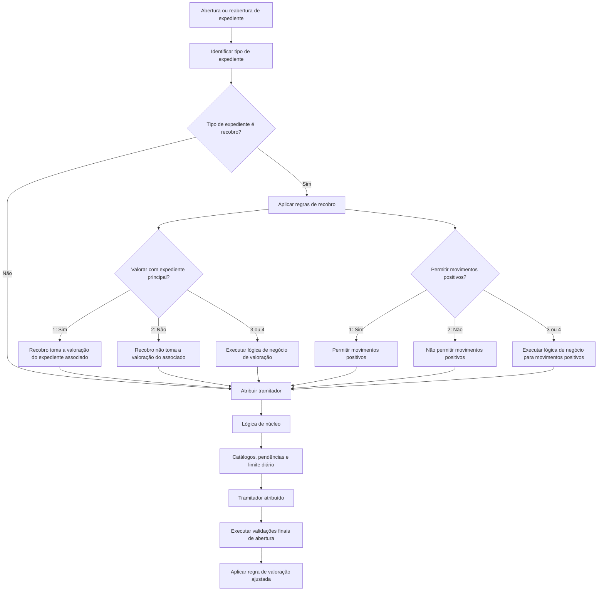

# Validações de Tipos de Expediente, Recobros e Atribuição de Tramitadores

## 1. Metadados do Documento
- **Arquivo de Origem:** `Não identificado no conteúdo fornecido`
- **Tipo de Documento:** `Especificação Técnica`
- **Domínio / Sistema:** `Gestão de Expedientes, Recobros e Tramitadores`
- **Público-Alvo:** `Desenvolvedores, Arquitetos, Operação e Negócio`
- **Data/Versão Identificada:** `Não identificada`

---

## 2. Resumo Executivo & Contexto de Negócio

O documento descreve validações extras e propriedades configuráveis associadas aos tipos de expediente. O objetivo declarado é explicar o comportamento de cada tipo de expediente em diferentes operações, incluindo recobros, atribuição de tramitadores e validações executadas ao final da abertura de expedientes.

No contexto de recobros, a especificação define propriedades para determinar se a valoração de um recobro deve assumir a valoração do expediente principal associado. A configuração pode produzir uma decisão direta — “Sim” ou “Não” — ou depender de uma lógica de negócio configurada quando os valores permitidos são `3` ou `4`.

A especificação também estabelece regras sobre movimentos positivos em recobros. A permissão é aplicável exclusivamente a tipos de expediente classificados como recobro e pode depender de lógica de negócio para decidir se conceitos de reserva que não são indenização podem receber valoração e pagamento com valores positivos.

Para atribuição de tramitadores, o documento descreve uma lógica de núcleo apoiada em catálogos de definição, relação entre escritórios comerciais e tramitadores, especialização de tramitadores, volume pendente de casos e limite diário de expedientes. A reabertura, por padrão, atribui o expediente ao tramitador original, embora essa lógica possa ser alterada.

Por fim, o documento prevê validações extras no encerramento da abertura e uma propriedade de “Valoração Ajustada”, que controla se o tramitador pode informar manualmente uma reserva inicial ou se o expediente deve utilizar obrigatoriamente uma reserva média previamente definida.

---

## 3. Arquitetura, Componentes & Tecnologias Envolvidas

Os componentes e conceitos identificados no conteúdo são:

- **Tipo de Expediente:** propriedade que identifica os diferentes danos provocados pelo sinistro.
- **Tabela de Tipos de Expediente:** tabela na qual a chave do tipo de expediente deve estar definida.
- **Expediente Genérico:** tipo que pode indicar aplicabilidade a todos os tipos de expediente.
- **Recobro:** tipo de expediente com propriedades específicas para valoração e movimentos positivos.
- **Expediente Principal / Associado:** expediente associado ao recobro, cuja valoração pode ou não ser utilizada pelo recobro.
- **Lógica de Negócio:** mecanismo configurável para decisões condicionais identificadas pelos valores `3` ou `4`.
- **Lógica de Núcleo:** lógica padrão para atribuição de tramitadores.
- **Tramitador:** responsável atribuído a expedientes na abertura ou reabertura.
- **Catálogo de Definição do Tramitador:** catálogo usado pela lógica de núcleo.
- **Catálogo de Relação entre Escritórios Comerciais e Tramitadores:** catálogo usado pela lógica de núcleo.
- **Catálogo de Especialização dos Tramitadores:** catálogo que define os tipos de sinistros com os quais cada tramitador trabalha.
- **Validações Finais de Abertura:** validações extras configuráveis ao abrir um expediente.
- **Valoração Ajustada:** propriedade que define a possibilidade de reserva inicial manual.



> **Nota de Análise:** O documento menciona “Home Solutions APIs Documentation Zeus” no conteúdo bruto, mas não explica a função, arquitetura, integrações ou relação desses termos com as regras de expediente.

---

## 4. Regras de Negócio, Especificações Funcionais & Processos

### 4.1 Propriedade de Tipo de Expediente

A propriedade **Tipo de Expediente** contém a chave utilizada para identificar os diferentes danos provocados pelo sinistro.

- A chave deve estar definida na tabela de tipos de expediente.
- Pode ser configurado um tipo de expediente genérico.
- O tipo de expediente genérico indica que a regra ou propriedade é aplicável a todos os tipos de expediente.

### 4.2 Valoração de Recobro com Base no Expediente Principal

A propriedade **Valorar Recobro con Valoración del Expediente principal** aplica-se exclusivamente quando o expediente é um recobro.

A propriedade determina se, ao abrir um recobro e associá-lo a um expediente, o recobro utiliza a valoração do expediente associado.

Regras possíveis:

1. Valor `1`: o recobro toma a valoração do expediente associado.
2. Valor `2`: o recobro não toma a valoração do expediente associado.
3. Valores `3` ou `4`: a decisão deve ser determinada por uma lógica de negócio.

Quando a propriedade possui valor `3` ou `4`, deve existir uma lógica de negócio que determine se o recobro toma ou não a valoração do expediente associado. Essa lógica é necessária quando a decisão não é invariável e depende de outros fatores.

### 4.3 Movimentos Positivos em Recobros

A propriedade **Se permiten movimientos Positivos en Recobros** aplica-se apenas quando o tipo de expediente definido é um recobro.

Valores permitidos:

1. Valor `1`: movimentos positivos são permitidos.
2. Valor `2`: movimentos positivos não são permitidos.
3. Valores `3` ou `4`: a decisão depende de lógica de negócio.

Quando a propriedade possui valor `3` ou `4`, deve ser definida uma lógica de negócio para decidir se o tipo de expediente permite, em conceitos de reserva que não sejam indenização, valorar e pagar valores positivos.

A lógica de negócio pode resultar em “Sim” ou “Não”, de acordo com a configuração definida.

### 4.4 Atribuição de Tramitador na Abertura

A propriedade **Asignar Tramitador en la Apertura de Expedientes** contém a lógica de negócio que define qual tramitador deve receber um expediente no momento de sua abertura.

Existe uma lógica de núcleo para essa atribuição. A lógica de núcleo utiliza os seguintes elementos:

1. Catálogo de definição do tramitador.
2. Catálogo de relação entre escritórios comerciais e tramitadores.
3. Catálogo de especialização dos tramitadores.
4. Número de casos pendentes atribuídos ao tramitador.
5. Número máximo de expedientes que podem ser atribuídos ao tramitador por dia.

No catálogo de especialização, deve ser indicado se o tramitador trabalha com sinistros vinculados a:

- Uma ou mais estruturas comerciais específicas.
- Uma ou mais apólices de grupo, contrato ou subcontrato.
- Um ou mais setores, ramos, agentes ou apólices.
- Um ou mais tipos de expediente.
- Expedientes em juízo.
- Expedientes de perda total.
- Expedientes ocorridos no exterior.
- Expedientes de clientes VIP.
- Expedientes Mapfre-Mapfre.

No início, a atribuição utiliza sempre a lógica de núcleo.

### 4.5 Atribuição de Tramitador na Reabertura

A propriedade **Lógica de Negócio para Asignar Tramitador en Reapertura de Expedientes** determina qual tramitador deve receber um expediente no momento de sua reabertura.

A lógica de núcleo atribui o expediente ao tramitador original. Essa lógica pode ser alterada.

### 4.6 Validações Finais de Abertura

A propriedade **Validaciones Final Apertura de Expedientes** contém uma lógica de negócio destinada à execução de validações extras.

> **Nota de Análise:** O documento não detalha quais são as validações extras, seus critérios, mensagens de erro ou condições de bloqueio.

### 4.7 Valoração Ajustada

A propriedade **Valoración Ajustada** define o comportamento da reserva inicial quando um expediente desse tipo é aberto manualmente.

- Quando permitida, o tramitador pode informar uma reserva inicial manualmente.
- Caso contrário, o expediente deve ser aberto com a reserva média previamente definida.
- Nesse último caso, o tramitador não pode modificar a reserva inicial.

---

## 5. Tabelas de Parâmetros, Ambientes e Estruturas de Dados

| Item / Parâmetro | Descrição / Função | Tipo / Valores / Formato | Ambiente / Observações |
| :--- | :--- | :--- | :--- |
| Tipo de Expediente | Identifica os diferentes danos provocados pelo sinistro. | Chave definida na tabela de tipos de expediente. | Pode ser utilizado um tipo genérico aplicável a todos os tipos de expediente. |
| Tabela de Tipos de Expediente | Repositório no qual a chave do tipo de expediente deve estar definida. | Não detalhado. | O documento não informa estrutura, campos ou tecnologia da tabela. |
| Valorar Recobro con Valoración del Expediente principal | Define se o recobro utiliza a valoração do expediente associado. | `1`: Sim; `2`: Não; `3,4`: Lógica de Negócio. | Aplicável somente a recobros. |
| Lógica de Negócio para valoração de recobro | Determina se o recobro toma a valoração do expediente associado quando a regra não é fixa. | Aplicada quando o parâmetro anterior possui valor `3` ou `4`. | O documento não detalha os fatores de decisão. |
| Se permiten movimientos Positivos en Recobros | Define se são permitidos movimentos positivos em recobros. | `1`: Sim; `2`: Não; `3,4`: Lógica de Negócio. | Aplicável somente a tipos de expediente de recobro. |
| Lógica de Negócio para movimentos positivos | Define se conceitos de reserva que não são indenização podem ser valorados e pagos positivamente. | Aplicada quando o parâmetro anterior possui valor `3` ou `4`. | Pode resultar em Sim ou Não. |
| Asignar Tramitador en la Apertura de Expedientes | Define o tramitador atribuído na abertura de um expediente. | Lógica de negócio; lógica de núcleo inicial. | Apoia-se em catálogos, volume pendente e limite diário. |
| Catálogo de Definição do Tramitador | Catálogo usado pela lógica de núcleo para atribuição. | Não detalhado. | Sem estrutura ou campos especificados. |
| Catálogo de Relação entre Escritórios Comerciais e Tramitadores | Catálogo usado pela lógica de núcleo para relacionar escritórios e tramitadores. | Não detalhado. | Sem estrutura ou critérios especificados. |
| Catálogo de Especialização dos Tramitadores | Define os contextos de sinistro tratados por cada tramitador. | Estruturas comerciais, apólices, setores, ramos, agentes, tipos de expediente e condições especiais. | Inclui juízo, perda total, exterior, clientes VIP e Mapfre-Mapfre. |
| Casos pendentes do tramitador | Quantidade de casos já atribuídos ao tramitador. | Número não especificado. | Considerado pela lógica de núcleo. |
| Máximo diário de expedientes | Número máximo de expedientes que podem ser atribuídos a um tramitador por dia. | Número não especificado. | Considerado pela lógica de núcleo. |
| Lógica de Negócio para Asignar Tramitador en Reapertura de Expedientes | Define o tramitador responsável quando um expediente é reaberto. | Lógica de negócio. | A lógica de núcleo utiliza o tramitador original; pode ser modificada. |
| Validaciones Final Apertura de Expedientes | Permite a execução de validações extras na abertura de expediente. | Lógica de negócio. | Critérios de validação não detalhados. |
| Valoración Ajustada | Controla se a reserva inicial pode ser informada manualmente. | Permitida ou não permitida; valores não especificados. | Se não permitida, utiliza reserva média prévia sem alteração pelo tramitador. |
| Home Solutions APIs Documentation Zeus | Termos apresentados no conteúdo bruto. | Não detalhado. | Não há explicação de função, integração ou relação com as regras apresentadas. |

---

## 6. Bateria de Perguntas & Respostas para RAG (FAQ Sintético)

### P1: Qual é a finalidade da propriedade Tipo de Expediente?
**R:** A propriedade Tipo de Expediente contém a chave que identifica os diferentes danos causados pelo sinistro. Essa chave deve estar definida na tabela de tipos de expediente. O documento também permite utilizar um tipo de expediente genérico para indicar que uma regra se aplica a todos os tipos de expediente.

### P2: Quando um recobro utiliza a valoração do expediente principal associado?
**R:** Um recobro utiliza a valoração do expediente associado quando a propriedade “Valorar Recobro con Valoración del Expediente principal” possui o valor `1`, correspondente a “Sim”. Se o valor for `2`, o recobro não utiliza a valoração do expediente associado. Para valores `3` ou `4`, a decisão depende de uma lógica de negócio.

### P3: O que deve ocorrer quando a regra de valoração do recobro possui valor 3 ou 4?
**R:** Quando a propriedade de valoração do recobro possui valor `3` ou `4`, deve ser definida uma lógica de negócio. Essa lógica determina se o recobro toma ou não a valoração do expediente associado, considerando fatores que não foram detalhados no documento.

### P4: Em quais condições são permitidos movimentos positivos em recobros?
**R:** Movimentos positivos em recobros são permitidos quando a propriedade “Se permiten movimientos Positivos en Recobros” possui valor `1`. O valor `2` não permite os movimentos positivos. Os valores `3` e `4` exigem uma lógica de negócio para decidir se conceitos de reserva que não são indenização podem receber valoração e pagamento com valores positivos.

### P5: A regra de movimentos positivos pode ser usada para qualquer tipo de expediente?
**R:** Não. A propriedade “Se permiten movimientos Positivos en Recobros” aplica-se exclusivamente quando o tipo de expediente configurado é um recobro.

### P6: Quais informações a lógica de núcleo utiliza para atribuir um tramitador na abertura de um expediente?
**R:** A lógica de núcleo utiliza o catálogo de definição do tramitador, o catálogo de relação entre escritórios comerciais e tramitadores, o catálogo de especialização dos tramitadores, o número de casos pendentes atribuídos ao tramitador e o número máximo de expedientes que podem ser atribuídos por dia.

### P7: Quais especializações podem ser configuradas para um tramitador?
**R:** O catálogo de especialização pode indicar se o tramitador trabalha com uma ou mais estruturas comerciais específicas; apólices de grupo, contrato ou subcontrato; setores, ramos, agentes ou apólices; tipos de expediente; expedientes em juízo; expedientes de perda total; expedientes ocorridos no exterior; expedientes de clientes VIP; e expedientes Mapfre-Mapfre.

### P8: Qual tramitador é atribuído por padrão na reabertura de um expediente?
**R:** Na reabertura de um expediente, a lógica de núcleo atribui o expediente ao tramitador original. O documento indica que essa lógica pode ser alterada por uma lógica de negócio específica para reabertura.

### P9: O que são as validações finais de abertura de expediente?
**R:** As validações finais de abertura são validações extras executadas por meio de uma lógica de negócio associada à propriedade “Validaciones Final Apertura de Expedientes”. O documento não informa os critérios, condições ou resultados dessas validações.

### P10: Quando o tramitador pode informar uma reserva inicial manualmente?
**R:** O tramitador pode informar uma reserva inicial manualmente quando a propriedade “Valoración Ajustada” permitir esse comportamento para o tipo de expediente aberto manualmente. Quando a propriedade não permitir alteração manual, o expediente deve ser aberto com a reserva média previamente definida, sem possibilidade de modificação pelo tramitador.

---

## 7. Glossário de Termos, Siglas & Conceitos-Chave

- **Expediente:** entidade tratada pelo documento em operações de abertura e reabertura, associada a sinistros, tipos de expediente, reservas e tramitadores.
- **Tipo de Expediente:** chave usada para identificar tipos de danos provocados pelo sinistro.
- **Recobro:** tipo de expediente que possui regras específicas sobre valoração baseada em expediente associado e movimentos positivos.
- **Expediente Principal / Associado:** expediente relacionado a um recobro, cuja valoração pode ser utilizada pelo recobro conforme configuração.
- **Valoração:** avaliação de valor utilizada nas regras de recobro e reserva inicial.
- **Movimentos Positivos:** valorações e pagamentos positivos permitidos ou não para conceitos de reserva que não são indenização, conforme regras de recobro.
- **Reserva:** valor inicial ou valor relacionado ao expediente; o documento menciona reserva inicial manual e reserva média previamente definida.
- **Indenização:** conceito de reserva explicitamente diferenciado de outros conceitos de reserva na regra de movimentos positivos.
- **Tramitador:** responsável ao qual um expediente é atribuído na abertura ou reabertura.
- **Lógica de Núcleo:** lógica padrão de atribuição de tramitadores.
- **Lógica de Negócio:** lógica configurável usada quando uma decisão depende de condições adicionais.
- **Escritório Comercial:** entidade relacionada a tramitadores por meio de catálogo específico.
- **Estrutura Comercial:** critério de especialização de tramitadores.
- **Póliza Grupo, Contrato, Subcontrato:** critérios de especialização de tramitadores citados no documento.
- **Expediente em Juízo:** critério de especialização para tramitadores.
- **Perda Total:** critério de especialização para tramitadores.
- **Cliente VIP:** critério de especialização para tramitadores.
- **Mapfre-Mapfre:** categoria de expediente ou sinistro mencionada como critério de especialização, sem detalhamento adicional.

---

## 8. Notas Críticas, Riscos & Limitações

- O documento não define a estrutura da tabela de tipos de expediente, os campos de catálogo, os identificadores de tramitadores ou os formatos de dados utilizados.
- Os valores `3` e `4` são associados a lógica de negócio, mas o documento não explica a diferença semântica entre esses dois valores.
- As lógicas de negócio para valoração de recobros e movimentos positivos não possuem critérios, condições, expressões, regras de prioridade ou exemplos funcionais detalhados.
- As validações extras no final da abertura são mencionadas, porém não são descritas.
- O documento não detalha como a lógica de núcleo pondera catálogo de especialização, quantidade de casos pendentes e limite diário de expedientes.
- Não foram identificados ambientes, URLs, servidores, portas, APIs, métodos HTTP, contratos JSON, versões ou mecanismos de integração.
- Os termos “Home Solutions APIs Documentation Zeus” aparecem no conteúdo bruto sem contexto suficiente para estabelecer uma relação técnica comprovada com as regras descritas.

---

## 9. Conteúdo Bruto Estruturado (Referência Fiel)

```text
--- [PÁGINA 1 DE 3] ---

DEFINICIÓN Validaciones Tipo de Expediente
Objetivo
Explicar las diferentes validaciones extras y el comportamiento de cada tipo de expediente en
diferentes operaciones, la lógica para asignar tramitadores, etc.
Propiedades Generales Tipos de Expedientes Recobros
Propiedades Generales Asignación Tramitador
Propiedades Generales Validaciones Final Apertura
Propiedades
Tipo de Expediente
Esta propiedad contendrá la clave por la que se va a identificar los distintos daños provocados por el
siniestro. Esta clave tiene que estar definida en la tabla de tipos de expediente. Se podría poner el
tipo de expediente genérico para indicar que aplica a todos los tipos de expediente.
Valorar Recobro con Valoración del Expediente principal
Esta propiedad sólo aplica cuando el expediente es un Recobro. Indica si cuando se abra un recobro
y se asocie a un expediente, el recobro toma la valoración del expediente asociado, o no.
Los valores permitidos serán:
1: Si
 /
 CF
Home Solutions APIs Documentation Zeus
EN


--- [PÁGINA 2 DE 3] ---

2: No
3,4: Lógica de Negocio
Lógica que determina si el Recobro se valora con Valoración del Expediente
principal
Si la propiedad anterior tiene un 3. ´0 4, esta propiedad contendrá una lógica de Negocio, cuando la
valoración del recobro no es siempre la valoración del expediente al que está asociado, si no que
depende de otros factores. Se tendrá que definir la lógica de Negocio que determine si toma la
valoración del asociado o no.
Se permiten movimientos Positivos en Recobros
Esta propiedad sólo aplica cuando el tipo de expediente que se está definiendo es un recobro.
Los valores permitidos serán:
1: Si
2: No
3,4: Lógica de Negocio
Lógica de Negocio que determina si se permiten movimientos Positivos en
Recobros
Si la propiedad anterior tiene un 3. ´0 4, esta propiedad contendrá una lógica de Negocio. Se tendrá
que definir una lógica de Negocio, si el tipo de expediente permite en conceptos de reserva que no
son Indemnización, valorar y pagar valores positivos. Puede ser Si o No, dependiendo de lo que se
defina.
Propiedades Generales Para Asignar Tramitador
Asignar Tramitador en la Apertura de Expedientes
Esta propiedad contendrá la lógica de Negocio que determinará cuando se abra un expediente, a que
tramitador se le debe asignar. Existe una lógica de núcleo
La lógica de núcleo se apoya en varios catálogos:
1. Catálogo de Definición del tramitador.
2. Catálogo de Relación entre las oficinas comerciales y tramitadoras.
Ejemplo:
Ejemplo:


--- [PÁGINA 3 DE 3] ---

3. Catálogo de Especialización de los tramitadores.
4. Número de casos pendientes que tiene asignado el tramitador.
5. Número máximo de expedientes que se le puede asignar por día.
En el catálogo de especialización de los tramitadores se le tiene que indicar si trabaja con los
siniestros de:
Una o varias Estructuras Comerciales específicas
Una o varias Pólizas Grupo, Contrato, Subcontrato.
Uno o varios Sectores, Ramos, Agentes, Pólizas
Uno o varios Tipos de Expediente
Expedientes en Juicio
Expedientes de Pérdida Total
Expedientes ocurridos en el Extranjero
Expedientes de Clientes VIP
Expedientes Mapfre-Mapfre
Esta propiedad contendrá la lógica de Negocio que determinará cuando se abra un expediente, a que
tramitador se le debe asignar.
Al iniciar siempre estará asignado la lógica de núcleo.
Tramitador
Lógica de Negocio para Asignar Tramitador en Reapertura de Expedientes
Esta propiedad contendrá la lógica de Negocio que determinará cuando se reapertura un expediente,
a que tramitador se le debe asignar.
La lógica de núcleo se le asigna al tramitador original, que podrá ser cambiada.
Propiedades Generales Validaciones Final Apertura
Validaciones Final Apertura de Expedientes
Esta propiedad contendrá una lógica de Negocio, para poder realizar validaciones Extras.
Valoración Ajustada
Esta propiedad indicará si al abrir un expediente de este tipo manualmente, se le va a permitir al
tramitador indicar una reserva inicial manualmente, o si por el contrario siempre se va a abrir por la
reserva promedio definida previamente, sin poder modificarla el tramitador.
```
