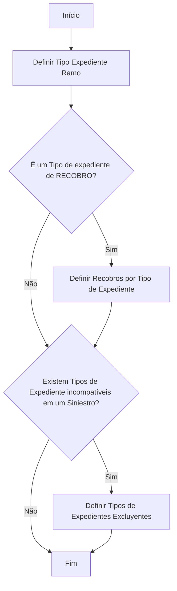

# Definição de Tipo de Expediente por Ramo

## 1. Metadados do Documento
- **Arquivo de Origem:** Não identificado no conteúdo fornecido
- **Tipo de Documento:** Procedimento
- **Domínio / Sistema:** Definição de tipo de expediente para um Ramo
- **Público-Alvo:** Negócio, analistas funcionais e operação
- **Data/Versão Identificada:** Não identificada

---

## 2. Resumo Executivo & Contexto de Negócio

O documento apresenta um processo para definir as características de um tipo de dano dentro de um **Ramo**. O fluxo é intitulado “Proceso para la definición de un Tipo de Expediente para un Ramo”.

A primeira atividade identificada é a definição do **Tipo Expediente Ramo**. Em seguida, o processo avalia se o tipo de expediente é de **RECOBRO** e, quando aplicável, prevê a definição de **Recobros por Tipo de Expediente**.

O processo também avalia a existência de tipos de expediente incompatíveis em um sinistro. Quando existem incompatibilidades, o procedimento prevê a definição de **Tipos de Expedientes Excluyentes**.

O documento não apresenta detalhamento sobre critérios funcionais, dados de entrada, responsáveis, telas, regras de cálculo, sistemas envolvidos ou contratos de integração. A informação disponível é predominantemente um fluxograma de decisão.

---

## 3. Arquitetura, Componentes & Tecnologias Envolvidas

O conteúdo fornecido não descreve uma arquitetura técnica, microsserviços, integrações, tecnologias, ambientes ou ferramentas de execução. Os elementos identificados são conceitos funcionais do processo:

- **Ramo**
- **Tipo de Expediente**
- **RECOBRO**
- **Recobros por Tipo de Expediente**
- **Siniestro**
- **Tipos de Expedientes Excluyentes**

O rodapé contém os termos `CF`, `Home Solutions`, `APIs Documentation`, `Zeus` e `EN`, mas o documento não explica seus significados, relações ou funções no processo.



> **Nota de Análise:** O diagrama reconstrói as atividades e decisões explicitamente visíveis no conteúdo. O documento não detalha o significado operacional dos ramos “Sim” e “Não” além das ações apresentadas no fluxograma.

---

## 4. Regras de Negócio, Especificações Funcionais & Processos

### Processo identificado

1. Definir o **Tipo Expediente Ramo**.
2. Verificar se o tipo de expediente é um tipo de expediente de **RECOBRO**.
3. Quando o fluxo indicar a condição de RECOBRO, definir os **Recobros por Tipo de Expediente**.
4. Verificar se existem tipos de expediente incompatíveis em um **Siniestro**.
5. Quando houver tipos de expediente incompatíveis em um sinistro, definir os **Tipos de Expedientes Excluyentes**.
6. Encerrar o processo após as definições aplicáveis.

### Regras e condições explícitas

| Regra / Condição | Ação associada | Detalhamento disponível |
| :--- | :--- | :--- |
| Definição de tipo de expediente para um Ramo | Definir Tipo Expediente Ramo | O documento não informa atributos, campos ou critérios de definição. |
| Tipo de expediente é de RECOBRO | Definir Recobros por Tipo de Expediente | O documento não define o conceito de RECOBRO, condições de elegibilidade ou dados necessários. |
| Existem tipos de expediente incompatíveis em um Siniestro | Definir Tipos de Expedientes Excluyentes | O documento não lista tipos incompatíveis, regras de exclusão ou comportamento do sistema. |

> **Nota de Análise:** O documento lista as decisões “¿Es un Tipo expediente de RECOBRO?” e “¿Existen Tipos Exp. Incompatibles en un Siniestro?”, porém não apresenta os critérios usados para respondê-las.

---

## 5. Tabelas de Parâmetros, Ambientes e Estruturas de Dados

| Item / Parâmetro | Descrição / Função | Tipo / Valores / Formato | Ambiente / Observações |
| :--- | :--- | :--- | :--- |
| Tipo Expediente Ramo | Elemento definido no início do processo para um Ramo. | Não especificado. | O documento não informa campos, identificadores ou valores permitidos. |
| RECOBRO | Condição avaliada para um Tipo de Expediente. | Pergunta de decisão: sim ou não. | Não há definição adicional do termo. |
| Recobros por Tipo de Expediente | Definição realizada quando aplicável à condição de RECOBRO. | Não especificado. | Não há regras, estrutura de dados ou parâmetros associados. |
| Tipos de Expedientes Incompatíveis | Condição avaliada no contexto de um Siniestro. | Pergunta de decisão: sim ou não. | O documento não identifica os tipos incompatíveis. |
| Tipos de Expedientes Excluyentes | Definição realizada quando existem incompatibilidades em um Siniestro. | Não especificado. | Não há matriz de exclusão, prioridades ou regras de processamento. |
| Ramo | Contexto para a definição do Tipo Expediente Ramo. | Não especificado. | O documento não lista ramos ou classificações. |
| Siniestro | Contexto no qual pode haver incompatibilidade entre tipos de expediente. | Não especificado. | O documento não detalha o ciclo de vida do sinistro. |
| CF | Termo presente no rodapé. | Não especificado. | Sem explicação no conteúdo fornecido. |
| Home Solutions | Termo presente no rodapé. | Não especificado. | Sem explicação no conteúdo fornecido. |
| APIs Documentation | Termo presente no rodapé. | Não especificado. | Sem documentação de APIs no conteúdo fornecido. |
| Zeus | Termo presente no rodapé. | Não especificado. | Sem explicação no conteúdo fornecido. |
| EN | Termo presente no rodapé. | Não especificado. | Sem explicação no conteúdo fornecido. |

---

## 6. Bateria de Perguntas & Respostas para RAG (FAQ Sintético)

### P1: Qual é o objetivo do documento sobre Tipo de Expediente por Ramo?
**R:** O objetivo declarado é explicar os passos para definir as características de um tipo de dano dentro de um Ramo, por meio do processo de definição de um Tipo de Expediente para um Ramo.

### P2: Qual é a primeira atividade do processo de definição de Tipo de Expediente?
**R:** A primeira atividade identificada é `DEFINIR Tipo Expediente Ramo`.

### P3: O que o processo avalia após definir o Tipo Expediente Ramo?
**R:** O processo avalia se o Tipo de Expediente é um tipo de expediente de `RECOBRO`.

### P4: O que deve ser definido quando o Tipo de Expediente for de RECOBRO?
**R:** O fluxograma indica a atividade `DEFINIR Recobros por Tipo de Expediente`. O conteúdo não informa quais dados, regras ou critérios compõem essa definição.

### P5: O documento define o que significa RECOBRO?
**R:** Não. O documento apenas apresenta RECOBRO como uma condição de decisão no fluxo e não traz definição conceitual, regras de negócio ou parâmetros associados.

### P6: Qual condição relacionada a Siniestro é verificada pelo processo?
**R:** O processo pergunta: `¿Existen Tipos Exp. Incompatibles en un Siniestro?`, isto é, verifica se existem tipos de expediente incompatíveis em um Siniestro.

### P7: O que ocorre quando existem Tipos de Expediente incompatíveis em um Siniestro?
**R:** O fluxograma prevê a atividade `DEFINIR Tipo de Expedientes Excluyentes`. O documento não especifica quais tipos são excludentes nem como a exclusão deve ser aplicada.

### P8: O documento apresenta uma matriz de incompatibilidade entre tipos de expediente?
**R:** Não. O documento identifica a necessidade de verificar tipos de expediente incompatíveis em um Siniestro, mas não fornece uma matriz, lista ou tabela de incompatibilidades.

### P9: Existem parâmetros técnicos, APIs, URLs ou ambientes descritos?
**R:** Não. Apesar de o rodapé conter os termos `Home Solutions`, `APIs Documentation` e `Zeus`, o conteúdo fornecido não apresenta URLs, contratos de API, servidores, ambientes, portas ou tecnologias.

### P10: O processo possui um ponto de encerramento?
**R:** Sim. O fluxograma apresenta explicitamente o estado `FIN` após as definições condicionais aplicáveis.

---

## 7. Glossário de Termos, Siglas & Conceitos-Chave

- **Ramo:** Contexto de negócio no qual um Tipo de Expediente é definido. O documento não fornece uma definição adicional.
- **Tipo de Expediente:** Entidade ou classificação funcional que deve ser definida para um Ramo.
- **RECOBRO:** Condição avaliada no fluxo para determinar a necessidade de definir Recobros por Tipo de Expediente. O significado não é explicado no documento.
- **Recobros por Tipo de Expediente:** Definição prevista pelo fluxo quando o Tipo de Expediente estiver relacionado a RECOBRO.
- **Siniestro:** Contexto em que o processo verifica a existência de tipos de expediente incompatíveis. O documento não apresenta definição adicional.
- **Tipos de Expedientes Excluyentes:** Tipos de expediente que devem ser definidos quando houver incompatibilidade em um Siniestro.
- **CF:** Termo exibido no rodapé sem definição.
- **Home Solutions:** Termo exibido no rodapé sem definição.
- **APIs Documentation:** Termo exibido no rodapé sem definição ou conteúdo técnico correspondente.
- **Zeus:** Termo exibido no rodapé sem definição.
- **EN:** Termo exibido no rodapé sem definição.

---

## 8. Notas Críticas, Riscos & Limitações

- O conteúdo fornecido corresponde a uma única página e possui nível de detalhamento resumido.
- Não foi identificado o nome do arquivo de origem, data, versão, autor, área responsável ou sistema proprietário.
- O objetivo menciona a definição de características de um “tipo de daño”, enquanto o fluxo utiliza os conceitos “Tipo de Expediente”, “RECOBRO” e “Siniestro”; o documento não esclarece a relação formal entre esses termos.
- Não há critérios para classificar um Tipo de Expediente como RECOBRO.
- Não há lista de Tipos de Expediente incompatíveis, nem regras para determinar exclusão em um Siniestro.
- Não foram identificados modelos de dados, campos obrigatórios, telas, validações, responsáveis, integrações, APIs, ambientes ou procedimentos de exceção.
- Os termos `CF`, `Home Solutions`, `APIs Documentation`, `Zeus` e `EN` aparecem no rodapé sem contextualização; não é possível atribuir significado técnico ou funcional com base no texto fornecido.

---

## 9. Conteúdo Bruto Estruturado (Referência Fiel)

```text
--- [PÁGINA 1 DE 1] ---

DEFINICIÓN Tipo de expediente Ramo
Objetivo
Explicar los pasos a seguir para la definición de las características de un tipo de daño dentro de un
Ramo.
Proceso para la definición de un Tipo de Expediente para un
Ramo
SI
NO
SI
NO
DEFINIR
Tipo Expediente
Ramo
¿Es un Tipo
expediente de
RECOBRO? DEFINIR
Recobros por
Tipo de Expediente
¿Existen Tipos
Exp.
Incompatibles en un
Siniestro? DEFINIR
Tipo de Expedientes
Excluyentes
FIN
1. DEFINIR Tipo Expediente Ramo
2. DEFINIR Recobros por Tipo de Expediente
3. DEFINIR Tipo de Expedientes Excluyentes
 / 
 CF
Home Solutions APIs Documentation Zeus
EN
```
