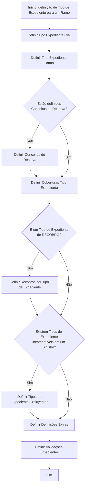

# Definição de Tipo de Expediente para um Ramo

## 1. Metadados do Documento
- **Arquivo de Origem:** Não identificado
- **Tipo de Documento:** Procedimento
- **Domínio / Sistema:** Definição de tipos de expediente, coberturas e reservas
- **Público-Alvo:** Negócio, operação e equipes responsáveis pela configuração de expedientes
- **Data/Versão Identificada:** Não identificada

---

## 2. Resumo Executivo & Contexto de Negócio

O documento descreve o procedimento para definir um **tipo de expediente**. O tipo de expediente definido poderá ser utilizado na abertura de expedientes e em sua tramitação posterior.

A definição parte das coberturas previamente configuradas em um ramo. O documento determina que todas as coberturas classificadas como “siniestrables” devem estar contidas em algum tipo de expediente.

O fluxo de configuração inclui a definição do tipo de expediente por companhia e por ramo, conceitos de reserva, coberturas associadas e, quando aplicável, recobros por tipo de expediente. O processo também avalia incompatibilidades entre tipos de expediente em um sinistro.

O procedimento é concluído com definições extras, tipos de expediente excludentes e validações de expedientes. O conteúdo não detalha telas, campos, contratos de API, métodos HTTP, regras de cálculo de reserva ou critérios concretos para identificar um expediente de recobro.

---

## 3. Arquitetura, Componentes & Tecnologias Envolvidas

O documento não apresenta uma arquitetura de software, integrações técnicas, microsserviços, servidores, bancos de dados ou tecnologias de implementação.

Os componentes funcionais identificados são:

- **Tipo de Expediente Cía.**
- **Tipo de Expediente Ramo**
- **Conceitos de Reserva**
- **Coberturas Tipo Expediente**
- **Recobros por Tipo de Expediente**
- **Tipos de Expediente Excluyentes**
- **Definições Extras**
- **Validações Expedientes**
- **Coberturas siniestrables**
- **Ramo**
- **Sinistro**



---

## 4. Regras de Negócio, Especificações Funcionais & Processos

1. O objetivo do procedimento é explicar os passos para a definição de um tipo de expediente.
2. Um tipo de expediente definido pode ser utilizado na abertura de expedientes e em sua tramitação posterior.
3. A definição dos tipos de expediente deve partir das coberturas definidas no ramo.
4. Todas as coberturas “siniestrables” devem estar contidas em algum tipo de expediente.
5. O processo prevê a definição de um tipo de expediente por companhia, identificada no documento como “Cía.”.
6. O processo prevê a definição de um tipo de expediente por ramo.
7. Deve ser verificado se os conceitos de reserva estão definidos:
   - Se não estiverem definidos, o processo requer a definição dos conceitos de reserva.
   - Após essa verificação, devem ser definidas as coberturas do tipo de expediente.
8. Deve ser avaliado se o tipo de expediente é de **RECOBRO**:
   - Se for de recobro, devem ser definidos os recobros por tipo de expediente.
   - Se não for de recobro, o fluxo segue para a verificação de incompatibilidades.
9. Deve ser avaliada a existência de tipos de expediente incompatíveis em um sinistro:
   - Se existirem, devem ser definidos tipos de expediente excludentes.
   - Se não existirem, o fluxo segue para definições extras.
10. O procedimento inclui definições extras.
11. O procedimento lista a definição de validações de expedientes como etapa final.

---

## 5. Tabelas de Parâmetros, Ambientes e Estruturas de Dados

| Item / Parâmetro | Descrição / Função | Tipo / Valores / Formato | Ambiente / Observações |
| :--- | :--- | :--- | :--- |
| Tipo de Expediente Cía. | Etapa de definição de tipo de expediente por companhia. | Não detalhado. | “Cía.” não é expandido no documento. |
| Tipo de Expediente Ramo | Etapa de definição de tipo de expediente para um ramo. | Não detalhado. | A definição parte das coberturas do ramo. |
| Coberturas siniestrables | Coberturas que devem estar incluídas em algum tipo de expediente. | Classificação “siniestrables”. | O documento não apresenta critérios para essa classificação. |
| Conceitos de Reserva | Elementos cuja existência deve ser verificada durante o fluxo. | Não detalhado. | Devem ser definidos quando ainda não existirem. |
| Coberturas Tipo Expediente | Coberturas associadas a um tipo de expediente. | Não detalhado. | Etapa posterior à verificação dos conceitos de reserva. |
| Tipo de Expediente de RECOBRO | Condição que determina a necessidade de configurar recobros. | Sim / Não. | Não há definição de RECOBRO no texto. |
| Recobros por Tipo de Expediente | Configuração aplicável a tipos de expediente de recobro. | Não detalhado. | Executada apenas quando o tipo de expediente for de RECOBRO. |
| Tipos de Expediente Excluyentes | Configuração para tipos incompatíveis em um sinistro. | Não detalhado. | Aplicável quando houver incompatibilidade. |
| Definições Extras | Etapa adicional do processo de definição. | Não detalhado. | O documento não descreve seu conteúdo. |
| Validações Expedientes | Etapa listada para definir validações relacionadas a expedientes. | Não detalhado. | Listada na segunda página do documento. |
| Ambientes | Não identificados. | Não aplicável. | O texto não apresenta URLs, servidores, portas ou nomes de ambiente. |
| Rotas de log | Não identificadas. | Não aplicável. | O texto não apresenta caminhos, variáveis ou níveis de log. |

---

## 6. Bateria de Perguntas & Respostas para RAG (FAQ Sintético)

### P1: Qual é o objetivo da definição de um tipo de expediente?
**R:** O objetivo é explicar os passos para definir um tipo de expediente. Após a definição, o tipo de expediente poderá ser utilizado na abertura de expedientes e em sua tramitação posterior.

### P2: Qual é o ponto de partida para definir tipos de expediente?
**R:** A definição deve partir das coberturas previamente definidas no ramo.

### P3: Qual regra deve ser atendida pelas coberturas siniestrables?
**R:** Todas as coberturas classificadas como “siniestrables” devem estar contidas em algum tipo de expediente.

### P4: Quais são as primeiras etapas do processo de definição de tipo de expediente?
**R:** As primeiras etapas listadas são: definir o tipo de expediente por companhia, identificado como “Cía.”, e definir o tipo de expediente por ramo.

### P5: O que deve ocorrer quando os conceitos de reserva ainda não estão definidos?
**R:** Quando os conceitos de reserva não estão definidos, o processo requer a definição dos conceitos de reserva antes de seguir para a definição das coberturas do tipo de expediente.

### P6: Quando devem ser definidos recobros por tipo de expediente?
**R:** Os recobros por tipo de expediente devem ser definidos quando o fluxo identificar que o tipo de expediente é um tipo de expediente de RECOBRO.

### P7: O que acontece quando existem tipos de expediente incompatíveis em um sinistro?
**R:** Quando existem tipos de expediente incompatíveis em um sinistro, o processo requer a definição de tipos de expediente excludentes.

### P8: Quais etapas sucedem a análise de incompatibilidade entre tipos de expediente?
**R:** Após a análise de incompatibilidade, o fluxo segue para a definição de definições extras e para a definição de validações de expedientes.

### P9: O documento detalha os critérios de cálculo ou os campos dos conceitos de reserva?
**R:** Não. O documento apenas determina que os conceitos de reserva devem estar definidos e prevê sua definição quando necessário, sem especificar campos, regras de cálculo ou critérios de validação.

### P10: O documento especifica APIs, URLs, métodos HTTP ou contratos de integração?
**R:** Não. Embora o rodapé mencione “Soluciones APIs” e “Documentación Zeus”, o conteúdo apresentado não detalha APIs, URLs, métodos HTTP, contratos JSON ou integrações técnicas.

---

## 7. Glossário de Termos, Siglas & Conceitos-Chave

- **Tipo de Expediente:** Entidade cuja definição é descrita no procedimento e que poderá ser utilizada na abertura e tramitação de expedientes.
- **Ramo:** Contexto no qual as coberturas estão definidas e para o qual é definido um tipo de expediente.
- **Coberturas siniestrables:** Coberturas que devem estar contidas em algum tipo de expediente.
- **Conceitos de Reserva:** Conceitos cuja existência deve ser verificada e que devem ser definidos quando ausentes.
- **RECOBRO:** Classificação de tipo de expediente que exige a definição de recobros por tipo de expediente. O documento não fornece expansão ou definição adicional.
- **Sinistro:** Contexto usado para avaliar a incompatibilidade entre tipos de expediente.
- **Tipos de Expediente Excluyentes:** Tipos definidos quando há incompatibilidade entre tipos de expediente em um sinistro.
- **Cía.:** Abreviação presente em “Tipo Expediente Cía.”; o documento não fornece sua expansão.
- **RS:** Sigla exibida no documento sem explicação contextual.
- **Zeus:** Termo exibido no rodapé como “Documentación Zeus”; o documento não fornece detalhamento adicional.

---

## 8. Notas Críticas, Riscos & Limitações

- O documento não identifica arquivo de origem, autor, data, versão, sistema proprietário ou ambiente de execução.
- O conteúdo não especifica os campos, formatos, regras de cálculo, critérios de validação ou dados obrigatórios para tipos de expediente, coberturas, reservas e recobros.
- O documento não define o significado de “RECOBRO”, “Cía.”, “RS” ou “Zeus”.
- O diagrama de processo indica decisões “SI” e “NO”, mas não detalha responsáveis, aprovações, exceções, persistência de dados ou tratamento de falhas.
- Não há informações sobre APIs, contratos de integração, segurança, logs, monitoramento, servidores, URLs, ambientes ou versões tecnológicas.
- **Nota de Análise:** O documento lista “Definir Validaciones Expedientes”, porém não detalha quais validações devem ser implementadas.
- **Nota de Análise:** O documento lista “Definiciones Extras”, porém não detalha o conteúdo dessas definições.

---

## 9. Conteúdo Bruto Estruturado (Referência Fiel)

```text
--- [PÁGINA 1 DE 2] ---

DEFINICIÓN Tipo de expediente
Objetivo
Explicar los pasos a seguir para definición de un tipo de daño. Posteriormente este podrá para ser
utilizado en la apertura de expedientes y su posterior tramitación. Entender la necesidad de definir
diferentes tipos de expediente, qué implica la definición de tipos de expedientes...
Para poder definir los tipos de expediente, partiremos de las coberturas definidas en el ramo.
Todas las coberturas "siniestrables",tipo de coberturas tienen que estar contenidas en algún Tipo de
Expediente.
Proceso para la definición de un Tipo de Expediente para un
Ramo
SI
NO SI
NO
SI
NO
DEFINIR
Tipo Expediente
Cia.
DEFINIR
Tipo Expediente
Ramo
¿Están Definidos
Conceptos
Reserva? DEFINIR
Conceptos
Reserva
DEFINIR
Coberturas
Tipo Exp.
¿Es un Tipo
expediente de
RECOBRO? DEFINIR
Recobros por
Tipo de Expediente
¿Existen Tipos
Exp.
Incompatibles en un
Siniestro? DEFINIR
Tipo de Expedientes
Excluyentes
DEFINIR
Definiciones
Extras
FIN
1. DEFINIR Tipo Expediente Cía
2. DEFINIR Tipo Expediente Ramo
3. DEFINIR Concepto de Reserva
4. DEFINIR Coberturas Tipo Expediente
5. DEFINIR Recobros por Tipo de Expediente
 / 
 RS
Inicio Soluciones APIs Documentación Zeus
ES


--- [PÁGINA 2 DE 2] ---

6. DEFINIR Tipo de Expedientes Excluyentes
7. DEFINIR Validaciones Expedientes
```
