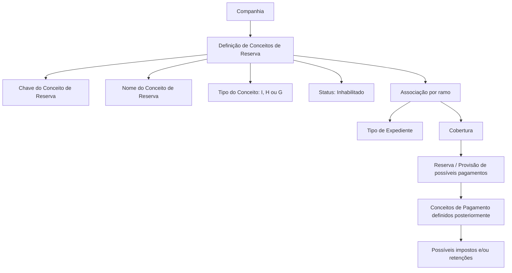

# Definição de Conceitos de Reserva para Expedientes e Coberturas

## 1. Metadados do Documento
- **Arquivo de Origem:** Não identificado
- **Tipo de Documento:** Especificação Funcional
- **Domínio / Sistema:** Conceitos de Reserva; expedientes, coberturas, pagamentos e provisões
- **Público-Alvo:** Negócio, analistas funcionais, desenvolvedores e operação
- **Data/Versão Identificada:** Não identificada

---

## 2. Resumo Executivo & Contexto de Negócio

O documento define o conceito de reserva como o detalhamento econômico necessário para provisionar possíveis pagamentos vinculados a expedientes. A reserva é realizada por cobertura afetada e apresenta o detalhamento econômico previamente definido para aquela situação.

Os conceitos de reserva classificam a finalidade da provisão em três categorias: indenizações, honorários e gastos. As indenizações podem estar relacionadas, por exemplo, a oficinas, segurados, clínicas, lesionados ou prejudicados. Honorários e gastos referem-se à possível intervenção de profissionais, incluindo advogados externos e peritos externos.

A definição dos conceitos de reserva ocorre no nível da companhia. Após a definição corporativa, os conceitos devem ser associados, por ramo, a cada combinação aplicável de tipo de expediente e cobertura.

O documento diferencia explicitamente conceitos de reserva de conceitos de pagamento. Os conceitos de pagamento são definidos posteriormente, associados aos conceitos de reserva e carregam os possíveis impostos e/ou retenções aplicáveis.

---

## 3. Arquitetura, Componentes & Tecnologias Envolvidas

O conteúdo descreve uma estrutura funcional de configuração e associação de conceitos econômicos. Não há detalhamento de tecnologias, APIs, bancos de dados, ambientes, protocolos, contratos JSON ou microsserviços.

Componentes funcionais identificados:

| Componente | Papel descrito |
| :--- | :--- |
| Companhia | Nível no qual os conceitos de reserva são definidos. |
| Conceito de Reserva | Chave identificadora de um tipo de reserva dentro de um expediente. |
| Tipo de Expediente | Entidade à qual um conceito de reserva pode ser associado por ramo. |
| Cobertura | Cobertura afetada para a qual é apresentado o detalhamento econômico de reserva. |
| Conceito de Pagamento | Conceito definido posteriormente e associado a um conceito de reserva. |
| Impostos e/ou Retenções | Elementos associados aos conceitos de pagamento. |



> **Nota de Análise:** O texto exibido contém as referências “Home Solutions APIs Documentation Zeus”, mas não fornece explicação funcional ou técnica sobre esses termos. Portanto, não é possível classificá-los como sistemas integrados, tecnologias ou componentes de arquitetura.

---

## 4. Regras de Negócio, Especificações Funcionais & Processos

1. A finalidade da reserva é definir o detalhamento econômico necessário para provisionar possíveis pagamentos de expedientes.
2. Quando uma reserva ou provisão é realizada para suportar possíveis pagamentos de um expediente, o detalhamento econômico definido é exibido para cada cobertura afetada.
3. Cada conceito de reserva deve indicar sua finalidade de utilização:
   - Reserva de possíveis indenizações.
   - Reserva de possíveis honorários.
   - Reserva de possíveis gastos.
4. As possíveis indenizações podem ser destinadas, entre outros exemplos citados, a oficina, segurado, clínica, lesionado ou prejudicado.
5. Honorários e gastos podem estar relacionados a profissionais intervenientes no expediente, como advogados externos e peritos externos.
6. Conceitos de reserva são definidos no nível da companhia.
7. Após a definição no nível da companhia, os conceitos de reserva devem ser associados, por ramo, a cada tipo de expediente e cobertura.
8. A propriedade **Conceito de reserva** é a chave de identificação dos diferentes conceitos pelos quais se pode reservar em um expediente.
9. Uma única chave de conceito de reserva pode ser utilizada por um ou mais tipos de expediente e cobertura.
10. A propriedade **Nombre del Concepto de Reserva** contém a descrição da chave definida para o conceito de reserva.
11. O nome do conceito de reserva pode conter números e/ou letras.
12. A propriedade **Tipo Concepto de Reserva** indica se o conceito será usado para indenizações, honorários ou gastos.
13. Os valores permitidos para o tipo de conceito de reserva são:
    - `I`: Conceito de Indenização.
    - `H`: Conceito de Honorários.
    - `G`: Conceito de Gastos.
14. A propriedade **Inhabilitado** indica se um conceito de reserva definido está habilitado ou não para associação a um tipo de expediente e cobertura.
15. Conceitos de reserva não são os conceitos pelos quais os pagamentos serão posteriormente realizados.
16. Conceitos de pagamento devem ser definidos posteriormente e associados aos conceitos de reserva.
17. Conceitos de pagamento possuem associados os possíveis impostos e/ou retenções.

---

## 5. Tabelas de Parâmetros, Ambientes e Estruturas de Dados

| Item / Parâmetro | Descrição / Função | Tipo / Valores / Formato | Ambiente / Observações |
| :--- | :--- | :--- | :--- |
| Conceito de reserva | Chave que identifica os conceitos pelos quais uma reserva pode ser realizada dentro de um expediente. | Chave; formato não detalhado. | Uma chave pode ser usada em um ou mais tipos de expediente e cobertura. |
| Nombre del Concepto de Reserva | Descrição da chave definida para o conceito de reserva. | Pode conter números e/ou letras. | Não há limite de tamanho informado. |
| Tipo Concepto de Reserva | Define a finalidade econômica do conceito de reserva. | `I`, `H` ou `G`. | Classifica o conceito como indenização, honorários ou gastos. |
| Inhabilitado | Indica se o conceito de reserva está habilitado para associação. | Estado habilitado ou não habilitado; codificação não detalhada. | Aplicável à associação com tipo de expediente e cobertura. |
| Ramo | Critério de associação dos conceitos definidos pela companhia. | Não detalhado. | Associação por ramo a tipo de expediente e cobertura. |
| Tipo de Expediente | Entidade que pode receber associação de um conceito de reserva. | Não detalhado. | Pode compartilhar uma mesma chave com outras combinações. |
| Cobertura | Cobertura afetada para a qual é apresentado o detalhamento econômico definido. | Não detalhado. | Associada ao tipo de expediente e ao ramo. |
| Conceito de Pagamento | Conceito utilizado para pagamentos, definido posteriormente. | Exemplos: `S01` a `S07`. | Deve ser associado a um conceito de reserva; possui possíveis impostos e/ou retenções. |

### Valores de Tipo de Conceito de Reserva

| Código | Significado |
| :--- | :--- |
| `I` | Conceito de Indenização |
| `H` | Conceito de Honorários |
| `G` | Conceito de Gastos |

### Exemplo de Associação entre Conceito de Reserva e Conceito de Cobrança/Pagamento

| Conceito de Reserva | Categoria de Reserva | Conceito de Cobrança e Pagamento | Descrição do Conceito de Cobrança e Pagamento |
| :--- | :--- | :--- | :--- |
| `1` | Indenização | `S01` | Indenização Segurado |
| `1` | Indenização | `S02` | Indenização Clínicas |
| `1` | Indenização | `S03` | Indenização Oficinas |
| `2` | Honorários | `S04` | Honorários Advogados Externos |
| `2` | Honorários | `S05` | Honorários Peritos Externos |
| `3` | Gastos | `S06` | Gastos Advogados Externos |
| `3` | Gastos | `S07` | Gastos Peritos Externos |

---

## 6. Bateria de Perguntas & Respostas para RAG (FAQ Sintético)

### P1: Qual é a finalidade de um conceito de reserva?
**R:** Um conceito de reserva define o detalhamento econômico necessário para provisionar possíveis pagamentos de um expediente. Quando uma reserva é realizada, esse detalhamento é apresentado para cada cobertura afetada.

### P2: Em que nível os conceitos de reserva são definidos?
**R:** Os conceitos de reserva são definidos no nível da companhia. Depois dessa definição, devem ser associados por ramo aos tipos de expediente e às coberturas correspondentes.

### P3: Quais são os tipos permitidos para um conceito de reserva?
**R:** O tipo de conceito de reserva aceita três valores: `I` para conceito de indenização, `H` para conceito de honorários e `G` para conceito de gastos.

### P4: O que representa a propriedade “Conceito de reserva”?
**R:** A propriedade “Conceito de reserva” representa a chave usada para identificar os diferentes conceitos pelos quais se pode realizar uma reserva dentro de um expediente.

### P5: Uma mesma chave de conceito de reserva pode ser reutilizada?
**R:** Sim. Uma chave de conceito de reserva pode ser utilizada para um ou mais tipos de expediente e cobertura.

### P6: O que a propriedade “Nombre del Concepto de Reserva” armazena?
**R:** A propriedade “Nombre del Concepto de Reserva” armazena a descrição da chave definida para o conceito de reserva. Essa descrição pode conter números e/ou letras.

### P7: O que significa a propriedade “Inhabilitado”?
**R:** A propriedade “Inhabilitado” informa se o conceito de reserva definido está habilitado ou não para ser associado a um tipo de expediente e cobertura.

### P8: Conceitos de reserva são os conceitos usados diretamente para realizar pagamentos?
**R:** Não. O documento esclarece que conceitos de reserva não são os conceitos pelos quais os pagamentos serão realizados. Os conceitos de pagamento são definidos posteriormente e devem ser associados aos conceitos de reserva.

### P9: Onde impostos e retenções são associados?
**R:** Os possíveis impostos e/ou retenções são associados aos conceitos de pagamento, e não aos conceitos de reserva.

### P10: Quais exemplos de destinatários são citados para reservas de indenização?
**R:** O documento cita como exemplos de destinatários de possíveis indenizações uma oficina, um segurado, uma clínica, um lesionado e um prejudicado.

### P11: Quais profissionais são citados como exemplos para honorários ou gastos?
**R:** O documento cita advogados externos e peritos externos como exemplos de profissionais que podem intervir no expediente e gerar reservas de honorários ou gastos.

### P12: Quais conceitos de pagamento estão associados ao conceito de reserva de indenização no exemplo?
**R:** No exemplo, o conceito de reserva `1`, classificado como indenização, está associado aos conceitos de pagamento `S01` Indenização Segurado, `S02` Indenização Clínicas e `S03` Indenização Oficinas.

---

## 7. Glossário de Termos, Siglas & Conceitos-Chave

- **Reserva / Provisão:** Detalhamento econômico definido para suportar possíveis pagamentos de um expediente.
- **Conceito de Reserva:** Chave e classificação funcional usadas para identificar uma modalidade de reserva dentro de um expediente.
- **Conceito de Pagamento:** Conceito definido posteriormente, associado a um conceito de reserva e portador de possíveis impostos e/ou retenções.
- **Cobertura:** Elemento afetado no expediente para o qual o detalhamento econômico de reserva é apresentado.
- **Expediente:** Entidade tratada pelo processo de reserva e possíveis pagamentos.
- **Ramo:** Critério utilizado para associar conceitos de reserva a tipos de expediente e coberturas.
- **`I`:** Conceito de Indenização.
- **`H`:** Conceito de Honorários.
- **`G`:** Conceito de Gastos.
- **Inhabilitado:** Propriedade que indica se um conceito de reserva está habilitado para associação a um tipo de expediente e cobertura.
- **S01–S07:** Códigos de conceitos de cobrança e pagamento apresentados no exemplo do documento.

---

## 8. Notas Críticas, Riscos & Limitações

- O documento não especifica formato, tamanho, unicidade ou método de geração da chave de conceito de reserva.
- O documento não detalha os valores técnicos possíveis para a propriedade **Inhabilitado**, apenas sua finalidade funcional.
- Não há especificação de interfaces, APIs, persistência de dados, integrações, perfis de acesso, regras de auditoria ou fluxos de aprovação.
- Não há detalhamento sobre como ocorre a associação por ramo entre conceito de reserva, tipo de expediente e cobertura.
- Não são apresentados critérios para determinar impostos e retenções dos conceitos de pagamento.
- Os termos “Home Solutions APIs Documentation Zeus” aparecem no conteúdo extraído, mas não são explicados; não é possível inferir sua função.
- O exemplo de associação apresentado não deve ser interpretado como catálogo completo de conceitos de pagamento ou reserva.

---

## 9. Conteúdo Bruto Estruturado (Referência Fiel)

```text
--- [PÁGINA 1 DE 3] ---

DEFINICIÓN Concepto de Reserva
Objetivo
La finalidad es definir el desglose económico que se va a necesitar, para aprovisionar a los
expedientes, de posibles pagos.
Cuando se va a realizar la reserva (provisión), para hacer frente a los posibles pagos de un
expediente, para cada cobertura afectada, nos aparecerá el desglose económico que se haya
definido.
Para cada concepto de reserva, se tendrá que indicar si este será utilizado para reservar
Indemnizaciones (a un taller, a un asegurado, a una clínica, a un lesionado, a un perjudicado…), para
reservar posibles Honorarios de profesionales que intervengan en el expediente (abogados externos,
peritos externos…) o para realizar reservas de posibles Gastos de Profesionales que intervengan en
el expediente.
Estos conceptos se están definiendo a nivel de compañía. Posteriormente, se tendrán que asociar
por ramo a cada tipo de expediente, cobertura.
Imagen del Mantenimiento Conceptos de reserva:
 /
 CF
Home Solutions APIs Documentation Zeus
EN


--- [PÁGINA 2 DE 3] ---

Propiedades
Concepto de reserva
Esta propiedad será la clave por la que se va a identificar los distintos conceptos por los que se
puede a reservar dentro de un expediente.
Una clave podrá ser utilizada para uno o varios tipos de expediente, cobertura.
Nombre del Concepto de Reserva
Esta propiedad contendrá la descripción de la clave definida para el concepto de Reserva. Puede
contener números y/o letras.
Tipo Concepto de Reserva
Esta propiedad indicará para que se está utilizando el concepto si el concepto de reserva que se está
definiendo, será utilizado para reservar posibles indemnizaciones, para reservar posibles honorarios
o para reservar posibles gastos.
Ejemplo:


--- [PÁGINA 3 DE 3] ---

Los valores que puede contener son:
I Concepto de Indemnización
H Concepto de Honorarios
G Concepto de Gastos
Inhabilitado
Esta propiedad indica si el Concepto de Reserva que está definido, está habilitado o no para
asociarlo a un tipo de expediente cobertura.
Preguntas frecuentes
¿Estos son los conceptos por los que luego se realizarán los pagos?
No, en este apartado se están definiendo los conceptos de reserva.
Los conceptos de pago se definirán posteriormente y se tendrán que asociar a los conceptos de
Reserva.
Los conceptos de Pago llevarán asociados los posibles impuestos y/o retenciones.
CONCEPTO RESERVA CONCEPTO COBRO Y PAGO
1 Indemnización S01 Indemnización Asegurado
1 Indemnización S02 Indemnización Clínicas
1 Indemnización S03 Indemnización Talleres
2 Honorarios S04 Honorarios Abogados Externos
2 Honorarios S05 Honorarios Peritos Externos
3 Gastos S06 Gastos Abogados Externos
3 Gastos S07 Gastos Peritos Externos
Ejemplo:
```
