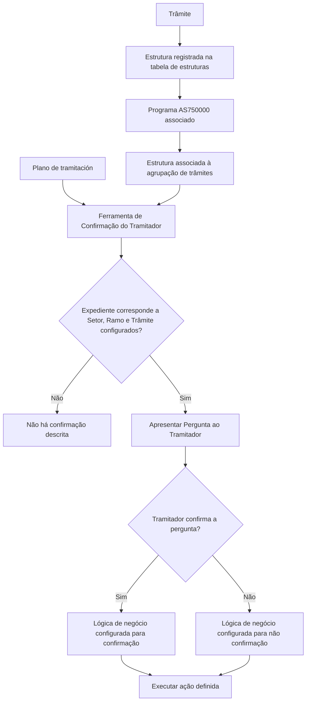

# Definição de Confirmação do Tramitador — Associação de Pergunta a Trâmite

## 1. Metadados do Documento
- **Arquivo de Origem:** Não identificado no conteúdo fornecido
- **Tipo de Documento:** Especificação Técnica / Procedimento de configuração
- **Domínio / Sistema:** Confirmação de trâmites por tramitador; Reef.core
- **Público-Alvo:** Configuradores funcionais, analistas de negócio, desenvolvedores e operação
- **Data/Versão Identificada:** Não identificada

---

## 2. Resumo Executivo & Contexto de Negócio

O documento descreve a definição necessária para utilizar uma ferramenta de **Confirmação do Tramitador**, chamada a partir do plano de trâmite de confirmação de trâmites. A ferramenta permite associar uma pergunta a um código de trâmite para que o tramitador confirme ou recuse uma condição durante o tratamento de um expediente.

O mecanismo é aplicável a expedientes segmentados por **Setor**, **Ramo** e **Trâmite**. Quando um expediente corresponde aos valores configurados, a pergunta definida é apresentada ao tramitador, que deve confirmar ou não a condição proposta. O documento prevê a utilização de valores genéricos de setor e ramo para permitir execução independente dessas classificações.

Os exemplos apresentados abrangem validação da situação de apólices e recibos, confirmação de documentos obrigatórios, confirmação de veículo de substituição e confirmação de perda total após a chegada do resultado de perícia. A confirmação humana evita que determinadas ações sejam disparadas automaticamente sem análise do tramitador.

Após a resposta, uma lógica de negócio pode executar qualquer ação previamente definida, de acordo com a confirmação ou rejeição da pergunta. Entre os exemplos, estão a inserção de um trâmite para abertura de recobro de salvamento após confirmação de perda total e a inserção de um trâmite para gerar carta de solicitação de documentos ausentes quando os documentos obrigatórios não forem confirmados.

A operação possui pré-requisitos estruturais: o trâmite precisa possuir uma estrutura registrada na tabela de estruturas; essa estrutura deve ter o programa **AS750000** associado; e a estrutura deve estar vinculada à agrupação de trâmites.

---

## 3. Arquitetura, Componentes & Tecnologias Envolvidas

Os elementos identificados no documento são:

- **Plano de tramitación:** origem da chamada da ferramenta de confirmação.
- **Ferramenta de Confirmação do Tramitador:** mecanismo que apresenta perguntas e recebe a decisão do tramitador.
- **Expediente:** entidade à qual se aplicam Setor, Ramo e Trâmite.
- **Setor:** chave de classificação do expediente.
- **Ramo:** chave de classificação do expediente.
- **Trâmite:** código do trâmite ao qual uma pergunta será associada.
- **Pergunta:** questão apresentada ao tramitador.
- **Lógica de negócio posterior à confirmação:** ações configuradas conforme a resposta positiva ou negativa.
- **Tabela de estruturas:** repositório no qual a estrutura do trâmite deve estar registrada.
- **Programa AS750000:** programa que deve estar associado à estrutura do trâmite.
- **Agrupação de trâmites:** associação obrigatória da estrutura utilizada.
- **Reef.core:** sistema no qual o atributo **Panel** era utilizado.

> **Nota de Análise:** O documento não detalha métodos HTTP, contratos JSON, banco de dados, endpoints, interfaces, formatos de persistência ou mecanismos técnicos de execução da lógica de negócio.



---

## 4. Regras de Negócio, Especificações Funcionais & Processos

### 4.1 Finalidade da confirmação do tramitador

A ferramenta permite definir que o tramitador revise condições relevantes antes de executar ou prosseguir com determinados trâmites. A revisão pode abranger estado da apólice, tipo de cliente, sinistralidade do cliente, recibos, documentos obrigatórios, circunstâncias do caso e perda total.

### 4.2 Associação de pergunta a trâmite

Uma pergunta deve ser associada a um trâmite específico. A associação é condicionada pelos atributos de Setor, Ramo e Trâmite definidos para os expedientes aos quais a confirmação se aplica.

Exemplos apresentados:

1. Associar uma pergunta a um trâmite de **Pérdida Total** para que o tramitador confirme ou não a perda total.
2. Associar uma pergunta a um trâmite de revisão de recibos e situação da apólice para indicar se tudo está correto.
3. Associar uma pergunta a um trâmite para confirmar o veículo de substituição.

### 4.3 Uso de Setor genérico

O atributo **Sector** identifica a chave do setor dos expedientes aos quais será associado um trâmite que requer confirmação ou não do tramitador.

O documento informa que pode ser utilizado um setor genérico. O setor genérico indica que a ferramenta poderá ser executada independentemente do setor do expediente.

### 4.4 Uso de Ramo genérico

O atributo **Ramo** identifica a chave do ramo dos expedientes aos quais será associado um trâmite que requer confirmação ou não do tramitador.

O documento informa que pode ser utilizado um ramo genérico. O ramo genérico indica que a ferramenta poderá ser utilizada independentemente do ramo do expediente.

### 4.5 Pergunta apresentada ao tramitador

O atributo **Pregunta** contém a pergunta que será realizada ao tramitador quando um expediente possuir o Setor, o Ramo e o Trâmite configurados.

As perguntas exemplificadas são:

- “¿Están todos los recibos en Orden?”
- “¿Se han recibido todos los documentos obligatorios?”
- “¿Se confirma la pérdida Total?”

### 4.6 Lógica após a decisão do tramitador

A seção “Lógica de negocio después de confirmación” informa que pode ser hospedada uma lógica de negócio capaz de realizar qualquer ação definida, dependendo de o tramitador confirmar ou não a pergunta.

Regras exemplificadas:

- Se o tramitador confirmar a perda total, a lógica pode inserir um trâmite para abertura de um recobro de salvamento.
- Se o tramitador não confirmar que todos os documentos obrigatórios foram recebidos, a lógica pode inserir um trâmite para gerar uma carta de solicitação dos documentos faltantes.

### 4.7 Caso de perda total

O documento descreve que, quando o resultado da perícia for perda total, não deve ocorrer automaticamente a abertura do expediente de salvamento nem a comunicação da perda ao segurado antes que o tramitador revise o tipo de cliente e as circunstâncias.

Para atender a essa necessidade, pode ser definido um trâmite no qual o tramitador confirma ou não a perda total após a chegada do resultado da perícia. Caso a perda total seja confirmada, o documento informa que devem ocorrer as seguintes ações:

1. Abertura automática do expediente de salvamento.
2. Inserção, no plano, da comunicação ao segurado sobre **Pérdida Total**.

### 4.8 Pré-requisitos obrigatórios

Para o funcionamento da ferramenta:

1. O trâmite deve ter uma estrutura associada.
2. A estrutura deve estar registrada na tabela de estruturas.
3. A estrutura deve ter o programa **AS750000** associado.
4. A estrutura deve estar associada à agrupação de trâmites.

---

## 5. Tabelas de Parâmetros, Ambientes e Estruturas de Dados

| Item / Parâmetro | Descrição / Função | Tipo / Valores / Formato | Ambiente / Observações |
| :--- | :--- | :--- | :--- |
| Sector | Indica a chave do setor dos expedientes aos quais será associado um trâmite que requer confirmação ou não do tramitador. | Chave de setor; pode usar setor genérico. | O setor genérico permite execução independentemente do setor do expediente. |
| Ramo | Indica a chave do ramo dos expedientes aos quais será associado um trâmite que requer confirmação ou não do tramitador. | Chave de ramo; pode usar ramo genérico. | O ramo genérico permite utilização independentemente do ramo do expediente. |
| Trámite | Contém o código do trâmite ao qual será associada uma pergunta de confirmação. | Código de trâmite. | O trâmite precisa atender aos pré-requisitos de estrutura. |
| Panel | Atributo informado como utilizado apenas no Reef.core. | Não detalhado. | Não há descrição de valores, comportamento ou finalidade adicional. |
| Pregunta | Contém a pergunta apresentada ao tramitador quando houver correspondência de Setor, Ramo e Trâmite. | Texto de pergunta. | A resposta do tramitador determina a lógica de negócio posterior. |
| Lógica de negócio após confirmação | Executa ação definida de acordo com a confirmação ou não confirmação da pergunta. | Ação configurável; detalhes de implementação não informados. | Exemplos incluem inserção de trâmite de recobro e geração de carta. |
| Estrutura do trâmite | Estrutura exigida para que o trâmite funcione com a ferramenta. | Estrutura registrada na tabela de estruturas. | Deve possuir o programa AS750000 e vínculo com a agrupação de trâmites. |
| AS750000 | Programa que deve estar associado à estrutura do trâmite. | Identificador de programa. | Requisito explícito de funcionamento. |
| Agrupação de trâmites | Agrupação à qual a estrutura do trâmite deve estar associada. | Associação estrutural. | Requisito explícito de funcionamento. |

| Setor | Ramo | Trâmite | Pergunta |
| :--- | :--- | :--- | :--- |
| 9999 / todos | 9999 / Todos | T1 — Comprobación de Póliza | ¿Están todos los recibos en Orden? |
| 9999 / todos | 9999 / Todos | T4 — Comprobación de Documentos | ¿Se han recibido todos los documentos obligatorios? |
| 9999 / todos | 9999 / Todos | T05 — Confirmación Pérdida Total | ¿Se confirma la pérdida Total? |

> **Nota de Análise:** A tabela de exemplo no conteúdo original apresenta “9999/todos” para Setor e “9999/Todos” para Ramo. O documento não esclarece se `9999` é formalmente o valor genérico, apenas mostra esses valores no exemplo.

---

## 6. Bateria de Perguntas & Respostas para RAG (FAQ Sintético)

### P1: Qual é a finalidade da ferramenta de Confirmação do Tramitador?
**R:** A ferramenta permite associar uma pergunta a um trâmite para que o tramitador confirme ou não uma condição durante o tratamento de um expediente. Ela é chamada a partir do plano de tramitación de confirmação de trâmites.

### P2: Quais atributos identificam os expedientes aos quais uma pergunta será aplicada?
**R:** A pergunta é aplicada quando o expediente possui o Setor, o Ramo e o Trâmite configurados na definição. O documento descreve os atributos Sector, Ramo, Trámite e Pregunta como elementos da configuração.

### P3: O que acontece ao usar um setor genérico na definição?
**R:** O uso de setor genérico indica que a ferramenta poderá ser executada independentemente do setor do expediente.

### P4: O que acontece ao usar um ramo genérico na definição?
**R:** O uso de ramo genérico indica que a ferramenta poderá ser utilizada independentemente do ramo do expediente.

### P5: Qual é o papel do atributo Trámite?
**R:** O atributo Trámite contém o código do trâmite ao qual será associada uma pergunta para que o tramitador confirme ou não uma condição.

### P6: Quais perguntas de exemplo são apresentadas no documento?
**R:** O documento apresenta as perguntas “¿Están todos los recibos en Orden?”, “¿Se han recibido todos los documentos obligatorios?” e “¿Se confirma la pérdida Total?”, associadas respectivamente aos trâmites T1, T4 e T05 no exemplo.

### P7: O que pode ocorrer quando o tramitador confirma uma perda total?
**R:** O documento informa que, após a confirmação da perda total, pode ser inserido um trâmite para abertura de um recobro de salvamento. Em outro exemplo de fluxo, a confirmação pode abrir automaticamente o expediente de salvamento e inserir no plano a comunicação ao segurado de Pérdida Total.

### P8: O que pode ocorrer quando o tramitador não confirma o recebimento de todos os documentos obrigatórios?
**R:** A lógica de negócio posterior pode inserir um trâmite para gerar uma carta de solicitação dos documentos faltantes.

### P9: Por que a confirmação do tramitador é relevante no processo de perda total?
**R:** O documento indica que, quando o resultado da perícia é perda total, o expediente de salvamento e a comunicação da perda ao segurado não devem ser abertos ou enviados automaticamente antes que o tramitador revise aspectos como tipo de cliente e circunstâncias.

### P10: Quais são os requisitos para que a ferramenta funcione?
**R:** O trâmite deve ter uma estrutura associada, a estrutura deve estar registrada na tabela de estruturas, a estrutura deve possuir o programa AS750000 associado e deve estar vinculada à agrupação de trâmites.

### P11: O atributo Panel é obrigatório para o funcionamento?
**R:** O documento apenas informa que o atributo Panel era utilizado exclusivamente no Reef.core. Não há detalhamento sobre obrigatoriedade, valores aceitos ou comportamento funcional desse atributo.

### P12: O documento define como a lógica de negócio é tecnicamente implementada?
**R:** Não. O documento afirma que a lógica de negócio pode realizar qualquer ação definida conforme a confirmação ou não confirmação, mas não especifica linguagem, regras de implementação, serviços, interfaces ou contratos técnicos.

---

## 7. Glossário de Termos, Siglas & Conceitos-Chave

- **Agrupação de trâmites:** associação à qual a estrutura do trâmite deve estar vinculada para que a ferramenta funcione.
- **AS750000:** programa que deve estar associado à estrutura do trâmite.
- **Expediente:** entidade de negócio à qual são aplicados Setor, Ramo e Trâmite.
- **Lógica de negócio após confirmação:** lógica capaz de executar ações definidas conforme a confirmação ou rejeição da pergunta pelo tramitador.
- **Panel:** atributo que, segundo o documento, era utilizado apenas no Reef.core.
- **Pergunta / Pregunta:** questão apresentada ao tramitador para confirmação ou não confirmação.
- **Peritação:** resultado de avaliação mencionado como origem de uma situação de perda total.
- **Pérdida Total:** condição de perda total cuja confirmação pelo tramitador pode acionar ações posteriores.
- **Plano de tramitación:** plano a partir do qual é chamada a ferramenta de confirmação do tramitador.
- **Ramo:** chave de classificação do ramo dos expedientes.
- **Recobro de salvamento:** ação exemplificada como possível consequência da confirmação de perda total.
- **Reef.core:** sistema no qual o atributo Panel era utilizado.
- **Sector / Setor:** chave de classificação do setor dos expedientes.
- **Tramitador:** usuário responsável por confirmar ou não a pergunta associada a um trâmite.
- **Trámite / Trâmite:** código ou processo ao qual é associada uma pergunta de confirmação.

---

## 8. Notas Críticas, Riscos & Limitações

- O documento não informa o nome do arquivo original, data, versão, autor ou responsável pelo conteúdo.
- O documento não especifica a implementação técnica da lógica de negócio posterior à confirmação.
- Não são descritos contratos de integração, APIs, métodos HTTP, URLs, credenciais, tabelas físicas, modelo de persistência ou regras transacionais.
- Não são descritos os comportamentos para erro, indisponibilidade, ausência de resposta do tramitador, respostas inválidas ou concorrência.
- O atributo **Panel** é apenas referido como utilizado no Reef.core; sua finalidade, configuração e impacto não são detalhados.
- Os valores `9999`, `todos` e `Todos` aparecem no exemplo, mas o documento não declara formalmente que representam valores genéricos obrigatórios.
- O documento exige estrutura, associação ao programa AS750000 e vínculo à agrupação de trâmites, mas não descreve o procedimento para criar ou manter essas associações.
- **Nota de Análise:** O documento lista ações possíveis após confirmação ou rejeição, mas não define uma matriz completa que associe cada pergunta a ações obrigatórias.

---

## 9. Conteúdo Bruto Estruturado (Referência Fiel)

```text
--- [PÁGINA 1 DE 4] ---

DEFINICIÓN Confirmación del Tramitador -
Asociar Pregunta a Trámite
Objetivo
La finalidad de este documento es conocer qué se necesita definir, para que funcione la herramienta
llamada desde el Plan de tramitación de Confirmación de trámites por el tramitador, .
Ejemplo:
En la compañía, se define que el tramitador antes de realizar cualquier trámite, revise el estado
de la póliza, el tipo de cliente, la siniestralidad del cliente, etc, para ello se puede definir un
trámite donde el tramitador confirme que el recibo y la póliza estén correctas y haga las
observaciones pertinentes.
Se necesita que cuando el resultado de la peritación sea pérdida total, no se abra
automáticamente el expediente de salvamento, ni se comunique la pérdida al asegurado, hasta
que el tramitador no revise el tipo de cliente, las circunstancias.... Para cubrir esta necesidad, se
puede definir un trámite para que el tramitador confirme o no la pérdida total después de llegar
el resultado de la peritación. Si confirma la pérdida total que se abra automáticamente el
expediente de salvamento y se inserte en el plan la comunicación al asegurado de Pérdida Total.
Etc.
Imagen del Mantenimiento Definición de la Confirmación del Tramitador:
 /
 CF
Home Solutions APIs Documentation Zeus
EN


--- [PÁGINA 2 DE 4] ---

Propiedades
Sector
Este atributo indica la clave del Sector de los expedientes a los que se les va a asociar un trámite
que va a requerir la confirmación o no del tramitador.
Puede utilizarse el sector genérico que indicará que la herramienta podrá ejecutarse
independientemente del sector del expediente.
Ramo
Este atributo indica la clave del Ramo de los expedientes a los que se les va asociar un trámite que
va a requerir la confirmación o no del tramitador.
Puede utilizarse el ramo genérico que indicará que se podrá utilizar independientemente del ramo
del expediente.
Trámite
Este atributo contendrá el código del trámite al cual se le va a asociar una pregunta para que el
tramitador confirme o no.
Por ejemplo:


--- [PÁGINA 3 DE 4] ---

Se puede asociar una pregunta a un trámite de Pérdida Total para que el tramitador confirme o
no la pérdida total.
Se puede asociar una pregunta a un trámite para revisar los recibos y la situación de la póliza
para que indique si todo está correcto.
Se puede asociar una pregunta a un trámite para confirmar el vehículo de sustitución.
Etc.
Panel
Este atributo sólo se usaba en Reef.core
Pregunta
Este atributo contendrá la pregunta que se le va a realizar al tramitador cuando un expediente tenga
el sector, el ramo y el trámite arriba indicado.
Ejemplo:
SECTOR RAMO TRAMITE PREGUNTA
9999
todos
9999
Todos
T1 Comprobación de
Póliza
¿Están todos los recibos en
Orden?
T4 Comprobación de
Documentos
¿Se han recibido todos los
documentos obligatorios?
T05 Confirmación
Pérdida Total
¿Se confirma la pérdida Total?
Lógica de negocio después de confirmación
Aquí se albergará una lógica de negocio que puede realizar cualquier acción que se defina,
dependiendo de si el tramitador Confirma o No la pregunta.
Ejemplo: - Si se confirma la pérdida total puede insertar un trámite para aperturar un recobro de
salvamento.
Si NO confirma que están todos los documentos obligatorio puede insertar un trámite para
generar una carta para reclamar los documentos faltantes
Preguntas frecuentes


--- [PÁGINA 4 DE 4] ---

¿ Hay algún requisito para que esto funcione?
Sí, el trámite tiene que tener asociado una estructura, que esté registrada en la tabla de estructuras.
Esa estructura tiene que tener el programa AS750000 asociado. Esta estructura tiene que estar
asociada a la agrupación de trámites.
```
