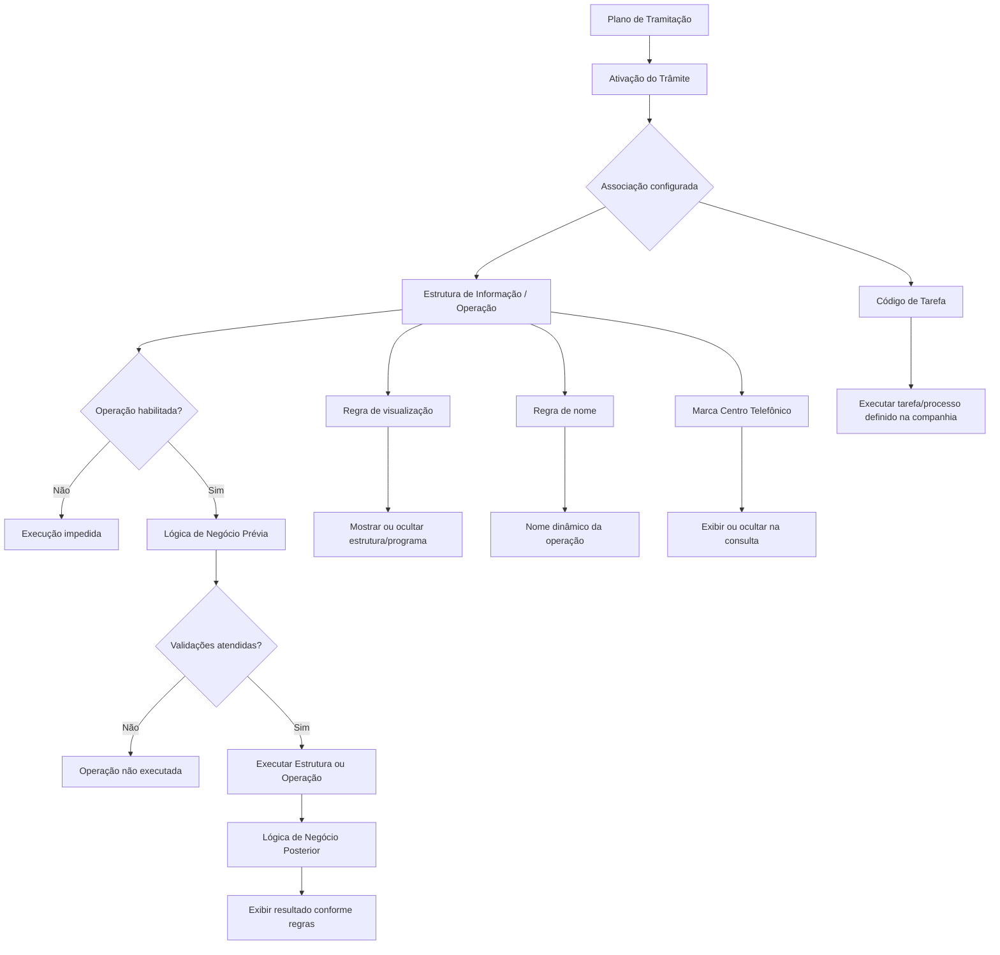

# Definição de Associação de Estruturas e Operações a um Trâmite no Plano de Tramitação

## 1. Metadados do Documento
- **Arquivo de Origem:** `Não informado — conteúdo bruto fornecido pelo usuário`
- **Tipo de Documento:** `Especificação Funcional / Procedimento`
- **Domínio / Sistema:** `Plano de Tramitação; associação de estruturas, operações e tarefas a trâmites; referências a Reef.core`
- **Público-Alvo:** `Analistas funcionais, desenvolvedores, arquitetos, operação e tramitadores`
- **Data/Versão Identificada:** `Não identificada`

---

## 2. Resumo Executivo & Contexto de Negócio

O documento descreve a configuração que associa estruturas de informação, operações e tarefas a um **trâmite** dentro de um **Plano de Tramitação**. O objetivo é determinar, para cada trâmite que necessite dessa configuração, quais informações poderão ser solicitadas e quais operações poderão ser executadas quando o trâmite for ativado ou quando o programa associado for executado.

A associação permite que um mesmo trâmite apresente uma ou mais operações em uma ordem controlada. Entre os exemplos citados estão confirmação de perda total, modificação de dados do expediente, modificação da avaliação, solicitação e registro de documentação do expediente e geração de liquidação ou ordem de pagamento.

O modelo funcional contempla controles antes e depois da execução de cada operação. A lógica anterior permite validar pré-condições; por exemplo, a liquidação de um expediente não pode ser realizada antes de uma mudança de avaliação. A lógica posterior permite disparar verificações ou ações após a operação, como gerar um aviso ao tramitador quando uma liquidação corresponder a reembolso ao segurado.

Também existem mecanismos de governança de apresentação e disponibilidade. Uma estrutura ou operação pode ser ocultada na consulta do Centro Telefônico, ter seu nome exibido dinamicamente por lógica de negócio, ser mostrada ou não conforme condições de execução, e ser inabilitada para impedir sua execução.

O documento indica que estruturas podem ser reutilizadas em vários trâmites e que tarefas previamente definidas no nível da companhia podem ser associadas aos trâmites. Essas tarefas podem incluir movimentos batch, movimentos automáticos, abertura de expediente de recobro em casos de perda total e alteração automática da avaliação com base no resultado da perícia.

---

## 3. Arquitetura, Componentes & Tecnologias Envolvidas

### Componentes funcionais identificados

| Componente | Papel descrito |
| :--- | :--- |
| Plano de Tramitação | Contexto no qual um trâmite é ativado e no qual estruturas, operações ou tarefas associadas podem ser executadas. |
| Trâmite | Entidade identificada por uma chave, existente no nível da companhia, à qual estruturas, operações ou tarefas são associadas. |
| Estrutura de Informação | Estrutura previamente cadastrada e associada ao agrupamento de estruturas que pode ser associado a um trâmite. Pode solicitar informações ou funcionar como consulta de atributos. |
| Operação | Ação que pode ser executada ao ativar um trâmite ou executar o programa associado. |
| Programa Associado | Programa relacionado à execução de estruturas ou operações no Plano de Tramitação. O documento menciona alteração de sua descrição por lógica de negócio. |
| Agrupamento de Estruturas | Agrupamento ao qual a estrutura deve estar associada para poder ser vinculada a um trâmite do Plano de Tramitação. |
| Lógica de Negócio Prévia | Lógica executada antes da operação para controles, validações ou verificações. |
| Lógica de Negócio Posterior | Lógica executada após a operação para controles, verificações ou ações posteriores. |
| Lógica de Nome da Operação | Lógica que altera a descrição exibida da operação no Plano de Tramitação. |
| Código de Tarefa | Código de tarefa ou processo previamente definido no nível da companhia; pode ser executado quando o trâmite é ativado. |
| Consulta do Centro Telefônico | Consulta específica que usa uma marca para determinar se a estrutura ou operação associada será exibida. |
| Consulta de Atributos | Tipo de consulta que o Plano de Tramitação precisa identificar para a estrutura ou operação executável. |
| Reef.core | Sistema citado como contexto para instalações que possuem estruturas diferentes por sistema. O documento apresenta a expressão “Reef.core e Reef.core”, sem diferenciar versões ou instâncias. |



> **Nota de Análise:** O documento não detalha métodos HTTP, contratos JSON, bancos de dados, tecnologias de implementação, URLs, servidores, integrações técnicas ou interfaces de programação.

---

## 4. Regras de Negócio, Especificações Funcionais & Processos

### 4.1 Finalidade da associação

Para cada trâmite que necessite de configuração, a associação define:

1. A informação que será solicitada quando o trâmite for ativado no Plano de Tramitação.
2. A operação ou as operações que poderão ser executadas quando o trâmite for ativado.
3. A operação ou as operações que poderão ser executadas quando o programa associado for executado.
4. A ordem de apresentação das operações quando houver mais de uma operação associada.
5. Lógicas de negócio anteriores e posteriores à execução.
6. Regras de apresentação, visibilidade, nomenclatura e habilitação.
7. A eventual execução de uma tarefa previamente definida na companhia.

### 4.2 Regras de cadastro e associação

- A propriedade **Trâmite** deve conter a chave do trâmite ao qual a estrutura, operação ou tarefa será associada.
- A chave do trâmite deve existir no nível da companhia.
- A propriedade **Estrutura/Operação** deve conter a chave da operação a ser executada quando o trâmite for ativado ou quando o programa associado for executado.
- A estrutura de informação ou operação deve estar previamente cadastrada como uma estrutura.
- A estrutura deve estar associada ao agrupamento de estruturas que pode ser vinculado a um trâmite do Plano de Tramitação.
- Uma estrutura ou código de programa pode ser associado a vários trâmites.
- Uma tarefa associada por **Código de Tarefa** deve estar previamente definida no nível da companhia.

### 4.3 Ordem das operações dentro do trâmite

- A propriedade **Ordem da Estrutura/Operação dentro do Trâmite** determina a sequência em que as operações serão mostradas.
- A ordenação se aplica quando houver mais de uma operação definida para o mesmo trâmite.
- A ordenação também se aplica quando os programas associados forem executados.

Exemplo apresentado:

| Trâmite | Operação | Ordem |
| :--- | :--- | :--- |
| L002 Liquidaciones | Cambio de Valoración | 1 |
| L002 Liquidaciones | Liquidación de Expediente | 2 |

### 4.4 Lógica de negócio prévia à execução

A lógica de negócio prévia pode executar controles ou verificações antes da execução da operação associada ao trâmite.

Regras de execução:

1. A lógica prévia é executada toda vez que a operação é executada.
2. Quando o trâmite estiver pendente e for escolhida a opção de executar novamente a estrutura ou o programa, a lógica prévia será executada novamente.
3. Cada operação associada pode possuir validações ou verificações distintas.
4. A validação deve ser repetida em cada execução da operação correspondente.

Exemplo de pré-condição:

1. O trâmite possui as operações **Cambio de Valoración** e **Liquidación de Expediente**.
2. A liquidação não pode ser realizada se a avaliação não tiver sido alterada anteriormente.
3. Ao tentar executar a liquidação, o sistema deve verificar a existência de uma mudança de avaliação.

### 4.5 Lógica de negócio posterior à execução

A lógica de negócio posterior permite executar controles ou verificações após a execução da operação associada ao trâmite.

Regras de execução:

1. A lógica posterior é disparada sempre que a operação for executada.
2. A lógica posterior pode produzir comportamentos distintos conforme o resultado ou o tipo da operação realizada.

Exemplo apresentado:

1. Após uma liquidação, pode ser gerado automaticamente um aviso ao tramitador.
2. O aviso é gerado somente se a liquidação for um reembolso ao segurado.
3. A finalidade do aviso é revisar se o segurado assinou o finiquito.

### 4.6 Visibilidade na Consulta do Centro Telefônico

A propriedade de visibilidade na Consulta do Centro Telefônico contém uma marca que informa à consulta específica se a estrutura de informação ou operação associada ao trâmite deve ser exibida.

Regra de confidencialidade apresentada:

- Uma estrutura de informação que coleta dados de fraude pode ser configurada para não aparecer na consulta.
- O objetivo é impedir que o segurado seja informado por engano de que está sendo avaliada uma possível fraude.

### 4.7 Lógica para exibição do nome da operação

A lógica para mostrar o nome da operação permite alterar a denominação exibida no Plano de Tramitação, proporcionando maior clareza contextual.

Casos apresentados:

- Uma mesma operação de confirmação do tramitador pode ser associada a vários trâmites.
- Uma lógica de negócio de núcleo pode ser associada a cada trâmite que usa a mesma estrutura.
- A descrição do programa pode variar conforme o trâmite ao qual a estrutura está associada.
- A operação **Liquidación de Expedientes** pode receber nomes específicos conforme o destinatário da liquidação, como:
  - **Liquidación al Asegurado**
  - **Liquidación al Taller**

### 4.8 Código de Tarefa

A propriedade **Código de Tarefa** pode conter um código de tarefa ou processo.

Quando um trâmite é ativado, podem ocorrer dois modelos de execução:

1. Execução de uma operação, indicada no atributo **Estrutura/Operação**.
2. Execução de uma tarefa, indicada por **Código de Tarefa**.

Exemplos de tarefas mencionadas:

- Movimentos batch.
- Movimentos automáticos.
- Abertura de expediente de recobro em caso de perda total.
- Tarefa que altera automaticamente a avaliação com o resultado da perícia.

### 4.9 Lógica para visualizar ou não a estrutura

A lógica de visualização determina se uma estrutura será exibida conforme as condições necessárias.

Caso de uso apresentado:

- Em instalações que convivem com “Reef.core e Reef.core”, existem estruturas diferentes para um sistema ou outro.
- Conforme o sistema no qual o Plano de Tramitação está sendo executado, a estrutura ou programa pode ser mostrado ou ocultado.

> **Nota de Análise:** O texto original repete “Reef.core e Reef.core” e não especifica quais versões, ambientes ou variantes de sistema devem ser diferenciados.

### 4.10 Consulta de atributos

O Plano de Tramitação precisa identificar se a estrutura ou operação que pode ser executada corresponde a uma **consulta de atributos**.

O documento não detalha critérios técnicos, campos, comportamento de tela ou regras adicionais para a consulta de atributos.

### 4.11 Habilitação da operação

- A propriedade **Inhabilitado** informa se a operação associada ao trâmite está habilitada.
- Se a operação não estiver habilitada, ela não poderá ser executada.

---

## 5. Tabelas de Parâmetros, Ambientes e Estruturas de Dados

### 5.1 Propriedades da associação

| Item / Parâmetro | Descrição / Função | Tipo / Valores / Formato | Ambiente / Observações |
| :--- | :--- | :--- | :--- |
| Trâmite | Contém a chave do trâmite ao qual será associada uma estrutura, operação ou tarefa. | Chave de trâmite. | A chave deve existir no nível da companhia. |
| Estrutura/Operação | Contém a chave da operação que será executada ao ativar o trâmite ou executar o programa associado. | Chave de estrutura ou operação. | A estrutura deve estar cadastrada e associada ao agrupamento permitido para trâmites. |
| Ordem da Estrutura/Operação dentro do Trâmite | Define a sequência de exibição e execução das operações associadas. | Ordem numérica. | Aplicável quando há várias operações ou programas associados. |
| Lógica de Negócio Prévia | Executa controles e verificações antes da operação. | Lógica de negócio. | Executada em toda execução da operação e em reexecuções de estrutura ou programa pendentes. |
| Lógica de Negócio Posterior | Executa controles ou verificações depois da operação. | Lógica de negócio. | Executada em toda execução da operação. |
| Se mostra na Consulta do Centro Telefônico | Determina se a estrutura ou operação aparece na consulta específica do Centro Telefônico. | Marca de exibição. | Pode ocultar dados sensíveis, como estruturas relativas a fraude. |
| Lógica para mostrar o nome da operação | Altera o nome exibido da operação ou programa conforme o contexto do trâmite. | Lógica de negócio. | Permite descrições diferentes para a mesma operação associada a trâmites distintos. |
| Código de Tarefa | Indica uma tarefa ou processo a executar na ativação do trâmite. | Código de tarefa ou processo. | A tarefa deve estar definida previamente no nível da companhia. |
| Lógica para visualizar ou não a estrutura | Controla a apresentação da estrutura ou programa com base em condições. | Lógica de negócio. | Usada para diferenciar estruturas disponíveis por sistema. |
| Consulta de Atributos | Indica se a estrutura ou operação executável é uma consulta de atributos. | Indicador ou propriedade não detalhada. | O Plano de Tramitação necessita dessa informação. |
| Inhabilitado | Informa se a operação associada ao trâmite pode ser executada. | Estado habilitado ou inabilitado. | Uma operação inabilitada não pode ser executada. |

### 5.2 Operações e exemplos mencionados

| Item / Parâmetro | Descrição / Função | Tipo / Valores / Formato | Ambiente / Observações |
| :--- | :--- | :--- | :--- |
| Confirmación de Pérdida Total | Exemplo de operação ou informação solicitada por um trâmite. | Operação. | Sem detalhamento adicional. |
| Modificar Datos del Expediente | Exemplo de operação disponível por meio de um trâmite. | Operação. | Sem detalhamento adicional. |
| Modificar la Valoración / Cambio de Valoración | Operação de alteração de avaliação. | Operação. | Pode ser pré-requisito para liquidação. |
| Solicitar y Registrar la Documentación del Expediente | Exemplo de operação relacionada à documentação do expediente. | Operação. | Sem detalhamento adicional. |
| Generar una liquidación | Geração de liquidação ou ordem de pagamento. | Operação. | Pode exigir mudança prévia de avaliação. |
| Liquidación de Expediente | Operação de liquidação de expediente. | Operação. | Exemplo apresentado com ordem 2 no trâmite L002 Liquidaciones. |
| Aperturar un expediente de recobro | Exemplo de movimento automático por tarefa. | Tarefa. | Aplicável no caso de perda total. |
| Cambio automático de valoración | Alteração automática da avaliação com resultado da perícia. | Tarefa. | O documento não detalha critérios ou integração com perícia. |

### 5.3 Ambientes, sistemas e dados técnicos identificados

| Item / Parâmetro | Descrição / Função | Tipo / Valores / Formato | Ambiente / Observações |
| :--- | :--- | :--- | :--- |
| Nível da companhia | Escopo onde a chave do trâmite e a tarefa devem existir previamente. | Escopo organizacional. | Não há detalhes sobre cadastro ou administração. |
| Centro Telefônico | Contexto de consulta com regra específica de exibição. | Canal de consulta. | Pode ocultar estruturas ou operações sensíveis. |
| Reef.core | Sistema citado em um caso de uso de estruturas distintas por sistema. | Sistema. | O texto não esclarece versões, instâncias ou integração técnica. |
| Batch | Tipo de movimento citado como exemplo de tarefa. | Processo. | Sem agendamento, tecnologia ou parâmetros especificados. |

---

## 6. Bateria de Perguntas & Respostas para RAG (FAQ Sintético)

### P1: Qual é a finalidade de associar estruturas ou operações a um trâmite no Plano de Tramitação?
**R:** A associação define quais informações poderão ser solicitadas e quais operações poderão ser executadas quando um trâmite for ativado no Plano de Tramitação ou quando o programa associado for executado. A configuração também pode definir ordem, validações, visibilidade, nomenclatura e habilitação das operações.

### P2: Quais condições devem ser atendidas para associar uma estrutura ou operação a um trâmite?
**R:** A chave do trâmite deve existir no nível da companhia. A estrutura ou operação deve estar previamente cadastrada como estrutura e deve estar associada ao agrupamento de estruturas que pode ser associado a um trâmite do Plano de Tramitação.

### P3: Uma mesma estrutura ou código de programa pode ser associado a vários trâmites?
**R:** Sim. O documento informa que estruturas podem ser associadas a vários trâmites. Também apresenta cenários nos quais a mesma operação ou programa é reutilizado em diversos trâmites, com possibilidade de alterar a descrição exibida conforme o contexto.

### P4: Como é controlada a ordem de exibição das operações associadas a um trâmite?
**R:** A propriedade **Ordem da Estrutura/Operação dentro do Trâmite** define a ordem em que as operações serão apresentadas quando houver mais de uma operação associada ou quando programas associados forem executados. No exemplo, o trâmite L002 Liquidaciones apresenta Cambio de Valoración na ordem 1 e Liquidación de Expediente na ordem 2.

### P5: Quando a lógica de negócio prévia é executada?
**R:** A lógica de negócio prévia é executada antes de cada execução da operação associada ao trâmite. Se o trâmite estiver pendente e o usuário escolher executar novamente a estrutura ou o programa, a lógica prévia também será executada novamente.

### P6: Qual regra impede a execução de uma liquidação no exemplo do documento?
**R:** A liquidação não pode ser realizada se uma mudança de avaliação não tiver sido executada anteriormente. Ao tentar realizar a liquidação, deve ser verificado se houve um Cambio de Valoración.

### P7: Para que serve a lógica de negócio posterior à execução?
**R:** A lógica posterior permite realizar controles ou verificações após a execução da operação. No exemplo apresentado, após uma liquidação pode ser gerado automaticamente um aviso ao tramitador, mas somente quando a liquidação for um reembolso ao segurado, para verificar se o finiquito foi assinado.

### P8: Como ocultar uma estrutura relacionada a fraude na consulta do Centro Telefônico?
**R:** Deve ser usada a propriedade que informa à consulta específica do Centro Telefônico se a estrutura ou operação associada ao trâmite deve ser exibida. O documento apresenta explicitamente o caso de ocultar uma estrutura de dados de fraude para evitar que o segurado seja informado por engano de que existe uma possível avaliação de fraude.

### P9: É possível alterar o nome exibido de uma operação reutilizada em diferentes trâmites?
**R:** Sim. A propriedade de lógica para mostrar o nome da operação permite modificar a descrição exibida no Plano de Tramitação. Por exemplo, a operação Liquidación de Expedientes pode aparecer como Liquidación al Asegurado ou Liquidación al Taller, conforme o destinatário da liquidação.

### P10: O que pode ser executado por meio do Código de Tarefa?
**R:** O Código de Tarefa pode executar uma tarefa ou processo previamente definido no nível da companhia. Os exemplos incluem movimentos batch, movimentos automáticos, abertura de expediente de recobro em caso de perda total e mudança automática da avaliação usando o resultado da perícia.

### P11: Como uma estrutura ou programa pode ser exibido somente em determinado sistema?
**R:** Deve ser utilizada a lógica para visualizar ou não a estrutura. Essa lógica permite definir condições para mostrar ou ocultar uma estrutura ou programa conforme o sistema onde o Plano de Tramitação está sendo executado.

### P12: O que acontece quando uma operação associada ao trâmite está inabilitada?
**R:** Uma operação marcada como inabilitada não pode ser executada. A propriedade Inhabilitado indica se a operação associada ao trâmite está habilitada ou não.

---

## 7. Glossário de Termos, Siglas & Conceitos-Chave

- **Agrupamento de Estruturas:** Agrupamento ao qual uma estrutura deve estar associada para poder ser vinculada a um trâmite do Plano de Tramitação.
- **Centro Telefônico:** Contexto de consulta específico que pode exibir ou ocultar estruturas e operações associadas a trâmites.
- **Código de Tarefa:** Código que identifica uma tarefa ou processo previamente definido no nível da companhia.
- **Consulta de Atributos:** Tipo de consulta que o Plano de Tramitação precisa identificar para a estrutura ou operação executável.
- **Estrutura de Informação:** Estrutura cadastrada que pode solicitar ou apresentar informações no contexto de um trâmite.
- **Expediente:** Termo utilizado no documento como objeto de operações, documentação, liquidação, recobro e avaliação; não há definição adicional.
- **Finiquito:** Documento ou confirmação cuja assinatura pode ser revisada após uma liquidação de reembolso ao segurado.
- **Lógica de Negócio Prévia:** Lógica executada antes da operação para realizar controles, validações ou verificações.
- **Lógica de Negócio Posterior:** Lógica executada depois da operação para realizar controles, verificações ou ações subsequentes.
- **Operação:** Ação associada a um trâmite e executável no Plano de Tramitação.
- **Plano de Tramitação:** Contexto funcional onde trâmites são ativados e onde estruturas, operações ou tarefas são executadas.
- **Reef.core:** Sistema citado em um cenário de coexistência de estruturas distintas por sistema; sem expansão ou detalhes técnicos no documento.
- **Recobro:** Tipo de expediente que pode ser aberto automaticamente em caso de perda total.
- **Trâmite:** Entidade identificada por uma chave, usada para associar estruturas, operações e tarefas no Plano de Tramitação.
- **Tramitador:** Papel que pode receber avisos automáticos ou realizar confirmações no processo de tramitação.

---

## 8. Notas Críticas, Riscos & Limitações

- O documento não informa nome de arquivo, autor, versão, data, proprietário funcional ou histórico de mudanças.
- Não são detalhados modelos de dados, persistência, APIs, protocolos, autenticação, perfis de acesso, auditoria ou tratamento de erros.
- Não são fornecidos critérios técnicos para determinar quando a lógica de visualização deve mostrar ou ocultar uma estrutura.
- Não há especificação da estrutura, dos campos ou do comportamento funcional da **Consulta de Atributos**.
- O texto cita “Reef.core e Reef.core” como sistemas em coexistência, mas não diferencia versões, ambientes ou produtos; essa ambiguidade deve ser esclarecida antes de uma implementação.
- A configuração de visibilidade no Centro Telefônico é um controle relevante para evitar exposição indevida de informações de fraude ao segurado.
- A regra de pré-validação para liquidação depende da confirmação de mudança de avaliação; o documento não define como essa confirmação é persistida ou verificada tecnicamente.
- O atributo **Inhabilitado** impede a execução da operação, mas o documento não especifica se a operação permanece visível para o usuário.
- As tarefas podem envolver movimentos batch e automáticos, porém não há informações sobre agendamento, execução assíncrona, reprocessamento, monitoramento ou tratamento de falhas.

---

## 9. Conteúdo Bruto Estruturado (Referência Fiel)

```text
--- [PÁGINA 1 DE 6] ---

DEFINICIÓN ASOCIAR Estructuras -
Operaciones a un Trámite
Objetivo
La finalidad es definir para cada trámite que así lo necesite, la información que va a solicitar o la
operación u operaciones que se van poder ejecutar, cuando se active dicho trámite desde el Plan de
Tramitación.
Ejemplos:
Confirmación de Pérdida Total
Modificar Datos del Expediente
Modificar la Valoración
Solicitar y Registrar la Documentación del Expediente
Generar una liquidación (orden de pago)
Etc.
Imagen de la Asociación de Estructuras/Operaciones a un Trámite:
 / 
 CF
Home Solutions APIs Documentation Zeus
EN


--- [PÁGINA 2 DE 6] ---

Propiedades
Trámite
Esta propiedad contendrá la clave del trámite al cual se le va a asociar la estructura u operación que
se va a poder ejecutar cuando se active el trámite o se ejecute el programa asociado.
Esta clave de trámite tiene que existir a nivel de compañía.
Estructura/Operación
Esta propiedad contendrá la clave de la operación que se quiere ejecutar cuando se active el trámite
o se ejecute el programa asociado. Esta estructura de información/operación tiene que estar dada de
alta como una Estructura y asociada a la Agrupación de estructuras que se puede asociar a un
trámite del plan de tramitación.
Orden de la Estructura/Operación dentro del Trámite
Esta propiedad va a contener el orden en el que se va a mostrar las operaciones que se pueden
ejecutar cuando se active el trámite, en el caso de que haya más de una operación definida o cuando
se ejecuten los programas asociados.


--- [PÁGINA 3 DE 6] ---

TRÁMITE OPERACIÓN ORDEN
L002 Liquidaciones 1 Cambio de Valoración 1
2 Liquidación de Expediente 2
Lógica de Negocio Previa a ejecutar la operación
Esta Lógica de negocio tendrá posibilidad de hacer controles o verificaciones antes de ejecutar la
operación asociada al trámite. Esta Lógica, se lanzará cada vez que se ejecute la operación. Cuando
el trámite esté pendiente y se elija la opción de volver a ejecutar la estructura o programa, esta lógica
de negocio se volverá a ejecutar.
Ejemplo:
En el ejemplo anterior en que se han definido dos operaciones asociadas al trámite, el cambio de
valoración y la liquidación, en cada uno de ellos se va a poder ejecutar una validación o
comprobación distinta. Cada vez que se ejecute esa operación se volverá a comprobar. No se puede
realizar una liquidación, si primero no se ha cambiado la valoración. Cuando se vaya a intentar
realizar una liquidación, se comprobará que haya un cambio de valoración.
Lógica de Negocio Posterior a ejecutar la operación
Esta Lógica de negocio tendrá posibilidad de hacer controles o verificaciones después de ejecutar la
operación asociada al trámite. Esta Lógica, se lanzará cada vez que se ejecute la operación.
Ejemplo:
Si después de las liquidaciones se quiere generar automáticamente un aviso al tramitador sólo en el
caso de que la liquidación sea un reembolso al asegurado, para revisar que firmó el finiquito.
Se muestra en la Consulta del Centro Telefónico
Esta propiedad contiene una marca que le indica a la consulta que hay específica para el centro
telefónico, si se muestra o no la estructura de información u operación que se está asociando al
trámite.
Ejemplo:
Si el trámite tiene una estructura de información que recoge datos de fraude, se le puede indicar que
esta no se muestre en la consulta, para que no se informe al asegurado por error, que se está
evaluando un posible fraude.
Lógica para mostrar el nombre de la operación
Esta lógica sirve para poder modificar el nombre de la operación que se ejecuta en el plan de
tramitación, dando una mayor claridad.


--- [PÁGINA 4 DE 6] ---

Ejemplos
En el plan de tramitación se ha asociado una operación de confirmación del tramitador a varios
trámites distintos. Se quiere que el tramitador revise y confirme diferentes puntos de la tramitación. Si
el nombre del programa no se modificara cuando se ejecute dicho trámite esto es lo que se vería:
En este caso en esta propiedad se ha puesto una lógica de negocio de núcleo, a cada trámite que
tiene asociado esta estructura. Según al trámite al que esté asociado, la descripción del programa
será distinta.
Otro ejemplo sería si se asocia la operación de liquidación de expedientes a varios trámites, para
mayor claridad se puede modificar el texto para que en vez de aparecer "Liquidación de
Expedientes", aparezca a quien se le realiza la Liquidación, ejemplo "Liquidación al Asegurado"
(cuando se liquide al Asegurado), "Liquidación al Taller" (cuando se liquide al Taller), etc.


--- [PÁGINA 5 DE 6] ---

Código de Tarea
Esta propiedad puede contener un código de tarea, proceso . Cuando se activa un trámite se puede
ejecutar una operación (que se ubicará en el atributo estructura u operación) o se puede ejecutar una
tarea. Estas tareas pueden ser movimientos Batch, movimientos automáticos como por ejemplo
aperturar un expediente de recobro, en el caso de ser una pérdida total, una tarea que cambie la
valoración automáticamente con el resultado de la peritación etc. La tarea tiene que estar definida
previamente a nivel de compañía tarea
Lógica para visualizar o No la Estructura
Esta lógica de negocio se utiliza para visualizar o no una estructura dependiendo de las condiciones
que se necesiten.
Ejemplo:
Esto se ha utilizado en instalaciones que conviven Reef.core y Reef.core y tienen diferentes
estructuras para un sistema u otro, según donde se esté ejecutando el plan muestra o no la
estructura o programa.
Consulta de Atributos
El plan de tramitación necesita saber si la estructura u operación que se puede ejecutar, es una
consulta de atributos.
Inhabilitado
Esta propiedad indica si la operación que está asociado al Trámite está habilitado o no. Si no está
habilitada no se podrá ejecutar.
Preguntas frecuentes
¿Un Código de Programa, de Estructura pueden ser asociado a varios Trámites?
Si, las Estructuras pueden ser asociados a varios trámites.
¿Se puede cambiar la descripción de la operación que se grabe al activar la Estructura o
cuando se ejecuten los programas asociados?
Si, para ello se tiene la Lógica Negocio descripción de la Estructura
¿Se puede ejecutar un listado, una tarea ya definida? Si para ello se tiene el atributo Código de
Tarea
¿Si tengo diferentes programas enReef.core que en Reef.core qué puedo hacer para que en
cada Sistema sólo me salgan las que tengo definidas para ese sistema.? Para poder solucionar
esto, se tiene un atributo para indicarle al plan de tramitación si se muestra o no se muestra el
programa, se muestra la estructura


--- [PÁGINA 6 DE 6] ---

[Página em branco ou apenas elementos visuais/imagem]
```
