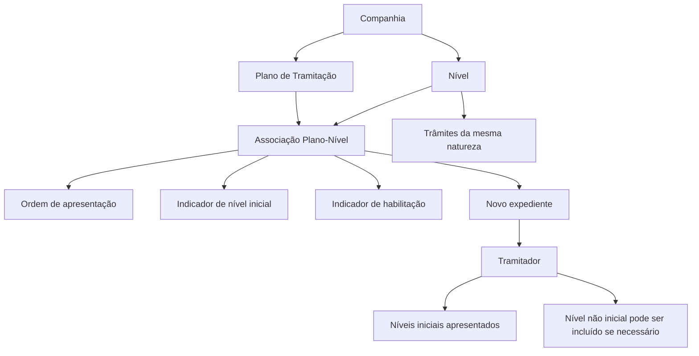

# Associação de Níveis a Planos de Tramitação — Definição Funcional

## 1. Metadados do Documento
- **Arquivo de Origem:** `Não identificado`
- **Tipo de Documento:** `Especificação Técnica`
- **Domínio / Sistema:** `Planos de Tramitação / Gestão de Expedientes`
- **Público-Alvo:** `Analistas funcionais, desenvolvedores, tramitadores e operação`
- **Data/Versão Identificada:** `Não identificada`

---

## 2. Resumo Executivo & Contexto de Negócio

O documento define como associar níveis a um Plano de Tramitação. Um nível representa uma agrupação de trâmites da mesma natureza, como documentação, peritagem ou juízos. A associação permite que os níveis fiquem disponíveis dentro de um plano aplicável a expedientes.

Associar um nível a um Plano de Tramitação não torna a execução daquele nível obrigatória. A associação apenas disponibiliza a possibilidade de ativação do nível quando necessário durante o tratamento de um expediente.

O exemplo central aborda o plano `PL002 - Plan Cristales Autos`, destinado a expedientes de danos próprios relacionados a cristais automotivos, incluindo luna, cristal delantero e parabrisas. Nesse cenário, o nível de peritagem pode existir no plano, mas não ser inicial, pois normalmente existem locais conveniados para reparação e a companhia tende a pagar diretamente ao fornecedor.

A configuração da associação exige que tanto o código do Plano de Tramitação quanto o código do Nível existam previamente em nível de companhia. Para cada nível associado, devem ser definidos o seu ordenamento de apresentação, sua condição de nível inicial e sua condição de habilitação.

---

## 3. Arquitetura, Componentes & Tecnologias Envolvidas

O documento descreve uma configuração funcional composta por Planos de Tramitação, Níveis e Expedientes. Não especifica tecnologias, APIs, métodos HTTP, contratos JSON, bancos de dados, ambientes ou integrações técnicas.

### Componentes funcionais identificados

| Componente | Função no processo |
| :--- | :--- |
| Plano de Tramitação | Define a estrutura de tratamento aplicável a um tipo de expediente. |
| Nível | Agrupação de trâmites de mesma natureza, associada a um Plano de Tramitação. |
| Trâmite | Atividade pertencente a um nível; o documento não detalha tipos ou contratos de trâmite. |
| Expediente | Caso tratado pelo tramitador conforme o Plano de Tramitação. |
| Tramitador | Usuário que visualiza os níveis do plano e pode incluir níveis não iniciais quando necessário. |
| Companhia | Escopo no qual os códigos de Plano de Tramitação e de Nível devem existir. |
| Fornecedor | Entidade que pode receber pagamento direto da companhia no processo de reparação de cristais. |
| Perito | Participante que pode realizar uma peritagem quando o caso exigir. |



> **Nota de Análise:** O documento menciona que um nível pode possuir mais ou menos trâmites conforme o plano, mas não detalha como esses trâmites são configurados, ativados ou persistidos.

---

## 4. Regras de Negócio, Especificações Funcionais & Processos

### 4.1 Definição de nível

1. Um nível é uma agrupação de trâmites de mesma natureza.
2. Exemplos de níveis apresentados:
   - Nível de Documentação.
   - Nível de Peritação.
   - Nível de Juízos.
3. Um nível pode ser associado a um Plano de Tramitação.
4. A associação de um nível a um plano não implica que o nível seja obrigatoriamente executado.
5. Um nível associado pode ser ativado somente quando necessário para o expediente.

### 4.2 Pré-requisitos da associação

1. A chave do Plano de Tramitação deve existir em nível de companhia.
2. O código ou chave do Nível deve existir em nível de companhia.
3. A associação deve registrar o plano, o nível, a ordem dentro do plano, a condição de nível inicial e a condição de habilitação.

### 4.3 Ordem de apresentação

1. Cada nível associado recebe uma ordem dentro do Plano de Tramitação.
2. A ordem define a posição em que o nível será apresentado ao tramitador dentro do plano.
3. O exemplo do plano `PL002` apresenta cinco níveis em ordem sequencial de `1` a `5`.

### 4.4 Regra de nível inicial

1. Níveis iniciais são aqueles normalmente necessários para tramitar determinado tipo de expediente.
2. Um nível utilizado raramente ou de forma excepcional não deve aparecer inicialmente.
3. Mesmo quando um nível não é inicial, o tramitador pode incluí-lo no plano do expediente quando necessário.
4. No exemplo de cristais automotivos:
   - O nível de peritagem não é inicial.
   - O nível de reembolso ao segurado não é inicial.
   - A justificativa para a não inicialização da peritagem é a existência de lugares conveniados para reparação e o pagamento direto usual ao fornecedor.

### 4.5 Regra de habilitação

1. A propriedade **Inhabilitado** indica se o código do nível associado ao Plano de Tramitação está habilitado.
2. Quando o nível está habilitado, ele é incluído em novos expedientes abertos.
3. Quando o nível não está habilitado, ele não é incluído em novos expedientes abertos.

### 4.6 Reutilização de níveis

1. Um nível pode ser associado a vários Planos de Tramitação.
2. O nível dentro de cada plano pode possuir características próprias.
3. O nível pode possuir mais ou menos trâmites conforme o plano.

---

## 5. Tabelas de Parâmetros, Ambientes e Estruturas de Dados

### 5.1 Propriedades da associação Plano-Nível

| Item / Parâmetro | Descrição / Função | Tipo / Valores / Formato | Ambiente / Observações |
| :--- | :--- | :--- | :--- |
| Plano de Tramitação | Chave do plano ao qual os níveis serão associados. | Código/chave de Plano de Tramitação. | Deve existir em nível de companhia. Exemplo: `PL002 - Plan Cristales Autos`. |
| Nível | Chave ou código do nível associado ao plano. | Código/chave de Nível. | Deve existir em nível de companhia. Exemplos: `N01`, `N02`. |
| Ordem do Nível dentro do Plano | Define a posição de apresentação do nível para o tramitador. | Valor numérico sequencial. | Exemplo: `1` a `5` no plano `PL002`. |
| É um Nível Inicial? | Define se o nível deve aparecer inicialmente para o tipo de expediente. | `S` ou `N`. | Níveis não iniciais podem ser incluídos pelo tramitador quando necessários. |
| Inhabilitado | Indica se o nível associado está habilitado. | Estado de habilitação; valores literais não detalhados. | Nível habilitado é incluído em novos expedientes; nível não habilitado não é incluído. |

### 5.2 Códigos de nível citados

| Item / Parâmetro | Descrição / Função | Tipo / Valores / Formato | Ambiente / Observações |
| :--- | :--- | :--- | :--- |
| `N01` | Verificação de informação da apólice. | Código de nível. | Exemplo de nível associado ao plano. |
| `N02` | Revisão e solicitação de documentação. | Código de nível. | Exemplo de nível associado ao plano. |
| `N03` | Peritagem. | Código de nível. | Não é inicial no exemplo de cristais automotivos. |
| `N04` | Pagamento ao fornecedor. | Código de nível. | É inicial no exemplo de cristais automotivos. |
| `N05` | Reembolso ao segurado. | Código de nível. | Não é inicial no exemplo de cristais automotivos. |

### 5.3 Exemplo de ordenação do plano `PL002`

| Plano | Nível | Descrição do nível | Ordem de Aparição | Inicial |
| :--- | :--- | :--- | :--- | :--- |
| `PL002` — Plan Cristales Autos | `N01` | Nível de Verificação | `1` | `S` |
| `PL002` | `N02` | Nível de Documentação | `2` | `S` |
| `PL002` | `N03` | Nível de Peritação | `3` | `N` |
| `PL002` | `N04` | Nível Pago a Proveedor | `4` | `S` |
| `PL002` | `N05` | Nível Reembolso Asegurado | `5` | `N` |

---

## 6. Bateria de Perguntas & Respostas para RAG (FAQ Sintético)

### P1: O que representa um nível em um Plano de Tramitação?
**R:** Um nível representa uma agrupação de trâmites de mesma natureza dentro de um Plano de Tramitação. O documento apresenta como exemplos os níveis de documentação, peritagem e juízos.

### P2: Associar um nível a um Plano de Tramitação torna o nível obrigatório?
**R:** Não. Associar um nível ao Plano de Tramitação apenas torna o nível disponível para execução quando necessário. A associação não exige que o nível seja executado em todos os expedientes tratados pelo plano.

### P3: Quais são os pré-requisitos para associar um nível a um plano?
**R:** A chave do Plano de Tramitação deve existir em nível de companhia, e o código ou chave do Nível também deve existir em nível de companhia.

### P4: Para que serve a ordem do nível dentro do plano?
**R:** A ordem do nível define a posição em que o nível será apresentado ao tramitador enquanto ele estiver dentro do Plano de Tramitação. No exemplo do plano `PL002`, os níveis são apresentados nas posições de `1` a `5`.

### P5: O que significa um nível inicial?
**R:** Um nível inicial é aquele normalmente necessário para tramitar um tipo de expediente. Níveis usados em poucas ocasiões ou em situações excepcionais devem ser configurados para não aparecer inicialmente.

### P6: Um tramitador pode incluir um nível que não é inicial?
**R:** Sim. Quando um nível não aparece inicialmente, o tramitador ainda pode incluí-lo no plano do expediente se a situação exigir sua utilização.

### P7: Por que o nível de peritagem não é inicial no plano de cristais automotivos?
**R:** No exemplo apresentado, a peritagem normalmente não é necessária porque existem lugares conveniados para reparar cristais, parabrisas ou lunas, e o pagamento direto ao fornecedor é o fluxo usual. Contudo, o nível de peritagem permanece disponível para casos que exijam sua ativação.

### P8: O que ocorre quando um nível associado está habilitado?
**R:** Quando o código de nível associado ao Plano de Tramitação está habilitado, o nível é incluído nos novos expedientes que forem abertos.

### P9: O que ocorre quando um nível associado não está habilitado?
**R:** Quando o nível associado não está habilitado, ele não é incluído nos novos expedientes abertos.

### P10: Um mesmo nível pode pertencer a vários Planos de Tramitação?
**R:** Sim. Um nível pode ser associado a vários Planos de Tramitação. Além disso, o nível pode ter características próprias dentro de cada plano e pode conter mais ou menos trâmites conforme o plano.

### P11: Quais níveis são iniciais no exemplo do plano PL002 — Plan Cristales Autos?
**R:** No exemplo, `N01 — Nível de Verificação`, `N02 — Nível de Documentação` e `N04 — Nível Pago a Proveedor` são iniciais. `N03 — Nível de Peritação` e `N05 — Nível Reembolso Asegurado` não são iniciais.

---

## 7. Glossário de Termos, Siglas & Conceitos-Chave

- **Plano de Tramitação:** Estrutura que define os níveis disponíveis para o tratamento de um tipo de expediente.
- **Nível:** Agrupação de trâmites de mesma natureza.
- **Trâmite:** Atividade pertencente a um nível; o documento não especifica os tipos de trâmite.
- **Expediente:** Caso tratado de acordo com um Plano de Tramitação.
- **Tramitador:** Usuário que atua no expediente e pode visualizar ou incluir níveis no plano do expediente.
- **Peritação:** Processo associado à atuação de um perito para avaliação de um caso.
- **Perito:** Profissional que pode realizar uma peritagem.
- **Nível Inicial:** Nível normalmente necessário para tramitar determinado tipo de expediente.
- **Inhabilitado:** Propriedade que indica se o nível associado está habilitado para inclusão em novos expedientes.
- **PL002:** Código exemplificado para o plano `Plan Cristales Autos`.
- **N01 / N02 / N03 / N04 / N05:** Códigos exemplificados para níveis associados ao plano `PL002`.

---

## 8. Notas Críticas, Riscos & Limitações

- O documento não identifica arquivo de origem, data, versão, autor, sistema proprietário ou ambiente operacional.
- Não há detalhamento sobre interfaces de usuário, APIs, persistência, modelo de dados, integrações, permissões ou auditoria das associações Plano-Nível.
- O documento menciona que um nível pode ter mais ou menos trâmites conforme o plano, mas não descreve regras, estrutura ou mecanismo de configuração desses trâmites.
- Os valores explícitos do campo **Inhabilitado** não são apresentados; apenas seu comportamento funcional é descrito.
- Não são informadas regras para alteração, exclusão, versionamento ou vigência de associações já utilizadas por expedientes existentes.
- Não são detalhados critérios para impedir duplicidade de associação entre um mesmo plano e um mesmo nível.

---

## 9. Conteúdo Bruto Estruturado (Referência Fiel)

```text
--- [PÁGINA 1 DE 4] ---

DEFINICIÓN Asociar Niveles a un Plan de
Tramitación
Objetivo
La finalidad es definir todos los niveles que va a tener un plan de tramitación, entendiendo por
nivel, la agrupación de trámites de la misma naturaleza.
Ejemplo
Nivel de Documentación
Nivel de Peritación
Nivel de Juicios
Etc.
El asociar un nivel a un plan no significa que sea obligatorio realizarlo, sino que van a tener la
posibilidad, si se necesita, de ejecutarlo.
Ejemplo:
Si se define un plan de tramitación para tramitar los expedientes de tipo Daños Propios Cristales
que va a cubrir la rotura de la luna, del cristal delantero del vehículo o el parabrisas. Si a este plan se
le asocia el Nivel de peritaciones y se establece que no es necesario que un perito realice una
peritación, para este tipo de Expediente, pero podría ser que en algún caso se necesitara. En este
caso el nivel de Peritación (que tendría todos los trámites para realizar una peritación), estaría
definido en el plan, pero sólo se activaría si fuese necesario.
Imagen del Asociación de Niveles a Planes de Tramitación a nivel de Compañía:
 / 
 CF
Home Solutions APIs Documentation Zeus
EN


--- [PÁGINA 2 DE 4] ---

Propiedades
Plan de Tramitación
Esta propiedad contendrá la clave del Plan de Tramitación al cual se le va a asociar los distintos
niveles que va a tener. Esta clave tiene que existir a nivel de compañía.
Ejemplo:
Código de Plan Tramitación: PL002 - Plan Cristales Autos
Nivel
Esta propiedad contendrá la clave o el código del nivel que se está asociando al plan. Este código de
Nivel tiene que existir a nivel de compañía.
Ejemplo:
Código de Nivel N01 Verificación Información Póliza
Código de Nivel N02 Revisión y Petición de Documentación
Orden del Nivel dentro del Plan


--- [PÁGINA 3 DE 4] ---

Esta propiedad va a tener el orden que va a ocupar el Nivel dentro del plan. Es decir cuando el
tramitador esté dentro del Plan de Tramitación en que orden le va a aparecer el Nivel.
PLAN NIVEL ORDEN DE
APARICIÓN
PL002 Plan Cristales
Autos
N01 Nivel de Verificación 1
PL002 N02 Nivel de Documentación 2
PL002 N03 Nivel de Peritación 3
PL002 N04 Nivel Pago a Proveedor 4
PL002 N05 Nivel Reembolso
Asegurado
5
¿Es Un Nivel Inicial ?
Se definirán como niveles iniciales aquellos que se van a necesitar normalmente para poder
tramitar ese Tipo de de Expediente.
Si el nivel se va a necesitar en pocas ocasiones o es excepcional, se indicará que NO salga
inicialmente, aunque si el tramitador lo necesita, podrá incluirlo en el plan del expediente.
Ejemplo:
En el plan de tramitación para los expedientes que sean del tipo de "Cristales de automóviles", se
establece que el proceso habitual sea que NO haya peritación ya que se tiene lugares
concertados para reparar los cristales, parabrisas o lunas y lo normal es que la compañía pague
directamente al proveedor. Dada esta casuística el Nivel de Peritación No será inicial y el Nivel de
Reembolso al asegurado tampoco.
PLAN NIVEL ORDEN INICIAL
PL002 Plan Cristales Autos N01 Nivel de Verificación 1 S
PL002 N02 Nivel de Documentación 2 S
PL002 N03 Nivel de Peritación 3 N


--- [PÁGINA 4 DE 4] ---

PLAN NIVEL ORDEN INICIAL
PL002 N04 Nivel Pago a Proveedor 4 S
PL002 N05 Nivel Reembolso Asegurado 5 N
Inhabilitado
Esta propiedad indica si el Código del Nivel que está asociado al Plan Tramitación está habilitado o
no. Si está habilitado se le va a incluir en los nuevos expedientes que se abran, si no está habilitado
no.
Preguntas frecuentes
¿Un Nivel puede ser asociado a varios Planes?
Si, el nivel dentro del plan puede tener sus propias características y puede tener más o menos
trámites.
```
