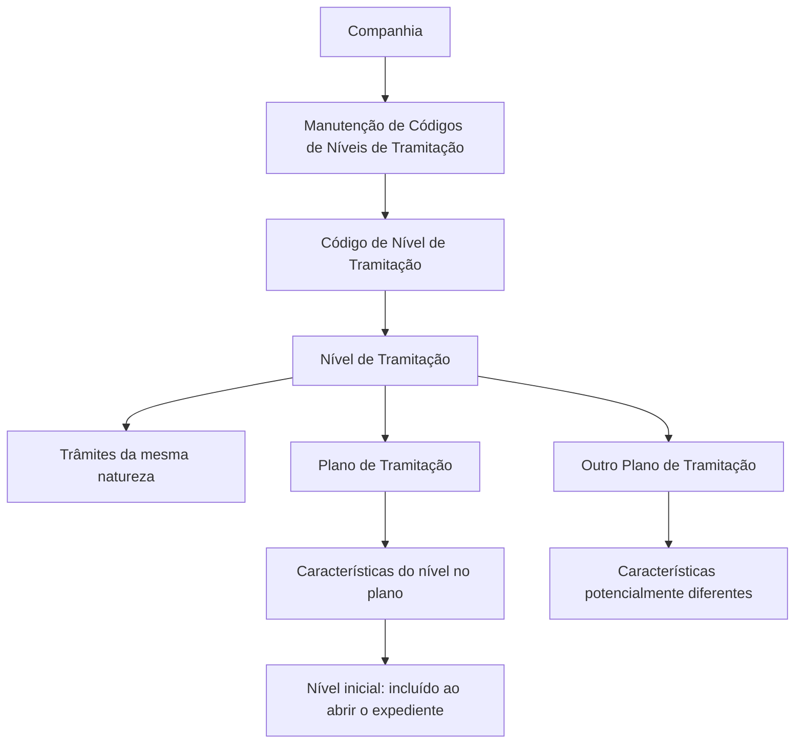

# Definição de Códigos de Níveis de Tramitação por Companhia

## 1. Metadados do Documento
- **Arquivo de Origem:** Não identificado no conteúdo fornecido
- **Tipo de Documento:** Procedimento
- **Domínio / Sistema:** Planos de Tramitação e Códigos de Níveis de Tramitação
- **Público-Alvo:** Negócio, analistas funcionais e equipes responsáveis pela configuração de planos de tramitação
- **Data/Versão Identificada:** Não identificada

---

## 2. Resumo Executivo & Contexto de Negócio

O documento descreve a definição de códigos de níveis de tramitação no nível de companhia. Os níveis de tramitação agrupam trâmites que possuem a mesma natureza e devem ser posteriormente associados a um ou mais Planos de Tramitação.

Entre os exemplos apresentados estão os níveis de Peritações, Juízos e Salvamentos. Cada agrupamento concentra os trâmites necessários para gerir uma determinada atividade, como as peritações, a gestão de juízos ou a recuperação e venda de restos no caso de salvamentos.

A manutenção de níveis é baseada em propriedades que identificam o nível, descrevem seu nome completo, fornecem um nome curto para exibição em espaços reduzidos e determinam se o código está habilitado para associação a um Plano de Tramitação.

O documento confirma que um mesmo Código de Nível de Tramitação pode ser associado a vários Planos de Tramitação. As características do nível podem variar conforme o plano: por exemplo, um nível de Juízos pode ser inicial em um plano — incluído na abertura do expediente — e não ser inicial em outro plano.

---

## 3. Arquitetura, Componentes & Tecnologias Envolvidas

Os componentes e conceitos identificados são:

- **Companhia:** escopo no qual os códigos de níveis de tramitação são definidos.
- **Código de Nível de Tramitação:** chave que identifica um nível de tramitação.
- **Nível de Tramitação:** agrupamento de trâmites de mesma natureza.
- **Plano de Tramitação:** estrutura à qual um ou mais níveis de tramitação podem ser associados.
- **Expediente:** entidade cuja abertura pode provocar a inclusão de um nível configurado como inicial.
- **Manutenção de Códigos de Níveis de Tramitação:** tela ou funcionalidade mencionada para manutenção dos códigos no nível de companhia.

O documento não descreve tecnologias, APIs, métodos HTTP, bancos de dados, contratos de integração ou ambientes técnicos. Os termos de navegação “CF”, “Home”, “Solutions”, “APIs”, “Documentation”, “Zeus” e “EN” aparecem na extração, mas não recebem explicação funcional ou técnica.



---

## 4. Regras de Negócio, Especificações Funcionais & Processos

### Definição de níveis de tramitação

1. Um nível de tramitação agrupa trâmites de mesma natureza.
2. Os níveis de tramitação são definidos por companhia.
3. Um código de nível de tramitação é identificado por uma chave.
4. Um nível pode ser associado posteriormente a um ou mais Planos de Tramitação.
5. A associação de um nível a diferentes planos não exige que as características do nível sejam idênticas em todos os planos.

### Exemplos de agrupamento por natureza

- **Nível de Peritações:** agrupa todos os trâmites necessários para gerir peritações.
- **Nível de Juízos:** agrupa todos os trâmites necessários para gerir juízos.
- **Nível de Salvamentos:** agrupa todos os trâmites necessários para gerir salvamentos, incluindo recuperação e venda de restos.
- O documento indica que podem existir outros níveis além dos exemplos apresentados.

### Propriedades do Código de Nível de Tramitação

#### Nível

A propriedade **Nível** contém a chave usada para identificar os diferentes níveis de tramitação. Posteriormente, os níveis identificados por essa chave podem ser associados a um ou vários Planos de Tramitação.

#### Nome do Nível

A propriedade **Nome do Nível** define a descrição da chave do nível de tramitação.

Exemplos fornecidos:

- Código de Nível de Tramitação: `N1`; nome: `Nivel Comunicación con Asegurado`.
- Código de Nível de Tramitação: `NPE`; nome: `Nivel de Peritaciones`.
- Código de Nível de Tramitação: `NJU`; nome: `Nivel de Juicios`.

#### Nome curto do Nível de Tramitação

A propriedade **Nome curto do Nível de Tramitação** contém uma versão reduzida do nome do nível. O objetivo é permitir o uso do nível em telas, consultas, listagens e outros contextos onde a descrição completa não cabe.

#### Inabilitado

A propriedade **Inabilitado** determina se um Código de Nível de Tramitação definido está habilitado para ser associado a um Plano de Tramitação.

O documento apresenta o valor `N` nos exemplos de níveis listados, mas não explicita formalmente a semântica dos valores possíveis além de indicar que a propriedade controla habilitação ou inabilitação.

### Associação entre níveis e planos

- Um Código de Nível de Tramitação pode ser associado a vários Planos de Tramitação.
- A justificativa é que o mesmo nível pode ter características diferentes dependendo do plano.
- Exemplo apresentado: um Nível de Juízos pode ser configurado como inicial em um plano, sendo incluído ao abrir o expediente.
- Em outro plano, o mesmo Nível de Juízos pode não ser inicial.

---

## 5. Tabelas de Parâmetros, Ambientes e Estruturas de Dados

| Item / Parâmetro | Descrição / Função | Tipo / Valores / Formato | Ambiente / Observações |
| :--- | :--- | :--- | :--- |
| Companhia | Escopo no qual são definidos os códigos de níveis de tramitação. | Não especificado | Definição realizada em nível de companhia. |
| Código de Nível de Tramitação | Chave que identifica um nível de tramitação. | Exemplos: `N1`, `NPE`, `NJU`, `N001`, `N002`, `N007` | Pode ser associado posteriormente a um ou vários Planos de Tramitação. |
| Nível | Propriedade que contém a chave identificadora dos níveis de tramitação. | Chave / código | Associado a um ou mais planos. |
| Nome do Nível | Descrição da chave do nível de tramitação. | Texto | Exemplos: `Nivel Comunicación con Asegurado`, `Nivel de Peritaciones`, `Nivel de Juicios`. |
| Nome curto do Nível de Tramitação | Nome reduzido para telas, consultas, listagens e locais sem espaço para a descrição completa. | Texto curto | Exemplos: `COMUN-ASEG`, `INF-POL`, `INF-JUI`. |
| Inabilitado | Indica se o código definido está habilitado para associação a um Plano de Tramitação. | Exemplo: `N` | O documento não define todos os valores possíveis nem a codificação completa. |
| Nível inicial | Característica de um nível dentro de um Plano de Tramitação. | Condição configurável por plano | Quando inicial, o nível é incluído na abertura do expediente. |
| Plano de Tramitação | Estrutura que recebe a associação de um ou mais níveis. | Não especificado | Um mesmo nível pode apresentar características diferentes em planos distintos. |

### Exemplos de níveis apresentados

| Código de Nível | Nome do Nível | Nome Curto | Inabilitado |
| :--- | :--- | :--- | :--- |
| `N001` | Nivel Comunicación Asegurado | `COMUN-ASEG` | `N` |
| `N002` | Nivel Comprobación Datos Póliza | `INF-POL` | `N` |
| `N007` | Nivel Juicios | `INF-JUI` | `N` |

### Exemplos adicionais de código e nome

| Código de Nível de Tramitação | Nome do Código de Nível de Tramitação |
| :--- | :--- |
| `N1` | Nivel Comunicación con Asegurado |
| `NPE` | Nivel de Peritaciones |
| `NJU` | Nivel de Juicios |

---

## 6. Bateria de Perguntas & Respostas para RAG (FAQ Sintético)

### P1: Qual é a finalidade dos níveis de tramitação?
**R:** Os níveis de tramitação agrupam trâmites de mesma natureza. O documento apresenta como exemplos os níveis de Peritações, Juízos e Salvamentos, cada um reunindo os trâmites necessários para gerir a respectiva atividade.

### P2: Em qual escopo são definidos os códigos de níveis de tramitação?
**R:** O documento informa que a definição dos códigos de níveis de tramitação é realizada no nível de companhia.

### P3: O que representa a propriedade “Nível”?
**R:** A propriedade “Nível” contém a chave usada para identificar os diferentes níveis de tramitação. Os níveis identificados por essa chave podem ser associados posteriormente a um ou vários Planos de Tramitação.

### P4: Para que serve a propriedade “Nome do Nível”?
**R:** A propriedade “Nome do Nível” determina a descrição da chave do nível de tramitação. Por exemplo, o código `NPE` corresponde ao nome `Nivel de Peritaciones`, e o código `NJU` corresponde ao nome `Nivel de Juicios`.

### P5: Qual é a finalidade do nome curto do nível de tramitação?
**R:** O nome curto é utilizado em telas, consultas, listagens e outros locais onde não há espaço suficiente para apresentar a descrição completa do nível de tramitação.

### P6: O que a propriedade “Inabilitado” controla?
**R:** A propriedade “Inabilitado” informa se o Código de Nível de Tramitação definido está habilitado ou não para ser associado a um Plano de Tramitação. Os exemplos apresentados utilizam o valor `N`, mas o documento não detalha formalmente todos os valores aceitos.

### P7: Um Código de Nível de Tramitação pode ser associado a mais de um Plano de Tramitação?
**R:** Sim. O documento declara explicitamente que os níveis de tramitação podem ser associados a vários planos, pois o mesmo nível pode possuir características diferentes dependendo do plano.

### P8: O que significa um nível configurado como inicial em um Plano de Tramitação?
**R:** Um nível inicial é incluído quando o expediente é aberto. O documento usa como exemplo um Nível de Juízos que pode ser inicial em determinado plano.

### P9: Um Nível de Juízos precisa ser inicial em todos os Planos de Tramitação?
**R:** Não. O documento informa que um Nível de Juízos pode ser definido como inicial em um plano e não ser inicial em outro plano. As características do nível dependem da configuração aplicada em cada plano.

### P10: Quais exemplos de níveis de tramitação são apresentados?
**R:** O documento apresenta os níveis de Peritações, Juízos e Salvamentos. O nível de Salvamentos abrange a recuperação e venda de restos.

### P11: Quais são os exemplos de nomes curtos apresentados para níveis de tramitação?
**R:** Os exemplos são `COMUN-ASEG` para “Nivel Comunicación Asegurado”, `INF-POL` para “Nivel Comprobación Datos Póliza” e `INF-JUI` para “Nivel Juicios”.

---

## 7. Glossário de Termos, Siglas & Conceitos-Chave

- **Código de Nível de Tramitação:** chave que identifica um nível de tramitação.
- **Nível de Tramitação:** agrupamento de trâmites que possuem a mesma natureza.
- **Plano de Tramitação:** plano ao qual um ou mais níveis de tramitação podem ser associados.
- **Nível inicial:** nível incluído na abertura do expediente para um determinado plano.
- **Expediente:** entidade cuja abertura pode incluir um nível configurado como inicial.
- **Peritações:** atividade para a qual podem ser agrupados os trâmites necessários à sua gestão.
- **Juízos:** atividade para a qual podem ser agrupados os trâmites necessários à sua gestão.
- **Salvamentos:** atividade que inclui recuperação e venda de restos.
- **NPE:** exemplo de código de nível associado a `Nivel de Peritaciones`.
- **NJU:** exemplo de código de nível associado a `Nivel de Juicios`.
- **N1:** exemplo de código de nível associado a `Nivel Comunicación con Asegurado`.
- **CF / Zeus:** termos exibidos na extração de navegação; o documento não apresenta significado ou função para esses termos.

---

## 8. Notas Críticas, Riscos & Limitações

- O documento não especifica o nome do arquivo, data, versão, autor ou sistema corporativo responsável pela manutenção dos níveis.
- Não há descrição de tecnologias, integrações, APIs, contratos JSON, métodos HTTP, persistência de dados ou controles de acesso.
- Não são documentados os valores possíveis para a propriedade **Inabilitado**; apenas o valor `N` aparece nos exemplos.
- Não são detalhadas as regras de validação para códigos, nomes, nomes curtos ou associações entre níveis e Planos de Tramitação.
- Não há definição formal do que constitui as “características” de um nível dentro de cada plano, exceto o exemplo de configuração como nível inicial.
- Os termos “CF”, “Home”, “Solutions”, “APIs”, “Documentation”, “Zeus” e “EN” aparecem como elementos de interface ou navegação na extração, sem detalhamento adicional.
- **Nota de Análise:** o documento descreve a associação de níveis a Planos de Tramitação, porém não detalha o procedimento operacional para criar, editar, excluir ou consultar essas associações.

---

## 9. Conteúdo Bruto Estruturado (Referência Fiel)

```text
--- [PÁGINA 1 DE 3] ---

DEFINICIÓN Niveles de tramitación
Objetivo
La finalidad de este documento es explicar cómo definir los niveles que van a tener los distintos
planes de tramitación.
Los niveles son los que agrupan trámites de la misma naturaleza.
Por Ejemplo:
Nivel de Peritaciones, agrupará a todos los trámites necesarios para gestionar las peritaciones
Nivel de Juicios, agrupará todos los trámites necesarios para gestionar los juicios
Nivel de Salvamentos, agrupará todos los trámites necesarios para gestionar los salvamentos
(recuperación y venta de restos )
Etc.
En este documento, se está explicando la definición de códigos de niveles de tramitación, a nivel de
compañía.
Imagen del Mantenimiento de Códigos de Niveles de Tramitación a nivel de Compañía:
 / 
 CF
Home Solutions APIs Documentation Zeus
EN


--- [PÁGINA 2 DE 3] ---

Propiedades
Nivel
Esta propiedad contendrá la clave por la que se van a identificar los distintos Niveles de tramitación,
que posteriormente serán asociados a uno o varios Planes.
Nombre del Nivel
Esta propiedad determina la descripción de la clave para el Nivel de tramitación.
Ejemplo:
Código de Nivel Tramitación: N1
Nombre del Código de Nivel Tramitación: Nivel Comunicación con Asegurado
Código de Nivel Tramitación: NPE
Nombre del Código de Nivel Tramitación: Nivel de Peritaciones
Código de Nivel Tramitación: NJU
Nombre del Código de Nivel Tramitación: Nivel de Juicios
Nombre corto del Nivel Tramitación


--- [PÁGINA 3 DE 3] ---

Esta propiedad será un nombre corto del Nivel de tramitación para ser utilizado en aquellas pantallas,
consultas, listados...etc, donde no quepa la descripción del Nivel.
Ejemplo:
NIVEL NOMBRE NOMBRE CORTO INHABILITADO
N001 Nivel Comunicación Asegurado COMUN-ASEG N
N002 Nivel Comprobación Datos Póliza INF-POL N
N007 Nivel Juicios INF-JUI N
Inhabilitado
Esta propiedad indica si el Código de Nivel de Tramitación que está definido, está habilitado o no,
para poder asociarlo a un Plan de Tramitación.
Preguntas frecuentes
¿Un Código de Nivel pueden asociarse a varios Planes de Tramitación?
Si, los Niveles de tramitación pueden ser asociados a varios planes ya que dependiendo del
plan, ese nivel puede tener distintas características.
Por ejemplo:
Si se define un Nivel de Juicios, para un plan se puede definir como inicial (que el nivel se
incluya cuando se abra el expediente), y para otro plan, ese nivel no sea inicial.
```
