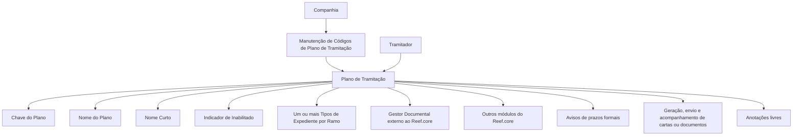

# Definição de Códigos de Planos de Tramitação em Nível de Companhia

## 1. Metadados do Documento
- **Arquivo de Origem:** Não identificado no conteúdo fornecido
- **Tipo de Documento:** Especificação Funcional
- **Domínio / Sistema:** Reef.core — Planos de Tramitação
- **Público-Alvo:** Negócio, analistas funcionais, tramitadores e equipes de configuração
- **Data/Versão Identificada:** Não identificada

---

## 2. Resumo Executivo & Contexto de Negócio

O documento define os códigos de planos de tramitação disponíveis para uma companhia. Esses planos permitem tramitar diferentes tipos de expedientes e constituem uma orientação operacional para o tramitador organizar o trabalho.

Um plano de tramitação permite especializar o tratamento de expedientes conforme a sua natureza, incluindo danos materiais, danos pessoais e recobros. Um mesmo plano pode ser associado posteriormente a um ou mais tipos de expediente por ramo.

A partir do plano de tramitação, o documento informa que podem ser executadas operações necessárias à tramitação de um expediente: integração com ferramentas externas ao Reef.core, integração com outros módulos do Reef.core, avisos de prazos formais, gestão de cartas ou documentos e anotações livres do tramitador.

A especificação concentra-se na manutenção de códigos de planos de tramitação em nível de companhia. Os atributos explicitamente descritos são: chave do plano, nome do plano, nome curto e indicador de inabilitação.

---

## 3. Arquitetura, Componentes & Tecnologias Envolvidas

| Componente / Elemento | Papel descrito |
| :--- | :--- |
| Reef.core | Sistema no qual os planos de tramitação são definidos e utilizados. |
| Plano de Tramitação | Guia para o tramitador e ferramenta de organização e especialização da tramitação de expedientes. |
| Código de Plano de Tramitação | Chave que identifica cada plano de tramitação. |
| Tipo de Expediente por Ramo | Entidade à qual um ou mais planos de tramitação podem ser associados. |
| Gestor Documental | Ferramenta externa ao Reef.core citada como integrada ao plano de tramitação. |
| Outros módulos do Reef.core | Módulos internos com os quais o plano de tramitação pode estabelecer conexão. |
| Tramitador | Usuário que utiliza o plano para organizar e realizar a tramitação do expediente. |



**Nota de Análise:** O documento cita conexão com ferramentas externas, outros módulos do Reef.core e um Gestor Documental, mas não detalha interfaces, protocolos de integração, métodos HTTP, contratos JSON, autenticação ou fluxos técnicos de dados.

---

## 4. Regras de Negócio, Especificações Funcionais & Processos

### 4.1 Finalidade dos planos de tramitação
1. A companhia deve definir códigos de planos de tramitação.
2. Os códigos de planos de tramitação permitem tramitar diferentes tipos de expedientes.
3. O plano de tramitação é uma guia para o tramitador.
4. O plano de tramitação organiza o trabalho de tramitação.
5. O plano de tramitação permite melhorar e especializar a tramitação segundo a natureza do expediente.

### 4.2 Naturezas de expediente citadas
O documento apresenta como exemplos de natureza de expediente:
- Danos materiais.
- Danos pessoais.
- Recobros.
- Expedientes de lesionados.

### 4.3 Operações disponíveis a partir de um plano
A partir de um plano de tramitação, podem ser realizadas as seguintes operações:
1. Conexão com ferramentas externas ao Reef.core, incluindo o Gestor Documental.
2. Conexão com outros módulos do Reef.core.
3. Aviso de prazos formais.
4. Geração, envio e acompanhamento de cartas ou documentos.
5. Registro de anotações livres ou apontamentos realizados pelo tramitador.

### 4.4 Propriedades do plano de tramitação

#### Chave do Plano de Tramitação
- A chave identifica os distintos planos de tramitação.
- A chave será posteriormente associada a um ou mais tipos de expediente por ramo.

#### Nome do Plano de Tramitação
- O nome contém a descrição da chave definida para o plano de tramitação.
- Os exemplos apresentados são:
  - `PL001`: Plano Danos Materiais Autos.
  - `PL002`: Plano Danos de Lesões.
  - `PS001`: Plano de Salvamentos.

#### Nome Curto do Plano de Tramitação
- O nome curto é utilizado em telas, consultas e listagens onde a descrição integral do plano não cabe.
- O documento apresenta os nomes curtos `DANMATAU` e `DANPERS`.

#### Inabilitado
- O atributo informa se o código de plano de tramitação definido está habilitado ou não.
- Um código de plano precisa estar habilitado para poder ser associado a um tipo de expediente.

### 4.5 Regra de reutilização entre setores e ramos
- Um código de plano pode ser associado a tipos de expediente de setores e/ou ramos distintos.
- A reutilização entre ramos é permitida somente quando a tramitação for a mesma.
- Um plano definido para gestão de expedientes de lesionados pode ser atribuído a qualquer tipo de expediente que tramite lesões, independentemente do ramo.

---

## 5. Tabelas de Parâmetros, Ambientes e Estruturas de Dados

| Item / Parâmetro | Descrição / Função | Tipo / Valores / Formato | Ambiente / Observações |
| :--- | :--- | :--- | :--- |
| Chave do Plano de Tramitação | Identifica os distintos planos de tramitação. | Código de plano; exemplos: `PL001`, `PL002`, `PS001`. | Associada posteriormente a um ou mais tipos de expediente por ramo. |
| Nome do Plano de Tramitação | Contém a descrição da chave definida para o plano. | Texto descritivo. | Exemplo: `Plan Daños Materiales Autos`. |
| Nome Curto do Plano de Tramitação | Nome reduzido utilizado quando a descrição integral não cabe. | Texto curto; exemplos: `DANMATAU`, `DANPERS`. | Aplicável a telas, consultas e listagens. |
| Inabilitado | Indica se o código definido está habilitado para associação a um tipo de expediente. | Valor apresentado: `N`. | O documento não define explicitamente todos os valores possíveis nem seu formato. |
| Tipo de Expediente por Ramo | Tipo de expediente que pode receber a associação de um plano. | Um ou mais tipos por plano. | Pode pertencer a ramos distintos se a tramitação for igual. |
| Gestor Documental | Ferramenta externa conectada ao plano de tramitação. | Não detalhado. | Externo ao Reef.core. |
| Aviso de prazos formais | Operação disponível a partir do plano. | Não detalhado. | O documento não especifica regras de prazo, canais ou responsáveis. |
| Cartas ou documentos | Artefatos que podem ser gerados, enviados e acompanhados. | Não detalhado. | O documento não detalha modelos, estados ou canais de envio. |
| Anotações livres | Apontamentos realizados pelo tramitador. | Texto livre. | Não há regras de retenção, auditoria ou visibilidade descritas. |

| Código de Plano | Nome do Plano | Nome Curto | Inabilitado |
| :--- | :--- | :--- | :--- |
| `PL001` | Plan Daños Materiales Autos | `DANMATAU` | `N` |
| `PL002` | Plan Daños de Lesiones | `DANPERS` | `N` |
| `PS001` | Plan de Salvamentos | Não informado | Não informado |

---

## 6. Bateria de Perguntas & Respostas para RAG (FAQ Sintético)

### P1: Qual é a finalidade dos códigos de planos de tramitação em nível de companhia?
**R:** Os códigos de planos de tramitação são definidos para que a companhia possa tramitar diferentes tipos de expedientes. Cada plano funciona como uma guia para o tramitador, apoia a organização do trabalho e permite especializar a tramitação conforme a natureza do expediente.

### P2: Quais operações podem ser realizadas a partir de um plano de tramitação?
**R:** O plano de tramitação permite conexão com ferramentas externas ao Reef.core, incluindo o Gestor Documental, conexão com outros módulos do Reef.core, aviso de prazos formais, geração, envio e acompanhamento de cartas ou documentos, além de anotações livres realizadas pelo tramitador.

### P3: O que identifica um plano de tramitação?
**R:** A chave do plano de tramitação identifica os distintos planos de tramitação. Posteriormente, essa chave pode ser associada a um ou mais tipos de expediente por ramo.

### P4: Qual é a finalidade do nome do plano de tramitação?
**R:** O nome do plano de tramitação contém a descrição da chave definida para o plano. Por exemplo, o código `PL001` possui o nome `Plan Daños Materiales Autos`, e o código `PL002` possui o nome `Plan Daños de Lesiones`.

### P5: Quando o nome curto do plano deve ser utilizado?
**R:** O nome curto deve ser utilizado em telas, consultas, listagens e outros contextos em que não haja espaço suficiente para exibir a descrição completa do plano de tramitação.

### P6: Quais nomes curtos são apresentados para os planos de exemplo?
**R:** O documento apresenta `DANMATAU` como nome curto de `PL001 — Plan Daños Materiales Autos` e `DANPERS` como nome curto de `PL002 — Plan Daños de Lesiones`.

### P7: O que o atributo Inabilitado informa?
**R:** O atributo Inabilitado informa se um código de plano de tramitação definido está habilitado ou não para ser associado a um tipo de expediente. Nos exemplos apresentados para `PL001` e `PL002`, o valor é `N`.

### P8: Um mesmo código de plano pode ser associado a expedientes de ramos diferentes?
**R:** Sim. Os planos de tramitação podem ser atribuídos a tipos de expedientes de diferentes ramos, desde que a tramitação seja a mesma.

### P9: Um plano de tramitação para expedientes de lesionados pode ser reutilizado?
**R:** Sim. Um plano definido para gerir expedientes de lesionados pode ser associado a qualquer tipo de expediente que trate lesões, independentemente do ramo, desde que o processo de tramitação seja o mesmo.

### P10: O documento detalha os contratos técnicos de integração com o Gestor Documental?
**R:** Não. O documento informa que existe conexão com ferramentas externas ao Reef.core, incluindo o Gestor Documental, mas não especifica protocolos, interfaces, endpoints, métodos ou contratos de integração.

---

## 7. Glossário de Termos, Siglas & Conceitos-Chave

- **Reef.core:** Sistema citado no documento, integrado a ferramentas externas e a outros módulos por meio do plano de tramitação.
- **Plano de Tramitação:** Guia e ferramenta de organização para o tramitador executar e especializar a tramitação de expedientes.
- **Código de Plano de Tramitação:** Chave que identifica um plano de tramitação.
- **Tramitador:** Usuário responsável por tramitar expedientes e realizar anotações livres.
- **Expediente:** Entidade processada pela tramitação; o documento cita naturezas como danos materiais, danos pessoais, recobros e lesões.
- **Ramo:** Classificação associada a tipos de expediente.
- **Gestor Documental:** Ferramenta externa ao Reef.core mencionada como integrada ao plano de tramitação.
- **Recobros:** Natureza de expediente citada no documento, sem detalhamento adicional.
- **Inabilitado:** Propriedade que indica se um código de plano está habilitado ou não para associação a um tipo de expediente.

---

## 8. Notas Críticas, Riscos & Limitações

- O documento não identifica nome de arquivo, autor, data, versão, responsável ou ciclo de aprovação.
- O documento não define o formato, comprimento, obrigatoriedade, unicidade ou regra de geração dos códigos de plano.
- O documento não informa o significado completo dos valores possíveis do atributo **Inabilitado**; apenas apresenta o valor `N` nos exemplos.
- O documento não detalha como a associação entre plano de tramitação e tipo de expediente por ramo é configurada ou validada.
- Não há detalhamento sobre permissões, perfis de acesso, auditoria, histórico ou segregação de funções.
- A integração com o Gestor Documental e com outros módulos do Reef.core é mencionada, mas não possui contratos técnicos, interfaces ou requisitos operacionais especificados.
- Não foram apresentados fluxos de exceção, regras para alteração ou exclusão de planos, nem comportamento para planos inabilitados já associados a expedientes.
- **Nota de Análise:** O documento descreve funcionalidades em alto nível; detalhes adicionais sobre telas, serviços, integrações, dados e validações não foram apresentados.

---

## 9. Conteúdo Bruto Estruturado (Referência Fiel)

```text
--- [PÁGINA 1 DE 3] ---

DEFINICIÓN Planes de Tramitación
Objetivo
La finalidad es definir los códigos de los planes de tramitación que va a tener la compañía, para
poder tramitar los diferentes tipos de expedientes.
El plan de tramitación es una guía para el tramitador, una herramienta para organizar el trabajo.
Esta herramienta permite mejorar y especializar la tramitación de los expedientes según su
naturaleza (daños materiales, daños personales, recobros…..).
Desde el plan se puede realizar todas las operaciones necesarias para tramitar un expediente:
Conexión con herramientas externas a Reef.core (Gestor Documental)
Conexión con otros módulos de Reef.core
Aviso de plazos formales
Posibilidad de generar, enviar y hacer seguimiento de cartas o documentos
Posibilidad de anotaciones Libres, apuntes que realiza el tramitador
En este documento, se está explicando la definición de códigos de plan de tramitación a nivel de
compañía.
Imagen del Mantenimiento de Códigos de Plan de Tramitación a nivel de Compañía:
 / 
 CF
Home Solutions APIs Documentation Zeus
EN


--- [PÁGINA 2 DE 3] ---

Propiedades
Clave del Plan de Tramitación
Esta propiedad será la clave por la que se va a identificar los distintos planes de tramitación, que
posteriormente será asociado a uno o varios tipos de Expedientes por Ramo.
Nombre del Plan de tramitación
Esta propiedad contendrá la descripción de la clave definida para el plan de tramitación.
Ejemplos:
Código de Plan Tramitación: PL001 Nombre del Código de Plan Tramitación: Plan Daños
Materiales Autos
Código de Plan Tramitación: PL002 Nombre del Código de Plan Tramitación: Plan Daños de
Lesiones
Código de Plan Tramitación: PS001 Nombre del Código de Plan Tramitación: Plan de
Salvamentos
Nombre corto del Plan Tramitación


--- [PÁGINA 3 DE 3] ---

Esta propiedad será un nombre corto del plan de tramitación para ser utilizado en aquellas pantallas,
consultas, listados...etc, donde no quepa la descripción del Plan.
Ejemplo:
PLAN NOMBRE NOMBRE CORTO INHABILITADO
PL001 Plan Daños Materiales Autos DANMATAU N
PL002 Plan Daños de Lesiones DANPERS N
Inhabilitado
Esta propiedad indica si el Código de Plan Tramitación que está definido, está habilitado o no, para
poder asociarlo a un tipo de expediente.
Preguntas frecuentes
¿Un Código de Plan pueden ser asociado a tipos de expedientes de distinto sector y/o ramo?
Si, los planes de tramitación pueden ser asignado a tipos de expedientes de diferentes ramos,
siempre y cuando la tramitación sea la misma.
Por ejemplo, si se define un plan de tramitación para poder gestionar expedientes de lesionados,
podría asignarse a cualquier tipo de expediente que tramite lesiones, sea del Ramo que sea.
```
