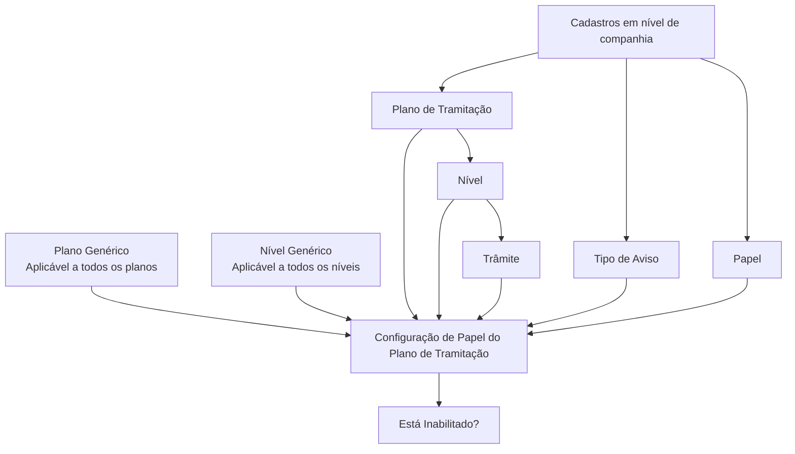

# Definição de Papéis do Plano de Tramitação para Operações de Sinistros

## 1. Metadados do Documento
- **Arquivo de Origem:** Não identificado
- **Tipo de Documento:** Especificação Técnica
- **Domínio / Sistema:** Plano de Tramitação de Sinistros — manutenção de papéis, níveis, trâmites e tipos de aviso
- **Público-Alvo:** Operação de sinistros e administração de configurações corporativas
- **Data/Versão Identificada:** Não identificada

---

## 2. Resumo Executivo & Contexto de Negócio

O documento define o objetivo dos **Papéis do Plano de Tramitação**: determinar quais pessoas ou perfis podem executar diferentes operações relacionadas a sinistros. A configuração associa um papel corporativo a um plano de tramitação, nível, trâmite e tipo de aviso, podendo também indicar que determinada combinação está inabilitada.

A definição de permissões é orientada por especialização operacional. O documento apresenta como exemplo um perito que deve receber apenas níveis relacionados a perícias e, consequentemente, só pode solicitar perícia, enviar cartas ou e-mails a oficinas, registrar resultados de perícias e contatar o segurado por e-mail ou carta dentro do nível de perícia.

Outro exemplo apresentado é o de especialistas em fraude. Esses profissionais devem executar exclusivamente operações relacionadas ao combate à fraude. O documento não detalha quais operações específicas de fraude estão disponíveis, mas estabelece a restrição funcional por especialidade.

A configuração depende de cadastros prévios em nível de companhia e das associações já existentes entre plano, nível e trâmite. Dessa forma, um papel não pode ser associado livremente a qualquer elemento: o plano deve existir, o nível deve estar previamente associado ao plano e o trâmite deve estar previamente associado ao plano e ao nível selecionados.

---

## 3. Arquitetura, Componentes & Tecnologias Envolvidas

Os componentes e conceitos identificados são:

- **Plano de Tramitação:** identifica o plano ao qual os diferentes papéis serão associados.
- **Nível:** identifica o código ou chave do nível associado ao papel dentro de um plano.
- **Trâmite:** identifica a chave dos trâmites que podem ser vinculados a um papel.
- **Tipo de Aviso:** identifica o tipo de aviso que pode ser adicionado no plano.
- **Papel (Rol):** chave do papel que receberá a associação com plano, nível, trâmite ou tipo de aviso.
- **Companhia:** escopo onde planos, papéis e tipos de aviso devem estar previamente cadastrados.
- **Plano Genérico:** opção aplicável a todos os planos.
- **Nível Genérico:** opção aplicável a todos os níveis.
- **Estado “Está Inabilitado?”:** indicador que informa se a combinação configurada está habilitada ou inabilitada.
- **Manutenção de Papéis do Plano de Tramitação:** interface ou funcionalidade mencionada para a configuração.



**Nota de Análise:** o documento não identifica tecnologias, linguagens, APIs, bancos de dados, URLs de ambiente, métodos HTTP, contratos JSON ou mecanismos técnicos de autenticação/autorização.

---

## 4. Regras de Negócio, Especificações Funcionais & Processos

### 4.1 Objetivo da configuração de papéis

A finalidade da manutenção de papéis do plano de tramitação é definir quem pode executar as diferentes operações de sinistros.

A configuração deve permitir restringir operações de acordo com a função do usuário. Os exemplos apresentados estabelecem os seguintes cenários:

1. **Perito**
   - Pode receber níveis relativos a perícias.
   - Pode solicitar perícia.
   - Pode enviar cartas ou e-mails a oficinas.
   - Pode registrar o resultado de perícias.
   - Pode contatar o segurado por e-mails ou cartas que estejam no nível de perícia.

2. **Especialista em fraude**
   - Atua na luta contra a fraude.
   - Pode executar apenas operações relacionadas à fraude.

### 4.2 Regras do Plano de Tramitação

1. A propriedade **Plano de Tramitação** contém a chave do plano ao qual os diferentes papéis serão associados.
2. A chave do plano deve existir em nível de companhia.
3. Pode ser utilizado o plano **Genérico**, cujo significado é aplicação para todos os planos.
4. O documento apresenta como exemplo o plano `PL01 - Plan de Daños Materiales`.

### 4.3 Regras do Nível

1. A propriedade **Nível** contém a chave ou o código do nível ao qual o papel será associado.
2. O código de nível deve estar previamente associado ao plano de tramitação na configuração de níveis.
3. Pode ser utilizado o **Nível Genérico**, cujo significado é aplicação para todos os níveis.
4. Quando o plano selecionado for genérico, será possível escolher qualquer nível de qualquer plano.

### 4.4 Regras do Trâmite

1. A propriedade **Trâmite** contém a chave que identifica os diferentes trâmites.
2. Para associar um papel a um trâmite, o trâmite deve estar previamente associado:
   - ao plano; e
   - ao nível que está sendo definido.
3. O documento referencia o conceito de **Trâmites de um Nível**.

### 4.5 Regras do Tipo de Aviso

1. A propriedade **Tipo de Aviso** contém o tipo de aviso que poderá ser adicionado ao plano.
2. O tipo de aviso deve estar definido previamente nos tipos de avisos em nível de companhia.

### 4.6 Regras do Papel

1. A propriedade **Papel** contém a chave do papel ao qual será atribuído:
   - um plano completo;
   - um nível de todos os planos;
   - um trâmite; ou
   - outra combinação configurada no contexto de plano, nível, trâmite e tipo de aviso.
2. O papel deve estar previamente cadastrado em nível de companhia.

### 4.7 Regra de Inabilitação

A propriedade **“Está Inabilitado?”** informa se a combinação de:

- plano;
- nível;
- trâmite;
- tipo de aviso; e
- papel

está inabilitada ou não.

**Nota de Análise:** o documento não especifica o comportamento operacional de uma combinação inabilitada, como mensagens exibidas, bloqueio de interface, validação de backend ou impacto em permissões já concedidas.

---

## 5. Tabelas de Parâmetros, Ambientes e Estruturas de Dados

| Item / Parâmetro | Descrição / Função | Tipo / Valores / Formato | Ambiente / Observações |
| :--- | :--- | :--- | :--- |
| Plano de Tramitação | Contém a chave do plano ao qual os papéis serão associados. | Chave de plano; pode utilizar o plano Genérico. | A chave deve existir em nível de companhia. |
| Plano Genérico | Permite aplicar a configuração a todos os planos. | Valor ou opção genérica. | Se o plano for genérico, pode-se escolher qualquer nível de qualquer plano. |
| Exemplo de Plano | Exemplo de plano citado no documento. | `PL01 - Plan de Daños Materiales` | O documento não apresenta estrutura, formato ou catálogo completo de planos. |
| Nível | Contém a chave ou código do nível associado ao papel. | Chave ou código de nível; pode utilizar Nível Genérico. | O nível deve estar associado previamente ao plano de tramitação. |
| Nível Genérico | Permite aplicar a configuração a todos os níveis. | Valor ou opção genérica. | Aplicável a todos os níveis. |
| Trâmite | Contém a chave que identifica os diferentes trâmites. | Chave de trâmite. | O trâmite deve estar associado previamente ao plano e ao nível definidos. |
| Tipo de Aviso | Contém o tipo de aviso que poderá ser adicionado no plano. | Tipo de aviso. | Deve estar definido nos tipos de aviso em nível de companhia. |
| Papel | Contém a chave do papel que receberá a associação. | Chave de papel. | O papel deve estar cadastrado previamente em nível de companhia. |
| Está Inabilitado? | Indica se uma combinação configurada está inabilitada. | Indicador de habilitado/inabilitado; valores exatos não informados. | Avalia a combinação de plano, nível, trâmite, tipo de aviso e papel. |
| Perito | Exemplo de função com permissões relacionadas a perícias. | Papel operacional. | Pode solicitar perícia, enviar cartas ou e-mails a oficinas, registrar resultados e contatar segurados dentro do nível de perícia. |
| Especialista em Fraude | Exemplo de função voltada ao combate à fraude. | Papel operacional. | Pode executar apenas operações relacionadas à fraude. |

---

## 6. Bateria de Perguntas & Respostas para RAG (FAQ Sintético)

### P1: Qual é o objetivo dos Papéis do Plano de Tramitação?
**R:** O objetivo é definir quais pessoas ou papéis podem realizar as diferentes operações de sinistros. A configuração associa um papel a elementos como plano de tramitação, nível, trâmite e tipo de aviso, permitindo também indicar se a combinação está inabilitada.

### P2: O que um perito pode fazer segundo o exemplo do documento?
**R:** Um perito pode receber níveis relativos a perícias e pode solicitar perícia, enviar cartas ou e-mails a oficinas, registrar resultados de perícias e entrar em contato com o segurado por e-mails ou cartas que estejam dentro do nível de perícia.

### P3: Quais operações um especialista em fraude pode executar?
**R:** Um especialista em fraude, definido como uma pessoa que trabalha na luta contra a fraude, pode executar somente operações relacionadas à fraude. O documento não detalha a lista dessas operações.

### P4: Qual pré-requisito existe para usar um Plano de Tramitação na associação de papéis?
**R:** A chave do Plano de Tramitação deve existir previamente em nível de companhia. A propriedade Plano de Tramitação armazena a chave do plano ao qual os diferentes papéis serão associados.

### P5: O que significa utilizar o Plano Genérico?
**R:** O Plano Genérico significa que a configuração se aplica a todos os planos. Além disso, quando o plano selecionado é genérico, é possível escolher qualquer nível de qualquer plano.

### P6: Qual é o pré-requisito para associar um papel a um nível?
**R:** O código ou chave do nível deve estar associado previamente ao plano de tramitação na configuração de níveis. Depois disso, o nível pode ser usado para associar o papel.

### P7: O que significa utilizar o Nível Genérico?
**R:** O Nível Genérico significa que a configuração se aplica a todos os níveis. O documento não descreve valores técnicos, códigos ou regras adicionais para esse tipo de nível.

### P8: Quais condições devem ser atendidas para associar um papel a um trâmite?
**R:** Para associar um papel a um trâmite, o trâmite deve estar previamente associado ao plano e ao nível que estão sendo definidos na configuração.

### P9: Qual condição deve ser atendida para incluir um Tipo de Aviso no plano?
**R:** O Tipo de Aviso deve estar previamente definido entre os tipos de avisos em nível de companhia. Somente então ele poderá ser adicionado no plano.

### P10: O que a propriedade “Está Inabilitado?” controla?
**R:** A propriedade “Está Inabilitado?” indica se a combinação formada por plano, nível, trâmite, tipo de aviso e papel está inabilitada ou não. O documento não detalha como essa inabilitação é aplicada tecnicamente no sistema.

### P11: Um papel precisa existir antes de ser associado a um plano, nível ou trâmite?
**R:** Sim. O papel deve estar previamente cadastrado em nível de companhia antes de receber a associação a um plano completo, a um nível de todos os planos, a um trâmite ou a outra combinação configurada.

### P12: Qual exemplo de Plano de Tramitação é citado no documento?
**R:** O exemplo apresentado é `PL01 - Plan de Daños Materiales`. O documento não fornece detalhes funcionais adicionais sobre esse plano.

---

## 7. Glossário de Termos, Siglas & Conceitos-Chave

- **Plano de Tramitação:** plano ao qual diferentes papéis podem ser associados para controlar operações de sinistros.
- **Papel (Rol):** chave ou perfil ao qual são atribuídas permissões ou associações de plano, nível, trâmite e tipo de aviso.
- **Nível:** chave ou código associado previamente a um plano de tramitação, usado na definição de permissões.
- **Trâmite:** chave que identifica operações ou procedimentos; deve estar previamente associado ao plano e ao nível definidos.
- **Tipo de Aviso:** tipo de aviso que poderá ser adicionado ao plano, desde que previamente definido em nível de companhia.
- **Companhia:** escopo organizacional onde planos, papéis e tipos de aviso devem estar cadastrados.
- **Plano Genérico:** opção cujo significado é aplicação para todos os planos.
- **Nível Genérico:** opção cujo significado é aplicação para todos os níveis.
- **Perito:** perfil exemplificado com permissões relacionadas a operações de perícia.
- **Especialista em Fraude:** perfil exemplificado com restrição a operações relacionadas à fraude.
- **PL01:** exemplo de chave de Plano de Tramitação, identificado como `Plan de Daños Materiales`.

---

## 8. Notas Críticas, Riscos & Limitações

- O documento não identifica o nome do sistema, versão, data de publicação ou arquivo de origem.
- Não há detalhamento técnico sobre APIs, integrações, persistência de dados, autenticação, autorização técnica, trilhas de auditoria ou arquitetura de infraestrutura.
- Não são informados os valores exatos possíveis para a propriedade **“Está Inabilitado?”**, nem o comportamento funcional após a inabilitação.
- Não são descritos os critérios de resolução quando existirem configurações simultâneas específicas e genéricas para o mesmo papel.
- O documento não detalha a lista de trâmites, níveis, tipos de aviso, planos ou papéis disponíveis em nível de companhia.
- O exemplo do especialista em fraude afirma que o perfil executa apenas operações de fraude, mas não enumera essas operações.
- A referência visual à tela de manutenção menciona “Home Solutions APIs Documentation Zeus” e “CF”, mas não explica o significado dessas referências ou sua relação técnica com a manutenção de papéis.

---

## 9. Conteúdo Bruto Estruturado (Referência Fiel)

```text
--- [PÁGINA 1 DE 3] ---

DEFINICIÓN Roles del Plan de Tramitación
Objetivo
La finalidad es definir quien puede realizar las diferentes operaciones de siniestros.
Ejemplos:
Un perito se le puede asignar dentro de los planes los niveles relativos a las peritaciones y sólo
pueda solicitar peritación, enviar cartas o emails a los talleres, registrar resultado de peritaciones,
ponerse en contacto con el asegurado con emails o cartas que estén en el nivel de peritación.
Especialistas en Fraudes personas que trabajen en la lucha contra el Fraude, sólo pueda
ejecutar operaciones relacionadas con el Fraude
Etc.
Imagen Mantenimiento Roles del Plan de Tramitación:
 / 
 CF
Home Solutions APIs Documentation Zeus
EN


--- [PÁGINA 2 DE 3] ---

Propiedades
Plan de Tramitación
Esta propiedad contendrá la clave del Plan de Tramitación al cual se le va a asociar los distintos
Roles. Esta clave tiene que existir a nivel de compañía. Se puede utilizar el Genérico que significa
para todos los planes.
Ejemplo:
PL01- Plan de Daños Materiales
Nivel
Esta propiedad contendrá la clave o el código del nivel al que se le van a asociar el Rol. Este código
de Nivel tiene que estar asociado previamente al plan de tramitación Niveles. Se puede utilizar el
Nivel genérico que significa para todos los niveles. Si el plan es genérico se podrá elegir cualquier
nivel de cualquier plan.
Trámite


--- [PÁGINA 3 DE 3] ---

Esta propiedad contendrá la clave por la que se van a identificar los distintos Trámites. Para poder
asociar el rol al trámite, este tiene que estar previamente asociado al plan y al nivel que se está
definiendo. Trámites de un Nivel.
Tipo de Aviso
Esta propiedad contendrá el tipo de Aviso que podrá añadir en el plan. Este tipo de aviso tiene que
estar definido en los tipos de avisos a nivel de compañía.
Rol
Esta propiedad contiene la clave del rol al cual se le va a asignar un plan completo o un nivel de
todos los planes, o un trámite etc. Ese rol tiene que estar dado de alta a nivel de compañía.
Está Inhabilitado?
Esta propiedad indica si la combinación de plan, nivel, trámite, tipo aviso y rol está inhabilitado o no.
```
