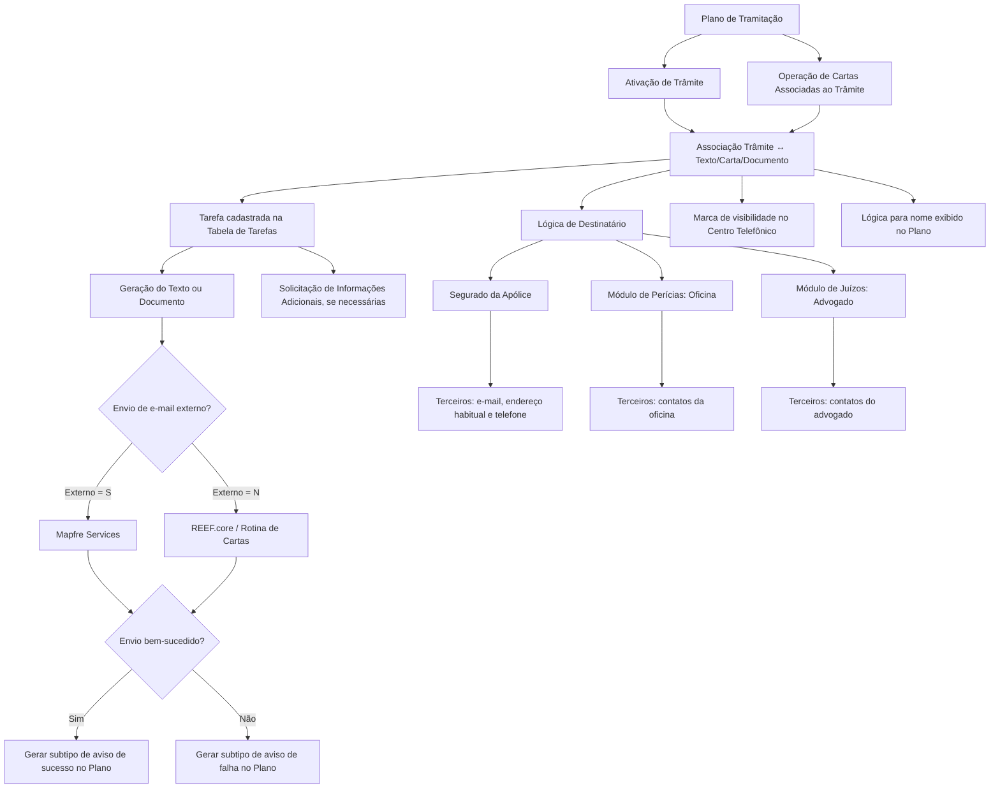

# Associação de Textos, Cartas e Documentos a Trâmites no Plano de Tramitação

## 1. Metadados do Documento
- **Arquivo de Origem:** `Não informado`
- **Tipo de Documento:** Especificação Funcional
- **Domínio / Sistema:** REEF.core / Plano de Tramitação / Rotina de Cartas / Centro Telefônico
- **Público-Alvo:** Desenvolvedores, Arquitetos, Analistas Funcionais, Operação e Gestores de Tramitação
- **Data/Versão Identificada:** Não identificada

---

## 2. Resumo Executivo & Contexto de Negócio

O documento define a configuração necessária para associar textos, cartas e documentos a um **trâmite** dentro do Plano de Tramitação. A associação permite que determinados conteúdos de comunicação sejam disponibilizados e executados quando um trâmite é ativado no Plano de Tramitação ou quando é utilizada a operação de Cartas Associadas ao trâmite.

A finalidade funcional é parametrizar comunicações relacionadas ao processo de sinistros, incluindo exemplos como comunicação de aceitação de sinistro ao segurado, solicitação de documentação ao segurado, solicitação de informação a terceiro afetado e solicitação de perícia. Um mesmo trâmite pode possuir múltiplos textos, cartas ou documentos associados, cada qual com ordem de apresentação e comportamento próprios.

A configuração da associação estabelece a chave do trâmite, a tarefa responsável pela geração do documento, a ordem de exibição do texto, a lógica para identificação do destinatário e regras de visibilidade no Centro Telefônico. Dessa forma, a solução permite adaptar uma mesma carta a contextos operacionais distintos, inclusive quando a comunicação for destinada a segurados, oficinas ou advogados.

O documento também define regras para envio de e-mails, distinguindo o envio externo via **Mapfre Services** do envio habilitado diretamente pelo **REEF.core**, além de permitir a geração de avisos específicos para sucesso ou falha no envio. Há ainda mecanismos para desabilitar documentos associados e alterar dinamicamente o nome exibido no Plano de Tramitação para aumentar a clareza operacional.

---

## 3. Arquitetura, Componentes & Tecnologias Envolvidas

Os componentes e conceitos identificados são:

| Componente / Conceito | Papel descrito no documento |
| :--- | :--- |
| Plano de Tramitação | Contexto no qual um trâmite pode ser ativado e onde os textos associados podem ser apresentados ou executados. |
| Trâmite | Entidade identificada por uma chave existente no nível de companhia e à qual um ou mais textos, cartas ou documentos são associados. |
| Texto / Carta / Documento | Comunicação associada a um trâmite e gerada mediante uma tarefa configurada. |
| Tarefa | Processo responsável por gerar o documento ou texto associado ao trâmite; pode solicitar informações adicionais para construir o conteúdo da carta. |
| Tabela de Tarefas | Estrutura na qual a tarefa configurada deve estar cadastrada. |
| Consulta do Centro Telefônico | Consulta específica que utiliza uma marca de configuração para decidir se uma carta associada ao trâmite deve ser exibida. |
| Rotina de Cartas | Rotina na qual a opção de envio pelo REEF.core fica habilitada quando `Externo = 'N'`. |
| REEF.core | Sistema a partir do qual o envio de uma carta pode ser realizado quando a configuração de envio externo estiver definida como `N`. |
| Mapfre Services | Sistema externo utilizado para envio de carta quando a configuração `Externo = 'S'`. |
| Apólice | Fonte utilizada, no exemplo do documento, para obter o segurado destinatário da comunicação. |
| Terceiros | Módulo ou fonte de dados utilizado para recuperar dados de contato, como correio eletrônico, endereço habitual e telefone. |
| Módulo de Perícias | Fonte utilizada, no exemplo do documento, para obter a oficina destinatária. |
| Módulo de Juízos | Fonte utilizada, no exemplo do documento, para obter o advogado associado ao juízo. |
| Plano | Destino no qual é gerado o subtipo de aviso referente ao sucesso ou à falha do envio de e-mail. |



> **Nota de Análise:** O documento descreve relações funcionais entre Plano de Tramitação, trâmites, tarefas, REEF.core, Mapfre Services e módulos de negócio. Não detalha interfaces técnicas, métodos HTTP, contratos JSON, versões, servidores, portas, bancos de dados ou mecanismos de integração entre esses componentes.

---

## 4. Regras de Negócio, Especificações Funcionais & Processos

### 4.1 Associação de textos, cartas e documentos a um trâmite

A finalidade da configuração é definir, para cada trâmite que necessite dessa funcionalidade, os textos e cartas que poderão ser executados:

1. Quando o trâmite for ativado no Plano de Tramitação.
2. Quando for utilizada a operação de Cartas Associadas ao trâmite.

Os exemplos apresentados de conteúdos associáveis são:

- Comunicação de aceitação de sinistro ao segurado.
- Solicitação de documentação ao segurado.
- Solicitação de informação ao terceiro afetado.
- Solicitação de perícia.
- Outros textos, cartas ou documentos equivalentes.

### 4.2 Propriedade: Trâmite

A propriedade **Trâmite** contém a chave do trâmite ao qual um ou mais textos serão associados.

Regras:

1. A chave do trâmite deve existir em nível de companhia.
2. Um trâmite pode possuir uma ou mais associações de textos, cartas ou documentos.
3. O exemplo fornecido é o código de trâmite `T002`, correspondente a **Comunicação com o Segurado**.

### 4.3 Propriedade: Tarefa

A propriedade **Tarefa** contém a chave do processo responsável por gerar o documento ou texto associado ao trâmite.

Regras:

1. A tarefa deve estar cadastrada na **Tabela de Tarefas**.
2. A tarefa é responsável pela geração do documento ou texto configurado.
3. A tarefa pode solicitar informações adicionais para construir o texto da carta quando essas informações forem necessárias.

### 4.4 Propriedade: Ordem do texto dentro do trâmite

A propriedade **Ordem do texto dentro do Trâmite** define a posição de exibição de cada texto associado.

Regras:

1. Quando um trâmite possuir vários textos associados, a propriedade determina a ordem na qual os textos serão apresentados ao tramitador dentro do Plano de Tramitação.
2. A ordenação deve ser configurada para todos os textos, cartas ou documentos associados que devam ter uma sequência de apresentação.
3. O exemplo apresentado mostra três textos relacionados ao trâmite `T002 Comunicação Asegurado`, com ordens de aparição `1`, `2` e `3`.

### 4.5 Lógica para obtenção do destinatário

A propriedade **Lógica para obter o destinatário** contém a lógica de negócio necessária para recuperar os dados do destinatário da comunicação, texto ou carta.

Os exemplos apresentados são:

1. **Comunicação destinada ao segurado**
   - Obter o segurado a partir da apólice.
   - Consultar Terceiros para recuperar os dados de contato do segurado.
   - Os dados de contato explicitamente citados são: correio eletrônico, endereço habitual e telefone.

2. **Comunicação destinada à oficina**
   - Consultar o módulo de perícias.
   - Obter a oficina.
   - Consultar Terceiros para recuperar os dados de contato da oficina.

3. **Comunicação destinada ao advogado**
   - Consultar o módulo de juízos.
   - Obter o advogado do juízo.
   - Consultar Terceiros para recuperar os dados de contato do advogado.

### 4.6 Visibilidade na Consulta do Centro Telefônico

A propriedade **Se mostra na Consulta do Centro Telefônico** contém uma marca que informa à consulta específica do Centro Telefônico se a carta associada ao trâmite deve ou não ser exibida.

Regra operacional destacada:

- Uma carta de recusa de sinistro pode ser configurada para não aparecer na consulta, evitando que o segurado seja informado incorretamente, antes do momento apropriado, de que o sinistro será recusado.

### 4.7 Lógica para exibir o nome do texto no Plano

A propriedade **Lógica para mostrar o nome do texto no plano** permite modificar o nome do texto ou documento apresentado no Plano de Tramitação para trazer maior clareza.

Exemplo apresentado:

1. Existe uma carta comum para todos os fornecedores com o nome **“Comunicação ao fornecedor”**.
2. A lógica pode alterar o nome exibido de acordo com a atividade do terceiro destinatário.
3. Exemplos de nomes resultantes:
   - `Comunicação oficina`
   - `Comunicação Perito`

### 4.8 E-mail externo

A propriedade **Email externo** deve ser preenchida sempre que o parâmetro, em nível de companhia, relacionado a informações de envio de e-mail for aplicável.

> **Nota de Análise:** O trecho do documento referente ao parâmetro de companhia termina em “información de envío de email” e não apresenta o nome completo, tipo, valor ou regra de ativação desse parâmetro.

A propriedade indica se a carta será enviada por sistema externo:

| Valor | Regra de envio |
| :--- | :--- |
| `Externo = 'S'` | A carta será enviada por **Mapfre Services**. |
| `Externo = 'N'` | A carta poderá ser enviada a partir do **REEF.core**; a opção ficará habilitada na Rotina de Cartas. |

### 4.9 Avisos de envio de e-mail

A associação pode conter dois subtipos de aviso para refletir o resultado da entrega do e-mail no Plano:

1. **Aviso Email enviado corretamente**
   - Contém o subtipo de aviso a ser gerado no Plano quando o envio de e-mail for bem-sucedido.

2. **Aviso Email NÃO se ha enviado correctamente**
   - Contém o subtipo de aviso a ser gerado no Plano quando o envio de e-mail falhar.

### 4.10 Inabilitado

A propriedade **Inhabilitado** indica se o código de documento associado ao trâmite está habilitado ou não.

> **Nota de Análise:** O documento não especifica os valores aceitos para a propriedade Inhabilitado, nem descreve o comportamento detalhado do sistema quando um código de documento estiver inabilitado.

### 4.11 Reutilização de cartas ou textos em múltiplos trâmites

Uma mesma carta ou texto pode ser associado a diferentes trâmites.

A justificativa expressa pelo documento é que as características são definidas por trâmite. Consequentemente, para uma mesma carta ou texto, podem variar entre trâmites:

- O destinatário.
- O aviso de envio bem-sucedido.
- Outras características configuradas no contexto da associação ao trâmite.

---

## 5. Tabelas de Parâmetros, Ambientes e Estruturas de Dados

| Item / Parâmetro | Descrição / Função | Tipo / Valores / Formato | Ambiente / Observações |
| :--- | :--- | :--- | :--- |
| Trâmite | Chave do trâmite ao qual um ou mais textos são associados. | Chave existente em nível de companhia. Exemplo: `T002`. | Obrigatória para estabelecer a associação. |
| Código do Trâmite | Identificação do trâmite. | Exemplo: `T002 Comunicação com o Segurado`. | O documento usa `T002` como exemplo. |
| Tarefa | Chave do processo responsável por gerar o texto ou documento associado. | Chave de tarefa. | Deve estar cadastrada na Tabela de Tarefas. Pode solicitar informações adicionais para construir a carta. |
| Tabela de Tarefas | Estrutura em que a tarefa utilizada na associação deve existir. | Não detalhado. | Não são apresentados campos, tecnologia ou localização da tabela. |
| Texto / Carta / Documento | Conteúdo de comunicação associado a um trâmite. | Exemplos: solicitação de documentação, comunicação de visita do perito, comunicação de veículo ausente. | Pode ser associado a diferentes trâmites. |
| Ordem do texto dentro do Trâmite | Define a posição de apresentação do texto no Plano de Tramitação. | Ordem numérica. Exemplos: `1`, `2`, `3`. | Aplicável quando o trâmite possui vários textos associados. |
| Lógica para obter o destinatário | Regra de negócio para obter dados do destinatário da comunicação. | Lógica configurável; detalhes de implementação não informados. | Pode consultar apólice, módulo de perícias, módulo de juízos e Terceiros. |
| Dados de contato | Informações de contato recuperadas para o destinatário. | Correio eletrônico, endereço habitual e telefone. | Os dados são explicitamente citados para o caso do segurado; Terceiros também é consultado nos exemplos de oficina e advogado. |
| Se mostra na Consulta do Centro Telefônico | Marca que determina se a carta associada será exibida na consulta do Centro Telefônico. | Valores não especificados. | Pode impedir exibição de carta de recusa de sinistro antes do momento adequado. |
| Lógica para mostrar o nome do texto no plano | Permite alterar o nome exibido para um texto ou documento no Plano de Tramitação. | Lógica configurável; formato não detalhado. | Exemplo: “Comunicação ao fornecedor” pode tornar-se “Comunicação oficina” ou “Comunicação Perito”. |
| Email externo | Indica se o envio da carta é realizado por sistema externo. | `S` ou `N`. | Deve ser preenchido quando aplicável ao parâmetro de companhia referente a informações de envio de e-mail. |
| `Externo = 'S'` | Define envio externo da carta. | Valor literal `S`. | Envio por Mapfre Services. |
| `Externo = 'N'` | Define que a carta pode ser enviada pelo REEF.core. | Valor literal `N`. | A opção fica habilitada na Rotina de Cartas. |
| Aviso Email enviado corretamente | Subtipo de aviso gerado quando o e-mail é enviado com sucesso. | Subtipo de aviso; valores não detalhados. | Aviso gerado no Plano. |
| Aviso Email NÃO se ha enviado correctamente | Subtipo de aviso gerado quando o envio de e-mail falha. | Subtipo de aviso; valores não detalhados. | Aviso gerado no Plano. |
| Inhabilitado | Indica se o código de documento associado está habilitado ou não. | Valores não especificados. | Não há detalhamento do efeito operacional da inabilitação. |
| REEF.core | Sistema que pode realizar o envio da carta. | Não detalhado. | Utilizado quando `Externo = 'N'`. |
| Mapfre Services | Sistema externo para envio de carta. | Não detalhado. | Utilizado quando `Externo = 'S'`. |
| Consulta do Centro Telefônico | Consulta específica que pode exibir ou ocultar cartas associadas. | Não detalhado. | Controlada pela marca de exibição da associação. |
| Rotina de Cartas | Rotina em que a opção de envio por REEF.core pode ser habilitada. | Não detalhado. | Associada à configuração `Externo = 'N'`. |

### Exemplo de ordenação de textos por trâmite

| Trâmite | Texto | Ordem de aparição |
| :--- | :--- | :--- |
| `T002 Comunicação Asegurado` | `TXT1 Solicitud de Documentación` | `1` |
| `T002 Comunicación Asegurado` | `TXT2 Comunicación de visita del Perito` | `2` |
| `T002 Comunicación Asegurado` | `TXT2 Comunicación Vehículo Ausente` | `3` |

> **Nota de Análise:** O documento apresenta `TXT2` em duas linhas distintas da tabela de exemplo. O conteúdo original não esclarece se esse identificador é intencionalmente reutilizado ou se representa uma inconsistência na transcrição ou no exemplo.

---

## 6. Bateria de Perguntas & Respostas para RAG (FAQ Sintético)

### P1: Qual é a finalidade de associar textos, cartas ou documentos a um trâmite?
**R:** A associação permite definir os textos, cartas ou documentos que poderão ser executados quando o trâmite for ativado no Plano de Tramitação ou quando for utilizada a operação de Cartas Associadas ao trâmite. Entre os exemplos citados estão comunicações ao segurado, solicitações de documentação, solicitações de informação a terceiros e solicitações de perícia.

### P2: Qual requisito deve ser atendido pela chave de um trâmite configurado na associação de cartas?
**R:** A chave configurada na propriedade Trâmite deve existir em nível de companhia. O documento apresenta como exemplo o código `T002`, identificado como Comunicação com o Segurado.

### P3: Para que serve a propriedade Tarefa na associação de um texto a um trâmite?
**R:** A propriedade Tarefa contém a chave do processo responsável por gerar o documento ou texto associado ao trâmite. Essa tarefa deve estar cadastrada na Tabela de Tarefas e pode solicitar informações adicionais para construir o conteúdo da carta quando necessário.

### P4: Como é definida a ordem de apresentação de vários textos associados ao mesmo trâmite?
**R:** A ordem é definida pela propriedade Ordem do texto dentro do Trâmite. Quando o tramitador estiver no Plano de Tramitação e houver vários textos associados ao trâmite, essa propriedade determina a sequência em que cada texto será mostrado.

### P5: Como o destinatário de uma carta destinada ao segurado é obtido?
**R:** Para uma carta destinada ao segurado, a lógica habitual apresentada consiste em obter o segurado a partir da apólice e, em seguida, consultar Terceiros para recuperar dados de contato, incluindo correio eletrônico, endereço habitual e telefone.

### P6: Qual lógica de destinatário é apresentada para cartas destinadas a oficinas e advogados?
**R:** Para uma carta destinada à oficina, o documento indica consultar o módulo de perícias para obter a oficina e depois consultar Terceiros para recuperar seus dados de contato. Para uma carta destinada ao advogado, a lógica indicada é consultar o módulo de juízos para obter o advogado do juízo e depois consultar Terceiros para recuperar os dados de contato do advogado.

### P7: Como impedir que uma carta de recusa de sinistro seja mostrada no Centro Telefônico?
**R:** Deve-se utilizar a propriedade Se mostra na Consulta do Centro Telefônico. Essa marca informa à consulta específica do Centro Telefônico se a carta associada ao trâmite deve ser exibida ou não. O documento cita como exemplo ocultar uma carta de recusa de sinistro para evitar que o segurado seja informado por engano antes do momento adequado.

### P8: Para que serve a lógica de exibição do nome do texto no Plano de Tramitação?
**R:** Essa lógica permite modificar o nome do texto ou documento exibido no Plano de Tramitação para aumentar a clareza. O exemplo apresentado transforma a designação genérica “Comunicação ao fornecedor” em nomes mais específicos, como “Comunicação oficina” ou “Comunicação Perito”, conforme a atividade do terceiro destinatário.

### P9: O que significa configurar `Externo = 'S'` na propriedade Email externo?
**R:** `Externo = 'S'` significa que a carta será enviada por Mapfre Services, caracterizando o envio por um sistema externo.

### P10: O que acontece quando `Externo = 'N'`?
**R:** Quando `Externo = 'N'`, a carta pode ser enviada a partir do REEF.core. Nessa situação, a opção de envio fica habilitada na Rotina de Cartas.

### P11: Como são tratados os resultados de sucesso ou falha no envio de e-mail?
**R:** A configuração possui duas propriedades de aviso: Aviso Email enviado corretamente, que contém o subtipo de aviso gerado no Plano em caso de sucesso, e Aviso Email NÃO se ha enviado correctamente, que contém o subtipo de aviso gerado no Plano em caso de falha.

### P12: Uma mesma carta pode ser associada a diferentes trâmites?
**R:** Sim. O documento afirma que uma mesma carta ou texto pode ser associado a diferentes trâmites porque as características são definidas no contexto de cada trâmite. Assim, o destinatário e o aviso de envio bem-sucedido, entre outras características, podem ser distintos para a mesma carta em cada associação.

---

## 7. Glossário de Termos, Siglas & Conceitos-Chave

- **Carta Associada ao Trâmite:** Carta, texto ou documento configurado para ser executado em função da ativação de um trâmite ou da operação de Cartas Associadas.
- **Centro Telefônico:** Contexto de consulta específica no qual pode ser controlada a exibição de uma carta associada ao trâmite.
- **Inhabilitado:** Propriedade que indica se o código de documento associado ao trâmite está habilitado ou não.
- **Mapfre Services:** Sistema externo citado para envio de cartas quando a configuração de e-mail externo estiver definida como `S`.
- **Módulo de Juízos:** Módulo citado como fonte para obter o advogado associado a um juízo.
- **Módulo de Perícias:** Módulo citado como fonte para obter a oficina destinatária de uma comunicação.
- **Plano:** Referência ao Plano de Tramitação, onde o trâmite é ativado, os textos podem ser exibidos e os avisos de envio podem ser gerados.
- **Plano de Tramitação:** Contexto operacional no qual trâmites são ativados e textos, cartas ou documentos associados são apresentados ou executados.
- **REEF.core:** Sistema citado como opção para envio de cartas quando a configuração `Externo = 'N'` estiver definida.
- **Rotina de Cartas:** Rotina na qual a opção de envio por REEF.core fica habilitada quando o e-mail não é externo.
- **Subtipo de Aviso:** Valor configurado para gerar um aviso no Plano em caso de sucesso ou falha no envio de e-mail.
- **Tabela de Tarefas:** Estrutura na qual a tarefa responsável pela geração do documento ou texto deve estar cadastrada.
- **Tarefa:** Processo responsável por gerar o documento ou texto associado a um trâmite e, se necessário, solicitar informações adicionais para construção da carta.
- **Terceiros:** Fonte de dados utilizada para recuperar informações de contato do segurado, oficina ou advogado.
- **Texto:** Conteúdo de comunicação associado a um trâmite, que pode corresponder a uma carta ou documento.
- **Trâmite:** Processo identificado por uma chave de companhia ao qual podem ser associados um ou mais textos, cartas ou documentos.

---

## 8. Notas Críticas, Riscos & Limitações

1. O documento não informa o nome do arquivo de origem, data, versão, autoria, responsável funcional ou responsável técnico.
2. Não são fornecidos contratos técnicos, APIs, métodos HTTP, estruturas JSON, bancos de dados, tabelas físicas, URLs, portas, servidores ou mecanismos de autenticação.
3. A expressão referente ao preenchimento de **Email externo** está incompleta: o documento menciona um parâmetro em nível de companhia relacionado a “informação de envio de email”, mas não informa seu nome completo, valores, tipo ou regra de ativação.
4. A propriedade **Inhabilitado** é descrita apenas como indicador de habilitação do código de documento; seus valores aceitos e efeitos operacionais não são detalhados.
5. A marca **Se muestra en la Consulta del Centro Telefónico** não possui valores explicitamente especificados no conteúdo original.
6. A lógica para obter destinatário é apresentada por exemplos funcionais; o documento não define regras de prioridade, tratamento de ausência de dados de contato, comportamento em caso de múltiplos destinatários ou validações de dados.
7. A tabela de exemplo utiliza o identificador `TXT2` para “Comunicación de visita del Perito” e “Comunicación Vehículo Ausente”. O documento não esclarece se a repetição é proposital.
8. O conteúdo não descreve como a associação entre trâmite e texto é criada, alterada, validada, versionada, auditada ou removida.
9. O documento não informa o comportamento de reenvio, retentativa, rastreabilidade ou tratamento de falhas técnicas no envio de e-mail.
10. O documento declara que a mesma carta pode ser associada a diferentes trâmites, mas não define restrições, limites quantitativos ou mecanismos para prevenir configurações conflitantes.

---

## 9. Conteúdo Bruto Estruturado (Referência Fiel)

```text
--- [PÁGINA 1 DE 4] ---

DEFINICIÓN Asociar Textos a Trámite
Objetivo
La finalidad es definir para cada trámite que así lo necesite, los textos, cartas que se van poder
ejecutar, cuando se active dicho trámite desde el Plan de Tramitación o se utilice la operación de
Cartas Asociadas al trámite.
Ejemplo de textos, cartas:
Comunicación de aceptación de Siniestro al Asegurado
Solicitud de documentación al Asegurado
Solicitud de información al tercero afectado
Solicitud de peritación
Etc.
Imagen de la Asociación de Cartas/Textos a un Trámite:
 / 
 CF
Home Solutions APIs Documentation Zeus
EN


--- [PÁGINA 2 DE 4] ---

Propiedades
Trámite
Esta propiedad contendrá la clave del trámite al cual se le va a asociar uno o varios textos. Esta
clave tiene que existir a nivel de compañía.
Ejemplo:
Código del Trámite: T002 Comunicación con el Asegurado
Tarea
Esta propiedad contendrá la clave del proceso (tarea) que se va a encargar de generar el
documento, el texto que se está asociando al trámite. Esta propiedad tiene que estar dado de alta en
la tabla de Tareas. Este proceso es el que pedirá información adicional para la construcción del texto
de la carta, si se necesita.
Orden del texto dentro del Trámite
Esta propiedad va a tener el orden que va a ocupar el Texto que se está asociando al trámite. Es
decir cuando el tramitador esté dentro del Plan de Tramitación si el trámite tiene asociado varios
textos, en que orden se va a mostrar el texto que estamos asociando.


--- [PÁGINA 3 DE 4] ---

Ejemplo:
Si se hubiese decidido tener un trámite con todas las comunicaciones con el asegurado y se le
hubiese asignado tres textos, cartas, documentos, se tiene que indicar al sistema en que orden se
quiere que aparezcan.
TRÁMITE TEXTO ORDEN
APARICIÓN
T002 Comunicación
Asegurado
TXT1 Solicitud de Documentación 1
TXT2 Comunicación de visita del
Perito
2
TXT2 Comunicación Vehículo
Ausente
3
Lógica para obtener el destinatario
Esta propiedad contendrá una lógica de negocio para obtener los datos del destinatario de la
comunicación, texto, carta...
Ejemplo:
Si el texto, carta, documento, que estamos generando es para el asegurado, lo habitual es
obtener el asegurado de la póliza e ir a terceros para recuperar todos los datos de contacto:
correo electrónico, dirección habitual, teléfono.
Si el texto que estamos generando es para el taller, lo habitual es ir al módulo de peritaciones,
obtener el taller y posteriormente ir a terceros a recuperar los datos de contacto del taller.
Si el texto, carta, documento es para el abogado, lo habitual es ir al módulo de juicios, obtener
el abogado del juicio e ir posteriormente a terceros a recuperar los datos de contacto del
abogado.
Se muestra en la Consulta del Centro Telefónico
Esta propiedad contiene una marca que le indica a la consulta que hay específica para el centro
telefónico, si se muestra o no la carta que se está asociando al trámite.
Ejemplo:
Si el trámite tiene una carta de rechazo del siniestro, se le puede indicar que esta no se muestre en
la consulta, para que no se informe al asegurado por error, antes de tiempo, que su siniestro va a ser


--- [PÁGINA 4 DE 4] ---

rechazado.
Lógica para mostrar el nombre del texto en el plan
Esta lógica sirve para poder modificar el nombre del texto, del documento, que se lanza desde el plan
de tramitación, para dar más claridad.
Ejemplo:
Si se tiene una carta para todos los proveedores, en vez de que en el plan salga como nombre de la
carta "Comunicación al proveedor", podemos hacer que modifique ese nombre y se añada la
actividad del tercero a la que va dirigida la carta, por ejemplo "Comunicación taller", "Comunicación
Perito"
Email externo
Esta propiedad se rellenará, siempre que el parámetro a nivel de compañía información de envío de
email
Esta propiedad indica si la carta se envía por un sistema externo o no.
Externo = ‘S’, significa que se enviará por Mapfre Services.
Externo= ‘N’, significará que se puede mandar desde Reef.core, la opción estará habilitada en la
Rutina de Cartas.
Aviso Email enviado correctamente
Esta propiedad contiene el Subtipo de Aviso que se va a generar en el Plan, en caso de que el envío
del email sea exitoso.
Aviso Email NO se ha enviado correctamente
Esta propiedad contiene el Subtipo de Aviso que se va a generar en el Plan, en caso de que el envío
del email sea fallido.
Inhabilitado
Esta propiedad indica si el Código del documento que está asociado al trámite está habilitado o no.
Preguntas frecuentes
¿Se puede asociar una carta, o texto a diferentes trámites? Si, ya que las características se
definen por trámite, por lo que el destinatario puede ser distinto el aviso de enviado
correctamente puede ser distinto, etc.
```
