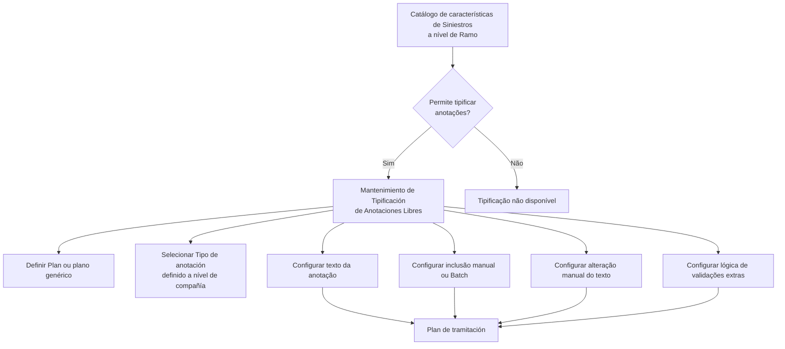

# Definición de Tipos de Anotaciones Libres en el Plan de Tramitación

## 1. Metadados do Documento
- **Arquivo de Origem:** `Não identificado`
- **Tipo de Documento:** `Especificação Funcional`
- **Domínio / Sistema:** `Siniestros — Plan de tramitación`
- **Público-Alvo:** `Tramitadores, administradores de catálogo e analistas funcionais`
- **Data/Versão Identificada:** `Não identificada`

---

## 2. Resumo Executivo & Contexto de Negócio

O documento descreve a tipificação de anotações livres utilizadas no Plan de tramitación de expedientes de siniestros. A finalidade declarada é permitir que anotações originalmente livres sejam definidas como tipos reutilizáveis no plano de tramitação.

A tipificação depende de uma configuração prévia no catálogo de características de Siniestros no nível de Ramo. Esse catálogo deve indicar que as anotações podem ser tipificadas; sem essa indicação, o preenchimento do catálogo de tipificação não habilita o uso das anotações tipificadas.

O benefício operacional indicado é reduzir a necessidade de digitação manual pelo tramitador. O documento exemplifica anotações como “No se ha podido contactar con el Asegurado”, “Vehículo Ausente” e “El perito no ha conseguido entrar en la propiedad”.

A padronização também busca aumentar a homogeneidade dos planos de tramitação. Cada anotação tipificada pode ser vinculada a um Plan específico ou a um plano genérico, configurada para uso manual ou Batch, ter texto fixo ou calculado por lógica de negócio, permitir edição manual e receber validações adicionais.

---

## 3. Arquitetura, Componentes & Tecnologias Envolvidas

Os componentes funcionais identificados são:

- **Catálogo de características de Siniestros a nível de Ramo:** controla se a tipificação de anotações é utilizada.
- **Mantenimiento de Tipificación de Anotaciones Libres:** área de manutenção das definições de anotações tipificadas.
- **Plan de tramitación:** plano no qual as anotações definidas podem ser utilizadas.
- **Tipos de anotaciones a nivel de compañía:** catálogo corporativo no qual o tipo de anotação deve estar previamente definido.
- **Tramitador:** usuário que pode incluir e, quando permitido, alterar anotações.
- **Procesos Batch:** processos que podem utilizar anotações cuja inclusão manual não está habilitada.
- **Lógica de Negocio:** lógica usada para recuperar texto dinâmico e realizar validações extras.

> **Nota de Análise:** O texto menciona “CF”, “Home Solutions APIs Documentation” e “Zeus” no conteúdo extraído, mas não explica suas funções, relações técnicas ou integrações com a tipificação de anotações.



---

## 4. Regras de Negócio, Especificações Funcionais & Processos

1. A tipificação de anotações livres somente é possível quando o catálogo de características de **Siniestros**, no nível de **Ramo**, indicar que as anotações podem ser tipificadas.

2. O preenchimento do catálogo de tipificação, isoladamente, não garante que a tipificação possa ser utilizada. Existe um parâmetro no nível de Siniestros que determina se a tipificação de anotações é usada ou não.

3. Uma anotação tipificada deve estar associada a um **Plan**:
   - O Plan contém a chave do plano no qual a anotação pode ser usada.
   - Pode ser utilizado um **plan genérico**.
   - O plan genérico indica que a anotação poderá ser utilizada em todos os planos.

4. O **Tipo de anotación** deve estar definido previamente nos tipos de anotações no nível de companhia.

5. O parâmetro **Se puede incluir manualmente** determina a forma de inclusão:
   - Quando habilitado, um tramitador pode incluir a anotação manualmente.
   - Quando não habilitado, a anotação é utilizada somente por processos Batch.

6. A propriedade **Texto de la Anotación** armazena o texto da anotação.

7. Quando o texto da anotação não é fixo e depende de alguma condição, deve ser indicada uma **Lógica de Negocio para recuperar el texto**. Essa lógica devolve o texto da anotação ao Plan de tramitación.

8. A propriedade **Se puede modificar el Texto de la Anotación** informa ao plano se o tramitador pode modificar manualmente o texto da anotação.

9. A propriedade **Lógica para realizar validaciones extras** contém a lógica usada para validar a inclusão da anotação livre no Plan de tramitación.

10. Exemplos de anotações livres que podem ser tipificadas:
    - No se ha podido contactar con el Asegurado.
    - Vehículo Ausente.
    - El perito no ha conseguido entrar en la propiedad.

> **Nota de Análise:** O documento não detalha a implementação da lógica de negócio, as condições possíveis para texto dinâmico, os critérios das validações extras, nem os métodos, contratos ou interfaces usados por processos Batch.

---

## 5. Tabelas de Parâmetros, Ambientes e Estruturas de Dados

| Item / Parâmetro | Descrição / Função | Tipo / Valores / Formato | Ambiente / Observações |
| :--- | :--- | :--- | :--- |
| Catálogo de características de Siniestros a nível de Ramo | Indica se as anotações podem ser tipificadas. | Indicação de uso ou não uso da tipificação. | Pré-requisito para tipificar anotações livres. |
| Plan | Contém a chave do plano no qual as anotações definidas podem ser utilizadas. | Chave de Plan. | Pode ser usado um plan genérico. |
| Plan genérico | Indica que a anotação poderá ser utilizada em todos os planos. | Plano genérico. | Alternativa ao vínculo com um Plan específico. |
| Tipo de anotación | Classifica a anotação livre. | Deve existir nos tipos de anotações a nível de companhia. | Obrigatório conforme a descrição do documento. |
| Se puede incluir manualmente | Determina se um tramitador pode incluir a anotação manualmente. | Inclusão manual pelo tramitador ou uso exclusivo por processos Batch. | Controla o modo de inclusão. |
| Texto de la Anotación | Contém o texto apresentado para a anotação. | Texto fixo ou texto retornado por lógica de negócio. | Pode depender de condição. |
| Lógica de Negocio para recuperar el texto | Retorna o texto da anotação quando o texto não é fixo. | Lógica de negócio. | Devolve o texto ao Plan de tramitación. |
| Se puede modificar el Texto de la Anotación | Indica se o tramitador pode alterar manualmente o texto da anotação. | Permissão de alteração manual. | Informação disponibilizada ao Plan. |
| Lógica para realizar validaciones extras | Executa validações ao incluir a anotação livre no plano de tramitação. | Lógica de validação. | Critérios não detalhados. |
| Procesos Batch | Podem utilizar anotações que não são incluídas manualmente. | Processos Batch. | Não há detalhamento técnico adicional. |
| Tramitador | Usuário que realiza a tramitação e pode incluir ou modificar anotações conforme as propriedades configuradas. | Papel operacional. | Ações dependem das permissões da anotação. |

---

## 6. Bateria de Perguntas & Respostas para RAG (FAQ Sintético)

### P1: Qual é a finalidade da tipificação de anotações livres no Plan de tramitación?
**R:** A finalidade é definir anotações livres como tipos reutilizáveis no Plan de tramitación. Isso reduz a necessidade de o tramitador digitar anotações repetitivas e aumenta a homogeneidade dos planos de tramitação.

### P2: Qual configuração é necessária para permitir a tipificação de anotações livres?
**R:** O catálogo de características de Siniestros no nível de Ramo deve indicar que as anotações podem ser tipificadas. O documento também informa que existe um parâmetro no nível de Siniestros que determina se a tipificação é utilizada.

### P3: Por que não consigo tipificar anotações livres mesmo após preencher o catálogo?
**R:** Segundo o documento, o preenchimento do catálogo não é suficiente. Deve existir um parâmetro no nível de Siniestros indicando que a tipificação de anotações está habilitada para uso.

### P4: O que representa a propriedade Plan na definição de uma anotação tipificada?
**R:** A propriedade Plan contém a chave do plano no qual a anotação definida pode ser usada. Também é possível usar um plan genérico, permitindo que a anotação seja utilizada em todos os planos.

### P5: O tipo de anotação pode ser criado diretamente na definição de anotação livre?
**R:** Não há indicação de criação direta nesse ponto. O documento estabelece que o Tipo de anotación deve estar previamente definido nos tipos de anotações a nível de companhia.

### P6: Qual é a função do parâmetro “Se puede incluir manualmente”?
**R:** Esse parâmetro determina se a anotação pode ser incluída manualmente por um tramitador. Quando não é permitida a inclusão manual, a anotação é usada apenas para processos Batch.

### P7: Como funciona uma anotação cujo texto depende de uma condição?
**R:** Quando o texto da anotação não é fixo e depende de alguma condição, deve ser configurada uma Lógica de Negocio para recuperar el texto. Essa lógica devolve o texto da anotação ao Plan de tramitación.

### P8: O tramitador sempre pode modificar o texto de uma anotação tipificada?
**R:** Não. A possibilidade de alteração manual é controlada pela propriedade “Se puede modificar el Texto de la Anotación”, que indica ao plano se o tramitador pode modificar o texto.

### P9: Para que serve a lógica de validações extras?
**R:** A lógica de validações extras serve para realizar validações no momento de incluir a anotação livre no Plan de tramitación. O documento não especifica quais regras ou critérios essas validações devem aplicar.

### P10: Quais exemplos de anotações livres são citados?
**R:** O documento cita “No se ha podido contactar con el Asegurado”, “Vehículo Ausente” e “El perito no ha conseguido entrar en la propiedad” como exemplos de anotações que podem ser tipificadas.

---

## 7. Glossário de Termos, Siglas & Conceitos-Chave

- **Anotaciones libres:** Anotações realizadas durante a tramitação de um expediente; podem ser tipificadas para reduzir digitação e padronizar planos.
- **Batch:** Processos Batch que podem utilizar anotações não disponíveis para inclusão manual.
- **Catálogo de características de Siniestros:** Catálogo configurado no nível de Ramo que indica se anotações podem ser tipificadas.
- **CF:** Termo exibido no conteúdo bruto, sem definição adicional no documento.
- **Lógica de Negocio:** Lógica usada para recuperar texto dinâmico de anotação ou realizar validações extras.
- **Plan:** Propriedade que contém a chave do plano em que uma anotação pode ser utilizada.
- **Plan de tramitación:** Plano no qual anotações tipificadas são utilizadas durante a tramitação.
- **Plan genérico:** Configuração que permite usar uma anotação em todos os planos.
- **Ramo:** Nível no qual o catálogo de características de Siniestros controla a possibilidade de tipificação.
- **Siniestros:** Contexto de sinistros no qual existe o parâmetro de ativação da tipificação.
- **Tipo de anotación:** Tipo previamente definido no nível de companhia para classificar uma anotação.
- **Tramitador:** Usuário responsável pela tramitação que pode incluir ou modificar anotações conforme as propriedades configuradas.

---

## 8. Notas Críticas, Riscos & Limitações

- A tipificação depende de uma configuração externa: o parâmetro do catálogo de características de Siniestros no nível de Ramo.
- O documento alerta implicitamente para risco de configuração incompleta: preencher o catálogo de tipificação sem habilitar o parâmetro de Siniestros não permite tipificar anotações livres.
- Não são detalhados os valores possíveis, a localização, o formato ou o mecanismo de manutenção do parâmetro de Siniestros.
- Não há detalhamento sobre regras, condições, linguagem ou execução da Lógica de Negocio para recuperar el texto.
- Não há critérios documentados para a Lógica para realizar validaciones extras.
- Não são descritos contratos técnicos, interfaces, métodos HTTP, integrações ou agendamentos relacionados aos procesos Batch.
- Os termos “CF”, “Home Solutions APIs Documentation” e “Zeus” aparecem no conteúdo extraído, mas não possuem explicação funcional ou arquitetural adicional.

---

## 9. Conteúdo Bruto Estruturado (Referência Fiel)

```text
--- [PÁGINA 1 DE 3] ---

DEFINICIÓN Tipos de Anotaciones
Objetivo
La finalidad de este documento es conocer cómo se puede tipificar la anotaciones libres, utilizadas
en el Plan de tramitación. Esto sólo será posible, si en el catálogo de características de Siniestros a
nivel de Ramo, indica que se pueden tipificar las anotaciones.
Ejemplo: El tramitador puede realizar a lo largo de la tramitación de un expediente anotaciones
libres. Pero por eficiencia, se prefiere tenerlas tipificadas para que el tramitador no tenga que
introducirlas. También se tipifican para tener más homogeneidad en los planes de tramitación.
No se ha podido contactar con el Asegurado
Vehículo Ausente
El perito no ha conseguido entrar en la propiedad
Etc.
Mantenimiento de Tipificación de Anotaciones Libres:
 / 
 CF
Home Solutions APIs Documentation Zeus
EN


--- [PÁGINA 2 DE 3] ---

Propiedades
Plan
Esta propiedad contiene la clave del Plan en el que se puede utilizar las anotaciones que se están
definiendo.
Puede utilizarse el plan genérico que indicará que se podrá utilizar en todos los planes.
Tipo de anotación
Tiene que estar definido en los tipos de anotaciones a nivel de compañía.
Se puede incluir manualmente
Este parámetro indica si la anotación puede ser incluida manualmente por un tramitador, o sólo se va
a utilizar para procesos Batch.
Texto de la Anotación
Esta propiedad contiene el texto de la Anotación.
Lógica de Negocio para recuperar el texto


--- [PÁGINA 3 DE 3] ---

Si el texto de la anotación no es fija, sino que depende de alguna condición, este es el lugar para
indicar la lógica de negocio que va a devolver el texto de la anotación al plan de tramitación.
Se puede modificar el Texto de la Anotación
Esta propiedad indica al plan, si el texto de esta anotación la puede modificar manualmente el
tramitador.
Lógica para realizar validaciones extras
Lógica para realizar validaciones a la hora de incluir la anotación libre en el plan de tramitación.
Preguntas frecuentes
¿Por qué no me deja tipificar las anotaciones libres, si he rellenado este catálago?
En este documento se explica que hay un parámetro a nivel de siniestros para indicar si se usa o
no la tipificación de las anotaciones
```
