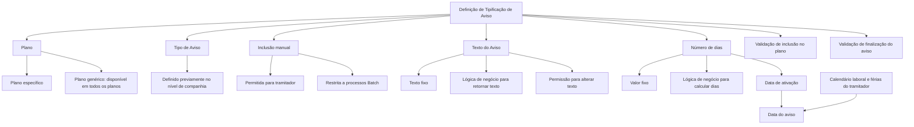

# Tipificação de Avisos no Plano de Tramitação

## 1. Metadados do Documento
- **Arquivo de Origem:** Não identificado
- **Tipo de Documento:** Especificação Funcional
- **Domínio / Sistema:** Plano de tramitação — Tipos de Avisos
- **Público-Alvo:** Analistas funcionais, desenvolvedores, operação e tramitadores
- **Data/Versão Identificada:** Não identificada

---

## 2. Resumo Executivo & Contexto de Negócio

O documento descreve a tipificação de avisos utilizados em planos de tramitação de expedientes. O objetivo é permitir que avisos recorrentes sejam previamente definidos, evitando que o tramitador precise digitar manualmente mensagens frequentes ao longo da tramitação.

A padronização de avisos melhora a eficiência operacional e a homogeneidade entre planos de tramitação. Os exemplos apresentados incluem contactar o segurado, contactar o perito, verificar o recebimento do resultado da perícia e verificar o recebimento de uma fatura.

A definição de um aviso contempla seu escopo de utilização por plano, o tipo de aviso corporativo, a possibilidade de inclusão e edição manual pelo tramitador, o texto exibido, a data prevista para o aviso e lógicas de negócio associadas. As lógicas podem determinar o texto, calcular dias, validar a inclusão no plano e validar ou impedir a finalização do aviso.

O cálculo da data do aviso pode depender de um número fixo de dias ou de uma lógica de negócio. O documento ressalta que a configuração corporativa relativa ao calendário laboral e às férias do tramitador influencia esse cálculo, podendo resultar em uma quantidade efetiva de dias superior à quantidade inicialmente configurada.

---

## 3. Arquitetura, Componentes & Tecnologias Envolvidas

O conteúdo apresenta componentes funcionais relacionados à manutenção de tipificações de avisos em planos de tramitação:

- **Plano:** define em quais planos de tramitação o aviso pode ser utilizado.
- **Plano genérico:** permite a utilização do aviso em todos os planos.
- **Tipo de Aviso:** deve estar previamente definido no nível de companhia.
- **Tramitador:** usuário que inclui, altera ou finaliza avisos, conforme permissões configuradas.
- **Processos Batch:** processos que podem utilizar avisos cuja inclusão manual não é permitida.
- **Lógicas de negócio:** regras configuráveis para obter texto, calcular dias, validar inclusão e validar finalização.
- **Configuração de companhia:** definição que determina a consideração de calendário laboral e férias do tramitador no cálculo de dias.
- **Home Solutions APIs Documentation Zeus:** texto apresentado no documento sem detalhamento de função, integração ou relação arquitetural com a manutenção de avisos.



> **Nota de Análise:** O documento não detalha APIs, contratos HTTP, modelos de dados, persistência, telas, integrações técnicas ou implementação das lógicas de negócio. Também não explica o significado ou papel de “CF”, “Home Solutions APIs Documentation Zeus” e “EN” no processo descrito.

---

## 4. Regras de Negócio, Especificações Funcionais & Processos

### Objetivo da tipificação de avisos

1. Um tramitador pode incluir avisos durante a tramitação de um expediente.
2. Os avisos podem ser utilizados para controlar prazos ou acompanhar tramitações que não puderam ser realizadas.
3. Avisos recorrentes podem ser tipificados previamente.
4. A tipificação evita a introdução repetitiva de textos pelo tramitador.
5. A tipificação promove maior homogeneidade entre planos de tramitação.

### Exemplos de avisos apresentados

- Contactar com o segurado.
- Contactar com o perito.
- Revisar se foi recebido o resultado da perícia.
- Revisar se foi recebida a fatura.

### Regras para a propriedade Plano

1. A propriedade **Plano** contém a chave do plano no qual os avisos definidos podem ser utilizados.
2. A propriedade pode conter o **plano genérico**.
3. O plano genérico indica que o aviso poderá ser utilizado em todos os planos.

### Regras para a propriedade Tipo de Aviso

1. O **Tipo de Aviso** deve estar definido nos tipos de avisos no nível de companhia.
2. O documento não informa quais tipos de aviso existem, como são mantidos ou qual identificador representa cada tipo.

### Regras para inclusão manual

1. O parâmetro **Se pode incluir manualmente** indica se um aviso pode ser incluído manualmente por um tramitador.
2. Quando a inclusão manual não é permitida, o aviso é destinado exclusivamente ao uso por processos Batch.
3. O documento não especifica como os processos Batch são acionados nem quais processos podem criar avisos.

### Regras para o texto do aviso

1. A propriedade **Texto do Aviso** contém o texto que se pretende registrar no plano de tramitação.
2. Quando o texto não for fixo e depender de uma condição, deve ser indicada uma lógica de negócio para retornar o texto do aviso ao plano de tramitação.
3. A propriedade **Se pode modificar o Texto do Aviso** determina se o tramitador pode modificar manualmente o texto do aviso.
4. O documento não especifica condições, entradas, saídas ou formatos das lógicas de negócio que retornam o texto.

### Regras para o número de dias e a data do aviso

1. A propriedade **Número de dias** contém a quantidade de dias a somar à data de ativação para gerar a data do aviso.
2. Exemplo textual: se um aviso é criado em 14 de fevereiro e a propriedade contém quatro dias, o sistema deve avisar o tramitador em 18 de fevereiro.
3. O cálculo dos dias é afetado pela definição corporativa que indica se o calendário laboral e as férias do tramitador devem ser considerados.
4. Se houver dias festivos ou indisponibilidades consideradas pelo calendário laboral, o sistema poderá adicionar mais do que o número configurado de dias.
5. A propriedade **Lógica de Negócio que calcula o número de dias** é utilizada quando a quantidade de dias não for fixa e depender de outras circunstâncias.
6. O cálculo baseado em lógica de negócio também considera o uso do calendário laboral.
7. A propriedade **Se pode modificar o número de dias?** define se o tramitador pode alterar a quantidade de dias ao criar ou configurar o aviso.

### Regras para validação de inclusão

1. A propriedade **Lógica de Negócio para validar a inclusão do aviso no plano** permite executar validações que delimitem a inclusão de determinados avisos no plano de tramitação.
2. O documento não define regras concretas de validação, critérios de aprovação, mensagens de erro ou comportamento em caso de rejeição.

### Regras para finalização do aviso

1. A propriedade **Lógica de Negócio quando se termina o aviso** permite executar uma validação quando o tramitador tenta finalizar um aviso.
2. A validação pode permitir ou impedir a finalização do aviso.
3. O documento não detalha quais condições impedem a finalização nem o tratamento operacional de uma tentativa bloqueada.

---

## 5. Tabelas de Parâmetros, Ambientes e Estruturas de Dados

| Item / Parâmetro | Descrição / Função | Tipo / Valores / Formato | Ambiente / Observações |
| :--- | :--- | :--- | :--- |
| Plano | Contém a chave do plano no qual o aviso pode ser utilizado. | Chave de plano; formato não informado. | Pode conter plano específico ou plano genérico. |
| Plano genérico | Indica que o aviso pode ser utilizado em todos os planos. | Valor ou referência não especificada. | Aplicável a todos os planos de tramitação. |
| Tipo de Aviso | Classifica o aviso definido para o plano de tramitação. | Deve existir previamente no nível de companhia. | Tipos concretos não detalhados. |
| Se pode incluir manualmente | Define se o tramitador pode criar manualmente o aviso. | Indicador booleano implícito; valores formais não informados. | Se não permitido, o aviso é utilizado apenas por processos Batch. |
| Texto do Aviso | Define o texto que será deixado no plano de tramitação. | Texto livre; formato e limite não informados. | Pode ser fixo ou determinado por lógica de negócio. |
| Lógica de Negócio para devolver o texto | Retorna o texto do aviso quando o texto depende de alguma condição. | Lógica de negócio; tecnologia, assinatura e regras não informadas. | Aplicável a textos não fixos. |
| Se pode modificar o Texto do Aviso | Define se o tramitador pode alterar manualmente o texto do aviso. | Indicador booleano implícito; valores formais não informados. | Permissão aplicada no plano de tramitação. |
| Número de dias | Quantidade de dias somada à data de ativação para gerar a data do aviso. | Número de dias; tipo numérico não informado. | Pode sofrer efeito de calendário laboral e férias do tramitador. |
| Lógica de Negócio que calcula o número de dias | Calcula a quantidade de dias quando ela depende de outras circunstâncias. | Lógica de negócio; entradas e saídas não informadas. | Também considera o uso do calendário laboral. |
| Se pode modificar o número de dias? | Define se o tramitador pode alterar a quantidade de dias do aviso. | Indicador booleano implícito; valores formais não informados. | O documento formula o parâmetro como pergunta. |
| Lógica de Negócio para validar a inclusão do aviso no plano | Delimita a inclusão de determinados avisos no plano de tramitação. | Lógica de negócio; critérios não especificados. | Pode permitir ou bloquear a inclusão conforme validação. |
| Lógica de Negócio quando se termina o aviso | Valida a tentativa de finalização de um aviso pelo tramitador. | Lógica de negócio; critérios não especificados. | Pode permitir ou não permitir a finalização. |
| Calendário laboral | Configuração corporativa considerada no cálculo da data do aviso. | Definição no nível de companhia; estrutura não informada. | Pode alterar o número efetivo de dias adicionados. |
| Férias do tramitador | Informação considerada pela definição corporativa no cálculo da data do aviso. | Configuração ou dado de disponibilidade; formato não informado. | Pode resultar em data de aviso posterior ao cálculo simples. |
| Processos Batch | Processos que utilizam avisos não disponíveis para inclusão manual pelo tramitador. | Processos automatizados; detalhes não informados. | Não há identificação dos processos Batch. |
| Home Solutions APIs Documentation Zeus | Texto apresentado no material. | Não informado. | Não há explicação de sua função ou vínculo com a tipificação de avisos. |

### Exemplos de cálculo transcritos do documento

| Data de ativação | Data do aviso | Observação |
| :--- | :--- | :--- |
| 14-02-2024 | 18-04-2024 | Valor apresentado literalmente na tabela do documento. |
| 20-02-2023 | 24-02-2024 | Valor apresentado literalmente na tabela do documento. |

> **Nota de Análise:** Os valores da tabela de exemplos não são coerentes, à primeira vista, com o exemplo narrativo de adicionar quatro dias à data de 14 de fevereiro para chegar a 18 de fevereiro. O conteúdo original apresenta `14-02-2024 → 18-04-2024` e `20-02-2023 → 24-02-2024`; o documento não explica se essas diferenças são erros de digitação, efeitos de calendário ou exemplos de outra regra.

---

## 6. Bateria de Perguntas & Respostas para RAG (FAQ Sintético)

### P1: Qual é o objetivo da tipificação de avisos no plano de tramitação?
**R:** A tipificação de avisos permite definir previamente os avisos mais utilizados durante a tramitação de expedientes. O objetivo é reduzir a necessidade de o tramitador digitar repetidamente mensagens recorrentes e aumentar a homogeneidade dos avisos utilizados nos planos de tramitação.

### P2: Quais exemplos de avisos tipificados são apresentados no documento?
**R:** O documento apresenta os exemplos “Contactar com o Segurado”, “Contactar com o Perito”, “Revisar que chegou o Resultado da Peritação” e “Revisar que chegou a Fatura”. A lista é exemplificativa e não constitui um catálogo completo de tipos de avisos.

### P3: Como um aviso é associado a um plano de tramitação?
**R:** A propriedade **Plano** contém a chave do plano em que o aviso definido pode ser utilizado. O aviso também pode ser associado a um plano genérico, o que indica que o aviso poderá ser utilizado em todos os planos.

### P4: O que é necessário para configurar um Tipo de Aviso?
**R:** O Tipo de Aviso precisa estar previamente definido nos tipos de avisos existentes no nível de companhia. O documento não detalha o processo de criação desses tipos nem os valores disponíveis.

### P5: Quando um tramitador pode incluir manualmente um aviso?
**R:** A inclusão manual depende do parâmetro **Se pode incluir manualmente**. Esse parâmetro determina se o tramitador pode criar o aviso de forma manual ou se o aviso deve ser utilizado exclusivamente por processos Batch.

### P6: Como o texto do aviso pode ser definido?
**R:** O texto pode ser configurado diretamente na propriedade **Texto do Aviso** quando for fixo. Quando depender de uma condição, deve ser utilizada uma lógica de negócio responsável por devolver o texto que será registrado no plano de tramitação.

### P7: O tramitador pode modificar o texto de um aviso tipificado?
**R:** O tramitador poderá modificar o texto somente quando a propriedade **Se pode modificar o Texto do Aviso** indicar que a alteração manual é permitida. O documento não informa os valores técnicos utilizados para representar essa permissão.

### P8: Como é calculada a data de aviso?
**R:** A data de aviso é obtida pela soma do **Número de dias** à data de ativação. O documento exemplifica que um aviso criado em 14 de fevereiro com quatro dias configurados deve avisar o tramitador em 18 de fevereiro. O cálculo pode ser influenciado pelo calendário laboral e pelas férias do tramitador.

### P9: Por que a data do aviso pode ultrapassar a simples soma do número configurado de dias?
**R:** A definição configurada no nível de companhia pode considerar o calendário laboral e as férias do tramitador. Quando houver dias festivos ou indisponibilidades relevantes, a data resultante pode exigir a adição de mais dias do que a quantidade inicialmente definida.

### P10: Quando deve ser utilizada uma lógica de negócio para calcular o número de dias?
**R:** A lógica de negócio para calcular o número de dias deve ser utilizada quando a quantidade não for fixa e depender de outras circunstâncias. Conforme o documento, esse cálculo também considera o uso do calendário laboral.

### P11: É possível impedir a inclusão de um aviso em um plano de tramitação?
**R:** Sim. A propriedade **Lógica de Negócio para validar a inclusão do aviso no plano** permite executar validações para delimitar a inclusão de determinados avisos em um plano de tramitação. O documento não especifica as condições de bloqueio ou aprovação.

### P12: É possível impedir que um tramitador finalize um aviso?
**R:** Sim. Quando o tramitador tenta finalizar um aviso, uma lógica de negócio pode executar uma validação para permitir ou impedir a finalização. O documento não descreve regras concretas para essa validação.

---

## 7. Glossário de Termos, Siglas & Conceitos-Chave

- **Aviso:** registro utilizado durante a tramitação de um expediente para acompanhar prazos ou tarefas pendentes.
- **Calendário laboral:** configuração considerada no cálculo dos dias para geração da data do aviso.
- **Expediente:** caso ou processo submetido a tramitação; o documento não apresenta definição adicional.
- **Lógica de Negócio:** regra configurável usada para devolver o texto do aviso, calcular o número de dias, validar a inclusão ou validar a finalização.
- **Perito:** participante citado nos exemplos de avisos; o documento não fornece definição adicional.
- **Plano:** entidade cuja chave define onde um aviso pode ser utilizado.
- **Plano genérico:** configuração que permite que um aviso seja utilizado em todos os planos.
- **Plano de tramitação:** contexto no qual os avisos são utilizados durante o tratamento de um expediente.
- **Processos Batch:** processos utilizados para avisos que não podem ser incluídos manualmente pelo tramitador.
- **Segurado:** participante citado nos exemplos de avisos; o documento não fornece definição adicional.
- **Tramitador:** usuário que trabalha no processo de tramitação e, conforme configuração, pode incluir, alterar ou finalizar avisos.

---

## 8. Notas Críticas, Riscos & Limitações

- O documento não identifica o arquivo original, versão, data, autor, sistema específico ou ambiente operacional.
- Não há detalhamento técnico sobre APIs, serviços, banco de dados, interfaces, eventos, persistência ou integrações.
- As lógicas de negócio são mencionadas, mas não há especificações de regras, contratos, entradas, saídas, tecnologias ou mecanismos de configuração.
- Os parâmetros de permissão são descritos conceitualmente, sem valores explícitos, tipos de dados ou comportamento padrão.
- Não foram detalhados os processos Batch que podem utilizar avisos não incluíveis manualmente.
- A tabela de exemplos de datas apresenta inconsistência aparente em relação ao exemplo narrativo de adição de quatro dias.
- O documento afirma que calendário laboral e férias do tramitador podem afetar o cálculo, mas não define precedência, regras de dias úteis, tratamento de finais de semana ou comportamento para indisponibilidades.
- O texto “Home Solutions APIs Documentation Zeus”, “CF” e “EN” aparece no conteúdo, mas não há detalhamento que permita determinar seu significado funcional ou técnico.

---

## 9. Conteúdo Bruto Estruturado (Referência Fiel)

```text
--- [PÁGINA 1 DE 4] ---

DEFINICIÓN Tipos de Avisos
Objetivo
La finalidad de este documento es conocer cómo se puede tipificar los avisos , utilizados en el Plan
de tramitación.
Ejemplo:
El tramitador puede incluir a lo largo de la tramitación de un expediente, avisos para estar pendiente
de plazos o de algún trámite que no se ha podido realizar. Pero por eficiencia, se puede decidir tener
tipificados los más utilizados, para que el tramitador no tenga que introducirlos. También se pueden
tipificar para tener más homogeneidad en los planes de tramitación.
Contactar con el Asegurado.
Contactar con el Perito
Revisar que llegó el Resultado de la Peritación
Revisar que llegó la Factura
Etc.
Mantenimiento de Tipificación de Avisos:
 / 
 CF
Home Solutions APIs Documentation Zeus
EN


--- [PÁGINA 2 DE 4] ---

Propiedades
Plan
Esta propiedad contiene la clave del Plan en el que se puedeN utilizar los avisos que se están
definiendo.
Puede contener el plan genérico que indicará que se podrá utilizar en todos los planes.
Tipo de Aviso
Tiene que estar definido en los tipos de avisos a nivel de compañía.
Se puede incluir manualmente
Este parámetro indica si el aviso puede ser incluido manualmente por un tramitador, o sólo se va a
utilizar para procesos Batch.
Texto del Aviso
Esta propiedad contiene el texto del Aviso que se quiere dejar en el plan de tramitación.
Lógica de Negocio para devolver el texto


--- [PÁGINA 3 DE 4] ---

Si el texto del aviso no es fijo, sino que depende de alguna condición, este es el lugar para indicar
qué lógica de negocio va a devolver el texto del aviso al plan de tramitación.
Se puede modificar el Texto del Aviso
Esta propiedad indica al plan, si el texto del aviso lo puede modificar manualmente el tramitador.
Número de días
Esta propiedad contendrá el número de días que tiene que sumar a la fecha de activación para
generar la fecha de aviso.
Ejemplo
Si estoy creando un aviso el día 14 de Febrero y en esta propiedad contiene 4 días, eso le indicará al
sistema que tiene que avisar al tramitador el día 18 de febrero.
FECHA ACTIVACIÓN FECHA DEL AVISO
14-02-2024 18-04-2024
20-02-2023 24-02-2024
En el cálculo de los días va a afectar la definición a nivel de compañía que indica si se tiene en
cuenta el calendario laboral y las vacaciones del tramitador. En este caso puede ser que no se le
sume 4 días, si no que se le pueden sumar más dependiendo de los días festivos.
Lógica de Negocio que calcula el número de días
Esta propiedad contendrá una lógica para calcular el número de días cuando no sea un número fijo
de días sino que dependa de otras circunstancias. En este caso como en el del anterior atributo,
también se tiene en cuenta el uso del calendario laboral.
Se puede modificar el número de días?
El tramitador puede modificar el número de días para dar el aviso?
Lógica de Negocio para validar la inclusión del aviso en el plan
Se puede realizar cualquier validación para delimitar la inclusión de ciertos avisos en el plan de
tramitación.
Lógica de Negocio cuando se termina el aviso


--- [PÁGINA 4 DE 4] ---

Cuando el tramitador va a finalizar el aviso, se puede lanzar una validación para dejar o no que se
termine el aviso.
```
