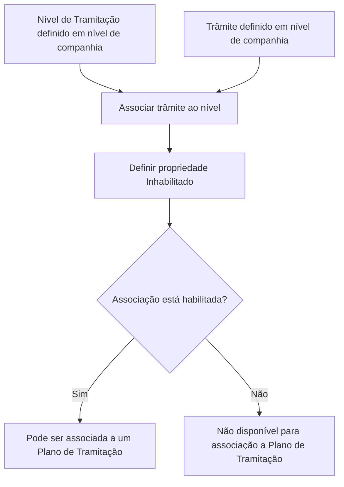

# Associação de Trâmites a Níveis de Tramitação

## 1. Metadados do Documento
- **Arquivo de Origem:** `Não identificado no conteúdo extraído`
- **Tipo de Documento:** `Manual Operacional`
- **Domínio / Sistema:** `Gestão de Trâmites, Níveis e Planos de Tramitação`
- **Público-Alvo:** `Negócio, Operação e Administradores Funcionais`
- **Data/Versão Identificada:** `Não identificada`

---

## 2. Resumo Executivo & Contexto de Negócio

O documento descreve o processo de associação de trâmites a níveis de tramitação. Níveis de tramitação são agrupações de trâmites da mesma natureza, utilizadas para organizar os passos necessários à execução de processos corporativos.

A associação deve ocorrer após a definição, em nível de companhia, dos níveis de tramitação e dos trâmites. Cada associação vincula a chave de um nível previamente registrado à chave de um trâmite também previamente registrado na companhia.

O exemplo apresentado é o **Nível de Peritação**, que agrupa os trâmites necessários para realizar uma peritação do início ao fim. Entre os passos citados estão a solicitação da peritação, a comunicação com o perito, o resultado da peritação e a comunicação com o segurado.

A propriedade **Inhabilitado** controla se uma associação entre trâmite e nível está habilitada para ser usada em um Plano de Tramitação. O documento também confirma que um mesmo trâmite pode ser associado a níveis distintos.

---

## 3. Arquitetura, Componentes & Tecnologias Envolvidas

O conteúdo não apresenta uma arquitetura técnica detalhada, tecnologias, contratos de integração, métodos HTTP, bases de dados ou ambientes. O texto menciona uma tela de manutenção denominada **Mantenimiento Asociación de Trámites a un Nivel** e referências visuais a `CF`, `Home`, `Solutions`, `APIs`, `Documentation`, `Zeus` e `EN`, sem detalhar suas funções técnicas.

O fluxo funcional identificado para manutenção de associações é:



**Nota de Análise:** O documento não detalha os componentes técnicos responsáveis pelo cadastro, persistência ou validação das chaves de níveis e trâmites.

---

## 4. Regras de Negócio, Especificações Funcionais & Processos

1. Um **Nível de Tramitação** é uma agrupação de trâmites da mesma natureza.
2. Os níveis de tramitação devem ser definidos em nível de companhia antes da associação de trâmites.
3. Um **Trâmite** corresponde a cada passo necessário para realizar um processo.
4. Os trâmites devem ser definidos em nível de companhia antes da associação a um nível.
5. A propriedade **Nivel de Tramitación** contém a chave do nível ao qual os trâmites serão associados.
6. A chave do nível deve estar previamente registrada em nível de companhia.
7. A propriedade **Trámite** contém a chave do trâmite que será associado a um nível.
8. A chave do trâmite deve estar previamente registrada em nível de companhia.
9. A propriedade **Inhabilitado** indica se a associação entre trâmite e nível está habilitada para associação a um Plano de Tramitação.
10. Um trâmite pode ser associado a diferentes níveis.
11. As descrições podem ser modificadas, conforme referência aos documentos de cartas associadas a trâmites ou estruturas associadas a trâmites.
12. O **Nível de Peritação** é apresentado como exemplo de agrupação de todos os trâmites necessários para executar uma peritação de início a fim.
13. Os trâmites exemplificados para o Nível de Peritação são:
    - Solicitud de la Peritación.
    - Comunicación con el perito.
    - Resultado de la Peritación.
    - Comunicación con el Asegurado.

---

## 5. Tabelas de Parâmetros, Ambientes e Estruturas de Dados

| Item / Parâmetro | Descrição / Função | Tipo / Valores / Formato | Ambiente / Observações |
| :--- | :--- | :--- | :--- |
| Nível de Tramitação | Agrupação de trâmites da mesma natureza. | Chave de nível. | A chave deve estar previamente registrada em nível de companhia. |
| Trâmite | Passo necessário para executar um processo e que será associado a um nível. | Chave de trâmite. | A chave deve estar previamente registrada em nível de companhia. |
| Inhabilitado | Indica se a associação entre trâmite e nível está habilitada. | Não detalhado no documento. | Define se a associação pode ser vinculada a um Plano de Tramitação. |
| Nível de Peritação | Exemplo de nível que agrupa os trâmites necessários para realizar uma peritação de início a fim. | Nível funcional. | O documento não fornece a chave correspondente. |
| Solicitud de la Peritación | Exemplo de trâmite ou passo associado ao Nível de Peritação. | Trâmite funcional. | Sem chave ou detalhamento adicional. |
| Comunicación con el perito | Exemplo de trâmite ou passo associado ao Nível de Peritação. | Trâmite funcional. | Sem chave ou detalhamento adicional. |
| Resultado de la Peritación | Exemplo de trâmite ou passo associado ao Nível de Peritação. | Trâmite funcional. | Sem chave ou detalhamento adicional. |
| Comunicación con el Asegurado | Exemplo de trâmite ou passo associado ao Nível de Peritação. | Trâmite funcional. | Sem chave ou detalhamento adicional. |
| Plano de Tramitação | Destino de uso para associações habilitadas entre nível e trâmite. | Não detalhado no documento. | Uma associação inabilitada não pode ser associada ao plano. |

---

## 6. Bateria de Perguntas & Respostas para RAG (FAQ Sintético)

### P1: O que é um Nível de Tramitação?
**R:** Um Nível de Tramitação é uma agrupação de trâmites da mesma natureza. O documento utiliza o Nível de Peritação como exemplo de um nível que reúne todos os passos necessários para executar uma peritação de início a fim.

### P2: O que representa um trâmite no processo de associação?
**R:** Um trâmite é cada passo necessário para realizar um processo. Na associação, a propriedade Trámite contém a chave do trâmite que será vinculado a um nível de tramitação.

### P3: Quais pré-requisitos existem para associar um trâmite a um nível?
**R:** A chave do nível de tramitação e a chave do trâmite devem estar previamente registradas em nível de companhia antes que a associação seja realizada.

### P4: Qual é a função da propriedade Nivel de Tramitación?
**R:** A propriedade Nivel de Tramitación contém a chave do nível ao qual os trâmites serão associados. Essa chave deve estar registrada previamente em nível de companhia.

### P5: Qual é a função da propriedade Trámite?
**R:** A propriedade Trámite contém a chave do trâmite que está sendo associado a um nível. A chave do trâmite também deve estar previamente registrada em nível de companhia.

### P6: O que a propriedade Inhabilitado controla?
**R:** A propriedade Inhabilitado indica se a associação entre o trâmite e o nível está habilitada ou não para poder ser associada a um Plano de Tramitação.

### P7: Uma associação inabilitada pode ser usada em um Plano de Tramitação?
**R:** Não. Conforme o documento, a propriedade Inhabilitado determina se a associação entre trâmite e nível está habilitada para associação a um Plano de Tramitação.

### P8: Um mesmo trâmite pode ser associado a mais de um nível?
**R:** Sim. O documento confirma explicitamente que um trâmite pode ser associado a diferentes níveis.

### P9: Quais trâmites são citados como exemplos para o Nível de Peritação?
**R:** Os exemplos apresentados são Solicitud de la Peritación, Comunicación con el perito, Resultado de la Peritación e Comunicación con el Asegurado.

### P10: O documento detalha métodos HTTP, contratos JSON ou integrações técnicas?
**R:** Não. O documento descreve o comportamento funcional da associação entre níveis e trâmites, mas não detalha métodos HTTP, contratos JSON, integrações, tecnologias, bancos de dados ou mecanismos de persistência.

---

## 7. Glossário de Termos, Siglas & Conceitos-Chave

- **Nível de Tramitação:** Agrupação de trâmites da mesma natureza.
- **Trâmite:** Cada passo necessário para realizar um processo.
- **Associação de Trâmites a um Nível:** Vínculo entre a chave de um nível de tramitação e a chave de um trâmite.
- **Nível de Peritação:** Exemplo de nível que reúne os trâmites necessários para realizar uma peritação de início a fim.
- **Peritação:** Processo mencionado como exemplo de domínio funcional; o documento não fornece definição adicional.
- **Plano de Tramitação:** Estrutura à qual uma associação habilitada entre trâmite e nível pode ser associada.
- **Inhabilitado:** Propriedade que indica se uma associação entre trâmite e nível está habilitada para uso em um Plano de Tramitação.
- **Companhia:** Escopo organizacional no qual as chaves de níveis e trâmites devem estar previamente registradas.

---

## 8. Notas Críticas, Riscos & Limitações

- O documento não informa o nome do arquivo, data, versão, autor ou responsável pelo processo.
- Não há especificação de tipos de dados, formato das chaves, obrigatoriedade dos campos ou mensagens de validação.
- Não são documentadas tecnologias, APIs, endpoints, métodos HTTP, contratos JSON, banco de dados ou mecanismos de integração.
- O documento não detalha como a propriedade **Inhabilitado** é representada ou alterada.
- A referência a `CF`, `Home`, `Solutions`, `APIs`, `Documentation`, `Zeus` e `EN` aparece no conteúdo extraído, mas não possui explicação funcional ou técnica.
- A possibilidade de modificar descrições é citada em referência a documentos de cartas associadas a trâmites ou estruturas associadas a trâmites, sem detalhar o processo de modificação.

---

## 9. Conteúdo Bruto Estruturado (Referência Fiel)

```text
--- [PÁGINA 1 DE 3] ---

DEFINICIÓN Asociar Trámites a Nivel
Objetivo
La finalidad de este documento, es explicar como se le puede asociar trámites a los distintos niveles.
Los niveles, son agrupaciones de trámites de la misma naturaleza.
Una vez que se han definido los distintos Niveles de tramitación a nivel de compañía y se han
definido los distintos Trámites, se tiene que realizar la asociación de los trámites a cada nivel.
Imagen del Mantenimiento Asociación de Trámites a un Nivel:
 / 
 CF
Home Solutions APIs Documentation Zeus
EN


--- [PÁGINA 2 DE 3] ---

Propiedades
Nivel de Tramitación
El Nivel es la agrupación de trámites de la misma naturaleza. Esta propiedad contendrá la clave del
nivel al que se le va a asociar los trámites.La clave del nivel tiene que estar registrada previamente a
nivel de compañía.
Por ejemplo:
Nivel de Peritación
Agrupará todos los trámites necesarios para realizar una peritación de inicio a fin.
Trámite
El trámite es cada Paso que se requiere para realizar un proceso. Esta propiedad contendrá la clave
del trámite que se está asociando a un nivel. La clave del trámite tiene que estar registrada a nivel de
compañía.
Por ejemplo en el Nivel de Peritación se podrían asociar los siguientes trámites o pasos:
Solicitud de la Peritación


--- [PÁGINA 3 DE 3] ---

Comunicación con el perito
Resultado de la Peritación
Comunicación con el Asegurado
Inhabilitado
Esta propiedad indica si la asociación del trámite al nivel, está habilitada o no, para poder asociarlo a
un Plan de Tramitación.
Preguntas frecuentes
¿Se puede asociar un trámite a distintos niveles?
Si, y como hemos visto en los documentos de cartas asociadas a trámites o estructuras
asociadas a trámites, podemos modificar las descripciones.
```
