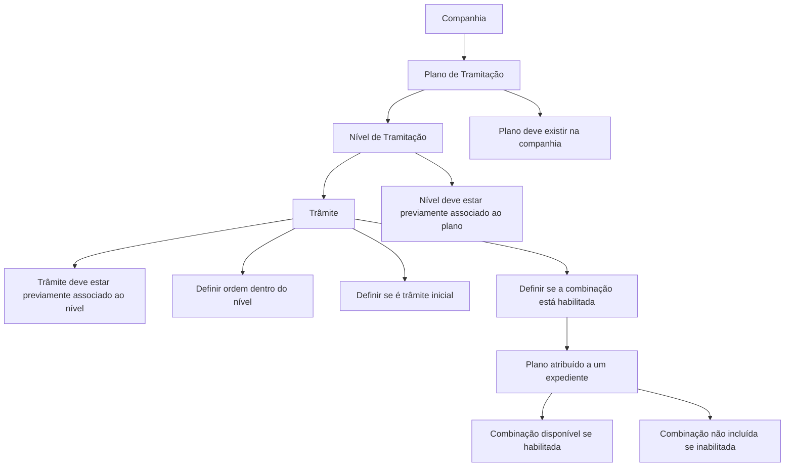

# Definição de Associação de Trâmites e Níveis a Planos de Tramitação

## 1. Metadados do Documento
- **Arquivo de Origem:** Não identificado no conteúdo fornecido
- **Tipo de Documento:** Especificação Funcional
- **Domínio / Sistema:** Planos de Tramitação — Danos Materiais
- **Público-Alvo:** Analistas funcionais, configuradores de planos de tramitação e tramitadores
- **Data/Versão Identificada:** Não identificada

---

## 2. Resumo Executivo & Contexto de Negócio

O documento define como configurar um plano de tramitação completo por meio da associação entre um plano, seus níveis de tramitação e os trâmites disponíveis em cada nível. A finalidade é determinar quais trâmites poderão ser utilizados em cada nível de um plano previamente definido.

A associação de um nível a um plano não torna a execução daquele nível obrigatória. A associação de um trâmite a um nível também não obriga sua execução: essas associações disponibilizam possibilidades de atuação que poderão ser usadas quando necessárias no expediente.

A configuração depende de associações prévias. O plano de tramitação deve existir em nível de companhia; o nível precisa ter sido associado anteriormente ao plano; e o trâmite precisa ter sido associado previamente ao nível de tramitação.

O documento exemplifica o plano `PL001 — Plan Daños Materiales`, com níveis relacionados à comprovação de apólice, documentação, perícia e pagamento a fornecedor. Para cada relação entre plano, nível e trâmite, são definidos a ordem de exibição, o indicador de trâmite inicial e a condição de habilitação.

---

## 3. Arquitetura, Componentes & Tecnologias Envolvidas

Não há tecnologias, protocolos, microsserviços, URLs, ambientes ou componentes de infraestrutura descritos no conteúdo fornecido. O documento apresenta uma estrutura funcional de configuração composta pelos seguintes elementos:

- **Plano de Tramitação:** entidade que agrega níveis e trâmites.
- **Nível:** etapa de tramitação associada previamente ao plano.
- **Trâmite:** atividade associada previamente a um nível.
- **Ordem do Trâmite dentro do Nível:** posição de apresentação do trâmite dentro de um nível.
- **Indicador Inicial:** determina se o trâmite é normalmente necessário ao tramitar o nível.
- **Indicador de Inabilitação:** determina se a combinação plano, nível e trâmite estará disponível quando o plano for atribuído a um expediente.
- **Expediente:** contexto no qual o plano de tramitação é atribuído e seus trâmites podem ser incluídos.



---

## 4. Regras de Negócio, Especificações Funcionais & Processos

### 4.1 Objetivo da associação

A associação de trâmites e níveis a um plano tem como objetivo definir um plano de tramitação completo. Para os níveis previamente associados ao plano, são definidos os trâmites que serão associados a cada nível.

Antes dessa definição, devem existir duas configurações anteriores:

1. Os trâmites devem ter sido associados aos níveis.
2. Os níveis possíveis devem ter sido associados ao plano em definição.

### 4.2 Regra de obrigatoriedade

Associar um nível a um plano não significa que o nível seja obrigatório. O nível fica disponível para execução caso seja necessário.

Da mesma forma, associar um trâmite a um nível de um plano não significa que o trâmite seja obrigatório. O trâmite fica disponível para inclusão e execução quando necessário.

### 4.3 Regra do Plano de Tramitação

A propriedade **Plano de Tramitação** contém a chave do plano ao qual serão associados os níveis e trâmites.

A chave do plano deve existir no nível da companhia.

**Exemplo apresentado:**

- `PL01 — Plan de Daños Materiales`

O exemplo tabular usa também a chave `PL001` para o plano `Plan Daños Materiales`.

### 4.4 Regra do Nível

A propriedade **Nível** contém a chave ou código do nível que será associado ao plano.

O código do nível deve estar associado previamente ao plano de tramitação, no contexto de “Niveles de un Plan”.

**Níveis exemplificados:**

- `N01 — Comprobación de Póliza`
- `N02 — Nivel de Documentación`
- `N03 — Nivel de Peritación`
- `N04 — Nivel Pago a Proveedor`

### 4.5 Regra do Trâmite

A propriedade **Trâmite** contém a chave usada para identificar os diferentes trâmites.

Para associar um trâmite a um plano e a um nível, o trâmite deve estar previamente associado ao nível de tramitação, no contexto de “Trámites de un Nivel”.

### 4.6 Regra de ordem do trâmite

A propriedade **Orden del Trámite dentro del Nivel** determina a posição que o trâmite ocupará dentro do nível.

Quando um nível possuir vários trâmites, a ordem define a sequência de apresentação de cada trâmite configurado.

### 4.7 Regra de trâmite inicial

São definidos como **trâmites iniciais** os trâmites normalmente necessários para tramitar um nível de tramitação.

Quando um trâmite for necessário apenas em poucas ocasiões ou for excepcional, ele deve ser indicado para não aparecer inicialmente. Mesmo não sendo inicial, o tramitador pode incluí-lo no plano do expediente se necessário.

Se um nível possuir somente um trâmite, esse trâmite deve obrigatoriamente ser inicial.

### 4.8 Regra de habilitação

A propriedade **Está Inhabilitado?** informa se a combinação de plano, nível e trâmite está inabilitada.

- Se a combinação estiver habilitada, o plano de tramitação terá essa combinação quando o plano for atribuído a um expediente.
- Se a combinação não estiver habilitada, o plano de tramitação não terá essa combinação quando for atribuído a um expediente.

### 4.9 Reutilização de trâmites

Um mesmo trâmite pode estar em vários níveis de um mesmo plano sem restrição apresentada no documento.

O mesmo trâmite pode ser inicial em um nível e não inicial em outro nível do mesmo plano.

---

## 5. Tabelas de Parâmetros, Ambientes e Estruturas de Dados

### 5.1 Propriedades de configuração

| Item / Parâmetro | Descrição / Função | Tipo / Valores / Formato | Ambiente / Observações |
| :--- | :--- | :--- | :--- |
| Plano de Tramitação | Contém a chave do plano ao qual níveis e trâmites serão associados. | Chave de plano; exemplo: `PL01` ou `PL001`. | A chave deve existir no nível da companhia. |
| Nível | Contém a chave ou código do nível associado ao plano. | Código de nível; exemplos: `N01`, `N02`, `N03`, `N04`. | O nível deve estar previamente associado ao plano. |
| Trâmite | Contém a chave de identificação dos trâmites. | Chave de trâmite; exemplos: `T1` a `T10`, `T14`. | O trâmite deve estar previamente associado ao nível. |
| Ordem do Trâmite dentro do Nível | Define a posição do trâmite quando o nível tiver vários trâmites. | Número sequencial. | Determina a ordem de apresentação no nível. |
| Inicial? | Indica se o trâmite normalmente é necessário para tramitar o nível. | `S` ou `N`. | Se o nível tiver apenas um trâmite, o trâmite deve ser inicial. |
| Está Inhabilitado? | Indica se a combinação plano, nível e trâmite está inabilitada. | Condição de habilitação ou inabilitação. | Combinações inabilitadas não são incluídas ao atribuir o plano a um expediente. |

### 5.2 Plano e níveis exemplificados

| Plano | Descrição do Plano | Nível | Descrição do Nível |
| :--- | :--- | :--- | :--- |
| `PL001` | Plan Daños Materiales | `N01` | Comprobación de Póliza |
| `PL001` | Plan Daños Materiales | `N02` | Nivel de Documentación |
| `PL001` | Plan Daños Materiales | `N03` | Nivel de Peritación |
| `PL001` | Plan Daños Materiales | `N04` | Nivel Pago a Proveedor |

### 5.3 Trâmites e ordem por nível

| Plano | Nível | Trâmite | Descrição do Trâmite | Ordem do Trâmite |
| :--- | :--- | :--- | :--- | :--- |
| `PL001` | `N01` | `T1` | Comprobar Recibos | 1 |
| `PL001` | `N02` | `T2` | Registrar Documentos | 1 |
| `PL001` | `N02` | `T3` | Carta de Solicitud Documentos | 2 |
| `PL001` | `N03` | `T4` | Solicitud de Peritación | 1 |
| `PL001` | `N03` | `T5` | Fijar Asegurado Nueva cita | 2 |
| `PL001` | `N03` | `T6` | Nueva Solicitud de Peritación | 3 |
| `PL001` | `N03` | `T7` | Resultado de la Peritación | 4 |
| `PL001` | `N03` | `T8` | Comunicación Entrega Vehículo | 5 |
| `PL001` | `N03` | `T9` | Confirmación Pérdida Total | 6 |
| `PL001` | `N03` | `T10` | Comunicación Asegurado Pérdida Total | 7 |
| `PL001` | `N04` | `T14` | Pago al Taller | 1 |

### 5.4 Indicador de trâmite inicial

| Plano | Nível | Trâmite | Ordem | Inicial? | Observação |
| :--- | :--- | :--- | :--- | :--- | :--- |
| `PL001` | `N01` — Comprobación de Póliza | `T1` — Comprobar Recibos | 1 | `S` | Trâmite inicial. |
| `PL001` | `N02` — Nivel de Documentación | `T2` — Registrar Documentos | 1 | `S` | Trâmite inicial. |
| `PL001` | `N02` — Nivel de Documentación | `T3` — Carta de Solicitud Documentos | 2 | `N` | Pode ser incluído pelo tramitador se necessário. |
| `PL001` | `N03` — Nivel de Peritación | `T4` — Solicitud de Peritación | 1 | `S` | Trâmite inicial. |
| `PL001` | `N03` — Nivel de Peritación | `T5` — Fijar Asegurado Nueva cita | 2 | `N` | Pode ser incluído pelo tramitador se necessário. |
| `PL001` | `N03` — Nivel de Peritación | `T6` — Nueva Solicitud de Peritación | 3 | `N` | Pode ser incluído pelo tramitador se necessário. |
| `PL001` | `N03` — Nivel de Peritación | `T7` — Resultado de la Peritación | 4 | `S` | Trâmite inicial. |
| `PL001` | `N03` — Nivel de Peritación | `T8` — Comunicación Entrega Vehículo | 5 | `S` | Trâmite inicial. |
| `PL001` | `N03` — Nivel de Peritación | `T9` — Confirmación Pérdida Total | 6 | `N` | Pode ser incluído pelo tramitador se necessário. |
| `PL001` | `N03` — Nivel de Peritación | `T10` — Comunicación Asegurado Pérdida Total | 7 | `N` | Pode ser incluído pelo tramitador se necessário. |
| `PL001` | `N04` — Nivel Pago a Proveedor | `T14` — Pago al Taller | 1 | `S` | Trâmite inicial. |

---

## 6. Bateria de Perguntas & Respostas para RAG (FAQ Sintético)

### P1: Qual é a finalidade de associar trâmites e níveis a um plano de tramitação?
**R:** A finalidade é definir um plano de tramitação completo. Para cada nível previamente associado ao plano, a configuração define quais trâmites estarão associados a esse nível.

### P2: Associar um nível a um plano torna a execução do nível obrigatória?
**R:** Não. A associação de um nível a um plano não significa que o nível seja obrigatório. A associação apenas permite que o nível seja executado caso seja necessário.

### P3: Quais pré-requisitos devem ser atendidos antes de associar um trâmite a um plano e nível?
**R:** O nível deve ter sido associado previamente ao plano de tramitação, e o trâmite deve ter sido associado previamente ao nível de tramitação. Além disso, a chave do plano deve existir no nível da companhia.

### P4: O que representa a ordem do trâmite dentro do nível?
**R:** A ordem do trâmite dentro do nível determina a posição que o trâmite ocupará quando existirem vários trâmites no mesmo nível. No nível `N03 — Nivel de Peritación`, por exemplo, `T4 — Solicitud de Peritación` possui ordem 1 e `T10 — Comunicación Asegurado Pérdida Total` possui ordem 7.

### P5: O que significa marcar um trâmite como inicial?
**R:** Um trâmite inicial é aquele normalmente necessário para tramitar determinado nível. Trâmites necessários apenas em poucas ocasiões ou excepcionais devem ser definidos para não aparecer inicialmente, embora possam ser incluídos pelo tramitador no plano do expediente quando necessário.

### P6: Qual é a regra para um nível que possui somente um trâmite?
**R:** Se o nível possuir apenas um trâmite, esse trâmite deve ser inicial. No exemplo, `N01` possui `T1 — Comprobar Recibos` como trâmite inicial e `N04` possui `T14 — Pago al Taller` como trâmite inicial.

### P7: Quais trâmites do nível `N03 — Nivel de Peritación` são iniciais?
**R:** No nível `N03`, os trâmites iniciais são `T4 — Solicitud de Peritación`, `T7 — Resultado de la Peritación` e `T8 — Comunicación Entrega Vehículo`. Os trâmites `T5`, `T6`, `T9` e `T10` não são iniciais.

### P8: O que acontece quando uma combinação de plano, nível e trâmite está inabilitada?
**R:** Quando a combinação está inabilitada, ela não faz parte do plano de tramitação no momento em que o plano é atribuído a um expediente. Quando a combinação está habilitada, ela passa a integrar o plano atribuído ao expediente.

### P9: Um mesmo trâmite pode ser associado a vários níveis do mesmo plano?
**R:** Sim. O documento afirma que não há problema em utilizar um mesmo trâmite em vários níveis de um mesmo plano.

### P10: Um mesmo trâmite pode ser inicial em um nível e não inicial em outro nível do mesmo plano?
**R:** Sim. O documento informa explicitamente que um trâmite pode ser inicial em um nível e não ser inicial em outro nível do mesmo plano.

---

## 7. Glossário de Termos, Siglas & Conceitos-Chave

- **Plano de Tramitação:** plano que organiza níveis e trâmites disponíveis para tratamento de um expediente.
- **Nível:** etapa de tramitação que pode ser associada a um plano.
- **Trâmite:** atividade identificada por uma chave e associada a um nível de tramitação.
- **Trâmite Inicial:** trâmite normalmente necessário para tramitar determinado nível.
- **Expediente:** contexto ao qual um plano de tramitação é atribuído.
- **Inabilitado:** estado no qual a combinação de plano, nível e trâmite não é incluída no plano quando este é atribuído a um expediente.
- **`PL001`:** identificador usado no exemplo para `Plan Daños Materiales`.
- **`N01`:** nível `Comprobación de Póliza`.
- **`N02`:** nível `Nivel de Documentación`.
- **`N03`:** nível `Nivel de Peritación`.
- **`N04`:** nível `Nivel Pago a Proveedor`.
- **`T1` a `T10`, `T14`:** chaves de identificação dos trâmites apresentados no exemplo.
- **`S`:** indicador de que o trâmite é inicial.
- **`N`:** indicador de que o trâmite não é inicial.

---

## 8. Notas Críticas, Riscos & Limitações

- **Nota de Análise:** O conteúdo fornecido não identifica o nome do arquivo, autor, versão, data, sistema de origem ou ambiente de execução.
- **Nota de Análise:** O documento não detalha interfaces de usuário, APIs, métodos HTTP, contratos JSON, persistência de dados, regras de autorização ou integrações técnicas.
- **Nota de Análise:** A propriedade **Está Inhabilitado?** é descrita funcionalmente, mas o documento não apresenta valores de exemplo para combinações habilitadas ou inabilitadas.
- **Risco de configuração:** Associar um nível ou trâmite não o torna obrigatório; portanto, processos que dependam da execução obrigatória de etapas não estão especificados neste conteúdo.
- **Risco de dependência:** A associação depende da existência prévia do plano na companhia, do nível no plano e do trâmite no nível. O documento não descreve como essas associações prévias são criadas ou validadas.
- **Limitação de nomenclatura:** Há uma diferença entre o exemplo textual `PL01 — Plan de Daños Materiales` e o código `PL001` usado nas tabelas. O documento não explica se ambos representam o mesmo identificador ou exemplos distintos.

---

## 9. Conteúdo Bruto Estruturado (Referência Fiel)

```text
--- [PÁGINA 1 DE 6] ---

DEFINICIÓN Asociar Trámites y Niveles al Plan
Objetivo
La finalidad es definir un plan de tramitación completo, es decir a los niveles que le se le ha
asociado anteriormente al plan, se le van a definir que trámites se le van a asociar a cada uno de
esos niveles.
Previa a esta definición se han asociado los trámites a los niveles, y se ha asociado al plan que se
está definiendo, los niveles posibles.
El asociar un nivel a un plan no significa que sea obligatorio realizarlo, sino que van a tener la
posibilidad, si se necesita,de ejecutarlo. Lo mismo pasa al asociar un trámite a un nivel del plan que
se está definiendo.
Imagen del Asociación de Trámites y Niveles a Planes de Tramitación:
 / 
 CF
Home Solutions APIs Documentation Zeus
EN


--- [PÁGINA 2 DE 6] ---

Propiedades
Plan de Tramitación
Esta propiedad contendrá la clave del Plan de Tramitación al cual se le va a asociar los distintos
niveles y trámites. Esta clave tiene que existir a nivel de compañía.
Ejemplo:
PL01- Plan de Daños Materiales
Nivel
Esta propiedad contendrá la clave o el código del nivel que se está asociando al plan. Este código de
Nivel tiene que estar asociado previamente al plan de tramitación Niveles de un Plan
Ejemplo:
PLAN NIVEL
PL001 Plan Daños Materiales N01 Comprobación de Póliza


--- [PÁGINA 3 DE 6] ---

PLAN NIVEL
N02 Nivel de Documentación
N03 Nivel de Peritación
Trámite
Esta propiedad contendrá la clave por la que se van a identificar los distintos Trámites. Para poder
asociar el trámite al plan y al nivel que se está definiendo, tiene que estar previamente asociado al
Nivel de tramitación. Trámites de un Nivel.
Orden del Trámite dentro del Nivel
Esta propiedad va a tener el orden que va a ocupar el Trámite dentro del Nivel. Es decir cuando en
nivel tenga varios trámites en que orden va a aparecer este que se está definiendo.
PLAN NIVEL TRÁMITE ORDEN DEL
TRÁMITE
PL001 Plan
Daños
Materiales
N01 Comprobación
de Póliza
T1- Comprobar Recibos __1 __
N02 Nivel de
Documentación
T2- Registrar
Documentos
1
T3- Carta de Solicitud
Documentos
2
N03 Nivel de
Peritación
T4 Solicitud de
Peritación
1
T5 Fijar Asegurado
Nueva cita
2
T6 Nueva Solicitud de
Peritación
3


--- [PÁGINA 4 DE 6] ---

PLAN NIVEL TRÁMITE ORDEN DEL
TRÁMITE
T7 Resultado de la
Peritación
4
T8 Comunicación
Entrega Vehículo
5
T9 Confirmación
Pérdida Total
6
T10 Comunicación
Asegurado Pérdida
Total
7
N04 Nivel Pago a
Proveedor
T14 - Pago al Taller 1
¿Es Un Trámite Inicial ?
Se definirán como Trámites iniciales aquellos que se van a necesitar normalmente para tramitar el
nivel de tramitación.
Si el trámite se va a necesitar en pocas ocasiones o es excepcional, se indicará que NO salga
inicialmente, aunque si el tramitador lo necesita, podrá incluirlo en el plan del expediente. Si el nivel
sólo tiene un trámite, este tiene que ser Inicial.
Ejemplo:
PLAN NIVEL TRÁMITE ORDEN INICIAL?
PL001 Plan
Daños
Materiales
N01 Comprobación
de Póliza
T1- Comprobar
Recibos
1 S
N02 Nivel de
Documentación
T2- Registrar
Documentos
1 S


--- [PÁGINA 5 DE 6] ---

PLAN NIVEL TRÁMITE ORDEN INICIAL?
T3- Carta de
Solicitud
Documentos
2 N
N03 Nivel de
Peritación
T4 Solicitud de
Peritación
1 S
T5 Fijar Asegurado
Nueva cita
2 N
T6 Nueva Solicitud
de Peritación
3 N
T7 Resultado de la
Peritación
4 S
T8 Comunicación
Entrega Vehículo
5 S
T9 Confirmación
Pérdida Total
6 N
T10 Comunicación
Asegurado Pérdida
Total
7 N
N04 Nivel Pago a
Proveedor
T14 - Pago al Taller 1 S
Está Inhabilitado?
Esta propiedad indica si la combinación de plan, nivel, trámite está inhabilitado o no. Si está
habilitado cuando se asigne el plan a un expediente el plan de tramitación tendrá esta combinación,
si no está habilitado no.
Preguntas frecuentes


--- [PÁGINA 6 DE 6] ---

¿Un Trámite puede estar en varios Niveles de un mismo plan? Si, no hay problema. Incluso en
un nivel puede ser inicial y otro nivel del mismo plan no.
```
