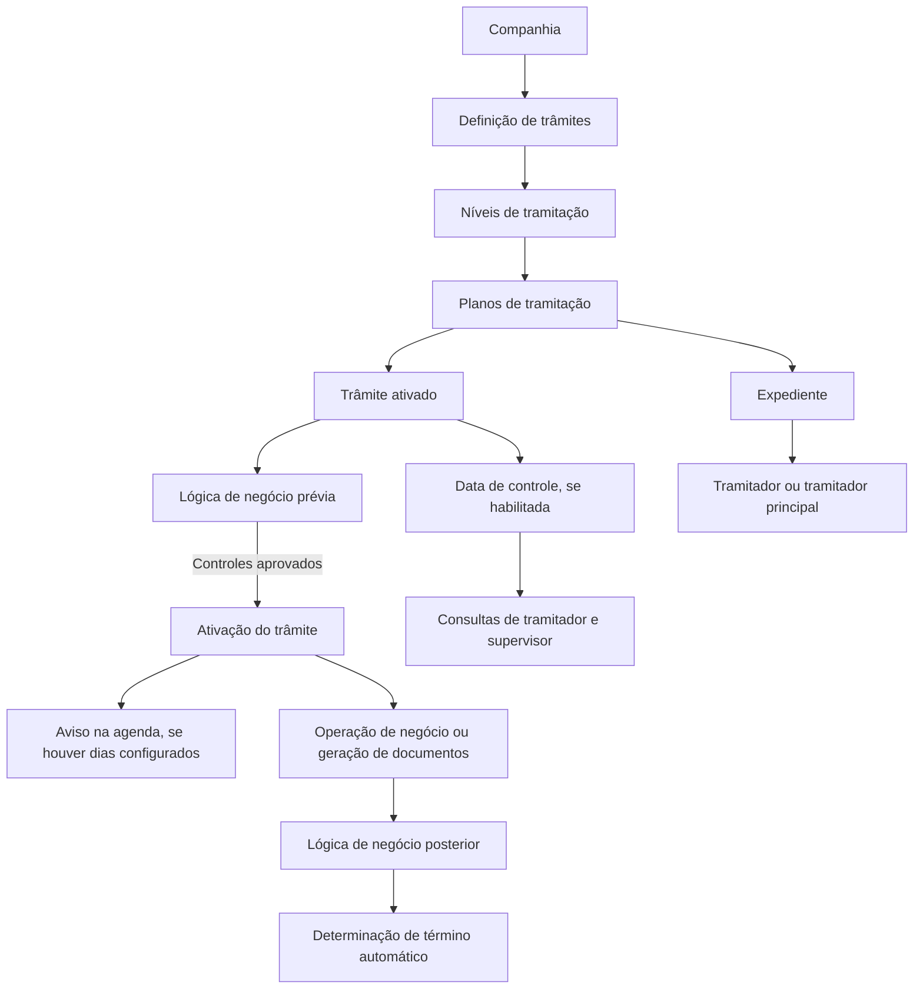

# Definição de Trâmites para Planos de Tramitação

## 1. Metadados do Documento
- **Arquivo de Origem:** Não identificado — conteúdo bruto fornecido com 6 páginas.
- **Tipo de Documento:** Especificação Técnica
- **Domínio / Sistema:** Planos de tramitação, expedientes e gestão de trâmites.
- **Público-Alvo:** Tramitadores, supervisores, equipes funcionais e equipes responsáveis pela configuração de planos de tramitação.
- **Data/Versão Identificada:** Não identificada.

---

## 2. Resumo Executivo & Contexto de Negócio

O documento define o conceito de **trâmite** no contexto de planos de tramitação corporativos. Um trâmite representa cada passo necessário para executar um processo, como uma solicitação de perícia, comunicação com um perito, registro de resultado de perícia ou comunicação com o segurado.

A definição dos trâmites ocorre inicialmente em nível de companhia. Posteriormente, os trâmites devem ser associados a níveis de tramitação, que agrupam trâmites de mesma natureza. Um mesmo código de trâmite pode ser reutilizado em múltiplos níveis e múltiplos planos de tramitação, permitindo diferentes comportamentos conforme o nível ou plano associado.

A configuração de um trâmite inclui identificação, nomes descritivos, geração de avisos, lógicas de negócio executadas antes ou depois da ativação, regras de término automático, permissões relacionadas a expedientes terminados, inclusão manual e controles de prazo.

O documento também descreve regras para a gestão de datas de controle. Essas datas permitem acompanhar o prazo máximo de resolução de um trâmite, consultar trâmites vencidos ou reprogramados e restringir a alteração de datas conforme regras legais, permissões do tramitador e configuração da companhia.

---

## 3. Arquitetura, Componentes & Tecnologias Envolvidas

O documento não descreve tecnologias, servidores, APIs, bancos de dados, métodos HTTP, contratos JSON ou ferramentas de integração. O conteúdo apresenta uma arquitetura funcional composta por companhia, planos de tramitação, níveis de tramitação, trâmites, expedientes, tramitadores, supervisores e processos automáticos ou batch.

### Componentes funcionais identificados

| Componente | Papel identificado |
| :--- | :--- |
| Companhia | Nível no qual os trâmites devem ser inicialmente definidos. |
| Trâmite | Passo necessário para executar um processo dentro de um plano de tramitação. |
| Plano de tramitação | Estrutura que utiliza os trâmites e interpreta parâmetros como término automático, execução em expediente terminado e inclusão manual. |
| Nível de tramitação | Agrupamento de trâmites de mesma natureza. |
| Expediente | Entidade cujo estado, atribuição e condições influenciam a execução do trâmite. |
| Tramitador | Usuário que trabalha, conclui ou, conforme configuração, inclui trâmites manualmente. |
| Tramitador principal | Tramitador ao qual o expediente está atribuído; pode ser o único autorizado a modificar a data de controle. |
| Supervisor | Usuário que possui consultas específicas relacionadas a datas de controle. |
| Processo batch / processo automático | Processo que pode inserir trâmites que não estejam disponíveis para inclusão manual. |
| Operação de negócio | Operação executada por um trâmite, quando definida. |
| Documentos | Documentos que podem ser gerados por um trâmite e que podem acionar lógica posterior à ativação. |
| Agenda | Contexto no qual avisos são gerados após o período configurado. |



> **Nota de Análise:** O documento apresenta uma arquitetura funcional, mas não detalha implementação técnica, persistência de dados, integrações, serviços, interfaces ou tecnologias utilizadas.

---

## 4. Regras de Negócio, Especificações Funcionais & Processos

### 4.1 Definição e reutilização de trâmites

1. Um trâmite é cada passo necessário para realizar um processo.
2. Os trâmites devem ser definidos inicialmente em nível de companhia.
3. Após a definição em nível de companhia, os trâmites devem ser associados a níveis de tramitação.
4. Os níveis de tramitação agrupam trâmites de mesma natureza.
5. Um mesmo código de trâmite pode ser associado a vários níveis de tramitação.
6. Em níveis diferentes, o mesmo trâmite pode possuir comportamento diferente, podendo ser inicial em alguns níveis e não inicial em outros.
7. A reutilização de trâmites é recomendada para facilitar a manutenção.
8. Um mesmo código de trâmite pode ser associado a vários planos de tramitação.
9. O comportamento de um trâmite pode variar conforme o plano de tramitação no qual estiver associado.

### 4.2 Identificação e nomenclatura

1. O código de trâmite é a chave usada para identificar os diferentes trâmites.
2. O nome do trâmite contém a descrição do código de trâmite.
3. O nome curto do trâmite é destinado ao uso em telas, consultas, listagens e outros contextos nos quais não haja espaço para o nome completo.

### 4.3 Avisos na agenda

1. Quando o campo **Número de Dias para o Aviso** possui conteúdo, um aviso deve ser gerado sempre que o trâmite for ativado.
2. O número configurado representa a quantidade de dias a adicionar à data de ativação do trâmite.
3. A data do aviso é calculada pela soma entre a data de ativação e o número de dias configurado.
4. O campo **Texto do Aviso** somente permanece ativo quando o campo **Número de Dias para o Aviso** estiver informado.
5. O texto do aviso é exibido ao tramitador quando a data corrente for maior ou igual à data do aviso.

### 4.4 Lógica de negócio prévia à ativação

1. Um trâmite pode conter lógica de negócio prévia à sua ativação.
2. A lógica prévia pode realizar controles ou verificações antes de ativar o trâmite.
3. A lógica prévia é executada somente uma vez por trâmite.
4. A execução ocorre quando o trâmite é ativado ou quando se começa a trabalhar com o trâmite.
5. Caso uma validação prévia não seja satisfeita, a ativação do trâmite pode ser impedida.

**Exemplo documentado:** antes de ativar um trâmite de geração de liquidação para o segurado, deve-se verificar se todos os documentos obrigatórios foram recebidos. Caso documentos obrigatórios não tenham sido recebidos, a ativação não deve ser permitida.

### 4.5 Lógica de negócio posterior à ativação

1. Um trâmite pode conter lógica de negócio posterior à ativação.
2. A lógica posterior pode realizar controles ou verificações depois da ativação.
3. A lógica posterior é executada somente uma vez por trâmite.
4. A execução ocorre após a execução de uma operação de negócio, quando o trâmite possuir operação de negócio definida.
5. A execução também ocorre após a geração de um ou mais documentos, quando o trâmite possuir documentos definidos.

**Exemplo documentado:** após registrar o resultado de uma perícia, a lógica posterior pode verificar se o resultado indica perda total. Se houver perda total, a lógica pode:
- Inserir automaticamente o trâmite de confirmação ou não confirmação da perda total.
- Inserir automaticamente o trâmite para abrir um expediente de recuperação do tipo salvamento.

### 4.6 Término automático do trâmite

1. O parâmetro de término automático informa ao plano de tramitação se o trâmite deve ser encerrado automaticamente após a ativação e execução de operação, geração de carta ou ação equivalente.
2. Quando o trâmite não deve ser encerrado automaticamente, ele permanece pendente até que o tramitador o conclua.
3. Quando a decisão de término não puder ser representada apenas por “Sim” ou “Não”, pode ser definida uma lógica de negócio específica.
4. A lógica de negócio de término automático determina se o trâmite será concluído conforme as circunstâncias do expediente.

**Exemplo documentado:** um trâmite de geração de liquidações para fornecedores deve permanecer pendente após gerar uma liquidação para um fornecedor, não sendo terminado automaticamente.

### 4.7 Execução em expediente terminado

1. O parâmetro de execução em expediente terminado informa ao plano de tramitação se o trâmite pode ser executado quando o expediente já está terminado.
2. Exemplos para os quais seria razoável utilizar a marca “S”:
   - Trâmite de reabilitação.
   - Trâmite de realização de liquidação em expediente terminado.
   - Trâmite de envio de documentação.
3. Exemplos para os quais não faria sentido utilizar a marca “S”:
   - Trâmite que chama alteração de avaliação, pois um expediente terminado não pode executar essa alteração.
   - Trâmite de término do expediente, pois não é possível terminar novamente um expediente já terminado.
   - Trâmite para modificar dados do expediente.

### 4.8 Inclusão manual

1. O parâmetro de inclusão manual informa ao plano de tramitação se o tramitador pode incluir o trâmite manualmente.
2. Podem existir trâmites que sejam incluídos exclusivamente por processo batch ou processo automático.
3. Trâmites exclusivamente automáticos não devem estar disponíveis para inclusão manual pelo tramitador.

### 4.9 Datas de controle

1. O **Número de Dias de Controle** representa o número máximo de dias dentro do qual o trâmite deve ser resolvido, contado a partir de sua ativação.
2. O número de dias de controle somente pode ser informado quando o parâmetro de companhia relativo à data de controle possuir valor “S”.
3. O cálculo da data de controle deve considerar o parâmetro de companhia que determina se o calendário será considerado.
4. A data de controle possui consultas específicas no menu do tramitador e do supervisor.
5. Entre as consultas citadas estão:
   - Trâmites com data de controle.
   - Trâmites vencidos, cuja data de controle seja menor que a data corrente.
   - Trâmites reprogramados.
6. A possibilidade de modificar a data de controle depende de o plano de tramitação trabalhar com datas de controle de trâmites.
7. Quando uma data de controle estiver definida, o parâmetro correspondente determina se a data pode ou não ser modificada.
8. Trâmites sujeitos a prazo legal podem ter a alteração da data de controle impedida.
9. Quando aplicável em nível de companhia e permitido modificar a data, outro parâmetro determina se qualquer tramitador pode alterar a data ou se a alteração é exclusiva do tramitador principal do expediente.

### 4.10 Habilitação do trâmite

1. A propriedade **Inabilitado** indica se o trâmite definido está habilitado ou não para associação a um nível.
2. Um trâmite inabilitado não pode ser associado a um nível.

---

## 5. Tabelas de Parâmetros, Ambientes e Estruturas de Dados

### 5.1 Estrutura de identificação do trâmite

| Item / Parâmetro | Descrição / Função | Tipo / Valores / Formato | Ambiente / Observações |
| :--- | :--- | :--- | :--- |
| Código de Trâmite | Chave de identificação dos diferentes trâmites. | Exemplo: `T001`. | Pode ser associado a vários níveis e planos de tramitação. |
| Nome do Trâmite | Descrição vinculada ao código de trâmite. | Exemplo: `Comunicação com Asegurado`. | Nome completo do trâmite. |
| Nome Curto do Trâmite | Nome reduzido para telas, consultas e listagens sem espaço para o nome completo. | Exemplos: `COMUN-ASEG`, `SOL-PERI`, `INF-DEM`. | Utilizado como alternativa ao nome completo. |

### 5.2 Exemplos de trâmites e nomes

| Código de Trâmite | Nome do Trâmite | Nome Curto |
| :--- | :--- | :--- |
| `T001` | Comunicação Asegurado | `COMUN-ASEG` |
| `T004` | Solicitud de Peritación | `SOL-PERI` |
| `T007` | Información Demanda | `INF-DEM` |

### 5.3 Parâmetros de aviso

| Item / Parâmetro | Descrição / Função | Tipo / Valores / Formato | Ambiente / Observações |
| :--- | :--- | :--- | :--- |
| Número de Dias para o Aviso | Define quantos dias devem transcorrer após a ativação para gerar um aviso. | Número de dias. | Quando informado, gera aviso sempre que o trâmite é ativado. |
| Data de Ativação | Data em que o trâmite é ativado. | Data. | Base para cálculo da data do aviso. |
| Data do Aviso | Data em que o aviso passa a ser aplicável. | Data = data de ativação + número de dias de aviso. | O aviso é exibido quando a data corrente é maior ou igual a esta data. |
| Texto do Aviso | Texto apresentado ao tramitador após atingir a data do aviso. | Texto livre. | Só fica ativo se o número de dias para aviso estiver informado. |

| Data de Ativação | Número de Dias de Aviso | Data do Aviso |
| :--- | :--- | :--- |
| `15-07-2023` | `5` | `20-07-2023` |
| `20-07-2023` | `5` | `25-07-2023` |

### 5.4 Lógicas e parâmetros comportamentais

| Item / Parâmetro | Descrição / Função | Tipo / Valores / Formato | Ambiente / Observações |
| :--- | :--- | :--- | :--- |
| Lógica de Negócio Prévia à Ativação | Executa controles ou verificações antes de ativar o trâmite. | Lógica de negócio. | Executada somente uma vez por trâmite, durante a ativação ou início do trabalho. |
| Lógica de Negócio Posterior à Ativação | Executa controles ou verificações após a ativação. | Lógica de negócio. | Executada somente uma vez após operação de negócio ou geração de documentos, quando definidos. |
| Término Automático | Indica se o trâmite deve ser finalizado automaticamente. | Sim / Não. | Considera ativação, operação, carta ou ação equivalente. |
| Lógica de Término Automático | Determina se o trâmite termina automaticamente conforme as circunstâncias do expediente. | Lógica de negócio. | Utilizada quando Sim/Não for insuficiente. |
| Execução em Expediente Terminado | Indica se o trâmite pode ser executado com o expediente terminado. | Marca `S` ou não `S`, conforme exemplos documentados. | Aplicável a reabilitação, liquidação e envio de documentação; não aplicável a alteração de avaliação, término ou modificação de dados do expediente. |
| Inclusão Manual no Plano | Indica se o tramitador pode adicionar manualmente o trâmite. | Parâmetro de permissão. | Alguns trâmites podem ser exclusivos de batch ou processo automático. |
| Inabilitado | Indica se o trâmite está habilitado para associação a um nível. | Indicador de habilitação. | Trâmite inabilitado não pode ser associado a um nível. |

### 5.5 Parâmetros de controle de prazo

| Item / Parâmetro | Descrição / Função | Tipo / Valores / Formato | Ambiente / Observações |
| :--- | :--- | :--- | :--- |
| Número de Dias de Controle | Prazo máximo para resolver o trâmite após sua ativação. | Número de dias. | Só pode ser informado quando o parâmetro de companhia de data de controle for `S`. |
| Parâmetro de Companhia: Data de Controle | Habilita a utilização de datas de controle. | Valor `S`. | Condiciona o preenchimento do número de dias de controle. |
| Parâmetro de Companhia: Uso de Calendário | Define se o cálculo da data de controle deve considerar calendário. | Não especificado no documento. | Deve ser considerado no cálculo da data de controle. |
| Modificação da Data de Controle | Indica se a data de controle pode ser alterada. | Parâmetro de permissão. | Disponível apenas se o plano trabalhar com datas de controle. |
| Alteração por Qualquer Tramitador | Indica se qualquer tramitador pode modificar a data de controle. | Parâmetro de permissão. | Caso contrário, a modificação cabe somente ao tramitador principal do expediente. |

---

## 6. Bateria de Perguntas & Respostas para RAG (FAQ Sintético)

### P1: O que é um trâmite no contexto de um plano de tramitação?
**R:** Um trâmite é cada passo necessário para executar um processo. O documento apresenta como exemplos a solicitação de perícia, a comunicação com o perito, o registro do resultado da perícia e a comunicação com o segurado.

### P2: Em que nível os trâmites devem ser definidos inicialmente?
**R:** Os trâmites devem ser definidos inicialmente em nível de companhia. Após a definição corporativa, os trâmites devem ser associados a níveis de tramitação, que agrupam trâmites de mesma natureza.

### P3: Um código de trâmite pode ser associado a mais de um nível de tramitação?
**R:** Sim. Um código de trâmite pode ser associado a vários níveis de tramitação. O documento também informa que um mesmo trâmite pode ter comportamento diferente em níveis diferentes, podendo ser inicial em alguns níveis e não inicial em outros.

### P4: Um mesmo trâmite pode ser reutilizado em vários planos de tramitação?
**R:** Sim. Um código de trâmite pode ser associado a vários planos de tramitação, pois o comportamento do trâmite pode variar de acordo com o plano em que estiver associado. O documento recomenda reutilizar trâmites para facilitar a manutenção.

### P5: Como é calculada a data de um aviso de trâmite?
**R:** A data do aviso é calculada pela soma do número de dias para aviso à data de ativação do trâmite. Por exemplo, para uma ativação em `15-07-2023` e um prazo de cinco dias, a data do aviso é `20-07-2023`.

### P6: Quando o texto de aviso é exibido ao tramitador?
**R:** O texto de aviso é exibido quando a data corrente for maior ou igual à data do aviso. O campo de texto do aviso somente fica ativo quando o número de dias para aviso estiver informado.

### P7: Qual é a diferença entre lógica de negócio prévia e posterior à ativação?
**R:** A lógica prévia é executada uma única vez antes ou durante a ativação do trâmite e pode impedir a ativação caso uma validação não seja satisfeita. A lógica posterior é executada uma única vez depois da ativação, após uma operação de negócio ou geração de documentos, quando esses elementos estiverem definidos para o trâmite.

### P8: Como pode ser tratado um resultado de perícia que indique perda total?
**R:** O documento estabelece que, após o registro do resultado da perícia, uma lógica posterior pode verificar se há perda total. Nessa condição, a lógica pode inserir automaticamente um trâmite para confirmar ou não a perda total e inserir automaticamente um trâmite para abrir um expediente de recuperação do tipo salvamento.

### P9: Quando um trâmite não deve ser finalizado automaticamente?
**R:** Um trâmite não deve ser finalizado automaticamente quando deve permanecer pendente até que o tramitador o conclua. O exemplo documentado é a geração de liquidações para fornecedores: após gerar uma liquidação para um fornecedor, o trâmite deve continuar pendente.

### P10: Quais trâmites podem ser executados em um expediente terminado?
**R:** O documento considera razoável permitir a execução em expediente terminado para trâmites de reabilitação, realização de liquidação em expediente terminado e envio de documentação.

### P11: Quais trâmites não devem ser executados em um expediente terminado?
**R:** Não faz sentido permitir a execução em expediente terminado para um trâmite que chame mudança de avaliação, para um trâmite de término do expediente ou para um trâmite que modifique dados do expediente.

### P12: Quando o número de dias de controle pode ser informado?
**R:** O número de dias de controle somente pode ser informado se o parâmetro de companhia referente à data de controle estiver definido como `S`. Esse número representa o prazo máximo para resolução do trâmite desde sua ativação.

### P13: Quem pode modificar a data de controle de um trâmite?
**R:** A possibilidade de modificar a data depende de o plano de tramitação utilizar datas de controle e de o parâmetro permitir alteração. Quando a alteração for permitida, o sistema pode configurá-la para qualquer tramitador ou exclusivamente para o tramitador principal do expediente.

---

## 7. Glossário de Termos, Siglas & Conceitos-Chave

- **Agenda:** Contexto no qual é gerado e exibido um aviso após a ativação do trâmite e o transcurso do número de dias configurado.
- **Código de Trâmite:** Chave usada para identificar um trâmite.
- **Data de Controle:** Data calculada a partir do prazo máximo para resolução de um trâmite, sujeita aos parâmetros de companhia e calendário.
- **Expediente:** Entidade cujo estado pode condicionar a execução de um trâmite e cuja atribuição define o tramitador principal.
- **Nível de Tramitação:** Agrupamento de trâmites de mesma natureza.
- **Perícia / Peritación:** Processo citado como exemplo, envolvendo solicitação, comunicação com perito, resultado e comunicação com segurado.
- **Perda Total:** Resultado de perícia que pode acionar a inserção automática de trâmites adicionais.
- **Plano de Tramitação:** Estrutura que utiliza e configura o comportamento dos trâmites.
- **Processo Batch:** Processo que pode incluir trâmites automaticamente, sem inclusão manual pelo tramitador.
- **Recobro / Recuperação:** Expediente citado no exemplo de abertura automática do tipo salvamento após identificação de perda total.
- **Salvamento:** Tipo de expediente de recuperação citado como possível consequência de uma perda total.
- **Tramitador Principal:** Tramitador que possui o expediente atribuído e que pode ser o único autorizado a modificar a data de controle.
- **Trâmite:** Passo necessário para realizar um processo.

---

## 8. Notas Críticas, Riscos & Limitações

- O documento não identifica nome de sistema, versão, data, autores, responsáveis, ambientes, URLs, servidores ou tecnologias.
- O documento não especifica modelos de dados, interfaces de usuário, APIs, contratos, regras de persistência ou mecanismos de execução das lógicas de negócio.
- A semântica exata da marca `S` é apresentada por exemplos de comportamento, mas o documento não define formalmente seu domínio de valores.
- O parâmetro de companhia relativo ao uso de calendário é citado como obrigatório para o cálculo da data de controle, mas não são detalhados calendários, feriados, dias úteis ou fórmulas de cálculo.
- O documento informa que há consultas para tramitadores e supervisores, mas não detalha filtros, permissões, telas ou conteúdo dessas consultas.
- Os processos batch e automáticos são citados como possíveis responsáveis pela inclusão de trâmites, mas não são descritos seus agendamentos, critérios de execução ou tratamento de falhas.
- Não são detalhadas as condições exatas, entradas ou saídas das lógicas de negócio prévias, posteriores e de término automático.

---

## 9. Conteúdo Bruto Estruturado (Referência Fiel)

```text
--- [PÁGINA 1 DE 6] ---

DEFINICIÓN de Trámites
Objetivo
La finalidad es definir a nivel de compañía, los trámites que se van a necesitar para los planes de
tramitación.
Un trámite es cada Paso que se requiere para realizar un proceso
Por ejemplo:
En el proceso de Peritación se podrían definir los siguientes trámites o pasos:
Solicitud de la Peritación
Comunicación con el perito
Resultado de la Peritación
Comunicación con el Asegurado
Los trámites primero se deben definir a nivel de compañía. Posteriormente, se tendrán que asociar a
los Niveles (agrupa trámites de la misma naturaleza).
Trámites a nivel de Compañía:
 / 
 RS
Inicio Soluciones APIs Documentación Zeus
ES


--- [PÁGINA 2 DE 6] ---

Propiedades
Trámite
Esta propiedad contendrá la clave por la que se van a identificar los distintos Trámites.
Ejemplo:
Código de Trámite: T001
Nombre del Trámite
Esta propiedad contendrá la descripción de la clave del Trámite
Ejemplo:
Código de Trámite: T001 Nombre del Trámite: Comunicación con Asegurado
Código de Trámite: T002 Nombre del Trámite: Solicitud de Peritación
Nombre corto del Trámite
En esta propiedad se definirá un nombre corto del Trámite para ser utilizado en aquellas pantallas,
consulta, listados ...etc, donde no quepa el Nombre del Trámite.
Ejemplo:


--- [PÁGINA 3 DE 6] ---

TRÁMITE NOMBRE NOMBRE CORTO
T001 Comunicación Asegurado COMUN-ASEG
T004 Solicitud de Peritación SOL-PERI
T007 Información Demanda INF-DEM
Número Días para el Aviso
Cuando esta propiedad tiene contenido, significa que se va a generar un aviso siempre que se
active el trámite.
Contiene el Número de días que tiene que pasar para que genere el aviso, después de activar el
trámite, es decir el número de días que hay que sumar a la fecha de activación del trámite.
Ejemplo:
Número de días de aviso en la agenda: 5
FECHA ACTIVACIÓN FECHA DEL AVISO
15-07-2023 20-07-2023
20-07-2023 25-07-2023
Texto del Aviso
Esta propiedad se sólo estará activo si se ha informado del anterior (número de días). Contiene el
texto del aviso que se quiere mostrar a partir de que la fecha del día sea mayor o igual a la fecha de
aviso, es decir el texto que se quiere mostrar al tramitador cuando se cumpla el número de días
indicado en el atributo anterior.
Ejemplos de Textos de aviso:
Revisar si llegó el Resultado de la peritación
Revisar si llegó documentación obligatoria del asegurado
Revisar si llegó la factura
Lógica de Negocio Previa activación del trámite
Puede Contener una Lógica de negocio que tendrá la posibilidad de hacer controles o verificaciones
antes de activar el trámite. Esta Lógica, se lanzará sólo una vez por trámite, cuando se active,


--- [PÁGINA 4 DE 6] ---

cuando se empiece a trabajar con él..
Ejemplo:
Se ha definido un trámite que se va a encargar de generar una liquidación al asegurado. Se quiere
comprobar antes de liquidar que se hayan recibido todos los documentos obligatorios. Si no se han
recibido no se dejará activar el trámite.
Lógica de Negocio Posterior activación del trámite
Puede contener una Lógica de negocio que tendrá la posibilidad de hacer controles o verificaciones
después de activar el trámite. Esta Lógica, se lanzará sólo una vez por trámite, después de
activarse, es decir después de que se ejecute una operación de negocio (si el trámite lo tiene
definido), después de que genere uno o varios documentos (si el trámite tiene definido documentos).
Ejemplo:
Se ha definido un trámite que se va a encargar de registrar el Resultado de la Peritación. Una vez se
ha introducido el resultado de la peritación, se quiere comprobar que si se ha registrado que es una
pérdida total, y si es pérdida total se podría:
Insertar automáticamente el trámite para confirmar o no la Pérdida Total
Insertar automáticamente el trámite para aperturar automáticamente un expediente de Recobro
de tipo Salvamento.
¿Se termina automáticamente?
Aquí se le va a indicar al plan de tramitación si cuando se active el trámite que se está definiendo y
se ejecute la operación, la carta, etc, si se termina automáticamente o se deja pendiente hasta que el
tramitador lo termine.
Ejemplo:
Se ha definido un trámite "Generación de liquidación a proveedores", se quiere que con este trámite
se generen liquidaciones a todos los proveedores, en este caso se le indicará al plan de tramitación
que NO se termine cuando genere una liquidación a un proveedor, que se quede pendiente.
Lógica de Negocio que determina si el trámite se termina automáticamente
Cuando no se pueda determinar sólo con un Si o un No, se puede definir una lógica de Negocio que
determine si se termina o no automáticamente dependiendo de las circunstancias en las que se
encuentre el expediente.
¿Se puede ejecutar cuando está Terminado el Expediente?
Esta propiedad lo que le está indicando al plan de tramitación, es si se puede ejecutar el trámite que
se está definiendo, cuando el expediente esté terminado.
Ejemplo:


--- [PÁGINA 5 DE 6] ---

Si el expediente está terminado sería razonable dejar con la marca a 'S'
Un trámite de rehabilitación
Un trámite de realizar una liquidación a expediente terminado
Un trámite de envío de documentación
No tendría sentido dejar con 'S'
Un trámite que llame al cambio de valoración (ya que si el expediente está terminado no se
puede ejecutar)
Un trámite de terminación del expediente (si está terminado no te va a dejar volver a terminar)
Un trámite para modificar datos del expediente
Se puede incluir en el plan manualmente
Este parámetro indica al plan de tramitación, si el tramitador puede incluir este trámite manualmente.
Se pueden definir trámites que sólo los pueda incluir automáticamente un proceso batch, un proceso
automático.
Número de Días de Control
Este es el número de días máximo en el que se debería resolver el trámite desde que se activa.
Este número de días se podrá informar si el parámetro a nivel de compañía fecha de control es una
‘S’.
Para el cálculo de la fecha de control será necesario tener en cuenta el parámetro a nivel de
compañía que indica al sistema si se va a tener en cuenta el calendario.
La fecha de Control, tendrá en el Menú del Tramitador y del supervisor consultas específicas:
Trámites con Fecha de control
Trámites caducados (cuya fecha de control se haya sea menor a la del día)
Trámites re-programados
Etc.
¿Se puede modificar la fecha de control?
Al igual que el parámetro anterior se podrá informar, si el plan de tramitación trabaja con Fechas de
control de trámites.
Este parámetro indicará, si tiene Fecha de control definido, si se puede o no modificar dicha fecha.
Habrá trámites que por ley haya que realizarlos en un plazo determinado y por lo tanto no debería ser
posible su modificación.


--- [PÁGINA 6 DE 6] ---

¿Puede modificar la fecha de control cualquier tramitador?
Este parámetro indica si la fecha de control, en el caso de utilizarse a nivel de compañía, y de que se
pueda modificar si la puede modificar cualquier tramitador o solo lo puede modificar el tramitador
principal del expediente, el que le tiene el expediente asignado.
Inhabilitado
Esta propiedad indica si el Trámite que está definido, está habilitado o no, para poder asociarlo a un
Nivel.
Preguntas frecuentes
¿Un Código de Trámite pueden ser asociado a varios Niveles Tramitación?
Si, los Trámites pueden ser asociados a varios niveles. En unos niveles puede tener diferente
comportamiento, ser inicial en algunos niveles y en otros niveles no.
Sería bueno re-utilizar los trámites para una mayor facilidad de mantenimiento.
¿Un Código de Trámite pueden ser asociado a varios Planes de Tramitación?
Si, los Trámites pueden ser asociados a varios planes ya que dependiendo del plan,el trámite
puede variar su comportamiento.
```
