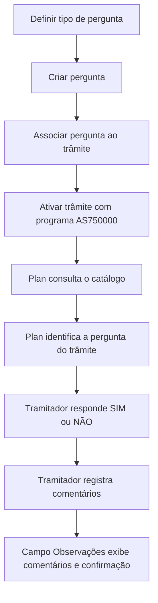

# Definição e Funcionamento da Ferramenta “Confirmación del Tramitador”

## 1. Metadados do Documento
- **Arquivo de Origem:** `Não identificado no conteúdo fornecido`
- **Tipo de Documento:** `Manual Operacional`
- **Domínio / Sistema:** `Confirmación del Tramitador / Plan`
- **Público-Alvo:** `Tramitadores, analistas funcionais, desenvolvedores e operação`
- **Data/Versão Identificada:** `Não identificada`

---

## 2. Resumo Executivo & Contexto de Negócio

O documento descreve a ferramenta de núcleo **“Confirmación del Tramitador”**, destinada a processos nos quais é necessária a intervenção de um tramitador para confirmar uma situação operacional. A ferramenta permite que o tramitador responda **SIM** ou **NÃO** e registre comentários associados à decisão.

A finalidade declarada é explicar como a ferramenta é definida e como funciona. A solução é associada a um trâmite e utiliza uma pergunta previamente configurada no catálogo para orientar a confirmação solicitada ao tramitador.

Os exemplos apresentados incluem a confirmação de que o recibo e a apólice estão corretos, a confirmação de uma perda total após o resultado da perícia e a confirmação de recebimento de fatura em um trâmite de liquidação.

Quando um trâmite configurado com o programa de confirmação é ativado, o **Plan** consulta o catálogo para identificar qual pergunta deve ser exibida. O resultado da interação fica registrado no campo de observações, incluindo os comentários do tramitador e a resposta de confirmação ou não confirmação.

---

## 3. Arquitetura, Componentes & Tecnologias Envolvidas

Os elementos identificados no documento são:

| Componente / Elemento | Função identificada |
| :--- | :--- |
| Ferramenta “Confirmación del Tramitador” | Utilidade de núcleo para obter uma confirmação do tramitador e registrar comentários. |
| Tramitador | Usuário responsável por responder SIM ou NÃO à pergunta configurada e registrar comentários. |
| Trâmite | Processo ao qual uma pergunta é associada e que pode ativar a ferramenta de confirmação. |
| Catálogo | Fonte consultada pelo Plan para identificar a pergunta vinculada ao trâmite ativado. |
| Plan | Componente citado como responsável por ir ao catálogo e obter a pergunta aplicável ao trâmite. |
| Programa `AS750000` | Programa de “Confirmación del Tramitador” associado ao trâmite ativado. |
| Campo Observações | Campo no qual são visualizados os comentários do tramitador e a confirmação ou não confirmação. |
| Pergunta `AC ANALISIS DE COBERTURAS Y RECIBOS O.K.` | Exemplo de pergunta associada a um trâmite. |
| Pergunta `RF RECIBIDO FACTURA` | Exemplo de pergunta associada a um trâmite de liquidação. |



> **Nota de Análise:** O documento cita o componente **Plan** e um **catálogo**, mas não detalha interfaces, tecnologias, contratos de integração, métodos HTTP, estruturas JSON, banco de dados ou responsabilidades técnicas adicionais.

---

## 4. Regras de Negócio, Especificações Funcionais & Processos

### 4.1 Finalidade funcional

A ferramenta “Confirmación del Tramitador” atende à necessidade de criar trâmites cuja finalidade seja confirmar uma situação que exija intervenção do tramitador. O tramitador deve fornecer uma resposta de confirmação ou não confirmação, utilizando as opções **SIM** e **NÃO**.

Além da resposta, a ferramenta deve permitir o registro de comentários do tramitador. Os comentários e o resultado da confirmação ficam disponíveis no campo **Observações**.

### 4.2 Processo de definição

O documento determina dois passos para configurar a utilização da ferramenta:

1. **Definir Tipo de Pergunta**.
2. **Associar Perguntas a Trâmite**.

O fluxo visual também apresenta as etapas de criar uma pergunta e associar essa pergunta a um trâmite. A pergunta associada ao trâmite é a pergunta que será recuperada quando o trâmite for ativado.

### 4.3 Processo de execução

1. Um trâmite é configurado com o programa de **Confirmación del Tramitador**, identificado como `AS750000`.
2. O trâmite é ativado.
3. O **Plan** consulta o catálogo para determinar qual pergunta está associada ao trâmite ativado.
4. A pergunta configurada é apresentada ao tramitador.
5. O tramitador responde **SIM** ou **NÃO**.
6. O tramitador pode registrar comentários.
7. O campo **Observações** exibe os comentários inseridos e o resultado da confirmação.

### 4.4 Casos de uso apresentados

- Confirmar que o recibo e a apólice estão corretos.
- Confirmar ou não uma perda total após a chegada do resultado da perícia.
- Confirmar o recebimento de uma fatura em um trâmite de liquidação.

### 4.5 Perguntas exemplificadas

- `AC ANALISIS DE COBERTURAS Y RECIBOS O.K.`
- `RF RECIBIDO FACTURA`

> **Nota de Análise:** O documento não define critérios adicionais para aprovação, consequências automáticas de uma resposta SIM ou NÃO, obrigatoriedade de comentários, permissões de acesso ou regras de transição de estado após a confirmação.

---

## 5. Tabelas de Parâmetros, Ambientes e Estruturas de Dados

| Item / Parâmetro | Descrição / Função | Tipo / Valores / Formato | Ambiente / Observações |
| :--- | :--- | :--- | :--- |
| Ferramenta | Utilidade de núcleo para confirmação de situações pelo tramitador. | `Confirmación del Tramitador` | Associada a trâmites que requerem intervenção do tramitador. |
| Programa associado | Programa utilizado quando o trâmite de confirmação é ativado. | `AS750000` | Identificado no documento como programa de Confirmación del Tramitador. |
| Resposta do tramitador | Resultado da confirmação solicitada. | `SIM` ou `NÃO` | O documento não detalha efeitos posteriores de cada valor. |
| Pergunta | Questão recuperada pelo Plan a partir do catálogo para o trâmite ativado. | Texto configurável | Deve ser definida e associada ao trâmite. |
| Pergunta de exemplo 1 | Confirmação relacionada a análises de coberturas e recibos. | `AC ANALISIS DE COBERTURAS Y RECIBOS O.K.` | Exibida como pergunta de um trâmite associado. |
| Pergunta de exemplo 2 | Confirmação de recebimento de fatura. | `RF RECIBIDO FACTURA` | Associada a um trâmite de liquidação. |
| Comentários | Registro textual produzido pelo tramitador durante a confirmação. | Texto livre; formato não detalhado | Visualizado no campo Observações. |
| Campo Observações | Campo que apresenta comentários e o resultado da confirmação. | Campo de visualização; tipo técnico não detalhado | Mostra se o tramitador confirmou ou não. |
| Catálogo | Repositório consultado pelo Plan para determinar a pergunta do trâmite. | Estrutura não detalhada | Não há detalhes sobre armazenamento ou manutenção. |
| Plan | Componente que consulta o catálogo quando o trâmite é ativado. | Sistema/componente citado | Não há detalhamento técnico adicional. |

---

## 6. Bateria de Perguntas & Respostas para RAG (FAQ Sintético)

### P1: Qual é o objetivo da ferramenta “Confirmación del Tramitador”?
**R:** A ferramenta “Confirmación del Tramitador” permite tratar situações que exigem a intervenção de um tramitador para confirmar ou não uma condição operacional. O tramitador responde SIM ou NÃO e registra comentários associados à decisão.

### P2: Quais são as etapas necessárias para configurar uma confirmação do tramitador?
**R:** O documento apresenta duas etapas principais: definir o tipo de pergunta e associar as perguntas ao trâmite. O fluxo visual também explicita a criação da pergunta antes de sua associação ao trâmite.

### P3: O que acontece quando um trâmite com o programa AS750000 é ativado?
**R:** Quando um trâmite associado ao programa de Confirmación del Tramitador `AS750000` é ativado, o Plan consulta o catálogo para identificar qual pergunta deve ser realizada para aquele trâmite.

### P4: Quais respostas o tramitador pode fornecer na ferramenta de confirmação?
**R:** O tramitador pode responder SIM para confirmar a situação apresentada ou NÃO para não confirmá-la. O documento não descreve regras adicionais ou efeitos automáticos associados a cada resposta.

### P5: Onde ficam registrados os comentários e a confirmação do tramitador?
**R:** Os comentários realizados pelo tramitador e a informação sobre ter confirmado ou não ficam visíveis no campo Observações.

### P6: Qual pergunta é apresentada no exemplo relacionado a coberturas e recibos?
**R:** No exemplo apresentado após a ativação do trâmite, a pergunta consultada no catálogo é `AC ANALISIS DE COBERTURAS Y RECIBOS O.K.`.

### P7: Como a ferramenta pode ser usada no processo de perda total?
**R:** A ferramenta pode ser associada a um trâmite para que o tramitador confirme ou não uma perda total depois da chegada do resultado da perícia e indique se o processo deve seguir com a perda total.

### P8: Qual pergunta está associada ao exemplo de trâmite de liquidação?
**R:** No exemplo de trâmite de liquidação, a pergunta associada à utilidade Confirmación del Tramitador é `RF RECIBIDO FACTURA`.

### P9: A mesma ferramenta pode utilizar perguntas diferentes?
**R:** Sim. O documento mostra que a mesma utilidade, Confirmación del Tramitador, pode apresentar perguntas diferentes conforme a pergunta configurada e associada ao trâmite correspondente.

### P10: O documento informa como o catálogo armazena as perguntas?
**R:** Não. O documento informa apenas que o Plan consulta o catálogo para saber qual pergunta deve realizar para o trâmite ativado. Não há detalhamento sobre estrutura de dados, persistência, APIs ou manutenção do catálogo.

---

## 7. Glossário de Termos, Siglas & Conceitos-Chave

- **AS750000:** Programa identificado no documento como o programa de Confirmación del Tramitador.
- **Campo Observações:** Campo que exibe os comentários realizados pelo tramitador e a indicação de confirmação ou não confirmação.
- **Catálogo:** Repositório citado como fonte de consulta para determinar a pergunta aplicável ao trâmite.
- **Confirmación del Tramitador:** Ferramenta de núcleo utilizada para solicitar ao tramitador uma confirmação SIM ou NÃO e registrar seus comentários.
- **Perícia:** Resultado mencionado como elemento que pode anteceder a confirmação de uma perda total.
- **Plan:** Componente citado como responsável por consultar o catálogo quando um trâmite é ativado.
- **Tramitador:** Pessoa responsável por responder à pergunta apresentada no trâmite e registrar comentários.
- **Trâmite:** Processo ao qual uma pergunta é associada e no qual pode ser ativado o programa de confirmação.

---

## 8. Notas Críticas, Riscos & Limitações

- O documento não informa o nome do arquivo de origem, data, versão, autoria ou histórico de alterações.
- Não há descrição de tecnologias, infraestrutura, ambientes, servidores, URLs, autenticação, banco de dados ou mecanismos de auditoria.
- O documento não detalha as consequências funcionais de respostas SIM ou NÃO.
- Não é informado se comentários são obrigatórios, opcionais, limitados por tamanho ou sujeitos a validação.
- Não há matriz de permissões para criação de perguntas, associação ao trâmite, execução da confirmação ou consulta ao campo Observações.
- O programa `AS750000` é identificado, mas não são detalhados contratos, interfaces, entradas, saídas ou integrações técnicas.
- A relação entre o Plan e o catálogo é descrita apenas no nível funcional: o Plan consulta o catálogo para identificar a pergunta aplicável ao trâmite.
- A quarta página foi identificada como página em branco ou composta somente por elementos visuais/imagens, sem texto extraído.

---

## 9. Conteúdo Bruto Estruturado (Referência Fiel)

```text
--- [PÁGINA 1 DE 4] ---

DEFINICIÓN Confirmación del tramitador
¿En que consiste?
Existe una herramienta que cubre la necesidad de tener trámites cuya finalidad es la de confirmar
una situación, en la que se necesita la intervención del tramitador (Verificar las coberturas, Confirmar
una pérdida Total, confirmar un vehículo de sustitución etc...), y además se necesita que queden
registrados los comentarios del tramitador. El tramitador podrá responderá SI se confirma o NO.
Objetivo
La finalidad de este documento es explicar cómo se define y como funciona la herramienta de
núcleo “Confirmación del Tramitador”.
Ejemplos:
Se puede definir un trámite para que el tramitador confirme que el recibo y la póliza estén
correctos al cual se le asociará esta herramienta (programa).
Se puede definir un trámite para que el tramitador confirme o no la pérdida total después de
llegar el resultado de la peritación y este indique o no, si se sigue adelante con la pérdida total. A
este trámite se le asociará esta herramienta de confirmación.
Etc.
Para que esto funcione hay que seguir varios pasos
Definición de Confirmación Tramitador
 /
 CF
Home Solutions APIs Documentation Zeus
EN


--- [PÁGINA 2 DE 4] ---

SI
NO
SI
NO
¿DEFINIR Pregunta?
CREAR
Pregunta (1)
¿ASOCIAR
Pregunta
a Trámite ASOCIAR Pregunta
Trámite(2)
FIN
1. Definir Tipo de Pregunta
2. Asociar Preguntas a Trámite
Resultado
Una vez que se active el trámite que tendrá asociado el programa de Confirmación del Tramitador
(AS750000), el Plan irá al catálogo para saber qué pregunta tiene que hacer para ese trámite, en
este caso la pregunta será: AC ANALISIS DE COBERTURAS Y RECIBOS O.K.
Aquí se puede ver en el campo observaciones los comentarios realizados por el tramitador y si
confirmó o no.


--- [PÁGINA 3 DE 4] ---

Este es otro ejemplo de como con una misma utilidad, Confirmación del Tramitador, la pregunta que
se realiza al tramitador es diferente a la anterior. En este caso la pregunta que se le ha asociado al
trámite de liquidación: RF RECIBIDO FACTURA
Aquí se puede ver en el campo observaciones los comentarios realizados por el tramitador y si
confirmó o no.


--- [PÁGINA 4 DE 4] ---

[Página em branco ou apenas elementos visuais/imagem]
```
