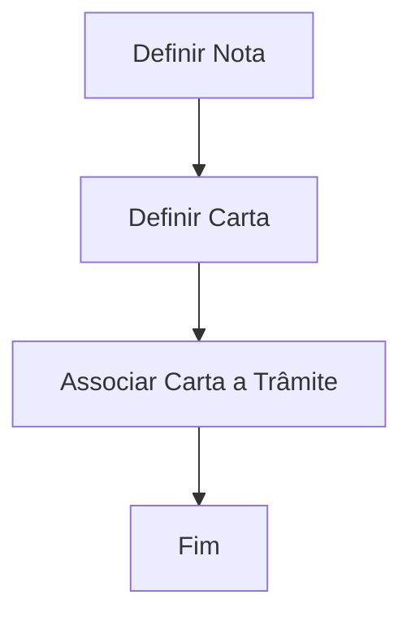

# Definição e Geração de Cartas-Email a partir do Plano de Tramitação

## 1. Metadados do Documento
- **Arquivo de Origem:** Não identificado no conteúdo fornecido
- **Tipo de Documento:** Procedimento
- **Domínio / Sistema:** Plano de Tramitação; definição de comunicações, notas e cartas-email
- **Público-Alvo:** Operação, negócio e equipes responsáveis pela configuração de comunicações
- **Data/Versão Identificada:** Não identificada

---

## 2. Resumo Executivo & Contexto de Negócio

O documento descreve como definir uma comunicação para lançamento a partir do Plano de Tramitação, utilizando notas. O objetivo declarado é explicar “o que” pode ser definido e “como” uma comunicação pode ser configurada nesse contexto.

O processo apresentado possui três etapas sequenciais: definir uma nota, definir uma carta e associar a carta a um trâmite. A associação da carta ao trâmite conclui o fluxo descrito.

O conteúdo fornecido não detalha regras de disparo, métodos HTTP, contratos de integração, formatos de e-mail, campos de notas ou critérios de seleção de cartas. Também não identifica responsabilidades por etapa, ambientes, versões ou dependências técnicas.

---

## 3. Arquitetura, Componentes & Tecnologias Envolvidas

Os elementos explicitamente citados são:

- **Plano de Tramitação:** contexto a partir do qual a comunicação pode ser lançada.
- **Notas:** elemento utilizado para definir a comunicação.
- **Carta:** elemento que deve ser definido e posteriormente associado a um trâmite.
- **Trâmite:** destino da associação da carta no processo descrito.
- **Cartas-Email:** tipo de comunicação indicado no título do documento.



**Nota de Análise:** O documento cita “CF”, “Home Solutions”, “APIs Documentation” e “Zeus” no rodapé, mas não explica o significado, a função ou a relação desses termos com o processo de definição de cartas-email.

---

## 4. Regras de Negócio, Especificações Funcionais & Processos

### Processo para definir uma comunicação

1. **Definir Nota**
   - A nota é o primeiro elemento definido no processo.
   - O documento declara que o lançamento de uma comunicação a partir do Plano de Tramitação é realizado mediante o uso de notas.
   - Não há detalhamento sobre atributos, campos, conteúdo ou validações da nota.

2. **Definir Carta**
   - A carta é definida após a definição da nota.
   - Não há detalhamento sobre modelo, destinatário, conteúdo, formato ou canal de entrega da carta.

3. **Associar Carta a Trâmite**
   - A carta definida deve ser associada a um trâmite.
   - Essa associação encerra o processo apresentado.
   - O documento não especifica se uma carta pode ser associada a múltiplos trâmites, nem quais condições controlam essa associação.

### Restrições e lacunas explícitas

- O documento não descreve critérios de elegibilidade para lançamento de comunicações.
- O documento não define regras para geração efetiva ou envio de cartas-email.
- O documento não apresenta fluxos de erro, aprovações, permissões ou auditoria.
- O documento não detalha tecnologias, APIs, integrações ou ambientes.

---

## 5. Tabelas de Parâmetros, Ambientes e Estruturas de Dados

| Item / Parâmetro | Descrição / Função | Tipo / Valores / Formato | Ambiente / Observações |
| :--- | :--- | :--- | :--- |
| Comunicação | Elemento que pode ser lançado a partir do Plano de Tramitação. | Não detalhado. | A definição utiliza notas. |
| Nota | Primeiro elemento do processo de definição de comunicação. | Não detalhado. | Não há campos, formatos ou validações descritos. |
| Carta | Elemento definido após a nota e associado a um trâmite. | Não detalhado. | O título menciona cartas-email, mas não especifica estrutura ou canal. |
| Trâmite | Elemento ao qual a carta deve ser associada. | Não detalhado. | A associação encerra o processo apresentado. |
| Plano de Tramitação | Contexto de origem para lançar a comunicação. | Não detalhado. | Não há detalhamento funcional adicional. |
| CF | Termo presente no rodapé. | Não definido. | Sem contexto adicional no conteúdo fornecido. |
| Home Solutions | Termo presente no rodapé. | Não definido. | Sem contexto adicional no conteúdo fornecido. |
| APIs Documentation | Termo presente no rodapé. | Não definido. | Sem informações sobre APIs ou documentação. |
| Zeus | Termo presente no rodapé. | Não definido. | Sem contexto adicional no conteúdo fornecido. |

---

## 6. Bateria de Perguntas & Respostas para RAG (FAQ Sintético)

### P1: Qual é o objetivo do documento sobre definição e geração de cartas-email?
**R:** O objetivo é explicar o que e como pode ser definida uma comunicação para lançamento a partir do Plano de Tramitação, mediante o uso de notas.

### P2: Qual é a primeira etapa para definir uma comunicação no Plano de Tramitação?
**R:** A primeira etapa é definir uma nota.

### P3: O que deve ser definido depois da nota?
**R:** Depois da definição da nota, deve ser definida uma carta.

### P4: Qual é a etapa final do processo apresentado?
**R:** A etapa final é associar a carta a um trâmite. Após essa associação, o fluxograma indica o fim do processo.

### P5: Como uma comunicação é relacionada ao Plano de Tramitação?
**R:** O documento informa que a comunicação pode ser lançada a partir do Plano de Tramitação mediante o uso de notas. Não há detalhamento adicional sobre o mecanismo de lançamento.

### P6: O documento especifica os campos necessários para criar uma nota?
**R:** Não. O documento apenas indica que a nota deve ser definida como primeira etapa, sem apresentar campos, formatos ou regras de validação.

### P7: O documento descreve o conteúdo ou o formato de uma carta-email?
**R:** Não. Embora o título mencione “Cartas-Email”, o conteúdo não descreve modelo de carta, corpo de e-mail, destinatários, anexos ou formato de envio.

### P8: Uma carta pode ser associada a mais de um trâmite?
**R:** O documento não informa se uma carta pode ser associada a múltiplos trâmites. Ele apenas estabelece que uma carta deve ser associada a um trâmite.

### P9: Existem APIs, URLs ou ambientes técnicos especificados para o processo?
**R:** Não. Os termos “APIs Documentation”, “Home Solutions” e “Zeus” aparecem no rodapé, mas não há URLs, contratos, ambientes ou detalhes técnicos associados.

### P10: Quais componentes participam explicitamente do processo de definição da comunicação?
**R:** Os componentes explicitamente apresentados são nota, carta e trâmite, dentro do contexto do Plano de Tramitação.

---

## 7. Glossário de Termos, Siglas & Conceitos-Chave

- **Plano de Tramitação:** contexto a partir do qual uma comunicação pode ser lançada, conforme o objetivo do documento.
- **Nota:** primeiro elemento que deve ser definido no processo de configuração de uma comunicação.
- **Carta:** elemento definido após a nota e que deve ser associado a um trâmite.
- **Trâmite:** elemento ao qual a carta é associada para concluir o processo descrito.
- **Carta-Email:** expressão presente no título do documento; o conteúdo não detalha sua estrutura ou mecanismo de envio.
- **CF:** sigla ou termo presente no rodapé, sem definição no conteúdo fornecido.
- **Zeus:** termo presente no rodapé, sem definição no conteúdo fornecido.

---

## 8. Notas Críticas, Riscos & Limitações

- O documento apresenta somente um fluxo resumido de três etapas.
- Não há especificação dos dados necessários para definir notas, cartas ou associações com trâmites.
- Não há regras de negócio para disparo, aprovação, envio, falha, reprocessamento ou rastreabilidade de comunicações.
- Não há informações sobre permissões, perfis de acesso ou segregação de responsabilidades.
- Não há informações técnicas sobre integrações, APIs, logs, URLs, servidores, ambientes ou versões.
- Os termos do rodapé não possuem contextualização suficiente para serem classificados como sistemas, ferramentas ou dependências.

---

## 9. Conteúdo Bruto Estruturado (Referência Fiel)

```text
--- [PÁGINA 1 DE 1] ---

DEFINICIÓN y Generación Cartas-Email desde
el Plan de tramitación
Objetivo
La finalidad de este documento es conocer qué y cómo se puede definir una comunicación para
lanzarla desde el plan de Plan de Tramitación mediante el uso de notas.
Proceso a seguir para definir una Comunicación
DEFINIR
Notas
(1)
DEFINIR
Carta(2)
Asociar Carta
a trámite
(3)
FIN
1. DEFINIR Nota
2. DEFINIR Carta
3. ASOCIAR Cartas a Trámites
 / 
 CF
Home Solutions APIs Documentation Zeus
EN
```
