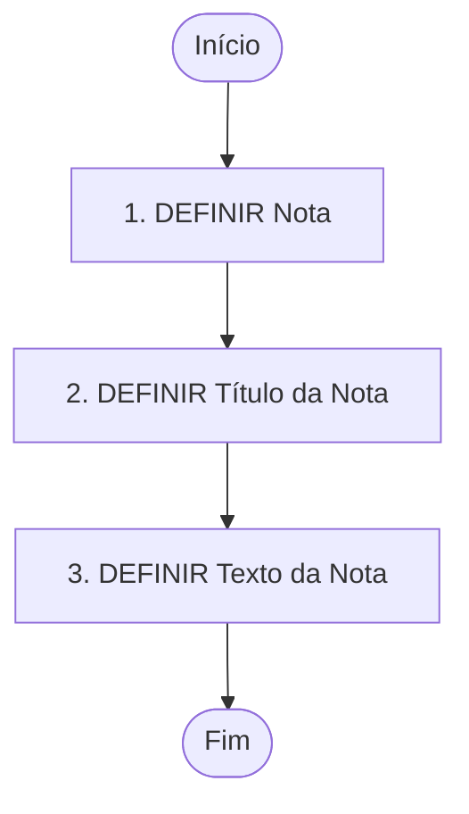

# Definição de Notas para Geração de Cartas

## 1. Metadados do Documento
- **Arquivo de Origem:** Não identificado
- **Tipo de Documento:** Procedimento
- **Domínio / Sistema:** Definição de notas para cartas; referências a “Home Solutions APIs Documentation Zeus”
- **Público-Alvo:** Não identificado
- **Data/Versão Identificada:** Não identificada

---

## 2. Resumo Executivo & Contexto de Negócio

O documento descreve o processo para definir uma nota destinada à criação de um texto simples em cartas. O objetivo explícito é “explicar el proceso para definir una nota para realizar un texto sencillo”.

O fluxo apresentado possui três atividades funcionais: definir a nota, definir o título da nota e definir o texto da nota. O processo inicia em **DEFINIR Nota** e termina após a definição do texto.

O material é sintético e não apresenta regras de validação, campos obrigatórios, responsáveis, sistemas de persistência, contratos de API ou detalhes de integração. Há referências textuais a “Home Solutions APIs Documentation Zeus”, “CF” e “EN”, sem explicação adicional.

---

## 3. Arquitetura, Componentes & Tecnologias Envolvidas

O documento não especifica arquitetura de software, componentes técnicos, microsserviços, tecnologias, ambientes ou integrações. O único fluxo descrito é o procedimento funcional de definição de notas.



**Nota de Análise:** O texto menciona “Home Solutions APIs Documentation Zeus”, mas não detalha a relação dessa referência com o processo de definição de notas ou geração de cartas.

---

## 4. Regras de Negócio, Especificações Funcionais & Processos

### Processo para definição de notas

1. **Definir Nota**
   - O processo começa com a definição de uma nota.
   - O documento não descreve atributos, identificadores, critérios de criação ou persistência da nota.

2. **Definir Título da Nota**
   - Após definir a nota, deve-se definir o título da nota.
   - O documento não informa formato, tamanho máximo, obrigatoriedade ou regras de validação do título.

3. **Definir Texto da Nota**
   - Após definir o título, deve-se definir o texto da nota.
   - O objetivo do processo é realizar um texto simples.
   - O documento não especifica editor, idioma, campos dinâmicos, formatação, limite de caracteres ou mecanismo de associação do texto à carta.

4. **Finalização**
   - O processo é encerrado após a definição do texto da nota.

---

## 5. Tabelas de Parâmetros, Ambientes e Estruturas de Dados

| Item / Parâmetro | Descrição / Função | Tipo / Valores / Formato | Ambiente / Observações |
| :--- | :--- | :--- | :--- |
| Nota | Entidade inicial a ser definida no processo. | Não especificado | Etapa 1 do fluxo. |
| Título da Nota | Título associado à nota. | Não especificado | Etapa 2 do fluxo. |
| Texto da Nota | Texto simples que compõe a nota. | Não especificado | Etapa 3 e final do fluxo. |
| Home Solutions APIs Documentation Zeus | Referência textual presente no conteúdo bruto. | Não especificado | Não há explicação sobre função, ambiente ou integração. |
| CF | Sigla presente no conteúdo bruto. | Não especificado | Não definida pelo documento. |
| EN | Sigla presente no conteúdo bruto. | Não especificado | Não definida pelo documento. |

---

## 6. Bateria de Perguntas & Respostas para RAG (FAQ Sintético)

### P1: Qual é o objetivo do procedimento de definição de notas?
**R:** O objetivo é explicar o processo para definir uma nota que permita realizar um texto simples.

### P2: Qual é a primeira etapa do processo de definição de notas?
**R:** A primeira etapa é **DEFINIR Nota**.

### P3: Quais etapas compõem o processo de definição de notas?
**R:** O processo contém três etapas: definir a nota, definir o título da nota e definir o texto da nota.

### P4: Em que momento o processo de definição de notas é concluído?
**R:** O processo é concluído após a etapa de definição do texto da nota.

### P5: O documento define regras de validação para o título da nota?
**R:** Não. O documento informa que o título da nota deve ser definido, mas não apresenta regras de validação, formato, obrigatoriedade ou limite de caracteres.

### P6: O documento especifica como o texto da nota deve ser formatado?
**R:** Não. O documento apenas informa que a nota é definida para realizar um texto simples; não há especificação de formatação, editor ou estrutura do conteúdo.

### P7: O documento apresenta integração técnica ou contratos de API para a definição de notas?
**R:** Não. Embora o conteúdo cite “Home Solutions APIs Documentation Zeus”, não são descritos endpoints, métodos HTTP, contratos JSON, autenticação ou fluxos de integração.

### P8: O documento informa onde a nota é armazenada?
**R:** Não. Não há informação sobre banco de dados, sistema de persistência, repositório documental ou destino da nota definida.

### P9: Qual é a relação entre a nota e a carta?
**R:** O objetivo do documento informa que a nota é definida para realizar um texto simples em cartas. Não há detalhamento adicional sobre como a nota é incorporada, selecionada ou renderizada na carta.

### P10: O que significam as siglas CF e EN no documento?
**R:** O documento contém as siglas “CF” e “EN”, mas não fornece suas expansões ou significados no contexto do processo.

---

## 7. Glossário de Termos, Siglas & Conceitos-Chave

- **Nota:** Elemento definido no processo para realizar um texto simples em cartas.
- **Título da Nota:** Título que deve ser definido para a nota.
- **Texto da Nota:** Conteúdo textual simples que deve ser definido para a nota.
- **CF:** Sigla citada no conteúdo bruto; significado não definido.
- **EN:** Sigla citada no conteúdo bruto; significado não definido.
- **Home Solutions APIs Documentation Zeus:** Referência textual citada no documento; função e significado no processo não detalhados.

---

## 8. Notas Críticas, Riscos & Limitações

- O documento é resumido e não detalha atributos, estrutura de dados ou regras de validação para a nota, o título ou o texto.
- Não há definição de responsáveis, perfis de acesso, permissões ou trilha de auditoria.
- Não são especificados sistemas, serviços, APIs, endpoints, ambientes, URLs ou mecanismos de integração.
- A referência a “Home Solutions APIs Documentation Zeus” não é contextualizada.
- As siglas “CF” e “EN” não possuem definição no conteúdo fornecido.
- Não há informações sobre tratamento de erros, edição, exclusão, versionamento ou publicação de notas.

---

## 9. Conteúdo Bruto Estruturado (Referência Fiel)

```text
--- [PÁGINA 1 DE 1] ---

DEFINICIÓN Notas para Generar Cartas
Objetivo
Explicar el proceso para definir una nota para realizar un texto sencillo.
Proceso para la definición de Notas
DEFINIR
Nota (1)
Definir Título
de la Nota
(2)
Definir Texto
de la Nota
(2)
FIN
1. DEFINIR Nota
2. DEFINIR Título de la Nota
3. DEFINIR Texto de la Nota
 /
 CF
Home Solutions APIs Documentation Zeus
EN
```
