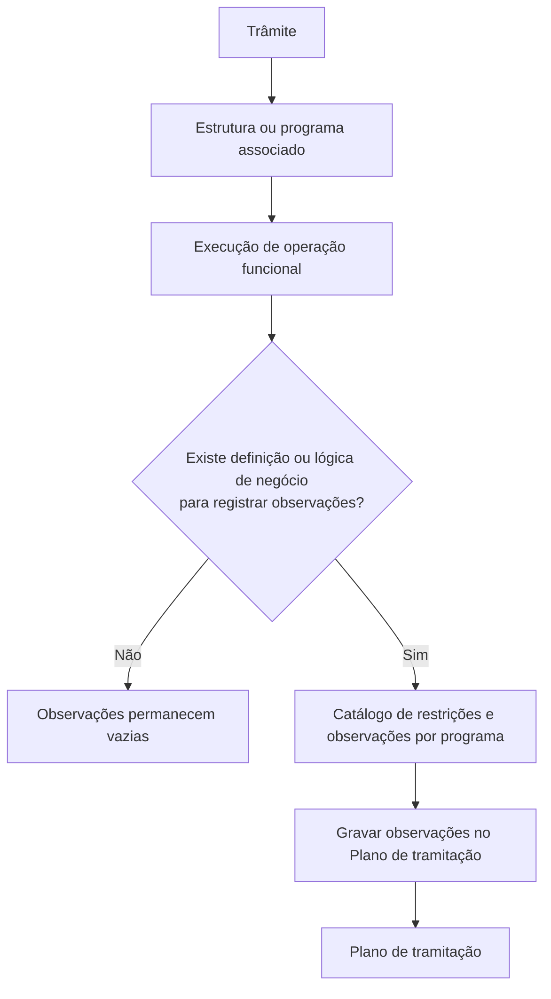
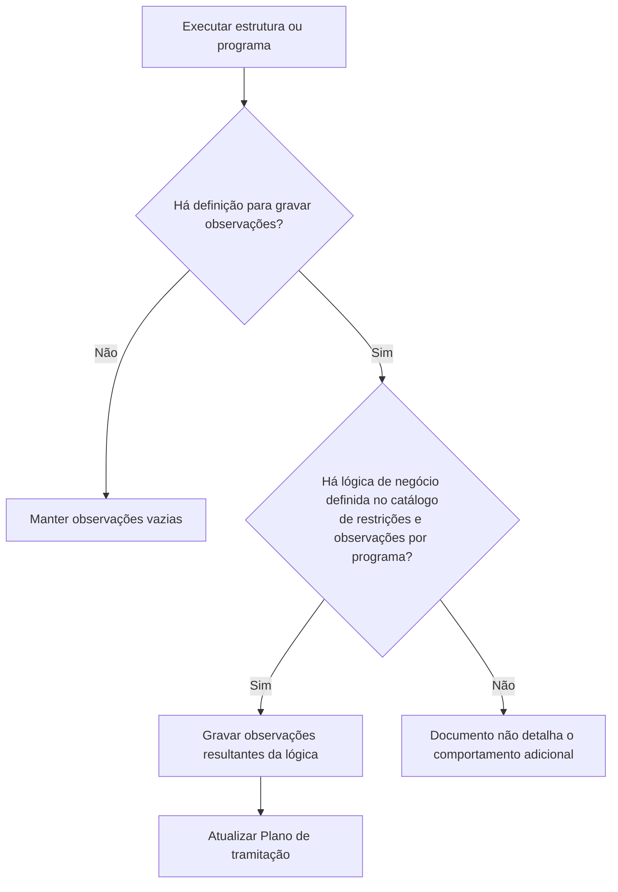

# Definição de Observações de Estruturas no Plano de Tramitação — Reef.core

## 1. Metadados do Documento
- **Arquivo de Origem:** Não identificado
- **Tipo de Documento:** Especificação Técnica
- **Domínio / Sistema:** Reef.core — Plano de tramitação
- **Público-Alvo:** Desenvolvedores, Analistas Funcionais, Arquitetos e Operação
- **Data/Versão Identificada:** Não identificada

---

## 2. Resumo Executivo & Contexto de Negócio

O documento descreve como configurar as observações registradas no Plano de tramitação do sistema Reef.core quando uma estrutura associada a um trâmite é executada. Um trâmite pode possuir uma ou várias estruturas, que correspondem a operações funcionais como alteração de avaliação, modificação de sinistro, modificação de expediente, liquidação e encerramento de expediente.

A finalidade declarada é permitir conhecer a definição das observações que devem ser persistidas no Plano de tramitação durante a execução de uma estrutura ou programa. A configuração determina quais informações de negócio ficam registradas para cada operação executada.

O comportamento depende da existência de uma definição de observações ou de uma lógica de negócio associada ao programa no catálogo de restrições e observações por programa. Quando não existe uma definição para registrar observações, a execução da operação mantém as observações vazias.

Como exemplos funcionais, o documento informa que uma operação de alteração de avaliação pode registrar o valor final avaliado; uma liquidação pode registrar o beneficiário e o valor da liquidação; e o encerramento de expediente pode registrar uma ou mais causas de encerramento. No exemplo com lógica de negócio para alteração de avaliação, são gravadas a avaliação final do expediente e a avaliação líquida de cosseguro.

---

## 3. Arquitetura, Componentes & Tecnologias Envolvidas

Os elementos identificados no documento são:

| Componente / Elemento | Papel descrito |
| :--- | :--- |
| **Reef.core** | Sistema no qual existe o local de definição das informações que serão deixadas no Plano de tramitação após a execução de operações. |
| **Plano de tramitação** | Local onde as observações associadas à execução das operações funcionais são registradas. |
| **Trâmite** | Entidade que pode possuir uma ou mais estruturas associadas. |
| **Estrutura** | Operação funcional associada a um trâmite; também é mencionada como programa. |
| **Programa** | Elemento executado que pode possuir lógica de negócio definida para registrar observações. |
| **Catálogo de restrições e observações por programa** | Catálogo que pode conter a lógica de negócio para persistir observações no Plano de tramitação. |
| **Operação de alteração de avaliação** | Exemplo de operação que pode registrar dados de avaliação. |
| **Liquidação** | Exemplo de operação que pode registrar beneficiário e valor de liquidação. |
| **Encerramento de expediente** | Exemplo de operação que pode registrar uma ou várias causas de encerramento. |



> **Nota de Análise:** O documento cita o Reef.core e o catálogo de restrições e observações por programa, mas não detalha interfaces, métodos HTTP, contratos JSON, modelo de persistência, tecnologia de banco de dados ou mecanismos técnicos de execução.

---

## 4. Regras de Negócio, Especificações Funcionais & Processos

### 4.1 Associação entre trâmite e estruturas

1. No Plano de tramitação, um trâmite pode ter uma ou várias estruturas associadas.
2. As estruturas podem representar operações funcionais.
3. Entre os exemplos de operações funcionais citados estão:
   - Alterar a avaliação.
   - Modificar o sinistro.
   - Modificar o expediente.
   - Liquidação.
   - Encerramento de expediente.

### 4.2 Definição de informações para observações

1. O Reef.core possui um local no qual é definida a informação que será deixada no Plano de tramitação.
2. A informação é registrada quando as operações ou estruturas correspondentes são executadas.
3. A definição de observações permite registrar dados específicos conforme o programa ou a operação associada ao trâmite.

### 4.3 Regra de ausência de definição

1. Quando uma operação não possui definição para gravar observações, a execução da operação não preenche observações.
2. Nessa condição, as observações permanecem vazias.

### 4.4 Regra de lógica de negócio por programa

1. Para que uma operação grave observações no Plano de tramitação, pode existir uma lógica de negócio definida para o programa que será executado.
2. A lógica de negócio é definida no catálogo de restrições e observações por programa.
3. Quando a lógica de negócio existe para o programa, a execução da operação grava observações no Plano de tramitação.

### 4.5 Exemplos de informações registráveis

| Operação / Programa | Informações que podem ser registradas no Plano de tramitação |
| :--- | :--- |
| Alteração de avaliação | Valor final avaliado. |
| Alteração de avaliação com lógica de negócio | Avaliação final do expediente e avaliação líquida de cosseguro. |
| Liquidação | Beneficiário da liquidação e valor da liquidação. |
| Encerramento de expediente | Uma ou várias causas de encerramento. |

### 4.6 Fluxo funcional de decisão



> **Nota de Análise:** O documento afirma que a existência de lógica de negócio no catálogo faz com que as observações sejam gravadas. Entretanto, o material não detalha explicitamente a diferença operacional entre uma definição de observação sem lógica de negócio e uma definição com lógica de negócio.

---

## 5. Tabelas de Parâmetros, Ambientes e Estruturas de Dados

| Item / Parâmetro | Descrição / Função | Tipo / Valores / Formato | Ambiente / Observações |
| :--- | :--- | :--- | :--- |
| Trâmite | Elemento que pode possuir estruturas associadas. | Uma ou várias estruturas. | Plano de tramitação. |
| Estrutura | Operação funcional associada a um trâmite. | Exemplos: alterar avaliação, modificar sinistro, modificar expediente. | Também mencionada como programa no objetivo do documento. |
| Programa | Elemento que será executado e que pode possuir lógica de negócio. | Não detalhado. | Pode possuir lógica no catálogo de restrições e observações por programa. |
| Definição de observações | Configuração da informação a deixar no Plano de tramitação quando uma operação é executada. | Não detalhado. | Reef.core. |
| Lógica de negócio | Lógica definida para um programa, capaz de produzir observações. | Não detalhado. | Catálogo de restrições e observações por programa. |
| Observações | Dados registrados ou mantidos vazios no Plano de tramitação. | Valor final avaliado, avaliação líquida de cosseguro, beneficiário, valor de liquidação, causas de encerramento. | Dependem da operação e da definição/lógica existente. |
| Avaliação final do expediente | Informação gravada no exemplo de alteração de avaliação com lógica de negócio. | Não detalhado. | Plano de tramitação. |
| Avaliação líquida de cosseguro | Informação gravada no exemplo de alteração de avaliação com lógica de negócio. | Não detalhado. | Plano de tramitação. |
| Beneficiário da liquidação | Informação que pode ser registrada em uma liquidação. | Não detalhado. | Plano de tramitação. |
| Valor da liquidação | Informação que pode ser registrada em uma liquidação. | Não detalhado. | Plano de tramitação. |
| Causa de encerramento | Informação que pode ser registrada no encerramento de expediente. | Uma ou várias causas. | Plano de tramitação. |

> **Nota de Análise:** O conteúdo não apresenta URLs, servidores, portas, ambientes de implantação, rotas de logs, credenciais, formatos de payload, tipos de dados técnicos ou valores de parâmetros configuráveis.

---

## 6. Bateria de Perguntas & Respostas para RAG (FAQ Sintético)

### P1: Qual é o objetivo da definição de observações de estruturas no Plano de tramitação?
**R:** O objetivo é definir quais informações devem ser deixadas no Plano de tramitação do Reef.core quando uma estrutura, operação funcional ou programa é executado. A finalidade do documento é explicar como configurar as observações a serem registradas durante essa execução.

### P2: Um trâmite pode ter mais de uma estrutura associada?
**R:** Sim. O documento informa que, no Plano de tramitação, um trâmite pode ter associada uma ou várias estruturas.

### P3: Quais operações funcionais são citadas como exemplos de estruturas?
**R:** O documento cita como exemplos de operações funcionais: alterar a avaliação, modificar o sinistro, modificar o expediente, liquidação e encerramento de expediente.

### P4: O que acontece quando uma operação não possui definição para gravar observações?
**R:** Quando uma operação não possui definição para gravar observações, a execução dessa operação mantém as observações vazias no Plano de tramitação.

### P5: Onde deve estar definida a lógica de negócio para um programa gravar observações?
**R:** A lógica de negócio deve estar definida no catálogo de restrições e observações por programa. Quando existe essa lógica para o programa executado, a operação grava observações no Plano de tramitação.

### P6: Quais dados podem ser registrados quando um trâmite possui o programa de alteração de avaliação?
**R:** O documento informa que, quando o trâmite possui o programa de alteração de avaliação, é possível registrar no Plano de tramitação o valor final avaliado.

### P7: Quais observações são gravadas no exemplo de alteração de avaliação com lógica de negócio?
**R:** No exemplo apresentado, a operação de alteração de avaliação grava a avaliação final do expediente e a avaliação líquida de cosseguro.

### P8: Quais informações uma liquidação pode registrar no Plano de tramitação?
**R:** Se o trâmite possuir a liquidação associada, podem ser registrados no Plano de tramitação o beneficiário da liquidação e o valor da liquidação.

### P9: Quais dados podem ser registrados em um encerramento de expediente?
**R:** Quando o trâmite possui a operação de encerramento de expediente, é possível registrar uma ou várias causas de encerramento no Plano de tramitação.

### P10: O documento detalha métodos HTTP, APIs ou contratos JSON do Reef.core?
**R:** Não. O documento menciona o Reef.core e descreve o comportamento funcional das observações, mas não apresenta métodos HTTP, endpoints, contratos JSON, esquemas de dados ou detalhes de integração técnica.

### P11: Qual é a consequência da execução de um programa que possui lógica de negócio no catálogo de restrições e observações?
**R:** Quando existe uma lógica de negócio definida para o programa no catálogo de restrições e observações por programa, a execução da operação grava as observações no Plano de tramitação.

---

## 7. Glossário de Termos, Siglas & Conceitos-Chave

- **Reef.core:** Sistema mencionado como o local onde se pode definir a informação que será deixada no Plano de tramitação após a execução de operações.
- **Plano de tramitação:** Local onde são registradas as observações resultantes da execução de estruturas, operações ou programas.
- **Trâmite:** Elemento que pode possuir uma ou várias estruturas associadas.
- **Estrutura:** Elemento associado a um trâmite que pode corresponder a uma operação funcional.
- **Operação funcional:** Operação de negócio citada como exemplo de estrutura, como alteração de avaliação, modificação de sinistro ou modificação de expediente.
- **Programa:** Elemento a ser executado para o qual pode existir uma lógica de negócio definida.
- **Observações:** Informações gravadas no Plano de tramitação durante a execução de uma operação, quando houver definição ou lógica aplicável.
- **Catálogo de restrições e observações por programa:** Catálogo citado como local da definição de lógica de negócio para programas.
- **Liquidação:** Operação que pode registrar o beneficiário e o valor da liquidação.
- **Cosseguro:** Termo presente na informação “avaliação líquida de cosseguro”; o documento não fornece definição adicional.
- **Expediente:** Entidade mencionada em operações de modificação, avaliação final e encerramento; o documento não fornece definição adicional.

---

## 8. Notas Críticas, Riscos & Limitações

- O material não identifica nome de arquivo, autor, data, versão ou histórico de alterações.
- O documento não apresenta detalhes técnicos de implementação, tais como APIs, contratos JSON, banco de dados, modelo de entidades, tecnologias, servidores ou ambientes.
- O documento não explica como criar, editar, validar ou publicar uma definição no catálogo de restrições e observações por programa.
- Não são detalhados os critérios usados pela lógica de negócio para calcular ou selecionar valores como avaliação final, avaliação líquida de cosseguro, beneficiário, valor de liquidação ou causas de encerramento.
- O comportamento de uma operação que possui definição de observação, mas não possui lógica de negócio no catálogo, não é explicitamente detalhado.
- As imagens mencionadas no conteúdo original não possuem descrição visual adicional suficiente para extrair campos, telas, configurações ou regras além do texto associado.
- Não há definição expandida para os termos “cosseguro”, “sinistro”, “expediente” e “catálogo de restrições”.

---

## 9. Conteúdo Bruto Estruturado (Referência Fiel)

```text
--- [PÁGINA 1 DE 2] ---

DEFINICIÓN Observaciones de Estructuras en
el Plan
¿En que consiste?
En el plan de tramitación, un trámite puede tener asociado una o varias estructuras. Estas
estructuras pueden ser operaciones funcionales como Cambiar la valoración, Modificar el Siniestro,
Modificar el expediente, etc. En Reef.core hay un lugar donde se puede definir qué información se va
a dejar en el Plan de tramitación, cuando se ejecuten estas operaciones.
Objetivo
La finalidad de este documento es conocer cómo se define las observaciones que se quieren dejar
en el plan cuando se ejecute una estructura, un programa.
Ejemplo:
Si el trámite tiene asociado el programa del cambio de valoración se puede registrar en el Plan,
el importe final valorado.
Si el trámite tiene asociado la liquidación, se puede registrar en el plan, el beneficiario de la
liquidación, el importe de la liquidación.
Si el trámite tiene asociado la terminación de expediente podemos registrar la o las causas de
terminación.
Etc.
Imagen Observaciones del Cambio de valoración sin Lógica de Negocio
 /
 CF
Home Solutions APIs Documentation Zeus
EN


--- [PÁGINA 2 DE 2] ---

Cuando en una operación NO hay definición para grabar observaciones, cuando se ejecute esta, las
observaciones quedarán vacías.
Imagen Observaciones del Cambio de valoración con Lógica de Negocio
Si para el programa que se va a ejecutar existe una lógica de negocio definida en el catálogo de
restricciones y observaciones por programa, cuando se ejecute dicha operación, grabará las
observaciones en el plan de tramitación.
En el ejemplo para la operación de cambio de valoración, se graba la valoración final del expediente
y la valoración neta de coaseguro.
```
