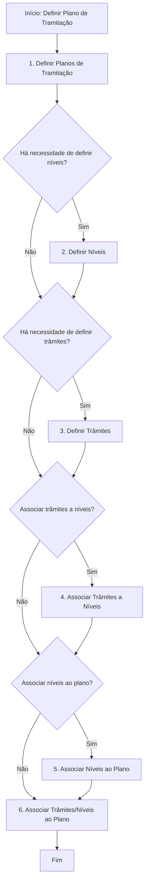
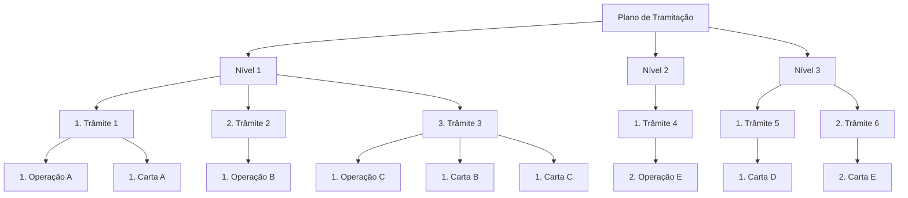

# Definição de Plano de Tramitação no REEF Core

## 1. Metadados do Documento
- **Arquivo de Origem:** Não identificado no conteúdo fornecido
- **Tipo de Documento:** Manual Operacional
- **Domínio / Sistema:** REEF Core — gestão de expedientes e sinistros
- **Público-Alvo:** Tramitadores, supervisores, usuários configuradores e equipes funcionais
- **Data/Versão Identificada:** Não identificada

---

## 2. Resumo Executivo & Contexto de Negócio

O documento descreve a configuração de um **Plano de Tramitação** no sistema REEF Core. O REEF Core exige uma configuração prévia para funcionar, e o usuário define o comportamento desejado do sistema por meio dessas definições.

O Plano de Tramitação é apresentado como uma guia para o tratamento de diferentes tipos de expedientes. O plano também apoia o supervisor no acompanhamento do trabalho realizado por cada tramitador.

Um tramitador pode utilizar o Plano de Tramitação para gerir um expediente desde a abertura até o encerramento. A partir do plano, o tramitador pode acessar funcionalidades de sinistros, executar operações necessárias, acessar funcionalidades de outros módulos, gerar textos e documentos, registrar ou incluir avisos e criar anotações livres.

O objetivo declarado é definir o que deve ser configurado para obter um Plano de Tramitação completo e elegível para associação a um Tipo de Expediente. O processo central envolve definir planos, níveis e trâmites, além de criar as associações entre esses elementos.

O documento também enumera definições complementares, incluindo ferramentas, observações de operações, estruturas de trâmites, confirmações do tramitador, geração de textos e e-mails por notas, papéis do Plano de Tramitação, funcionalidades opcionais, tipos de avisos e tipos de anotações livres.

---

## 3. Arquitetura, Componentes & Tecnologias Envolvidas

O conteúdo identifica o **REEF Core** como o sistema que requer configuração prévia. O modelo funcional do Plano de Tramitação é composto pelos seguintes elementos:

- **Plano de Tramitação:** estrutura principal de configuração para orientar o tratamento de expedientes.
- **Níveis:** elementos organizacionais associados ao Plano de Tramitação.
- **Trâmites:** unidades de tratamento que podem ser associadas a níveis.
- **Operações:** ações vinculadas aos trâmites no esquema ilustrativo.
- **Cartas:** elementos associados a trâmites no esquema ilustrativo.
- **Tipos de Expediente:** entidades às quais um Plano de Tramitação completo pode ser atribuído.
- **Tramitador:** usuário que gere expedientes por meio do plano.
- **Supervisor:** usuário que acompanha as anotações livres e o trabalho dos tramitadores.
- **Módulos externos:** o plano pode acessar funcionalidades de outros módulos, sem especificação adicional.

> **Nota de Análise:** O documento não apresenta tecnologias de implementação, protocolos, URLs, ambientes, APIs, bancos de dados ou contratos de integração.





---

## 4. Regras de Negócio, Especificações Funcionais & Processos

### Finalidade do Plano de Tramitação

1. O REEF Core requer uma configuração prévia do sistema para o seu funcionamento.
2. O usuário define como deseja que o sistema se comporte.
3. O Plano de Tramitação orienta o tratamento dos diferentes tipos de expedientes.
4. O Plano de Tramitação serve como guia para que o supervisor acompanhe o trabalho dos tramitadores.
5. Um tramitador pode gerir um expediente desde a abertura até o encerramento utilizando o Plano de Tramitação.
6. Um Plano de Tramitação completo é candidato a ser atribuído a um Tipo de Expediente.

### Funcionalidades acessíveis a partir do Plano de Tramitação

- Acesso a todas as funcionalidades de sinistros.
- Execução das operações necessárias a partir do próprio Plano de Tramitação.
- Acesso a funcionalidades de outros módulos.
- Geração de textos e documentos.
- Associação de uma ou várias cartas ou textos quando um trâmite é definido.
- Definição de avisos para os trâmites.
- Inclusão manual de avisos quando o tramitador considerar necessário.
- Criação de anotações livres pelo tramitador.
- Visualização das anotações livres pelo supervisor.

### Processo obrigatório apresentado para definir um Plano de Tramitação

| Etapa | Ação | Resultado esperado |
| :--- | :--- | :--- |
| 1 | Definir Planos de Tramitação | Criação da estrutura principal do plano. |
| 2 | Definir Níveis | Criação dos níveis quando for necessário. |
| 3 | Definir Trâmites | Criação dos trâmites quando for necessário. |
| 4 | Associar Trâmites a Níveis | Vinculação de trâmites previamente definidos aos níveis. |
| 5 | Associar Níveis ao Plano | Vinculação dos níveis ao Plano de Tramitação. |
| 6 | Associar Trâmites/Níveis ao Plano | Associação final indicada pelo fluxo do documento. |

### Estrutura exemplificada do resultado

O esquema do documento apresenta um Plano de Tramitação com três níveis:

- **Nível 1**
  - Trâmite 1: Operação A e Carta A.
  - Trâmite 2: Operação B.
  - Trâmite 3: Operação C, Carta B e Carta C.
- **Nível 2**
  - Trâmite 4: Operação E.
- **Nível 3**
  - Trâmite 5: Carta D.
  - Trâmite 6: Carta E.

### Outras definições relacionadas ao Plano de Tramitação

- Definição de ferramentas.
- Definição de observações de operações.
- Estruturas de um trâmite.
- Definição de confirmações do tramitador.
- Geração de textos e e-mails por meio de notas.
- Definição de papéis do Plano de Tramitação.
- Funcionalidades opcionais.
- Definição de tipos de avisos.
- Definição de tipos de anotações livres.

> **Nota de Análise:** O documento lista essas definições complementares, mas não detalha seus campos, regras de validação, papéis específicos, critérios de associação ou comportamentos operacionais.

---

## 5. Tabelas de Parâmetros, Ambientes e Estruturas de Dados

| Item / Parâmetro | Descrição / Função | Tipo / Valores / Formato | Ambiente / Observações |
| :--- | :--- | :--- | :--- |
| REEF Core | Sistema que requer configuração prévia para funcionamento. | Sistema | Nenhum ambiente identificado. |
| Plano de Tramitação | Guia para tratamento de diferentes tipos de expedientes e acompanhamento do trabalho dos tramitadores. | Estrutura funcional de configuração | Pode ser candidato à associação a um Tipo de Expediente. |
| Nível | Elemento organizacional do Plano de Tramitação. | Nível do plano | Deve ser definido quando necessário. |
| Trâmite | Unidade de tratamento associável a níveis. | Trâmite | Pode possuir operações, cartas e textos associados. |
| Operação | Ação associada a um trâmite no esquema de resultado. | Operação | O documento apresenta Operações A, B, C e E como exemplos. |
| Carta | Elemento associável a um trâmite. | Carta | O documento apresenta Cartas A, B, C, D e E como exemplos. |
| Texto | Conteúdo que pode ser associado a um trâmite e gerado pelo plano. | Texto | Sem estrutura ou formato detalhado. |
| Documento | Artefato que pode ser gerado pelo Plano de Tramitação. | Documento | Sem formato ou repositório detalhado. |
| Aviso | Aviso que pode ser definido para um trâmite ou incluído manualmente pelo tramitador. | Tipo de aviso | Tipos de avisos são citados como definição adicional. |
| Anotação livre | Registro criado pelo tramitador e visualizável pelo supervisor. | Anotação | Tipos de anotações livres são citados como definição adicional. |
| Tramitador | Usuário que gere um expediente desde a abertura até o encerramento. | Papel de usuário | Pode incluir avisos manualmente e criar anotações livres. |
| Supervisor | Usuário que acompanha o trabalho dos tramitadores. | Papel de usuário | Pode visualizar anotações livres. |
| Tipo de Expediente | Entidade que pode receber um Plano de Tramitação completo. | Tipo funcional | O processo de associação não é detalhado. |
| Ferramentas | Definição complementar do Plano de Tramitação. | Não detalhado | Somente listada no documento. |
| Confirmações do Tramitador | Definição complementar relacionada ao tramitador. | Não detalhado | Somente listada no documento. |
| Papéis do Plano de Tramitação | Definição complementar de papéis. | Não detalhado | Papéis específicos não informados. |
| Geração de texto/e-mail por notas | Capacidade complementar mencionada. | Não detalhado | Sem fluxo, formato ou regras informados. |

---

## 6. Bateria de Perguntas & Respostas para RAG (FAQ Sintético)

### P1: Qual é a finalidade de um Plano de Tramitação no REEF Core?
**R:** O Plano de Tramitação é uma configuração prévia necessária para o funcionamento do REEF Core. Ele orienta o tratamento de diferentes tipos de expedientes, permite ao tramitador gerir um expediente desde a abertura até o encerramento e apoia o supervisor no acompanhamento do trabalho dos tramitadores.

### P2: Quem define o comportamento do sistema no contexto do Plano de Tramitação?
**R:** O usuário define como deseja que o sistema se comporte por meio da configuração prévia do REEF Core, incluindo a definição do Plano de Tramitação, níveis, trâmites e associações correspondentes.

### P3: Quais são as etapas para definir um Plano de Tramitação completo?
**R:** As etapas apresentadas são: definir Planos de Tramitação, definir níveis, definir trâmites, associar trâmites a níveis, associar níveis ao plano e associar trâmites e níveis ao plano.

### P4: Um Plano de Tramitação pode ser atribuído a qual entidade funcional?
**R:** Um Plano de Tramitação completo é candidato a ser atribuído a um Tipo de Expediente. O documento não detalha o procedimento técnico ou os critérios para essa atribuição.

### P5: O que um tramitador consegue fazer a partir do Plano de Tramitação?
**R:** O tramitador pode gerir um expediente desde a abertura até o encerramento, acessar funcionalidades de sinistros, realizar operações, acessar funcionalidades de outros módulos, gerar textos e documentos, trabalhar com avisos e criar anotações livres.

### P6: Como funcionam os avisos no Plano de Tramitação?
**R:** É possível definir avisos para os trâmites. Além disso, o tramitador pode incluir avisos manualmente quando considerar necessário. O documento também cita a definição de tipos de avisos como uma configuração complementar, sem detalhar seus atributos ou regras.

### P7: Quem pode visualizar as anotações livres?
**R:** As anotações livres são realizadas pelo tramitador e podem ser visualizadas pelo supervisor.

### P8: O que pode ser associado quando um trâmite é definido?
**R:** Quando um trâmite é definido, podem ser associadas uma ou várias cartas ou textos. O esquema do documento também mostra trâmites com operações e cartas associadas.

### P9: Qual é a relação entre níveis e trâmites?
**R:** Os níveis e trâmites são definidos separadamente e, em seguida, os trâmites podem ser associados aos níveis. Depois, os níveis são associados ao Plano de Tramitação.

### P10: Quais definições adicionais são citadas além do fluxo principal do Plano de Tramitação?
**R:** O documento cita definição de ferramentas, observações de operações, estruturas de um trâmite, confirmações do tramitador, geração de textos e e-mails por notas, papéis do Plano de Tramitação, funcionalidades opcionais, tipos de avisos e tipos de anotações livres.

### P11: Quais operações e cartas aparecem no exemplo da estrutura de um Plano de Tramitação?
**R:** O exemplo mostra Operações A, B, C e E, além de Cartas A, B, C, D e E, distribuídas entre seis trâmites organizados em três níveis.

### P12: O documento informa métodos HTTP, contratos JSON ou APIs para o REEF Core?
**R:** Não. O conteúdo menciona “APIs” apenas na navegação exibida no rodapé da primeira página, mas não detalha métodos HTTP, endpoints, contratos JSON, autenticação, integrações ou especificações técnicas de API.

---

## 7. Glossário de Termos, Siglas & Conceitos-Chave

- **REEF Core:** Sistema que necessita de configuração prévia e no qual é definido o Plano de Tramitação.
- **Plano de Tramitação:** Guia de gestão de expedientes e de acompanhamento do trabalho dos tramitadores.
- **Expediente:** Unidade gerida pelo tramitador desde a abertura até o encerramento.
- **Tipo de Expediente:** Entidade à qual um Plano de Tramitação completo pode ser atribuído.
- **Nível:** Elemento organizacional associado a um Plano de Tramitação.
- **Trâmite:** Unidade de tratamento associável a um nível e que pode possuir operações, cartas ou textos.
- **Operação:** Ação vinculada a um trâmite no esquema de resultado.
- **Carta:** Elemento que pode ser associado a um trâmite.
- **Aviso:** Registro que pode ser definido para um trâmite ou incluído manualmente pelo tramitador.
- **Anotação livre:** Registro criado pelo tramitador e visível ao supervisor.
- **Tramitador:** Usuário responsável pela gestão do expediente.
- **Supervisor:** Usuário responsável por acompanhar o trabalho dos tramitadores.
- **Siniestros:** Termo do documento em espanhol para as funcionalidades de sinistros.

---

## 8. Notas Críticas, Riscos & Limitações

- O documento não identifica nome de arquivo, autor, data, versão, ambiente ou responsáveis.
- Não são informados detalhes técnicos sobre infraestrutura, tecnologias, banco de dados, APIs, autenticação, integrações, logs, URLs, servidores ou procedimentos de implantação.
- O fluxo de definição apresenta decisões sobre a necessidade de níveis e trâmites, mas não informa critérios de negócio para determinar essas necessidades.
- O documento lista várias definições complementares, porém não detalha telas, campos, permissões, validações, dependências ou regras para ferramentas, confirmações, papéis, tipos de aviso e tipos de anotações livres.
- O esquema de resultado mostra operações e cartas como exemplos, sem estabelecer se são obrigatórias, opcionais ou mutuamente exclusivas.
- A associação de um Plano de Tramitação a um Tipo de Expediente é mencionada como objetivo, mas o mecanismo de associação não é descrito.

---

## 9. Conteúdo Bruto Estruturado (Referência Fiel)

```text
--- [PÁGINA 1 DE 3] ---

DEFINICIÓN Plan Tramitación
¿En que consiste?
Reef.core necesita para su funcionamiento una configuración previa del sistema. El Usuario será el
que defina como quiere que se comporte. En este caso se va a documentar cómo configurar un
Plan de Tramitación.
El Plan de tramitación, puede considerarse como una guía para el manejo de los diferentes tipos de
expedientes, así como una guía del supervisor para realizar un seguimiento del trabajo de cada uno
de sus tramitadores.
Con el Plan de tramitación, un tramitador puede gestionar un expediente desde su apertura hasta su
cierre.
Desde el Plan de Tramitación, se podrá:
Acceder a todas las funcionalidades de siniestros
Todas las operaciones que se necesite realizar, se podrán realizar desde el Plan.
Acceder a funcionalidades de otros módulos.
Generar Textos, Documentos Cuando se define un trámite se le puede asociar una o varias
cartas, Textos.
Avisos
Se podrán definir avisos a los trámites así como incluirlos manualmente cuando el tramitador
considere.
Anotaciones libres
Son anotaciones que realiza el tramitador y que puede ser vistas por el supervisor.
 /
 RS
Inicio Soluciones APIs Documentación Zeus
ES

--- [PÁGINA 2 DE 3] ---

Objetivo
La finalidad de este documento es conocer qué y cómo se tiene que definir para obtener un Plan
de Tramitación completo, y que este sea candidato a poder ser asignado a un Tipo de Expediente.
Proceso a seguir para Definir un Plan de Tramitación
SI
NO
SI
NO
SI
NO
SI
NODEFINIR
Planes
de
Tramitación
(1)
¿Hay que
definir
Niveles? DEFINIR
Niveles (2)
¿Hay que definir
Trámites?
DEFINIR
Trámites
(3)
¿Asociar
Trámites a
Niveles? ASOCIAR
Trámites
Niveles (4)
¿Asociar
Niveles
a
Plan ? ASOCIAR
Plan
Nivel (5)
ASOCIAR
Plan
Nivel
Trámite (6)
FIN
1. DEFINIR Planes de Tramitación
2. DEFINIR Niveles
3. DEFINIR Trámites
4. ASOCIAR Trámites a Niveles
5. ASOCIAR Niveles a Plan
6. ASOCIAR Trámites Niveles al Plan
Esquema del Resultado Definición del Plan de Tramitación
INI INI
INI INI INI INI
Plan
Nivel 1 Nivel 2 Nivel 3
1.Trámite 1 2.Trámite 2 3.Trámite 3 1.Trámite 4 1.Trámite 5 2.Trámite 6
1.Operación A 1.Carta A 1.Operación B 1.Operación C1.Carta B 1.Carta C 2.Operación E 1.Carta D 2.Carta E
Otras Definiciones para el Plan de Tramitación
Definición de Herramientas
Definición de Observaciones de Operaciones-Estructuras de un Trámite
Definición de Confirmaciones del Tramitador
Generación de Texto-emails mediante Notas
Definición de Roles de Plan Tramitación
Funcionalidades Opcionales
Definición de Tipos de Avisos

--- [PÁGINA 3 DE 3] ---

Definición de Tipos de Anotaciones Libres
```
