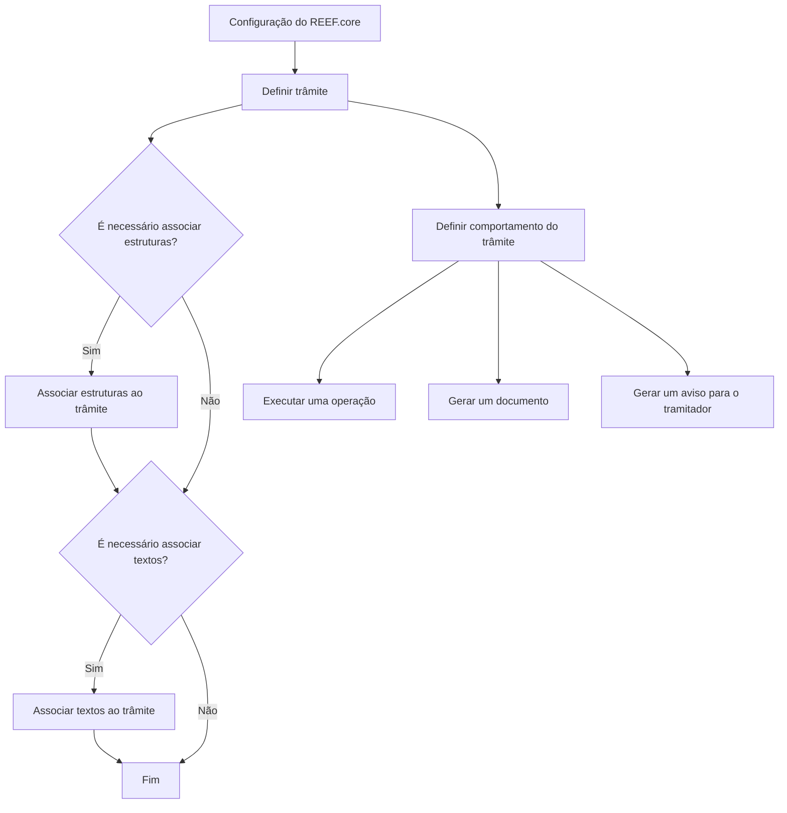

# Definição de Trâmites no REEF.core

## 1. Metadados do Documento
- **Arquivo de Origem:** Não identificado
- **Tipo de Documento:** Procedimento
- **Domínio / Sistema:** REEF.core; planos de tramitação; processo de peritagem
- **Público-Alvo:** Desenvolvedores, analistas funcionais e equipes responsáveis pela configuração do REEF.core
- **Data/Versão Identificada:** Não identificada

---

## 2. Resumo Executivo & Contexto de Negócio

O documento descreve a definição de **trâmites** no sistema REEF.core. A configuração de trâmites é apresentada como necessária para o funcionamento do sistema e para estabelecer o comportamento dos passos que compõem processos de negócio.

Um trâmite representa cada passo necessário para realizar um processo. Como exemplo, o documento apresenta o processo de peritagem, que pode incluir solicitação de peritagem, comunicação com o perito, resultado de peritagem e comunicação com o segurado.

A finalidade declarada é explicar como definir os trâmites que serão utilizados nos diferentes planos de tramitação. A definição permite estabelecer se um trâmite deve executar uma operação, gerar um documento ou gerar um aviso para o tramitador.

O processo de definição é estruturado em etapas de definição do trâmite e associação de elementos ao trâmite. O material apresenta explicitamente associações de operações e textos; o fluxograma também menciona associação de estruturas.

---

## 3. Arquitetura, Componentes & Tecnologias Envolvidas

| Componente / Conceito | Papel descrito |
| :--- | :--- |
| **REEF.core** | Sistema que requer configuração para seu funcionamento. |
| **Trâmite** | Passo necessário para realizar um processo. |
| **Plano de tramitação** | Agrupamento ou contexto no qual diferentes trâmites são definidos. |
| **Operação** | Ação que pode ser executada por um trâmite. |
| **Documento** | Artefato que um trâmite pode gerar. |
| **Aviso para o tramitador** | Comunicação que um trâmite pode gerar para o tramitador. |
| **Textos** | Elementos associados a um trâmite na etapa indicada pelo documento. |
| **Estruturas** | Elementos mencionados no fluxograma como passíveis de associação a um trâmite. |
| **Processo de peritagem** | Exemplo de processo composto por trâmites. |



**Nota de Análise:** O documento cita o REEF.core, mas não detalha arquitetura de software, protocolos, métodos HTTP, contratos JSON, bancos de dados, ambientes ou tecnologias de implementação.

---

## 4. Regras de Negócio, Especificações Funcionais & Processos

### Definição funcional de trâmite

1. Um **trâmite** é cada passo requerido para realizar um processo.
2. O REEF.core necessita de configuração do sistema para seu funcionamento.
3. A configuração de trâmites define o comportamento dos trâmites pertencentes aos diferentes planos de tramitação.
4. Um trâmite pode ser configurado para:
   - executar uma operação;
   - gerar um documento;
   - gerar um aviso para o tramitador.
5. O documento apresenta o processo de peritagem como exemplo de processo composto por múltiplos trâmites.

### Exemplo de trâmites no processo de peritagem

1. Solicitação de peritagem.
2. Comunicação com o perito.
3. Resultado da peritagem.
4. Comunicação com o segurado.

### Processo apresentado para definição de um trâmite

1. **Definir o trâmite.**
2. Verificar se é necessário associar estruturas ao trâmite.
3. Caso necessário, **associar estruturas ao trâmite**.
4. Verificar se é necessário associar textos ao trâmite.
5. Caso necessário, **associar textos ao trâmite**.
6. Finalizar o processo.

### Etapas numeradas textualmente no documento

1. Definir trâmites.
2. Associar operações ao trâmite.
3. Associar textos ao trâmite.

**Nota de Análise:** Há uma divergência entre o fluxograma e a lista textual de etapas. O fluxograma apresenta “Associar Estruturas a um Trâmite (2)”, enquanto a lista textual apresenta “Associar Operações a Trâmite” como etapa 2. O documento fornecido não esclarece se estruturas e operações são conceitos equivalentes ou se existe uma omissão no fluxo.

---

## 5. Tabelas de Parâmetros, Ambientes e Estruturas de Dados

| Item / Parâmetro | Descrição / Função | Tipo / Valores / Formato | Ambiente / Observações |
| :--- | :--- | :--- | :--- |
| REEF.core | Sistema cuja configuração é necessária para funcionamento. | Sistema | Não há ambiente identificado. |
| Trâmite | Passo necessário para realizar um processo. | Elemento de processo | Deve ser definido para os planos de tramitação. |
| Operação | Ação que pode ser executada por um trâmite. | Comportamento possível | O documento não detalha operações disponíveis. |
| Documento | Artefato que pode ser gerado por um trâmite. | Resultado possível | O documento não detalha formato, conteúdo ou repositório. |
| Aviso para o tramitador | Aviso que pode ser gerado por um trâmite. | Resultado possível | Não há detalhamento de canal, destinatário ou formato. |
| Estruturas | Elementos que o fluxograma indica poderem ser associados a um trâmite. | Associação opcional | Não definidas no conteúdo fornecido. |
| Textos | Elementos que podem ser associados a um trâmite. | Associação opcional | Não há formato ou regra de seleção descritos. |
| Plano de tramitação | Contexto que contém os trâmites a serem definidos. | Estrutura de processo | Não detalhado no conteúdo fornecido. |
| Processo de peritagem | Exemplo de processo com múltiplos trâmites. | Processo de negócio | Inclui solicitação, comunicações e resultado de peritagem. |

---

## 6. Bateria de Perguntas & Respostas para RAG (FAQ Sintético)

### P1: O que é um trâmite no contexto do REEF.core?
**R:** Um trâmite é cada passo necessário para realizar um processo. O documento apresenta o processo de peritagem como exemplo de processo formado por vários trâmites.

### P2: Por que os trâmites precisam ser definidos no REEF.core?
**R:** O documento informa que o REEF.core necessita da configuração do sistema para seu funcionamento. A definição de trâmites estabelece o comportamento dos passos utilizados nos diferentes planos de tramitação.

### P3: Quais comportamentos podem ser configurados para um trâmite?
**R:** Um trâmite pode ser configurado para executar uma operação, gerar um documento ou gerar um aviso para o tramitador.

### P4: Qual é o objetivo do documento de definição de trâmites?
**R:** O objetivo é explicar como definir os trâmites que terão os diferentes planos de tramitação.

### P5: Quais são os exemplos de trâmites apresentados para o processo de peritagem?
**R:** O documento apresenta os seguintes exemplos: solicitação de peritagem, comunicação com o perito, resultado da peritagem e comunicação com o segurado.

### P6: Quando estruturas devem ser associadas a um trâmite?
**R:** Segundo o fluxograma, estruturas devem ser associadas ao trâmite quando houver necessidade dessa associação. O documento não define quais tipos de estruturas existem nem os critérios para identificá-las.

### P7: Quando textos devem ser associados a um trâmite?
**R:** O fluxograma indica que textos devem ser associados ao trâmite quando essa associação for necessária. O conteúdo fornecido não especifica formatos, origem ou regras de manutenção desses textos.

### P8: A etapa 2 do processo é associar operações ou associar estruturas?
**R:** O conteúdo apresenta uma inconsistência. A lista textual define a etapa 2 como “Associar Operações a Trâmite”, enquanto o fluxograma mostra “Associar Estruturas a um Trâmite (2)”. Não há esclarecimento adicional que permita concluir se os termos representam a mesma atividade.

### P9: O documento especifica como um documento é gerado por um trâmite?
**R:** Não. O documento afirma que um trâmite pode gerar um documento, mas não informa formatos, templates, regras de geração, armazenamento ou integração envolvida.

### P10: O documento detalha como o aviso ao tramitador é enviado?
**R:** Não. O documento apenas indica que um trâmite pode gerar um aviso para o tramitador, sem descrever canal de comunicação, conteúdo do aviso ou critérios de disparo.

---

## 7. Glossário de Termos, Siglas & Conceitos-Chave

- **REEF.core:** Sistema que necessita de configuração para seu funcionamento, conforme apresentado no documento.
- **Trâmite:** Cada passo requerido para realizar um processo.
- **Plano de tramitação:** Contexto no qual são definidos os diferentes trâmites.
- **Operação:** Ação que um trâmite pode executar.
- **Estruturas:** Elementos citados no fluxograma como associados opcionalmente a um trâmite.
- **Textos:** Elementos que podem ser associados a um trâmite.
- **Tramitador:** Destinatário potencial de um aviso gerado por um trâmite.
- **Peritagem:** Processo de exemplo usado para demonstrar uma sequência de trâmites.

---

## 8. Notas Críticas, Riscos & Limitações

- O documento não identifica arquivo de origem, data, versão, autor ou responsável.
- Não há detalhamento técnico sobre operações, estruturas, textos, documentos ou avisos.
- Não são apresentados métodos de configuração, telas, APIs, contratos, permissões, logs, URLs, servidores ou ambientes.
- Existe divergência entre a etapa 2 descrita na lista textual (“associar operações”) e a etapa 2 exibida no fluxograma (“associar estruturas”).
- O documento não define critérios para decidir quando associar estruturas ou textos.
- O documento não descreve tratamento de erros, validações, dependências externas ou comportamento de falha dos trâmites.

---

## 9. Conteúdo Bruto Estruturado (Referência Fiel)

```text
--- [PÁGINA 1 DE 2] ---

DEFINICIÓN Trámites
¿En que consiste?
Reef.core necesita para su funcionamiento la configuración del sistema.
En este caso se va a definir el comportamiento de los trámites:
Si se necesita que el trámite ejecute una operación
Si se necesita que el trámite genere un documento
Si se necesita que el trámite genere un aviso para el tramitador
Etc.
Objetivo
La finalidad de este documento es explicar cómo definir los trámites que van a tener los distintos
planes de tramitación.
El trámite es cada Paso que se requiere para realizar un proceso.
Por ejemplo en el proceso de Peritación se podrían tener los siguientes trámites o pasos:
Solicitud de la Peritación
Comunicación con el perito
Resultado de la Peritación
Comunicación con el Asegurado
Proceso para la definición de un Trámite
 / 
 CF
Home Solutions APIs Documentation Zeus
EN


--- [PÁGINA 2 DE 2] ---

SI
NO
SI
NO
DEFINIR
Trámite (1)
¿Hay
que
ASOCIAR
Estructuras ASOCIAR
Estructuras a
un Trámite (2)
¿Hay
que
ASOCIAR Textos ASOCIAR Textos
Trámite
(3)
FIN
1. DEFINIR Trámites
2. ASOCIAR Operaciones a Trámite
3. ASOCIAR Textos a Trámite
```
