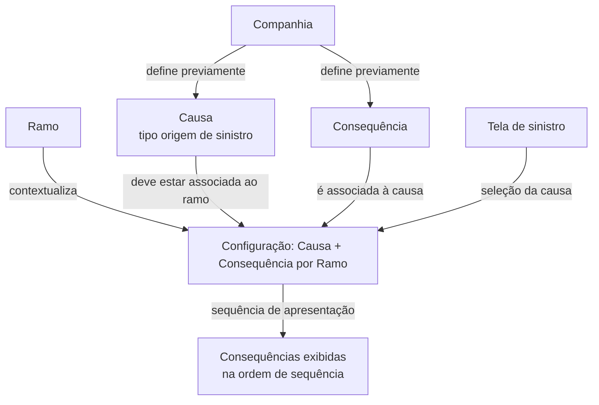
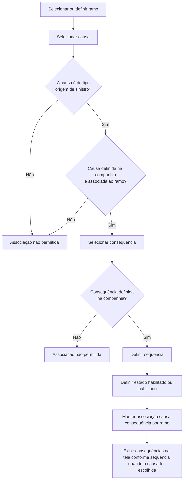

# Definição de Causas e Consequências por Ramo em Sinistros

## 1. Metadados do Documento
- **Arquivo de Origem:** Não identificado no conteúdo fornecido
- **Tipo de Documento:** Especificação Funcional
- **Domínio / Sistema:** Sinistros — manutenção de causas e consequências por ramo
- **Público-Alvo:** Não identificado explicitamente
- **Data/Versão Identificada:** Não identificada

---

## 2. Resumo Executivo & Contexto de Negócio

O documento define a manutenção de **Causas e Consequências por Ramo** no domínio de sinistros. A finalidade declarada é estabelecer, para cada ramo e para cada causa do tipo **“origen de siniestros”**, quais consequências podem ocorrer dentro de um sinistro.

A configuração é baseada na associação entre três elementos principais: ramo, causa e consequência. O ramo determina o contexto de negócio da configuração; a causa identifica a origem de sinistro à qual consequências poderão ser vinculadas; e a consequência representa o resultado associado à causa selecionada.

A especificação estabelece pré-requisitos de cadastro e associação. Somente causas do tipo origem de sinistro, previamente definidas no nível de companhia e associadas ao ramo, podem ser vinculadas. Da mesma forma, somente consequências previamente definidas no nível de companhia podem ser associadas.

Além das associações, o processo mantém a sequência de exibição das consequências na tela e o estado de habilitação ou inabilitação de cada associação causa-consequência. O conteúdo fornecido não detalha APIs, persistência, permissões, validações técnicas adicionais ou contratos de integração.

---

## 3. Arquitetura, Componentes & Tecnologias Envolvidas

Os componentes e referências explicitamente citados são:

| Componente / Referência | Papel identificado no documento |
| :--- | :--- |
| Manutenção Causas Consequências por Ramo | Área funcional para definir consequências permitidas por ramo e causa de sinistro |
| Ramo | Chave do ramo no qual as associações de causa e consequência são definidas |
| Causa | Chave da causa associada às consequências possíveis |
| Consequência | Chave da consequência vinculada a uma causa |
| Companhia | Nível no qual causas e consequências precisam estar previamente definidas |
| Sinistro | Contexto no qual a causa selecionada determina as consequências apresentadas |
| Home Solutions APIs Documentation Zeus | Texto apresentado na navegação ou cabeçalho da interface |
| CF | Texto apresentado na interface; significado não detalhado |
| EN | Texto apresentado na interface; significado não detalhado |



> **Nota de Análise:** O conteúdo descreve relações funcionais entre ramo, causa, consequência, companhia e sinistro, mas não detalha arquitetura de software, tecnologias, microsserviços, métodos HTTP, contratos JSON, banco de dados ou ambientes técnicos.

---

## 4. Regras de Negócio, Especificações Funcionais & Processos

1. A manutenção deve definir, para cada ramo, as consequências permitidas para cada causa do tipo **origem de sinistro**.
2. O atributo **Ramo** é a chave do ramo para o qual as relações de causa e consequência estão sendo definidas.
3. O atributo **Causa** é a chave da causa à qual serão associadas as consequências possíveis.
4. Apenas causas do tipo **origem de sinistro** podem ser associadas.
5. A causa do tipo origem de sinistro deve ter sido previamente definida no nível de companhia.
6. A causa do tipo origem de sinistro deve estar previamente associada ao ramo.
7. O atributo **Consequência** é a chave da consequência que será associada à causa.
8. Apenas consequências previamente definidas no nível de companhia podem ser associadas.
9. O atributo **Sequência** determina a ordem em que as consequências serão apresentadas na tela quando a causa associada for escolhida.
10. O atributo **Inhabilitado** indica se a relação causa-consequência está habilitada ou inabilitada.

### Fluxo funcional identificado



---

## 5. Tabelas de Parâmetros, Ambientes e Estruturas de Dados

| Item / Parâmetro | Descrição / Função | Tipo / Valores / Formato | Ambiente / Observações |
| :--- | :--- | :--- | :--- |
| Ramo | Chave do ramo para o qual são definidas causas e consequências | Chave; formato não detalhado | Contexto principal da associação |
| Causa | Chave da causa à qual são associadas possíveis consequências | Chave; formato não detalhado | Deve ser do tipo origem de sinistro, definida na companhia e associada ao ramo |
| Consequência | Chave da consequência associada à causa | Chave; formato não detalhado | Deve estar previamente definida na companhia |
| Sequência | Ordem de apresentação das consequências na tela | Ordem; formato não detalhado | Aplicada quando a causa associada for escolhida |
| Inhabilitado | Indica se a relação causa-consequência está habilitada ou inabilitada | Estado de habilitação; valores exatos não detalhados | Aplicado à associação causa-consequência |
| Companhia | Nível organizacional de definição prévia de causas e consequências | Não detalhado | Pré-requisito para associação de causa e consequência |
| Sinistro | Contexto no qual consequências são apresentadas após a escolha da causa | Não detalhado | A causa deve ser selecionada para apresentação das consequências |

---

## 6. Bateria de Perguntas & Respostas para RAG (FAQ Sintético)

### P1: Qual é a finalidade da manutenção de Causas Consequências por Ramo?
**R:** A finalidade é definir, para cada ramo e para cada causa do tipo origem de sinistro, quais consequências podem ocorrer dentro de um sinistro.

### P2: Qual é o papel do atributo Ramo na configuração?
**R:** O atributo Ramo é a chave do ramo para o qual estão sendo definidas as associações entre causas e consequências.

### P3: Quais causas podem ser associadas a consequências?
**R:** Somente causas do tipo origem de sinistro podem ser associadas a consequências. Essas causas também devem ter sido previamente definidas no nível de companhia e associadas ao ramo.

### P4: Uma causa definida na companhia pode ser associada a qualquer ramo?
**R:** Não necessariamente. Além de ser previamente definida no nível de companhia, a causa deve estar previamente associada ao ramo para que possa participar da configuração de causas e consequências por ramo.

### P5: Quais consequências podem ser vinculadas a uma causa?
**R:** Somente consequências previamente definidas no nível de companhia podem ser associadas a uma causa.

### P6: O que representa o atributo Consequência?
**R:** O atributo Consequência é a chave da consequência que será associada à causa selecionada na configuração por ramo.

### P7: Para que serve o atributo Sequência?
**R:** O atributo Sequência indica a ordem em que as consequências aparecerão na tela quando for escolhida a causa à qual essas consequências estão associadas.

### P8: O que significa o atributo Inhabilitado?
**R:** O atributo Inhabilitado indica se a associação entre causa e consequência está inabilitada ou habilitada.

### P9: Quando as consequências configuradas são apresentadas ao usuário?
**R:** As consequências aparecem na tela quando o usuário escolhe a causa à qual as consequências estão associadas, respeitando a ordem definida no atributo Sequência.

### P10: O documento detalha os métodos HTTP ou contratos de API da manutenção?
**R:** Não. O conteúdo fornecido menciona textos de navegação como “APIs Documentation”, mas não detalha métodos HTTP, endpoints, contratos JSON, autenticação ou integrações técnicas.

---

## 7. Glossário de Termos, Siglas & Conceitos-Chave

- **Causa:** Chave da causa à qual serão associadas possíveis consequências.
- **Causa tipo origem de sinistro:** Tipo de causa que pode ser associado a consequências, desde que esteja previamente definido no nível de companhia e associado ao ramo.
- **Consequência:** Chave da consequência associada a uma causa.
- **Companhia:** Nível no qual causas e consequências devem ser previamente definidas.
- **Inhabilitado:** Propriedade que indica se a associação causa-consequência está inabilitada ou habilitada.
- **Ramo:** Chave do ramo para o qual são definidas as causas e consequências.
- **Sequência:** Propriedade que define a ordem de exibição das consequências na tela.
- **Sinistro:** Contexto em que uma causa pode ser selecionada e suas consequências associadas são apresentadas.
- **CF:** Termo exibido no conteúdo bruto; significado não detalhado.
- **EN:** Termo exibido no conteúdo bruto; significado não detalhado.

---

## 8. Notas Críticas, Riscos & Limitações

- O documento não identifica o arquivo de origem, autor, data, versão ou público-alvo.
- O documento não detalha o significado de **CF**, **EN**, **Home Solutions**, **APIs Documentation** ou **Zeus**.
- Não foram identificados endpoints, métodos HTTP, payloads JSON, modelos de dados, regras de persistência, mensagens de erro ou mecanismos de autenticação.
- O formato das chaves de ramo, causa e consequência não é especificado.
- Os valores concretos aceitos para o atributo **Inhabilitado** não são detalhados.
- O documento menciona um exemplo, mas nenhum conteúdo de exemplo foi disponibilizado após o marcador `Ejemplo:`.
- Não há detalhamento sobre comportamento para associações duplicadas, exclusão de associações, alteração da sequência, permissões de manutenção ou auditoria de alterações.

---

## 9. Conteúdo Bruto Estruturado (Referência Fiel)

```text
--- [PÁGINA 1 DE 3] ---

DEFINICIÓN Causa Consecuencias por Ramo
Objetivo
La finalidad es definir para cada ramo, para cada causa de tipo "origen de siniestros" qué
consecuencia o consecuencias se van a poder dar dentro de un siniestro.
Imagen del Mantenimiento Causas Consecuencias por Ramo:
 /
 CF
Home Solutions APIs Documentation Zeus
EN


--- [PÁGINA 2 DE 3] ---

Causas Consecuencias Por Ramo
En este apartado se detallarán todos los atributos, propiedades, que habrá que definir por ramo, para
cada causa.
Ramo
Esta propiedad será la clave del ramo para la que estamos definiendo las causas consecuencias.
Causa
Esta propiedad será la clave de la causa a la que estamos asociando las posibles consecuencias.
Sólo se podrán asociar las causas tipo origen de siniestro, que previamente se hayan definido a nivel
de compañía y asociado al ramo.
Consecuencia
Esta propiedad será la clave de la consecuencia que vamos a asociar a la causa.
Sólo se podrán asociar las consecuencias que previamente se hayan definido a nivel de compañía.
Secuencia


--- [PÁGINA 3 DE 3] ---

Esta propiedad indicará el orden en el que las consecuencias aparecerán en la pantalla, en el caso
de que es elija la causa a la que están asociadas.
Inhabilitado
Esta propiedad indica si la causa consecuencia está inhabilitada o habilitada.
Ejemplo:
```
