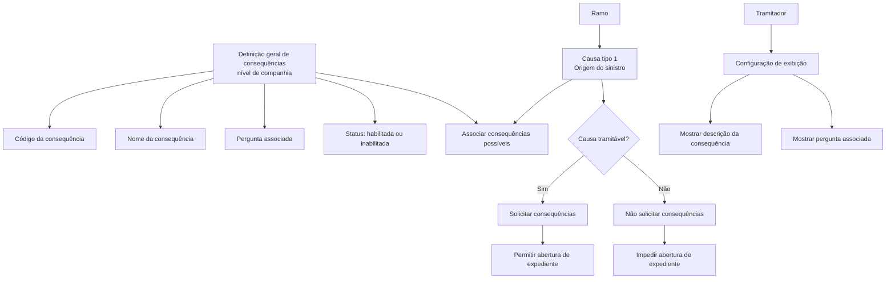

# Definição e Manutenção de Consequências de Sinistros

## 1. Metadados do Documento
- **Arquivo de Origem:** Não identificado no conteúdo fornecido
- **Tipo de Documento:** Especificação Funcional
- **Domínio / Sistema:** Definições de consequências de sinistros por ramo
- **Público-Alvo:** Analistas funcionais, tramitadores, equipes de negócio e desenvolvimento
- **Data/Versão Identificada:** Não identificada

---

## 2. Resumo Executivo & Contexto de Negócio

O documento define o conceito de **consequências de um sinistro**, entendidas como todos os danos ou eventos que podem decorrer de um sinistro. Entre os exemplos apresentados estão danos ao veículo segurado, danos pessoais ao segurado, morte, invalidez permanente, danos ao conteúdo e mercadoria danificada.

A definição de consequências é realizada em nível de companhia, permitindo que uma mesma consequência seja reutilizada por um ou mais ramos. Após a definição corporativa, cada ramo deve associar suas causas às consequências que podem ocorrer para cada causa.

O documento estabelece que as causas associadas aos ramos são do tipo 1, identificadas como **Origem do sinistro**. Cada causa deve possuir associação com todas as consequências possíveis aplicáveis ao respectivo contexto de ramo.

A manutenção geral de consequências contém propriedades comuns a todos os ramos. Entre essas propriedades estão o código da consequência, o nome da consequência, uma pergunta associada, o status de habilitação e vínculos com a configuração do tramitador.

O comportamento operacional depende da condição de tratabilidade da causa. Quando uma causa não é tramitável, o sistema não solicita consequências e não permite abrir expedientes até que a causa seja alterada para uma causa tramitável.

---

## 3. Arquitetura, Componentes & Tecnologias Envolvidas

O conteúdo descreve uma estrutura funcional de definição e associação de consequências, composta pelos seguintes elementos:

- **Definição geral de consequências:** cadastro corporativo e reutilizável entre ramos.
- **Ramos:** contexto no qual as consequências são configuradas posteriormente.
- **Causas do ramo:** causas do tipo 1, classificadas como origem do sinistro.
- **Consequências:** danos ou eventos possíveis decorrentes de uma causa de sinistro.
- **Tramitador:** usuário ou perfil cuja configuração determina se o sistema apresenta a descrição da consequência ou a pergunta associada.
- **Expedientes:** não podem ser abertos quando a causa não é tramitável.
- **Mantenimiento Consecuencias:** funcionalidade/tela indicada para manutenção geral das consequências.
- **Mantenimiento Definiciones Pregunta por Consecuencia:** funcionalidade/tela indicada para manutenção de perguntas por consequência.
- **Home Solutions APIs Documentation Zeus:** texto presente na extração, sem detalhamento técnico ou relação funcional adicional.



> **Nota de Análise:** O documento não detalha tecnologias de implementação, contratos de API, banco de dados, métodos HTTP, URLs de ambiente, autenticação ou integrações técnicas entre sistemas.

---

## 4. Regras de Negócio, Especificações Funcionais & Processos

### 4.1 Definição de consequência

Uma consequência representa um dano ou evento que pode ser produzido em decorrência de um sinistro. O documento cita os seguintes exemplos:

- Danos ao veículo segurado.
- Danos pessoais ao segurado.
- Morte.
- Invalidez permanente.
- Danos ao conteúdo.
- Mercadoria danificada.

### 4.2 Escopo corporativo e reutilização

A definição de consequências ocorre em nível de companhia. Como consequência dessa definição corporativa:

1. Uma mesma chave de consequência pode ser utilizada em um ou vários ramos.
2. Consequências podem ser reutilizadas entre ramos.
3. Após a definição geral, cada ramo deve configurar quais consequências podem ser associadas a cada causa do ramo.

### 4.3 Associação entre ramo, causa e consequência

Quando consequências são associadas aos ramos, as causas envolvidas são causas do tipo 1, definidas como **Origem do sinistro**.

Para cada causa de um ramo, devem ser associadas todas as consequências possíveis. A configuração por ramo complementa a definição corporativa reutilizável das consequências.

### 4.4 Propriedades gerais da consequência

As propriedades gerais são atributos comuns a todos os ramos e não variam por ramo. As propriedades descritas são:

1. **Código da consequência**
   - É a chave de identificação das diferentes consequências.
   - Uma chave pode ser usada por um ou vários ramos.

2. **Nome da consequência**
   - Contém a descrição da chave definida para a consequência.

3. **Pergunta associada à consequência**
   - Contém a pergunta associada à chave definida para a consequência.
   - O sistema pode exibir a descrição da chave da consequência ou a pergunta associada à chave.

4. **Inabilitada**
   - Indica se uma consequência definida está habilitada para ser associada a um ramo.
   - Quando inabilitada, a consequência deixa de poder ser utilizada na definição de consequências por ramo.

5. **Vínculos com o tramitador**
   - Há um atributo na definição do tramitador que determina a forma de exibição.
   - Para cada tramitador, o atributo indica se será apresentada a descrição da consequência ou a pergunta associada.

### 4.5 Regra para novos tramitadores

Quando um tramitador é novo e for necessário que perguntas sejam realizadas, essa necessidade deve ser indicada no momento do registro do tramitador.

O documento não especifica o nome técnico do atributo, os valores possíveis, a tela de cadastro ou o processo de aprovação do registro do tramitador.

### 4.6 Regra de causa não tramitável

Quando uma causa não é tramitável:

1. O sistema não solicita as consequências.
2. Não é possível abrir expedientes.
3. A abertura de expedientes somente se torna possível quando a causa for modificada para uma causa tramitável.

---

## 5. Tabelas de Parâmetros, Ambientes e Estruturas de Dados

| Item / Parâmetro | Descrição / Função | Tipo / Valores / Formato | Ambiente / Observações |
| :--- | :--- | :--- | :--- |
| Consequência | Dano ou evento que pode decorrer de um sinistro | Exemplos: danos ao veículo segurado, danos pessoais ao segurado, morte, invalidez permanente, danos ao conteúdo, mercadoria danificada | Definição em nível de companhia |
| Código da consequência | Chave de identificação das consequências | Chave; formato não informado | Pode ser utilizada em um ou vários ramos |
| Nome da consequência | Descrição da chave definida para uma consequência | Texto; formato não informado | Propriedade geral, comum a todos os ramos |
| Pergunta associada à consequência | Pergunta relacionada à chave da consequência | Texto; formato não informado | Pode ser apresentada no lugar da descrição da consequência |
| Inabilitada | Indica se a consequência pode ser associada a um ramo | Habilitada ou inabilitada; codificação não informada | Consequência inabilitada não pode ser usada na definição por ramo |
| Ramo | Contexto posterior de definição de consequências por causa | Não informado | Pode reutilizar consequências corporativas |
| Causa | Origem relacionada a um sinistro no contexto de um ramo | Tipo 1: Origem do sinistro | Deve ser associada às consequências possíveis |
| Causa tramitável | Causa que permite solicitar consequências e abrir expedientes | Sim/Não implícito; formato não informado | Condição para abertura de expediente |
| Causa não tramitável | Causa que impede a solicitação de consequências e a abertura de expedientes | Sim/Não implícito; formato não informado | Deve ser alterada para uma causa tramitável para permitir abertura |
| Tramitador | Entidade configurada para visualizar descrição ou pergunta | Novo ou existente; detalhes não informados | Deve ser configurado no registro caso seja necessário realizar perguntas |
| Atributo da definição do tramitador | Define se o sistema mostra descrição da consequência ou pergunta associada | Valores não informados | Configuração específica por tramitador |
| Expediente | Registro cuja abertura é condicionada à tratabilidade da causa | Não informado | Não pode ser aberto para causa não tramitável |
| Mantenimiento Consecuencias | Tela/funcionalidade citada para manutenção geral | Nome de interface citado no documento | Sem detalhamento adicional |
| Mantenimiento Definiciones Pregunta por Consecuencia | Tela/funcionalidade citada para manutenção de perguntas por consequência | Nome de interface citado no documento | Sem detalhamento adicional |
| Home Solutions APIs Documentation Zeus | Texto identificado na extração literal | Não informado | O documento não explica sua função ou integração |

---

## 6. Bateria de Perguntas & Respostas para RAG (FAQ Sintético)

### P1: O que é uma consequência de sinistro neste processo?
**R:** Uma consequência de sinistro é qualquer dano ou evento que pode ocorrer em decorrência de um sinistro. O documento apresenta como exemplos danos ao veículo segurado, danos pessoais ao segurado, morte, invalidez permanente, danos ao conteúdo e mercadoria danificada.

### P2: Em qual nível são definidas as consequências de sinistro?
**R:** As consequências são definidas em nível de companhia. Essa definição corporativa permite que as consequências sejam reutilizadas posteriormente em um ou vários ramos.

### P3: Uma mesma consequência pode ser utilizada em vários ramos?
**R:** Sim. O documento informa que a definição é realizada em nível de companhia para permitir a reutilização das mesmas consequências em vários ramos. Depois da definição geral, cada ramo deve configurar quais consequências podem ser aplicadas a cada uma de suas causas.

### P4: Qual tipo de causa deve ser associado às consequências no ramo?
**R:** As consequências devem ser associadas a causas do tipo 1, definidas no documento como causas de **Origem do sinistro**. Para cada causa, devem ser associadas todas as consequências possíveis.

### P5: Qual é a função do código da consequência?
**R:** O código da consequência é a chave usada para identificar as diferentes consequências. A mesma chave pode ser utilizada para um ou mais ramos.

### P6: Qual é a diferença entre o nome da consequência e a pergunta associada?
**R:** O nome da consequência contém a descrição da chave definida para a consequência. A pergunta associada contém uma pergunta vinculada à mesma chave. O sistema pode apresentar ao usuário a descrição da consequência ou a pergunta associada, conforme a configuração do tramitador.

### P7: O que determina se o sistema mostra a descrição da consequência ou uma pergunta?
**R:** Um atributo existente na definição do tramitador determina, para aquele tramitador, se o sistema deve mostrar a descrição da consequência ou a pergunta associada à chave da consequência.

### P8: Como deve ser configurado um novo tramitador para que o sistema faça perguntas?
**R:** Se um tramitador for novo e houver necessidade de realizar perguntas, essa condição deve ser indicada durante o registro desse tramitador. O documento não detalha o atributo técnico nem os valores de configuração utilizados.

### P9: O que significa uma consequência estar inabilitada?
**R:** Uma consequência inabilitada não está disponível para ser associada a um ramo. O atributo de inabilitação informa se a consequência definida ainda pode ser utilizada na definição de consequências por ramo.

### P10: As consequências são solicitadas quando a causa não é tramitável?
**R:** Não. Quando a causa não é tramitável, o sistema não solicita consequências.

### P11: É possível abrir um expediente quando a causa não é tramitável?
**R:** Não. Não podem ser abertos expedientes enquanto a causa não for modificada para uma causa tramitável.

### P12: O documento descreve APIs, métodos HTTP ou contratos JSON para a manutenção de consequências?
**R:** Não. O conteúdo menciona “Home Solutions APIs Documentation Zeus”, mas não apresenta métodos HTTP, endpoints, contratos JSON, esquemas de dados, autenticação ou detalhes técnicos de integração.

---

## 7. Glossário de Termos, Siglas & Conceitos-Chave

- **Consequência:** Dano ou evento que pode decorrer de um sinistro.
- **Sinistro:** Evento a partir do qual podem ser produzidos danos ou outras consequências.
- **Ramo:** Contexto no qual causas e consequências são configuradas após a definição corporativa das consequências.
- **Causa:** Elemento associado ao ramo que pode possuir uma ou mais consequências possíveis.
- **Causa tipo 1:** Tipo de causa identificado como origem do sinistro.
- **Origem do sinistro:** Classificação atribuída às causas do tipo 1.
- **Código da consequência:** Chave de identificação de uma consequência.
- **Nome da consequência:** Descrição da chave definida para uma consequência.
- **Pergunta associada à consequência:** Pergunta vinculada à chave de uma consequência.
- **Tramitador:** Entidade cuja definição contém atributo que regula a apresentação da descrição ou da pergunta associada à consequência.
- **Causa tramitável:** Causa que permite solicitar consequências e abrir expedientes.
- **Causa não tramitável:** Causa que impede a solicitação de consequências e a abertura de expedientes.
- **Expediente:** Registro que não pode ser aberto enquanto a causa não for tramitável.
- **Inabilitada:** Estado de uma consequência que impede sua utilização na definição de consequências por ramo.
- **Mantenimiento Consecuencias:** Nome de funcionalidade/tela citada para manutenção geral de consequências.
- **Mantenimiento Definiciones Pregunta por Consecuencia:** Nome de funcionalidade/tela citada para manutenção de perguntas por consequência.

---

## 8. Notas Críticas, Riscos & Limitações

- O documento não informa nome, versão, data ou autoria do arquivo de origem.
- O documento não especifica o nome técnico, formato, domínio de valores ou persistência dos atributos de consequência e tramitador.
- Não há detalhamento de APIs, endpoints, métodos HTTP, contratos JSON, protocolos de integração, autenticação, banco de dados ou tecnologias implementadas.
- Não há regras explícitas para alteração, exclusão, auditoria, histórico ou versionamento de consequências, causas e associações por ramo.
- A condição de tratabilidade da causa é uma dependência crítica para o processo operacional, pois uma causa não tramitável bloqueia tanto a solicitação de consequências quanto a abertura de expedientes.
- O atributo que controla a exibição de descrição ou pergunta está associado à definição do tramitador, mas o documento não apresenta os possíveis valores, comportamento padrão ou tratamento para configurações ausentes.
- O texto cita imagens de telas de manutenção, mas as imagens não estão disponíveis na extração fornecida; portanto, campos visuais adicionais não puderam ser inferidos.
- **Nota de Análise:** O texto menciona “Home Solutions APIs Documentation Zeus”, mas não fornece explicação suficiente para definir sua finalidade, relação com as consequências ou requisitos de integração.

---

## 9. Conteúdo Bruto Estruturado (Referência Fiel)

```text
--- [PÁGINA 1 DE 4] ---

DEFINICIÓN de Consecuencias
Objetivo
La finalidad es definir todas las consecuencias que se puedan derivar de un siniestro, es decir todos
los daños que se puedan producir a raíz de un siniestro, tales como: - Daños al vehículo
asegurado
- Daños personales asegurado
- Muerte
- Invalidez Permanente
- Daños al Contenido
- Mercancía Dañada
Cuando las consecuencias se asocien a los ramos, se va asociar las causa de tipo 1(Origen del
siniestro). A cada Causa, se le tienen que asociar todas las posibles consecuencias posibles.
Propiedades Generales
En este apartado se detallarán todas las propiedades de las consecuencias comunes a todos los
ramos, es decir los atributos que no cambian por ramo.
Imagen del Mantenimiento Consecuencias a nivel General:
 / 
 CF
Home Solutions APIs Documentation Zeus
EN


--- [PÁGINA 2 DE 4] ---

Código de la Consecuencia
Esta propiedad será la clave por la que se va a identificar las distintas consecuencias.
Una clave podrá ser utilizada para uno o varios ramos.
Nombre de la Consecuencia
Esta propiedad contendrá la descripción de la clave definida para la consecuencia.
Pregunta asociada a la Consecuencia
Imagen del Mantenimiento Definiciones Pregunta por Consecuencia:
Ejemplos


--- [PÁGINA 3 DE 4] ---

Esta propiedad contendrá la pregunta asociada a la clave definida para la consecuencia.
El sistema permite que se muestre la descripción de la clave de la consecuencia o la pregunta
asociada a la clave.
Si un tramitador es nuevo y se quiere que se realicen preguntas, habrá que indicarlo cuando se
registre a dicho tramitador.
Inhabilitada
Esta propiedad indica si la consecuencia que está definida está habilitada para poder ser asociada a
un ramo, o por el contrario, ya no está habilitada para poder ser utilizada en la definición de
consecuencias por Ramo.
Vínculos
Para que se muestre la descripción de la consecuencia o la pregunta, hay un atributo en la definición
del tramitador que indica si para ese tramitador, se muestra la descripción de la consecuencia o la
pregunta.
Preguntas frecuentes
Ejemplos


--- [PÁGINA 4 DE 4] ---

¿Cuándo la causa es no tramitable se van a pedir las consecuencias?
No, cuando la causa no es tramitable no se van a pedir las consecuencias por lo que no se
podrán abrir expedientes hasta que la causa no sea modificada por una causa tramitable.
¿Se pueden utilizar las mismas consecuencias para varios ramos?
Si, esta definición es a nivel de compañía para que puedan ser reutilizadas para varios ramos.
Posteriormente a esta definición, se se tendrán que definir por Ramo, cada causa del ramo que
consecuencias puede tener.
```
