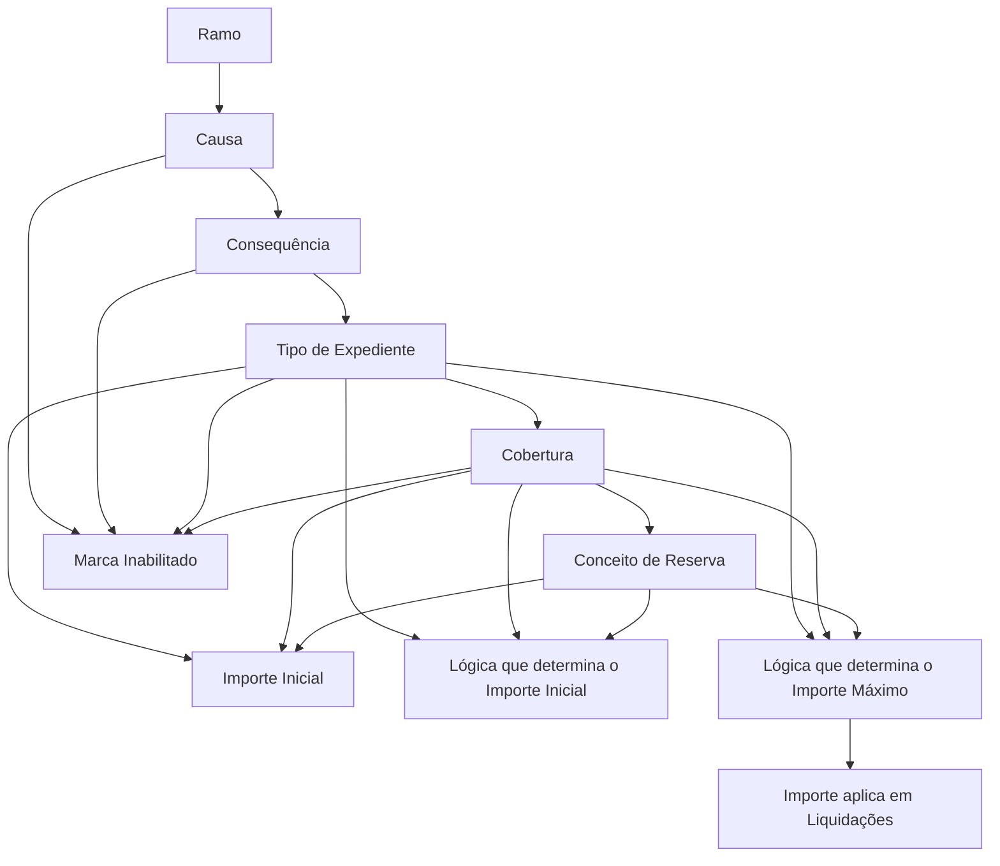
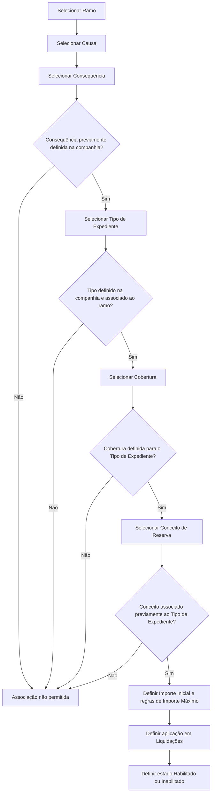

# Definição de Provisão por Causa, Consequência, Tipo de Expediente, Cobertura e Conceito de Reserva

## 1. Metadados do Documento
- **Arquivo de Origem:** `Não identificado`
- **Tipo de Documento:** `Especificação Funcional`
- **Domínio / Sistema:** `Provisões, expedientes, coberturas e conceitos de reserva`
- **Público-Alvo:** `Negócio, operação e equipes responsáveis pela configuração de ramos`
- **Data/Versão Identificada:** `Não identificada`

---

## 2. Resumo Executivo & Contexto de Negócio

O documento define a manutenção de combinações entre ramo, causa, consequência, tipo de expediente, cobertura e conceito de reserva. O objetivo é determinar quais consequências, tipos de expediente, coberturas, conceitos de reserva, validações e valores iniciais podem ser associados a cada causa dentro de um ramo.

A configuração permite estabelecer o importe inicial de abertura e o importe máximo de reserva para cada combinação de Tipo de Expediente, Cobertura e Conceito de Reserva. O importe inicial pode ser fixo ou determinado por uma lógica de negócio. A lógica de negócio também pode determinar o importe máximo de reserva.

As associações dependem de cadastros e associações prévias: causas precisam estar definidas no nível correspondente; consequências e tipos de expediente precisam estar definidos no nível de companhia; tipos de expediente devem estar associados ao ramo; coberturas devem estar definidas para o tipo de expediente; e conceitos de reserva devem estar previamente associados ao tipo de expediente.

---

## 3. Arquitetura, Componentes & Tecnologias Envolvidas

O documento não descreve uma arquitetura de software, tecnologias, APIs, contratos HTTP, bancos de dados, ambientes ou integrações entre microsserviços. O conteúdo descreve um modelo funcional de manutenção e validação de associações para provisões.

Os componentes funcionais identificados são:

| Componente | Função descrita |
| :--- | :--- |
| Ramo | Chave do ramo para o qual são definidas causas e consequências. |
| Causa | Chave da causa associada às possíveis consequências. |
| Consequência | Chave da consequência associada a uma causa. |
| Tipo de Expediente | Tipo de expediente associado à causa e à consequência. |
| Cobertura | Cobertura associada à causa, consequência e tipo de expediente. |
| Conceito de Reserva | Conceito de reserva que pode ser valorizado e liquidado para a combinação configurada. |
| Importe Inicial | Valor pelo qual inicialmente é aberto o Tipo de Expediente, Cobertura e Conceito de Reserva, salvo introdução manual de outro importe. |
| Lógica do Importe Inicial | Regra de negócio usada quando o importe inicial não é fixo. |
| Lógica do Importe Máximo | Regra de negócio usada para determinar o importe máximo de reserva. |
| Importe aplica em Liquidações | Indicador de aplicação da lógica do importe máximo também às liquidações. |
| Inabilitado | Marca que impede o uso da combinação na abertura de expedientes. |



> **Nota de Análise:** O documento apresenta elementos de navegação como “Home Solutions APIs Documentation Zeus” e “CF”, mas não fornece explicação funcional ou técnica suficiente para classificá-los como sistemas, APIs ou componentes da solução.

---

## 4. Regras de Negócio, Especificações Funcionais & Processos

### 4.1 Objetivo da definição

A definição associa, para cada ramo e causa:

- Consequências.
- Tipos de expediente.
- Coberturas definidas no ramo.
- Conceitos de reserva.
- Validações.
- Valores iniciais.
- Importe inicial.
- Importe máximo.

### 4.2 Regras de pré-requisitos para associação

1. A propriedade **Ramo** é a chave do ramo para o qual são definidas as causas e consequências.
2. A propriedade **Causa** é a chave da causa à qual serão associadas possíveis consequências.
3. Apenas podem ser associadas causas previamente definidas no nível de causa, consequências, tipo de expediente, cobertura e conceito de reserva.
4. A propriedade **Consequência** é a chave da consequência que será associada à causa.
5. Apenas podem ser associadas consequências previamente definidas no nível de companhia.
6. A propriedade **Tipo de Expediente** é a chave do tipo de expediente associado à causa e à consequência.
7. Apenas podem ser associados tipos de expediente previamente definidos no nível de companhia e posteriormente associados ao ramo em configuração.
8. A propriedade **Cobertura** é a chave da cobertura associada à causa, consequência e tipo de expediente.
9. Apenas podem ser associadas coberturas previamente definidas para o tipo de expediente.
10. A propriedade **Conceito de Reserva** contém o conceito de reserva que pode ser valorizado e liquidado para a combinação de causa, consequência, tipo de expediente e cobertura.
11. O conceito de reserva deve estar previamente associado ao tipo de expediente para ser incluído na definição.

### 4.3 Regras de importes e lógicas de negócio

1. O **Importe Inicial** contém o valor pelo qual inicialmente será aberto o Tipo de Expediente, Cobertura e Conceito de Reserva.
2. Um importe diferente pode ser introduzido manualmente.
3. A **Lógica que determina o Importe Inicial** determina o importe inicial por Tipo de Expediente, Cobertura e Conceito de Reserva quando o valor não for fixo e depender de outros fatores.
4. A **Lógica que determina o Importe Máximo** determina o importe máximo de reserva por Tipo de Expediente, Cobertura e Conceito de Reserva.
5. Quando não existir lógica de negócio definida para o importe máximo, o importe máximo deve ser interpretado como o capital da cobertura.
6. A propriedade **Importe aplica em Liquidações** indica se a lógica de negócio do importe máximo, além de afetar as reservas, também se aplica às liquidações.

### 4.4 Regras de habilitação

1. A marca **Inabilitado** determina se a combinação de Causa, Consequência, Tipo de Expediente e Cobertura está habilitada ou inabilitada.
2. Uma combinação inabilitada deixa de poder ser utilizada na abertura de expedientes.

### 4.5 Regras para consequências e abertura de expedientes

1. Podem existir, dentro de uma mesma causa, duas consequências que afetem o mesmo Tipo de Expediente, Cobertura e Conceito de Reserva.
2. Quando duas consequências afetam a mesma combinação de Tipo de Expediente, Cobertura e Conceito de Reserva, as consequências são excludentes.
3. Ao selecionar uma dessas consequências durante a abertura de um sinistro, a outra consequência não pode ser selecionada.
4. Quando duas consequências afetam o mesmo expediente e a mesma cobertura, mas possuem conceitos de reserva diferentes, não são abertos dois expedientes.
5. Nesse caso, é aberto um único expediente, com a mesma cobertura e conceitos de reserva distintos.



---

## 5. Tabelas de Parâmetros, Ambientes e Estruturas de Dados

| Item / Parâmetro | Descrição / Função | Tipo / Valores / Formato | Ambiente / Observações |
| :--- | :--- | :--- | :--- |
| Ramo | Chave do ramo para o qual são definidas causas e consequências. | Chave do ramo. | Não detalhado. |
| Causa | Chave da causa à qual são associadas consequências. | Chave da causa. | Deve estar previamente definida. |
| Consequência | Chave da consequência associada à causa. | Chave da consequência. | Deve estar previamente definida no nível de companhia. |
| Tipo de Expediente | Chave do tipo de expediente associada à causa e à consequência. | Chave do tipo de expediente. | Deve estar definido no nível de companhia e associado posteriormente ao ramo. |
| Cobertura | Chave da cobertura associada à causa, consequência e tipo de expediente. | Chave da cobertura. | Deve estar previamente definida para o tipo de expediente. |
| Conceito de Reserva | Conceito de reserva que pode ser valorizado e liquidado para a combinação configurada. | Conceito de reserva. | Deve estar previamente associado ao tipo de expediente. |
| Importe Inicial | Valor inicial de abertura para Tipo de Expediente, Cobertura e Conceito de Reserva. | Importe. | Pode ser substituído por outro importe introduzido manualmente. |
| Lógica que determina o Importe Inicial | Regra de negócio que calcula o importe inicial quando o valor não é fixo. | Lógica de negócio. | Depende de outros fatores não detalhados no documento. |
| Lógica que determina o Importe Máximo | Regra de negócio que determina o importe máximo de reserva. | Lógica de negócio. | Sem lógica definida, o máximo é interpretado como o capital da cobertura. |
| Importe aplica em Liquidações | Indica se a lógica do importe máximo também deve afetar liquidações. | Indicador. | Valores possíveis não detalhados. |
| Inabilitado | Indica se a combinação configurada pode ser utilizada na abertura de expedientes. | Marca / indicador. | Combinação inabilitada não pode ser usada na abertura de expedientes. |

### Exemplo de combinações apresentado no documento

| Causa | Descrição da Causa | Consequência | Descrição da Consequência | Tipo Exp. | Cobertura | Cto. Rva | Conceito de Reserva |
| :--- | :--- | :--- | :--- | :--- | :--- | :--- | :--- |
| 3001 | Despiste | 3001 | Daños Vehículo Asegurado | DPM | 3001 Daños Propios | 1 | Indemnización |
| 3001 | Despiste | 3002 | Daños Vehículo Asegurado Honorarios | DPM | 3001 Daños Propios | 2 | Honorarios |

### Resultado de abertura de expediente descrito

| Tipo de Expediente | Cobertura | Conceito de Reserva |
| :--- | :--- | :--- |
| DPM | 3001 Daños Propios | 1 Indemnización |
| DPM | 3001 Daños Propios | 2 Honorarios |

---

## 6. Bateria de Perguntas & Respostas para RAG (FAQ Sintético)

### P1: Qual é o objetivo da definição de provisão por causa, consequência, tipo de expediente, cobertura e conceito de reserva?
**R:** O objetivo é associar, para cada ramo e causa, as consequências, tipos de expediente, coberturas, conceitos de reserva, validações e valores iniciais aplicáveis. A definição também permite configurar o importe inicial e o importe máximo para cada combinação.

### P2: Uma consequência pode ser associada a uma causa sem estar previamente definida?
**R:** Não. Apenas podem ser associadas consequências previamente definidas no nível de companhia.

### P3: Quais condições um tipo de expediente deve cumprir para ser associado a uma causa e consequência?
**R:** O tipo de expediente deve estar previamente definido no nível de companhia e deve ter sido posteriormente associado ao ramo que está sendo configurado.

### P4: Uma cobertura pode ser selecionada para qualquer tipo de expediente?
**R:** Não. Apenas podem ser associadas coberturas previamente definidas para o tipo de expediente correspondente.

### P5: Qual é o pré-requisito para incluir um conceito de reserva na definição?
**R:** O conceito de reserva deve estar previamente associado ao Tipo de Expediente antes de poder ser incluído na definição de Causa, Consequência, Tipo de Expediente e Cobertura.

### P6: Como é determinado o importe inicial de uma combinação?
**R:** O importe inicial é o valor pelo qual inicialmente será aberto o Tipo de Expediente, Cobertura e Conceito de Reserva. Esse valor pode ser introduzido manualmente ou determinado por uma lógica de negócio quando não for fixo.

### P7: O que acontece se não existir lógica de negócio para determinar o importe máximo?
**R:** Quando não existe lógica de negócio definida para o importe máximo, o sistema interpreta que o importe máximo é o capital da cobertura.

### P8: A lógica do importe máximo pode ser aplicada às liquidações?
**R:** Sim. A propriedade “Importe aplica en las Liquidaciones” indica se a lógica de negócio do importe máximo, além de afetar as reservas, também deve ser aplicada às liquidações.

### P9: O que significa marcar uma combinação como inabilitada?
**R:** A marca “Inhabilitado” indica que a combinação de Causa, Consequência, Tipo de Expediente e Cobertura está inabilitada e não pode mais ser utilizada na abertura de expedientes.

### P10: Duas consequências da mesma causa podem afetar o mesmo Tipo de Expediente, Cobertura e Conceito de Reserva?
**R:** Sim. Entretanto, essas consequências são excludentes: se uma consequência for selecionada na abertura de um sinistro, a outra não poderá ser selecionada.

### P11: São abertos dois expedientes quando duas consequências possuem a mesma cobertura, mas conceitos de reserva diferentes?
**R:** Não. É aberto um único expediente com a mesma cobertura e conceitos de reserva distintos.

### P12: No exemplo apresentado, qual expediente é aberto para a causa 3001?
**R:** Para a causa 3001, descrita como “Despiste”, é aberto um expediente do tipo DPM com a cobertura “3001 Daños Propios” e dois conceitos de reserva: “1 Indemnización” e “2 Honorarios”.

---

## 7. Glossário de Termos, Siglas & Conceitos-Chave

- **Ramo:** Chave do ramo para o qual são definidas causas e consequências.
- **Causa:** Chave da causa à qual são associadas possíveis consequências.
- **Consequência:** Chave da consequência associada a uma causa.
- **Tipo de Expediente:** Tipo de expediente associado à causa e à consequência.
- **Cobertura:** Cobertura associada à causa, consequência e tipo de expediente.
- **Conceito de Reserva:** Conceito de reserva que pode ser valorizado e liquidado para uma combinação configurada.
- **Importe Inicial:** Valor inicial de abertura de Tipo de Expediente, Cobertura e Conceito de Reserva.
- **Importe Máximo:** Valor máximo de reserva determinado por lógica de negócio ou, na ausência dela, pelo capital da cobertura.
- **Liquidações:** Processo ao qual a lógica do importe máximo pode ser aplicada, quando indicado na configuração.
- **Inhabilitado:** Marca que impede a utilização da combinação na abertura de expedientes.
- **DPM:** Sigla apresentada como Tipo de Expediente; o documento não informa seu significado.
- **Cto. Rva:** Abreviação apresentada na tabela para “Concepto de Reserva”.

---

## 8. Notas Críticas, Riscos & Limitações

- O documento não informa o nome do arquivo de origem, data, versão, autor ou proprietário funcional.
- O documento não especifica tecnologia, arquitetura de software, serviços, APIs, métodos HTTP, contratos de dados, persistência ou ambientes.
- Não são definidos os valores permitidos para a marca **Inhabilitado** nem para a propriedade **Importe aplica en las Liquidaciones**.
- A lógica de negócio para cálculo de importe inicial e importe máximo é mencionada, mas seus fatores, expressões, regras e critérios de implementação não são detalhados.
- O documento não detalha como o sistema detecta ou aplica a exclusividade entre consequências durante a abertura de um sinistro.
- A sigla **DPM** é apresentada no exemplo, mas seu significado não é definido.
- Não há detalhamento adicional sobre os itens de navegação “CF”, “Home Solutions”, “APIs”, “Documentation” e “Zeus”.

---

## 9. Conteúdo Bruto Estruturado (Referência Fiel)

```text
--- [PÁGINA 1 DE 4] ---

DEFINICIÓN Provisión por Causa,
Consecuencias, Tipos Expediente, Cobertura y
concepto de reserva
Objetivo
La finalidad es asociar al ramo por cada causa a qué consecuencias tipo de expediente, coberturas
definidas en el ramo, qué conceptos de reserva y validaciones y valores iniciales de los mismos,
como por ejemplo: definiremos el importe inicial y el importe máximo.
Importe Inicial por Causa Consecuencia Tipo de Expediente Cobertura
Importe Máximo por Causa Consecuencia Tipo de Expediente Cobertura
DEFINICIÓN Provisión por Causa, Consecuencia, Tipo
Expediente, Cobertura, concepto de reserva
En este apartado se detallarán todos los atributos, propiedades, que habrá que definir por ramo para
cada causa, consecuencia, tipo de expediente, cobertura y concepto de reserva
Imagen del Mantenimiento Provisión Causa, Consecuencia, Tipo Expediente, Cobertura,
Concepto de Reserva
 / 
 CF
Home Solutions APIs Documentation Zeus
EN


--- [PÁGINA 2 DE 4] ---

Ramo
Esta propiedad será la clave del ramo para la que estamos definiendo las causas consecuencias.
Causa
Esta propiedad será la clave de la causa a la que estamos asociando las posibles consecuencias.
Sólo se podrán asociar las causas, que previamente se hayan definido a nivel de causa,
consecuencias,tipo de expediente, cobertura y concepto de reserva
Consecuencia
Esta propiedad será la clave de la consecuencia que vamos a asociar a la causa.
Sólo se podrán asociar las consecuencias que previamente se hayan definido a nivel de compañía.
Tipo de Expediente
Esta propiedad será la clave del tipo de Expediente que vamos a asociar a la causa y a la
consecuencia.
Ejemplo:


--- [PÁGINA 3 DE 4] ---

Sólo se podrán asociar los tipos de expediente que previamente se hayan definido a nivel de
compañía y se hayan asociado posteriormente al ramo que estamos definiendo.
Cobertura
Esta propiedad será la clave de la cobertura que vamos a asociar a la causa, a la consecuencia y al
Tipo de Expediente Sólo se podrán asociar las coberturas que previamente hayamos definido para el
tipo de expediente.
Concepto de Reserva
Esta propiedad contendrá el concepto de reserva que se puede valorar y liquidar para la Causa,
Consecuencia, Tipo de Expediente y Cobertura. El concepto de reserva tiene que estar previamente
asociado al Tipo de Expediente, para poder incluirlo en esta definición.
Importe inicial
Esta propiedad contendrá el importe por el que inicialmente se va a abrir el Tipo de Expediente,
Cobertura y Concepto de Reserva a no ser que se introduzca manualmente otro importe.
Lógica que determina el Importe inicial
Esta propiedad contendrá una lógica de Negocio que determinará el importe inicial por Tipo de
Expediente, Cobertura y Concepto de Reserva, cuando este importe no sea fijo, sino que dependa de
otros factores.
Lógica que determina el Importe Máximo
Esta propiedad contendrá una lógica de Negocio que determinará el importe máximo de reserva por
Tipo de Expediente, Cobertura y Concepto de Reserva. Si no tenemos lógica de Negocio definida, se
interpretará que el importe máximo es el capital de la cobertura.
Importe aplica en las Liquidaciones
Esta propiedad indicará al sistema si la lógica de Negocio del importe máximo además de afectar a
las reservas, aplica también a las liquidaciones.
Ejemplo:
Ejemplo:
Ejemplo:


--- [PÁGINA 4 DE 4] ---

Inhabilitado
Esta Marca indicará si esta combinación de Causa-Consecuencia-Tipo de Expediente, Cobertura
está habilitado o inhabilitado y ya no se puede utilizar en la apertura de Expedientes.
Preguntas frecuentes
¿Puede existir dentro de una misma causa dos consecuencias que afecten al mismo Tipo de
Expediente, Cobertura, Concepto de Reserva?
Si puede existir, pero estas consecuencias serán excluyentes, es decir si se selecciona una, no
se podrá seleccionar la otra, cuando se abra un siniestro.
¿Qué pasa si dos consecuencias afectan al mismo expediente, cobertura y distinto concepto de
reserva, se abren dos expedientes?
No, se abre un sólo expediente con la misma cobertura y distinto concepto de reserva.
Causa Consecuencia Tipo
Exp.
Cobertura Cto. Rva
3001
Despiste
3001 Daños Vehículo
Asegurado
DPM 3001 Daños
Propios
1
Indemnización
3002 Daños Vehículo
Asegurado Honorarios
DPM 3001 Daños
Propios
2 Honorarios
El Expediente que se abra tendrá lo siguiente:
Tipo de Expediente Cobertura Concepto de Reserva
DPM 3001 Daños Propios 1 Indemnización
3001 Daños Propios 2 Honorarios
```
