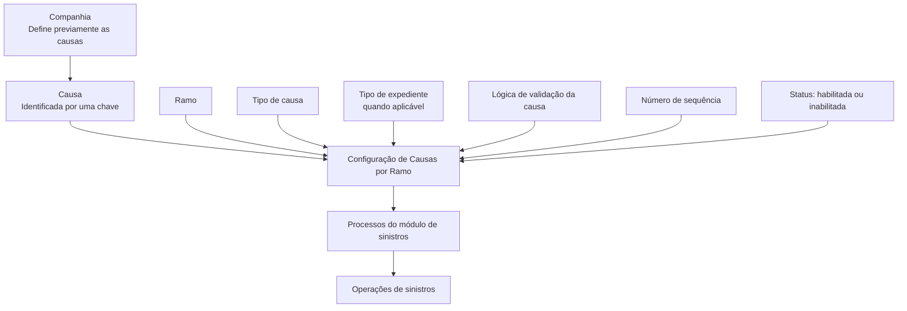

# Definição e Manutenção de Causas por Ramo no Módulo de Sinistros

## 1. Metadados do Documento
- **Arquivo de Origem:** `Não identificado — conteúdo bruto fornecido na solicitação`
- **Tipo de Documento:** Manual Operacional / Especificação Funcional
- **Domínio / Sistema:** Módulo de sinistros — Causas por Ramo
- **Público-Alvo:** Analistas funcionais, configuradores, tramitadores e equipes de operação
- **Data/Versão Identificada:** Não identificada

---

## 2. Resumo Executivo & Contexto de Negócio

O documento define a configuração de **causas por ramo** para os processos do módulo de sinistros. O objetivo declarado é definir, para cada ramo que será tratado no módulo de sinistros, todas as causas aplicáveis aos processos, incluindo as causas de origem do sinistro.

As causas precisam existir previamente no nível da companhia. Após essa definição corporativa, uma causa pode ser associada a um ou mais ramos, acompanhada dos atributos necessários para determinar seu comportamento dentro de cada ramo.

A configuração distingue causas relacionadas a processos em nível de expediente e causas relacionadas a processos de sinistros. Quando a causa estiver associada a um processo de sinistros, o sistema atribui um tipo de expediente genérico, aplicável a todos os tipos de expediente. Para causas em nível de expediente, deve ser informada uma chave de tipo de expediente previamente associada ao ramo em configuração.

O documento também estabelece regras operacionais de apresentação, habilitação e seleção. A sequência deve priorizar causas mais comuns com números menores, facilitando o trabalho dos tramitadores. Causas inabilitadas deixam de ser exibidas para seleção. A seleção múltipla é permitida em todos os tipos de causa, exceto para **Origem do Sinistro**, que permite uma única causa.

---

## 3. Arquitetura, Componentes & Tecnologias Envolvidas

### Componentes e entidades identificados

| Componente / Entidade | Papel descrito no documento |
| :--- | :--- |
| Companhia | Nível no qual as causas devem ser previamente definidas. |
| Ramo | Entidade à qual as causas previamente definidas são associadas. |
| Módulo de sinistros | Módulo que utiliza as causas nos processos de sinistros. |
| Causas por Ramo | Configuração das causas permitidas e de seus atributos dentro de um ramo. |
| Tipo de Expediente | Propriedade usada quando a causa pertence a um processo em nível de expediente. |
| Tipo de causa | Classificação que deve ser informada antes da codificação das causas. |
| Lógica para validar a causa | Lógica de negócio para validações adicionais com base nas informações introduzidas ou na instalação. |
| Tramitadores | Usuários beneficiados pela ordenação das causas mais frequentes. |



> **Nota de Análise:** O conteúdo fornecido não detalha tecnologias, interfaces, métodos HTTP, contratos JSON, banco de dados, integrações externas, URLs de ambiente ou mecanismos técnicos de persistência.

---

## 4. Regras de Negócio, Especificações Funcionais & Processos

### Definição prévia de causas
1. As causas devem ser definidas previamente no nível da companhia.
2. Uma causa definida na companhia pode ser associada para uso em um ramo ou em vários ramos.
3. A chave da causa é a propriedade usada para identificar as diferentes causas.
4. Uma mesma chave pode ser utilizada para um ou vários ramos.

### Associação de causas ao ramo
1. A propriedade **Ramo** informa a chave do ramo ao qual serão associadas as causas previamente definidas na companhia.
2. Para cada ramo, devem ser definidas as causas que poderão ser utilizadas e os atributos necessários.
3. O comportamento da causa dentro do ramo é determinado pelas propriedades configuradas em Causas por Ramo.

### Tipo de expediente
1. A propriedade **Tipo de Expediente** somente deve ser solicitada quando o tipo de causa corresponder a um processo em nível de expediente.
2. Quando a causa for utilizada em um processo de sinistros, o sistema atribuirá o tipo de expediente genérico.
3. O tipo de expediente genérico indica aplicabilidade para todos os tipos de expedientes.
4. Quando a causa estiver em nível de expediente, deve ser informada a chave do tipo de expediente previamente associado ao ramo em definição.

### Tipos de causa
1. Antes de codificar as causas, é necessário indicar qual tipo de causa será definido.
2. Somente causas do tipo **Origem do Sinistro** serão posteriormente associadas às causas consequência.
3. Os demais tipos de causa são destinados apenas às operações de sinistros.

### Lógica de validação
1. A propriedade **Lógica para validar a causa** contém uma lógica de negócio.
2. A lógica de negócio pode realizar validações adicionais conforme:
   - informações introduzidas;
   - informações próprias da instalação.

> **Nota de Análise:** O documento não especifica a linguagem, os critérios concretos, a estrutura ou os pontos de execução da lógica de negócio de validação.

### Ordem de apresentação
1. O **Número de Sequência** define a ordem de apresentação das causas nas operações.
2. Recomenda-se atribuir números de sequência menores às causas mais comuns e mais utilizadas.
3. Essa ordenação visa apresentar primeiro as causas frequentes e facilitar o trabalho dos tramitadores.

### Habilitação de causas
1. A propriedade **Inhabilitada** indica se a causa definida está disponível para uso.
2. Uma causa inabilitada não poderá ser utilizada.
3. Causas inabilitadas não serão exibidas para seleção.

### Seleção de causas
1. É possível selecionar várias causas em todos os tipos de causa.
2. São citados como exemplos de tipos com seleção múltipla:
   - Abertura de expedientes;
   - Modificação de sinistros.
3. A exceção é o tipo **Origem do Sinistro**, para o qual somente uma única causa pode ser escolhida.

---

## 5. Tabelas de Parâmetros, Ambientes e Estruturas de Dados

| Item / Parâmetro | Descrição / Função | Tipo / Valores / Formato | Ambiente / Observações |
| :--- | :--- | :--- | :--- |
| Ramo | Indica a chave do ramo ao qual as causas serão associadas. | Chave do ramo. | As causas devem estar previamente definidas no nível da companhia. |
| Tipo de Expediente | Define o tipo de expediente aplicável à causa. | Chave de tipo de expediente ou tipo genérico atribuído pelo sistema. | Solicitado apenas para causas de processos em nível de expediente. |
| Tipo de causa | Classifica a causa a ser definida. | Inclui, explicitamente, Origem do Sinistro; também são citados Abertura de Expedientes e Modificação de Sinistros. | Deve ser indicado antes da codificação das causas. |
| Causa | Identifica as diferentes causas. | Chave da causa. | Deve estar previamente definida na companhia; uma chave pode ser utilizada em um ou vários ramos. |
| Lógica para validar a causa | Executa validações extras relacionadas à causa. | Lógica de negócio. | Pode considerar informação introduzida ou informação própria da instalação. |
| Número de Sequência | Determina a ordem de apresentação das causas nas operações. | Número de sequência. | Números menores são recomendados para causas mais frequentes. |
| Inhabilitada | Indica se a causa está disponível para uso. | Estado habilitada ou inabilitada. | Causas inabilitadas não são apresentadas para seleção. |
| Causa Origem do Sinistro | Tipo de causa que poderá ser associado a causas consequência. | Seleção única. | É a única categoria explicitamente autorizada para associação posterior às causas consequência. |
| Demais tipos de causa | Tipos usados somente nas operações de sinistros. | Seleção múltipla permitida. | Não são associados às causas consequência, conforme a regra apresentada. |

> **Nota de Análise:** O conteúdo não apresenta servidores, endereços de ambiente, URLs, caminhos de log, formatos de payload, tabelas físicas ou estruturas de dados técnicas.

---

## 6. Bateria de Perguntas & Respostas para RAG (FAQ Sintético)

### P1: Qual é a finalidade da configuração de Causas por Ramo no módulo de sinistros?
**R:** A finalidade é definir, para cada ramo tratado no módulo de sinistros, todas as causas utilizadas nos processos de sinistros, incluindo as causas de origem do sinistro. A configuração também estabelece os atributos necessários para determinar o comportamento de cada causa dentro do ramo.

### P2: Onde as causas devem ser cadastradas antes de serem associadas a um ramo?
**R:** As causas devem ser previamente definidas no nível da companhia. Depois dessa definição, elas podem ser associadas a um ramo ou a vários ramos.

### P3: Uma mesma chave de causa pode ser usada em mais de um ramo?
**R:** Sim. O documento informa que uma chave de causa pode ser utilizada para um ou vários ramos.

### P4: Quando a propriedade Tipo de Expediente deve ser informada?
**R:** A propriedade Tipo de Expediente somente deve ser solicitada quando o tipo de causa corresponder a um processo em nível de expediente. Nessa situação, deve ser introduzida a chave do tipo de expediente previamente associado ao ramo em configuração.

### P5: O que ocorre com o Tipo de Expediente quando a causa pertence a um processo de sinistros?
**R:** Quando a causa pertence a um processo de sinistros, o sistema atribui o tipo de expediente genérico. Esse tipo genérico indica que a causa é aplicável a todos os tipos de expediente.

### P6: Qual tipo de causa pode ser associado posteriormente às causas consequência?
**R:** Somente as causas do tipo Origem do Sinistro podem ser associadas posteriormente às causas consequência. Os demais tipos de causa são destinados apenas às operações de sinistros.

### P7: É possível selecionar várias causas em uma operação?
**R:** Sim. A seleção de várias causas é permitida em todos os tipos de causa, incluindo os exemplos citados de Abertura de Expedientes e Modificação de Sinistros. A exceção é Origem do Sinistro, que permite a seleção de apenas uma causa.

### P8: Qual é a finalidade da propriedade Lógica para validar a causa?
**R:** A propriedade Lógica para validar a causa contém uma lógica de negócio capaz de executar validações adicionais conforme as informações introduzidas ou informações próprias da instalação. O documento não detalha quais validações são implementadas.

### P9: Como o Número de Sequência deve ser configurado para melhorar a operação dos tramitadores?
**R:** Recomenda-se atribuir números de sequência menores às causas mais comuns e mais utilizadas. Isso faz com que essas causas sejam apresentadas primeiro nas operações e facilita o trabalho dos tramitadores.

### P10: O que acontece quando uma causa está marcada como Inhabilitada?
**R:** Uma causa marcada como Inhabilitada deixa de estar disponível para uso e não será mostrada para seleção nas operações.

### P11: Qual propriedade identifica uma causa dentro da configuração?
**R:** A propriedade Causa corresponde à chave usada para identificar as diferentes causas. Essa causa deve ter sido definida previamente no nível da companhia.

### P12: O documento descreve métodos HTTP ou contratos de integração para Causas por Ramo?
**R:** Não. O conteúdo fornecido descreve propriedades funcionais e regras de uso das causas, mas não detalha métodos HTTP, contratos JSON, APIs, tecnologias de implementação ou integrações técnicas.

---

## 7. Glossário de Termos, Siglas & Conceitos-Chave

- **Causa:** Propriedade identificada por uma chave e previamente definida no nível da companhia.
- **Causas por Ramo:** Configuração que associa causas previamente definidas a um ramo e define os atributos necessários para seu comportamento naquele ramo.
- **Causa Consequência:** Causa à qual podem ser associadas somente causas do tipo Origem do Sinistro, conforme a pergunta frequente apresentada.
- **Companhia:** Nível em que as causas precisam estar previamente definidas.
- **Expediente:** Entidade ou nível de processo para o qual pode ser requerido um Tipo de Expediente.
- **Inhabilitada:** Propriedade que informa que uma causa não está habilitada para uso e não deve ser exibida para seleção.
- **Lógica para validar a causa:** Lógica de negócio que pode realizar validações extras segundo informação introduzida ou própria da instalação.
- **Número de Sequência:** Propriedade que determina a ordem de apresentação das causas nas operações.
- **Origem do Sinistro:** Tipo de causa que permite somente uma seleção e é o único tipo que pode ser associado às causas consequência.
- **Ramo:** Propriedade que indica a chave do ramo ao qual as causas são associadas.
- **Sinistro:** Contexto funcional do módulo e de suas operações, conforme descrito no conteúdo.
- **Tipo de Expediente Genérico:** Tipo atribuído pelo sistema para causas de processos de sinistros, indicando aplicabilidade a todos os tipos de expediente.
- **Tipo de causa:** Classificação que deve ser indicada antes da codificação de uma causa.
- **Tramitadores:** Usuários cujo trabalho é facilitado pela apresentação prioritária de causas comuns.

---

## 8. Notas Críticas, Riscos & Limitações

- O documento não identifica o nome do produto, a versão, a data, o responsável, o ambiente ou o arquivo original.
- Não há detalhamento dos valores permitidos para cada tipo de causa, além dos exemplos e tipos explicitamente citados.
- A lógica de negócio para validação da causa é mencionada, porém seus critérios, linguagem, regras, persistência e execução não são especificados.
- Não foram fornecidos diagramas originais, interfaces de manutenção, contratos de API, modelos de dados, mecanismos de auditoria ou regras de autorização.
- O conteúdo menciona uma “Imagem do Mantenimiento de Causas por Ramo”, mas a imagem não está presente no texto bruto disponibilizado.
- A seção termina em “Ejemplo:” sem apresentar conteúdo de exemplo subsequente.

---

## 9. Conteúdo Bruto Estruturado (Referência Fiel)

```text
--- [PÁGINA 1 DE 3] ---

DEFINICIÓN Causas por Ramo
Objetivo
La finalidad es definir para cada ramo que vamos a siniestrar, todas las causas de todos los
procesos del módulo de siniestros, incluidas las causas origen del siniestro.
A cada ramo se le definirán las causas que se van a poder utilizar y los atributos necesarios.
Propiedades Causas Por Ramo
Propiedades Causas por Ramo
Las causas deben estar previamente definidas a nivel de compañía, y estas podrán ser asociadas
para ser utilizadas en un ramo o varios. En este apartado se detallará todos las propiedades
necesarias para definir el comportamiento de la causa dentro de un Ramo.
Imagen del Mantenimiento de Causas por Ramo:
 /
 CF
Home Solutions APIs Documentation Zeus
EN


--- [PÁGINA 2 DE 3] ---

Ramo
Esta propiedad indica la clave del Ramo al que se va a asociar las causas definidas previamente a
nivel de compañía.
Tipo de Expediente
Esta propiedad sólo se pedirá en el caso de que el tipo de causa sea para un proceso a nivel de
expediente. Cuando sea de un proceso de siniestros, el sistema asignará el tipo de expediente
genérico, que indica que es para todos los tipos de expedientes. Si la causa es a nivel de expediente,
habrá que introducir la clave del tipo de expediente que previamente se haya asociado al ramo que
estamos definiendo.
Tipos de Causas
Antes de codificar las causas hay que indicar que tipo de causa vamos a definir.
Causa
Esta propiedad será la clave por la que se identifican las distintas causas. Las causas tienen que
estar definidas previamente a nivel de la compañía.
Una clave podrá ser utilizada para uno o varios ramos.


--- [PÁGINA 3 DE 3] ---

Lógica para validar la causa
Esta propiedad contendrá una lógica de Negocio, que podrá realizar validaciones extras en función
de información introducida o información propia de la instalación.
Número de Secuencia
Esta propiedad indicará el orden de presentación de las causas en las operaciones. Se debería
intentar, poner el número de secuencia más bajo a las causas más comunes, más usadas, para que
aparezcan las primeras y facilitar el trabajo a los tramitadores.
Inhabilitada
Esta propiedad indica si la causa que está definida, está habilitada para poder ser utilizada o, por el
contrario, ya no está habilitada para poder ser usada. Las causas inhabilitadas, no se mostrarán para
poder ser seleccionadas.
Preguntas frecuentes
¿Qué tipos de causas son las que luego se van asociar a las causas consecuencias?
Solamente las causas de tipo Origen deL siniestro. El resto de causas son sólo para las
operaciones de siniestros.
¿Se van a poder seleccionar varias causas?
En todos los tipos de causas (Apertura de expedientes, Modificación de Siniestros...),se van a
poder seleccionar varias causas, excepto en el tipo de causa Origen del Siniestro, que sólo se
podrá elegir una única causa.
Ejemplo:
```
