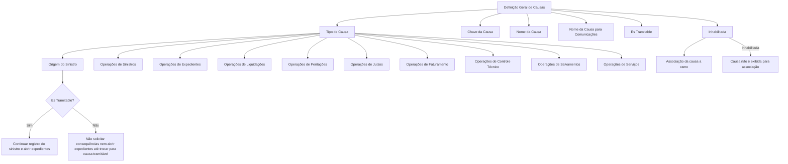

# Definição de Causas por Tipo para Processos de Sinistros

## 1. Metadados do Documento
- **Arquivo de Origem:** Não informado
- **Tipo de Documento:** Especificação Funcional
- **Domínio / Sistema:** Módulo de sinistros, expedientes, liquidações, peritações, juízos, faturamento, controle técnico, salvamentos e serviços
- **Público-Alvo:** Analistas funcionais, desenvolvedores, equipes de operação e negócio
- **Data/Versão Identificada:** Não identificada

---

## 2. Resumo Executivo & Contexto de Negócio

O documento define o cadastro e as propriedades gerais de **causas** utilizadas nos processos do módulo de sinistros. O objetivo declarado é abranger tanto as causas de origem do sinistro quanto as causas aplicáveis às operações subsequentes, como modificação, reabilitação, encerramento, abertura e alteração de expedientes.

A propriedade central de classificação é o **Tipo de Causa**, cujos valores são pré-definidos pelo núcleo do sistema. Cada tipo de causa está associado a uma categoria operacional específica, permitindo que processos de sinistros, expedientes, liquidações, peritações, juízos, faturamento, controle técnico, salvamentos e serviços utilizem causas adequadas ao contexto.

O documento estabelece regras funcionais relevantes para a propriedade **Es Tramitable**. Quando aplicada a uma causa de tipo **Origem do Sinistro**, essa propriedade controla se o sinistro pode continuar sendo registrado e se expedientes podem ser abertos. Para os demais tipos de causa, a propriedade controla a disponibilidade da causa para seleção pelo usuário durante o processo.

A especificação também define propriedades de identificação e descrição, incluindo a chave da causa, o nome da causa e o nome para comunicações. Uma mesma chave pode ser usada em um ou mais ramos. Por fim, a propriedade **Inhabilitada** controla se uma causa permanece disponível para associação a um ramo.

---

## 3. Arquitetura, Componentes & Tecnologias Envolvidas

O conteúdo descreve um modelo funcional de configuração de causas no núcleo do sistema, sem apresentar arquitetura técnica, protocolos, contratos de integração, tecnologias, bancos de dados ou interfaces de microsserviços.

Os componentes funcionais citados são:

- Cadastro geral de causas.
- Tipo de Causa.
- Causa como chave identificadora.
- Nome da Causa.
- Nome da Causa para comunicações.
- Indicador **Es Tramitable**.
- Indicador **Inhabilitada**.
- Associação de causas a ramos.
- Operações de sinistros, expedientes, liquidações, peritações, juízos, faturamento, controle técnico, salvamentos e serviços.



> **Nota de Análise:** O documento não detalha tecnologia, endpoints, métodos HTTP, contratos JSON, persistência de dados, autenticação, URLs de ambiente ou fluxos de integração.

---

## 4. Regras de Negócio, Especificações Funcionais & Processos

### 4.1 Finalidade das causas

Devem ser definidas causas para todos os processos de sinistros, incluindo causas de origem do sinistro. O conjunto contempla causas para:

- Modificação de sinistros.
- Reabertura ou reabilitação de sinistros.
- Peritação.
- Abertura de expedientes.
- Modificação de expedientes.
- Demais processos listados por tipo de causa.

### 4.2 Tipo de Causa

A propriedade **Tipo de Causa** indica a categoria da causa que está sendo definida.

Os tipos de causa são pré-definidos pelo núcleo do sistema. Antes de codificar uma causa, deve ser indicado o tipo de causa a ser definido.

A causa de tipo **Origem do Sinistro** é usada para definir as causas que originam sinistros. Essas causas serão posteriormente associadas às consequências.

### 4.3 Causas para operações de sinistros

Para operações de sinistros, devem ser definidas causas para:

1. Modificação de Sinistros.
2. Reabilitação de Sinistros.
3. Terminação de Sinistros.

### 4.4 Causas para operações de expedientes

Para operações de expedientes, devem ser definidas causas para:

1. Abertura de Expedientes.
2. Modificação de Expedientes.
3. Mudança de Valoração.
4. Reabilitação de Expedientes.
5. Terminação de Expedientes.

### 4.5 Causas para operações de liquidações

Para operações de liquidações, devem ser definidas causas para:

1. Retificação de Liquidações.

### 4.6 Causas para operações de peritações

Para operações de peritações, devem ser definidas causas para:

1. Causas de Peritação.
2. Resultado da Peritação.

### 4.7 Causas para operações de juízos

Para operações de juízos, deve ser definida causa para:

1. Reabertura do Juízo.

### 4.8 Causas para operações de faturamento

Para operações de faturamento, deve ser definida causa para:

1. Gastos Não Cobertos.

### 4.9 Causas para operações de controle técnico

Para operações de controle técnico, devem ser definidas causas para:

1. Rejeição de Sinistro.
2. Rejeição de Expediente.

### 4.10 Causas para operações de salvamentos

Para operações de salvamentos, devem ser definidas causas para:

1. Liberação de Inventário.
2. Anulação de Inventário.

### 4.11 Causas para operações de serviços

Para operações de serviços de sinistros, devem ser definidas causas para:

1. Cancelamento do Serviço.
2. Reabertura do Serviço.

### 4.12 Identificação da causa

A propriedade **Causa** é a chave usada para identificar as diferentes causas:

- Causas de origem do sinistro.
- Causas definidas para processos do módulo de sinistros.

Uma chave de causa pode ser utilizada em um ou mais ramos.

### 4.13 Descrições da causa

A propriedade **Nombre de la Causa** é a descrição da chave definida para a causa. Pode conter números e/ou letras.

A propriedade **Nombre de la Causa para comunicaciones** é a descrição da chave utilizada quando se deseja enviar uma comunicação. Também pode conter números e/ou letras.

### 4.14 Regra de tramitabilidade para Origem do Sinistro

Quando o tipo de causa for **Origem de Sinistros**:

- Se **Es Tramitable** for afirmativo, o sistema entende que o sinistro pode continuar sendo registrado e que expedientes podem ser abertos.
- Se **Es Tramitable** for negativo, o sistema não permite solicitar as consequências nem abrir expedientes até que a causa seja alterada para uma causa tramitável.

### 4.15 Regra de tramitabilidade para os demais tipos de causa

Para os demais tipos de causa, como Modificação do Sinistro e Reabilitação de Sinistros:

- Se a propriedade indicar que a causa é tramitável, o usuário poderá selecionar a causa quando o processo a exigir.
- Se a propriedade indicar que a causa não é tramitável, a causa será usada para casos extraordinários, como processos automáticos.

### 4.16 Regra de inabilitação

A propriedade **Inhabilitada** indica se uma causa está habilitada para associação a um ramo.

- Uma causa habilitada pode ser utilizada na definição de causas por ramo.
- Uma causa inabilitada não é exibida para associação a um ramo.
- Uma causa inabilitada não pode ser utilizada na definição de causas por ramo.

### 4.17 Seleção de causas

É possível selecionar várias causas em todos os tipos de causa, incluindo Abertura de Expedientes e Modificação de Sinistros.

A exceção é o tipo de causa **1 — Origem do Sinistro**, no qual somente uma única causa pode ser escolhida.

---

## 5. Tabelas de Parâmetros, Ambientes e Estruturas de Dados

| Item / Parâmetro | Descrição / Função | Tipo / Valores / Formato | Ambiente / Observações |
| :--- | :--- | :--- | :--- |
| Tipo de Causa | Indica o tipo de causa que está sendo definida. | Valores pré-definidos pelo núcleo do sistema. | Deve ser informado antes de codificar uma causa. |
| Origem do Sinistro | Tipo de causa destinado às causas que originam sinistros. | Tipo de causa. | Essas causas serão associadas posteriormente às consequências. |
| Causa | Chave de identificação das diferentes causas. | Chave; formato não detalhado. | Uma chave pode ser utilizada em um ou mais ramos. |
| Nome da Causa | Descrição da chave definida para a causa. | Pode conter números e/ou letras. | Aplicável às causas de origem e às causas dos processos de sinistros. |
| Nome da Causa para Comunicações | Descrição da chave para uso quando for necessário enviar uma comunicação. | Pode conter números e/ou letras. | O documento não detalha o canal ou mecanismo de comunicação. |
| Es Tramitable | Indica se a causa será utilizada na tramitação de sinistros. | Afirmativo ou negativo. | Possui comportamento específico para Origem do Sinistro e para os demais tipos. |
| Es Tramitable — Origem do Sinistro = afirmativo | Autoriza a continuidade do registro do sinistro e a abertura de expedientes. | Afirmativo. | Aplicável ao tipo Origem de Sinistros. |
| Es Tramitable — Origem do Sinistro = negativo | Impede solicitar consequências e abrir expedientes até haver mudança para causa tramitável. | Negativo. | Aplicável ao tipo Origem de Sinistros. |
| Es Tramitable — outros tipos = tramitável | Permite que o usuário selecione a causa quando o processo exigir. | Tramitável. | Inclui exemplos como Modificação e Reabilitação de Sinistros. |
| Es Tramitable — outros tipos = não tramitável | Destina a causa a casos extraordinários, como processos automáticos. | Não tramitável. | O documento não detalha quais processos automáticos existem. |
| Inhabilitada | Indica se a causa continua habilitada para associação a um ramo. | Habilitada ou inabilitada. | Causas inabilitadas não são exibidas para associação. |
| Seleção de causas | Define a quantidade de causas que pode ser escolhida por tipo. | Múltiplas causas, exceto para Origem do Sinistro. | No tipo 1 — Origem do Sinistro, somente uma causa pode ser escolhida. |

| Tipo de Causa / Grupo Operacional | Causas ou operações citadas | Observações |
| :--- | :--- | :--- |
| Origem do Sinistro | Causas de origem do sinistro. | São as únicas causas associadas às causas consequência. |
| Operações de Sinistros | Modificação de Sinistros; Reabilitação de Sinistros; Terminação de Sinistros. | Requer definição de tipos de causa específicos. |
| Operações de Expedientes | Abertura de Expedientes; Modificação de Expedientes; Mudança de Valoração; Reabilitação de Expedientes; Terminação de Expedientes. | Requer definição de tipos de causa específicos. |
| Operações de Liquidações | Retificação de Liquidações. | O documento menciona operações de expedientes nesta seção, mas o título indica operações de liquidações. |
| Operações de Peritações | Causas de Peritação; Resultado da Peritação. | Requer definição de tipos de causa específicos. |
| Operações de Juízos | Reabertura do Juízo. | Requer definição de tipo de causa específico. |
| Operações de Faturamento | Gastos Não Cobertos. | Requer definição de tipo de causa específico. |
| Operações de Controle Técnico | Rejeição de Sinistro; Rejeição de Expediente. | Requer definição de tipos de causa específicos. |
| Operações de Salvamentos | Liberação de Inventário; Anulação de Inventário. | Requer definição de tipos de causa específicos. |
| Operações de Serviços | Cancelamento do Serviço; Reabertura do Serviço. | Referem-se a serviços de sinistros. |

---

## 6. Bateria de Perguntas & Respostas para RAG (FAQ Sintético)

### P1: Qual é o objetivo da definição de causas por tipo no módulo de sinistros?
**R:** O objetivo é definir todas as causas aplicáveis aos processos de sinistros, incluindo as causas de origem do sinistro e as causas utilizadas em operações como modificação, reabilitação, encerramento, peritação, abertura e modificação de expedientes.

### P2: Quais causas podem ser associadas posteriormente às causas consequência?
**R:** Somente as causas do tipo **1 — Origem do Sinistro** podem ser posteriormente associadas às causas consequência. Os demais tipos de causa são destinados exclusivamente às operações de sinistros e processos relacionados.

### P3: O que acontece quando uma causa de Origem do Sinistro é marcada como tramitável?
**R:** Quando uma causa do tipo Origem do Sinistro possui a propriedade **Es Tramitable** afirmativa, o sistema permite que o sinistro continue sendo registrado e que expedientes sejam abertos.

### P4: O que acontece quando uma causa de Origem do Sinistro não é tramitável?
**R:** Quando **Es Tramitable** está negativo para uma causa de Origem do Sinistro, o sistema não permite solicitar as consequências nem abrir expedientes. Essas ações só podem ocorrer após a troca para uma causa tramitável.

### P5: Como a propriedade Es Tramitable funciona para causas de modificação ou reabilitação de sinistros?
**R:** Para tipos de causa diferentes de Origem do Sinistro, uma causa tramitável pode ser selecionada pelo usuário quando o processo correspondente exigir. Uma causa não tramitável é utilizada em situações extraordinárias, como processos automáticos.

### P6: Quais operações de expediente exigem tipos de causa definidos?
**R:** As operações de expediente que exigem tipos de causa são: Abertura de Expedientes, Modificação de Expedientes, Mudança de Valoração, Reabilitação de Expedientes e Terminação de Expedientes.

### P7: Uma mesma chave de causa pode ser usada em mais de um ramo?
**R:** Sim. A propriedade **Causa**, que funciona como chave identificadora, pode ser utilizada em um ou mais ramos.

### P8: Qual é a diferença entre Nome da Causa e Nome da Causa para Comunicações?
**R:** O Nome da Causa é a descrição da chave definida para a causa. O Nome da Causa para Comunicações é a descrição da chave usada quando se deseja enviar uma comunicação. Ambas as propriedades podem conter números e/ou letras.

### P9: Como uma causa inabilitada afeta a associação a ramos?
**R:** Uma causa inabilitada deixa de estar disponível para ser associada a um ramo. Causas inabilitadas não são exibidas na definição de causas por ramo.

### P10: É permitido selecionar várias causas em um processo?
**R:** Sim, é permitido selecionar várias causas em todos os tipos de causa, como Abertura de Expedientes e Modificação de Sinistros. A única exceção é o tipo **1 — Origem do Sinistro**, para o qual somente uma causa pode ser selecionada.

### P11: Quais causas devem ser definidas para as operações de peritação?
**R:** Para operações de peritação, devem ser definidas causas de Peritação e causas para o Resultado da Peritação.

### P12: Quais causas devem ser definidas para controle técnico e salvamentos?
**R:** Para controle técnico, devem ser definidas causas de Rejeição de Sinistro e Rejeição de Expediente. Para salvamentos, devem ser definidas causas de Liberação de Inventário e Anulação de Inventário.

---

## 7. Glossário de Termos, Siglas & Conceitos-Chave

- **Causa:** Chave usada para identificar uma causa de origem do sinistro ou uma causa associada a processos do módulo de sinistros.
- **Causa Consequência:** Causa que pode ser associada às causas de tipo Origem do Sinistro.
- **Es Tramitable:** Propriedade que determina se uma causa pode participar da tramitação, com regras distintas para Origem do Sinistro e demais tipos.
- **Expediente:** Entidade ou processo operacional citado para abertura, modificação, mudança de valoração, reabilitação e terminação.
- **Inhabilitada:** Propriedade que indica que uma causa não está disponível para associação a um ramo.
- **Núcleo:** Componente do sistema que fornece valores pré-definidos para os tipos de causa.
- **Peritação:** Operação para a qual existem causas de peritação e causas de resultado de peritação.
- **Ramo:** Contexto ao qual uma causa pode ser associada; uma chave de causa pode ser utilizada em um ou mais ramos.
- **Sinistro:** Evento ou processo central do domínio, com causas de origem e causas para operações posteriores.
- **Tipo de Causa:** Classificação pré-definida pelo núcleo, que determina a finalidade operacional de uma causa.

---

## 8. Notas Críticas, Riscos & Limitações

- O documento não identifica o nome do arquivo de origem, a versão, a data, o sistema específico ou o proprietário funcional.
- O documento não fornece a lista codificada dos valores de **Tipo de Causa**, embora afirme que esses valores são pré-definidos pelo núcleo.
- Não há detalhamento técnico de telas, APIs, banco de dados, permissões, integrações, validações de formato das chaves ou regras de auditoria.
- Não são apresentados exemplos concretos apesar de haver seções intituladas “Ejemplos”.
- A seção de Operações de Liquidações afirma que os tipos são necessários para “operações de expedientes”; essa inconsistência foi preservada como observação, pois o texto não esclarece se é erro editorial.
- O documento menciona “reabre um sinistro” no objetivo e “Reabilitação de Sinistros” nos tipos listados, sem explicar se reabertura e reabilitação representam a mesma operação.
- Não há detalhamento adicional sobre os processos automáticos que utilizam causas não tramitáveis.
- Não há definição do mecanismo de associação entre causas de Origem do Sinistro e causas consequência.

---

## 9. Conteúdo Bruto Estruturado (Referência Fiel)

```text
--- [PÁGINA 1 DE 5] ---

DEFINICIÓN Causas por Tipo
Objetivo
La finalidad es definir todas las causas de todos los procesos de siniestros, incluidas lascausas
origen del siniestro.
Se definirán las causas por las que se modifica un siniestro, causas por las que se reabre un
siniestro, causas por las que se realiza una peritación, causas de apertura de expedientes, causas
por las que se modifica un expediente, etc.
Propiedades Causas Generales
Propiedades Generales Causas
En este apartado se detallarán todos las propiedades de las causas, comunes a todos los ramos, es
decir los atributos que no cambian por ramo.
Imagen del Mantenimiento Causas a nivel General:
 / 
 CF
Home Solutions APIs Documentation Zeus
EN


--- [PÁGINA 2 DE 5] ---

Tipo de Causa
Esta propiedad nos indicará el tipo de causa que se está definiendo.
Hay que definir tanto las causas origen del siniestro, como las causas de los diferentes procesos del
módulo de siniestros. Los tipos de causa vienen dado por el núcleo
Los valores de esta propiedad ya están prefijados y son estos:
TIPOS DE CAUSAS
Antes de codificar las causas hay que indicar que tipo de causa vamos a definir.
A continuación se enumeran los distintos tipos de causas que existen:
Origen del siniestro
En este tipo de causa, se van a definir las causas que son origen de siniestros. Estas serán luego
asociadas a las consecuencias.
Causa del Siniestro (Origen)
Operaciones Siniestros
Hay que definir estos tipos de causa, para poder realizar las siguientes operaciones de siniestros:
Modificación de Siniestros


--- [PÁGINA 3 DE 5] ---

Rehabilitación de Siniestros
Terminación de Siniestros
Operaciones Expedientes
Hay que definir estos tipos de causa, para realizar las operaciones de expedientes:
Apertura de Expedientes
Modificación de Expedientes
Cambio de Valoración
Rehabilitación de Expedientes
Terminación de Expedientes
Operaciones Liquidaciones
Hay que definir estos tipos de causa, para realizar las operaciones de expedientes:
Rectificación de Liquidaciones
Operaciones Peritaciones
Hay que definir estos tipos de causa, para realizar las operaciones de peritaciones:
Causas de Peritación
Resultado de la Peritación
Operaciones Juicios
Hay que definir estos tipos de causa, para realizar las operaciones de juicios:
Reapertura del Juicio
Operaciones Facturación
Hay que definir este tipo de causa, para realizar las operaciones de facturación:
Gastos No Amparados
Operaciones Control Técnico
Hay que definir estos tipos de causa, para realizar las operaciones de control técnico:
Rechazo Siniestro
Rechazo Expediente
Operaciones Salvamentos
Hay que definir estos tipos de causa, para realizar las operaciones de salvamentos:
Liberación Inventario


--- [PÁGINA 4 DE 5] ---

Anulación del Inventario
Operaciones Servicios
Hay que definir estos tipos de causa, para realizar las operaciones de servicios de siniestros:
Cancelación del Servicio
Reapertura del Servicio
Causa
Esta propiedad será la clave por la que se va a identificar las distintas causas. Tanto las causas
origen del siniestro, como las causas definidas para los distintos procesos del módulo de siniestros.
Una clave podrá ser utilizada para uno o varios ramos.
Nombre de la Causa
Esta propiedad será la descripción de la clave definida para la causa. Puede contener números y/o
letras.
Nombre de la Causa para comunicaciones
Esta propiedad será la descripción de la clave en el caso de que se quiera enviar una comunicación.
Puede contener números y/o letras.
Es Tramitable
En esta propiedad indicará si la causa que se está definiendo, se va a utilizar en la tramitación de
siniestros.
Cuando la causa es del tipo:
Tipo de Causa- Origen de Siniestros
Si esta propiedad es afirmativo, le indicará al sistema que el siniestro puede continuar
registrándose y se podrán abrir expedientes.
Si esta propiedad es negativo, le indicará al sistema que no se pueden pedir las consecuencias,
ni abrir expedientes, hasta que no se cambie a una causa tramitable.
Resto Tipos de Causas (Tipo Modificación del siniestro, Tipo Rehabilitación de siniestros, etc.)
Ejemplos
Ejemplo:


--- [PÁGINA 5 DE 5] ---

Si la propiedad indica que es Tramitable, el usuario podrá seleccionar dicha causa cuando el
proceso lo requiera.
Si la propiedad indica que No es tramitable se utilizará para casos extraordinarios, como
procesos automáticos.
Inhabilitada
Esta propiedad indica si la causa que está definida, está habilitada para poder ser asociada a un
ramo, o por el contrario, ya no está habilitada para poder ser utilizada en la definición de causas por
Ramo. Las causas inhabilitadas, no se mostrarán para poder ser asociadas.
Preguntas frecuentes
¿Qué tipos de causas son las que luego se van asociar a las causas consecuencias?
Solamente las causas de tipo 1 Origen deL siniestro. El resto de causas son sólo para las
operaciones de siniestros.
¿Se van a poder seleccionar varias causas?
En todos los tipos de causas (Apertura de expedientes, Modificación de Siniestros...),se van a
poder seleccionar varias causas, excepto en el tipo de causa 1- Origen del Siniestro, que sólo
se podrá elegir una única causa.
Ejemplos
```
