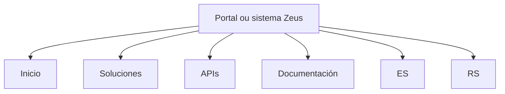

# Navegação de Portal Zeus: Soluciones, APIs e Documentación

## 1. Metadados do Documento
- **Arquivo de Origem:** Não identificado
- **Tipo de Documento:** Não identificado
- **Domínio / Sistema:** Zeus
- **Público-Alvo:** Não identificado
- **Data/Versão Identificada:** Não identificada

---

## 2. Resumo Executivo & Contexto de Negócio

O conteúdo fornecido representa uma interface de navegação associada ao sistema ou portal denominado **Zeus**. A interface apresenta opções para acesso a soluções, APIs e documentação.

Também são exibidas as opções de idioma **ES** e **RS**, além do item **Inicio**, indicando uma possível navegação inicial e seleção regional ou linguística. O conteúdo não descreve objetivos de negócio, funcionalidades internas, integrações ou processos operacionais.

**Nota de Análise:** o trecho não contém detalhes adicionais sobre a arquitetura, contratos de APIs, tecnologias, URLs, regras funcionais ou responsáveis pelo sistema Zeus.

---

## 3. Arquitetura, Componentes & Tecnologias Envolvidas

Componentes identificados:

| Componente | Descrição baseada no conteúdo |
| :--- | :--- |
| Zeus | Nome do sistema ou portal exibido na interface. |
| Inicio | Item de navegação para a página inicial. |
| Soluciones | Item de navegação relacionado a soluções. |
| APIs | Item de navegação relacionado a APIs. |
| Documentación | Item de navegação relacionado à documentação. |
| ES | Opção exibida na interface; o significado não é detalhado. |
| RS | Opção exibida na interface; o significado não é detalhado. |



**Nota de Análise:** o conteúdo não especifica camadas de software, serviços, bancos de dados, protocolos, métodos HTTP ou integrações entre os itens de navegação.

---

## 4. Regras de Negócio, Especificações Funcionais & Processos

Não foram identificadas regras de negócio, validações, condições de cálculo, procedimentos operacionais ou fluxos funcionais detalhados.

O conteúdo apenas apresenta os seguintes itens textuais de navegação:

1. `Inicio`
2. `Soluciones`
3. `APIs`
4. `Documentación`
5. `Zeus`
6. `ES`
7. `RS`

---

## 5. Tabelas de Parâmetros, Ambientes e Estruturas de Dados

| Item / Parâmetro | Descrição / Função | Tipo / Valores / Formato | Ambiente / Observações |
| :--- | :--- | :--- | :--- |
| Zeus | Nome exibido para o sistema ou portal. | Texto | Não há ambiente identificado. |
| Inicio | Item de navegação inicial. | Texto | Sem detalhamento funcional. |
| Soluciones | Item de navegação para soluções. | Texto | Sem detalhamento funcional. |
| APIs | Item de navegação para APIs. | Texto | Não há contratos ou endpoints apresentados. |
| Documentación | Item de navegação para documentação. | Texto | Não há documentos ou links apresentados. |
| ES | Opção exibida na interface. | Sigla/texto | Significado não informado. |
| RS | Opção exibida na interface. | Sigla/texto | Significado não informado. |

---

## 6. Bateria de Perguntas & Respostas para RAG (FAQ Sintético)

### P1: Qual sistema ou portal é citado no conteúdo?
**R:** O conteúdo cita o sistema ou portal denominado **Zeus**.

### P2: Quais opções de navegação são apresentadas no portal Zeus?
**R:** As opções apresentadas são **Inicio**, **Soluciones**, **APIs** e **Documentación**.

### P3: O conteúdo apresenta endpoints ou métodos HTTP para as APIs de Zeus?
**R:** Não. O conteúdo apenas apresenta o item de navegação `APIs`; não há endpoints, métodos HTTP, contratos JSON, autenticação ou detalhes técnicos.

### P4: O documento descreve quais soluções estão disponíveis em `Soluciones`?
**R:** Não. O conteúdo exibe apenas o termo `Soluciones`, sem listar soluções, módulos ou funcionalidades.

### P5: Existe documentação técnica detalhada no conteúdo fornecido?
**R:** Não. O conteúdo mostra o item `Documentación`, mas não inclui links, manuais, especificações ou conteúdo técnico associado.

### P6: O que significa a opção `Inicio`?
**R:** Com base no texto, `Inicio` é um item de navegação. O conteúdo não detalha a página, funcionalidade ou fluxo associado.

### P7: Quais opções adicionais aparecem além dos itens de navegação principais?
**R:** Além de `Inicio`, `Soluciones`, `APIs` e `Documentación`, aparecem `Zeus`, `ES` e `RS`.

### P8: O conteúdo identifica ambientes como desenvolvimento, homologação ou produção?
**R:** Não. Não há nomes de ambientes, URLs, servidores, portas, credenciais ou configurações operacionais.

---

## 7. Glossário de Termos, Siglas & Conceitos-Chave

- **Zeus:** nome do sistema ou portal exibido no conteúdo.
- **APIs:** termo exibido como item de navegação; o conteúdo não define suas interfaces ou contratos.
- **Documentación:** item de navegação relacionado à documentação.
- **Soluciones:** item de navegação relacionado a soluções.
- **Inicio:** item de navegação inicial.
- **ES:** sigla ou opção exibida na interface; significado não informado.
- **RS:** sigla ou opção exibida na interface; significado não informado.

---

## 8. Notas Críticas, Riscos & Limitações

- O conteúdo extraído é extremamente reduzido e não apresenta detalhes arquiteturais, funcionais ou operacionais.
- Não há arquivo de origem, data, versão, autor, organização ou público-alvo identificáveis.
- Não há URLs, endpoints, ambientes, tecnologias, diagramas originais ou contratos de integração.
- Os significados de `ES` e `RS` não são definidos; qualquer interpretação adicional seria especulativa.

---

## 9. Conteúdo Bruto Estruturado (Referência Fiel)

```text
--- [PÁGINA 1 DE 1] ---

/
RS
Inicio Soluciones APIs Documentación Zeus
ES
```
