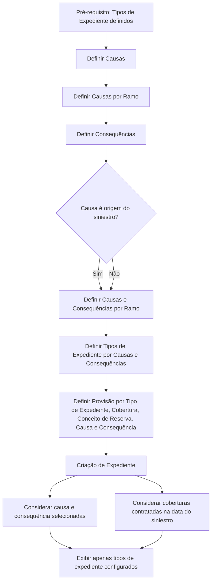

# Configuração de Causas e Consequências para Tipos de Expediente no REEF Core

## 1. Metadados do Documento
- **Arquivo de Origem:** Não identificado no conteúdo fornecido
- **Tipo de Documento:** Procedimento
- **Domínio / Sistema:** REEF Core / operações de siniestros
- **Público-Alvo:** Negócio, Analistas Funcionais, Operação e Configuração de Sistema
- **Data/Versão Identificada:** Não identificada

---

## 2. Resumo Executivo & Contexto de Negócio

O documento descreve a configuração prévia necessária no sistema REEF Core para determinar os tipos de expedientes que poderão ser abertos durante operações de siniestros. A configuração é definida pelo usuário e organiza catálogos de causas, consequências, ramos, tipos de expediente, coberturas e conceitos de reserva.

O objetivo declarado é permitir conhecer os elementos que precisam ser definidos para que o sistema proponha os possíveis tipos de expediente a abrir. A proposta depende das causas e consequências selecionadas na operação de siniestro.

A configuração também permite identificar quais tipos de expediente poderão ser afetados, quais coberturas estarão envolvidas, quais conceitos de reserva serão aplicáveis e quais serão os importes inicial e máximo de cada combinação de cobertura e conceito de reserva.

Antes de configurar o catálogo de causas e consequências, os tipos de expediente devem ter sido previamente definidos. Durante a criação de um expediente, o sistema considera tanto a definição associada à causa e consequência selecionadas quanto as coberturas contratadas para o risco sinistrado na data do siniestro.

---

## 3. Arquitetura, Componentes & Tecnologias Envolvidas

Os elementos funcionais identificados no documento são:

| Componente / Conceito | Função descrita |
| :--- | :--- |
| REEF Core | Sistema que requer configuração prévia para o seu funcionamento. |
| Usuário | Responsável por definir o comportamento do sistema por meio dos catálogos. |
| Causas | Catálogo utilizado na definição de tipos de expediente. |
| Causas por Ramo | Associação de causas a um ramo. |
| Consequências | Catálogo utilizado com causas para determinar tipos de expediente aplicáveis. |
| Causas e Consequências por Ramo | Configuração conjunta de causa, consequência e ramo. |
| Tipos de Expediente por Causas e Consequências | Associação que define quais tipos de expediente podem ser abertos. |
| Provisão por Tipo de Expediente, Cobertura, Conceito de Reserva, Causa e Consequência | Configuração de provisão associada às combinações funcionais. |
| Coberturas do risco sinistrado | Coberturas contratadas na data do siniestro; condicionam a apresentação de tipos de expediente. |
| Operações de siniestros | Contexto no qual causas, consequências e expedientes são utilizados. |



**Nota de Análise:** O documento não detalha tecnologias de implementação, contratos de integração, métodos HTTP, bancos de dados, URLs, servidores ou interfaces do REEF Core.

---

## 4. Regras de Negócio, Especificações Funcionais & Processos

### Objetivo da configuração

A finalidade da definição dos catálogos é determinar os tipos de expediente possíveis de abertura conforme as causas e consequências escolhidas nas operações de siniestros.

Com a definição de causas e consequências, o sistema poderá identificar:

1. Os tipos de expediente que poderão ser afetados.
2. As coberturas aplicáveis.
3. Os conceitos de reserva aplicáveis.
4. O importe inicial de cada combinação de cobertura e conceito de reserva.
5. O importe máximo de cada combinação de cobertura e conceito de reserva.

### Pré-requisito obrigatório

Antes da definição de causas e consequências, devem estar definidos os tipos de expediente.

### Processo de definição dos catálogos

O processo apresentado possui seis etapas:

1. Definir causas.
2. Definir causas por ramo.
3. Definir consequências.
4. Definir causas e consequências por ramo.
5. Definir tipos de expediente por causas e consequências.
6. Definir provisão por tipo de expediente, cobertura, conceito de reserva, causa e consequência.

### Regras aplicadas durante a criação de expediente

Quando um expediente for criado, devem ser considerados simultaneamente os seguintes critérios:

1. A definição de tipos de expediente, coberturas e conceitos de reserva associada à causa e à consequência selecionadas no siniestro.
2. As coberturas do risco sinistrado que estejam contratadas na data do siniestro.

O sistema exibirá somente os tipos de expediente que cumprirem ambas as condições:

- O tipo de expediente deve possuir uma definição para a combinação de causa e consequência.
- As coberturas relacionadas devem estar contratadas no risco sinistrado.

---

## 5. Tabelas de Parâmetros, Ambientes e Estruturas de Dados

| Item / Parâmetro | Descrição / Função | Tipo / Valores / Formato | Ambiente / Observações |
| :--- | :--- | :--- | :--- |
| Causa | Elemento de catálogo utilizado para configurar possibilidades de expediente. | Catálogo funcional | Deve ser definido no processo. |
| Causa por Ramo | Associação entre causa e ramo. | Configuração de catálogo | Etapa 2 do processo. |
| Consequência | Elemento de catálogo usado com a causa para determinar expedientes aplicáveis. | Catálogo funcional | Etapa 3 do processo. |
| Causa e Consequência por Ramo | Associação conjunta entre causa, consequência e ramo. | Configuração de catálogo | Etapa 4 do processo. |
| Tipo de Expediente | Tipo de expediente que pode ser proposto ou aberto. | Entidade funcional | Deve estar previamente definido. |
| Tipo de Expediente por Causa e Consequência | Associação que define os tipos de expediente aplicáveis à combinação selecionada. | Configuração de catálogo | Etapa 5 do processo. |
| Cobertura | Cobertura relacionada ao risco sinistrado e à configuração de expediente. | Cobertura contratada | Deve estar contratada na data do siniestro. |
| Conceito de Reserva | Conceito relacionado à provisão por cobertura e tipo de expediente. | Conceito funcional | Incluído na etapa 6. |
| Provisão | Definição associada a tipo de expediente, cobertura, conceito de reserva, causa e consequência. | Configuração funcional | Pode incluir importe inicial e máximo, segundo o objetivo descrito. |
| Importe Inicial | Valor inicial relacionado a cada cobertura e conceito de reserva. | Valor não detalhado | O documento não informa moeda, precisão ou regra de cálculo. |
| Importe Máximo | Valor máximo relacionado a cada cobertura e conceito de reserva. | Valor não detalhado | O documento não informa moeda, precisão ou regra de cálculo. |
| Risco Sinistrado | Risco envolvido no siniestro. | Entidade de negócio | Suas coberturas contratadas condicionam os expedientes exibidos. |
| Data do Siniestro | Data usada para verificar se as coberturas estavam contratadas. | Data | Formato não informado. |

---

## 6. Bateria de Perguntas & Respostas para RAG (FAQ Sintético)

### P1: Qual é o objetivo da configuração de causas e consequências no REEF Core?
**R:** O objetivo é definir os catálogos necessários para que o REEF Core proponha os tipos de expediente que podem ser abertos conforme as causas e consequências escolhidas em operações de siniestros.

### P2: Qual configuração deve existir antes de definir causas e consequências?
**R:** Os tipos de expediente devem estar definidos previamente antes da definição de causas e consequências.

### P3: Quais são as etapas para definir os catálogos de causas e consequências?
**R:** As etapas são: definir causas; definir causas por ramo; definir consequências; definir causas e consequências por ramo; definir tipos de expediente por causas e consequências; e definir provisão por tipo de expediente, cobertura, conceito de reserva, causa e consequência.

### P4: Quais fatores o sistema considera ao criar um expediente?
**R:** O sistema considera a definição de tipos de expediente, coberturas e conceitos de reserva para a causa e consequência selecionadas no siniestro, além das coberturas do risco sinistrado contratadas na data do siniestro.

### P5: Quando um tipo de expediente é apresentado ao usuário?
**R:** Um tipo de expediente é apresentado somente quando possui definição para a causa e consequência selecionadas e quando as coberturas correspondentes estão contratadas para o risco sinistrado.

### P6: O que pode ser obtido com a definição de causas e consequências?
**R:** A definição permite obter os tipos de expediente que podem ser afetados, as coberturas aplicáveis, os conceitos de reserva e os importes inicial e máximo de cada cobertura e conceito de reserva.

### P7: O que é configurado na etapa “Tipos de Expediente por Causas Consequências”?
**R:** Essa etapa configura quais tipos de expediente podem ser associados ou propostos para uma determinada combinação de causas e consequências.

### P8: Qual é a finalidade da provisão por tipo de expediente, cobertura, conceito de reserva, causa e consequência?
**R:** A finalidade é definir a provisão considerando conjuntamente o tipo de expediente, a cobertura, o conceito de reserva, a causa e a consequência.

### P9: As coberturas do risco sinistrado são verificadas em qualquer momento?
**R:** O documento informa que devem ser consideradas as coberturas contratadas na data do siniestro durante a criação do expediente.

### P10: O documento detalha os cálculos dos importes inicial e máximo?
**R:** Não. O documento informa que a configuração permite obter o importe inicial e máximo por cobertura e conceito de reserva, mas não detalha fórmulas, moeda, regras de cálculo ou critérios de atualização.

---

## 7. Glossário de Termos, Siglas & Conceitos-Chave

- **REEF Core:** Sistema cujo funcionamento requer configuração prévia de catálogos.
- **Siniestro:** Evento de sinistro no qual causas, consequências, riscos, coberturas e expedientes são considerados.
- **Causa:** Elemento configurável utilizado na classificação do siniestro e na determinação dos tipos de expediente.
- **Consequência:** Elemento configurável associado à causa para determinar tipos de expediente aplicáveis.
- **Ramo:** Classificação usada para associar causas e combinações de causas e consequências.
- **Expediente:** Registro ou caso que pode ser aberto em função das regras de causa, consequência e cobertura.
- **Tipo de Expediente:** Classificação do expediente que pode ser proposta pelo sistema.
- **Cobertura:** Cobertura contratada para o risco sinistrado e verificada na data do siniestro.
- **Conceito de Reserva:** Conceito associado à provisão e às combinações de tipo de expediente e cobertura.
- **Provisão:** Configuração associada ao tipo de expediente, cobertura, conceito de reserva, causa e consequência.
- **Risco Sinistrado:** Risco envolvido no siniestro cujas coberturas contratadas condicionam os tipos de expediente exibidos.

---

## 8. Notas Críticas, Riscos & Limitações

- O documento não identifica arquivo de origem, autor, data, versão ou ambiente.
- O documento não detalha telas, campos obrigatórios, permissões, perfis de usuário ou responsáveis por cada etapa de configuração.
- O documento não apresenta regras de cálculo, moeda, limites, fórmulas ou validações para os importes inicial e máximo.
- O fluxograma apresenta a decisão “¿Causa Origen del siniestro?”, mas não especifica diferenças operacionais entre as ramificações “SI” e “NO”.
- Não há detalhamento sobre contratos de integração, APIs, persistência de dados, logs, URLs, servidores ou tecnologias de implementação.
- **Nota de Análise:** O documento menciona “Home Solutions APIs Documentation Zeus” no rodapé, mas não explica sua relação técnica ou funcional com o processo descrito.

---

## 9. Conteúdo Bruto Estruturado (Referência Fiel)

```text
--- [PÁGINA 1 DE 2] ---

DEFINICIÓN Causas-Consecuencias
¿En que consiste?
El Reef.core necesita para su funcionamiento una configuración previa del sistema. El Usuario será
el que defina como quiere que se comporte. En este caso se va a documentar como definir todos los
catálogos necesarios para la definición de tipos de expedientes que se podrán aperturar, según las
causas y consecuencias elegidas en las operaciones de siniestros.
Objetivo
La finalidad de este documento es conocer qué se necesita definir para la propuesta de tipos de
expedientes posibles a aperturar.
Con esta definición, vamos a poder obtener según las causas y las consecuencias definidas, a qué
tipos de expediente vamos a poder afectar, a qué coberturas, qué conceptos de reserva y el importe
inicial y máximo de cada cobertura concepto de reserva
Previa a esta definición, se tiene que haber definido los tipos de expedientes
Proceso para Definir los catálogos causas consecuencias
SI
NO
DEFINIR
Causas
(1)
DEFINIR
Causas
por Ramo(2)
DEFINIR
Consecuencias
(3)
¿Causa Origen
del siniestro?
DEFINIR Causas
Consecuencias
por Ramo (4)
DEFINIR
Tipos Expediente
por Causas
Consecuencias (5)
DEFINIR
Provisión por
Tip. Exp. Cobertura
Cto. Reserva
Causa-Cons(6)
FIN
 /
 CF
Home Solutions APIs Documentation Zeus
EN


--- [PÁGINA 2 DE 2] ---

1. DEFINIR Causas
2. DEFINIR Causas por Ramo
3. DEFINIR Consecuencias
4. DEFINIR Causas Consecuencias por Ramo
5. DEFINIR Tipos de Expediente por Causas Consecuencia
6. DEFINIR Provisión por Tipo Expediente, Cobertura, Cto. Reserva, Causa, Cons.
Una vez que se han definido los catálogos, cuando se vaya a crear un expediente, se tendrá en
cuenta dos cosas:
Definición de Tipos de Expedientes, coberturas y conceptos de reserva para la causa y
consecuencias que se han seleccionado en el Siniestro.
Coberturas del riesgo siniestrado contratados a la fecha del siniestro.
Se mostrarán únicamente los tipos de expediente, que tenga definido la causa consecuencias,
cuyas coberturas estén contratadas en el riesgo siniestrado.
Consejo:
Ejemplo:
```
