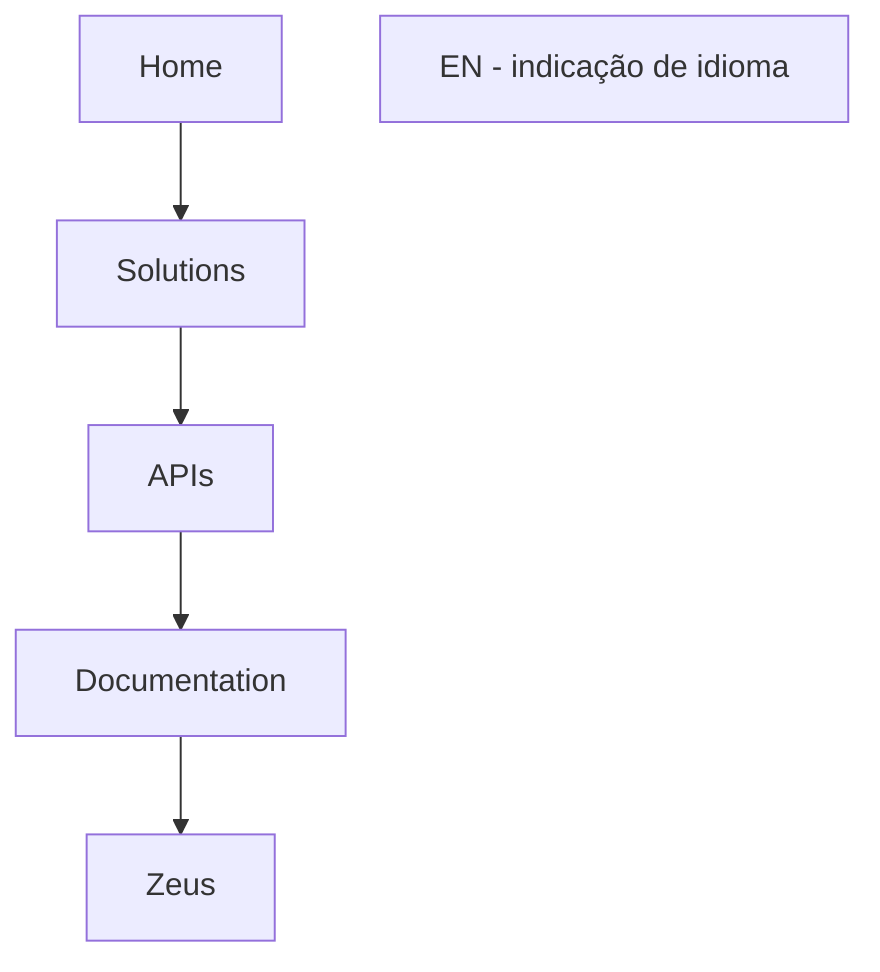

# Portal Home Solutions APIs Documentation Zeus

## 1. Metadados do Documento
- **Arquivo de Origem:** `Não identificado`
- **Tipo de Documento:** `Não identificado`
- **Domínio / Sistema:** `Home Solutions APIs Documentation Zeus`
- **Público-Alvo:** `Não identificado`
- **Data/Versão Identificada:** `Não identificada`

---

## 2. Resumo Executivo & Contexto de Negócio

O conteúdo fornecido consiste em uma única linha de navegação ou cabeçalho contendo os termos “Home”, “Solutions”, “APIs”, “Documentation” e “Zeus”. O texto também apresenta a indicação de idioma “EN”.

O documento bruto não descreve objetivos de negócio, processos, integrações, regras funcionais, componentes técnicos ou responsabilidades operacionais. Portanto, não há base factual para determinar se “Zeus” representa um sistema, produto, portal, módulo ou serviço.

O artefato aparentemente referencia uma área de documentação de APIs associada a “Home Solutions” e ao termo “Zeus”. Entretanto, o conteúdo não detalha endpoints, contratos, autenticação, ambientes, tecnologias, versões ou fluxos de consumo.

> **Nota de Análise:** O texto fornecido não contém detalhamento suficiente para caracterizar a arquitetura, o contexto corporativo ou o funcionamento de APIs relacionadas a “Zeus”.

---

## 3. Arquitetura, Componentes & Tecnologias Envolvidas

Os únicos elementos explicitamente citados são:

- `Home`
- `Solutions`
- `APIs`
- `Documentation`
- `Zeus`
- `EN`

Não foram identificadas tecnologias, microsserviços, bancos de dados, protocolos, URLs, ambientes, métodos HTTP ou contratos de integração.



> **Nota de Análise:** O diagrama representa apenas a sequência textual apresentada no conteúdo bruto. Ele não deve ser interpretado como uma arquitetura técnica confirmada.

---

## 4. Regras de Negócio, Especificações Funcionais & Processos

Não foram identificadas regras de negócio, validações, cálculos, processos operacionais, fluxos funcionais ou restrições técnicas no conteúdo fornecido.

O conteúdo apresenta somente os termos de navegação/documentação:

1. `Home`
2. `Solutions`
3. `APIs`
4. `Documentation`
5. `Zeus`
6. `EN`

---

## 5. Tabelas de Parâmetros, Ambientes e Estruturas de Dados

| Item / Parâmetro | Descrição / Função | Tipo / Valores / Formato | Ambiente / Observações |
| :--- | :--- | :--- | :--- |
| Home | Termo presente no conteúdo bruto. | Texto | Sem detalhamento adicional. |
| Solutions | Termo presente no conteúdo bruto. | Texto | Sem detalhamento adicional. |
| APIs | Termo presente no conteúdo bruto. | Texto | O documento não especifica APIs, endpoints ou contratos. |
| Documentation | Termo presente no conteúdo bruto. | Texto | Pode indicar uma seção de documentação, sem confirmação adicional. |
| Zeus | Termo presente no conteúdo bruto. | Texto | O documento não define se é sistema, produto, módulo ou serviço. |
| EN | Indicação textual de idioma. | Texto | O conteúdo não apresenta idiomas alternativos nem configuração de localização. |

---

## 6. Bateria de Perguntas & Respostas para RAG (FAQ Sintético)

### P1: Qual é o sistema ou domínio mencionado no conteúdo?
**R:** O conteúdo menciona os termos “Home Solutions APIs Documentation Zeus”. Não há definição adicional que permita confirmar a natureza de “Zeus” ou sua relação técnica com APIs.

### P2: O documento apresenta endpoints de API?
**R:** Não. O texto contém o termo “APIs”, mas não informa endpoints, métodos HTTP, parâmetros, payloads, respostas ou contratos de integração.

### P3: Quais componentes técnicos são identificados no conteúdo?
**R:** Não há componentes técnicos descritos. Os únicos elementos identificáveis são os termos textuais “Home”, “Solutions”, “APIs”, “Documentation”, “Zeus” e “EN”.

### P4: O documento informa qual tecnologia é utilizada pelo sistema Zeus?
**R:** Não. O conteúdo não cita linguagens, frameworks, bancos de dados, protocolos, ferramentas ou plataformas relacionadas a Zeus.

### P5: Existe informação sobre autenticação ou autorização das APIs?
**R:** Não. O conteúdo fornecido não descreve mecanismos de autenticação, autorização, credenciais, tokens, permissões ou políticas de segurança.

### P6: Há indicação de ambiente, URL, servidor ou porta de acesso?
**R:** Não. Nenhuma URL, hostname, ambiente, servidor, porta ou rota de rede é apresentada no texto.

### P7: O que significa a indicação “EN”?
**R:** “EN” aparece no conteúdo como uma indicação textual de idioma. O documento não fornece explicação adicional sobre idiomas suportados ou configuração de localização.

### P8: O documento contém regras de negócio?
**R:** Não. Não foram fornecidas regras de negócio, condições, critérios de validação, cálculos ou fluxos funcionais.

### P9: É possível determinar se Zeus é um microsserviço?
**R:** Não. O conteúdo apenas cita “Zeus”; não há informações suficientes para classificá-lo como microsserviço, sistema, aplicação, produto ou módulo.

### P10: Qual é a principal limitação do material analisado?
**R:** A principal limitação é a ausência de conteúdo técnico e funcional além de uma sequência de termos de navegação ou cabeçalho. Não é possível inferir arquitetura ou comportamento sem introduzir informações não sustentadas pelo texto.

---

## 7. Glossário de Termos, Siglas & Conceitos-Chave

- **API:** Termo citado no conteúdo. O documento não apresenta sua expansão, definição funcional ou detalhes técnicos.
- **Documentation:** Termo em inglês que aparece associado ao conteúdo de APIs, sem detalhamento adicional.
- **EN:** Indicação textual de idioma presente no conteúdo.
- **Home:** Termo presente no conteúdo, possivelmente associado a navegação; sem definição adicional.
- **Solutions:** Termo presente no conteúdo, sem definição adicional.
- **Zeus:** Termo presente no conteúdo. Seu significado, escopo e classificação não são definidos.

---

## 8. Notas Críticas, Riscos & Limitações

- O conteúdo bruto é extremamente limitado e não contém corpo documental, especificações ou notas explicativas.
- Não há informações sobre arquitetura, integrações, APIs, contratos, ambientes, segurança, operação ou governança.
- A relação entre “Home”, “Solutions”, “APIs”, “Documentation” e “Zeus” não é explicitamente definida.
- Não é possível afirmar que “Zeus” seja um sistema, microsserviço, produto ou domínio corporativo.
- O diagrama Mermaid representa somente a ordem dos termos extraídos e não uma arquitetura confirmada.
- Recomenda-se disponibilizar a extração integral do documento, incluindo páginas, slides, tabelas, notas do apresentador e imagens com texto, para produzir uma base de conhecimento RAG tecnicamente completa.

---

## 9. Conteúdo Bruto Estruturado (Referência Fiel)

```text
--- [PÁGINA 1 DE 1] ---

/
Home Solutions APIs Documentation Zeus
EN
```
