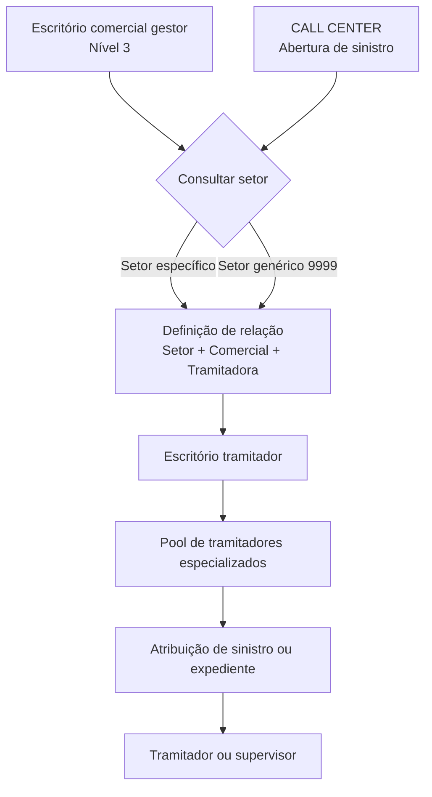

# Definição da Relação entre Escritórios Gestores e Tramitadores

## 1. Metadados do Documento
- **Arquivo de Origem:** `Não informado`
- **Tipo de Documento:** Especificação Funcional
- **Domínio / Sistema:** Relação entre escritórios comerciais gestores e escritórios tramitadores
- **Público-Alvo:** Negócio, analistas funcionais, operação e equipes responsáveis por atribuição de sinistros ou expedientes
- **Data/Versão Identificada:** Não identificada

---

## 2. Resumo Executivo & Contexto de Negócio

O documento define a configuração de relacionamento entre escritórios comerciais gestores e escritórios tramitadores. A finalidade é determinar, por setor, qual escritório tramitador será responsável por gerir os expedientes associados às apólices emitidas por cada escritório comercial de nível 3 da estrutura comercial.

Cada escritório tramitador possui um conjunto de tramitadores especializados. A atribuição de um expediente a um tramitador específico pode considerar parâmetros estabelecidos, especialização e carga de trabalho. O documento não detalha os algoritmos, pesos, regras de prioridade ou critérios de desempate usados nessa atribuição interna.

A definição é utilizada como suporte para processos de atribuição de sinistros ou expedientes a tramitadores ou supervisores. Um cenário citado ocorre quando um sinistro é aberto a partir de um CALL CENTER: a definição pode ser consultada para identificar o escritório tramitador correspondente ao escritório comercial da apólice ou ao escritório gestor onde ocorreu o sinistro.

A obrigatoriedade de preenchimento da definição não é absoluta. A necessidade de cadastrar dados depende dos critérios de atribuição adotados por cada companhia.

---

## 3. Arquitetura, Componentes & Tecnologias Envolvidas

Os componentes funcionais identificados são:

| Componente | Papel no processo |
| :--- | :--- |
| Escritório comercial / gestor | Escritório comercial ao qual é atribuído um escritório tramitador. Deve existir como nível 3 da estrutura comercial. |
| Setor | Chave usada para definir a relação entre escritório comercial e escritório tramitador. |
| Setor genérico `9999` | Representa uma definição aplicável a todos os setores. |
| Escritório tramitador | Escritório responsável pela gestão dos expedientes das apólices vinculadas ao escritório comercial. Deve existir na definição de tramitadores. |
| Pool de tramitadores especializados | Conjunto de tramitadores dentro de um escritório tramitador, disponível para receber a atribuição de expedientes. |
| Sinistro / expediente | Elemento operacional encaminhado para atribuição e gestão. |
| CALL CENTER | Canal citado para abertura de sinistros e consulta da definição de relacionamento. |
| Supervisor | Papel que pode receber suporte da definição durante a atribuição de sinistros ou expedientes. |



**Nota de Análise:** O documento descreve a relação funcional entre escritórios e o uso da definição para atribuição, mas não identifica sistemas técnicos, APIs, protocolos, bancos de dados, URLs, métodos HTTP, contratos JSON ou mecanismos de persistência.

---

## 4. Regras de Negócio, Especificações Funcionais & Processos

### Objetivo da definição

1. Definir, por setor, o escritório tramitador associado a cada escritório comercial que possa emitir apólices.
2. Considerar escritórios comerciais no nível 3 da estrutura comercial.
3. Permitir que um escritório tramitador gerencie os expedientes de apólices vinculadas a um escritório comercial.
4. Disponibilizar, dentro de cada escritório tramitador, um pool de tramitadores especializados para atribuição dos expedientes.
5. Considerar parâmetros estabelecidos, especialização e carga de trabalho na atribuição de um expediente a um tramitador.

### Propriedade: Setor

1. A propriedade **Setor** contém a chave do setor para o qual será atribuída uma relação entre escritório gestor e escritório tramitador.
2. É permitido utilizar o setor genérico `9999`.
3. O setor genérico `9999` significa que a definição criada se aplica a todos os setores.

### Propriedade: Comercial

1. A propriedade **Comercial** contém o escritório comercial ou gestor ao qual será atribuído um escritório tramitador.
2. Os escritórios comerciais cadastrados nessa propriedade devem existir como nível 3 da estrutura comercial.

### Propriedade: Tramitadora

1. A propriedade **Tramitadora** contém o escritório tramitador responsável por gerir os expedientes das apólices pertencentes ao escritório comercial.
2. O escritório tramitador informado deve existir na definição de tramitadores.

### Uso no processo de atribuição

1. A definição pode apoiar a atribuição de um sinistro ou expediente a tramitadores ou supervisores.
2. Quando um sinistro é aberto por um CALL CENTER, o processo pode consultar a definição.
3. A consulta pode identificar:
   - O escritório tramitador correspondente ao escritório comercial da apólice.
   - O escritório tramitador correspondente ao escritório gestor onde ocorreu o sinistro.
4. O preenchimento da definição depende dos critérios de atribuição utilizados pela companhia.

---

## 5. Tabelas de Parâmetros, Ambientes e Estruturas de Dados

| Item / Parâmetro | Descrição / Função | Tipo / Valores / Formato | Ambiente / Observações |
| :--- | :--- | :--- | :--- |
| Setor | Chave do setor usada para atribuir um escritório tramitador a cada escritório gestor. | Chave de setor; valor especial `9999`. | `9999` representa uma definição aplicável a todos os setores. |
| Comercial | Escritório comercial ou gestor ao qual é atribuído um escritório tramitador. | Escritório comercial. | Deve existir como nível 3 da estrutura comercial. |
| Tramitadora | Escritório responsável por gerir os expedientes das apólices do escritório comercial. | Escritório tramitador. | Deve existir na definição de tramitadores. |
| Pool de tramitadores especializados | Conjunto interno de tramitadores disponível no escritório tramitador. | Conjunto de recursos operacionais. | A atribuição pode considerar especialização, carga de trabalho e parâmetros estabelecidos. |
| Sinistro / expediente | Item a ser atribuído para gestão. | Entidade operacional. | Pode ser atribuído a tramitadores ou supervisores. |
| CALL CENTER | Canal citado para abertura de sinistros. | Canal operacional. | Pode consultar a definição para determinar o escritório tramitador aplicável. |

---

## 6. Bateria de Perguntas & Respostas para RAG (FAQ Sintético)

### P1: Qual é o objetivo da definição de relação entre escritórios gestores e tramitadores?
**R:** O objetivo é definir, por setor e para cada escritório comercial que possa emitir apólices, qual escritório tramitador será responsável por gerir os expedientes associados. Os escritórios comerciais considerados devem corresponder ao nível 3 da estrutura comercial.

### P2: O que representa o setor genérico `9999`?
**R:** O setor genérico `9999` indica que a definição de relação entre escritório gestor e escritório tramitador vale para todos os setores.

### P3: Quais condições um escritório comercial deve atender para ser informado na propriedade Comercial?
**R:** O escritório comercial ou gestor informado na propriedade Comercial deve existir como nível 3 da estrutura comercial.

### P4: Quais condições um escritório tramitador deve atender para ser informado na propriedade Tramitadora?
**R:** O escritório tramitador informado deve existir na definição de tramitadores, pois será o responsável por gerir os expedientes das apólices pertencentes ao escritório comercial relacionado.

### P5: Como um expediente é atribuído dentro de um escritório tramitador?
**R:** Dentro de cada escritório tramitador existe um pool de tramitadores especializados. O expediente pode ser atribuído a um desses tramitadores conforme parâmetros estabelecidos, especialização e carga de trabalho. O documento não detalha a lógica exata dessa seleção.

### P6: Como a definição pode ser usada quando um sinistro é aberto por CALL CENTER?
**R:** Quando um sinistro é aberto por um CALL CENTER, a definição pode ser consultada para identificar o escritório tramitador correspondente ao escritório comercial da apólice ou ao escritório gestor onde ocorreu o sinistro.

### P7: A definição é usada somente para atribuição de tramitadores?
**R:** Não. O documento informa que a definição pode servir como apoio para atribuir um sinistro ou expediente tanto a tramitadores quanto a supervisores.

### P8: É obrigatório cadastrar dados na definição de relação entre escritórios gestores e tramitadores?
**R:** A obrigatoriedade depende dos critérios de atribuição usados pela companhia. O documento não estabelece uma obrigatoriedade universal de preenchimento.

### P9: Qual é a responsabilidade do escritório tramitador na relação cadastrada?
**R:** O escritório tramitador é responsável por gerir os expedientes das apólices que pertencem ao escritório comercial indicado na propriedade Comercial.

### P10: O documento informa APIs, contratos JSON ou métodos HTTP para consultar essa definição?
**R:** Não. O documento descreve o objetivo, as propriedades funcionais e cenários de uso da definição, mas não detalha APIs, métodos HTTP, contratos JSON, URLs ou tecnologias de integração.

---

## 7. Glossário de Termos, Siglas & Conceitos-Chave

- **CALL CENTER:** Canal citado para abertura de sinistros e consulta da definição de relacionamento entre escritórios.
- **Comercial:** Propriedade que identifica o escritório comercial ou gestor ao qual será associado um escritório tramitador.
- **Escritório gestor:** Escritório comercial relacionado a um escritório tramitador na definição.
- **Escritório tramitador:** Escritório encarregado de gerir os expedientes das apólices associadas a um escritório comercial.
- **Expediente:** Item de gestão que pode ser atribuído a um tramitador ou supervisor.
- **Nível 3:** Nível da estrutura comercial exigido para os escritórios comerciais cadastrados na propriedade Comercial.
- **Pool de tramitadores especializados:** Conjunto de tramitadores especializados dentro de um escritório tramitador.
- **Setor:** Chave usada para determinar a relação entre escritório comercial gestor e escritório tramitador.
- **Setor genérico `9999`:** Valor que indica que uma definição se aplica a todos os setores.
- **Sinistro:** Evento ou caso operacional que pode exigir atribuição a tramitadores ou supervisores.
- **Supervisor:** Papel citado como possível destinatário de atribuição de sinistros ou expedientes.
- **Tramitadora:** Propriedade que identifica o escritório tramitador responsável pela gestão dos expedientes.

---

## 8. Notas Críticas, Riscos & Limitações

- O documento não detalha os critérios completos de atribuição dentro do pool de tramitadores; apenas menciona parâmetros estabelecidos, especialização e carga de trabalho.
- Não são informados mecanismos de precedência entre uma definição por setor específico e uma definição com o setor genérico `9999`.
- Não são apresentados os valores, formatos ou catálogo de setores, escritórios comerciais e escritórios tramitadores.
- Não há detalhamento de validações adicionais, mensagens de erro, permissões de manutenção ou fluxos de aprovação.
- O documento menciona uma imagem de manutenção e um exemplo, mas o conteúdo visual ou o exemplo não está presente no texto bruto fornecido.
- Não são identificados sistemas, integrações, APIs, contratos técnicos, ambientes ou responsáveis operacionais.
- A obrigatoriedade de preenchimento depende dos critérios de atribuição de cada companhia; esses critérios não são detalhados.

---

## 9. Conteúdo Bruto Estruturado (Referência Fiel)

```text
--- [PÁGINA 1 DE 3] ---

DEFINICIÓN Relación entre Oficinas Gestoras y
Tramitadoras
Objetivo
La finalidad es definir por sector para cada oficina comercial (nivel3 de la estructura comercial) que
pueda emitir pólizas, cual va a ser la oficina tramitadora que se encargue de gestionar sus
expedientes. Dentro de cada oficina tramitadora, existirá un pull de tramitadores especializados para
poder asignar el expediente a uno de ellos, según los parámetros establecidos, especialización,
carga de trabajo, etc.
Imagen del Mantenimiento Relación Oficinas Gestoras y Tramitadoras:
 / 
 CF
Home Solutions APIs Documentation Zeus
EN


--- [PÁGINA 2 DE 3] ---

Propiedades
Sector
Esta propiedad contendrá el la clave del sector para el que vamos a asignar a cada oficina gestora,
su tramitadora.
Se podrá utilizar el sector Genérico 9999, que significará que la definición que se está realizando es
para todos los sectores.
Comercial
Esta propiedad contendrá la oficina comercial, gestora, a la que le estamos asignando una oficina
tramitadora. Estas deberán existir como Nivel3 de la estructura comercial.
Tramitadora
Esta propiedad contendrá la oficina tramitadora encargada de gestionar los expedientes de las
pólizas que pertenezcan a la oficina comercial. Estas deberán existir en la definición de
tramitadoras.
Ejemplo:


--- [PÁGINA 3 DE 3] ---

Preguntas frecuentes
¿Para se utiliza esta definición ? Esta definición se suele utilizar como apoyo para la asignación
de un siniestro o expediente a los tramitadores o supervisores. Cuando el siniestro se abre
desde un CALL CENTER, se suele acceder a esta definición para ver que tramitadora le
corresponde a la comercial de la póliza, o que tramitadora le corresponde a la gestora donde se
ha producido el siniestro.
¿Es obligatorio introducir datos en esta definición?
Eso va a depender de los criterios de asignación que se utilice en la compañía.
```
