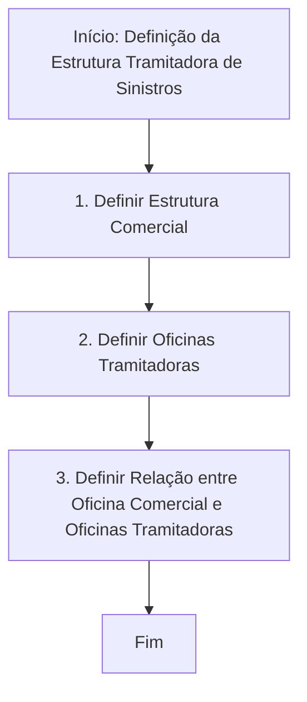

# Definição da Estrutura Tramitadora de Sinistros

## 1. Metadados do Documento
- **Arquivo de Origem:** Não identificado
- **Tipo de Documento:** Procedimento
- **Domínio / Sistema:** Estrutura Tramitadora de Sinistros
- **Público-Alvo:** Operação, Negócio e equipes responsáveis pela configuração de estrutura comercial e oficinas tramitadoras
- **Data/Versão Identificada:** Não identificada

---

## 2. Resumo Executivo & Contexto de Negócio

O documento descreve um procedimento para definir a **estrutura tramitadora de sinistros**. O objetivo explícito é explicar os passos necessários para realizar essa definição.

O processo está organizado em três atividades sequenciais: definição da estrutura comercial, definição das oficinas tramitadoras e definição da relação entre a oficina comercial e as oficinas tramitadoras.

A ordem apresentada estabelece uma dependência operacional: primeiro deve existir uma estrutura comercial definida; em seguida, devem ser definidas as oficinas tramitadoras; por fim, deve-se estabelecer o relacionamento entre esses dois elementos organizacionais.

O conteúdo disponível não apresenta detalhes sobre critérios de seleção, regras de validação, atributos cadastrais, responsáveis, sistemas de execução, contratos de API ou resultados esperados após a conclusão do processo.

---

## 3. Arquitetura, Componentes & Tecnologias Envolvidas

O documento não descreve uma arquitetura técnica de software, integrações, tecnologias, servidores ou contratos de comunicação. Os componentes funcionais identificados são:

- **Estrutura Comercial**
- **Oficinas Tramitadoras**
- **Relação Oficina Comercial / Oficinas Tramitadoras**
- **Processo de definição de estrutura tramitadora de sinistros**

Os termos `Home Solutions`, `APIs Documentation` e `Zeus` aparecem no conteúdo bruto, mas o documento não explica suas funções, relações com o processo ou características técnicas.



> **Nota de Análise:** O documento apresenta um fluxo funcional de três etapas, mas não detalha sistemas de origem, persistência de dados, interfaces, APIs, responsabilidades ou mecanismos de integração.

---

## 4. Regras de Negócio, Especificações Funcionais & Processos

### Processo para definição da estrutura tramitadora

O procedimento apresentado possui três etapas obrigatórias, indicadas em ordem numérica:

1. **Definir Estrutura Comercial**
   - A estrutura comercial deve ser definida como primeira etapa do processo.
   - O documento não descreve quais campos, níveis hierárquicos, critérios ou regras são utilizados para definir a estrutura comercial.

2. **Definir Oficinas Tramitadoras**
   - Após a definição da estrutura comercial, devem ser definidas as oficinas tramitadoras.
   - O documento não informa o conceito operacional de oficina tramitadora, sua localização, seus atributos ou critérios para inclusão no processo.

3. **Definir Relação Oficina Comercial / Oficinas Tramitadoras**
   - A terceira etapa consiste em definir a relação entre uma oficina comercial e as oficinas tramitadoras.
   - O documento não especifica se a relação é um-para-um, um-para-muitos ou muitos-para-muitos.
   - O documento não descreve critérios de associação, validações, vigência, prioridade ou exceções para a relação entre oficinas.

### Restrições e lacunas documentais

- A sequência das três etapas é explicitamente apresentada no fluxo.
- Não há detalhamento de pré-requisitos além da própria ordem do processo.
- Não há descrição de aprovações, responsáveis, evidências, prazos ou tratamento de erros.
- Não há informação sobre métodos HTTP, APIs, telas, bases de dados ou contratos JSON.

---

## 5. Tabelas de Parâmetros, Ambientes e Estruturas de Dados

| Item / Parâmetro | Descrição / Função | Tipo / Valores / Formato | Ambiente / Observações |
| :--- | :--- | :--- | :--- |
| Estrutura Tramitadora | Estrutura definida para o contexto de sinistros. | Conceito/processo organizacional. | O documento não detalha atributos ou configuração. |
| Estrutura Comercial | Primeiro elemento a ser definido no processo. | Etapa 1 do fluxo. | Sem detalhamento adicional. |
| Oficinas Tramitadoras | Segundo elemento a ser definido no processo. | Etapa 2 do fluxo. | Sem detalhamento adicional. |
| Relação Oficina Comercial / Oficinas Tramitadoras | Associação a ser definida após a estrutura comercial e as oficinas tramitadoras. | Etapa 3 do fluxo. | Cardinalidade, critérios e regras não informados. |
| Home Solutions | Termo presente no conteúdo bruto. | Não informado. | Relação com o processo não detalhada. |
| APIs Documentation | Termo presente no conteúdo bruto. | Não informado. | Não há documentação de APIs no conteúdo fornecido. |
| Zeus | Termo presente no conteúdo bruto. | Não informado. | Relação com o processo não detalhada. |
| EN | Texto presente no conteúdo bruto. | Não informado. | Significado não especificado. |
| CF | Texto presente no conteúdo bruto. | Não informado. | Significado não especificado. |

---

## 6. Bateria de Perguntas & Respostas para RAG (FAQ Sintético)

### P1: Qual é o objetivo do documento sobre estrutura tramitadora?
**R:** O objetivo do documento é explicar os passos a seguir para definir a estrutura tramitadora de sinistros.

### P2: Quantas etapas compõem o processo de definição da estrutura tramitadora?
**R:** O processo contém três etapas: definir a estrutura comercial, definir as oficinas tramitadoras e definir a relação entre a oficina comercial e as oficinas tramitadoras.

### P3: Qual é a primeira etapa para definir a estrutura tramitadora de sinistros?
**R:** A primeira etapa é definir a estrutura comercial.

### P4: O que deve ser definido depois da estrutura comercial?
**R:** Após definir a estrutura comercial, o processo determina que sejam definidas as oficinas tramitadoras.

### P5: Qual é a etapa final do processo de definição da estrutura tramitadora?
**R:** A etapa final é definir a relação entre a oficina comercial e as oficinas tramitadoras.

### P6: O documento explica como cadastrar ou configurar uma estrutura comercial?
**R:** Não. O documento informa que a estrutura comercial deve ser definida, mas não apresenta campos, atributos, critérios, telas, regras de cadastro ou validações para essa definição.

### P7: O documento informa quais oficinas podem atuar como oficinas tramitadoras?
**R:** Não. O documento apenas determina que as oficinas tramitadoras devem ser definidas, sem informar critérios de elegibilidade, localização, responsabilidades ou atributos.

### P8: O documento especifica a cardinalidade da relação entre oficina comercial e oficinas tramitadoras?
**R:** Não. O documento não informa se a relação entre oficina comercial e oficinas tramitadoras é um-para-um, um-para-muitos ou muitos-para-muitos.

### P9: Existem APIs, métodos HTTP ou contratos JSON descritos para esse processo?
**R:** Não. Embora o conteúdo contenha o termo `APIs Documentation`, não há descrição de endpoints, métodos HTTP, payloads, autenticação, respostas ou contratos JSON.

### P10: Quais sistemas ou ferramentas são identificados no documento?
**R:** Os termos `Home Solutions`, `APIs Documentation` e `Zeus` aparecem no conteúdo bruto. Entretanto, o documento não detalha suas funções, responsabilidades ou integração com o processo de definição da estrutura tramitadora.

### P11: O processo descrito apresenta tratamento de erros ou exceções?
**R:** Não. Não há regras de tratamento de erros, exceções, rejeições, aprovações ou fluxos alternativos no conteúdo fornecido.

### P12: Há informações sobre ambientes, URLs, servidores ou parâmetros técnicos?
**R:** Não. O documento não apresenta URLs, ambientes, servidores, portas, variáveis de configuração ou parâmetros técnicos.

---

## 7. Glossário de Termos, Siglas & Conceitos-Chave

- **Estrutura Tramitadora:** Estrutura relacionada ao processo de tramitação de sinistros, cuja definição é o objetivo do documento.
- **Sinistros:** Contexto de negócio citado no objetivo do procedimento. O documento não apresenta uma definição adicional para o termo.
- **Estrutura Comercial:** Elemento que deve ser definido como primeira etapa do processo.
- **Oficinas Tramitadoras:** Elemento que deve ser definido como segunda etapa do processo.
- **Relação Oficina Comercial / Oficinas Tramitadoras:** Associação entre a oficina comercial e as oficinas tramitadoras, definida como terceira etapa.
- **Home Solutions:** Termo citado no conteúdo bruto sem definição contextual.
- **APIs Documentation:** Termo citado no conteúdo bruto sem documentação técnica associada.
- **Zeus:** Termo citado no conteúdo bruto sem definição contextual.
- **EN:** Sigla ou texto citado no conteúdo bruto sem significado informado.
- **CF:** Sigla ou texto citado no conteúdo bruto sem significado informado.

---

## 8. Notas Críticas, Riscos & Limitações

- O documento é resumido e apresenta somente o fluxo de alto nível para definição da estrutura tramitadora.
- Não há detalhamento de dados de entrada, dados de saída, responsáveis, aprovações, prazos ou evidências operacionais.
- Não há definição dos critérios para estruturar a estrutura comercial ou selecionar oficinas tramitadoras.
- Não há especificação da cardinalidade, vigência ou regras de manutenção da relação entre oficina comercial e oficinas tramitadoras.
- Os termos `Home Solutions`, `APIs Documentation`, `Zeus`, `EN` e `CF` não são explicados.
- Não existem detalhes técnicos sobre APIs, integrações, bancos de dados, autenticação, ambientes ou URLs.
- **Nota de Análise:** O documento lista o processo de definição da estrutura tramitadora, porém não detalha os mecanismos operacionais ou técnicos para executar cada etapa.

---

## 9. Conteúdo Bruto Estruturado (Referência Fiel)

```text
--- [PÁGINA 1 DE 1] ---

DEFINICIÓN Estructura Tramitadora
Objetivo
Explicar los pasos a seguir para definir la estructura tramitadora de siniestros
Proceso para la definición Estructura tramitadora
DEFINIR
Estructura
Comercial(1)
DEFINIR
Oficinas
Tramitadoras (2)
DEFINIR
Relación
Oficina Comercial
Oficinas Tramitadora(3)
FIN
1. DEFINIR Estructura Comercial
2. DEFINIR Oficinas Tramitadoras
3. DEFINIR Relación Oficinas
 / 
 CF
Home Solutions APIs Documentation Zeus
EN
```
