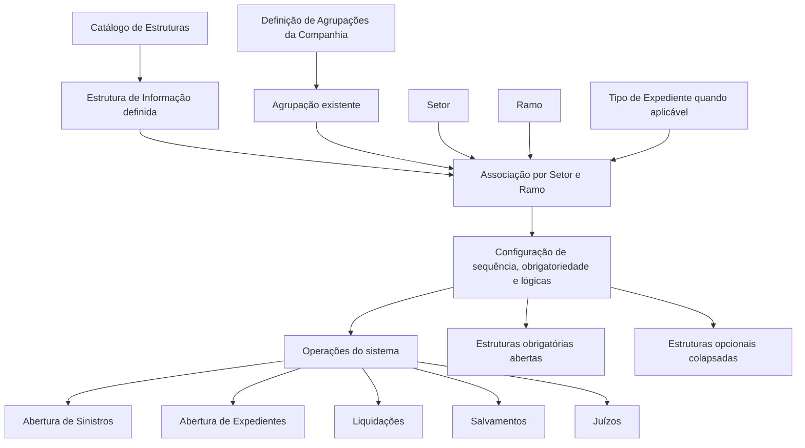

# Definição de Estruturas de Informação dos Módulos de Sinistros

## 1. Metadados do Documento
- **Arquivo de Origem:** Não identificado
- **Tipo de Documento:** Especificação Técnica / Procedimento Funcional
- **Domínio / Sistema:** Módulo de Sinistros, Expedientes, Liquidações, Salvamentos e Juízos
- **Público-Alvo:** Analistas funcionais, configuradores, desenvolvedores e operação
- **Data/Versão Identificada:** Não identificada

---

## 2. Resumo Executivo & Contexto de Negócio

O documento define como configurar estruturas de informação solicitadas nas operações do Módulo de Sinistros, considerando a combinação de **Setor** e **Ramo**. Uma estrutura de informação pode ser aplicada a todos os setores e ramos, a todos os ramos de um setor específico ou a uma combinação específica de setor e ramo.

As estruturas de informação precisam existir previamente no catálogo de estruturas. Após essa definição, as estruturas são associadas às agrupações — também chamadas de pontos de salto — nas quais a informação será requerida pelas operações de sinistros, expedientes, liquidações, salvamentos ou juízos.

O modelo permite controlar a sequência de apresentação das estruturas de informação, a obrigatoriedade do preenchimento, a lógica condicional de obrigatoriedade e a lógica condicional de visualização. Esse mecanismo permite que cada operação apresente apenas as estruturas relevantes, de acordo com critérios de negócio resolvidos pela própria operação.

As estruturas obrigatórias são abertas inicialmente e exigem a introdução de informação; as estruturas opcionais são apresentadas colapsadas, permitindo que o usuário decida se deseja acessá-las. Quando várias estruturas obrigatórias existem, todas são apresentadas não colapsadas e identificadas com asterisco vermelho.

---

## 3. Arquitetura, Componentes & Tecnologias Envolvidas

### Componentes e catálogos identificados

| Componente / Elemento | Função no contexto documentado |
| :--- | :--- |
| Catálogo de estruturas | Repositório no qual as estruturas de informação devem estar previamente definidas. |
| Definição de agrupações da companhia | Local no qual a agrupação deve existir antes de ser utilizada. |
| Módulo de Sinistros | Módulo que solicita informações adicionais em operações de sinistros. |
| Operação de abertura de sinistros | Resolve lógicas de negócio e apresenta estruturas de informação aplicáveis. |
| Operação de abertura de expediente | Solicita estruturas associadas a agrupações de expedientes. |
| Operação de liquidações | Solicita estruturas associadas à agrupação de liquidações. |
| Operação de salvamentos | Solicita estruturas associadas à agrupação de salvamentos. |
| Operação de juízos | Solicita estruturas associadas à agrupação de juízos. |
| Setor | Chave de segmentação usada para definir a aplicabilidade da estrutura. |
| Ramo | Chave de segmentação usada para definir a aplicabilidade da estrutura. |
| Tipo de Expediente | Chave requerida quando a informação se aplica a um processo em nível de expediente. |
| Agrupação de Informação | Ponto de associação entre uma estrutura de informação e uma operação ou momento do processo. |
| Lógica de Negócio | Regra avaliada pela operação para determinar obrigatoriedade ou visualização. |



**Nota de Análise:** O documento não detalha tecnologias de implementação, contratos de API, métodos HTTP, banco de dados, URLs, servidores ou mecanismos técnicos de execução das lógicas de negócio.

---

## 4. Regras de Negócio, Especificações Funcionais & Processos

### Aplicabilidade por Setor e Ramo

1. Quando uma estrutura de informação deve ser solicitada para todos os setores e todos os ramos, deve-se utilizar:
   - Setor genérico: `9999 - Todos os setores`.
   - Ramo genérico: `999 - Todos os Ramos`.

2. Quando uma estrutura de informação deve ser solicitada para todos os ramos de um setor específico:
   - Deve-se informar a chave do setor aplicável.
   - Deve-se utilizar o ramo genérico `999 - Todos os Ramos`.

3. Quando a estrutura se aplica a uma combinação específica:
   - Deve-se informar a chave do setor.
   - Deve-se informar a chave do ramo.

### Pré-requisitos de configuração

1. A estrutura de informação deve estar definida no catálogo de estruturas.
2. A agrupação de informação deve existir na definição de agrupações da companhia.
3. A estrutura deve ser associada à agrupação aplicável.
4. A associação deve ser definida para o setor e ramo pertinentes.
5. Quando aplicável, deve-se informar o tipo de expediente.
6. Deve-se definir a sequência de apresentação.
7. Deve-se definir se a estrutura é obrigatória ou opcional.
8. Quando necessário, deve-se configurar uma lógica de negócio para determinar obrigatoriedade.
9. Quando necessário, deve-se configurar uma lógica de negócio para determinar visualização.

### Regras para Tipo de Expediente

- A propriedade **Tipo de Expediente** é solicitada apenas quando a informação se destina a um processo em nível de expediente.
- Quando o processo for de sinistros, o sistema atribui o tipo de expediente genérico, indicando aplicabilidade a todos os tipos de expedientes.
- Quando o processo for de expedientes, é necessário introduzir a chave do tipo de expediente.

### Regras para Agrupações

- Cada módulo possui agrupações pré-atribuídas.
- As agrupações pré-atribuídas não podem ser modificadas.
- Os valores aplicáveis ao Módulo de Sinistros precisam estar definidos no catálogo correspondente.
- Uma mesma agrupação pode ter várias estruturas de informação associadas.
- Para cada estrutura associada devem ser definidos:
  - Se a estrutura é obrigatória ou opcional.
  - A ordem em que a estrutura será apresentada.

### Regras de sequência

- O **Número de Sequência** determina a ordem de apresentação das estruturas de informação.
- A ordem de apresentação depende da agrupação configurada.
- A apresentação pode ocorrer ao abrir um sinistro, abrir um expediente, realizar uma liquidação ou modificar informações, conforme a agrupação.
- As estruturas de informação mais comuns e mais utilizadas devem ser definidas primeiro.

### Regras de obrigatoriedade

- A propriedade **É obrigatória** informa se a estrutura de informação deve ser requerida obrigatoriamente.
- A operação consulta o catálogo e apresenta inicialmente abertas as estruturas definidas como obrigatórias.
- Estruturas opcionais, isto é, não obrigatórias, são apresentadas colapsadas.
- Quando uma estrutura é obrigatória, a operação controla se a informação foi introduzida.
- Quando existem várias estruturas obrigatórias:
  - Todas são apresentadas não colapsadas.
  - Todas são identificadas com asterisco vermelho.
  - A operação controla a introdução de informação.

### Lógica condicional de obrigatoriedade

- A propriedade **Lógica que determina se É obrigatória** contém uma lógica de negócio.
- A lógica é utilizada quando a obrigatoriedade não é sempre fixa como “sim” ou “não”.
- A obrigatoriedade pode depender de outros fatores.
- A operação correspondente, como abertura de sinistros, abertura de expediente, liquidações ou juízos, resolve a lógica de negócio para determinar se a estrutura é obrigatória.

### Lógica condicional de visualização

- A propriedade **Lógica que determina se se visualiza** contém uma lógica de negócio.
- A lógica determina se a estrutura de informação deve ser visualizada ou não.
- O documento não especifica os fatores, expressões, linguagem ou mecanismo de configuração dessas lógicas.

---

## 5. Tabelas de Parâmetros, Ambientes e Estruturas de Dados

| Item / Parâmetro | Descrição / Função | Tipo / Valores / Formato | Ambiente / Observações |
| :--- | :--- | :--- | :--- |
| Setor | Contém a chave do setor para o qual a estrutura de informação será definida. | Chave de setor; `9999 - Todos os setores` para aplicabilidade a todos os setores. | Usado na definição da estrutura por setor e ramo. |
| Ramo | Indica a chave do ramo ao qual serão definidas estruturas de informação. | Chave de ramo; `999 - Todos os Ramos` para aplicabilidade a todos os ramos. | Pode ser genérico para todos os ramos de um setor. |
| Tipo de Expediente | Identifica o tipo de expediente ao qual a informação se aplica. | Chave do tipo de expediente ou tipo genérico atribuído pelo sistema. | Solicitado somente para processos em nível de expediente. |
| Agrupação de Informação | Define o ponto de associação da estrutura de informação à operação. | Agrupação previamente existente na definição de agrupações da companhia. | Os valores do módulo são pré-fixados e não podem ser modificados. |
| Código da Estrutura de Informação - Operação | Contém o código da estrutura de informação definida para setor e ramo. | Código de estrutura previamente definido no catálogo de estruturas. | Deve estar associado à agrupação definida para setor e ramo. |
| Número de Sequência | Determina a ordem de apresentação da estrutura. | Número sequencial. | Priorizar estruturas mais comuns e mais utilizadas. |
| É obrigatória | Determina se a informação deve ser solicitada obrigatoriamente. | Obrigatória ou não obrigatória/opcional. | Obrigatórias são abertas; opcionais são apresentadas colapsadas. |
| Lógica que determina se É obrigatória | Define condicionalmente se uma estrutura é obrigatória. | Lógica de Negócio. | Resolvida pela operação correspondente. |
| Lógica que determina se se visualiza | Define condicionalmente se uma estrutura é visualizada. | Lógica de Negócio. | O documento não detalha a implementação da lógica. |

### Agrupações identificadas

| Agrupação / Categoria | Nome ou finalidade documentada | Momento ou operação associada |
| :--- | :--- | :--- |
| Agrupações Sinistros | Dados Fijos Siniestros antes de las consecuencias | Informação adicional antes de solicitar consequências. |
| Agrupações Sinistros | Datos Fijos del Siniestro después de las consecuencias | Informação adicional após as consequências. |
| Agrupações Expedientes | Complementarias Expediente | Informação adicional depois de abrir um expediente. |
| Agrupações Liquidaciones | Liquidaciones | Informação adicional nas operações de liquidações. |
| Agrupações Salvamentos | Salvamentos | Informação adicional em salvamentos. |
| Agrupações Juicios | Juicios | Informação adicional nos juízos. |

---

## 6. Bateria de Perguntas & Respostas para RAG (FAQ Sintético)

### P1: Como configurar uma estrutura de informação válida para todos os setores e todos os ramos?
**R:** Deve-se utilizar o setor genérico `9999 - Todos os setores` e o ramo genérico `999 - Todos os Ramos`. A estrutura também deve existir previamente no catálogo de estruturas e ser associada à agrupação aplicável.

### P2: Como configurar uma estrutura que se aplica a todos os ramos de um setor específico?
**R:** Deve-se informar a chave do setor específico e utilizar o valor genérico `999 - Todos os Ramos` no campo Ramo. Dessa forma, a estrutura será aplicável a todos os ramos daquele setor.

### P3: Quando a propriedade Tipo de Expediente deve ser preenchida?
**R:** Tipo de Expediente deve ser preenchido quando a informação se destina a um processo em nível de expediente. Para processos de sinistros, o sistema atribui o tipo de expediente genérico, aplicável a todos os tipos de expedientes.

### P4: Quais são os pré-requisitos para associar uma estrutura de informação a uma operação?
**R:** A estrutura deve estar definida no catálogo de estruturas, a agrupação deve existir na definição de agrupações da companhia e a estrutura deve ser associada à agrupação configurada para o setor e ramo aplicáveis.

### P5: Uma agrupação pode ter várias estruturas de informação?
**R:** Sim. Podem ser associadas várias estruturas de informação a cada agrupação. Para cada estrutura associada, é necessário indicar se ela é obrigatória ou opcional e em qual ordem será apresentada.

### P6: Como são apresentadas as estruturas de informação obrigatórias?
**R:** As operações consultam o catálogo e apresentam abertas as estruturas definidas como obrigatórias. Quando existem várias estruturas obrigatórias, elas são exibidas não colapsadas, com asterisco vermelho, e a operação controla a introdução da informação.

### P7: Como são apresentadas as estruturas opcionais?
**R:** Estruturas não obrigatórias ou opcionais são apresentadas colapsadas e na ordem definida pelo Número de Sequência. O usuário escolhe em qual estrutura deseja introduzir informação.

### P8: Qual é a finalidade do Número de Sequência?
**R:** O Número de Sequência define a ordem de apresentação das estruturas de informação em operações como abertura de sinistro, abertura de expediente, liquidação ou modificação, conforme a agrupação. O documento orienta que as estruturas mais comuns e mais utilizadas sejam definidas primeiro.

### P9: Como o sistema determina que uma estrutura é obrigatória somente em determinadas condições?
**R:** Deve-se utilizar a propriedade “Lógica que determina se É obrigatória”. Essa propriedade contém uma lógica de negócio resolvida pela operação correspondente, como abertura de sinistros, abertura de expediente, liquidações ou juízos.

### P10: Como o sistema determina se uma estrutura de informação deve ser visualizada?
**R:** A propriedade “Lógica que determina se se visualiza” contém uma lógica de negócio que determina se a estrutura será visualizada ou não. O documento não detalha os critérios, a sintaxe ou o mecanismo de execução dessa lógica.

### P11: Quais agrupações são identificadas para o Módulo de Sinistros?
**R:** O documento identifica agrupações para sinistros antes das consequências, dados fixos do sinistro após as consequências, expedientes, liquidações, salvamentos e juízos. Cada agrupação corresponde ao momento ou operação em que informações adicionais podem ser solicitadas.

---

## 7. Glossário de Termos, Siglas & Conceitos-Chave

- **Agrupação de Informação:** Agrupação previamente definida na companhia, usada como ponto de associação de estruturas de informação a operações.
- **Catálogo de Estruturas:** Catálogo no qual estruturas de informação devem ser definidas antes de serem associadas a agrupações.
- **Código da Estrutura de Informação - Operação:** Código da estrutura de informação definida para determinada combinação de setor e ramo.
- **Expediente:** Processo para o qual pode ser necessário informar uma chave específica de tipo de expediente.
- **Lógica de Negócio:** Lógica utilizada para determinar obrigatoriedade ou visualização de uma estrutura de informação.
- **Ramo:** Chave que identifica o ramo ao qual a estrutura de informação se aplica.
- **Setor:** Chave que identifica o setor ao qual a estrutura de informação se aplica.
- **Siniestro / Sinistro:** Contexto operacional do módulo no qual informações adicionais podem ser solicitadas.
- **Tipo de Expediente Genérico:** Tipo atribuído pelo sistema em processos de sinistros, indicando aplicabilidade a todos os tipos de expedientes.
- **`9999 - Todos os setores`:** Valor genérico para aplicabilidade a todos os setores.
- **`999 - Todos os Ramos`:** Valor genérico para aplicabilidade a todos os ramos.

---

## 8. Notas Críticas, Riscos & Limitações

- O documento exige que estruturas de informação existam previamente no catálogo de estruturas; associações sem essa definição prévia não estão descritas como válidas.
- A agrupação deve existir na definição de agrupações da companhia antes de ser utilizada.
- As agrupações de cada módulo são pré-atribuídas e não podem ser modificadas.
- A obrigatoriedade e a visualização podem depender de lógicas de negócio, mas o documento não detalha a linguagem, critérios, operadores, dados de entrada ou tratamento de erro dessas lógicas.
- O documento não especifica os mecanismos técnicos de persistência, autorização, auditoria, APIs, integrações ou interfaces de administração.
- Não há exemplos preenchidos para os trechos identificados apenas como “Ejemplo”.
- Não são detalhados os comportamentos para conflitos entre configurações genéricas e específicas de setor, ramo ou tipo de expediente.

---

## 9. Conteúdo Bruto Estruturado (Referência Fiel)

```text
--- [PÁGINA 1 DE 5] ---

DEFINICIÓN Estructuras de Información de los
Módulos Siniestros
Objetivo
La finalidad es definir toda la información que se va a solicitar en las diferentes operaciones del
Módulo de Siniestros por Sector y Ramo.
Si una estructura de información, por ejemplo, el Relato del siniestro, se va a solicitar en todos los
sectores y en todos los ramos, se pondrá el sector genérico (9999-Todos los sectores) y el ramo
genérico (999-Todos los Ramos). Si se va a solicitar para todos los ramos de un sector, se pondrá el
valor del sector y el valor del ramo será el genérico, para todos los ramos.
Estas estructuras de información tendrán que estar definidas en el catálogo de estructuras y luego
asociarlas a las diferentes agrupaciones (puntos de salto) donde se va a requerir esa información.
 /
 CF
Home Solutions APIs Documentation Zeus
EN


--- [PÁGINA 2 DE 5] ---

Propiedades Sector Ramo
Sector
Esta propiedad contendrá la clave del sector para el cual se va a definir la estructura de
información. Si la información se va para todos los sectores, se utilizará el genérico 9999- Todos los
sectores.
Ramo
Esta propiedad indica la clave del Ramo al cual se le va a definir las estructuras de información. Si la
información se va para todos los ramos, se utilizará el genérico 999- Todos los ramos.
Tipo de Expediente
Esta propiedad sólo se pedirá en el caso de que la información sea para un proceso a nivel de
expediente.
Cuando sea de un proceso de siniestros, el sistema asignará el tipo de expediente genérico, que
indica que es para todos los tipos de expedientes, si el proceso es de expedientes, habrá que
introducir la clave del tipo de expediente.
Agrupación de Información


--- [PÁGINA 3 DE 5] ---

La Agrupación tiene que existir en la definición de agrupaciones de la compañía Los valores de esta
propiedad ya están prefijados y los que afectan al módulo de siniestros que tienen que estar
definidas en este catálogo son:
AGRUPACIONES
Cada módulo tiene unas agrupaciones pre-asignadas que no se pueden modificar
Agrupaciones Siniestros
Agrupación para definir información adicional antes de pedir consecuencias:
Datos Fijos Siniestros antes de las consecuencias
Agrupación para definir información adicional antes de pedir consecuencias:
Datos Fijos del Siniestro después de las consecuencias
Agrupaciones Expedientes
Agrupación para definir información adicional después de abrir un expediente:
Complementarias Expediente
Agrupaciones Liquidaciones
Agrupación para definir información adicional en las operaciones de Liquidaciones:
Liquidaciones
Agrupaciones Salvamentos
Agrupación para definir información adicional en salvamentos:
Salvamentos
Agrupaciones Juicios
Agrupación para definir información adicional en los juicios:
Juicios
Código de la Estructura de Información - Operación
Esta propiedad contendrá el código de la estructura de información que se está definiendo para el
sector ramo.
Estas estructuras deberán estar definidas en el catálogo de estructuras y asociada a las agrupación
que se está definiendo para el sector y el ramo.
Consejo:


--- [PÁGINA 4 DE 5] ---

Número de Secuencia
Esta propiedad indicará el orden de presentación de la estructuras de información cuando se abra
un siniestro, o cuando se abra un expediente o cuando se realice una liquidación, cuando se
modifique, todo depende de la agrupación. Se deberá definir en primer lugar las estructuras de
información más comunes, más usadas.
Es obligatoria
Esta propiedad indica si la información que se ha definido se va a pedir obligatoriamente. Las
operaciones irán a este catálogo y primero mostrará abiertas todas las estructuras de información
que se haya definido como obligatorias, y luego mostrarán todas las estructuras opcionales (No
obligatorias) se mostrarán colapsadas, para que el usuario decida en cual entrar. Si son obligatorias
se controlará que tengan información.
Lógica que determina si Es obligatoria
Esta propiedad contendrá una lógica de Negocio, que determinará si la estructura de información es
obligatoria o no, cuando no siempre sea si o no, si no que dependa de otros factores. La operación
(apertura de siniestros, apertura de expediente, liquidaciones, juicios...) se encargará de resolver
esta lógica de negocio para determinar si es o no obligatoria
Lógica que determina si se visualiza
Esta propiedad o atributo, contendrá una lógica de Negocio que determinará si la estructura de
información se visualiza o no se visualiza.
Preguntas frecuentes
¿Se pueden asociar a cada agrupación varias estructuras de información?
Si se pueden elegir varias estructuras de información y habrá que indicar si son obligatorias u
opcionales y en que orden se van a mostrar.
Cuando hay varias estructuras obligatorias, la operación mostrará las estructuras obligatorias
no colapsadas y con un asterisco rojo. La operación (apertura de siniestros, liquidaciones,
juicios...) controlará que se introduzca información.
Ejemplo:
Ejemplo:
Ejemplo:


--- [PÁGINA 5 DE 5] ---

Cuando hay una o varias estructuras no obligatorias u opcionales, se mostrarán colapsadas
y en el orden establecido para que el usuario elija en que estructura quiere introducir
información.
```
