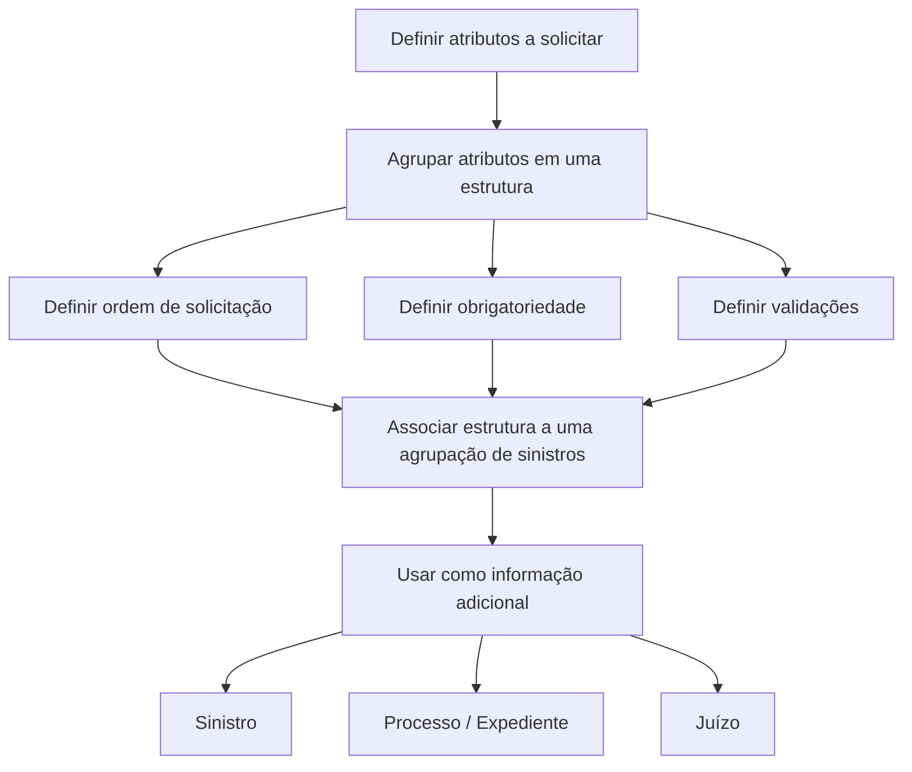

# Definição de Estruturas de Atributos do Módulo de Sinistros

## 1. Metadados do Documento
- **Arquivo de Origem:** `Não identificado`
- **Tipo de Documento:** `Procedimento`
- **Domínio / Sistema:** `Módulo de Sinistros`
- **Público-Alvo:** `Negócio, Operação e equipes responsáveis pela configuração de sinistros`
- **Data/Versão Identificada:** `Não identificada`

---

## 2. Resumo Executivo & Contexto de Negócio

O documento descreve o processo para definir informações adicionais reutilizáveis em qualquer submódulo de sinistros. Os submódulos citados incluem tramitação de sinistros, tramitação de processos, liquidações e perícias.

O processo começa com a definição dos atributos que devem ser solicitados. Posteriormente, os atributos são agrupados em uma estrutura de informação que determina aspectos como ordem de solicitação, obrigatoriedade e validações.

Uma estrutura de informação deve ser definida e associada a uma agrupação de sinistros. Depois de definida, a estrutura pode ser utilizada como informação adicional de um sinistro, processo ou juízo.

O conteúdo disponível apresenta o fluxo em nível procedimental. Não especifica telas, campos concretos, regras de validação individuais, contratos de integração ou detalhes técnicos de persistência.

---

## 3. Arquitetura, Componentes & Tecnologias Envolvidas

O documento não descreve uma arquitetura de software, tecnologias, APIs, bancos de dados ou integrações técnicas. O escopo apresentado é funcional e configuracional, centrado na definição e agrupamento de atributos para o módulo de sinistros.

### Elementos funcionais identificados

| Elemento | Papel descrito |
| :--- | :--- |
| Módulo de Sinistros | Domínio no qual são definidas estruturas de informação adicional. |
| Atributo | Informação que deve ser solicitada e posteriormente agrupada. |
| Estrutura de informação | Agrupamento de atributos que define ordem de solicitação, obrigatoriedade e validações. |
| Agrupação de sinistros | Entidade à qual a estrutura deve estar associada. |
| Sinistro | Entidade que pode receber a estrutura como informação adicional. |
| Processo / Expediente | Entidade que pode receber a estrutura como informação adicional. |
| Juízo / Juicios | Entidade que pode receber a estrutura como informação adicional. |
| Tramitação de sinistros | Submódulo citado como possível consumidor da informação adicional. |
| Tramitação de processos | Submódulo citado como possível consumidor da informação adicional. |
| Liquidações | Submódulo citado como possível consumidor da informação adicional. |
| Perícias | Submódulo citado como possível consumidor da informação adicional. |



---

## 4. Regras de Negócio, Especificações Funcionais & Processos

1. Os atributos que se deseja solicitar devem ser definidos antes da criação da estrutura de informação.
2. Os atributos definidos devem ser agrupados em uma estrutura.
3. A estrutura deve indicar a ordem em que os atributos serão solicitados.
4. A estrutura deve indicar se os atributos são obrigatórios.
5. A estrutura pode conter validações aplicáveis aos atributos.
6. A estrutura deve estar definida e associada a uma agrupação de sinistros.
7. Após a definição, a estrutura pode ser associada como informação adicional de:
   - Sinistro;
   - Processo ou expediente;
   - Juízo.
8. A informação adicional pode ser utilizada em qualquer submódulo de sinistros, incluindo:
   - Tramitação de sinistros;
   - Tramitação de processos;
   - Liquidações;
   - Perícias.

### Fluxo operacional extraído

1. Definir o atributo ou os atributos necessários.
2. Agrupar os atributos em uma estrutura.
3. Configurar, na estrutura, a ordem de solicitação, a obrigatoriedade e as validações.
4. Associar a estrutura a uma agrupação de sinistros.
5. Utilizar a estrutura como informação adicional nas entidades de sinistro, processo/expediente ou juízo.

---

## 5. Tabelas de Parâmetros, Ambientes e Estruturas de Dados

| Item / Parâmetro | Descrição / Função | Tipo / Valores / Formato | Ambiente / Observações |
| :--- | :--- | :--- | :--- |
| Atributo | Informação que será solicitada no contexto de sinistros. | Não detalhado. | Deve ser definido antes do agrupamento em estrutura. |
| Estrutura de informação | Agrupa atributos para reutilização como informação adicional. | Não detalhado. | Deve estar associada a uma agrupação de sinistros. |
| Ordem de solicitação | Define a sequência de solicitação dos atributos da estrutura. | Não detalhado. | Configurada na estrutura. |
| Obrigatoriedade | Indica se um atributo deve ser preenchido. | Obrigatório ou não obrigatório; valores exatos não detalhados. | Configurada na estrutura. |
| Validações | Regras aplicáveis aos atributos da estrutura. | Não detalhado. | O documento não especifica tipos ou critérios de validação. |
| Agrupação de sinistros | Associação necessária para uma estrutura de informação. | Não detalhado. | A estrutura deve estar definida e associada a essa agrupação. |
| Informação adicional do sinistro | Uso possível da estrutura definida. | Não detalhado. | Aplicável ao sinistro. |
| Informação adicional do processo/expediente | Uso possível da estrutura definida. | Não detalhado. | Aplicável ao processo ou expediente. |
| Informação adicional do juízo | Uso possível da estrutura definida. | Não detalhado. | Aplicável ao juízo. |

---

## 6. Bateria de Perguntas & Respostas para RAG (FAQ Sintético)

### P1: Qual é o objetivo da definição de estruturas de atributos no módulo de sinistros?
**R:** O objetivo é definir informações adicionais que possam ser utilizadas em qualquer submódulo de sinistros, incluindo tramitação de sinistros, tramitação de processos, liquidações e perícias.

### P2: Qual é a primeira etapa para criar uma estrutura de informação adicional?
**R:** A primeira etapa é definir os atributos que se deseja solicitar. Somente depois os atributos são agrupados em uma estrutura.

### P3: O que uma estrutura de atributos deve configurar?
**R:** A estrutura deve configurar a ordem de solicitação dos atributos, indicar se os atributos são obrigatórios e contemplar validações quando aplicáveis.

### P4: Uma estrutura de informação pode ser usada sem associação a uma agrupação de sinistros?
**R:** Não. O documento informa que a estrutura deve estar definida e associada a uma agrupação de sinistros.

### P5: Em quais entidades uma estrutura definida pode ser associada como informação adicional?
**R:** Uma estrutura definida pode ser associada como informação adicional de um sinistro, de um processo ou expediente e de um juízo.

### P6: Quais submódulos de sinistros são citados como consumidores potenciais da informação adicional?
**R:** O documento cita tramitação de sinistros, tramitação de processos, liquidações e perícias.

### P7: O documento especifica quais atributos devem existir para cada tipo de sinistro?
**R:** Não. O documento explica o procedimento geral de definição e agrupamento de atributos, mas não lista atributos concretos por tipo de sinistro.

### P8: O documento descreve regras de validação específicas?
**R:** Não. O documento informa que a estrutura pode indicar se os atributos possuem validações, mas não detalha os tipos, condições ou mensagens de validação.

### P9: O que significa agrupar atributos em uma estrutura?
**R:** Significa organizar os atributos definidos em uma estrutura de informação que estabelece como esses atributos serão solicitados, incluindo sua ordem, obrigatoriedade e validações.

### P10: O documento descreve APIs, métodos HTTP ou contratos JSON para as estruturas de atributos?
**R:** Não. O conteúdo disponível não apresenta APIs, métodos HTTP, contratos JSON, bancos de dados ou detalhes de implementação técnica.

---

## 7. Glossário de Termos, Siglas & Conceitos-Chave

- **Atributo:** Informação que se deseja solicitar no contexto do módulo de sinistros.
- **Estrutura de informação:** Agrupamento de atributos com definição de ordem de solicitação, obrigatoriedade e validações.
- **Agrupação de sinistros:** Agrupação à qual a estrutura de informação deve ser associada.
- **Sinistro:** Entidade do domínio que pode receber uma estrutura como informação adicional.
- **Expediente / Processo:** Entidade citada como possível receptora de informação adicional.
- **Liquidação:** Submódulo de sinistros citado como consumidor potencial de informação adicional.
- **Perícia:** Submódulo de sinistros citado como consumidor potencial de informação adicional.
- **Juízo / Juicios:** Entidade citada como possível receptora de informação adicional.

---

## 8. Notas Críticas, Riscos & Limitações

- **Nota de Análise:** O documento apresenta somente o processo funcional de definição e agrupamento de atributos.
- **Nota de Análise:** Não há detalhamento dos atributos disponíveis, tipos de dados, valores permitidos ou regras de validação.
- **Nota de Análise:** Não foram identificados detalhes de arquitetura técnica, tecnologias, endpoints, ambientes, URLs, servidores ou rotas de log.
- **Nota de Análise:** Os termos “Home”, “Solutions”, “APIs”, “Documentation”, “Zeus”, “EN” e “CF” aparecem no extrato, mas não possuem contexto suficiente para serem classificados como componentes, sistemas ou siglas do processo.
- **Risco operacional:** A ausência de critérios concretos para obrigatoriedade e validações pode exigir consulta a documentação complementar antes de configurar uma estrutura em ambiente produtivo.

---

## 9. Conteúdo Bruto Estruturado (Referência Fiel)

```text
--- [PÁGINA 1 DE 1] ---

DEFINICIÓN Estructuras de Atributos del
Módulo de Siniestros

Objetivo
Explicar los pasos a seguir para definición de información adicional para ser utilizado en cualquier
sub-módulo de siniestros: tramitación siniestros, tramitación expedientes, liquidaciones,
peritaciones...

Primero se definirán los atributos que se quieren solicitar, y posteriormente se agruparán en una
estructura indicando el orden de petición, si son obligatorios, si tienen validaciones, etc.

La estructura tendrá que estar definida y asociada a una agrupación de siniestros Una vez que se
haya definido una estructura de información, ésta podrá ser asociada como información adicional del
siniestro, del expediente, de juicios...

Proceso para la definición información adicional

DEFINIR
Atributo

AGRUPAR Atributos
en Estructuras

FIN

1. DEFINIR Atributo

1. DEFINIR Atributos de una Estructura

/

CF
Home Solutions APIs Documentation Zeus
EN
```
