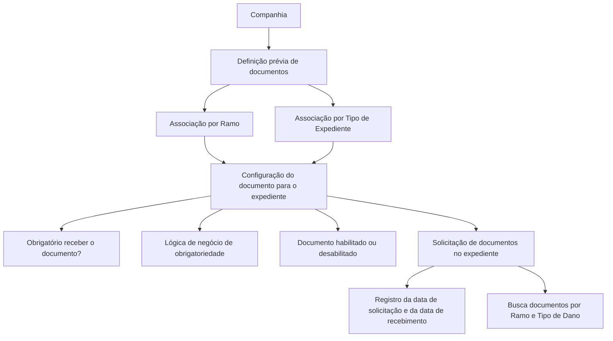

# Definição de Documentos por Ramo e Tipo de Expediente

## 1. Metadados do Documento
- **Arquivo de Origem:** Não identificado no conteúdo fornecido
- **Tipo de Documento:** Especificação Funcional
- **Domínio / Sistema:** Home Solutions APIs Documentation Zeus CF
- **Público-Alvo:** Negócio, analistas funcionais, desenvolvedores e operação
- **Data/Versão Identificada:** Não identificada

---

## 2. Resumo Executivo & Contexto de Negócio

O documento define a configuração de documentos necessários para a tramitação de diferentes tipos de expedientes. O objetivo declarado é estabelecer toda a documentação que pode ser necessária ao processamento desses expedientes.

A definição dos documentos ocorre inicialmente no nível de companhia. Após essa definição corporativa, cada documento é associado aos ramos que poderão solicitá-lo. A associação é complementada pela definição do tipo de expediente aplicável.

Para cada combinação de ramo e tipo de expediente, o documento descreve propriedades que controlam a exigência e a disponibilidade de um documento. Essas propriedades incluem a obrigatoriedade de solicitação e recebimento, uma lógica de negócio para determinar obrigatoriedade baseada em outros parâmetros e o estado de habilitação ou desabilitação para solicitação.

O processo também preserva rastreabilidade temporal: a companhia guarda a data em que um documento foi solicitado e a data em que foi recebido. Um único expediente pode demandar mais de um documento; nesse caso, são pesquisados todos os documentos definidos para o ramo e o tipo de dano do expediente.

---

## 3. Arquitetura, Componentes & Tecnologias Envolvidas

Os elementos funcionais identificados são:

| Componente / Conceito | Papel identificado |
| :--- | :--- |
| Companhia | Nível no qual os documentos são definidos inicialmente. |
| Documento | Item documental que pode ser solicitado e recebido durante a tramitação de um expediente. |
| Ramo | Chave usada para associar documentos previamente definidos no nível de companhia. |
| Tipo de Expediente | Chave usada para associar documentos previamente definidos no nível de companhia. |
| Tipo de Dano | Critério usado na busca dos documentos aplicáveis a um expediente, conforme a seção de perguntas frequentes. |
| Expediente | Entidade para a qual documentos podem ser solicitados durante a tramitação. |
| Home Solutions APIs Documentation Zeus | Identificação textual exibida no conteúdo de origem. |
| CF | Identificação textual exibida no conteúdo de origem. |



> **Nota de Análise:** O conteúdo não detalha tecnologias de implementação, métodos HTTP, contratos de API, bancos de dados, interfaces de usuário, modelos de dados físicos ou integrações técnicas.

---

## 4. Regras de Negócio, Especificações Funcionais & Processos

1. Todos os documentos devem ser definidos inicialmente no nível de companhia.
2. Após a definição no nível de companhia, os documentos devem ser associados aos ramos que poderão solicitá-los.
3. A propriedade **Ramo** informa a chave do ramo ao qual os documentos previamente definidos no nível de companhia serão associados.
4. A propriedade **Tipo de Expediente** informa a chave do tipo de expediente ao qual os documentos previamente definidos no nível de companhia serão associados.
5. A propriedade **É obrigatório receber o Documento?** determina se é obrigatório solicitar e receber o documento para a tramitação do tipo de expediente.
6. A propriedade **Lógica que determina se o Documento é obrigatório** contém lógica de negócio para situações em que a obrigatoriedade de receber o documento depende de outros parâmetros.
7. A propriedade **Inabilitado** determina se um documento definido está habilitado ou desabilitado para ser solicitado em um expediente cujo ramo e tipo de expediente correspondam à configuração.
8. A data em que um documento é solicitado deve ser armazenada.
9. A data em que um documento é recebido pela companhia deve ser armazenada.
10. É permitido solicitar mais de um documento para um mesmo expediente.
11. Ao solicitar documentos para um expediente, devem ser pesquisados todos os documentos definidos para o ramo e o tipo de dano associados ao expediente.

> **Nota de Análise:** O documento menciona uma lógica de negócio de obrigatoriedade, mas não especifica condições, operadores, parâmetros de entrada ou regras de avaliação dessa lógica.  
> **Nota de Análise:** O documento menciona o tipo de expediente na definição de propriedades e o tipo de dano na busca de documentos, sem detalhar a relação entre esses dois conceitos.

---

## 5. Tabelas de Parâmetros, Ambientes e Estruturas de Dados

| Item / Parâmetro | Descrição / Função | Tipo / Valores / Formato | Ambiente / Observações |
| :--- | :--- | :--- | :--- |
| Documento | Documentação que pode ser necessária à tramitação de tipos de expediente. | Não especificado | Deve ser definido inicialmente no nível de companhia. |
| Companhia | Nível organizacional de definição inicial dos documentos. | Não especificado | Os documentos são definidos nesse nível antes da associação aos ramos. |
| Ramo | Indica a chave do ramo ao qual os documentos definidos na companhia serão associados. | Chave; formato não especificado | Usado na associação e na busca de documentos. |
| Tipo de Expediente | Indica a chave do tipo de expediente ao qual os documentos definidos na companhia serão associados. | Chave; formato não especificado | Usado na configuração da documentação aplicável. |
| É obrigatório receber o Documento? | Determina se solicitar e receber o documento é obrigatório para a tramitação do tipo de expediente. | Sim/Não implícito; formato não especificado | A obrigatoriedade pode depender de lógica de negócio. |
| Lógica que determina se o Documento é obrigatório | Contém a lógica de negócio que determina a obrigatoriedade conforme outros parâmetros. | Lógica de negócio; detalhes não especificados | Não são informadas regras, parâmetros ou expressões. |
| Inabilitado | Informa se o documento está habilitado ou desabilitado para solicitação no expediente configurado. | Habilitado/Desabilitado implícito | Aplicável ao ramo e tipo de expediente definidos. |
| Data de solicitação | Data em que o documento foi solicitado. | Data; formato não especificado | Deve ser registrada. |
| Data de recebimento | Data em que o documento foi recebido pela companhia. | Data; formato não especificado | Deve ser registrada. |
| Tipo de Dano | Critério mencionado para buscar os documentos de um expediente. | Não especificado | A busca considera documentos definidos para o ramo e o tipo de dano do expediente. |

> **Nota de Análise:** O documento não informa servidores, URLs, ambientes, rotas de log, variáveis de configuração, códigos de erro ou estruturas de payload.

---

## 6. Bateria de Perguntas & Respostas para RAG (FAQ Sintético)

### P1: Qual é a finalidade da definição de documentos por ramo e tipo de expediente?
**R:** A finalidade é definir todos os documentos ou documentação que podem ser necessários para a tramitação dos diferentes tipos de expediente.

### P2: Em qual nível os documentos devem ser definidos inicialmente?
**R:** Os documentos devem ser definidos inicialmente no nível de companhia. Posteriormente, os documentos definidos na companhia são associados aos ramos que poderão solicitá-los.

### P3: O que representa a propriedade Ramo na configuração de documentos?
**R:** A propriedade Ramo indica a chave do ramo ao qual serão associados os documentos que foram definidos previamente no nível de companhia.

### P4: O que representa a propriedade Tipo de Expediente?
**R:** A propriedade Tipo de Expediente indica a chave do tipo de expediente ao qual serão associados os documentos definidos previamente no nível de companhia.

### P5: Como é definida a obrigatoriedade de um documento no processo de tramitação?
**R:** A propriedade “É obrigatório receber o Documento?” indica se é obrigatório solicitar e receber o documento para a tramitação do tipo de expediente. O documento também prevê uma lógica de negócio para casos em que essa obrigatoriedade depende de outros parâmetros.

### P6: O documento especifica quais parâmetros são usados na lógica de obrigatoriedade?
**R:** Não. O conteúdo informa que a lógica de negócio pode depender de outros parâmetros, mas não descreve quais são esses parâmetros nem as regras de avaliação.

### P7: O que significa a propriedade Inabilitado?
**R:** A propriedade Inabilitado indica se um documento definido está habilitado ou desabilitado para ser solicitado em um expediente cujo ramo e tipo de expediente sejam os configurados.

### P8: As datas de solicitação e recebimento de documentos são registradas?
**R:** Sim. A data em que o documento é solicitado e a data em que o documento é recebido pela companhia ficam registradas.

### P9: Um expediente pode exigir mais de um documento?
**R:** Sim. Quando documentos são solicitados para um expediente, são buscados todos os documentos definidos para o ramo e para o tipo de dano que o expediente possui.

### P10: Quais critérios são usados para buscar os documentos de um expediente?
**R:** Segundo a seção de perguntas frequentes, a busca considera todos os documentos definidos para o ramo e o tipo de dano do expediente.

### P11: O documento informa como documentos habilitados e desabilitados são tecnicamente persistidos ou expostos?
**R:** Não. O documento apenas define o significado funcional da propriedade Inabilitado; não apresenta modelo de persistência, campos técnicos, APIs ou contratos de integração.

---

## 7. Glossário de Termos, Siglas & Conceitos-Chave

- **Companhia:** Nível no qual os documentos são definidos antes de sua associação aos ramos.
- **Documento:** Documentação que pode ser necessária para a tramitação de um tipo de expediente.
- **Expediente:** Entidade submetida a tramitação e para a qual documentos podem ser solicitados.
- **Ramo:** Chave utilizada para associar documentos definidos no nível de companhia.
- **Tipo de Expediente:** Chave utilizada para associar documentos definidos no nível de companhia.
- **Tipo de Dano:** Critério mencionado para a busca de todos os documentos aplicáveis a um expediente.
- **CF:** Sigla exibida no documento sem expansão ou significado detalhado.
- **Home Solutions APIs Documentation Zeus:** Identificação textual exibida no documento sem detalhamento adicional.

---

## 8. Notas Críticas, Riscos & Limitações

- O documento não identifica arquivo de origem, versão, data, autor, sistema proprietário ou responsável.
- A lógica de negócio que determina a obrigatoriedade de documentos é mencionada, mas não é especificada.
- Não há definição dos valores permitidos, formatos ou validações para as chaves de ramo, tipo de expediente e tipo de dano.
- Não há detalhamento técnico sobre APIs, métodos HTTP, contratos JSON, persistência, segurança, autenticação ou auditoria.
- O documento usa **Tipo de Expediente** para associação/configuração e **Tipo de Dano** para busca de documentos, mas não explica a relação funcional entre ambos.
- O estado **Inabilitado** é descrito funcionalmente, mas não são informados efeitos adicionais, como histórico, data de inativação ou comportamento para documentos já solicitados.
- Os exemplos mencionados no final do conteúdo não possuem conteúdo textual extraído.

---

## 9. Conteúdo Bruto Estruturado (Referência Fiel)

```text
--- [PÁGINA 1 DE 2] ---

DEFINICIÓN de Documentos por Ramo y Tipo
de Expediente
Objetivo
La finalidad es definir todos los documentos (documentación) que puedan ser necesarios para la
tramitación de los diferentes tipos de expedientes.
Propiedades por Ramo
Propiedades de los Documentos por Ramo y Tipo de
Expediente
Los documentos deben estar definidos a nivel de compañía, y posteriormente se asociarán a los
ramos que los vayan a solicitar. En este apartado se detallará todos los atributos necesarios para
definir el comportamiento del documento dentro de un Ramo.
Ramo
Esta propiedad indica la clave del Ramo al que se va a asociar los documentos definidos
previamente a nivel de compañía.
Tipo de Expediente
Esta propiedad indica la clave del Tipo de Expediente al que se va a asociar los documentos
definidos previamente a nivel de compañía.
 / 
 CF
Home Solutions APIs Documentation Zeus
EN


--- [PÁGINA 2 DE 2] ---

Es obligatorio recibir el Documento?
Esta propiedad indicará si es obligatorio o no pedir y recibir el documento para la tramitación del tipo
de expediente.
Lógica que determina si el Documento es obligatorio
Esta propiedad contendrá una lógica de Negocio, para los casos en el que la obligatoriedad de recibir
el documento sea obligatorio o no, dependiendo de otros parámetros:
Inhabilitado
Esta propiedad indica si el Documento que está definido, está habilitado o deshabilitado para
solicitarlo en un expediente, cuyo ramo y tipo de expediente sea el que se está definiendo.
Preguntas frecuentes
¿Cuándo se soliciten los documentos, se guardará la fecha de cuando se solicitó dicho
documento?
Si, quedará guardada tanto la fecha de cuando se solicita, como la fecha de cuando se recibió en
la compañía.
¿Se van a poder solicitar más de un documento por Expediente?
Si, cuando se soliciten los documentos para un expediente, se buscarán todos los documentos
que estén definidos para el Ramo y el Tipo de Daño que tenga el expediente.
Ejemplo:
Ejemplo:
Ejemplo:
```
