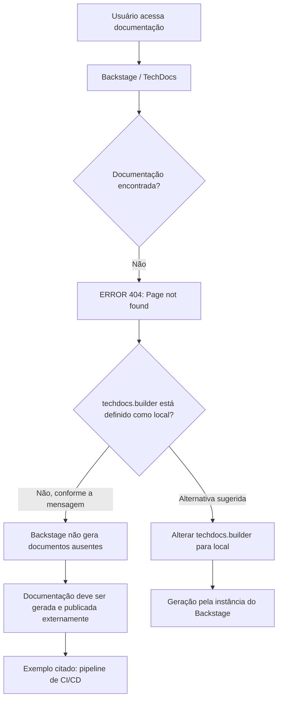

# Página de Erro 404 do Backstage TechDocs — Documentação Não Encontrada

## 1. Metadados do Documento
- **Arquivo de Origem:** Não identificado — conteúdo extraído fornecido como página única.
- **Tipo de Documento:** Procedimento / Página de erro operacional.
- **Domínio / Sistema:** Backstage TechDocs; portal “CF Home Solutions APIs Documentation Zeus”.
- **Público-Alvo:** Desenvolvedores, Arquitetos, Operação e suporte da plataforma de documentação.
- **Data/Versão Identificada:** Não identificada.

---

## 2. Resumo Executivo & Contexto de Negócio

O conteúdo original é uma página de erro `ERROR 404` do Backstage TechDocs, indicando que uma página de documentação não foi encontrada. A interface apresentada pertence a um portal que exibe as áreas “Home”, “Solutions”, “APIs”, “Documentation” e “Zeus”.

A mensagem informa que a configuração `techdocs.builder` não está definida como `local`. Nessa condição, a instância do Backstage não gera documentação internamente quando os documentos não são encontrados.

Como alternativa, o conteúdo recomenda assegurar que a documentação do projeto seja gerada e publicada por um processo externo, como um pipeline de CI/CD. Também é indicada a possibilidade de alterar `techdocs.builder` para `local`, permitindo a geração de documentos pela própria instância do Backstage.

O material não fornece identificação do projeto afetado, caminho da página ausente, configuração completa do Backstage, detalhes do pipeline de CI/CD, responsáveis pelo suporte ou procedimento operacional de correção.

---

## 3. Arquitetura, Componentes & Tecnologias Envolvidas

Os elementos explicitamente citados são:

| Componente / Tecnologia | Papel identificado |
| :--- | :--- |
| Backstage | Aplicação que apresenta a página de erro e hospeda a experiência de documentação. |
| TechDocs | Componente de documentação citado pela configuração `techdocs.builder`. |
| `techdocs.builder` | Configuração que, segundo a mensagem, não está definida como `local`. |
| CI/CD pipeline | Exemplo de processo externo para gerar e publicar a documentação do projeto. |
| Documentação do projeto | Artefato que precisa estar gerado e publicado externamente quando o builder não é local. |
| Portal “CF Home Solutions APIs Documentation Zeus” | Contexto de navegação exibido na página de erro. |
| Contact support | Opção textual apresentada para reportar possível defeito. |



**Nota de Análise:** O conteúdo não detalha como configurar `techdocs.builder`, qual mecanismo externo publica a documentação, onde a documentação é armazenada, nem quais comandos ou pipelines devem ser utilizados.

---

## 4. Regras de Negócio, Especificações Funcionais & Processos

1. A tentativa de acesso resulta em `ERROR 404: Page not found`.
2. A mensagem associa o problema à indisponibilidade de documentação no Backstage TechDocs.
3. A configuração `techdocs.builder` não está definida como `local`.
4. Quando `techdocs.builder` não está definido como `local`, a instância do Backstage não gera documentos que não foram encontrados.
5. Nesse cenário, a documentação do projeto deve ser gerada e publicada por um processo externo.
6. Um pipeline de CI/CD é citado como exemplo de processo externo de geração e publicação.
7. Como alternativa, a mensagem sugere alterar `techdocs.builder` para `local`, para permitir a geração de documentação a partir da instância do Backstage.
8. A página oferece retorno à navegação (“Go back”) e orientação para contatar o suporte em caso de possível defeito.

**Nota de Análise:** Não há regras adicionais sobre autorização, ambientes, URLs, contratos de API, métodos HTTP, formatos de publicação ou critérios para distinguir uma documentação ausente de uma falha de publicação.

---

## 5. Tabelas de Parâmetros, Ambientes e Estruturas de Dados

| Item / Parâmetro | Descrição / Função | Tipo / Valores / Formato | Ambiente / Observações |
| :--- | :--- | :--- | :--- |
| `ERROR 404` | Indica que a página solicitada não foi encontrada. | Código de erro exibido como texto. | Página apresentada pelo Backstage TechDocs. |
| `techdocs.builder` | Configuração relacionada à geração da documentação pelo TechDocs. | Valor citado: `local`. | A mensagem afirma que não está configurado como `local`. |
| `local` | Valor sugerido para `techdocs.builder`. | Valor de configuração. | Permitiria gerar documentos na instância do Backstage, segundo a mensagem. |
| Processo externo | Processo responsável por gerar e publicar a documentação. | Não especificado. | Necessário quando a documentação não é encontrada e o builder não é local. |
| CI/CD pipeline | Exemplo de processo externo mencionado. | Pipeline de integração e entrega contínuas. | Citado como exemplo, sem detalhes de implementação. |
| “contact support” | Orientação para contato em caso de possível defeito. | Texto de interface. | Não há contato, equipe ou canal especificado. |
| “CF” | Texto exibido no rodapé/navegação da página. | Sigla ou rótulo não definido. | Significado não detalhado no conteúdo. |
| “Zeus” | Texto exibido na navegação da página. | Nome ou rótulo não definido. | Função não detalhada no conteúdo. |

---

## 6. Bateria de Perguntas & Respostas para RAG (FAQ Sintético)

### P1: Qual erro é exibido ao acessar a documentação?
**R:** A página exibe `ERROR 404: Page not found`, informando que a página de documentação solicitada não foi encontrada.

### P2: Por que o Backstage não gera a documentação ausente automaticamente?
**R:** Segundo a mensagem exibida, `techdocs.builder` não está definido como `local`. Por isso, essa instância do Backstage não gera documentos quando eles não são encontrados.

### P3: O que deve ocorrer com a documentação quando `techdocs.builder` não está configurado como `local`?
**R:** A documentação do projeto deve ser gerada e publicada por algum processo externo. O texto cita um pipeline de CI/CD como exemplo desse processo externo.

### P4: Qual alternativa é sugerida para gerar a documentação pelo próprio Backstage?
**R:** A mensagem sugere alterar a configuração `techdocs.builder` para `local`, permitindo que a instância do Backstage gere a documentação.

### P5: O conteúdo informa como alterar o parâmetro `techdocs.builder`?
**R:** Não. O conteúdo apenas sugere alterar `techdocs.builder` para `local`; não apresenta arquivo de configuração, sintaxe, comando ou procedimento para realizar a alteração.

### P6: O documento identifica qual projeto possui documentação ausente?
**R:** Não. A página apresenta navegação com “CF Home Solutions APIs Documentation Zeus”, mas não identifica de forma explícita o projeto ou a página de documentação ausente.

### P7: Qual processo externo é citado para publicação da documentação?
**R:** Um pipeline de CI/CD é citado como exemplo de processo externo que pode gerar e publicar a documentação do projeto.

### P8: Há um canal de suporte especificado para reportar o erro?
**R:** Não. A página mostra a orientação “contact support” para o caso de possível defeito, mas não informa equipe, e-mail, URL ou outro canal de contato.

### P9: O erro 404 comprova que houve falha no pipeline de CI/CD?
**R:** Não. O texto informa apenas que a página não foi encontrada e que a documentação deve ser gerada e publicada externamente quando o builder não é local. Não atribui a causa a uma falha específica de CI/CD.

### P10: Quais opções de recuperação são apresentadas ao usuário?
**R:** A página apresenta a opção de retornar (“Go back”) e a orientação para contatar o suporte se o usuário considerar que existe um defeito.

---

## 7. Glossário de Termos, Siglas & Conceitos-Chave

- **404:** Código de erro exibido para indicar que a página não foi encontrada.
- **Backstage:** Aplicação citada na mensagem como a instância que não gerará documentos ausentes quando `techdocs.builder` não está configurado como `local`.
- **TechDocs:** Componente de documentação referido pela configuração `techdocs.builder`.
- **`techdocs.builder`:** Parâmetro de configuração citado na mensagem de erro.
- **`local`:** Valor sugerido para `techdocs.builder`, associado à geração de documentação pela instância do Backstage.
- **CI/CD:** Sigla exibida no termo “CI/CD pipeline”; o documento não expande a sigla.
- **Pipeline de CI/CD:** Exemplo de processo externo para geração e publicação de documentação.
- **CF:** Rótulo apresentado na página; significado não identificado no conteúdo.
- **Zeus:** Rótulo apresentado na navegação; significado não identificado no conteúdo.

---

## 8. Notas Críticas, Riscos & Limitações

- A documentação solicitada não está disponível no momento do acesso, resultando em erro 404.
- A instância do Backstage, conforme a mensagem, não gera documentos ausentes porque `techdocs.builder` não está definido como `local`.
- A disponibilidade da documentação depende de um processo externo de geração e publicação, possivelmente um pipeline de CI/CD.
- O documento não permite determinar se a causa é ausência de geração, ausência de publicação, referência incorreta, falha de acesso ou outro problema.
- Não há detalhes sobre configuração, repositório, ambiente, responsáveis, armazenamento de artefatos, logs, URLs, permissões ou procedimento de suporte.
- **Nota de Análise:** Os termos “CF” e “Zeus” aparecem na navegação, mas o conteúdo não define seus significados ou sua relação com o erro.

---

## 9. Conteúdo Bruto Estruturado (Referência Fiel)

```text
--- [PÁGINA 1 DE 1] ---

ERROR 404: j: Page not found.
Note that techdocs.builder is not set to 'local' in
your config, which means this Backstage app will
not generate docs if they are not found. Make sure
the project's docs are generated and published by
some external process (e.g. CI/CD pipeline). Or
change techdocs.builder to 'local' to generate docs
from this Backstage instance.
Looks like someone
dropped the mic!
Go back... or please  if you
think this is a bug.
contact support
 / 
 CF
Home Solutions APIs Documentation Zeus
EN
```
