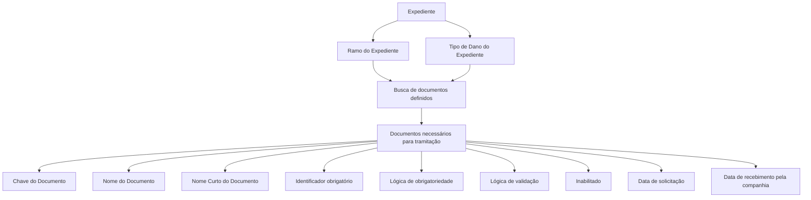

# Definição de Documentos para Tramitação de Expedientes

## 1. Metadados do Documento
- **Arquivo de Origem:** Não identificado no conteúdo fornecido
- **Tipo de Documento:** Não identificado; conteúdo com definição funcional de documentos para tramitação de expedientes
- **Domínio / Sistema:** Documentação de expedientes, ramos e tipos de dano
- **Público-Alvo:** Negócio, analistas funcionais e equipes responsáveis pela tramitação de expedientes
- **Data/Versão Identificada:** Não identificada

---

## 2. Resumo Executivo & Contexto de Negócio

O documento define os documentos que podem ser necessários para a tramitação de diferentes tipos de expedientes. O objetivo declarado é estabelecer a documentação aplicável ao processo, considerando tanto propriedades comuns quanto propriedades específicas conforme o ramo e/ou o tipo de expediente.

A definição de documentos é baseada em atributos gerais que não mudam por ramo. Entre esses atributos está a propriedade **Documento**, que funciona como a chave de identificação dos documentos necessários para tramitar um expediente. Uma mesma chave pode ser utilizada por um ou mais ramos.

O conteúdo também diferencia a descrição longa do documento da descrição curta. O **Nome do Documento** é destinado a comunicações que solicitam documentos necessários, enquanto o **Nome Curto do Documento** é utilizado por programas que solicitam documentos.

Além de propriedades de identificação, o documento descreve controles de obrigatoriedade e validação do identificador do documento. A obrigatoriedade pode depender de lógica de negócio e de outros parâmetros; a validação também pode depender de fórmula ou formato preestabelecido.

O processo preserva as datas de solicitação e de recebimento dos documentos pela companhia. Quando documentos são solicitados para um expediente, devem ser buscados todos os documentos definidos para o ramo e para o tipo de dano associado ao expediente.

---

## 3. Arquitetura, Componentes & Tecnologias Envolvidas

O conteúdo fornecido não especifica tecnologias, microsserviços, APIs, bancos de dados, servidores, ambientes, protocolos ou contratos de integração.

Os componentes funcionais identificados são:

- **Documento:** chave que identifica os documentos necessários à tramitação de um expediente.
- **Ramo:** elemento ao qual uma chave de documento pode estar associada.
- **Tipo de Expediente:** elemento que pode possuir propriedades específicas de documentação.
- **Tipo de Dano:** critério utilizado, juntamente com o ramo, para buscar documentos definidos para um expediente.
- **Expediente:** entidade para a qual documentos podem ser solicitados.
- **Identificador do Documento:** informação cuja obrigatoriedade e validação podem ser determinadas por lógica de negócio.
- **Lógica de Negócio:** lógica usada para determinar a obrigatoriedade do identificador e validar o respectivo formato ou fórmula.
- **Estado de Inabilitação:** propriedade que indica se um documento definido está habilitado para associação a ramos e/ou tipos de expediente.



> **Nota de Análise:** O documento apresenta uma estrutura funcional de definição e solicitação de documentos, mas não detalha a persistência dos dados, os atores responsáveis, métodos de integração, interfaces de usuário, formatos de mensagens ou regras executáveis da lógica de negócio.

---

## 4. Regras de Negócio, Especificações Funcionais & Processos

### 4.1 Finalidade da definição de documentos

1. Devem ser definidos todos os documentos que possam ser necessários para a tramitação dos diferentes tipos de expedientes.
2. A estrutura de documentação deve contemplar:
   - propriedades comuns para todos os ramos e tipos de expediente;
   - propriedades próprias de cada ramo;
   - propriedades próprias de cada tipo de expediente.

### 4.2 Propriedades gerais

1. As propriedades gerais correspondem aos atributos comuns que não mudam por ramo.
2. A propriedade **Documento** deve ser utilizada como chave de identificação dos documentos necessários para tramitar um expediente.
3. Uma chave de documento pode ser utilizada para um ou mais ramos.
4. O **Nome do Documento** deve conter a descrição da chave definida para o documento.
5. O Nome do Documento deve ser longo para permitir seu uso no envio de uma comunicação que solicite os documentos necessários.
6. O **Nome Curto do Documento** deve conter a descrição curta da chave definida para o documento.
7. A descrição curta deve ser utilizada pelos programas que solicitam os documentos.

### 4.3 Obrigatoriedade do identificador do documento

1. A propriedade **Identificador do Documento é Obrigatório** deve indicar se a identificação do documento precisa ser informada quando o documento for recebido.
2. A obrigatoriedade do identificador pode ser determinada por uma lógica de negócio.
3. A lógica de negócio deve contemplar casos em que o registro do identificador é obrigatório ou não obrigatório.
4. A decisão de obrigatoriedade pode depender de outros parâmetros.

### 4.4 Validação do identificador do documento

1. A propriedade **Lógica que valida o Identificador do Documento** deve conter a lógica de negócio destinada à validação do identificador.
2. A validação pode aplicar-se quando o identificador tiver fórmula preestabelecida.
3. A validação pode aplicar-se quando o identificador tiver formato preestabelecido.

### 4.5 Habilitação de documentos

1. A propriedade **Inabilitado** deve indicar se o documento definido está habilitado para associação.
2. O estado de habilitação é relevante para associar o documento aos diferentes ramos e/ou tipos de expediente.

### 4.6 Solicitação e recebimento de documentos

1. Quando documentos forem solicitados, deve ser guardada a data em que cada documento foi solicitado.
2. Também deve ser guardada a data em que cada documento foi recebido pela companhia.
3. É possível solicitar mais de um documento por expediente.
4. Ao solicitar documentos para um expediente, devem ser buscados todos os documentos definidos para:
   - o ramo do expediente;
   - o tipo de dano do expediente.

> **Nota de Análise:** O documento afirma que a obrigatoriedade e a validação podem depender de lógica de negócio e outros parâmetros, mas não descreve as regras, fórmulas, formatos, parâmetros ou critérios concretos que devem ser implementados.

---

## 5. Tabelas de Parâmetros, Ambientes e Estruturas de Dados

| Item / Parâmetro | Descrição / Função | Tipo / Valores / Formato | Ambiente / Observações |
| :--- | :--- | :--- | :--- |
| Documento | Chave usada para identificar documentos necessários para tramitar um expediente. | Chave de documento; formato não especificado. | Uma chave pode ser utilizada para um ou mais ramos. |
| Nome do Documento | Descrição da chave definida para o documento. | Descrição longa; formato não especificado. | Pode ser usada no envio de comunicação solicitando documentos necessários. |
| Nome Curto do Documento | Descrição curta da chave definida para o documento. | Descrição curta; formato não especificado. | Utilizada por programas que solicitam documentos. |
| Identificador do Documento é Obrigatório | Indica se a identificação do documento deve ser informada quando o documento for recebido. | Obrigatório ou não obrigatório; valores exatos não especificados. | Pode ser determinado por lógica de negócio. |
| Lógica que determina se o Identificador é obrigatório | Define casos em que registrar o identificador do documento é obrigatório ou não. | Lógica de negócio; regras não detalhadas. | Pode depender de outros parâmetros. |
| Lógica que valida o Identificador do Documento | Valida o identificador quando existir fórmula ou formato preestabelecido. | Lógica de negócio; fórmula ou formato não detalhados. | Não são apresentados exemplos de fórmulas ou formatos. |
| Inabilitado | Indica se o documento definido está habilitado para associação. | Estado de habilitação; valores exatos não especificados. | Aplicável à associação com ramos e/ou tipos de expediente. |
| Data de solicitação | Registra a data em que o documento foi solicitado. | Data; formato não especificado. | Deve ser guardada quando documentos forem solicitados. |
| Data de recebimento | Registra a data em que o documento foi recebido na companhia. | Data; formato não especificado. | Deve ser guardada juntamente com a data de solicitação. |
| Ramo | Critério associado à definição e à busca de documentos. | Não especificado. | Uma chave de documento pode ser usada por um ou mais ramos. |
| Tipo de Expediente | Elemento que pode possuir propriedades próprias de documentação. | Não especificado. | O documento não detalha os tipos existentes. |
| Tipo de Dano | Critério de busca de documentos para o expediente. | Não especificado. | A busca considera ramo e tipo de dano do expediente. |
| Expediente | Entidade para a qual documentos são solicitados e tramitados. | Não especificado. | Pode ter mais de um documento solicitado. |

> **Nota de Análise:** Não há no conteúdo fornecido informações sobre URLs, ambientes, servidores, variáveis de log, portas, credenciais, tecnologias de implementação ou estruturas de payload.

---

## 6. Bateria de Perguntas & Respostas para RAG (FAQ Sintético)

### P1: Qual é a finalidade da definição de documentos no processo de expedientes?
**R:** A finalidade é definir todos os documentos que possam ser necessários para a tramitação dos diferentes tipos de expedientes. A definição contempla propriedades comuns para todos os ramos e tipos de expediente, além de propriedades específicas de cada ramo e/ou tipo de expediente.

### P2: O que representa a propriedade Documento?
**R:** A propriedade Documento é a chave usada para identificar os documentos necessários para tramitar um expediente. Uma mesma chave pode ser utilizada para um ou mais ramos.

### P3: Qual é a diferença entre Nome do Documento e Nome Curto do Documento?
**R:** O Nome do Documento contém a descrição longa da chave definida para o documento e pode ser utilizado no envio de uma comunicação que solicite documentos necessários. O Nome Curto do Documento contém a descrição curta da chave e é utilizado pelos programas que solicitam documentos.

### P4: O identificador do documento sempre deve ser informado no recebimento?
**R:** Não necessariamente. A propriedade “Identificador do Documento é Obrigatório” indica se a identificação deve ser informada quando o documento for recebido. A obrigatoriedade pode depender de uma lógica de negócio e de outros parâmetros.

### P5: Como o identificador do documento deve ser validado?
**R:** O documento estabelece que deve existir uma lógica de negócio para validar o identificador do documento quando esse identificador possuir uma fórmula ou um formato preestabelecido. As fórmulas, os formatos e as regras concretas de validação não são detalhados.

### P6: O que significa a propriedade Inabilitado para um documento?
**R:** A propriedade Inabilitado indica se o documento definido está habilitado para poder ser associado aos diferentes ramos e/ou tipos de expediente.

### P7: Quais datas devem ser armazenadas durante a solicitação de documentos?
**R:** Devem ser guardadas a data em que o documento foi solicitado e a data em que o documento foi recebido pela companhia.

### P8: É possível solicitar mais de um documento para um mesmo expediente?
**R:** Sim. Quando documentos são solicitados para um expediente, devem ser buscados todos os documentos definidos para o ramo e para o tipo de dano associado ao expediente.

### P9: Quais critérios são usados para buscar documentos de um expediente?
**R:** A busca deve considerar todos os documentos definidos para o ramo e para o tipo de dano que o expediente possui.

### P10: O documento define os formatos de chave, identificador ou data?
**R:** Não. O conteúdo fornecido descreve a finalidade das propriedades Documento, Identificador do Documento e datas de solicitação e recebimento, mas não apresenta formatos técnicos, tamanhos, tipos de dados, exemplos de valores ou regras de preenchimento.

### P11: O documento detalha tecnologias, APIs ou sistemas responsáveis pela solicitação de documentos?
**R:** Não. O documento menciona que programas utilizam a descrição curta do documento para solicitar documentos, mas não identifica os programas, tecnologias, APIs, métodos HTTP, contratos JSON, bancos de dados ou integrações envolvidas.

---

## 7. Glossário de Termos, Siglas & Conceitos-Chave

- **Documento:** chave pela qual são identificados os documentos necessários para tramitar um expediente.
- **Expediente:** entidade processada cuja tramitação pode exigir a solicitação de um ou mais documentos.
- **Ramo:** classificação relacionada à definição e associação de documentos; uma chave de documento pode ser usada por um ou mais ramos.
- **Tipo de Expediente:** classificação para a qual podem existir propriedades específicas de documentação.
- **Tipo de Dano:** critério utilizado juntamente com o ramo para buscar documentos definidos para um expediente.
- **Identificador do Documento:** informação associada ao documento que pode ser obrigatória no recebimento e submetida a validação.
- **Lógica de Negócio:** lógica que determina se o identificador deve ser registrado e que pode validar seu formato ou fórmula.
- **Nome do Documento:** descrição longa da chave do documento, utilizável em comunicações de solicitação.
- **Nome Curto do Documento:** descrição curta da chave do documento, utilizável por programas que solicitam documentos.
- **Inabilitado:** propriedade que indica se um documento está habilitado para associação a ramos e/ou tipos de expediente.
- **Companhia:** organização que recebe os documentos solicitados, conforme o texto fornecido.

---

## 8. Notas Críticas, Riscos & Limitações

- O documento não identifica o arquivo de origem, a data, a versão, a autoria ou o sistema corporativo responsável pela gestão de documentos.
- Não são apresentados modelos de dados, campos obrigatórios, tipos de dados, limites de tamanho, valores permitidos ou chaves de relacionamento.
- A lógica de obrigatoriedade do identificador é mencionada, mas suas condições, parâmetros dependentes e regras de decisão não são detalhados.
- A lógica de validação do identificador é mencionada, mas não há fórmulas, máscaras, padrões, exemplos ou mensagens de erro.
- O estado **Inabilitado** é descrito conceitualmente, mas não são especificados valores possíveis, comportamento operacional ou impacto em documentos já associados.
- O documento informa que a busca de documentos considera ramo e tipo de dano, mas não define precedência, critérios de conflito, deduplicação ou tratamento para ausência de documentos definidos.
- Não há detalhamento sobre os programas que solicitam documentos, interfaces, integrações, notificações, armazenamento, auditoria, segurança, perfis de acesso ou rastreabilidade.
- Não foram fornecidos exemplos legíveis após a seção “Ejemplo”; o conteúdo contém apenas repetições da palavra “Ejemplo”.
- A presença do texto “Home Solutions APIs Documentation Zeus” não é explicada pelo conteúdo fornecido; não é possível afirmar que seja o nome do sistema, produto, ambiente ou repositório documental.

---

## 9. Conteúdo Bruto Estruturado (Referência Fiel)

```text
--- [PÁGINA 1 DE 3] ---

DEFINICIÓN de Documentos
Objetivo
La finalidad es definir todos los documentos (documentación) que puedan ser necesarios para la
tramitación de los diferentes tipos de expedientes.
Tendremos propiedades que serán comunes para todos los ramos y tipos de Expedientes y otras
propiedades que serán propias de cada Ramo y/o Tipo de Expediente.
Propiedades Generales
Propiedades Generales
En este apartado se detallarán todos los atributos, propiedades comunes, es decir los atributos que
no cambian por ramo.
Documento
Esta propiedad será la clave por la que se va a identificar los documentos necesarios para tramitar
un expediente.
Una clave podrá ser utilizada para uno o varios ramos.
Nombre del Documento
Esta propiedad contendrá la descripción de la clave definida para el documento.
Este Nombre es largo para que pueda ser utilizado, para el envío de una comunicación solicitando
los documentos necesarios.
 /
 CF
Home Solutions APIs Documentation Zeus
EN


--- [PÁGINA 2 DE 3] ---

Nombre Corto del Documento
Esta propiedad contendrá la descripción de la clave corta, definida para el documento.
Esta descripción corta será utilizada, para los programas que solicitan los documentos.
Identificador del Documento es Obligatorio
Esta propiedad contendrá si la identificación del documento cuando se reciba es obligatorio
introducirlo o No.
Lógica que determina si el Identificador es obligatorio
Esta propiedad contendrá una lógica de Negocio, para los casos en el que la obligatoriedad de
registrar el identificador del documento sea obligatorio o no, dependiendo de otros parámetros,
Lógica que valida el Identificador del Documento
Esta propiedad contendrá una lógica de Negocio, para validar el identificador del documento, si este
tiene una fórmula o un formato preestablecido.
Inhabilitado
Esta propiedad indica si el Documento que está definido, está habilitado para poder asociarlo a los
diferentes Ramos y/o Tipos de Expediente.
Preguntas frecuentes
¿Cuándo se soliciten los documentos, se guardará la fecha de cuando se solicitó dicho
documento?
Si, quedará guardada tanto la fecha de cuando se solicita, como la fecha de cuando se recibió en
la compañía.
Ejemplo:
Ejemplo:
Ejemplo:
Ejemplo:
Ejemplo:


--- [PÁGINA 3 DE 3] ---

¿Se van a poder solicitar más de un documento por Expediente?
Si, cuando se soliciten los documentos para un expediente, se buscarán todos los documentos
que estén definidos para el Ramo y el Tipo de Daño que tenga el expediente.
```
